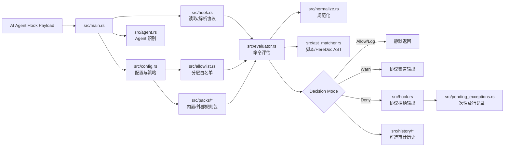
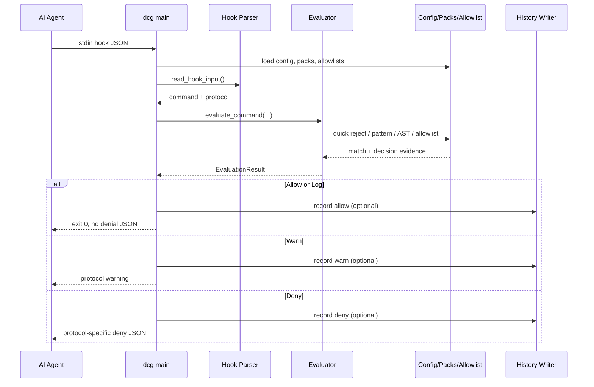
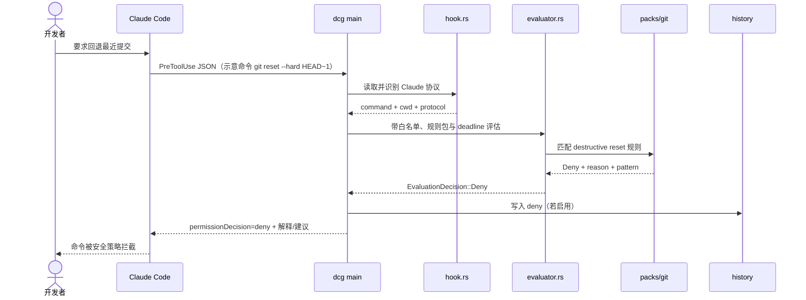

# Dicklesworthstone/destructive_command_guard 项目深度解析

## 1. 项目概览

- 报告日期：2026-07-14
- 仓库地址：https://github.com/Dicklesworthstone/destructive_command_guard
- Trending 原始排名：02
- Stars Today：1,295
- 项目定位：面向 AI 编程代理的命令执行前安全钩子与审计工具。
- 解决的问题：AI Agent 拥有 Shell 权限后，可能误执行删除文件、覆盖 Git 状态、破坏数据库或云资源的命令；DCG 在命令真正运行前做规则评估并返回 allow / warn / deny。
- 目标用户：使用 Claude Code、Codex CLI、Gemini CLI、Copilot CLI、Cursor 等高权限编程 Agent 的个人与团队。
- 当前成熟度：生产候选。功能、测试、规则包和多 Agent 协议已经较完整，但安全工具仍需按组织策略审查配置与 fail-open 边界。
- 推荐结论：值得接入高权限 Agent 的开发环境做第二道防线，但不能替代最小权限、备份、Git 保护和人工审批。

## 2. 系统架构

### 2.1 架构概览

DCG 的主进程既是 CLI，也是 Agent hook 入口。无子命令时，它从标准输入读取不同 Agent 的 hook payload，识别协议并提取命令；随后加载配置、分层白名单、内置与外部规则包，使用关键词快速筛选、正则和 AST 解析进行评估。评估结果再经过策略模式、置信评分和少量上下文例外处理，最终输出协议对应的拒绝 JSON、警告或静默放行。可选历史模块把每次判定写入 FrankenSQLite；pending exception 模块为被拦截命令生成一次性放行记录。

### 2.2 架构图

### 2.3 核心模块

| 模块 | 职责 | 代码位置 | 关键依赖 | 证据级别 |
|---|---|---|---|---|
| 进程入口与总编排 | 解析 CLI、加载配置、读取 hook 输入、调用评估、处理最终模式 | `src/main.rs` | Clap、Config、Evaluator、Hook | High |
| Hook 协议层 | 读取 JSON、识别 Claude/Codex/Gemini/Copilot 等协议、提取命令、输出拒绝或警告 | `src/hook.rs` | serde_json、协议结构体 | High |
| 评估器 | 执行快速过滤、规则包匹配、白名单覆盖、HereDoc/AST 判断并形成 PatternMatch | `src/evaluator.rs` | regex、Aho-Corasick、ast-grep | High |
| 规则包注册表 | 管理 Git、文件系统、数据库、云平台等规则及优先顺序 | `src/packs/` | YAML/内置 Rust 定义 | High |
| 分层白名单 | 合并项目、用户、系统和 Agent 专属白名单 | `src/allowlist.rs` | 路径与模式匹配 | High |
| 配置与策略 | 读取 TOML、Agent profile、fail-closed、超时、history、confidence 等 | `src/config.rs` | toml、schemars | High |
| AST 解析 | 深入分析 HereDoc 与内联 Bash/Python/JS 等脚本内容 | `src/ast_matcher.rs` | ast-grep/tree-sitter | High |
| 历史记录 | 记录命令、判定、规则、耗时和白名单来源 | `src/history/` | fsqlite、gzip | High |
| 输出层 | 在 stdout 维持机器协议，在 stderr 提供人类可读提示 | `src/output/`、`src/hook.rs` | colored、rich_rust | High |
| 一次性例外 | 保存被拦截命令哈希和短码，支持受控临时放行 | `src/pending_exceptions.rs` | SHA-256、HMAC、文件存储 | High |
| MCP 服务 | 提供 MCP stdio 能力 | `src/mcp.rs` | rust-mcp-sdk、tokio | Medium |

### 2.4 数据与状态管理

- 配置：主要由 TOML 文件和环境变量构成，运行时编译 overrides 并计算 Agent 专属 profile。
- 规则状态：内置 packs 在注册表中，外部 YAML packs 由自定义路径加载；仅在进程生命周期内缓存。
- 历史：启用时写入 FrankenSQLite，记录命令、工作目录、结果、规则包、模式名和耗时。
- 一次性放行：被拒绝命令可写入 pending exception store，使用命令内容和工作目录等生成哈希/短码。
- 默认不存在远程数据库、消息队列或云控制面；这些不应画进主架构。

### 2.5 外部集成与协议

- Agent hook 协议：Claude-compatible、Codex、Gemini、Copilot、Hermes、Grok、Antigravity 等。
- 标准输入/输出：stdin 接收 JSON；stdout 返回 Agent 可识别的决策 JSON或保持空输出；stderr 展示人类提示。
- MCP：Cargo 依赖显示可选的 stdio server 实现。
- 文件系统与 Git：用于工作目录判断、rebase recovery、配置、规则和历史存储。

### 2.6 部署与运行形态

- 主要形态：单个 Rust CLI 二进制 `dcg`，注册为 Agent 的 pre-execution hook。
- 直接 CLI：提供 `test`、`explain`、`scan`、配置和历史等子命令。
- 不需要常驻 Web 服务；每个工具调用可启动一次 hook 进程。
- Release profile 使用 LTO、单 codegen unit、strip 和 panic=abort，侧重小体积与低启动开销。

## 3. 主线流程

### 3.1 核心流程图

### 3.2 关键步骤

1. `main()` 先处理 CLI 子命令；没有子命令时进入 hook 模式并加载 `Config`。
2. `hook::read_hook_input(max_input_bytes)` 从 stdin 解析 payload；解析失败默认 fail-open，配置 fail-closed 且属于恶意可控错误时可以拒绝。
3. `extract_command_with_protocol()` 从不同 Agent payload 提取 Bash 命令并确定返回协议。
4. 加载项目/用户/系统白名单、Agent profile、内置和外部 packs，建立 enabled keywords 和 pack 顺序。
5. `evaluate_command_with_pack_order_deadline_at_path()` 在预算内执行快速筛选、规范化、规则与 AST 匹配、白名单覆盖。
6. 对匹配结果解析 `DecisionMode`，再应用 confidence scoring、rebase recovery 等有限上下文修正。
7. Allow 静默返回；Warn 输出警告；Deny 记录 pending exception 并通过 `output_denial_for_protocol()` 返回机器可读拒绝。

### 3.3 异常与失败处理

- Hook JSON 解析失败：默认 fail-open 并可记录历史；启用 fail-closed 后，JSON 错误和超大输入会返回拒绝。
- 读取 I/O 瞬时错误：即使 fail-closed 也保留 fail-open，避免 hook 自身故障把开发流程完全锁死。
- 命令超过配置上限：当前代码路径警告后放行，属于需要组织明确评估的边界。
- 评估超出 deadline：记录 budget skip 后放行。
- Deny 结果缺少 `pattern_info`：结构异常时 fail-open。
- history、外部 pack、self-heal 等辅助功能多采用 best-effort，不应让安全钩子因辅助失败崩溃。

## 4. 典型业务场景端到端执行链路

### 4.1 场景定义

| 项目 | 内容 |
|---|---|
| 场景名称 | Claude Code 准备执行 `git reset --hard HEAD~1`，DCG 在执行前拒绝并返回原因 |
| 参与者 | 开发者、Claude Code、DCG hook、配置/规则包、可选 history store |
| 前置条件 | `dcg` 已安装并注册到 Claude Code `PreToolUse` 的 Bash matcher；Git 规则包启用 |
| 输入 | 示意 hook payload：工具为 Bash，命令为 `git reset --hard HEAD~1`，包含当前工作目录 |
| 期望结果 | 危险 Git 命令未被 Shell 执行；Agent 收到 deny 及风险解释；可选历史中写入 deny 记录 |
| 成功判定 | Claude Code 不执行目标命令，stdout 返回协议要求的 `permissionDecision: deny`，工作区状态不被修改 |

### 4.2 端到端时序图

### 4.3 执行步骤追踪

| 步骤 | 输入 | 执行组件 | 关键代码位置 | 状态或数据变化 | 输出 | 失败分支 | 证据级别 |
|---:|---|---|---|---|---|---|---|
| 1 | 开发者目标 | Claude Code | Agent 外部行为 | Agent 形成 Bash 工具调用 | Hook payload | Agent 未调用 Bash 时链路不触发 | Medium |
| 2 | stdin JSON | `hook::read_hook_input` | `src/main.rs`、`src/hook.rs` | 仅内存解析，无业务持久化 | `HookInput` | JSON 错误默认放行；fail-closed 可拒绝 | High |
| 3 | `HookInput` | `extract_command_with_protocol` | `src/main.rs`、`src/hook.rs` | 识别协议与命令字符串 | command、protocol | 无命令则直接返回 | High |
| 4 | command + config | pack/allowlist 准备 | `src/main.rs`、`src/config.rs`、`src/packs/` | 构建 enabled packs、keywords、ordered packs | 评估上下文 | 外部 pack 错误仅告警并继续 | High |
| 5 | `git reset --hard...` | evaluator | `src/evaluator.rs` | 规范化并形成 pattern match | Deny result | deadline 超限或结构异常可能 fail-open | High |
| 6 | Deny result | policy/confidence/recovery | `src/main.rs` | 解析模式；本场景无 recovery 例外 | DecisionMode::Deny | 命中特殊 rebase recovery 时可转 allow | High |
| 7 | Deny + command | pending exception/history | `src/main.rs`、`src/pending_exceptions.rs`、`src/history/` | 可选写历史和一次性放行记录 | short code、审计记录 | 写入失败不阻止拒绝输出 | High |
| 8 | deny 数据 | hook output | `src/main.rs`、`src/hook.rs` | stdout 产生协议 JSON；Git 工作区未变化 | Agent 收到拒绝 | 协议映射错误会影响 Agent 识别 | High |

### 4.4 关键状态与数据变化

- 命令在 DCG 内部只作为字符串和匹配上下文处理，没有被执行。
- Git 仓库状态在成功拦截时不发生变化。
- 若启用 history，新增一条 outcome=deny 的记录，附带 pack、pattern、工作目录和评估耗时。
- 若 pending exception store 可写，新增命令哈希和短码，供用户有意识地临时放行。

### 4.5 失败传播、重试与回滚

- 解析失败默认向 Agent 表现为允许；严格环境应启用并测试 fail-closed，但要接受 hook 输入兼容性错误会阻断工作。
- 规则误报时，用户可以使用项目/用户/系统白名单或一次性放行机制；这属于显式策略调整，不是自动重试。
- 如果危险命令已绕过 hook 并执行，DCG 本身不负责回滚；恢复依赖 Git、备份或目标系统的恢复机制。
- 外部 pack 或 history 失败不会自动升级为 deny，以免辅助系统故障造成全面停工。

### 4.6 最终业务结果

开发者得到的是一个“命令尚未执行”的明确拦截结果，而不是事后日志。Agent 可以根据拒绝原因改用更安全的命令，开发者也能通过历史或短码追踪为什么被挡。真正的业务价值是把高风险操作从不可逆后果，前移成一次可审查的决策。

### 4.7 最小复现与验证方法

1. 按 README 安装 `dcg`，确认 Agent 设置中已注册 pre-execution hook。
2. 先运行 `dcg test 'git reset --hard HEAD~1'` 或仓库提供的 explain/test 子命令，确认规则命中。
3. 在临时 Git 仓库中让 Agent提出同一命令，观察 Agent 未执行且收到 deny。
4. 检查 `git status`、HEAD 与未提交文件，确认状态没有变化。
5. 启用 history 后查询对应记录，核对 command、outcome、pack 和 pattern。
6. 再用一个安全命令验证 allow 路径，避免把“hook 整体坏了”误判成“安全策略有效”。

## 5. 技术栈

| 层次 | 技术 | 用途 | 是否核心 | 证据位置 |
|---|---|---|---|---|
| 语言与运行时 | Rust 2024，rust-version 1.85 | 低延迟 CLI 与内存安全 | 是 | `Cargo.toml` |
| CLI | Clap | 参数、子命令与环境变量 | 是 | `Cargo.toml`、`src/cli.rs` |
| 数据格式 | serde、serde_json、TOML、YAML | hook 协议、配置、外部规则包 | 是 | `Cargo.toml` |
| 匹配引擎 | regex、fancy-regex、Aho-Corasick、memchr | 快速筛选和模式检测 | 是 | `Cargo.toml`、`src/evaluator.rs` |
| AST | ast-grep + 多语言 tree-sitter | HereDoc/内联脚本深度分析 | 是 | `Cargo.toml`、`src/ast_matcher.rs` |
| 状态与审计 | FrankenSQLite、gzip | 可选命令历史和导出 | 否 | `Cargo.toml`、`src/history/` |
| 协议 | Agent hook JSON、MCP stdio | 多 Agent 集成与工具服务 | 是/可选 | `src/hook.rs`、`src/mcp.rs` |
| 终端体验 | colored、ratatui、indicatif、rich_rust | 人类可读提示和 TUI | 否 | `Cargo.toml`、`src/output/` |
| 安全辅助 | SHA-256、HMAC | pending exception 哈希与短码强化 | 否 | `Cargo.toml`、`src/pending_exceptions.rs` |

## 6. 创新点

### 创新点 1

- 类型：架构创新 / 工作流创新
- 传统方案：依赖 Agent 自己遵守 Prompt，或在命令执行后从日志发现事故。
- 当前方案：把安全决策放到标准化 pre-execution hook，命令执行前独立判断。
- 实际收益：模型即使产生危险命令，也需要经过外部确定性策略层。
- 证据：`src/main.rs` hook 模式、协议输出和 README 集成配置。
- 局限：未接入 hook 的工具、绕过 Shell 的操作或规则未覆盖的命令仍可能逃逸。

### 创新点 2

- 类型：性能创新
- 传统方案：每条命令都跑完整复杂正则或启动重量级分析。
- 当前方案：关键词 quick reject、静态编译规则、memchr/Aho-Corasick，再对可疑命令做深度匹配。
- 实际收益：适应每次 Bash 调用都要经过的低延迟路径。
- 证据：`src/main.rs` 性能说明、`Cargo.toml` 依赖、evaluator 调用。
- 局限：性能预算超限时存在放行分支，安全与可用性需要组织自行取舍。

### 创新点 3

- 类型：协议创新 / 工程整合创新
- 传统方案：为每个 Agent 单独写安全脚本和输出格式。
- 当前方案：统一评估内核，按 Claude、Codex、Gemini、Copilot 等协议适配输入输出。
- 实际收益：一套规则可以覆盖多种 Agent 工具链。
- 证据：`history_agent_type_for_protocol`、`effective_agent_for_hook_protocol`、`output_denial_for_protocol`。
- 局限：Agent 协议变化会带来兼容维护成本。

## 7. 应用场景

### 适合

- 开发者允许 AI Agent 在真实仓库执行 Bash。
- 团队希望统一阻止高风险 Git、删除、数据库和云命令。
- 需要保留命令判定历史，支持安全复盘。

### 可以尝试

- CI 或共享开发机中的 Agent 自动化，但需先做非交互和 fail-closed 测试。
- 自定义内部规则包和组织白名单。
- 通过 MCP 或 scan 模式扩展到更多流程。

### 暂不建议

- 把 DCG 当作唯一安全边界，允许 Agent 获得无限系统权限。
- 未验证规则和白名单就直接部署到关键生产运维环境。
- 需要形式化证明或强隔离的高风险系统；应结合沙箱、容器、只读凭据和审批。

## 8. 第一次阅读与验证建议

1. 先读 README 的 hook 机制、支持 Agent 与 fail-open/fail-closed 说明。
2. 看 `Cargo.toml` 理解二进制入口和依赖边界。
3. 顺着 `src/main.rs` 的 hook 路径读到 `src/hook.rs` 与 `src/evaluator.rs`。
4. 选择一条 Git 和一条文件删除规则，在临时仓库用 `dcg test/explain` 验证。
5. 再查看 `src/packs/`、`src/allowlist.rs` 和 `src/history/`，理解策略扩展与审计。
6. 用安全/危险/解析错误/超长输入四类用例验证端到端链路。

## 9. 风险与限制

- 安全：规则匹配不是 Shell 语义的完整证明；未覆盖语法、编码混淆、间接工具调用仍可能绕过。
- 性能：低延迟设计明确，但 deadline 超限采用 fail-open，需要评估是否符合组织风险偏好。
- 许可证：MIT。
- 维护状态：仓库活跃、功能面广；规则和 Agent 协议越多，回归测试压力越大。
- 生产可用性：可作为纵深防御组件，不应替代最小权限、隔离环境、备份与人工审批。

## 10. Evidence Notes

- `Cargo.toml`：包版本 0.6.6、Rust 2024、`dcg` 二进制入口、匹配/AST/MCP/history/TUI 依赖。
- `src/main.rs`：hook 输入、协议选择、配置和 packs、deadline、evaluator、allow/warn/deny、history、pending exception。
- `src/hook.rs`：不同 Agent payload 与输出协议（依据入口调用与仓库模块结构，具体字段应继续逐项审阅）。
- `src/evaluator.rs`：评估入口与 PatternMatch 形成（依据入口调用，完整规则优先级仍需代码走读）。
- `src/packs/`、`src/allowlist.rs`、`src/history/`：规则、例外和审计边界。

## 11. Honest Caveat

本报告定位了真实入口和关键分支，但没有逐一审计所有内置规则包，也没有在本次任务环境中编译运行二进制。对“覆盖多少危险命令”“误报率多少”“平均延迟多少”的判断不能仅凭维护者说明，应通过组织自己的命令语料、平台和 Agent 版本测试。

## 12. 可信度

- Architecture Confidence: High
- Flow Confidence: High
- Innovation Confidence: Medium
