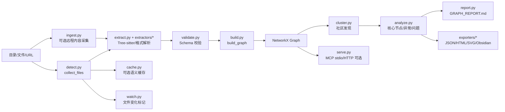
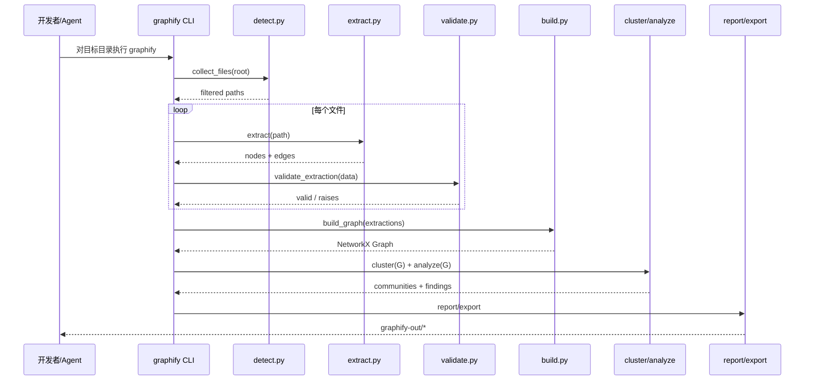
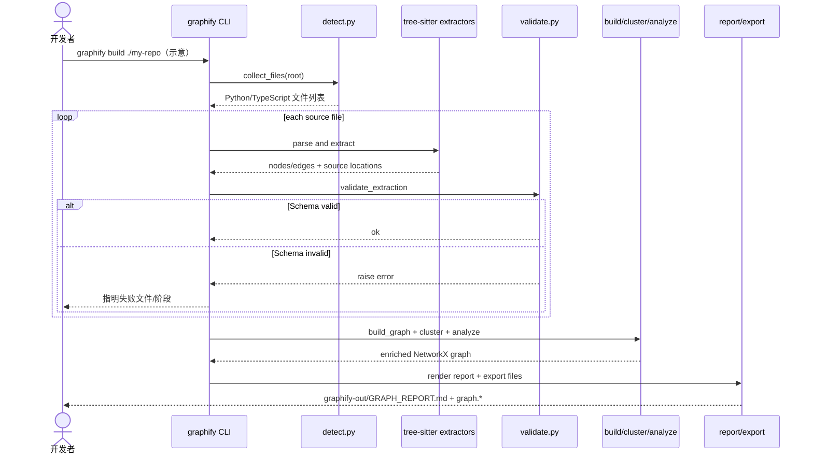

# Graphify-Labs/graphify 项目深度解析

## 1. 项目概览

- 报告日期：2026-07-14
- 仓库地址：https://github.com/Graphify-Labs/graphify
- Trending 原始排名：08
- Stars Today：1,095
- 项目定位：将代码、文档、论文、图片和视频转换为可查询知识图谱的 Python 工具与 AI 编程 Skill。
- 解决的问题：大型项目和异构资料的关系难以被人或 Agent 快速理解；Graphify 把文件中的实体、调用、导入和语义关系提取为有证据标签的图，并输出报告、图文件或查询服务。
- 目标用户：维护大型代码库的开发者、架构师、技术尽调人员，以及需要结构化项目上下文的 AI 编程工作流。
- 当前成熟度：早期可用到生产候选之间。核心静态管线清晰、测试和安全说明较完整，但多格式、多语言和推断边的准确率仍需按代码库验证。
- 推荐结论：适合做“项目地图”和探索入口，不应把生成图谱视为源码事实的最终裁决。

## 2. 系统架构

### 2.1 架构概览

官方架构文档把 Graphify 定义为“Claude Code skill + 可独立使用的 Python library”。核心管线由独立模块串联：`detect()` 收集文件，`extract()` 按语言或格式提取节点和边，`build_graph()` 构造 NetworkX 图，`cluster()` 写入 community，`analyze()` 识别核心节点与异常，`report()` 生成 Markdown，`export()` 输出 Obsidian、JSON、HTML、SVG 等产物。模块通过普通 Python dict 和 NetworkX graph 传递数据，默认副作用集中在 `graphify-out/`。可选模块提供 URL ingest、语义缓存、MCP stdio 服务、watch、数据库导出及多媒体解析。

### 2.2 架构图

### 2.3 核心模块

| 模块 | 职责 | 代码位置 | 关键依赖 | 证据级别 |
|---|---|---|---|---|
| 文件发现 | 遍历根目录并按扩展名、忽略规则过滤文件 | `graphify/detect.py` | pathlib、扩展名集合 | High |
| 抽取调度 | 根据文件类型调用语言/格式 extractor，输出 nodes/edges | `graphify/extract.py`、`graphify/extractors/` | tree-sitter 多语言包 | High |
| Schema 校验 | 校验节点、边、confidence 和必填字段 | `graphify/validate.py` | Python dict 校验 | High |
| 图构建 | 合并 extraction dict，生成 NetworkX Graph | `graphify/build.py` | NetworkX | High |
| 聚类 | 为节点写入 community 属性 | `graphify/cluster.py` | NetworkX、可选 graspologic | High |
| 图分析 | 识别 god nodes、surprises、questions 等 | `graphify/analyze.py` | NetworkX、NumPy | High |
| 报告 | 把图和分析结果渲染为 Markdown 报告 | `graphify/report.py` | 字符串模板 | High |
| 导出 | 输出 Obsidian Vault、graph.json、HTML、SVG 等 | `graphify/export.py`、`graphify/exporters/` | JSON、HTML、可选 Matplotlib | High |
| CLI | 安装 Skill、分发命令、处理输出目录与钩子 | `graphify/__main__.py`、`graphify/cli.py` | argparse/stdlib、安装模块 | High |
| 安全输入层 | 校验 URL、路径、标签；限制协议、重定向、大小和超时 | `graphify/security.py` | urllib/HTML escaping | High |
| MCP 服务 | 从图文件提供查询接口 | `graphify/serve.py` | 可选 `mcp`、Starlette | Medium |
| 缓存/监视 | 分割缓存与未缓存文件；监控变化并写 flag | `graphify/cache.py`、`graphify/watch.py` | 文件系统、可选 watchdog | High |

### 2.4 数据与状态管理

- 中间抽取结果：普通 dict，核心字段为 `nodes` 和 `edges`。
- 图状态：NetworkX Graph；节点可附带 `community` 等属性，边包含 `relation` 与 `confidence`。
- 证据标签：`EXTRACTED` 表示源码显式关系，`INFERRED` 表示合理推断，`AMBIGUOUS` 表示需要人工复核。
- 默认持久化：文件输出到 `graphify-out/`，包括报告和图格式；官方架构说明核心阶段没有该目录之外的共享状态。
- 可选状态：语义缓存、Neo4j/FalkorDB/PostgreSQL 和 MCP 服务属于按 extras 启用的扩展，不是默认核心必需组件。

### 2.5 外部集成与协议

- tree-sitter：解析 Python、JavaScript、TypeScript、Go、Rust、Java、C/C++、Ruby、C#、Kotlin 等大量语言。
- AI 编程工具：通过打包的 Skill/always-on 说明与 Claude Code、Codex、Cursor、Gemini CLI 等集成。
- MCP：`graphify-mcp = graphify.serve:_main`，可选 stdio/HTTP 查询图文件。
- LLM 供应商：Anthropic、OpenAI、Gemini、Bedrock、Ollama、Kimi 等均为可选 extras。
- 图数据库：Neo4j、FalkorDB、PostgreSQL 为可选导出或后端能力。
- 多媒体：PDF、Office、视频和音频依赖均按 extra 启用。

### 2.6 部署与运行形态

- Python 包名：`graphifyy`，要求 Python >=3.10。
- CLI 入口：`graphify = graphify.__main__:main`。
- MCP 入口：`graphify-mcp = graphify.serve:_main`。
- 默认可作为本地 CLI/Skill 运行，产物保存在项目下的输出目录。
- 可选服务模式需要安装 `mcp` 和 `starlette>=1.3.1`；不应把该服务画成默认常驻组件。

## 3. 主线流程

### 3.1 核心流程图

### 3.2 关键步骤

1. CLI 确定目标目录和 `GRAPHIFY_OUT` 输出位置。
2. `detect.collect_files(root)` 按支持类型和忽略规则收集输入。
3. `extract.extract(path)` 分派到对应语言或格式解析器；代码类主要使用 tree-sitter。
4. 每个 extractor 生成 `{nodes, edges}`，边带 relation 和 evidence confidence。
5. `validate_extraction(data)` 在构图前拒绝不符合 Schema 的结果。
6. `build_graph(extractions)` 合并节点与边形成 NetworkX Graph。
7. `cluster(G)` 写入 community，`analyze(G)` 提取核心节点、异常和问题。
8. `render_report` 与 exporters 生成 Markdown、JSON、HTML、SVG 或 Obsidian 产物。
9. 用户或 Agent 后续可直接阅读产物，或通过 MCP 查询已经生成的图。

### 3.3 异常与失败处理

- URL ingest：只允许 HTTP/HTTPS，阻止 `file://` 重定向，并设置大小上限和超时。
- 图文件路径：必须解析在 `graphify-out/` 内，降低任意文件读取风险。
- 节点标签：去控制字符、限长并 HTML escape，降低输出注入风险。
- Extraction Schema 错误：在 `validate.py` 抛出，不应把坏数据继续传入构图。
- 缺少可选依赖：对应格式、数据库或服务功能不可用，但默认静态代码解析仍可运行。
- `AMBIGUOUS` 和 `INFERRED` 不会自动升级为源码事实，应在报告中保留证据标签。

## 4. 典型业务场景端到端执行链路

### 4.1 场景定义

| 项目 | 内容 |
|---|---|
| 场景名称 | 开发者对一个 Python/TypeScript 混合仓库生成架构知识图和 HTML 报告 |
| 参与者 | 开发者、Graphify CLI、文件发现器、tree-sitter extractors、Schema validator、NetworkX 构图/分析模块、导出器 |
| 前置条件 | Python >=3.10；已安装 `graphifyy`；目标仓库可读；输出目录可写 |
| 输入 | 示意命令：`graphify build ./my-repo`；目标目录包含 `.py` 和 `.ts` 文件 |
| 期望结果 | `graphify-out/` 中生成图数据、架构/调用流 HTML 和 Markdown 报告，关系带证据标签 |
| 成功判定 | 输出文件存在且可打开；图中的抽样 import/call 边能回溯到源文件和位置；Schema 校验无错误 |

### 4.2 端到端时序图

### 4.3 执行步骤追踪

| 步骤 | 输入 | 执行组件 | 关键代码位置 | 状态或数据变化 | 输出 | 失败分支 | 证据级别 |
|---:|---|---|---|---|---|---|---|
| 1 | 目录路径与 CLI 参数 | CLI dispatcher | `graphify/__main__.py`、`graphify/cli.py` | 解析输出目录和命令 | 运行上下文 | 参数/路径错误时终止 | High |
| 2 | root directory | 文件发现 | `graphify/detect.py::collect_files` | 过滤忽略项和不支持文件 | `list[Path]` | 权限或路径错误 | High |
| 3 | 单个 `.py/.ts` 文件 | extractor dispatcher | `graphify/extract.py`、`graphify/extractors/` | tree-sitter AST 在内存中生成 | nodes/edges dict | 解析器缺失或语法异常 | High |
| 4 | extraction dict | Schema validator | `graphify/validate.py` | 无持久化；检查字段和类型 | valid extraction | 不合规时 raises，阻止构图 | High |
| 5 | 多个 extraction | graph builder | `graphify/build.py` | 创建/合并 NetworkX 节点和边 | `nx.Graph` | 重复/坏引用需按实现处理 | High |
| 6 | graph | cluster/analyze | `graphify/cluster.py`、`graphify/analyze.py` | 节点增加 community；生成 findings | enriched graph + analysis | 可选算法依赖缺失时回退或不可用 | High |
| 7 | graph + analysis | report/export | `graphify/report.py`、`graphify/export.py` | 写入 `graphify-out/` | Markdown/JSON/HTML/SVG/Obsidian | 输出目录不可写则失败 | High |
| 8 | 输出图文件 | 人/Agent/MCP | `graphify/serve.py`（可选） | 默认只读已生成图 | 查询结果 | 路径必须在输出目录；MCP extra 缺失则不可用 | Medium |

### 4.4 关键状态与数据变化

- 文件列表只在内存中传递，不会复制整个源仓库。
- 每个文件转换为包含 source file/location 的节点和边字典。
- 构图后，多个文件的局部关系被合并为 NetworkX Graph。
- 聚类阶段给节点增加 community 属性；分析阶段另外产生 god nodes、surprises 和 questions 等结果。
- 导出阶段是核心持久化节点，写入 `graphify-out/`；默认未发现远程数据库写入。
- 可选 Neo4j/FalkorDB/PostgreSQL 功能只有安装并显式使用后才进入链路。

### 4.5 失败传播、重试与回滚

- 单文件解析失败是否跳过取决于 CLI 的具体命令处理；最保守的验证方式是关注退出码和报告中是否列出失败文件。
- Schema 校验失败应在构图前暴露，避免生成看似完整但结构损坏的图。
- 输出写到独立目录，失败后的回滚主要是删除或重新生成 `graphify-out/`，不应修改源代码。
- 推断关系误差不是运行异常，而是数据质量问题；应通过 confidence 标签和抽样源码核查处理。
- URL/多媒体 ingest 失败不会改变本地源码，重试前应检查协议、大小、超时和可选依赖。

### 4.6 最终业务结果

用户最终得到的不只是“文件列表”，而是一套可以从节点回到源文件位置、能区分显式与推断关系的项目地图。它可以帮助开发者确定核心模块、依赖方向和阅读顺序，也能给 Agent 提供比整仓文本更结构化的查询入口。真正的收益在于减少摸索成本，不是让图自动替代源码审查。

### 4.7 最小复现与验证方法

1. 安装：`uv tool install graphifyy` 或按项目文档安装。
2. 建一个最小仓库：`main.py` 调用 `service.py`，再加一个导入它的 TypeScript 示例；示例内容需明确标注为自建测试夹具。
3. 对该目录执行官方 CLI build/analyze 命令，以当前 README 为准。
4. 打开 `graphify-out/GRAPH_REPORT.md`、`graph.json` 和 HTML 输出。
5. 抽查三类关系：直接 import 应为 EXTRACTED；跨文件可能调用应检查 INFERRED；无法确定的边应保留 AMBIGUOUS。
6. 修改源文件后重跑，确认节点/边变化与源码变化一致。
7. 运行 `pytest tests/ -q` 验证模块级单元测试。

## 5. 技术栈

| 层次 | 技术 | 用途 | 是否核心 | 证据位置 |
|---|---|---|---|---|
| 语言与运行时 | Python >=3.10 | CLI、解析调度和图分析 | 是 | `pyproject.toml` |
| 图计算 | NetworkX、NumPy | 构图、中心性和分析 | 是 | `pyproject.toml`、`ARCHITECTURE.md` |
| 源码解析 | tree-sitter 多语言 packages | AST 节点、import/call/inherit 等关系提取 | 是 | `pyproject.toml`、`extract.py` |
| 相似度 | RapidFuzz | 名称或文本相似匹配 | 是/辅助 | `pyproject.toml` |
| 输出 | Markdown、JSON、HTML、SVG、Obsidian | 人类阅读与机器消费 | 是 | `ARCHITECTURE.md`、exporters |
| 协议 | MCP stdio/HTTP | Agent 查询生成图 | 可选 | `pyproject.toml`、`serve.py` |
| 图数据库 | Neo4j、FalkorDB、PostgreSQL | 可选持久化/导出 | 可选 | optional dependencies |
| 多媒体 | pypdf、faster-whisper、yt-dlp、Office parsers | 文档、音视频抽取 | 可选 | optional dependencies |
| LLM | OpenAI-compatible、Anthropic、Bedrock、Ollama 等 | 可选语义分析/增强 | 可选 | optional dependencies |
| 测试与安全 | pytest、Bandit、pip-audit、Pyright、Ruff | 质量与依赖检查 | 工程核心 | dev dependencies |

## 6. 创新点

### 创新点 1

- 类型：架构创新
- 传统方案：把整个仓库按文本块塞给模型，关系需要模型临时猜。
- 当前方案：先以 AST 和格式解析提取实体与关系，再构成可查询图。
- 实际收益：关系可回溯到文件和位置，适合导航和增量验证。
- 证据：`ARCHITECTURE.md` 的 pipeline、schema 和 module responsibilities。
- 局限：动态调用、反射和运行时配置仍可能超出静态解析能力。

### 创新点 2

- 类型：工作流创新 / 证据工程
- 传统方案：所有图边在展示上看起来一样，用户难以判断可信度。
- 当前方案：用 EXTRACTED、INFERRED、AMBIGUOUS 标记关系证据等级。
- 实际收益：读者可以优先相信源码显式边，并把精力放在需要人工核验的边上。
- 证据：`ARCHITECTURE.md` Confidence labels。
- 局限：标签质量依赖 extractor 正确标注；INFERRED 仍不是验证结论。

### 创新点 3

- 类型：工程整合创新
- 传统方案：代码图、文档图、Obsidian、MCP 和图数据库往往由不同工具完成。
- 当前方案：一个核心管线配多类输入与输出扩展。
- 实际收益：便于在个人阅读、AI 查询和外部图数据库之间复用同一份抽取结果。
- 证据：`pyproject.toml` extras、`ARCHITECTURE.md` export/serve/ingest 模块。
- 局限：扩展面越宽，依赖兼容、安装体积和质量一致性越难控制。

## 7. 应用场景

### 适合

- 新成员快速熟悉中大型代码库。
- 架构师定位核心模块、依赖热点与可疑耦合。
- 给 AI 编程助手提供项目关系图和来源位置。
- 技术尽调、遗留系统梳理和重构前基线记录。

### 可以尝试

- 多媒体和文档混合知识库，但需安装额外依赖并评估抽取质量。
- MCP 查询或图数据库导出，用于团队共享。
- 大仓库 watch/缓存增量流程，需要压测和一致性验证。

### 暂不建议

- 仅凭生成图决定安全边界、删除模块或大规模重构。
- 把 INFERRED 边当成真实运行时调用。
- 未评估敏感代码和文档泄露风险就启用远程 LLM 或外部数据库扩展。

## 8. 第一次阅读与验证建议

1. 先读 `ARCHITECTURE.md`，建立管线和证据标签概念。
2. 看 `pyproject.toml` 区分默认核心依赖与可选 extras。
3. 从 `graphify/__main__.py`、`graphify/cli.py` 找实际命令入口。
4. 按管线阅读 `detect.py` → `extract.py` → `validate.py` → `build.py`。
5. 再看 `cluster.py`、`analyze.py`、`report.py` 和 exporters。
6. 用 5–10 个文件的自建夹具验证显式 import、直接 call、动态调用和语法错误四类情况。
7. 大仓库使用前记录耗时、内存、节点/边数量和抽样准确率。

## 9. 风险与限制

- 安全：外部 URL、多媒体和远程 LLM 扩展扩大输入面；官方已有 URL/path/label 验证，但仍需最小权限运行。
- 性能：NetworkX 和多语言 AST 在大仓库可能消耗显著内存与时间，需基准测试。
- 许可证：MIT；输入资料和导出内容仍受各自版权与保密要求约束。
- 维护状态：功能和语言覆盖快速扩张，可能出现 extractor 质量差异。
- 生产可用性：适合辅助分析；关键结论应回到源码、测试和运行时 trace 验证。

## 10. Evidence Notes

- `ARCHITECTURE.md` 明确了七阶段管线、模块职责、Schema、confidence labels、安全与测试边界。
- `pyproject.toml` 明确包名 `graphifyy`、Python 版本、CLI/MCP 入口、核心依赖和大量可选 extras。
- `graphify/__main__.py` 显示 CLI 与安装/命令分发的边界，并统一使用 `graphify.paths.GRAPHIFY_OUT`。
- 本报告没有把 Neo4j、FalkorDB、PostgreSQL、LLM 或 MCP 画进默认核心链路，它们仅在显式安装和使用时出现。

## 11. Honest Caveat

本次分析没有在大型真实仓库上运行 Graphify，也没有逐语言检查全部 extractor。官方架构说明能够确认数据流和模块边界，但“多语言调用图准确度”“百万行代码的性能”“动态框架下的漏报率”仍需针对目标技术栈做基准和人工抽样。

## 12. 可信度

- Architecture Confidence: High
- Flow Confidence: High
- Innovation Confidence: Medium
