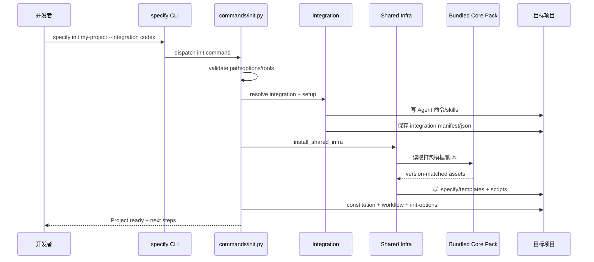
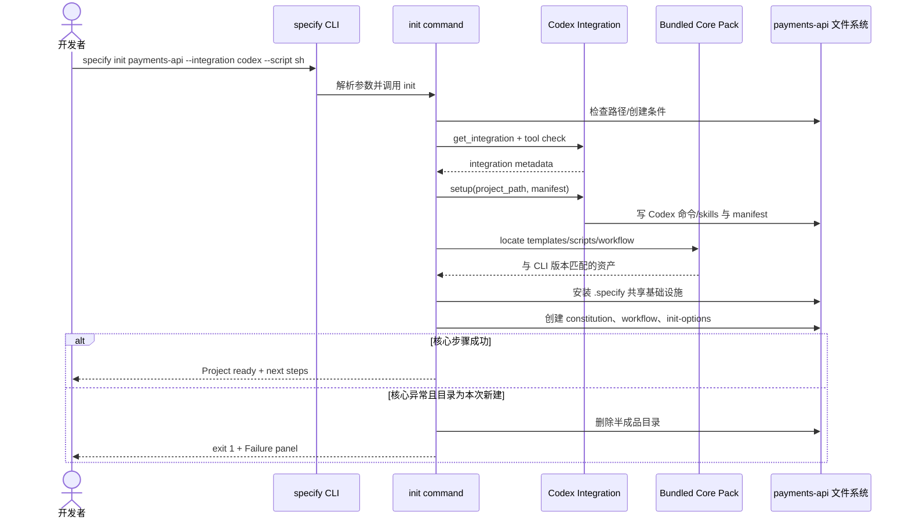

# github/spec-kit 项目深度解析

## 1. 项目概览

- 报告日期：2026-07-14
- 仓库地址：https://github.com/github/spec-kit
- Trending 原始排名：10
- Stars Today：543
- 项目定位：GitHub 推出的 Spec-Driven Development（SDD）CLI、模板、工作流与多 Agent 集成工具包。
- 解决的问题：AI 编程速度提高后，模糊需求、隐含约束和缺少验收标准会更快地变成错误代码；spec-kit 先把原则、规格、计划和任务固化为项目资产，再交给 Agent 实现。
- 目标用户：使用 Copilot、Claude、Codex、Gemini 等编程 Agent 的个人开发者和团队，尤其是复杂功能、新项目和需要审计过程的组织。
- 当前成熟度：生产候选。CLI、离线资产、集成 manifest、升级/扩展/工作流体系已经成型，但 SDD 方法本身仍需要团队纪律和人工判断。
- 推荐结论：适合把 AI 编程从“临场聊天”变成可复查流程；小修小补不必每次摆满全套仪仗队。

## 2. 系统架构

### 2.1 架构概览

spec-kit 的可执行入口是 Python 包 `specify-cli`，脚本 `specify = specify_cli:main`。Typer CLI 注册 init、check、extension、preset、workflow、integration 等命令。核心资产随 wheel 打包：模板、Bash/PowerShell 脚本、内置扩展、speckit workflow 和 preset，因此 `specify init` 可以离线初始化并确保产物与已安装 CLI 版本一致。初始化时，命令解析目标路径和 Agent integration，调用 integration runtime 写入 Agent 命令/skills 与 manifest，再安装共享 `.specify` 基础设施、constitution、workflow、init options 和可选 preset。

### 2.2 架构图

```mermaid
flowchart LR
    A[开发者] --> B[specify CLI\nsrc/specify_cli/__init__.py]
    B --> C[commands/*\ninit/check/extension/preset/workflow]
    C --> D[integrations/*\nAgent 适配]
    D --> E[Integration Manifest\n安装记录]
    C --> F[shared_infra.py\n共享脚本/模板]
    C --> G[core_pack\n随 wheel 打包资产]
    G --> H[templates/*\nconstitution/spec/plan/tasks]
    G --> I[scripts/bash|powershell]
    G --> J[workflows/speckit]
    G --> K[extensions/* + presets/*]
    D --> L[Agent 命令/Skills 目录]
    F --> M[项目 .specify/]
    H --> M
    I --> M
    J --> M
    K --> M
    C --> N[init-options.json / integration.json]
```

### 2.3 核心模块

| 模块 | 职责 | 代码位置 | 关键依赖 | 证据级别 |
|---|---|---|---|---|
| CLI 根应用 | Typer app、版本、控制台、共享函数和命令注册 | `src/specify_cli/__init__.py` | Typer、Rich | High |
| Init 命令 | 校验路径、选择 integration/script、安装基础设施、workflow、preset 和配置 | `src/specify_cli/commands/init.py` | integration runtime、StepTracker | High |
| 共享基础设施 | 把打包模板和脚本安全复制到 `.specify/`，维护 manifest 与定制保留策略 | `src/specify_cli/shared_infra.py` | pathlib、hash/manifest | High |
| 资产定位 | 定位 wheel 内 core pack、workflow、preset 和版本 | `src/specify_cli/_assets.py` | importlib resources/pathlib | High |
| Agent 配置 | 定义支持的 integration、目录、CLI 检查、脚本类型 | `src/specify_cli/_agent_config.py` | 配置字典 | High |
| Integration 运行时 | 选择并执行 Agent 适配，写命令或 skills | `src/specify_cli/integrations/`、`integration_runtime.py` | JSON/JSON5、文件系统 | High |
| Integration Manifest | 记录已安装文件和集成元数据，支持升级/清理 | `src/specify_cli/integrations/manifest.py` | JSON | High |
| Workflow 引擎 | 读取 workflow.yml，管理定义、步骤和执行 | `src/specify_cli/workflows/` | PyYAML | High |
| Extension/Preset | 安装可选能力包和场景预设 | `src/specify_cli/extensions/`、`presets/` | zip/catalog/manifest | High |
| 模板与命令资产 | constitution、spec、plan、tasks、checklist 和 Agent 命令 | `templates/`、`scripts/`、`workflows/` | Markdown、Shell、PowerShell | High |
| 安全工具函数 | 工具检测、JSON 合并、子进程执行、路径与 symlink 防护 | `src/specify_cli/_utils.py`、shared infra helpers | subprocess、pathlib | Medium |

### 2.4 数据与状态管理

- 项目状态集中在 `.specify/`：memory、templates、scripts、workflows、extensions 等。
- 初始化选项写入 `.specify/init-options.json`，包含 Agent、integration、脚本类型、版本和 skills 模式。
- Integration 状态由 manifest 和 integration JSON 记录，便于升级、切换和卸载。
- Constitution 是项目级原则文件；spec、plan、tasks 等为功能生命周期文档。
- 默认没有数据库、缓存或队列，状态主要是版本化文件；这让产物可以跟随 Git 审查。

### 2.5 外部集成与协议

- Agent integrations：Copilot、Claude、Codex、Gemini 及仓库列出的其他工具。
- 文件约定：不同 Agent 使用命令目录、skills 目录、AGENTS.md 或专属配置。
- CLI：Typer/Click 命令行交互；非交互会选择默认 integration，或由 `--integration` 明确指定。
- GitHub：项目属于 GitHub，但 `specify init` 的核心脚手架已随包打包，不依赖在线下载。
- Shell：根据平台和参数安装 Bash 或 PowerShell 脚本。

### 2.6 部署与运行形态

- Python >=3.11。
- 安装为 `specify-cli` wheel 或通过 `uvx` 执行。
- Wheel 强制打包 templates、commands、scripts、内置 extensions、workflow 和 preset。
- 运行结果写入目标项目目录，不需要常驻服务。
- 适合本地开发机、Dev Container 和 CI 脚手架场景；CI 使用时应显式提供非交互参数。

## 3. 主线流程

### 3.1 核心流程图



### 3.2 关键步骤

1. Typer 解析 `specify init` 的目标目录、`--here`、`--force`、integration、script 和 preset。
2. 命令校验互斥参数、目录是否存在及非空目录的确认策略。
3. integration 显式指定时从 registry 解析；非交互未指定时使用默认 integration。
4. 检查所选 Agent CLI 是否可用，除非用户明确 `--ignore-agent-tools`。
5. 创建 `IntegrationManifest`，调用具体 integration 的 `setup()`，再保存 manifest 与 integration JSON。
6. `_install_shared_infra_or_exit()` 从打包 core pack 安装脚本和模板，并根据 force/refresh 策略保护用户已定制文件。
7. 从模板创建 constitution，安装 bundled speckit workflow。
8. 保存 init options，设置脚本执行权限，按需安装 preset。
9. 失败时输出结构化错误；若是新建目录且初始化失败，删除本次创建的目录以避免半成品。

### 3.3 异常与失败处理

- `--here` 与 project name 同时提供：立即报错。
- 目标目录非空：交互确认；非交互没有输入时提示使用 `--force`，不会悄悄覆盖。
- integration 不存在：列出可用项并退出。
- Agent 工具缺失：默认阻止继续，用户可以显式忽略检查。
- 共享基础设施安装抛出 ValueError/OSError：输出错误并退出。
- workflow/preset：属于可选阶段，失败可以记录 warning/error 并继续完成核心初始化。
- 总体异常：如果目标目录是本次新建，则 `shutil.rmtree(project_path)` 清理半成品；若是既有目录，不做粗暴整目录回滚。
- 定制文件保护：refresh 模式仅覆盖 manifest 哈希仍匹配的未修改文件，用户修改过的文件保留并告警。

## 4. 典型业务场景端到端执行链路

### 4.1 场景定义

| 项目 | 内容 |
|---|---|
| 场景名称 | 开发者为新项目初始化 Codex 的 Spec-Driven Development 工作区 |
| 参与者 | 开发者、specify CLI、Codex integration、bundled core pack、目标文件系统 |
| 前置条件 | Python >=3.11；已安装 `specify-cli`；目标父目录可写；Codex CLI 可用或显式跳过检测 |
| 输入 | 示例命令：`specify init payments-api --integration codex --script sh` |
| 期望结果 | 新建 `payments-api/`，包含 Agent 集成文件、`.specify/templates`、脚本、constitution、speckit workflow 和初始化配置 |
| 成功判定 | CLI 显示 Project ready；关键文件存在；integration manifest 与 init-options 记录 Codex/sh；可继续执行 spec-kit 工作流命令 |

### 4.2 端到端时序图



### 4.3 执行步骤追踪

| 步骤 | 输入 | 执行组件 | 关键代码位置 | 状态或数据变化 | 输出 | 失败分支 | 证据级别 |
|---:|---|---|---|---|---|---|---|
| 1 | CLI args | Typer app | `src/specify_cli/__init__.py`、`commands/init.py` | 只在内存形成 options | project/integration/script 参数 | 参数冲突或缺失时 exit 1 | High |
| 2 | `payments-api` | 路径检查 | `commands/init.py` L198–298 附近 | 确定新建或合并；记录 `dir_existed_before` | `project_path` | 既有非目录、非空无 force 时终止 | High |
| 3 | `codex` | integration registry + tool check | `commands/init.py`、`integrations/` | 选择 integration 对象 | resolved integration | 未知 integration 或 CLI 缺失时退出 | High |
| 4 | project path + manifest | Codex integration setup | `commands/init.py` L421–466 附近、具体 integration | 写 Agent 命令/skills；保存 manifest/json | 集成文件 | setup 异常进入总体失败处理 | High |
| 5 | script=`sh` | shared infra installer | `shared_infra.py`、`__init__._install_shared_infra` | 写 `.specify/scripts/bash`、templates；记录 hashes | 共享资产 | 路径/symlink/权限错误 exit 1 | High |
| 6 | constitution template | `ensure_constitution_from_template` | `commands/init.py` L35–71 | 若不存在则复制到 memory | constitution.md | 缺模板标记 error，但流程可继续 | High |
| 7 | bundled workflow | WorkflowRegistry/Definition | `commands/init.py` L484–519 附近 | 写 `.specify/workflows/speckit` 并登记 | workflow installed | 失败记录 tracker error | High |
| 8 | selected options | init option writer | `commands/init.py` L523–537 附近 | 写 integration、script、version、skills flags | init-options.json | 写入异常触发总体失败 | High |
| 9 | optional preset | PresetManager | `commands/init.py` 后续 preset 分支 | 可选写 preset 资产 | preset installed/skipped | 失败 warning，继续核心流程 | High |
| 10 | tracker state | finalization | `commands/init.py` | 核心成功则保留项目；新目录失败则删除 | Project ready 或 exit 1 | 既有目录失败不会整目录删除 | High |

### 4.4 关键状态与数据变化

- 新目录创建后，integration 文件与 `.specify/` 资产逐步落盘。
- Manifest 记录 integration 安装内容，降低升级和卸载时“凭感觉删文件”的风险。
- Shared infra manifest 保存已安装文件哈希；后续 refresh 可区分原样文件与用户定制文件。
- `constitution.md` 从模板初始化，成为项目原则的可版本化入口。
- `init-options.json` 保存 Agent、integration、脚本类型、版本和 skills 选择。
- 没有数据库和远程队列；关键状态都能通过 Git diff 查看。

### 4.5 失败传播、重试与回滚

- 新建目录在核心初始化异常时被删除，用户可以修复依赖后重新运行相同命令。
- 对已有目录使用 `--here` 或 `--force` 时，不执行整目录回滚，避免误删原有内容；因此重试前要检查已写入的 manifest 和文件。
- workflow 和 preset 的失败可降级，不影响核心项目初始化，但用户必须根据 tracker 判断缺了哪部分。
- 用户定制模板在 refresh 模式下若哈希已变化会保留；要覆盖需显式 force，这是一种“默认不踩用户文件”的恢复策略。
- 非交互目录冲突不会等待输入到天荒地老，而是提示 `--force` 并退出。

### 4.6 最终业务结果

开发者得到一个已经接好 Codex、包含 SDD 模板和工作流的项目骨架。后续需求不再只存在聊天记录里，而会形成 constitution、spec、plan、tasks 等可审查文件。它把 Agent 的输入从一句临时口令升级为项目内可版本化的工程合同。

### 4.7 最小复现与验证方法

1. 在临时目录安装当前版本 `specify-cli`。
2. 执行：`specify init payments-api --integration codex --script sh`。
3. 检查 `payments-api/.specify/` 下的 templates、scripts、memory、workflows 和 init options。
4. 检查 Codex 对应命令/skills 目录及 integration manifest。
5. 修改一个已安装模板，再执行官方 refresh/upgrade 命令，确认用户修改被保留并出现提示。
6. 在另一个测试目录故意选择不存在的 integration，确认不产生可误用的半成品。
7. 在非空目录中不带 `--force` 运行，确认非交互模式明确失败。

## 5. 技术栈

| 层次 | 技术 | 用途 | 是否核心 | 证据位置 |
|---|---|---|---|---|
| 语言与运行时 | Python >=3.11 | CLI 与文件工作流 | 是 | `pyproject.toml` |
| CLI | Typer、Click、Rich、readchar | 命令、选择器、进度与错误显示 | 是 | `pyproject.toml`、`__init__.py` |
| 配置 | YAML、JSON/JSON5 | workflow、integration、preset 和 options | 是 | dependencies、仓库目录 |
| 资产打包 | Hatchling force-include | 离线打包模板、脚本、扩展和 workflow | 是 | `pyproject.toml` |
| 模板 | Markdown、JSON | constitution/spec/plan/tasks/checklist | 是 | `templates/` |
| 脚本 | Bash、PowerShell | 平台相关工作流辅助 | 是 | `scripts/`、wheel assets |
| Integration | Agent-specific commands/skills/manifests | 适配 Copilot/Claude/Codex/Gemini 等 | 是 | `integrations/` |
| 工作流 | YAML workflow engine | 编排 SDD 步骤 | 是 | `workflows/` |
| 测试 | pytest、coverage | CLI 与模块回归 | 工程核心 | `pyproject.toml` |
| 安全规范 | Ruff subprocess security rules、路径/symlink 检查 | 降低 shell 和目录逃逸风险 | 工程核心 | `pyproject.toml`、shared infra |

## 6. 创新点

### 创新点 1

- 类型：工作流创新
- 传统方案：开发者与 Agent 在聊天中直接从模糊需求跳到实现。
- 当前方案：用 constitution → spec → plan → tasks 的项目资产约束实现过程。
- 实际收益：需求、设计和任务可通过 Git 审查，减少上下文丢失和口头约定。
- 证据：打包模板、speckit workflow、项目文档。
- 局限：模板不会自动发现错误需求，团队仍需认真写和审。

### 创新点 2

- 类型：工程整合创新
- 传统方案：每个 Agent 需要手工复制 Prompt、命令和目录结构。
- 当前方案：统一 CLI + integration registry + manifest，为不同 Agent 安装相应命令或 skills。
- 实际收益：同一套 SDD 方法可以跨工具迁移，安装和升级有记录。
- 证据：`commands/init.py` integration setup、`integrations/manifest.py`、AGENT_CONFIG。
- 局限：不同 Agent 的能力和命令约定并不完全一致，适配层需要持续维护。

### 创新点 3

- 类型：开发体验创新
- 传统方案：初始化依赖在线下载模板，版本漂移或离线环境容易失败。
- 当前方案：核心模板、脚本、扩展和 workflow 随 wheel 版本打包。
- 实际收益：离线可用，模板与 CLI 版本一致，企业环境更易复现。
- 证据：`pyproject.toml` `force-include` 和 init docstring。
- 局限：包体和发布流程更复杂，新增资产必须确保进入构建产物。

### 创新点 4

- 类型：安全与可维护性创新
- 传统方案：升级脚手架可能直接覆盖团队改过的模板。
- 当前方案：manifest 哈希识别未修改资产，refresh 默认保留用户定制。
- 实际收益：降低升级时丢失本地规范的风险。
- 证据：`_install_shared_infra` overwrite policy 注释。
- 局限：复杂手工移动或 manifest 损坏仍需人工处理。

## 7. 应用场景

### 适合

- 新产品、复杂功能和多人协作项目。
- 团队需要记录 AI 编程的需求、约束、计划和验收标准。
- 需要跨 Copilot、Claude、Codex 等工具复用一套流程。
- 离线或受限网络环境的项目脚手架。

### 可以尝试

- 既有项目渐进导入 SDD，但应先挑一个功能试点。
- 企业自定义 extension、preset 和 constitution。
- CI 校验 spec/plan/tasks 是否齐备，需要避免把流程变成只看文件是否存在的形式主义。

### 暂不建议

- 两三行的紧急修复也强制走完整全套流程。
- 把模板生成的文档当作无需评审的正确答案。
- 未理解 `--force` 和定制文件策略就对重要既有目录执行初始化。

## 8. 第一次阅读与验证建议

1. 先读 README 和 SDD 流程，理解 constitution/spec/plan/tasks 的角色。
2. 看 `pyproject.toml`，确认 CLI 入口和打包资产。
3. 顺着 `src/specify_cli/__init__.py` 找命令注册。
4. 深读 `commands/init.py` 的路径、integration、shared infra、workflow 和异常分支。
5. 再看 `shared_infra.py`、`integrations/base.py`、manifest 和一个具体 Agent integration。
6. 在临时目录运行 init、重复 init、force、非交互和失败清理测试。
7. 最后验证生成的 SDD workflow 是否真的帮助一个小功能从 spec 走到 tasks，而不只是生成空文档。

## 9. 风险与限制

- 安全：初始化会写大量项目文件；使用 `--force` 前必须备份或依赖 Git。Agent 目录可能保存凭据，CLI 已提示加入 `.gitignore`。
- 性能：主要是文件操作，性能不是主要风险；大型 extension/preset 的升级一致性更值得关注。
- 许可证：MIT。
- 维护状态：GitHub 官方项目、变化较快；integration 兼容和模板语义可能随版本演进。
- 生产可用性：适合流程治理和项目脚手架；对实际代码质量的收益取决于团队是否认真维护规格和验收。

## 10. Evidence Notes

- `pyproject.toml`：包版本、Python >=3.11、Typer/Rich/YAML 依赖、`specify` 入口、离线打包 core assets、MIT LICENSE。
- `src/specify_cli/__init__.py`：Typer app、共享基础设施入口、路径与 skills 安全处理。
- `src/specify_cli/commands/init.py`：参数校验、integration 选择、manifest、shared infra、constitution、workflow、preset、失败清理。
- `templates/`、`scripts/`、`workflows/`、`extensions/`、`presets/`：项目实际交付的 SDD 资产。

## 11. Honest Caveat

本报告深入跟踪了 `specify init`，但没有逐个审计所有 Agent integration、extension 和 workflow step。不同 Agent 是否完整支持同一套命令、skills 和调用分隔符，需要针对当前版本实际生成文件并运行。SDD 对交付质量的提升也不能仅以项目 Stars 或文档数量证明，应比较缺陷、返工和需求变更成本。

## 12. 可信度

- Architecture Confidence: High
- Flow Confidence: High
- Innovation Confidence: Medium
