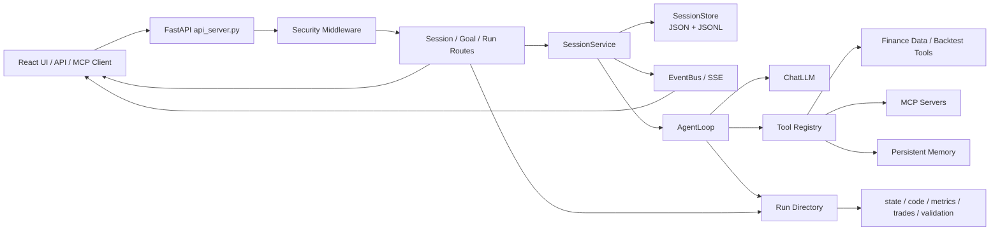
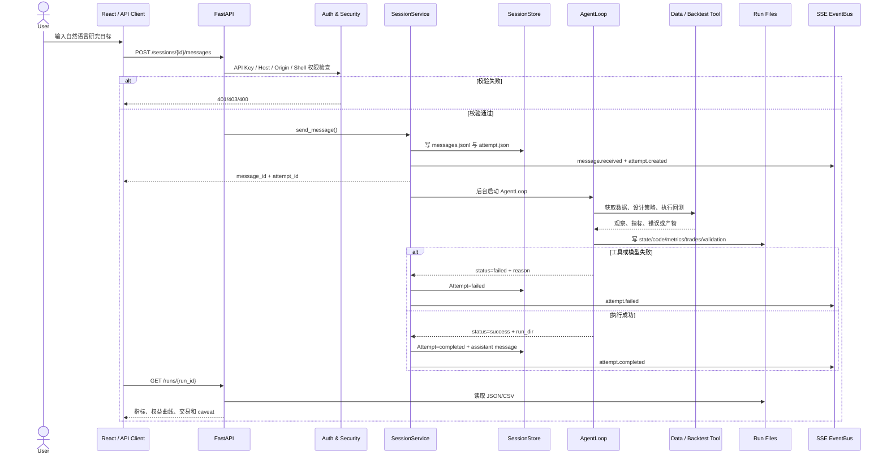

# HKUDS/Vibe-Trading 项目深度解析

## 1. 项目概览

- 报告日期：2026-07-15
- 仓库地址：https://github.com/HKUDS/Vibe-Trading
- Trending 原始排名：06
- Stars Today：1,256
- 项目定位：AI 原生金融研究、策略回测、多 Agent 协作与实验性交易执行工作台。
- 解决的问题：把自然语言研究意图变成可追踪的会话、工具调用、证据、策略代码、回测产物和结果分析。
- 目标用户：量化研究人员、金融 Agent 开发者、MCP 集成开发者和需要可重复实验流程的工程团队。
- 当前成熟度：研究与早期生产候选之间；研究、回测和会话基础设施较完整，真实券商执行仍应视为实验能力。
- 推荐结论：值得研究其会话编排、文件化证据链和安全边界；真实资金场景必须另做权限、风控、合规和故障演练。

## 2. 系统架构

### 2.1 架构概览

系统以 React 前端或 API/MCP 客户端作为入口，由 `agent/api_server.py` 装配 FastAPI、中间件和路由模块。会话请求进入 `sessions_routes.py` 后交给 `SessionService`：消息和执行尝试先写入文件系统，随后后台启动 `AgentLoop`。AgentLoop 通过工具注册表连接金融数据、回测、持久记忆、MCP 与可选 Shell 工具；执行过程通过 EventBus 发送 SSE，结果则落到 runs 目录。历史运行详情由 `runs_routes.py` 从 `state.json`、策略、指标、交易记录与验证文件中重新组装。

### 2.2 架构图



### 2.3 核心模块

| 模块 | 职责 | 代码位置 | 关键依赖 | 证据级别 |
|---|---|---|---|---|
| FastAPI 装配层 | 创建应用、挂载 CORS/安全中间件、注册会话、运行、设置、上传、群体和交易路由 | `agent/api_server.py` | FastAPI、`src.api.*` | High |
| 会话路由 | 创建会话、目标、消息、取消和 SSE 事件流 | `agent/src/api/sessions_routes.py` | FastAPI、SessionService、GoalStore | High |
| SessionService | 保存消息和 Attempt，后台运行 AgentLoop，写回复并发送事件 | `agent/src/session/service.py` | asyncio、AgentLoop、EventBus | High |
| SessionStore | 文件系统持久化 Session、Message、Attempt | `agent/src/session/store.py` | JSON、JSONL、fsync | High |
| AgentLoop 与工具注册表 | 组合 LLM、工具、MCP、记忆并执行最多 50 次迭代 | `agent/src/session/service.py`、`agent/src/agent/loop.py`、`agent/src/tools/` | ChatLLM、PersistentMemory、MCP | High |
| 运行结果读取 | 从运行目录组装状态、策略、指标、交易、权益曲线和验证结果 | `agent/src/api/runs_routes.py` | CSV、JSON、UI services | High |
| 安全模块 | API Key、SSE Ticket、CORS、Host/Origin、路径和 Shell 权限控制 | `agent/src/api/security.py`、`agent/api_server.py` | FastAPI middleware | High |
| 前端 | 会话、运行详情、设置与研究结果交互界面 | `frontend/src/` | React、TypeScript | Medium |

### 2.4 数据与状态管理

- 会话目录结构由 `SessionStore` 明确定义：`session.json`、`messages.jsonl`、`attempts/{attempt_id}/attempt.json`。
- 消息采用追加写 JSONL，并在写入后 `flush` 与 `fsync`，减少进程异常造成的已确认消息丢失。
- 执行结果保存到独立 run 目录；`runs_routes.py`读取 `state.json`、`planner_output.json`、`design_spec.json`、`rag_metadata.json`、`artifacts/metrics.csv`、`equity.csv`、`trades.csv`、`validation.json` 和策略文件。
- 活跃 AgentLoop 保存在进程内 `_active_loops` 字典，因此取消控制依赖当前服务进程；长期数据则主要落在文件系统。

### 2.5 外部集成与协议

- HTTP/JSON：FastAPI REST 路由。
- SSE：`/sessions/{session_id}/events` 持续传递 Agent 事件。
- MCP：会话配置可合并 `mcpServers`，工具注册阶段加载外部 MCP 服务。
- LLM：`ChatLLM` 作为模型抽象；具体 Provider 来自运行配置。
- 金融数据与券商：项目包含多个市场数据和实验性 broker 通道，实际启用项由配置、凭据和依赖决定。

### 2.6 部署与运行形态

- 可作为本地 Python/FastAPI 服务与 React 前端运行。
- 仓库包含 Docker 相关配置；近期提交明确强化 Docker、SSE 认证、沙箱和外部入口安全。
- 运行目录与会话目录需要持久卷，否则容器重建后历史研究记录会丢失。
- 未发现该主会话链路依赖数据库；这里的核心持久化是文件系统。其他可选功能可能有各自存储依赖，应按启用模块核查。

## 3. 主线流程

### 3.1 核心流程图

```mermaid
sequenceDiagram
    participant C as Client
    participant API as FastAPI Routes
    participant SS as SessionService
    participant Store as SessionStore
    participant Loop as AgentLoop
    participant Tools as Tool Registry
    participant Run as Run Directory
    participant SSE as EventBus

    C->>API: POST /sessions
    API->>SS: create_session()
    SS->>Store: session.json
    SS->>SSE: session.created
    API-->>C: session_id
    C->>API: POST /sessions/{id}/messages
    API->>SS: send_message(content)
    SS->>Store: append message + create attempt
    SS->>SSE: message.received / attempt.created
    API-->>C: message_id + attempt_id
    SS->>Loop: background _run_attempt()
    Loop->>Tools: build_registry + run tools
    Tools-->>Loop: observations / artifacts
    Loop->>Run: state, code, metrics, logs
    Loop-->>SS: result
    SS->>Store: update attempt + assistant message
    SS->>SSE: attempt.completed / failed
    C->>API: GET /runs/{run_id}
    API->>Run: load JSON/CSV/artifacts
    API-->>C: RunResponse
```

### 3.2 关键步骤

1. `POST /sessions` 创建会话，SessionService 生成记录并写入会话目录。
2. `POST /sessions/{id}/messages` 校验 session id 和鉴权，保存用户消息并创建 Attempt。
3. API 立即返回 `message_id` 与 `attempt_id`，执行通过 `asyncio.create_task` 在后台启动。
4. SessionService 从历史消息构建有限长度上下文，加载安全过滤后的会话覆盖配置。
5. 工具注册表合并持久记忆、允许的 Shell 工具和 MCP 服务，随后启动 AgentLoop。
6. AgentLoop 执行模型与工具循环，产生 run 目录和指标；事件实时送入 SSE。
7. SessionService 将 Attempt 标记为 completed 或 failed，保存助手消息，并发出终态事件。
8. 前端通过运行详情 API 读取策略、指标、权益曲线、交易和验证产物。

### 3.3 异常与失败处理

- 未配置 Session runtime：路由返回 501。
- session 不存在：消息或读取路由返回 404。
- 认证、Origin、Host 或路径校验失败：由安全依赖或中间件拒绝。
- AgentLoop 抛异常：Attempt 标为 failed，错误写入存储并通过 `attempt.failed` 事件发送。
- 用户取消：`cancel_current()` 向当前活跃 AgentLoop 发取消信号；没有活跃执行时返回 `no_active_loop`。
- 运行目录缺失：`GET /runs/{run_id}` 返回 404；部分 artifact 缺失时响应仅省略对应字段，不伪造数据。

## 4. 典型业务场景端到端执行链路

### 4.1 场景定义

| 项目 | 内容 |
|---|---|
| 场景名称 | 用户提交自然语言策略研究，并获得可追踪的回测结果 |
| 参与者 | 用户、React/API 客户端、FastAPI、SessionService、AgentLoop、金融/回测工具、文件系统、SSE |
| 前置条件 | 服务已启动；API 鉴权已配置；LLM 和必要金融数据源凭据有效；会话与 run 目录可写 |
| 输入 | **示意**：`研究某指数的均线趋势策略，使用历史数据回测，并说明最大回撤与限制` |
| 期望结果 | 系统返回 attempt/run 标识；前端收到执行事件；最终可读取策略、指标、交易记录和验证说明 |
| 成功判定 | Attempt 状态为 completed；run 目录存在；`state.json` 为 success；至少生成可读取的结果或明确的研究结论与证据 |

### 4.2 端到端时序图



### 4.3 执行步骤追踪

| 步骤 | 输入 | 执行组件 | 关键代码位置 | 状态或数据变化 | 输出 | 失败分支 | 证据级别 |
|---:|---|---|---|---|---|---|---|
| 1 | 会话标题/配置 | Sessions Route | `sessions_routes.py:create_session` | 创建 session 目录与 `session.json` | `session_id` | runtime 未启用返回 501 | High |
| 2 | **示意**自然语言研究目标 | 消息路由与安全依赖 | `sessions_routes.py:send_message`、`api_server.py` | 请求通过鉴权与路径检查 | 进入 SessionService | 401/403/404 | High |
| 3 | session_id、content | SessionService | `service.py:send_message` | 追加 `messages.jsonl`；新建 Attempt；更新 last_attempt_id | message_id、attempt_id | session 不存在抛 ValueError | High |
| 4 | Attempt、历史消息 | SessionService | `service.py:_run_attempt`、`_run_with_agent` | Attempt 从 pending 变 running；配置被安全清洗 | AgentLoop 实例 | 初始化/配置异常转 failed | High |
| 5 | Prompt、工具配置 | AgentLoop/Registry | `service.py`、`src/tools/`、`src/agent/loop.py` | 调用 LLM 与工具；EventBus 持续追加事件 | 观察与中间结果 | 工具错误、模型错误、取消 | Medium-High |
| 6 | 策略与数据 | 回测/研究工具 | `agent/src/tools/` 与生成的 run 目录 | 写策略、状态、指标、交易和验证文件 | run_dir | 数据源失败或验证失败写 reason | Medium |
| 7 | Agent 终态 | SessionService | `service.py:_run_attempt` | 更新 `attempt.json`；追加 assistant 消息 | completed/failed 事件 | 捕获异常后发 attempt.failed | High |
| 8 | run_id | Runs Route | `runs_routes.py:_build_response_from_run_dir` | 读取并过滤 JSON/CSV，构建响应 | RunResponse | 目录 404；文件损坏则对应字段为空 | High |

### 4.4 关键状态与数据变化

- Session：创建后持久化；每次消息更新 `last_attempt_id` 与 `updated_at`。
- Message：用户消息与助手回复按时间追加到 `messages.jsonl`。
- Attempt：`pending → running → completed/failed`，并记录 summary、error、run_dir 和指标。
- Agent 事件：通过进程内 EventBus/SSE 发布，可按 attempt 观察工具调用和终态。
- Run：文件系统成为实验事实记录，最终响应是对实际文件的读取，不是重新让模型编一遍结果。

### 4.5 失败传播、重试与回滚

- 代码中明确将顶层 Agent 异常转成 failed Attempt，并发送失败事件；不会把异常吞成成功。
- 取消由活跃 AgentLoop 处理，不等同于数据库事务回滚；已经写出的文件可能保留，使用方应按 `state.json` 和 Attempt 状态判断有效性。
- 数据/工具层的具体重试策略因工具而异，本分析没有发现统一的“所有工具自动重试”承诺，因此不得假设。
- 文件存储没有跨多个文件的数据库事务；中途崩溃时可能留下部分 run 产物，读取端通过状态和文件存在性做降级。

### 4.6 最终业务结果

用户得到的不是一句“策略不错”，而是一组可检查对象：会话历史、Attempt 状态、Agent 事件、运行目录、策略代码、回测指标、权益曲线、交易记录和验证说明。对研究工作而言，最大的价值是结论能回到文件和事件证据，而不是只剩聊天窗口里的一段漂亮话。

### 4.7 最小复现与验证方法

1. 按 README 配置 LLM 与至少一个可用金融数据源，启动 API 与前端。
2. 创建会话并记录返回的 `session_id`。
3. 向 `/sessions/{session_id}/messages` 发送一个只要求研究和回测、不要求真实交易的**示意**目标。
4. 订阅 `/sessions/{session_id}/events`，确认出现 `attempt.created`、`attempt.started` 和终态事件。
5. 用返回的 run id 调用 `/runs/{run_id}`，并在磁盘核对 `state.json`、`artifacts/metrics.csv` 与响应字段一致。
6. 再用无效 session、错误 API Key 和取消接口分别验证 404、认证拒绝和取消分支。

## 5. 技术栈

| 层次 | 技术 | 用途 | 是否核心 | 证据位置 |
|---|---|---|---|---|
| 语言与运行时 | Python | Agent、API、工具、回测 | 是 | `pyproject.toml`、`agent/` |
| 前端 | React + TypeScript | 会话、运行结果与设置界面 | 是 | `frontend/src/` |
| 服务框架 | FastAPI | REST、SSE、路由与依赖注入 | 是 | `agent/api_server.py` |
| Agent | 自定义 AgentLoop | 模型-工具迭代与事件回调 | 是 | `agent/src/agent/loop.py` |
| 协议 | MCP | 动态接入外部工具服务 | 重要 | `agent/mcp_server.py`、Session config |
| 数据与状态 | 文件系统 JSON/JSONL/CSV | 会话、Attempt 与运行产物 | 是 | `session/store.py`、`runs_routes.py` |
| AI | ChatLLM、PersistentMemory | 模型访问与长期记忆 | 是 | `session/service.py` |
| 安全 | API Key、SSE Ticket、CORS/Host 校验 | 控制本地/远程入口与高权限工具 | 是 | `src/api/security.py` |
| 部署 | Docker + 本地进程 | 前后端和依赖部署 | 重要 | Docker 配置、README |

## 6. 创新点

### 创新点 1

- 类型：工作流创新
- 传统方案：聊天机器人直接返回一段策略描述，研究过程和结果难以复现。
- 当前方案：将 Session、Attempt、事件、run 目录和 artifact 连接成一条可追踪链路。
- 实际收益：可以定位某次结论来自哪次执行、哪些文件和哪些指标。
- 证据：`session/service.py`、`session/store.py`、`runs_routes.py`。
- 局限：文件系统方案在多实例、并发一致性和集中治理上不如成熟数据库/对象存储架构。

### 创新点 2

- 类型：工程整合创新
- 传统方案：MCP、回测、研究 Agent、可视化与安全入口分散在多个工具中。
- 当前方案：在同一 FastAPI/React 工作台内组合会话、MCP、工具、回测和事件流。
- 实际收益：缩短从自然语言问题到可查看运行产物的路径。
- 证据：API 路由、工具注册、MCP 配置和前端页面。
- 局限：集成面越大，配置、凭据和安全边界越复杂；不能把“集成多”自动等同于稳定。

### 创新点 3

- 类型：安全工程
- 传统方案：本地 Agent 服务常默认信任浏览器、Shell 和 SSE 查询参数。
- 当前方案：明确处理 API Key、SSE Ticket、Host/Origin、日志脱敏、路径参数和 Shell 工具开关。
- 实际收益：降低把本地高权限 Agent 暴露给恶意网页或错误网络配置的风险。
- 证据：`agent/api_server.py` 与 `src/api/security.py`。
- 局限：安全控制仍需正确配置；实验性券商执行的业务风控不是这些 HTTP 安全措施能够替代的。

## 7. 应用场景

### 适合

- 自然语言金融研究与回测原型。
- Agent、MCP 和可追踪实验工作流研究。
- 教学环境中演示策略生成、回测与证据链。

### 可以尝试

- 团队内部研究工作台，但需要集中身份、共享存储、备份和资源隔离改造。
- 多数据源、多 Agent 协作研究，前提是对数据授权和结果一致性做验收。
- 纸面交易或受限沙箱执行。

### 暂不建议

- 未经独立风控、合规和灾备验证的真实资金自动交易。
- 把一次回测或模型结论直接当作投资建议。
- 直接暴露到公网且保持默认密钥、宽松 CORS 或高权限 Shell。

## 8. 第一次阅读与验证建议

1. 先读 README 的免责声明、运行方式和安全说明。
2. 再读 `agent/api_server.py` 看系统入口和路由边界。
3. 沿 `sessions_routes.py → session/service.py → AgentLoop → runs_routes.py` 追一次消息到结果。
4. 阅读 `session/store.py`，确认哪些状态真正持久化。
5. 运行一个最小研究任务，核对 SSE 事件、Attempt 状态与磁盘 artifact 三者一致。

## 9. 风险与限制

- 安全：可调用 Shell、外部 MCP、模型和市场数据，错误配置会扩大权限面；公网部署必须启用强认证和来源限制。
- 性能：Agent 执行使用最多四个专用线程，长任务和并发任务会受本机资源及外部 Provider 限制。
- 许可证：项目为 MIT，但外部数据源、模型和券商 API 有各自条款。
- 维护状态：近期提交活跃且持续安全加固，但大范围功能演进也意味着接口可能变化。
- 生产可用性：研究/回测可作为候选；多实例一致性、集中存储、队列、灾备和真实交易风控仍需额外工程。

## 10. Evidence Notes

- 源码证据：`agent/api_server.py`、`agent/src/api/sessions_routes.py`、`agent/src/session/service.py`、`agent/src/session/store.py`、`agent/src/api/runs_routes.py`。
- 官方证据：README、Wiki、近期安全与 MCP 更新说明。
- 本文没有声称已独立验证收益、回测正确性或真实券商执行安全性。
- 业务案例中的自然语言请求为示意，不是项目固定官方请求体。

## 11. Honest Caveat

本分析是基于当前 main 分支的静态源码和官方文档。没有在本次任务中安装全部金融数据依赖、调用真实 LLM 或运行券商连接，因此工具内部的数据清洗、回测数学正确性和实盘状态机只按可见证据描述。项目功能覆盖面大，某些可选模块可能有独立数据和部署路径，不能由主会话链路一概而论。

## 12. 可信度

- Architecture Confidence: High
- Flow Confidence: High
- Innovation Confidence: Medium