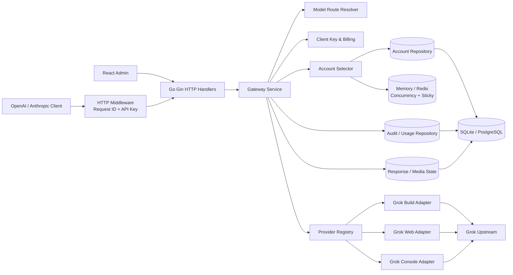
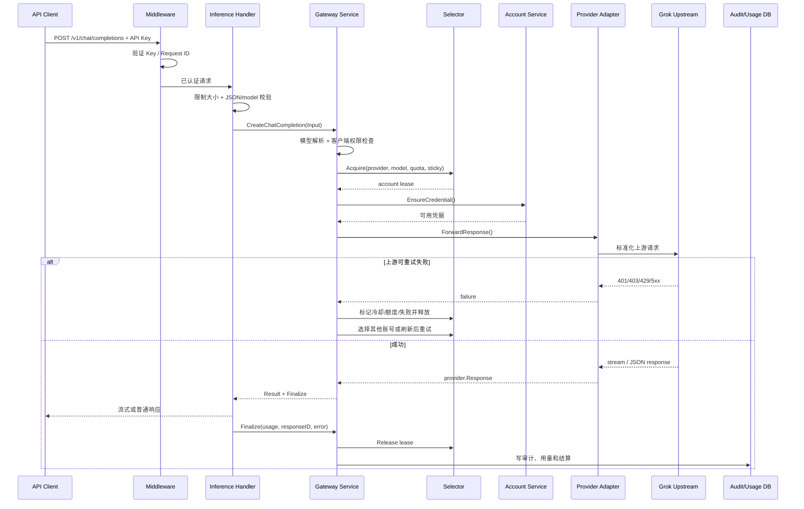
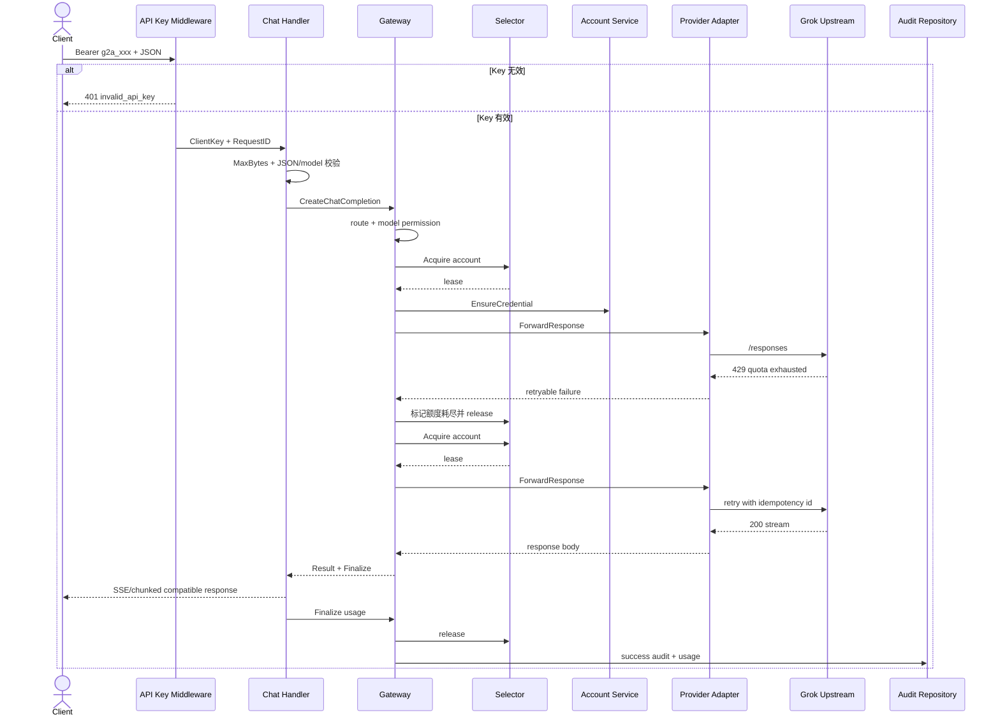

# chenyme/grok2api 项目深度解析

## 1. 项目概览

- 报告日期：2026-07-15
- 仓库地址：https://github.com/chenyme/grok2api
- Trending 原始排名：12
- Stars Today：186
- 项目定位：面向 Grok Build、Grok Web 与 Grok Console 的多 Provider、多账号 API 网关和管理平台。
- 解决的问题：把不同认证方式、模型能力和额度状态统一成 OpenAI/Anthropic 兼容接口，并处理账号调度、故障切换、用量审计和媒体请求。
- 目标用户：需要研究 Grok 兼容 API、模型路由和账号池调度的开发者或内部平台团队。
- 当前成熟度：早期可用到生产候选之间；代码包含较完整路由、安全、审计、配额和故障处理，但上游依赖与合规风险显著。
- 推荐结论：很适合研究 Go API Gateway、模型兼容层和多账号调度；是否部署首先取决于上游服务条款、凭据来源和组织合规，不是“代码跑起来就算完事”。

## 2. 系统架构

### 2.1 架构概览

项目由 React 管理端和 Go/Gin 后端组成。客户端通过 API Key 调用 `/v1/chat/completions`、`/v1/responses`、`/v1/messages`、图片或视频接口。HTTP Handler 限制请求大小、验证内容类型和模型字段，从中间件上下文取得已验证的 Client Key，再调用 Gateway Service。Gateway 解析公开模型到一个或多个 Provider Route，检查客户端模型权限，使用 Selector 从账号池按状态、模型能力、额度、冷却、并发和粘滞会话选择账号租约，刷新凭据后调用对应 Provider Adapter。响应流返回客户端，Finalize 阶段释放租约并写用量/审计。数据库可用 SQLite 或 PostgreSQL，运行时并发和粘滞状态可使用 Memory 或 Redis。

### 2.2 架构图

### 2.3 核心模块

| 模块 | 职责 | 代码位置 | 关键依赖 | 证据级别 |
|---|---|---|---|---|
| Inference Handler | 注册兼容接口、限制请求、校验 JSON/模型、调用 Gateway、流式返回 | `backend/internal/transport/http/inference/handler.go` | Gin、middleware | High |
| Gateway Service | 模型路由、权限检查、账号选择、Provider 调用、重试、审计收口 | `backend/internal/application/gateway/service.go` | account/clientkey/provider/repository | High |
| Selector | 过滤不可用账号，处理冷却、额度、并发、粘滞和租约 | `backend/internal/application/gateway/selector.go` | AccountRepository、ConcurrencyLimiter、StickySession | High |
| Provider Registry | 统一 Build/Web/Console 能力、协议适配和模型别名 | `backend/internal/infra/provider/` | Provider adapters | High |
| Account Service | 凭据续期、额度同步、账号状态和重新认证 | `backend/internal/application/account/` | Provider、Repository、加密 | High |
| Client Key Service | 下游 API Key、模型权限和计费预留/结算 | `backend/internal/application/clientkey/` | Repository、audit pricing | High |
| Audit/Usage | 请求 ID、账号、模型、Token、费用、状态与出口信息 | `backend/internal/domain/audit/`、gateway finalize | DB repository | High |
| Persistence | 账号、模型、密钥、审计、Response 与媒体任务 | `backend/internal/repository/` | SQLite/PostgreSQL | High |
| Runtime state | 并发限制、粘滞会话和缓存 | repository implementations | Memory/Redis | High |
| Admin frontend | 账号、模型、密钥、用量、代理和设置管理 | `frontend/` | React、TypeScript | Medium-High |

### 2.4 数据与状态管理

- 持久数据支持 SQLite 或 PostgreSQL，README 明确列出两种数据库。
- 运行时并发限制和会话粘滞可使用 Memory 或 Redis。
- Selector 使用账号租约，租约释放前占用并发名额，避免同一账号超出限制。
- Prompt Cache Key 会被 SHA-256 压缩为固定长度的粘滞索引，不把原始内容直接用作本地键。
- Gateway 为请求生成 audit event id 和幂等 token；文本/媒体计费可先预留，Finalize 时根据实际用量结算并记录。
- `previous_response_id` 场景会读取 Response Ownership 并固定到原 Provider/账号，避免有状态对话切到不兼容账号。

### 2.5 外部集成与协议

- 下游协议：OpenAI Responses、Chat Completions、Images、异步 Videos，以及 Anthropic Messages。
- 上游 Provider：Grok Build OAuth、Grok Web SSO、Grok Console SSO。
- 管理接口：React 管理端与同一 Go 服务通信。
- 数据库：SQLite/PostgreSQL。
- 运行态：Memory/Redis。
- 出口：HTTP/SOCKS 代理池，Provider Adapter 负责上游请求。

### 2.6 部署与运行形态

- 官方 Docker Compose 将配置文件只读挂载，使用命名卷保存 SQLite 和本地媒体。
- 单 Go 服务同时提供 API 和已构建的管理前端；源码开发时前端 Vite 服务代理到后端 8000。
- 也可使用 PostgreSQL、Redis 和外部代理池扩展运行形态。
- 必须配置随机 JWT Secret 和 Credential Encryption Key；加密密钥变更会导致历史凭据无法解密。

## 3. 主线流程

### 3.1 核心流程图

### 3.2 关键步骤

1. 中间件验证客户端密钥并生成 Request ID。
2. Inference Handler 限制 Body 大小，要求 JSON，解析 model 和 stream 字段。
3. Gateway 将公开模型解析为候选 routes，并检查客户端密钥是否允许使用。
4. Selector 过滤禁用、需重认证、模型不支持、冷却、额度耗尽和并发饱和账号。
5. 如果有 Prompt Cache Key，优先复用粘滞账号；有 `previous_response_id` 时固定原账号。
6. Account Service 确保 OAuth 凭据有效；必要时执行一次强制刷新。
7. Provider Adapter 把兼容请求转换为对应 Grok 上游协议并发送。
8. 401、403、429、5xx 和传输错误按类型更新账号状态、额度或冷却，并在最大 attempts 内切换账号。
9. 成功响应透传或流式复制给客户端；Finalize 释放租约、计算用量并写审计。

### 3.3 异常与失败处理

- 请求非 JSON、Body 超限或缺少 model：Handler 返回 400/413/415。
- API Key 无效：Handler 返回 401。
- 模型不存在、密钥无权限或协议不支持：Gateway 返回对应公开错误，并写失败审计。
- 无账号：Selector 区分 `no_accounts`、`unsupported_model`、`cooling`、`model_cooling`、`quota_exhausted` 和 `saturated`，避免所有情况都糊成同一个 503。
- OAuth 401：Build 凭据可强制刷新并重试；SSO 被拒绝后标记重新认证。
- 429/额度错误：更新额度窗口或模型冷却，再选择其他账号。
- 相同非账号级失败指纹重复两次：提前停止，防止把系统性错误轮询所有账号。
- 客户端取消：停止重试并返回 request canceled。
- 响应传输大小和写超时有硬限制，媒体和文本分别处理。

## 4. 典型业务场景端到端执行链路

### 4.1 场景定义

| 项目 | 内容 |
|---|---|
| 场景名称 | 客户端调用 OpenAI 兼容 Chat Completions，并在首个账号额度耗尽时自动切换 |
| 参与者 | API 客户端、认证中间件、Inference Handler、Gateway、Model Resolver、Selector、Account Service、Provider Adapter、Grok 上游、审计数据库 |
| 前置条件 | 已创建 `g2a_` 客户端 Key；至少两个同 Provider 账号可服务目标模型；配置和凭据加密密钥有效 |
| 输入 | **示意**：`POST /v1/chat/completions`，body 含 `model`、`messages`、`stream=true`；实际完整格式遵循兼容接口文档 |
| 期望结果 | 系统选择可用账号；首账号若 429/额度耗尽则被标记并释放，第二账号继续请求；客户端收到兼容流式响应 |
| 成功判定 | HTTP 2xx；响应格式兼容；审计记录包含最终账号、模型、Token/费用或估算用量；租约已释放 |

### 4.2 端到端时序图

### 4.3 执行步骤追踪

| 步骤 | 输入 | 执行组件 | 关键代码位置 | 状态或数据变化 | 输出 | 失败分支 | 证据级别 |
|---:|---|---|---|---|---|---|---|
| 1 | Bearer API Key、请求 Body | HTTP middleware | `backend/internal/transport/http/middleware/` | Key 被解析并放入 Gin Context；生成 Request ID | 已认证请求 | 无效 Key 直接 401 | High |
| 2 | JSON Chat 请求 | Inference Handler | `inference/handler.go:createChatCompletion` | Body 限长并解析 model/stream | Gateway Input | 非 JSON、超限、缺 model | High |
| 3 | PublicModel、ClientKey | Gateway | `gateway/service.go:resolvePublicModelRoutes`、`selectConversationRoute` | 选择 Provider Route，检查模型权限和协议 | Route | 模型不存在/无权限/不支持 | High |
| 4 | Provider、Model、Quota、Sticky Key | Selector | `gateway/selector.go:Acquire` | 过滤账号并占用并发租约；可写粘滞映射 | account lease | 冷却、额度、饱和等结构化错误 | High |
| 5 | 账号凭据 | Account Service | `gateway/service.go:ensureCredential` | OAuth 可能刷新；账号认证状态更新 | 可用 credential | 永久刷新失败或 SSO 失效 | High |
| 6 | 标准化请求 | Provider Adapter | `infra/provider/*` | 转换为对应上游协议并附加幂等 id | 上游 HTTP 请求 | 传输错误、403、401、429、5xx | High |
| 7 | 429/额度响应 | Gateway + Selector | `gateway/service.go` retry loop | 账号额度/冷却状态更新；租约释放；excluded 集合加入账号 | 下一次选择 | 相同系统性失败两次则停止 | High |
| 8 | 成功流式响应 | Handler | `handler.go:writeResult` 相关代码 | 响应头与 Body 传给客户端 | 兼容输出 | 超大小、写超时、客户端中断 | High |
| 9 | Usage、Status、Response ID | Finalize | `gateway/service.go` | 释放租约、写审计、结算预留、保存 ownership | Audit record | 审计写失败会记录日志，但已返回响应不能倒放 | High |

### 4.4 关键状态与数据变化

- Client Key：请求前已验证，Gateway 再检查可使用的模型范围和计费额度。
- Account：可能从 active 变为 cooling、quota exhausted 或 reauth required。
- Lease：Acquire 后占用并发槽，任何成功或失败路径都必须 Release。
- Sticky Session：Prompt Cache Key 哈希后绑定账号一段时间，提高缓存或会话连续性。
- Failure Fingerprint：用于识别同一系统性错误，避免无意义地轮询所有账号。
- Audit：记录请求、客户端 Key、Provider、模型、最终账号、状态、用量、费用和错误码。
- Response Ownership：有状态 response 会保存原 Provider/账号归属，后续请求不能随意漂移。

### 4.5 失败传播、重试与回滚

- 账号级错误：标记账号状态，释放租约，继续选择其他账号。
- OAuth 认证错误：最多执行受控刷新；刷新后仍 401 则转为重新认证状态。
- SSO 认证错误：不可自动续期时直接移出可用池，等待人工重新授权。
- 额度/429：根据 Provider 配额模式更新恢复时间，避免立即再次选中。
- 系统性错误：相同 fingerprint 重复达到阈值后停止重试，减少放大故障。
- 已经向客户端开始发送流时，不能做数据库式回滚；Finalize 负责记录最终传输/错误状态。
- 计费使用“预留→结算”而非简单先扣死，失败路径需要释放或修正预留。

### 4.6 最终业务结果

客户端只看到标准兼容接口，不需要知道背后选了 Build、Web 还是 Console，也不需要自己处理某个账号冷却。平台管理员则能在审计和用量中追到请求最终落在哪个 Provider、哪个账号以及为什么失败或切换。它真正提供的是“把不稳定的多账号上游包装成可解释的网关状态机”，而不只是改个 API 路径。

### 4.7 最小复现与验证方法

1. 按 README 复制 `config.example.yaml`，生成随机 JWT Secret 与 Credential Encryption Key。
2. 用 Docker Compose 启动，登录管理端并接入两个测试账号。
3. 同步模型，创建只允许某个测试模型的 `g2a_` Key。
4. 用**示意** Chat Completions 请求验证普通非流式和流式响应。
5. 人为把首账号设置为冷却、并发满或模拟 429，确认 Selector 选择第二账号且审计记录变化。
6. 用无效 Key、无权限模型、错误 Content-Type、超大 Body 分别验证 401/403/415/413。
7. 验证请求结束后并发槽释放；连续使用同一 prompt cache key 时观察粘滞账号行为。

## 5. 技术栈

| 层次 | 技术 | 用途 | 是否核心 | 证据位置 |
|---|---|---|---|---|
| 语言与运行时 | Go | 网关、Provider、调度、存储和安全 | 是 | `backend/` |
| Web 框架 | Gin | REST 路由与中间件 | 是 | `transport/http/` |
| 前端 | React + TypeScript | 管理后台 | 重要 | `frontend/` |
| 数据库 | SQLite / PostgreSQL | 账号、模型、Key、审计与任务状态 | 是 | README、repository 层 |
| 运行态 | Memory / Redis | 并发、粘滞和缓存 | 重要 | repository implementations |
| 协议 | OpenAI / Anthropic compatible | 下游兼容接口 | 是 | inference handler/swagger |
| Provider | Grok Build/Web/Console adapters | 上游协议和凭据差异封装 | 是 | `infra/provider/` |
| 安全 | AES-256-GCM、Key Hash、SSRF/传输限制 | 保护凭据和代理边界 | 是 | security、handler、README |
| 部署 | Docker Compose | 单机部署与持久卷 | 是 | `docker-compose.yml` |

## 6. 创新点

### 创新点 1

- 类型：架构创新
- 传统方案：每个上游账号或协议单独暴露，调用方自行处理模型名、认证和故障。
- 当前方案：公开模型 Route 与 Provider Registry 分离，下游一个模型名可映射到多个来源。
- 实际收益：调用方保持兼容接口，平台可在后端调整 Provider 和账号池。
- 证据：`resolvePublicModelRoutes`、Provider Registry 和模型 repository。
- 局限：上游行为差异无法被完全抹平，有状态 Response 和媒体能力仍受 Provider 限制。

### 创新点 2

- 类型：工作流创新
- 传统方案：简单轮询账号，只看是否启用，遇错再换下一个。
- 当前方案：Selector 同时考虑模型能力、冷却、配额、并发、优先级、粘滞和 quota probe，并返回具体不可用原因。
- 实际收益：减少反复撞限额，失败更可解释，缓存/有状态会话更稳定。
- 证据：`selector.go`。
- 局限：策略复杂度高，账号状态和上游错误分类错误会影响调度质量。

### 创新点 3

- 类型：安全与审计工程
- 传统方案：非官方兼容网关常把凭据明文存放，审计只记 URL 和状态码。
- 当前方案：凭据加密、客户端 Key 哈希、请求审计、计费预留、日志脱敏和响应大小上限形成完整边界。
- 实际收益：降低凭据泄露和不可追踪调用风险。
- 证据：README、安全模块、Gateway audit/finalize、Handler 传输限制。
- 局限：技术安全不能替代上游条款合规；拥有加密网关也不代表账号来源合法。

## 7. 应用场景

### 适合

- 学习和研究多 Provider 模型网关、路由与故障切换。
- 内部实验环境统一 OpenAI/Anthropic 客户端调用方式。
- 研究配额、并发、粘滞和审计状态机。

### 可以尝试

- 受控内部平台，但需法务确认账号和上游使用方式，并限制用户、模型和额度。
- 生产候选验证，需补充监控、数据库高可用、备份、Secret 管理和压力测试。
- 媒体任务网关，需单独验证文件存储、URL 安全和大响应中断。

### 暂不建议

- 通过不合规账号来源规避上游限制。
- 把 SSO Token 大规模集中部署而没有凭据轮换、最小权限和事故响应。
- 未核对 Grok 服务条款就对外商业运营兼容 API。

## 8. 第一次阅读与验证建议

1. 先读 README 的使用条款、部署、安全密钥和架构图。
2. 从 `inference/handler.go` 看外部请求边界。
3. 沿 `gateway/service.go → selector.go → infra/provider/` 追一次 Chat 请求。
4. 阅读 repository 接口，区分数据库持久状态与 Memory/Redis 运行状态。
5. 运行故障注入：无权限模型、账号冷却、429、401 刷新和并发饱和。

## 9. 风险与限制

- 安全：集中保存多个高价值凭据，Encryption Key、管理员密码、代理和备份必须严格保护。
- 性能：流式连接、大媒体传输和多账号并发会同时占用连接、内存与出口带宽。
- 许可证：项目为 MIT；上游 Grok 服务条款、账号和生成内容有独立约束。
- 维护状态：v3.0.1 于 2026-07-15 发布，迭代活跃；快速演进可能带来配置和数据库迁移成本。
- 生产可用性：代码具备生产化意识，但合规、高可用、监控和上游稳定性不由项目自动兜底。

## 10. Evidence Notes

- 官方 README 明确列出三 Provider、兼容接口、SQLite/PostgreSQL、Memory/Redis、代理池和安全措施。
- 源码证据：`backend/internal/transport/http/inference/handler.go`、`backend/internal/application/gateway/service.go`、`selector.go`、Provider 与 repository 目录。
- 业务案例中的请求 Body 是示意；实际完整字段以 Swagger 和当前 API 文档为准。
- 本次没有使用真实 Grok 账号发起请求，也没有独立验证上游条款允许的使用范围。

## 11. Honest Caveat

该项目的源码对路由、账号选择和重试链路提供了较强证据，因此 Architecture 与 Flow 可评为 High。但它依赖上游认证和服务行为，任何“可用”“稳定”结论都可能随 Grok 端策略变化。本文只分析技术实现，不为账号来源、代理方式或对外运营的合法合规性背书。

## 12. 可信度

- Architecture Confidence: High
- Flow Confidence: High
- Innovation Confidence: Medium