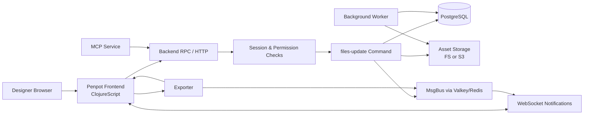
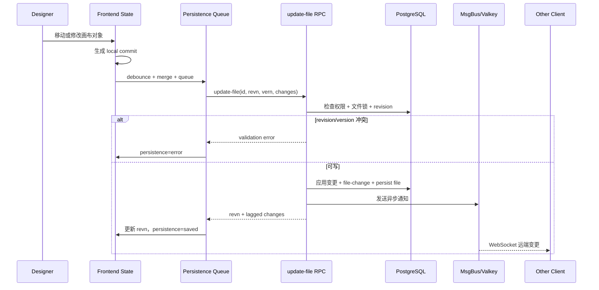
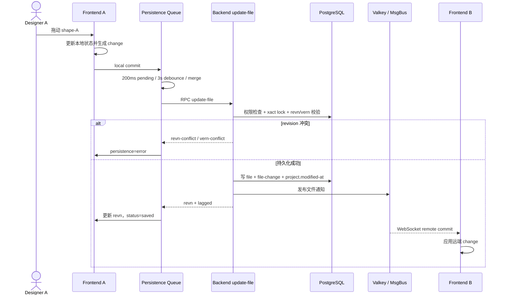

# penpot/penpot 项目深度解析

## 1. 项目概览

- 报告日期：2026-07-15
- 仓库地址：https://github.com/penpot/penpot
- Trending 原始排名：09
- Stars Today：395
- 项目定位：基于开放 Web 标准的协作式界面设计、原型与设计系统平台。
- 解决的问题：让设计师与开发者在可自托管的平台中创建、共享和交付设计资产，避免数据与文件格式被单一商业工具锁死。
- 目标用户：产品设计师、前端工程师、设计系统团队、开源组织和有内网部署要求的企业。
- 当前成熟度：成熟项目；有持续 Release、正式自托管镜像、完整协作和存储组件。
- 推荐结论：适合研究大型 Clojure/ClojureScript 协作应用、revision 持久化和开放格式设计平台；自托管并不等于“一个容器点一下”，运维成本要算全。

## 2. 系统架构

### 2.1 架构概览

Penpot 由浏览器前端、Clojure 后端、导出器、MCP 服务、PostgreSQL、Valkey/Redis 和对象存储组成。前端编辑器在本地状态中生成设计变更，通过 persistence 模块合并和排队后调用 `update-file` RPC。后端先检查编辑权限和 revision/version 冲突，在数据库事务和文件锁内应用、校验并持久化变更，同时写入 file-change 记录、更新项目时间、失效缓存，并通过消息总线/WebSocket 通知其他客户端。导出器负责需要浏览器/渲染环境的输出工作。

### 2.2 架构图

### 2.3 核心模块

| 模块 | 职责 | 代码位置 | 关键依赖 | 证据级别 |
|---|---|---|---|---|
| 前端编辑器 | 设计画布、状态、事件和本地变更生成 | `frontend/src/app/main/` | ClojureScript、Potok、Beicon | High |
| 前端 persistence | 缓冲本地 commits、维护保存状态、调用 `update-file` | `frontend/src/app/main/data/persistence.cljs` | Rx/Beicon、Repo RPC | High |
| 后端系统装配 | 配置数据库、Valkey/Redis、消息总线、HTTP、WebSocket、存储、Worker | `backend/src/app/main.clj` | Integrant、Clojure | High |
| 文件更新命令 | 权限检查、revision 冲突、变更校验、事务持久化和通知 | `backend/src/app/rpc/commands/files_update.clj` | PostgreSQL、MsgBus、Redis | High |
| 数据库 | 用户、团队、项目、文件元数据、file-change 与其他业务数据 | Docker Compose、backend DB 模块 | PostgreSQL 15 | High |
| 消息与协作 | 传播文件更新、会话和实时协作通知 | `app.msgbus`、`app.http.websocket` | Valkey/Redis、WebSocket | High |
| 资产存储 | 图片、字体和其他二进制资源 | `app.storage.*`、Compose | 文件系统或 S3 | High |
| Exporter | 生成导出产物，使用内部 URI 与消息系统 | `exporter/`、Compose | ClojureScript、浏览器环境 | High |
| MCP | 暴露面向 Agent 的设计能力 | `mcp/`、Compose 的 `penpot-mcp` | MCP | Medium-High |

### 2.4 数据与状态管理

- 浏览器端维护工作区与 persistence 状态，包括 `pending`、`saving`、`saved` 和 `error`。
- 本地设计 commits 先按短时间窗口合并，再进入队列；默认 3 秒 debounce 后触发持久化，也支持强制保存。
- 请求包含 `file-id`、`revn`、`vern`、`session-id`、`commit-id`、`changes` 和 feature 集合。
- 后端在数据库事务中检查编辑权限和文件锁，拒绝 version/revision 冲突。
- 每次更新会写入 `file-change` 日志并更新文件与项目；可选 Redis 缓存会被失效。
- 二进制资产可存本地卷或 S3 兼容存储。

### 2.5 外部集成与协议

- 浏览器与后端：HTTP/RPC。
- 实时协作：WebSocket，后端指标明确跟踪连接数和消息数。
- 后端内部通知：Valkey/Redis 支撑消息总线和 WebSocket 通知。
- 认证：密码、LDAP、OIDC、GitHub、GitLab、Google 等由配置 flags 决定。
- 扩展：插件、API、Webhooks 与 MCP。
- 导出：Exporter 通过内部网络访问前端并参与导出流程。

### 2.6 部署与运行形态

官方 Compose 明确包含：

- `penpot-frontend`
- `penpot-backend`
- `penpot-mcp`
- `penpot-exporter`
- `penpot-postgres`
- `penpot-valkey`
- 开发示例中的 `mailcatch`

后端使用共享资产卷，也可切换 S3；生产环境需要替换默认 Secret、启用安全 Cookie/邮件验证、配置 HTTPS、SMTP、数据库备份和对象存储策略。Compose 注释本身明确警告，公网部署不能沿用演示安全 flags。

## 3. 主线流程

### 3.1 核心流程图

### 3.2 关键步骤

1. 用户编辑画布，前端产生标记为 `:local` 的 commit。
2. persistence watcher 将短时间内同文件 commits 合并，并把保存状态改成 `pending`。
3. debounce 或强制保存触发队列执行，构造 `update-file` RPC 参数。
4. 后端检查用户编辑权限，并对文件执行事务锁。
5. 后端校验 feature、`vern` 和 `revn`，防止旧客户端覆盖新版本。
6. 变更经过处理和验证后写入文件数据、file-change 和项目更新时间。
7. 缓存失效，消息总线向其他会话发送通知。
8. 前端收到 revision 后将保存状态改为 `saved`；其他客户端应用远端 commit。

### 3.3 异常与失败处理

- 用户无编辑权限或处于只读版本预览：前端不发送或后端拒绝更新。
- `vern` 不一致：后端抛 `vern-conflict`，提示有不同版本被恢复。
- 客户端 `revn` 大于存储 revision：后端抛 `revn-conflict`。
- RPC 异常：前端 persistence 状态设为 `error`，清除当前运行状态并继续抛出错误，不伪装已保存。
- 队列按 commit 串行处理；一个 commit 成功后丢弃并继续下一个，错误事件会停止当前 persistence task。
- Redis/Valkey 或 WebSocket 故障可能影响实时通知，但数据库持久化和协作传播是不同环节，恢复时需要重新同步状态。

## 4. 典型业务场景端到端执行链路

### 4.1 场景定义

| 项目 | 内容 |
|---|---|
| 场景名称 | 设计师移动一个画布对象并让协作者实时看到更新 |
| 参与者 | 设计师、浏览器前端、Persistence 队列、后端 RPC、PostgreSQL、Valkey/Redis 消息总线、协作者浏览器 |
| 前置条件 | 两名用户已进入同一文件；设计师具有编辑权限；后端、数据库和消息服务可用 |
| 输入 | **示意**：把对象 `shape-A` 的 x 坐标从 100 改为 160；实际 change schema 由 Penpot 前端生成 |
| 期望结果 | 本地画布立即更新，变更被持久化，协作者收到远端更新，保存状态回到 `saved` |
| 成功判定 | 后端返回新 revision；数据库文件内容和 file-change 已更新；另一客户端最终显示相同位置 |

### 4.2 端到端时序图

### 4.3 执行步骤追踪

| 步骤 | 输入 | 执行组件 | 关键代码位置 | 状态或数据变化 | 输出 | 失败分支 | 证据级别 |
|---:|---|---|---|---|---|---|---|
| 1 | 用户拖动操作 | 前端工作区 | `frontend/src/app/main/data/workspace/` | 本地对象坐标改变 | local commit | UI 事件异常，不产生 commit | Medium-High |
| 2 | local commit | Persistence watcher | `persistence.cljs:initialize-persistence` | 状态 `pending`，commit 被缓冲合并 | persistence queue item | watcher 被重新初始化或 error 停止 | High |
| 3 | commit、revn、vern | `persist-commit` | `persistence.cljs:persist-commit` | 构造 update-file 参数 | RPC 请求 | 只读/无编辑权限时不提交 | High |
| 4 | update-file 参数 | 后端 RPC | `files_update.clj::update-file` | 数据库事务、文件锁、feature/revision 校验 | 可执行 params | permission、vern、revn 冲突 | High |
| 5 | changes | 后端变更处理 | `files_update.clj:update-file*` | 应用并验证 changes，revision 递增 | 新文件状态 | schema/业务校验失败，事务回滚 | High |
| 6 | 新文件状态 | DB 持久化 | `persist-file!`、`file-change` insert | 文件、变更日志、项目 modified-at 更新 | revn、lagged changes | DB 错误导致事务失败 | High |
| 7 | 更新事件 | MsgBus/WebSocket | `app.msgbus`、`app.http.websocket` | 发布远端协作通知 | remote commit | 消息服务不可用，实时传播受影响 | High |
| 8 | RPC 响应 | 前端队列 | `persistence.cljs` | 本地 revn 更新，commit 出队，状态 saved | 保存完成 | catch 后状态 error 并抛出 | High |

### 4.4 关键状态与数据变化

- 画布本地状态先变化，确保拖动体验不等待网络往返。
- persistence 状态从空闲进入 `pending → saving → saved`；异常则进入 `error`。
- commit 中的 changes 被合并后发送，减少连续拖动产生的大量小请求。
- 后端文件 revision 是并发控制关键；客户端保存成功后更新自己的 revn。
- `file-change` 保存本次变更日志，并设定未来清理时间。
- 其他客户端通过远端 commit 更新自己的本地状态，不需要重新下载整个文件。

### 4.5 失败传播、重试与回滚

- 数据库操作声明为事务；权限、revision 或变更校验异常会阻止持久化。
- 前端 catch 分支把 persistence 标记为 `error`、清理当前运行状态，并将异常继续上抛。
- 当前文件展示的 persistence 代码没有“遇到任意错误无限自动重试”的承诺；错误后的用户提示和重新同步由更上层 UI/恢复逻辑处理。
- WebSocket 通知是持久化后的异步步骤。若通知链路失败，数据库成功不应被描述为回滚；协作者需要靠重连或重新获取状态恢复一致。

### 4.6 最终业务结果

设计师看到操作即时生效，几秒内保存状态回到已保存；协作者收到同一变更。系统既保留完整文件的新状态，也记录增量 change 和 revision。这个链路的关键不是“多人同时在线”四个字，而是本地乐观更新、合并保存、服务端并发校验和实时广播各自有明确边界。

### 4.7 最小复现与验证方法

1. 使用官方 Compose 启动前端、后端、PostgreSQL 和 Valkey。
2. 创建两个测试用户，进入同一设计文件，并确保其中一人有编辑权限。
3. 打开浏览器网络与 WebSocket 面板，移动一个矩形。
4. 观察前端保存状态、`update-file` RPC 和 WebSocket 消息。
5. 刷新两个浏览器，确认对象位置来自持久化状态而非仅本地内存。
6. 人为让一个客户端使用旧 revision 或切到只读预览，验证冲突/禁止保存分支。
7. 短暂停止 Valkey，区分“数据库保存成功”和“实时协作通知失败”两种结果。

## 5. 技术栈

| 层次 | 技术 | 用途 | 是否核心 | 证据位置 |
|---|---|---|---|---|
| 语言与运行时 | Clojure / JVM | 后端业务、RPC、Worker | 是 | `backend/` |
| 前端 | ClojureScript | 浏览器编辑器和状态管理 | 是 | `frontend/` |
| 状态流 | Potok + Beicon | 前端事件、Observable 和 persistence | 是 | `persistence.cljs` |
| 数据库 | PostgreSQL 15 | 业务数据、文件和 change 日志 | 是 | Compose、backend DB |
| 消息/缓存 | Valkey/Redis | WebSocket 通知、消息总线和可选缓存 | 是 | `main.clj`、Compose |
| 通信 | HTTP/RPC + WebSocket | 命令、查询与实时协作 | 是 | backend HTTP/WebSocket |
| 资产存储 | Filesystem / S3 | 图片与二进制资产 | 是 | storage modules、Compose |
| 图形标准 | SVG / CSS / HTML / JSON | 开放设计表达与开发交接 | 是 | README、common/frontend |
| 部署 | Docker Compose | 自托管多服务部署 | 是 | `docker/images/docker-compose.yaml` |
| 扩展 | Plugins / Webhooks / MCP | 自动化与外部工具接入 | 重要 | repo modules、Compose |

## 6. 创新点

### 创新点 1

- 类型：架构创新
- 传统方案：设计文件常被封装在厂商私有模型中，开发者只能通过导出结果间接理解。
- 当前方案：以 SVG、CSS、HTML 和 JSON 等 Web 标准作为核心表达与交付语义。
- 实际收益：设计与前端实现之间的概念距离更短，也利于自托管和工具扩展。
- 证据：官方 README、技术文档与前端/公共数据模型。
- 局限：开放标准不代表与所有商业设计文件做到无损兼容。

### 创新点 2

- 类型：工作流创新
- 传统方案：每个小编辑立即发请求，容易造成高频网络与竞争覆盖。
- 当前方案：前端乐观更新，短窗口合并 commit，再通过 revision-aware `update-file` 保存。
- 实际收益：交互流畅，同时保留服务端并发校验和增量协作能力。
- 证据：`persistence.cljs` 与 `files_update.clj`。
- 局限：客户端与服务端状态机复杂，断线、旧 revision 和大型文件仍需要专门恢复策略。

### 创新点 3

- 类型：工程整合创新
- 传统方案：设计、原型、开发检查、自托管和自动化通常依赖多个产品。
- 当前方案：把编辑器、协作、导出、设计 Token、插件、Webhooks 和 MCP 组合在一个开源平台。
- 实际收益：组织可控制数据和部署边界，并按需接入自动化。
- 证据：仓库模块、官方功能说明和 Compose。
- 局限：多服务架构带来数据库、缓存、存储、邮件和升级运维成本。

## 7. 应用场景

### 适合

- 开源团队和企业内网的协作式产品设计。
- 强调开放标准与开发者交接的设计系统。
- 需要自托管、API、插件或 Webhook 的组织。

### 可以尝试

- 从 Figma 等平台迁移，但需用真实复杂文件验证组件、字体、原型和插件兼容性。
- 用 MCP/Agent 自动修改或检查设计，前提是权限和审计边界明确。
- 大规模团队部署，需先完成容量、备份和升级演练。

### 暂不建议

- 没有 PostgreSQL、对象存储和备份运维能力却要求高可用的团队。
- 假设任意商业设计文件都能无损迁移的项目。
- 直接把示例 Compose 的默认 Secret 与不安全 flags 暴露到公网。

## 8. 第一次阅读与验证建议

1. 先读 README 与官方 technical guide 的 architecture/configuration。
2. 从 `docker/images/docker-compose.yaml` 理清真实部署组件。
3. 读 `backend/src/app/main.clj` 看服务依赖如何组装。
4. 沿 `frontend/.../persistence.cljs → backend/.../files_update.clj` 追一次保存。
5. 用两个浏览器验证 revision、保存状态和 WebSocket 传播。

## 9. 风险与限制

- 安全：示例 Compose 包含明确标注的不安全开发 flags 和默认 Secret，公网部署必须更换并配置 HTTPS、邮件验证和安全 Cookie。
- 性能：大型设计文件、并发协作、导出和存储会同时消耗浏览器、后端、数据库和对象存储资源。
- 许可证：主项目 MPL-2.0；部署中使用的字体、插件和外部资产需单独核查。
- 维护状态：项目成熟且活跃，但升级可能伴随数据库迁移和配置变更。
- 生产可用性：具备生产基础；高可用、灾备、S3、SMTP、监控和容量设计仍由部署方负责。

## 10. Evidence Notes

- 源码证据：`backend/src/app/main.clj`、`frontend/src/app/main/data/persistence.cljs`、`backend/src/app/rpc/commands/files_update.clj`。
- 部署证据：`docker/images/docker-compose.yaml` 明确列出前端、后端、MCP、Exporter、PostgreSQL 与 Valkey。
- 业务案例的对象名和坐标是示意；实际 change schema 由源码定义。
- 本次没有启动完整 Penpot 实例或进行跨版本文件迁移测试。

## 11. Honest Caveat

本报告对“编辑对象并保存、同步”的链路有直接代码证据，因此流程可信度高；但 Penpot 是大型系统，导出、插件、MCP、评论、版本历史和资产处理各有独立子系统，本文没有把一条保存链路冒充整个产品的全部架构。性能与兼容性结论必须通过目标团队的真实文件和并发测试确认。

## 12. 可信度

- Architecture Confidence: High
- Flow Confidence: High
- Innovation Confidence: Medium