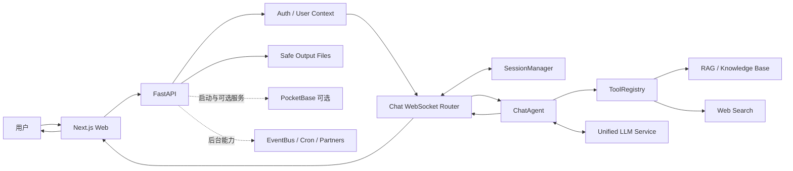
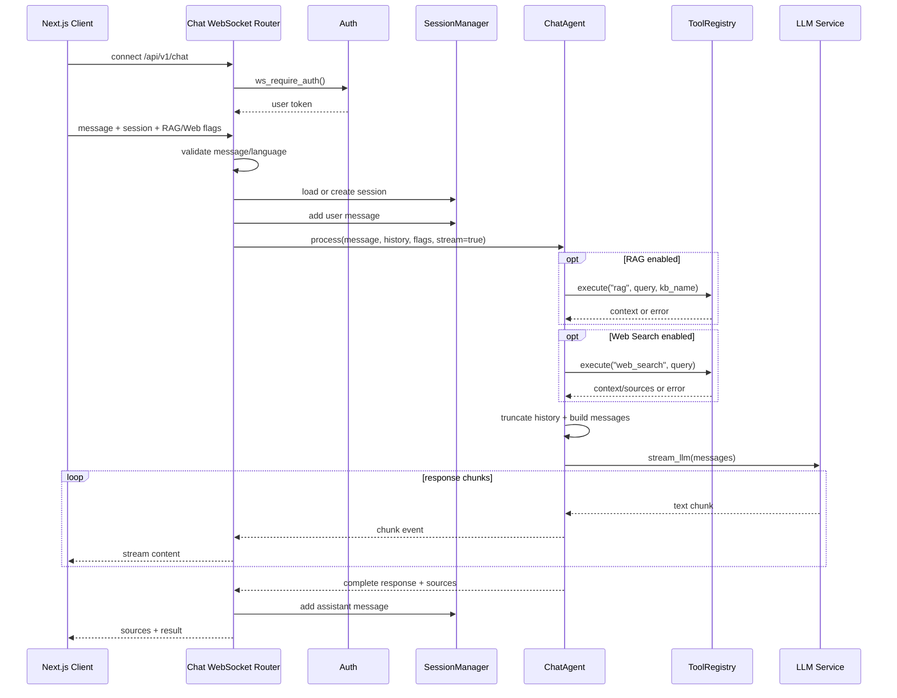
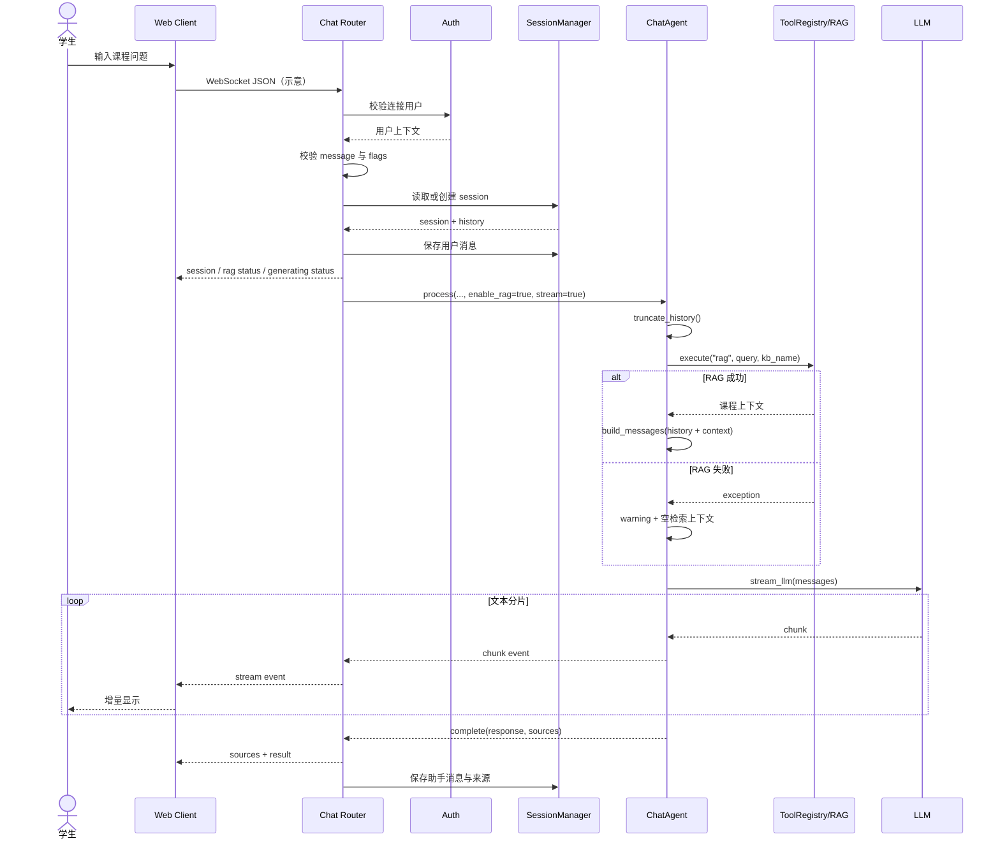

# HKUDS/DeepTutor 项目深度解析

## 1. 项目概览

- **报告日期：** 2026-07-16
- **仓库地址：** https://github.com/HKUDS/DeepTutor
- **Trending 原始排名：** 8
- **Stars Today：** 172
- **项目定位：** 面向长期个性化学习的自托管 AI 教学平台，覆盖聊天、知识库、检索增强、记忆、学习路径、Partner Agent 和多用户管理。
- **解决的问题：** 把“问答、课程材料、来源引用、会话历史和学习功能”组织成一套可持续使用的平台，而不是每次都从空白聊天开始。
- **目标用户：** 学生、自学者、教师、课程团队、研究人员和需要私有化知识辅导的组织。
- **当前成熟度：** 生产候选。版本迭代频繁，Web、API、知识库、多用户和容器化能力较完整，但功能面宽，部署与治理成本也高。
- **推荐结论：** 值得研究其 FastAPI 路由、统一 ChatAgent、RAG/Web Search 容错和会话持久化链路；正式教学使用前要验证知识准确率、隐私、安全和教师监督机制。

## 2. 系统架构

### 2.1 架构概览

DeepTutor 采用前后端分离架构：Web 端基于 Next.js，Python 后端使用 FastAPI。后端启动时初始化运行时配置、日志、LLM 客户端、EventBus、Partner 服务、Cron、PocketBase 连通性与记忆迁移，再挂载聊天、知识库、学习路径、Partner、Skills、Memory 等路由。

聊天路径通过 `/api/v1/chat` WebSocket 接收请求。路由负责鉴权、输入检查、会话创建或恢复、消息落盘和状态事件；`ChatAgent` 负责历史 Token 截断、可选 RAG/Web Search、Prompt 构建和流式模型生成；结果与来源再由 WebSocket 返回并写回会话。

### 2.2 架构图

### 2.3 核心模块

| 模块 | 职责 | 代码位置 | 关键依赖 | 证据级别 |
|---|---|---|---|---|
| Web 前端 | 学习工作区、聊天、设置和知识管理界面 | `web/**` | Next.js 16、React | High |
| FastAPI 应用 | 生命周期、CORS、鉴权依赖、路由装配与受限输出 | `deeptutor/api/main.py` | FastAPI、Uvicorn | High |
| Chat Router | WebSocket 鉴权、会话、状态事件、流式传输与错误反馈 | `deeptutor/api/routers/chat.py` | FastAPI WebSocket、ChatAgent、SessionManager | High |
| ChatAgent | 历史截断、RAG/Web 检索、消息构建与流式 LLM | `deeptutor/agents/chat/chat_agent.py` | BaseAgent、ToolRegistry、LLM Service | High |
| SessionManager | 创建、读取、删除会话并持久化消息 | `deeptutor/agents/chat/session_manager*` | 文件/会话服务，具体实现需继续追踪 | Medium |
| ToolRegistry | 统一注册与执行 `rag`、`web_search` 等工具 | `deeptutor/runtime/registry/tool_registry*` | 各工具实现 | High |
| Knowledge / RAG | 文档解析、索引、检索和知识库管理 | `deeptutor/api/routers/knowledge.py`、相关 services | LlamaIndex、LightRAG、FAISS 等可选后端 | Medium |
| LLM Service | 统一云端和本地模型配置与流式调用 | `deeptutor/services/llm/**`、BaseAgent | OpenAI-compatible providers 等 | High |
| Multi-user / Auth | 会话认证、管理员边界、用户上下文隔离 | `deeptutor/api/routers/auth.py`、`deeptutor/multi_user/**` | FastAPI Dependencies | High |
| Background Services | EventBus、Partner、Cron 与启动检查 | `deeptutor/api/main.py`、`deeptutor/events/**`、`services/**` | asyncio、配置服务 | High |

### 2.4 数据与状态管理

- Chat Router 通过 `SessionManager` 创建或恢复会话，并在模型调用前保存用户消息、完成后保存助手消息及可选来源。
- 会话历史在进入模型前按 Token 上限从旧到新裁剪，保留最近消息。
- RAG 和 Web Search 的检索结果先转成上下文文本，再注入 system message；来源列表单独返回给前端。
- 启动逻辑可检查 PocketBase，但本次聊天链路代码没有表明所有会话都必须依赖 PocketBase，因此架构图将其标为可选。
- API 仅通过 `SafeOutputStaticFiles` 暴露经过路径服务白名单允许的产物，避免把整个用户输出目录直接公开。
- 版本记录显示系统支持多用户工作区和三层记忆，但本案例聚焦轻量 Chat Router，不把所有学习功能强行塞进一条链路。

### 2.5 外部集成与协议

- WebSocket：聊天请求、流式 Token、状态、来源和结果回传。
- LLM Provider：统一配置云端或本地模型，ChatAgent 通过 BaseAgent 调用。
- ToolRegistry：按名称执行 RAG 和 Web Search，避免 ChatAgent 直接绑定具体实现。
- RAG 后端：版本记录中可见 LlamaIndex、LightRAG、FAISS、GraphRAG 等选项；具体使用取决于配置。
- PocketBase：用于部分会话/多用户能力的可选服务，启动时做连通性检查。
- Partner / IM：仓库版本记录显示多个渠道和 Partner Agent，但不属于本次核心聊天案例。

### 2.6 部署与运行形态

- 本地开发：Python 后端 + Next.js Web。
- 容器化：仓库提供 Dockerfile 与容器部署文档，支持单机和远程 Docker 场景。
- 多用户：当 `AUTH_ENABLED=true` 时，除公开认证路由外的主要 API 通过 `require_auth` 依赖保护；管理共享 Partner 数据的路由使用管理员依赖。
- 输出：用户产物通过 `/api/outputs` 受限静态挂载。
- 后台任务：EventBus、Cron 和 Partner 服务随应用生命周期启动与停止。

## 3. 主线流程

### 3.1 核心流程图

### 3.2 关键步骤

1. 客户端建立 `/api/v1/chat` WebSocket，服务端先执行 WebSocket 鉴权；失败则不接受连接。
2. 每条 JSON 请求解析语言、消息、会话 ID、历史、知识库名称以及 RAG/Web Search 开关。
3. 空消息立即返回错误，不创建模型请求。
4. SessionManager 尝试读取会话；不存在或未提供 ID 时创建会话，并向客户端发送新 session ID。
5. 路由保存用户消息，加载 LLM 配置并实例化 ChatAgent。
6. ChatAgent 截断过长历史；按开关调用 ToolRegistry 取得 RAG 或 Web Search 上下文。
7. Agent 将系统提示、检索上下文、裁剪后的历史和当前消息组合为模型 messages。
8. 模型流式返回，路由逐块发 `stream`；完成后再发 `sources` 和 `result`。
9. 助手完整回答与来源被保存到会话。

### 3.3 异常与失败处理

- 空消息：WebSocket 返回 `{type: "error", message: "Message is required"}`，循环继续等待下一条消息。
- RAG 失败：`retrieve_context()` 记录 warning，不抛出；回答可在没有 RAG 上下文的情况下继续。
- Web Search 失败：同样记录 warning 并继续模型生成。
- 模型或业务异常：Chat Router 捕获异常并发送 `error` 消息，不让单次请求直接终止整个进程。
- WebSocket 断开：记录 debug，进入 finally 重置当前用户上下文。
- 启动时关键 Tool 配置漂移：`validate_tool_consistency()` 抛出 RuntimeError，使应用拒绝带错误注册表启动，避免运行到一半才发现工具名对不上。

## 4. 典型业务场景端到端执行链路

### 4.1 场景定义

| 项目 | 内容 |
|---|---|
| 场景名称 | 学生在已有课程知识库上提问，系统检索材料并流式返回带来源的回答 |
| 参与者 | 学生、Next.js 客户端、WebSocket Chat Router、鉴权模块、SessionManager、ChatAgent、ToolRegistry、RAG 工具、LLM Provider |
| 前置条件 | DeepTutor 已启动；用户已登录或本地模式关闭鉴权；知识库已建立；LLM 与 RAG 配置可用 |
| 输入 | **示意：** `{ "message": "请解释牛顿第二定律，并引用课程材料", "kb_name": "physics-101", "enable_rag": true, "enable_web_search": false }` |
| 期望结果 | 客户端先收到 session/status，再看到流式答案，最后收到知识库来源；问答被保存到会话 |
| 成功判定 | 收到 `result` 事件且回答非空；如检索成功，收到 `sources.rag`；重新读取同一 session 可看到用户与助手消息 |

### 4.2 端到端时序图

### 4.3 执行步骤追踪

| 步骤 | 输入 | 执行组件 | 关键代码位置 | 状态或数据变化 | 输出 | 失败分支 | 证据级别 |
|---:|---|---|---|---|---|---|---|
| 1 | WebSocket 连接 | Chat Router / Auth | `deeptutor/api/routers/chat.py` `websocket_chat()` | 建立用户上下文；通过后 accept | 可发送聊天 JSON | 认证失败直接返回，不 accept | High |
| 2 | **示意请求 JSON** | Chat Router | 同文件 lines around request parsing | 解析语言、message、session、kb 与开关 | 规范化请求字段 | `message` 为空时发 error 并 continue | High |
| 3 | session_id 或空值 | SessionManager | `chat.py` session branch | 读取现有会话或创建新会话 | session_id、历史、settings | 指定 ID 不存在时当前实现创建新会话 | High |
| 4 | 用户消息 | SessionManager | `sm.add_message(... role="user")` | 会话增加一条用户消息 | 已保存的会话状态 | 存储异常进入外层请求异常处理 | High |
| 5 | 历史消息 | ChatAgent | `chat_agent.py` `truncate_history()` | 超过 Token 上限的旧消息被丢弃；会话原始存储未被该函数修改 | 裁剪后的模型上下文 | tiktoken 不可用时退化为字符估算 | High |
| 6 | 问题、kb_name | ToolRegistry `rag` | `retrieve_context()` | 成功时生成知识库上下文和 `sources.rag` | context + source metadata | 异常只记 warning，返回空 RAG 上下文 | High |
| 7 | 系统提示、历史、检索上下文、当前问题 | `build_messages()` | `chat_agent.py` | 上下文进入 system message；用户问题作为最后一条 user message | LLM messages | 不支持角色的历史项被忽略 | High |
| 8 | messages | BaseAgent / LLM Service | `generate_stream()` → `stream_llm()` | 模型调用开始；逐块累积 `full_response` | chunk stream | Provider 异常向 Chat Router 传播 | High |
| 9 | 文本 chunk | Chat Router | `chat.py` async for chunk_data | `full_response` 增长 | `{type:"stream"}` | 客户端断开触发 WebSocketDisconnect | High |
| 10 | 完整回答、来源 | Chat Router / SessionManager | `chat.py` complete branch | 保存助手消息及 sources | `sources`、`result` 事件 | 保存或发送失败进入 error 分支；未发现跨存储事务回滚 | High |

### 4.4 关键状态与数据变化

- 会话：无 ID 时创建；有 ID 时恢复。用户消息先落入会话，助手消息在完整生成后落入会话。
- 历史窗口：只对本次模型输入做裁剪，优先保留最近消息；原会话历史并未被 `truncate_history()` 删除。
- 检索上下文：RAG 返回文本后被放进 system message；来源以结构化 `sources.rag` 单独保留。
- 流式回答：`full_response` 在路由内逐块累积，最后以 complete 结果为准。
- 用户上下文：WebSocket 生命周期结束时调用 `reset_current_user()`。
- 本案例未发现消息队列、分布式事务或“检索失败自动重试”的直接证据，因此不补画。

### 4.5 失败传播、重试与回滚

RAG 失败是受控降级：异常被 ChatAgent 捕获，只记录 warning，`context` 保持为空，随后仍构建 messages 并请求 LLM。结果可能缺少课程材料引用，但用户仍可得到通用回答。

模型生成失败则不同：异常传播到 Chat Router，路由发送 `error`。由于用户消息已在调用模型前保存，失败后会话中可能保留用户问题而没有对应助手回答；本次证据没有显示自动删除或事务回滚，因此报告不声称有回滚。

该代码路径没有对 RAG 或 LLM 做自动重试。生产部署若需要重试，必须考虑幂等、费用和重复回答，不能简单在外层套一个无限循环。

### 4.6 最终业务结果

学生看到逐步出现的解释。若 RAG 成功，界面还能拿到课程材料来源；若 RAG 暂时失败，系统尽量退化为普通模型回答，而不是整条聊天链路熄火。会话被保存后，后续问题可以继续携带最近历史。

### 4.7 最小复现与验证方法

1. 按仓库 Quickstart 配置 Python 3.11+、Web 依赖和一个可用 LLM Provider。
2. 建立一个最小知识库，例如上传一份公开物理讲义并等待索引完成。
3. 启动后端和 Next.js Web，登录或使用默认本地单用户模式。
4. 在浏览器开发者工具中观察 `/api/v1/chat` WebSocket。
5. 发送上述**示意问题**并启用 RAG，确认事件顺序至少包含 session/status、若干 stream、sources 和 result。
6. 重新打开同一会话，确认用户问题和助手回答可读取。
7. 在测试环境临时让 RAG 工具返回异常，确认仍进入模型生成且 sources.rag 为空；不要在正式知识库上破坏索引。

## 5. 技术栈

| 层次 | 技术 | 用途 | 是否核心 | 证据位置 |
|---|---|---|---|---|
| 语言与运行时 | Python 3.11+ | 后端、Agent、工具与服务 | 是 | README、`deeptutor/**` |
| 前端 | Next.js 16、React | Web 学习工作区 | 是 | README、`web/**` |
| API | FastAPI、WebSocket | REST 管理接口与流式聊天 | 是 | `deeptutor/api/main.py`、`routers/chat.py` |
| Agent | BaseAgent、ChatAgent | Prompt、历史、工具和模型编排 | 是 | `deeptutor/agents/**` |
| 工具 | ToolRegistry | RAG、Web Search 等统一执行入口 | 是 | `deeptutor/runtime/registry/**` |
| 检索 | LlamaIndex、LightRAG、FAISS 等 | 文档解析、索引和检索 | 配置决定 | README/Release、knowledge services |
| 会话与多用户 | SessionManager、Auth Context、PocketBase 可选 | 会话、用户隔离和部分持久化 | 是/可选 | Chat Router、main.py、multi_user |
| 后台服务 | EventBus、Cron、Partners | 事件、定时任务和 Agent 服务 | 按功能 | `main.py` lifespan |
| 部署 | Docker、Compose、Uvicorn | 本地和容器运行 | 是 | Dockerfile、CONTAINERIZATION.md |
| 日志 | Python logging、选择性 access log | 错误和非 200 请求观察 | 是 | `main.py` |

## 6. 创新点

### 创新点 1：把轻量聊天统一到可选增强链路

- **类型：** 架构创新 / 工作流创新
- **传统方案：** 普通聊天、知识库问答和网页搜索分别维护不同路由与 Prompt。
- **当前方案：** ChatAgent 在同一 `process()` 中按开关组合历史、RAG、Web Search 和流式模型输出。
- **实际收益：** UI 和会话逻辑可复用，增强能力按需开启。
- **证据：** `ChatAgent.process()`、`retrieve_context()`、`build_messages()`。
- **局限：** 单个 Agent 类承担的职责较多，功能持续扩张后需要防止变成“大总管”。

### 创新点 2：检索失败不拖死整轮对话

- **类型：** 可靠性 / 用户体验创新
- **传统方案：** RAG 服务异常直接导致聊天请求失败。
- **当前方案：** RAG 与 Web Search 分别捕获异常，允许无检索上下文继续生成。
- **实际收益：** 可用性更高，用户至少得到回答。
- **证据：** `retrieve_context()` 两个独立 try/catch。
- **局限：** 回答可能失去课程依据；UI 必须清楚展示来源缺失，不能让用户误以为答案来自教材。

### 创新点 3：启动时检查 Capability 与 Tool Registry 漂移

- **类型：** 工程可靠性创新
- **传统方案：** 配置引用不存在的工具，直到用户触发时才报错。
- **当前方案：** 应用生命周期启动阶段比较 capability manifests 与实际工具注册表，发现漂移立即失败。
- **实际收益：** 配置错误更早暴露，减少运行时隐性故障。
- **证据：** `validate_tool_consistency()`。
- **局限：** 只验证名称一致，不等于工具依赖、权限和外部服务都可用。

## 7. 应用场景

### 适合

- 自托管课程资料问答与个人学习助手。
- 教师或研究组搭建私有知识库辅导环境。
- 研究多轮学习对话、RAG、学习路径和 Partner Agent。
- 需要本地模型或多 Provider 选择的实验平台。

### 可以尝试

- 小班课程和机构内部试点，需要教师审核与来源展示。
- 多用户部署，需要压测、备份、租户隔离和管理员权限审计。
- 面向外部用户的学习产品，需要建立内容安全、错误纠正和隐私流程。

### 暂不建议

- 未经教师审阅直接用于高风险考试、医疗、法律或职业资质判断。
- 未做未成年人隐私与内容安全评估就公开部署。
- 把 RAG 引用当成答案必然正确的证明。

## 8. 第一次阅读与验证建议

1. 先读 README 的 Quickstart、Release 与容器文档，了解产品面和部署依赖。
2. 阅读 `deeptutor/api/main.py`，看启动服务、鉴权和路由边界。
3. 阅读 `deeptutor/api/routers/chat.py`，从 WebSocket 入口追踪会话与事件协议。
4. 阅读 `deeptutor/agents/chat/chat_agent.py`，验证历史、检索、Prompt 和流式生成。
5. 继续追 `SessionManager`、ToolRegistry 和一个具体 RAG 实现，确认真正的持久化与索引路径。
6. 用一份小型公开教材建立知识库，分别测试 RAG 成功、RAG 失败、模型失败和 WebSocket 断开。
7. 验证多用户模式下不同账户能否隔离会话、知识库、输出与 Partner 数据。

## 9. 风险与限制

- **安全：** 平台包含文件解析、MCP/工具、Partner、Web Search、输出文件和多用户功能，攻击面较大；必须限制文件类型、工具权限、网络访问和管理员能力。
- **性能：** 文档解析、向量索引、模型生成和 WebSocket 并发都可能消耗大量资源；不同 RAG 后端性能差异明显。
- **许可证：** 主仓库为 Apache-2.0；模型、解析器、向量库、第三方 Provider 和上传教材具有独立许可与数据权利。
- **维护状态：** 发布频繁，功能变化快；升级时需核对数据迁移、配置和前后端兼容。
- **生产可用性：** 具备多用户、容器化和错误处理基础，但本报告未独立验证大规模并发、备份恢复、教学正确率与长期记忆效果。

## 10. Evidence Notes

- `README.md`：产品定位、Python/Next.js、Apache-2.0、近期版本能力与部署入口。
- `deeptutor/api/main.py`：FastAPI 生命周期、配置、CORS、鉴权路由、SafeOutputStaticFiles、EventBus、Cron、Partner 与 PocketBase 检查。
- `deeptutor/api/routers/chat.py`：WebSocket 鉴权、请求协议、会话、状态事件、流式回答、来源与持久化。
- `deeptutor/agents/chat/chat_agent.py`：Token 历史截断、RAG/Web Search、消息构建、流式 LLM 与容错。
- GitHub Trending 2026-07-16 快照：原始排名 8，Stars Today 172。

## 11. Honest Caveat

DeepTutor 功能非常多，本报告只把“带 RAG 的轻量 WebSocket 聊天”追到了可验证的源码位置。知识库索引后端、PocketBase 数据模型、三层记忆、Partner IM 管线和学习路径没有在同一条案例中展开，也没有因为 README 提到就把它们画成每次聊天必经组件。RAG 失败后继续回答提高了可用性，却可能降低依据质量，产品界面需要诚实展示来源状态。

## 12. 可信度

- **Architecture Confidence: High**
- **Flow Confidence: High**
- **Innovation Confidence: Medium**
