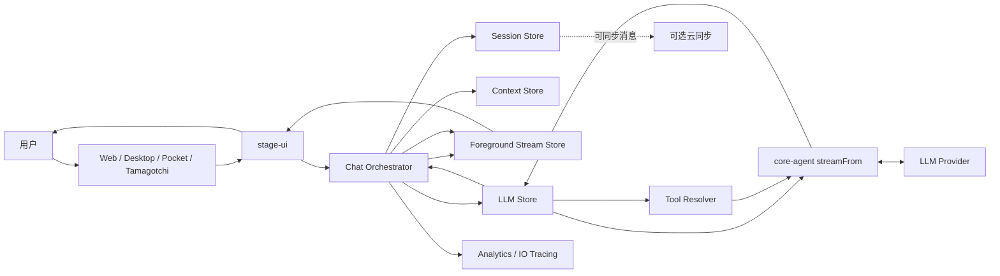
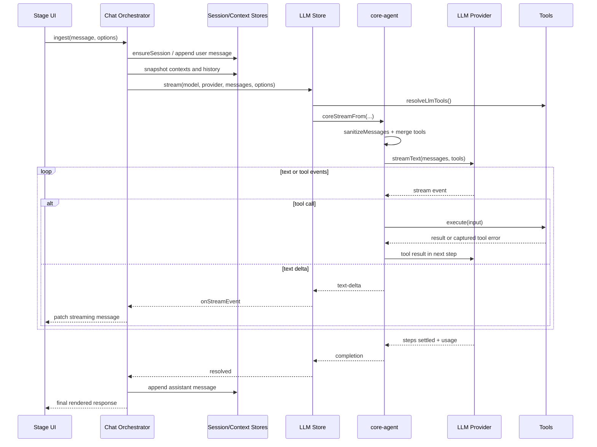
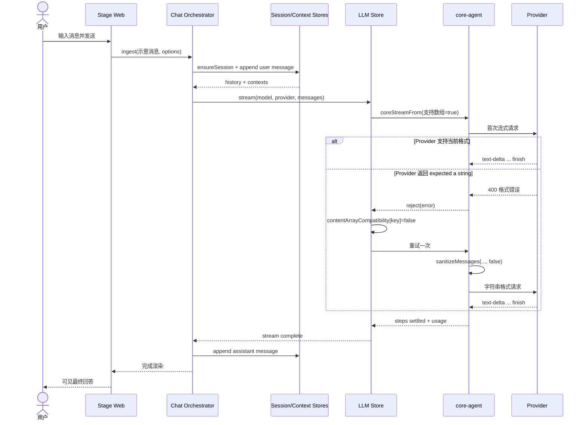

# moeru-ai/airi 项目深度解析

## 1. 项目概览

- **报告日期：** 2026-07-16
- **仓库地址：** https://github.com/moeru-ai/airi
- **Trending 原始排名：** 4
- **Stars Today：** 110
- **项目定位：** 自托管、用户自有的 AI 虚拟角色平台与多端 Agent 运行时。
- **解决的问题：** 把聊天模型、角色表现、语音、工具、外部世界和多端界面接到同一套可扩展运行时中，而不是做一个只能收发文本的聊天框。
- **目标用户：** AI Companion 开发者、虚拟角色创作者、实时语音与多模态应用团队，以及希望研究 Agent 运行时与角色舞台整合的工程师。
- **当前成熟度：** 早期可用、快速演进。核心聊天与多端工程结构已经形成，但不同舞台、游戏集成和多模态能力成熟度不一。
- **推荐结论：** 值得研究其“聊天编排层 + Provider 兼容层 + 多端舞台”的拆分方式；正式部署前需要单独评估隐私、模型成本、音视频延迟、角色资产授权和复杂依赖。

## 2. 系统架构

### 2.1 架构概览

AIRI 采用大型 pnpm monorepo。根工作区将 `apps/**`、`packages/**`、`plugins/**`、`integrations/**`、`services/**` 和 `engines/**` 纳入统一构建；应用层提供 Web、桌面、移动端和 Tamagotchi 等舞台，`stage-ui` 负责聊天交互与状态编排，`core-agent` 负责模型流式调用、工具执行和 Provider 兼容处理。

聊天主链路中，UI 不直接把消息丢给模型 SDK，而是先进入 Chat Orchestrator。编排器统一处理会话、上下文、前台流式消息、工具集、遥测和云同步，再由 LLM Store 调用 `core-agent` 的 `streamFrom()`。该函数负责消息格式归一化、内建工具与自定义工具合并、流式事件转发、工具错误捕获、Token 用量观察和兼容性降级。

### 2.2 架构图

### 2.3 核心模块

| 模块 | 职责 | 代码位置 | 关键依赖 | 证据级别 |
|---|---|---|---|---|
| 多端应用入口 | 提供 Web、桌面、移动端、Tamagotchi 等运行形态 | `apps/**`、根 `package.json` scripts | Vue、Electron/Capacitor、各端运行时 | High |
| Stage UI | 角色舞台、聊天界面和交互状态 | `packages/stage-ui/**` | Vue、Pinia、stage-shared | High |
| Chat Orchestrator Store | 统一接入会话、上下文、流式消息、LLM、工具、遥测和同步 | `packages/stage-ui/src/stores/chat.ts` | core-agent、Pinia、analytics、session/context stores | High |
| LLM Store | 解析工具、缓存 Provider 兼容性并调用核心流式服务 | `packages/stage-ui/src/stores/llm.ts` | core-agent、xsAI、Pinia | High |
| Core Agent LLM Service | 归一化消息、调用模型、执行工具、转发事件、处理用量与错误 | `packages/core-agent/src/runtime/llm-service.ts` | `@xsai/stream-text`、providers、shared-chat | High |
| Tool Resolver | 把内建与自定义工具组装给模型运行时 | `packages/stage-ui/src/stores/llm-tool-resolver*` | Tool 定义、stage integrations | Medium |
| 会话与上下文状态 | 管理活动会话、历史消息、上下文快照与前台流 | `packages/stage-ui/src/stores/chat/session-store*`、`context-store*`、`stream-store*` | Pinia、core-agent runtime | High |
| 可观测与分析 | 记录一轮对话、模型首 Token、失败阶段和上下文投影 | `packages/stage-ui/src/stores/chat.ts`、`composables/use-io-tracer*` | stage-shared、analytics | High |

### 2.4 数据与状态管理

- 前端运行时状态主要由 Pinia Store 管理，包括活动会话、发送状态、待发送队列、流式回答、Provider 与模型兼容性缓存。
- Chat Orchestrator 通过适配器访问会话消息、上下文快照和前台流式消息，避免核心运行时直接依赖具体 UI Store。
- `toolsCompatibility` 与 `contentArrayCompatibility` 使用内存 `Map` 按“Provider Base URL + Model”缓存兼容性判断；当前代码证据表明它们是当前前端进程内状态，不应写成持久数据库。
- 用户消息和助手消息在满足 `isCloudSyncableMessage()` 时会异步调用 `pushMessageToCloud()`；具体服务端存储实现不在本次主链路证据范围内，因此只确认“存在可选云同步接口”。
- 根工作区依赖中可见 PGLite、Drizzle、OpenTelemetry 等组件，但不能据此断言每条聊天链路都会使用这些组件。

### 2.5 外部集成与协议

- LLM Provider：通过 xsAI Provider 抽象接入 OpenAI-compatible 等模型服务。
- 工具调用：内建工具与调用方传入的自定义工具合并后交给模型流式运行时。
- MCP：工作区依赖中包含 Model Context Protocol SDK，属于平台扩展能力；本案例不假设每次聊天都经过 MCP。
- 多端与角色能力：工作区包含 Live2D、VRM、Electron、Capacitor、WebGPU、音频和视觉依赖。
- 可观测性：代码直接创建交互轮次与 LLM 推理 Span，并记录首 Token、文本长度和失败阶段。

### 2.6 部署与运行形态

- Web：根脚本通过 `@proj-airi/stage-web` 启动和构建。
- Desktop / Tamagotchi：存在 Electron 与桌面舞台相关工作区及构建脚本。
- Pocket：存在 iOS、Android 与 Capacitor 相关脚本。
- Server Runtime：根脚本可单独启动 `@proj-airi/server-runtime`。
- Monorepo 构建：使用 pnpm workspace 与 Turbo 协调应用、包和引擎。

本报告没有发现“每次聊天都必须依赖某个中心数据库、队列或微服务集群”的直接证据，因此架构图不补画这些组件。

## 3. 主线流程

### 3.1 核心流程图

### 3.2 关键步骤

1. UI 调用 Chat Orchestrator 的 `ingest()`，核心运行时根据目标会话读取历史与上下文。
2. 编排器把消息、活动模型、Provider、工具提示和可选运行时上下文组合起来，同时建立交互和 LLM 推理 Span。
3. LLM Store 调用 `resolveLlmTools()` 取得内建和自定义工具，再调用 `coreStreamFrom()`。
4. `streamFrom()` 根据 Provider 兼容性归一化消息；如果支持工具，则合并工具并包装执行器，以便把普通异常转成结构化 `tool-error` 事件。
5. `streamText()` 持续产生文本、工具调用和结束事件；文本增量经回调回到 Stage UI，工具结果则进入下一轮模型步骤。
6. `steps` Promise 被视为完整交互的权威完成信号，避免在模型刚发出 `tool_calls` 时误判整轮已经结束。
7. 完成后，编排器追加助手消息、结束 Span，并按配置做分析事件和可选云同步。

### 3.3 异常与失败处理

- 工具执行抛出普通异常时，`withCapturedToolErrors()` 捕获并转换为 `tool-error`，使模型能看到失败结果并决定下一步；`AbortError` 仍向外传播。
- Provider 不支持工具调用时，LLM Store 识别相关错误并把当前模型键记为“不支持工具”，后续调用自动去掉工具。
- Provider 拒绝 `messages[].content` 数组时，LLM Store 将该模型的内容数组兼容性置为 `false`，立即把内容降级为字符串并重试一次。
- 流式事件出现 `error` 时，外层 Promise 被拒绝；完成后的 Token 用量观察失败只记日志，不反过来把已经成功的用户回答判成失败。
- Chat Orchestrator 暴露 `cancelPendingSends()`，可取消尚未执行的排队消息。

## 4. 典型业务场景端到端执行链路

### 4.1 场景定义

| 项目 | 内容 |
|---|---|
| 场景名称 | 用户在 Stage Web 发送一条文字消息，AIRI 通过自定义 OpenAI-compatible Provider 流式回答；若 Provider 不接受内容数组，系统自动降级并重试一次 |
| 参与者 | 用户、Stage Web、Chat Orchestrator、Session/Context Stores、LLM Store、core-agent、LLM Provider |
| 前置条件 | Stage Web 已启动；用户已选择可访问的模型与 Provider；聊天界面和相关 Store 已初始化 |
| 输入 | **示意：** `请用三句话介绍这个项目`；若历史消息含纯文本 content parts，则首次请求可能按数组格式发送 |
| 期望结果 | 页面逐字显示助手回答；一轮完成后助手消息进入会话；兼容性失败时用户无需重新发送 |
| 成功判定 | 流式文本正常结束，`sending` 状态复位，助手消息被追加到当前会话；若发生数组不兼容，第二次请求以字符串内容成功完成 |

### 4.2 端到端时序图

### 4.3 执行步骤追踪

| 步骤 | 输入 | 执行组件 | 关键代码位置 | 状态或数据变化 | 输出 | 失败分支 | 证据级别 |
|---:|---|---|---|---|---|---|---|
| 1 | **示意文字消息** | Stage Web / Chat Store | `packages/stage-ui/src/stores/chat.ts` `ingest()` | 创建或复用当前会话发送任务 | 发送任务进入 Orchestrator | 空消息校验属于 UI/运行时上层，本次未追踪具体组件 | Medium |
| 2 | 消息、目标会话 | Chat Orchestrator Runtime | `packages/stage-ui/src/stores/chat.ts` runtime adapters | 用户消息追加到会话；`sending=true`；建立轮次标识 | 会话历史与上下文可供模型使用 | 运行时失败触发失败分析事件并结束发送状态 | High |
| 3 | 历史、上下文、模型、Provider | `streamWithStageAdapters()` | `packages/stage-ui/src/stores/chat.ts` | 创建 LLM Span，写入 correlation headers，准备事件回调 | 对 LLM Store 的流式调用 | Span 在 `finally` 中结束，避免泄漏 | High |
| 4 | 消息与可选工具 | LLM Store | `packages/stage-ui/src/stores/llm.ts` | 读取兼容性 Map；解析工具 | `coreStreamFrom()` 参数 | 工具不兼容时记录为 false，后续禁用 | High |
| 5 | 原始消息 | `sanitizeMessages()` | `packages/core-agent/src/runtime/llm-service.ts` | error role 改写；按兼容性保留或压平 content parts | Provider 可接受的消息数组 | 非文本内容在不支持数组的 Provider 上会被丢弃，并由代码注释明确承认 | High |
| 6 | 消息、工具、模型配置 | `streamText()` | 同上 `streamFrom()` | 建立模型流；工具错误 Map 按 toolCallId 暂存 | 流式事件 | Provider 错误或事件回调错误使 Promise 拒绝 | High |
| 7 | `text-delta` | Orchestrator 前台流适配器 | `chat.ts` `onStreamEvent` / foregroundStream.patch | `streamingMessage` 持续增长；记录首 Token 与文本长度 | UI 增量显示 | 渲染或回调异常向外传播 | High |
| 8 | “content 必须为字符串”错误 | LLM Store | `llm.ts` catch 分支 | `contentArrayCompatibility[key]=false` | 自动第二次调用 | 仅重试一次；第二次仍失败则抛给上层 | High |
| 9 | `steps` 完成、usage | core-agent | `llm-service.ts` `streamResult.steps.then(...)` | 整轮状态结算；上报可用 Token 用量 | `stream()` resolve | usage 观察失败只记日志，不破坏已完成回答 | High |
| 10 | 完整助手消息 | Chat Orchestrator / Session Store | `chat.ts` assistant callbacks | 助手消息追加；满足条件时异步云同步；`sending=false` | 用户看到最终回答 | 云同步失败处理未在本次文件中追踪，不宣称具备事务回滚 | Medium |

### 4.4 关键状态与数据变化

- `sending`：从空闲变为发送中，运行时结算后复位。
- `streamingMessage`：在文本增量到达时不断 patch，完成后形成最终助手消息。
- 当前会话消息：先追加用户消息，成功后追加助手消息。
- `contentArrayCompatibility`：首次未知时默认允许数组；发现特定 Provider 错误后，该模型键改为 `false`，随后重试和后续轮次都使用字符串。
- `toolsCompatibility`：遇到工具不支持错误后，当前模型键标记为 `false`。
- 遥测：记录轮次、模型请求、首 Token、回答渲染、Token 用量和失败阶段；它是观察数据，不是业务事务状态。

### 4.5 失败传播、重试与回滚

本案例的核心恢复分支是“内容数组不兼容”。第一次请求被 Provider 拒绝后，错误从 core-agent 传播到 LLM Store；Store 判断错误模式，修改内存兼容性缓存并立即重试一次。该过程不需要用户重新发送，也不会重复向会话追加一条新的用户消息。

如果第二次仍失败，错误继续向 Chat Orchestrator 传播，由上层负责把该轮标记为失败。这里没有数据库事务回滚证据，因此不能声称存在跨会话持久化回滚；已追加的用户消息如何在 UI 中呈现，由运行时失败处理决定。

### 4.6 最终业务结果

用户最终得到一段流式显示的角色回答。对兼容性较差的 OpenAI-compatible Provider，AIRI 尝试把差异吸收在运行时内部：先保留多模态能力，确认 Provider 不支持后再降级，而不是一开始就把所有消息砍成纯文本。

### 4.7 最小复现与验证方法

1. 按仓库文档安装依赖，运行 `pnpm dev:web`。
2. 在设置中配置一个可访问的 OpenAI-compatible Provider 与模型。
3. 发送一条纯文字消息，观察回答是否逐步显示。
4. 打开浏览器日志与网络请求，确认 `text-delta` 持续更新前台消息。
5. 要验证降级分支，应使用一个明确拒绝 `messages[].content` 数组的测试 Provider，或在本地 Mock 返回代码中已匹配的 `expected a string` 错误；**不要在生产 Provider 上故意制造未知格式请求。**
6. 验证第二次请求成功后，同一轮只出现一条用户消息和一条最终助手消息。

## 5. 技术栈

| 层次 | 技术 | 用途 | 是否核心 | 证据位置 |
|---|---|---|---|---|
| 语言与包管理 | TypeScript、pnpm、Turbo | 管理大型 monorepo 与跨包构建 | 是 | 根 `package.json`、`pnpm-workspace.yaml` |
| 前端与状态 | Vue、Pinia | 多端 Stage UI 与聊天状态 | 是 | `packages/stage-ui/**` |
| Agent 运行时 | `@proj-airi/core-agent` | 会话编排、模型和工具生命周期 | 是 | `packages/core-agent/**` |
| LLM 接入 | xsAI providers、stream-text | Provider 抽象与流式生成 | 是 | `llm-service.ts` |
| 工具调用 | Tool resolver、xsAI Tool | 内建与自定义工具执行 | 是 | `llm.ts`、`llm-service.ts` |
| 角色与图形 | Live2D、VRM、Pixi、Three | 角色渲染与舞台表现 | 按舞台 | 工作区依赖与相关 packages |
| 多端 | Electron、Capacitor | 桌面与移动端应用 | 按应用 | 根 scripts、apps 工作区 |
| 服务 | Hono、server-runtime | 可选服务运行时 | 按部署 | 根 scripts、工作区依赖 |
| 可观测性 | OpenTelemetry、内部 IO Tracing、Analytics | 轮次、模型和失败阶段观察 | 是 | `chat.ts`、workspace catalog |
| 协议扩展 | MCP | 工具与外部能力扩展 | 可选 | workspace catalog、plugins/integrations |

## 6. 创新点

### 创新点 1：把“角色舞台”与“模型运行时”拆开

- **类型：** 架构创新 / 工程整合创新
- **传统方案：** 聊天 UI、模型 SDK、角色动画和业务状态经常混在一个应用包中。
- **当前方案：** `stage-ui` 负责界面与体验，`core-agent` 负责模型和工具生命周期，多种 apps/engines 通过工作区复用能力。
- **实际收益：** Web、桌面、移动和角色舞台可以共享聊天核心，同时保留各端适配空间。
- **证据：** 根工作区定义、Chat Orchestrator 与 core-agent 的明确调用边界。
- **局限：** Monorepo 体量大，跨包依赖与版本协调成本高。

### 创新点 2：运行时学习 Provider 兼容性

- **类型：** 工作流创新 / 开发体验创新
- **传统方案：** 要求用户手动知道某个兼容接口是否支持 tools 或 content arrays。
- **当前方案：** 首次按能力较完整的格式尝试；检测到特定错误后按 model key 缓存降级，并对内容数组错误自动重试一次。
- **实际收益：** 降低第三方 OpenAI-compatible 服务细微差异带来的用户失败率。
- **证据：** `llm.ts` 的 compatibility Maps 与 catch 分支；`llm-service.ts` 的错误模式和 sanitize 逻辑。
- **局限：** 基于错误文本匹配，Provider 改文案可能漏判；内存缓存不会天然跨进程保留。

### 创新点 3：把完整工具轮次作为完成边界

- **类型：** 运行时可靠性创新
- **传统方案：** 收到一个 `finish` 或 `tool_calls` 原因就误判回答完成。
- **当前方案：** 使用 `streamResult.steps` 作为含工具轮次在内的权威完成信号。
- **实际收益：** 避免工具尚未执行完就结束整轮，特别适合评测和多步 Agent。
- **证据：** `llm-service.ts` 对 `steps` 的注释与结算代码。
- **局限：** 仍受底层 SDK 的步骤语义和 Provider 事件质量影响。

## 7. 应用场景

### 适合

- 自托管 AI Companion 和虚拟角色原型。
- 研究多 Provider、工具调用、流式会话与角色舞台的工程团队。
- 需要 Web、桌面、移动端共享 Agent 逻辑的项目。
- 对 Live2D、VRM、语音和游戏世界交互感兴趣的开发者。

### 可以尝试

- 小规模社区角色应用，需要先明确模型费用、日志和云同步策略。
- 企业内部虚拟助手，需要自行补齐身份、审计、数据保留和内容治理。
- 游戏 NPC 或直播角色，需要针对延迟、状态一致性和资产授权做专项测试。

### 暂不建议

- 未做隐私评估就接入敏感个人对话和长期记忆。
- 在资源受限设备上一次性启用所有图形、语音和模型能力。
- 把所有舞台与集成都视作同等成熟，直接承诺生产 SLA。

## 8. 第一次阅读与验证建议

1. 先读根 `README.md`、`package.json` 与 `pnpm-workspace.yaml`，确认产品边界和工作区划分。
2. 再读 `packages/stage-ui/src/stores/chat.ts`，理解会话编排器如何连接 UI 与核心运行时。
3. 继续读 `packages/stage-ui/src/stores/llm.ts` 和 `packages/core-agent/src/runtime/llm-service.ts`，追踪 Provider 与工具执行。
4. 运行 `pnpm dev:web`，先验证纯文字聊天，再逐项开启语音、角色和外部集成。
5. 使用一个受控 Mock Provider 复现 tools/content-array 兼容降级，不要用生产密钥做破坏性试验。
6. 对照 IO Tracing 和 Analytics 事件，确认一轮聊天的开始、首 Token、完成和失败阶段。

## 9. 风险与限制

- **安全：** 工具调用可能触达本地或外部资源；必须审查工具权限、Provider 密钥、云同步和插件来源。
- **性能：** 角色渲染、语音、模型推理和多端同步叠加后可能产生明显延迟与资源占用。
- **许可证：** 主仓库为 MIT，但模型、角色资产、语音服务、Live2D/VRM 资源和第三方插件可能有独立许可。
- **维护状态：** 提交活跃、演进快；接口和包结构可能变化，升级成本不可忽略。
- **生产可用性：** 核心聊天代码具备较完整错误处理，但本报告未验证所有应用、Provider、语音和游戏集成的稳定性。

## 10. Evidence Notes

- `package.json`：根工作区脚本、版本、许可证、apps/packages 构建与测试入口。
- `pnpm-workspace.yaml`：工作区边界及 MCP、OpenTelemetry、Live2D/VRM、Hono、PGLite 等依赖目录。
- `packages/stage-ui/src/stores/chat.ts`：Chat Orchestrator 适配器、流式事件、会话、上下文、遥测和云同步回调。
- `packages/stage-ui/src/stores/llm.ts`：工具解析、模型兼容性缓存与自动重试。
- `packages/core-agent/src/runtime/llm-service.ts`：消息归一化、工具包装、`streamText()`、步骤结算和错误模式。
- GitHub Trending 2026-07-16 快照：原始排名 4，Stars Today 110。

## 11. Honest Caveat

本报告沿着“文字聊天”主路径做源码静态追踪，没有独立运行全部桌面、移动、Live2D、VRM、语音、Minecraft 与 Factorio 集成。工作区出现某项依赖，只说明仓库中存在相关能力或实验，不等于每次聊天都会经过它。云同步后端的具体持久化、冲突处理和失败补偿未在本次证据中完整追踪，因此没有虚构数据库事务或消息队列。

## 12. 可信度

- **Architecture Confidence: High**
- **Flow Confidence: High**
- **Innovation Confidence: Medium**
