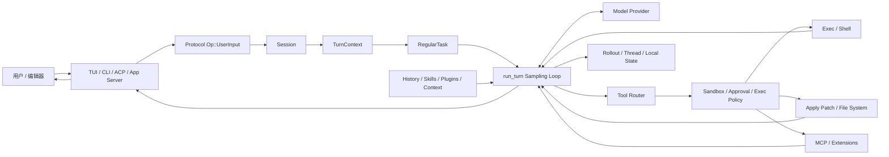
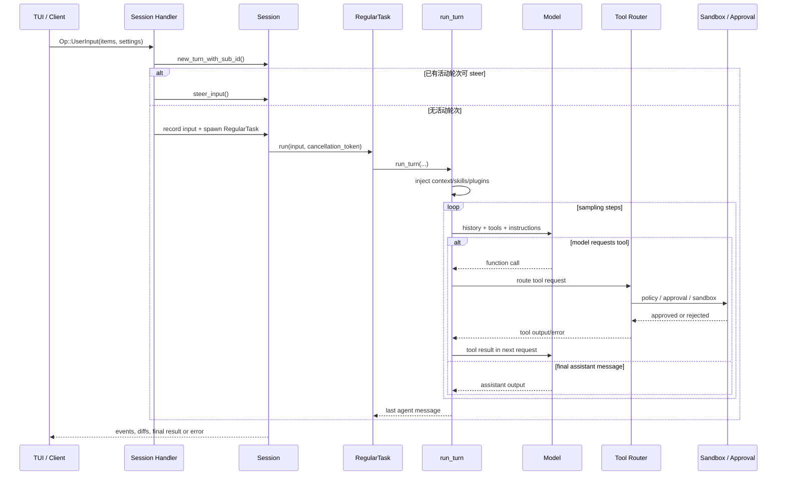
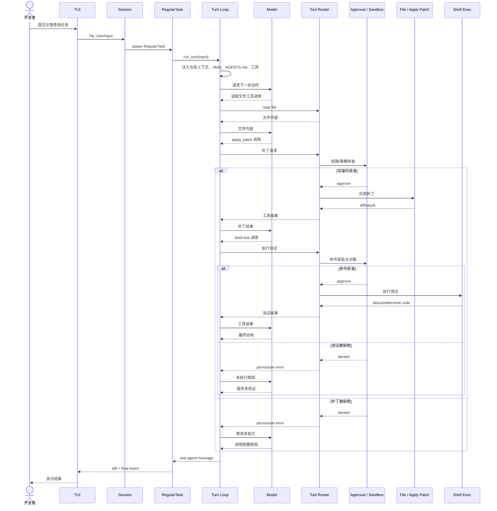

# openinterpreter/openinterpreter 项目深度解析

## 1. 项目概览

- **报告日期：** 2026-07-16
- **仓库地址：** https://github.com/openinterpreter/openinterpreter
- **Trending 原始排名：** 7
- **Stars Today：** 299
- **项目定位：** 基于 OpenAI Codex 分叉的 Rust 编码 Agent，重点通过多种 Agent Harness、原生沙箱和本地工具执行，让低成本模型也能完成实际软件任务。
- **解决的问题：** 单靠模型能力不足以稳定完成代码修改；项目把上下文、工具、审批、Shell、补丁、会话和执行循环组织成可切换的 Harness。
- **目标用户：** 本地编码 Agent 用户、低成本模型使用者、Agent Harness 研究者，以及需要 ACP/MCP/终端接入的开发团队。
- **当前成熟度：** 早期可用、架构复杂且持续快速演进。当前 Rust 版与历史 Python 版是不同代码基础。
- **推荐结论：** 值得研究 Codex 派生的 Session/Turn/Tool Loop 和 Harness 模拟；使用前必须审查沙箱、审批策略、工作目录、密钥和高权限命令边界。

## 2. 系统架构

### 2.1 架构概览

当前 Open Interpreter 是一个大型 Rust workspace。入口可以是 TUI、CLI、ACP Server、App Server 或 MCP Server；这些入口把用户输入转换为协议层 `Op::UserInput` 并交给 Session。Session 为每轮生成 TurnContext，尝试把输入 steer 到活动轮次，或启动 `RegularTask`。

`RegularTask` 调用 `run_turn()`。该函数组合历史、附加上下文、Skills、Plugins、Connectors、工具说明和模型配置，向模型发起采样。模型若返回工具调用，Tool Router 将请求交给 Shell、apply-patch、文件系统、MCP 或扩展工具，执行结果进入会话，再发起下一次采样；模型只返回助手消息时，整轮结束。

执行并非“模型说啥机器干啥”。workspace 中存在 sandboxing、execpolicy、approval、guardian、permissions、secrets 和 process-hardening 等模块；具体是否要求人工审批和允许哪些命令由运行配置决定。

### 2.2 架构图

### 2.3 核心模块

| 模块 | 职责 | 代码位置 | 关键依赖 | 证据级别 |
|---|---|---|---|---|
| TUI / CLI | 接收用户输入、展示事件、模型和 Harness 切换 | `codex-rs/tui/**`、`codex-rs/cli/**` | Ratatui/Clap、protocol | High |
| ACP / App Server | 为编辑器和外部客户端暴露 Agent 会话能力 | `codex-rs/acp-server/**`、`app-server/**` | ACP、JSON-RPC/transport | High |
| Protocol | 定义 `Op`、Event、Turn、Approval 等跨层消息 | `codex-rs/protocol/**` | serde | High |
| Session Handlers | 把 UserInput 写入活动轮次或创建新任务 | `codex-rs/core/src/session/handlers.rs` | Session、TurnContext、RegularTask | High |
| RegularTask | 发出 TurnStarted，调用并循环 `run_turn()` | `codex-rs/core/src/tasks/regular.rs` | SessionTask、CancellationToken | High |
| Turn Loop | 组装上下文、调用模型、处理工具结果与后续采样 | `codex-rs/core/src/session/turn.rs` | ModelClient、ToolRouter、Skills、Plugins | High |
| Tool Router | 路由 Shell、文件、补丁、MCP 和扩展工具 | `codex-rs/core/src/tools/**`、`codex-rs/tools/**` | exec、apply-patch、mcp | High |
| 安全执行层 | 沙箱、权限、审批、exec policy 与进程加固 | `codex-rs/sandboxing/**`、`execpolicy/**`、`process-hardening/**` | OS-specific sandbox | High |
| 状态与记录 | 本地配置、会话、thread、rollout 和 trace | `codex-rs/state/**`、`thread-store/**`、`rollout/**` | 文件系统、本地目录 | Medium |
| Harness 模拟 | 切换 native、claude-code、zcode、kimi-cli 等行为模板 | Harness 配置与 core 相关模块 | Prompt、工具规范、模型参数 | High |

### 2.4 数据与状态管理

- README 明确配置和 Session State 保存在 `~/.openinterpreter`，属于本地优先状态。
- Session 持有活动轮次、历史、配置、附加上下文和输入队列；每轮创建 TurnContext。
- `run_turn()` 克隆会话历史作为模型输入，记录 Skills/Plugins 注入项和工具输出，必要时执行上下文压缩。
- `RegularTask` 在一轮结束后检查 pending input；如果用户在 Agent 工作时继续输入，会在共享调度中继续处理。
- `TurnDiffTracker` 跟踪一轮中的工作区变化，用于向用户呈现修改。
- 本次证据没有显示必须依赖远程数据库或消息队列，因此不补画。

### 2.5 外部集成与协议

- 模型 Provider：支持在 TUI 中切换模型，并通过模型客户端建立采样会话。
- ACP：通过 `interpreter acp` 接入支持 Agent Client Protocol 的编辑器。
- MCP：包含 MCP client/server、扩展与工具执行模块。
- Shell 与文件：通过 exec、shell-command、file-system、apply-patch 等 crate 执行本地动作。
- Computer Use：README 表明 QA Skill 可借助 browser agent 或 CUA 操作 Web/原生应用。
- Skills、Hooks、Plugins、AGENTS.md：用于注入工作方法和项目上下文。

### 2.6 部署与运行形态

- 本地终端：安装后执行 `i` 或 `interpreter` 进入 TUI。
- 编辑器：运行 ACP Server。
- 外部服务：App Server、MCP Server 和相关 transport crate 提供程序化入口。
- 操作系统：README 声明在 macOS、Linux 和 Windows 使用原生沙箱；具体安全级别与系统能力有关。
- 工作区采用 Rust 2024 edition，模块数量多，构建和维护成本明显高于单 CLI 项目。

## 3. 主线流程

### 3.1 核心流程图

### 3.2 关键步骤

1. 用户输入被表示为 `Op::UserInput`，可同时携带输出 schema、附加上下文和 thread settings。
2. Session Handler 应用本轮设置并创建 TurnContext。
3. 如果已有活动轮次，输入尝试通过 `steer_input()` 加入；否则构造 `TurnInput::UserInput` 并启动 `RegularTask`。
4. `RegularTask` 发出 `TurnStarted`，调用 `run_turn()`，并在有待处理输入时继续下一次循环。
5. `run_turn()` 先处理预采样压缩、上下文更新、Skills/Plugins/Connectors 注入和 Hooks。
6. 采样请求使用当前模型可见历史、工具说明和配置。
7. 模型返回工具调用时，工具被执行，输出记录到会话并进入下一次采样；只返回助手消息时完成。
8. 执行期间可发出审批、权限、diff、warning、error 和最终消息事件给客户端。

### 3.3 异常与失败处理

- Turn 创建失败时，Session 自行发送错误事件，Handler 直接返回。
- `steer_input()` 失败时，转为协议 Error Event；没有活动轮次则正常创建任务。
- `CancellationToken` 贯穿 RegularTask 与 `run_turn()`，用户中断可以终止当前执行。
- 子 Agent 并发由 `AgentExecutionLimiter` 控制；达到上限返回 `AgentLimitReached`。
- Shell 或补丁操作可以进入审批流程；拒绝时工具不会按原请求执行。
- `run_turn()` 的预采样压缩失败会发出生命周期错误；TurnAborted 直接向上返回。
- 模型流或工具错误作为会话事件反馈，下一轮是否继续取决于错误类型和运行时策略。

## 4. 典型业务场景端到端执行链路

### 4.1 场景定义

| 项目 | 内容 |
|---|---|
| 场景名称 | 开发者要求 Agent 修改一个源文件并运行测试，系统在权限和沙箱约束下完成修改并汇报结果 |
| 参与者 | 开发者、TUI、Session、RegularTask、Turn Loop、模型、Tool Router、Approval/Sandbox、文件与 Shell 工具 |
| 前置条件 | Open Interpreter 已安装；已进入目标 Git 仓库；模型 Provider 可用；当前审批与沙箱策略允许读取仓库，并对写文件/执行测试定义了明确规则 |
| 输入 | **示意：** “把 `src/parser.rs` 中的空输入处理改为返回明确错误，并运行相关测试。”文件名和任务仅为链路示例，不是仓库官方 Demo |
| 期望结果 | Agent 读取代码、生成补丁、按要求运行测试，最终说明修改文件、测试结果和未解决问题 |
| 成功判定 | 工作区出现预期 diff；测试命令退出码为 0；最终助手消息准确列出改动和验证；未授权命令没有被执行 |

### 4.2 端到端时序图

### 4.3 执行步骤追踪

| 步骤 | 输入 | 执行组件 | 关键代码位置 | 状态或数据变化 | 输出 | 失败分支 | 证据级别 |
|---:|---|---|---|---|---|---|---|
| 1 | **示意开发任务** | TUI / Protocol | `codex-rs/protocol/**`、TUI input | 生成 `Op::UserInput` | Submission 进入 Session | 输入解析失败由客户端提示 | High |
| 2 | UserInput、thread settings | Session Handler | `core/src/session/handlers.rs` `user_input_or_turn_inner()` | 创建 TurnContext；更新本轮模型、沙箱和审批设置 | 活动轮次或新任务 | `new_turn_with_sub_id` 失败时发 Error Event | High |
| 3 | TurnInput | RegularTask | `core/src/tasks/regular.rs` | 发出 TurnStarted；建立 CancellationToken | 调用 `run_turn()` | prewarm cancelled 时返回 | High |
| 4 | 历史、仓库、Skills/Plugins | Turn Loop | `core/src/session/turn.rs` | 记录上下文变化，注入 Skills/Plugins/Connectors/Hooks | 模型可见输入 | 压缩或 Hook 失败可中止本轮 | High |
| 5 | 模型请求 | Model Client | `run_turn()` sampling request | 模型会话产生 reasoning、assistant 或 function call | 工具调用或最终消息 | Provider 错误形成 Error Event | High |
| 6 | 读取工具调用 | Tool Router / File System | `core/src/tools/**`、`file-system/**` | 不修改工作区 | 文件内容 | 路径越界或权限不足返回错误 | Medium |
| 7 | **示意补丁** | Apply Patch + Policy | `apply-patch/**`、`execpolicy/**`、approval protocol | 获准后工作区文件变化；TurnDiffTracker 记录 diff | patch result | 拒绝时不写文件；补丁冲突返回错误 | High |
| 8 | **示意测试命令** | Shell Exec + Sandbox | `exec/**`、`shell-command/**`、`sandboxing/**` | 启动受策略约束的子进程 | stdout/stderr/exit code | 审批拒绝、超时、非零退出或用户取消 | High |
| 9 | 工具结果 | Turn Loop | `turn.rs` 模型工具循环 | 工具输出进入会话历史，触发下一次采样 | 模型决定修复、重试或总结 | 工具错误可能让模型改方案；不保证自动修复成功 | High |
| 10 | 最终助手消息和 diff | Session / TUI | `RegularTask` return、protocol events | 本轮结束；本地 rollout/thread 状态更新 | 用户看到改动与验证结果 | 有 pending input 时继续处理；中断时报告不完整 | High |

### 4.4 关键状态与数据变化

- Thread/Session：接收一条新的 UserInput，并建立 TurnContext。
- Conversation History：记录用户输入、工具调用、工具结果和助手输出，供后续采样使用。
- 工作区：读取步骤不修改文件；apply-patch 获准后产生 diff；被拒绝则不产生该修改。
- Process State：测试命令在沙箱/策略允许后启动，退出码和输出作为工具结果回到模型。
- TurnDiffTracker：收集本轮文件变化，便于用户核对。
- Local State：README 说明配置和会话位于 `~/.openinterpreter`；具体文件布局随版本变化，本报告不编造表结构。
- Approval State：高风险动作可能等待用户决定；批准、拒绝或取消都会成为显式事件。

### 4.5 失败传播、重试与回滚

如果补丁审批被拒绝，工具层返回权限错误，模型只能解释未执行原因或提出替代方案，不能绕过审批。若补丁成功而测试失败，模型可读取错误并尝试下一轮工具调用；这是一种 Agent 级修复循环，不是事务回滚。

文件修改没有跨文件数据库事务证据。若后续测试失败，已经应用的补丁通常仍留在工作区，开发者可通过 diff 审查、让 Agent 继续修复，或使用版本控制回退。报告不把 Git 自动回滚画成默认行为。

用户中断通过 CancellationToken 传播。中断时已完成的文件操作是否保留取决于操作是否已经落地；因此最可靠的保护仍是干净工作树、版本控制、最小权限和逐步审批。

### 4.6 最终业务结果

成功时，开发者得到可见的文件 diff、测试输出和最终总结；失败时，系统应明确区分“修改没获批”“修改已做但测试失败”“模型/工具异常”或“用户取消”。Harness 的价值就在于让模型不只是说答案，而是沿着工具结果不断修正，直到完成或诚实停下。

### 4.7 最小复现与验证方法

1. 在一个新建的测试仓库中提交初始版本，确保工作区干净。
2. 安装 Open Interpreter，配置一个测试模型和最严格的审批策略。
3. 创建一个小函数和对应测试，再提交上述**示意任务**，不要使用真实敏感仓库。
4. 观察首次文件读取、补丁审批和测试命令审批是否逐项出现。
5. 先拒绝测试命令，确认 Agent 不执行且最终说明“未验证”。
6. 再开新轮允许测试，确认工具输出回到模型，并在测试通过后生成总结。
7. 使用 `git diff` 和测试命令人工复核结果；不要只信最终自然语言。

## 5. 技术栈

| 层次 | 技术 | 用途 | 是否核心 | 证据位置 |
|---|---|---|---|---|
| 语言与运行时 | Rust 2024、Tokio | 核心运行时与异步任务 | 是 | `codex-rs/Cargo.toml` |
| 交互 | TUI、CLI、ACP | 终端和编辑器入口 | 是 | `tui/**`、`cli/**`、`acp-server/**` |
| 协议 | Codex Protocol、Events、Ops | 客户端与核心之间的消息契约 | 是 | `protocol/**` |
| Agent Core | Session、TurnContext、RegularTask、run_turn | 输入、上下文、采样和工具循环 | 是 | `core/src/session/**`、`core/src/tasks/**` |
| 工具 | ToolRouter、Exec、Apply Patch、File System | 读取、修改和执行 | 是 | `core/src/tools/**`、相关 crates |
| 安全 | Sandboxing、ExecPolicy、Approvals、Guardian | 限制高权限动作 | 是 | 对应 workspace crates |
| 扩展 | MCP、Skills、Hooks、Plugins、Connectors | 外部工具和工作流注入 | 可选但重要 | `mcp*`、`skills*`、`hooks`、`plugin` |
| 状态 | Rollout、Thread Store、State | 会话与执行记录 | 是 | `rollout/**`、`thread-store/**`、`state/**` |
| 模型接入 | Model Provider、Responses Client、WebSocket | 采样与流式事件 | 是 | `model-provider/**`、`codex-client/**` |
| 可观测性 | OTel、Rollout Trace、Analytics | 运行事件和追踪 | 是/可选 | `otel/**`、`rollout-trace/**`、`analytics/**` |

## 6. 创新点

### 创新点 1：Harness 可切换，而不是把 Prompt 固化成产品

- **类型：** 工作流创新 / 研究工具创新
- **传统方案：** 一个 Agent 产品绑定一套 Prompt、工具名和执行习惯。
- **当前方案：** 用户可在 native、claude-code、zcode、kimi-cli、qwen-code、swe-agent 等 Harness 间切换。
- **实际收益：** 可以让同一模型对比不同执行框架，也能针对低成本模型选择更合适的约束和提示结构。
- **证据：** README 的 `/harness` 列表和 Harness 文档入口。
- **局限：** 模拟 Harness 不等于完整复制原产品；效果依赖模型、任务和实现细节。

### 创新点 2：把工具调用视作多步采样循环

- **类型：** 架构创新
- **传统方案：** 模型一次输出代码块，用户手工复制执行。
- **当前方案：** `run_turn()` 明确执行函数调用，把结果送回模型，再决定下一步；只有助手消息时才完成。
- **实际收益：** 形成“观察—行动—反馈—修正”的闭环。
- **证据：** `turn.rs` 的函数注释和采样循环。
- **局限：** 循环可能放大费用、延迟和错误；必须有步数、权限和取消边界。

### 创新点 3：Codex 核心与本地低成本模型目标结合

- **类型：** 工程整合创新
- **传统方案：** 高级 Agent Harness 通常与特定云模型产品绑定。
- **当前方案：** 分叉 Codex 的 Rust 架构，同时强调在 TUI 中切换 Provider、模型和 Harness。
- **实际收益：** 让本地或低价模型也能借用成熟的 Session、工具、沙箱和协议结构。
- **证据：** README 定位、模型与 Harness 切换、Cargo workspace。
- **局限：** 便宜模型并不会因为 Harness 自动获得同等推理能力，复杂任务成功率仍需实测。

## 7. 应用场景

### 适合

- 在隔离测试仓库中使用低成本模型完成小步代码任务。
- 对比不同 Agent Harness 对同一模型的影响。
- 需要 ACP、MCP、终端和本地状态的工程团队。
- 研究 Session、Turn、工具和审批协议的开发者。

### 可以尝试

- 企业内部编码助手，需要额外的身份、审计、网络代理和密钥治理。
- 自动化 UI 测试与 Computer Use，需要严格限制目标应用和账户。
- 多 Agent 任务，需要压测并发上限、上下文与费用。

### 暂不建议

- 在无版本控制、无备份或含敏感密钥的目录中放开自动执行。
- 关闭审批和沙箱后让陌生模型执行任意 Shell。
- 假设历史 Python 版插件、教程或 API 可直接用于当前 Rust 版。

## 8. 第一次阅读与验证建议

1. 先读 README，特别是“new Rust version”和 Harness、Sandbox 文档。
2. 阅读 `codex-rs/Cargo.toml`，建立 workspace 模块地图。
3. 沿 `core/src/session/handlers.rs` → `tasks/regular.rs` → `session/turn.rs` 追踪一条 UserInput。
4. 再看 `core/src/tools/**`、`exec/**`、`apply-patch/**` 和 approval/sandbox crates。
5. 在一次性测试仓库中用最严格策略运行只读任务，再逐步开放写文件和测试命令。
6. 对比两个 Harness 完成同一小任务，记录成功率、工具轮次、Token、延迟和人工介入次数。
7. 阅读协议 Event 定义，确认客户端怎样表示批准、拒绝、diff、warning 与错误。

## 9. 风险与限制

- **安全：** 项目能执行 Shell、修改文件、访问 MCP/网络和操作应用；错误配置可能直接伤害本机数据或泄露密钥。
- **性能：** Rust 运行时开销可控，但多轮模型采样、工具执行和大上下文仍会产生明显延迟与费用。
- **许可证：** 当前仓库为 Apache-2.0；模型、外部工具、Skills 和第三方 Harness 名称与内容有独立条款。
- **维护状态：** 当前版本是大型 Codex fork，更新速度快；上游同步、分叉差异和接口变动会增加维护成本。
- **生产可用性：** 核心模块和安全组件齐全，但本报告未验证每个 OS 沙箱、Provider、Harness、ACP/MCP 客户端组合。

## 10. Evidence Notes

- `README.md`：当前 Rust 版、Codex fork、低成本模型定位、Harness 列表、Computer Use、沙箱、ACP、MCP、Skills 与本地状态。
- `codex-rs/Cargo.toml`：TUI、core、protocol、exec、apply-patch、sandboxing、approvals、MCP、ACP、hooks、skills、state 等 workspace 模块。
- `codex-rs/core/src/session/handlers.rs`：`Op::UserInput` 进入 Session，steer 或 spawn RegularTask。
- `codex-rs/core/src/tasks/regular.rs`：TurnStarted、CancellationToken 和 `run_turn()` 循环。
- `codex-rs/core/src/session/turn.rs`：上下文注入、模型采样、工具调用结果回送和助手消息完成条件。
- `codex-rs/core/src/agent/control/execution.rs`：子 Agent 执行容量限制与 UserInput turn 判定。
- GitHub Trending 2026-07-16 快照：原始排名 7，Stars Today 299。

## 11. Honest Caveat

本报告分析的是 2026 年当前 Rust 代码库，不是广为流传的旧 Python 版。典型文件路径和测试命令是明确标注的示意，用来说明可验证的 Session—Turn—Tool—Approval 链路，并非仓库官方固定 Demo。不同操作系统的沙箱、安全策略和 Provider 行为没有逐项运行验证；存在安全模块不等于默认配置永远安全。

## 12. 可信度

- **Architecture Confidence: High**
- **Flow Confidence: High**
- **Innovation Confidence: Medium**
