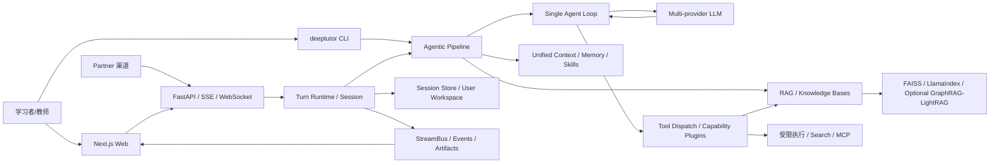

# HKUDS/DeepTutor 项目深度解析

## 1. 项目概览

- 报告日期：2026-07-17
- 仓库地址：https://github.com/HKUDS/DeepTutor
- Trending 原始排名：11
- Stars Today：656
- 项目定位：一个面向长期个性化学习的 Agent-native 平台，把聊天、知识库、研究、解题、学习路径、记忆、技能与多渠道 AI Partner 放在同一运行体系中。
- 解决的问题：普通 AI 家教通常只回答当前问题，缺少用户隔离、资料检索、长期记忆、过程追踪、工具调用、学习评估和可恢复执行。
- 目标用户：个人学习者、教师与课程团队、研究资料使用者、企业培训团队，以及需要自托管教育 Agent 的开发者。
- 当前成熟度：生产候选。项目已有 1,000+ commits、连续版本发布、Web/CLI/容器和多用户能力，但功能面与依赖面很宽。
- 推荐结论：适合需要深度定制和自托管的 AI 学习平台；仅需简单问答时可能过重。

## 2. 系统架构

### 2.1 架构概览

DeepTutor 由 Python 后端、Next.js Web 前端、CLI 和可选的多渠道 Partner 适配器组成。后端以 FastAPI/WebSocket/SSE 提供会话和流式能力，核心聊天统一到 `deeptutor/agents/chat/agent_loop.py`：每一轮调用模型，若产生工具请求则分发工具并把结果追加回同一 conversation；没有工具请求的轮次成为最终答案。`AgenticChatPipeline` 负责构建上下文、知识库 seed、能力插件和工具 schema；`turn_runtime.py` 负责请求快照、流事件、答案装配、附件和会话持久化。RAG 层以 LlamaIndex 为基础，可选 FAISS、GraphRAG、LightRAG 与多种文档解析器。会话、知识库、三层记忆、用户配置和 Partner 私有状态通过 SQLite/PocketBase/文件工作区等持久化，具体后端按部署与功能而异。

### 2.2 架构图



### 2.3 核心模块

| 模块 | 职责 | 代码位置 | 关键依赖 | 证据级别 |
|---|---|---|---|---|
| Web 前端 | 学习空间、聊天、知识库、Agent、设置和流事件渲染 | `web/` | Next.js 16、React、stream client | High |
| Web/API 服务 | 路由、认证、会话、上传、WebSocket/SSE | `deeptutor_web/` | FastAPI、uvicorn、websockets | High |
| CLI | 初始化、启动、配置、技能和本地交互 | `deeptutor_cli/` | Typer、Rich、prompt_toolkit | High |
| Agentic Chat Pipeline | 组装模型、工具、知识库、persona、skills 与上下文 | `deeptutor/agents/chat/agentic_pipeline.py` | UnifiedContext、LLM、tools | High |
| 单一 Agent Loop | 流式模型轮次、工具分发、暂停、终止和强制 finish | `deeptutor/agents/chat/agent_loop.py` | StreamBus、tool dispatch | High |
| Turn Runtime | 请求快照、消息与附件持久化、流事件装配、重启恢复 | `deeptutor/services/session/turn_runtime.py` | SessionStoreProtocol | High |
| 知识库/RAG | 文档解析、索引、检索和版本管理 | `deeptutor/knowledge/`, `deeptutor/services/rag/` | LlamaIndex、FAISS、可选 GraphRAG/LightRAG | High |
| 能力 Agents | Research、Solve、Question、Visualize、Guided Learning 等 | `deeptutor/agents/` | 通用 pipeline、tools、prompts | High |
| Skills/Partners | Agent Skills 和多渠道长期 AI 伙伴 | Skills 目录、Partner/channel 模块 | MCP、各 IM SDK | High |
| 数据与用户隔离 | 会话、用户、工作区、知识库和记忆存储 | session services、PocketBase、path service | aiosqlite、PocketBase、文件系统 | Medium |
| 部署 | 本地、Docker Compose、GHCR 与 runner | `Dockerfile*`, `compose.yaml`, `docker-compose*.yml` | Docker/Podman | High |

### 2.4 数据与状态管理

- 会话消息通过 `SessionStoreProtocol` 抽象，支持分支消息、恢复和 turn 状态。
- `turn_runtime.py` 保存请求快照，包括 capability、tools、knowledge bases、语言、附件、persona、memory references 和模型选择。
- 知识库保存源文档、解析结果、索引版本和检索配置；FAISS 用于大库向量检索，缺失时存在 fallback 路径。
- 三层 Memory 和每个 Partner 的私有记忆形成长期状态。
- 文件型输出通过受控 outputs URL 和 assistant attachment 元数据呈现。
- 多用户部署强调每用户工作区和资源隔离，但真实边界仍依赖部署配置与版本。

### 2.5 外部集成与协议

- LLM：OpenAI、Anthropic、DashScope、Perplexity 及 OpenAI-compatible 本地/云端 provider。
- RAG：LlamaIndex、FAISS，可选 GraphRAG、LightRAG/RAG-Anything。
- 文档：PDF、DOCX、XLSX、PPTX 等解析器和可选解析引擎。
- Channel：Telegram、Slack、飞书、钉钉、企业微信、Matrix、Mattermost 等可选 SDK。
- MCP：Partner 或 Agent 工具扩展，非管理员默认权限在新版本中趋向 deny-by-default。
- 流式协议：WebSocket/SSE 与内部 StreamEvent/StreamBus。

### 2.6 部署与运行形态

支持本地 Python/Node 进程、Docker Compose、GHCR 镜像和可选 runner。简单单用户模式可在本机运行；多用户与公网部署需要认证、持久卷、反向代理和隔离配置。项目包含 rootless Podman 和单端口代理说明，但不能假定所有 compose 组合都默认安全。

## 3. 主线流程

### 3.1 核心流程图

```mermaid
sequenceDiagram
    actor User as 学习者
    participant Web as Web/CLI
    participant Runtime as Turn Runtime
    participant Pipeline as Agentic Pipeline
    participant RAG as Knowledge Retrieval
    participant Loop as Agent Loop
    participant LLM as LLM Provider
    participant Tool as Tool Dispatcher
    participant Store as Session Store

    User->>Web: 提交问题、资料引用与能力选择
    Web->>Runtime: 请求 payload
    Runtime->>Store: 保存用户消息和请求快照
    Runtime->>Pipeline: 构建 UnifiedContext
    Pipeline->>RAG: 检索知识库 seed
    RAG-->>Pipeline: 文档片段与来源
    Pipeline->>Loop: messages + tools + context
    Loop->>LLM: 流式 round
    LLM-->>Loop: 内容 + 可选 tool calls
    alt 有工具调用
        Loop->>Tool: 分发研究/检索/执行工具
        Tool-->>Loop: tool messages、sources、artifacts
        Loop->>LLM: 追加工具结果继续
    else 无工具调用
        Loop-->>Runtime: finish answer
    end
    Runtime->>Store: 保存最终答案、来源和附件
    Runtime-->>Web: 流式内容、trace、sources
```

### 3.2 关键步骤

1. 前端提交内容、capability、工具、知识库、附件、persona、memory references 和模型选择。
2. Turn Runtime 清洗和保存请求快照，建立 session/branch 上的用户消息。
3. Pipeline 加载统一上下文、技能、长期记忆和可用工具，并执行可选 pre-loop briefings。
4. `_retrieve_kb_seed_block` 从所选知识库生成 grounding seed，合并到 loop messages。
5. Agent Loop 每轮调用一次 LLM，文本实时流向用户；有工具调用时将该轮标记为 narration。
6. Tool dispatcher 执行检索、搜索、代码/文件产物或能力插件，并把 `role=tool` 结果追加回 conversation。
7. 没有工具请求的一轮成为 finish；若工具轮次耗尽，系统强制进行无工具 finish。
8. Turn Runtime 过滤 narration，只把 finish 内容装配为持久化答案，同时保存 sources 和 generated artifacts。

### 3.3 异常与失败处理

- 第一轮 LLM 失败直接传播；已经完成若干轮后发生模型超时或网络错误，Agent Loop 会尝试 forced finish，尽量保留已收集结果。
- 模型只产生 `<think>` 而没有用户可见内容时，系统会追加一次 nudge，要求调用工具或输出最终答案。
- `ask_user` 工具会暂停 turn 并等待用户回复；未解决或用户放弃时返回 `completed=False`。
- 达到最大工具轮数时强制 finish，避免无限循环。
- 重启中断的 turn 有明确 interrupted 错误与 restart-safe runtime 设计，但外部工具产生的副作用不一定自动撤销。
- 可取消 turn；生成文件从 tool_result 和 final sources 双通道提取，尽量保留取消前已经生成的 artifacts。

## 4. 典型业务场景端到端执行链路

### 4.1 场景定义

| 项目 | 内容 |
|---|---|
| 场景名称 | 学习者基于已上传教材，询问一道概念题并要求引用来源与生成练习题 |
| 参与者 | 学习者、Next.js 前端、FastAPI/Turn Runtime、Agentic Pipeline、知识库、Agent Loop、LLM、问题生成工具、Session Store |
| 前置条件 | 用户已登录；教材已成功解析并建立索引；配置了可用 LLM；该用户有知识库访问权 |
| 输入 | **示意问题**：`根据我的《线性代数》教材解释特征向量，并给我两道由浅入深的练习题，引用教材来源。`；选择对应知识库和 Question capability |
| 期望结果 | 回答只使用授权资料进行 grounding，附来源，并生成两道练习题保存到当前会话/问题本可用结构中 |
| 成功判定 | 流式答案完成；sources 非空且指向所选知识库；题目数量为 2；session 中保存用户请求、最终答案与来源 |

### 4.2 端到端时序图

```mermaid
sequenceDiagram
    actor Learner as 学习者
    participant UI as Next.js UI
    participant API as Turn Runtime/API
    participant Store as Session Store
    participant Pipeline as Agentic Pipeline
    participant KB as LlamaIndex/FAISS KB
    participant Loop as Agent Loop
    participant LLM as LLM Provider
    participant Tools as Question/KB Tools

    Learner->>UI: 提交示意问题 + KB + capability
    UI->>API: payload 与 session id
    API->>Store: 保存用户消息/request_snapshot
    API->>Pipeline: UnifiedContext
    Pipeline->>KB: 检索“特征向量”相关片段
    alt 索引缺失或检索失败
        KB-->>Pipeline: error/empty
        Pipeline-->>UI: 警告或无 grounding 路径
    else 检索成功
        KB-->>Pipeline: chunks + source metadata
    end
    Pipeline->>Loop: seed + tools + conversation
    Loop->>LLM: round 1
    LLM-->>Loop: narration + 生成练习工具调用
    Loop->>Tools: 传入概念、难度和数量
    Tools-->>Loop: 结构化题目结果
    Loop->>LLM: tool result + sources
    alt LLM 中途超时且已有结果
        Loop->>LLM: forced finish
    else 正常
        LLM-->>Loop: 无工具 final answer
    end
    Loop-->>API: answer + sources + tool_steps
    API->>Store: 保存 final、来源、题目元数据
    API-->>UI: 内容、trace、引用和题目
```

### 4.3 执行步骤追踪

| 步骤 | 输入 | 执行组件 | 关键代码位置 | 状态变化 | 输出 | 失败分支 | 证据级别 |
|---:|---|---|---|---|---|---|---|
| 1 | content、KB、capability | Web/API | `web/`, `deeptutor_web/` | 请求进入用户 session | 标准 payload | 未认证/权限不足 | Medium |
| 2 | payload | Turn Runtime | `services/session/turn_runtime.py` | 保存 user message 与 request_snapshot | turn context | store 写失败/重启中断 | High |
| 3 | session/user/config | Pipeline | `agents/chat/agentic_pipeline.py` | 构建 UnifiedContext、tools | loop 配置 | provider 或配置无效 | High |
| 4 | query + KB id | RAG | `knowledge/`, `services/rag/` | 读取索引，生成 chunks/sources | KB seed | 索引错误、embedding 不匹配、空结果 | High |
| 5 | messages + schemas | Agent Loop | `agents/chat/agent_loop.py:164-194` | rounds 从 0 增长 | 流式模型事件 | 首轮 LLM 错误直接传播 | High |
| 6 | tool calls | Tool Dispatch | pipeline `_dispatch_tool_calls` | tool_steps +1，追加 role=tool | 练习题/来源 | tool error、暂停、终止 | High |
| 7 | 工具结果 | LLM round | `agent_loop.py:303-344` | conversation 增长 | final answer | 轮数耗尽→forced finish | High |
| 8 | final/sources | Runtime | `turn_runtime.py` | 过滤 narration，持久化 final 与附件 | UI 可消费事件 | 持久化失败时结果可能只在流中 | High |

### 4.4 关键状态与数据变化

- Session 增加一条用户消息，metadata 中保存所选知识库、工具、语言、persona 和模型。
- Knowledge index 本身在只读问答中不变化；检索只读取 chunks 和 source metadata。
- Loop state 的 `rounds`、`tool_steps` 和 `sources` 持续累积。
- 练习题工具的结构化结果进入 conversation，并可能持久化到消息元数据或 Question Bank；具体写入取决于 capability 实现。
- Runtime 只把 finish round 作为 assistant answer，narration 保留在 trace 而不混入最终消息。

### 4.5 失败传播、重试与回滚

若知识库空检索，系统可让模型说明资料不足或改用允许的搜索工具，但不得把无来源内容伪装成教材引用。若第二轮模型超时，因为已有检索/题目结果，loop 会触发 forced finish；首轮就失败则 turn 报错。若结构化题目生成失败，tool result 返回错误，模型可以降级为纯文本练习。会话写入不是跨 LLM、工具和外部 provider 的全局事务；恢复依赖 turn runtime 与 session store，外部发送或文件生成需单独补偿。

### 4.6 最终业务结果

成功后，学习者看到带来源的概念解释和两道分级练习，系统保留本次选择的知识库、工具轨迹和答案，可继续追问或进入学习路径。该结果是“受资料约束的教学交互”，但并不自动保证教学内容无误，也不证明题目难度与学习者真实水平完全匹配。

### 4.7 最小复现与验证方法

1. 按官方本地或 Docker 文档启动 DeepTutor，使用单用户模式降低变量。
2. 上传一份短 PDF，等待解析和索引成功；记录 KB id、解析引擎与 embedding 模型。
3. 在 Chat 中只选择该 KB，关闭 Web Search，提交上面的示意问题。
4. 浏览 trace，确认先出现 KB retrieval，再出现 tool call 和 finish round。
5. 检查 sources 是否确实对应 PDF 页或片段；故意问一个教材没有的概念，验证系统是否诚实降级。
6. 人工中断或模拟第二轮 provider 超时，观察 forced finish 与 session 恢复。
7. 重新打开会话，确认最终答案、引用和生成题目仍可见。

## 5. 技术栈

| 层次 | 技术 | 用途 | 是否核心 | 证据位置 |
|---|---|---|---|---|
| 语言 | Python 3.11+、TypeScript | 后端/Agent 与 Web UI | 是 | `pyproject.toml`, `web/` |
| Web | Next.js 16、React | 学习工作台和流式 UI | 是 | README、`web/` |
| API | FastAPI、uvicorn、WebSocket/SSE | 服务接口与流式 turn | 是 | pyproject、`deeptutor_web` |
| Agent | Single Agent Loop、capability plugins | 工具循环和统一聊天内核 | 是 | `agents/chat` |
| LLM | OpenAI/Anthropic/DashScope 等 | 多 provider 生成与 tool calls | 是 | pyproject、services/llm |
| RAG | LlamaIndex、FAISS、BM25 | 文档索引和检索 | 是 | pyproject、services/rag |
| 可选 RAG | GraphRAG、LightRAG | 图或多模态检索 | 可选 | optional dependencies |
| 状态 | aiosqlite、PocketBase、文件工作区 | 会话、用户和资源 | 是 | pyproject、session/path services |
| 文档 | PyMuPDF、pypdf、python-docx、openpyxl、python-pptx | 多格式资料解析 | 是 | pyproject |
| 协议/渠道 | MCP、多个 IM SDK | Partner 和外部工具 | 可选 | partners extras |
| 部署 | Docker/Compose/Podman | 本地与服务化 | 是 | Docker/compose 文件 |

## 6. 创新点

### 创新点 1

- 类型：架构与工作流创新
- 传统方案：研究、问答、解题各自一套 pipeline，最终回答另跑一次模型。
- 当前方案：全部能力收敛到单一 conversation 的 Agent loop；工具轮次文本作为 narration，首个无工具轮次即 finish。
- 实际收益：减少重复上下文、保持工具观察连续，并让流式 UI 与持久化答案边界更明确。
- 证据：`agent_loop.py` 文件说明与 `_run_loop` 实现。
- 局限：复杂工具链仍可能达到轮数上限，forced finish 只能尽力总结，不保证任务完成。

### 创新点 2

- 类型：可靠性工程
- 传统方案：中途模型失败导致整个 turn 丢失。
- 当前方案：已有工具结果时尝试 forced finish，generated artifacts 从 tool result 和 sources 双通道收集，turn runtime 支持重启中断标记。
- 实际收益：长流程失败时保住部分研究与文件产物。
- 证据：`agent_loop.py` 错误分支、`turn_runtime.py` artifact 处理。
- 局限：并非真正分布式事务，外部副作用和部分持久化仍需补偿。

### 创新点 3

- 类型：工程整合创新
- 传统方案：知识库、记忆、学习路径、题库和多渠道 Bot 分散部署。
- 当前方案：通过 UnifiedContext、Skills、Partner 和 session runtime 复用同一用户与 Agent 上下文。
- 实际收益：一个学习者的资料、历史和偏好可跨多个能力和渠道使用。
- 证据：README 发布记录、pyproject extras、agent pipeline。
- 局限：系统复杂度、依赖、升级与隐私治理成本明显提高。

## 7. 应用场景

### 适合

- 个人或小团队自托管知识学习助手。
- 教材/企业资料驱动的课程问答与研究。
- 需要流式工具轨迹、长期记忆和学习路径的教育产品 PoC。
- 多 provider、本地模型和多渠道教育 Agent 评估。

### 可以尝试

- 学校或企业多用户部署，前提是完成隐私、租户隔离和运维评估。
- 高价值专业学习，如医学、法律、金融，只能作为辅助并加入专业审核。
- 大知识库，需压测解析、embedding、FAISS 和备份恢复。

### 暂不建议

- 把模型答案当作考试评分或高风险决策的唯一依据。
- 未配置用户隔离和 deny-by-default 工具权限就暴露公网。
- 对硬件和运维资源有限、只需要简单聊天的场景。

## 8. 第一次阅读与验证建议

1. 先看 README 的最新 Releases，确认当前版本的架构与安全变化。
2. 阅读 `pyproject.toml` 了解默认和可选依赖，避免一口气安装所有重型 RAG。
3. 跟踪 `turn_runtime.py → agentic_pipeline.py → agent_loop.py → tool_dispatch`。
4. 再查看 knowledge/RAG pipeline 与目标存储后端。
5. 用小 PDF、单模型、单用户建立基线，再逐项增加 memory、skills、Partner 和多用户。
6. 必须测试空检索、模型超时、取消、服务重启、权限拒绝和索引损坏。

## 9. 风险与限制

- 安全：文档上传、代码执行、MCP 和多渠道 token 都是高风险面；需最小权限和独立工作区。
- 隐私：学习历史、资料与记忆可能包含敏感信息；云模型会引入外发风险。
- 性能：解析、embedding、检索和多轮工具调用会叠加延迟与成本。
- 许可证：Apache-2.0；可选第三方解析器、模型和渠道 SDK 有各自条款。
- 维护状态：迭代非常快，升级可能涉及索引、会话与配置迁移。
- 生产可用性：功能丰富但运维面大，需监控、备份、容量与恢复演练。

## 10. Evidence Notes

- `pyproject.toml` 直接列出 FastAPI、WebSocket、PocketBase、LlamaIndex、FAISS、多格式解析器和 provider SDK。
- `agent_loop.py` 明确实现工具轮、finish 轮、pause、terminate、forced finish 和 mid-loop salvage。
- `turn_runtime.py` 明确处理请求快照、答案内容过滤、artifact 附件和中断错误。
- README 发布记录支持单 Agent loop、三层记忆、多用户隔离、RAG 后端、Partner 与容器能力。
- 数据后端在不同模块可不同，因此本文没有虚构“所有状态都在 PocketBase”或“所有 RAG 都用 FAISS”。

## 11. Honest Caveat

本报告未启动 DeepTutor，也未上传真实教材、调用模型或验证多渠道适配。典型业务输入是示意；链路依据源码中的 Agent Loop、Turn Runtime、RAG 依赖和官方发布说明重建。练习题写入 Question Bank 的具体行为会随 capability 配置和版本变化，因此该步骤标为功能实现相关而非无条件事实。

## 12. 可信度

- Architecture Confidence: High
- Flow Confidence: High
- Innovation Confidence: Medium
