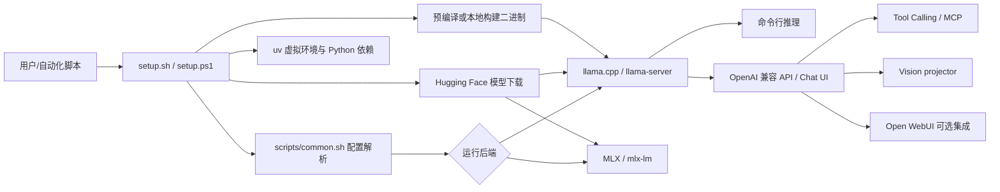
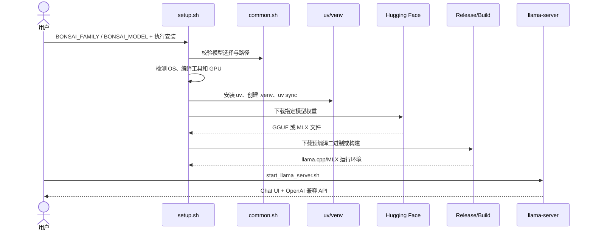
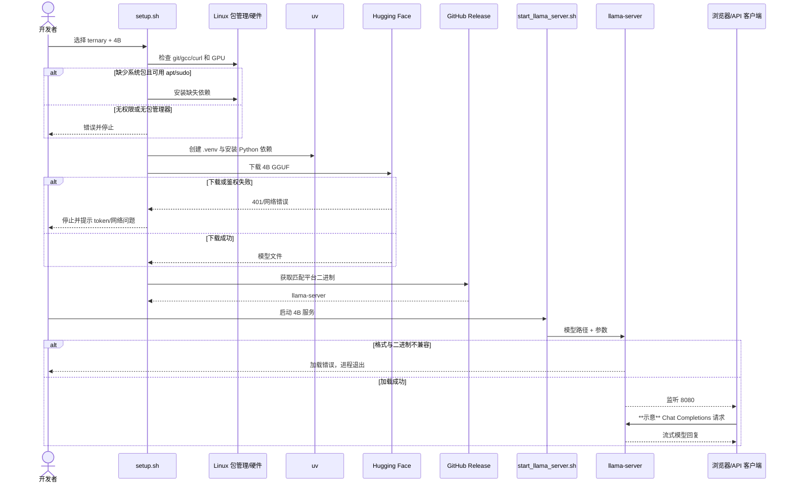

# PrismML-Eng/Bonsai-demo 项目深度解析

## 1. 项目概览

- 报告日期：2026-07-17
- 仓库地址：https://github.com/PrismML-Eng/Bonsai-demo
- Trending 原始排名：6
- Stars Today：196
- 项目定位：把 Bonsai 1-bit 与 Ternary-Bonsai 模型下载、运行、服务化和工具调用整合成一套跨平台本地演示工具链。
- 解决的问题：低比特模型论文和权重发布后，普通用户仍要处理硬件识别、运行时选择、模型下载、二进制兼容、Web UI、视觉投影与工具调用等一长串工程问题。
- 目标用户：本地 LLM 研究者、消费级硬件用户、量化格式开发者、需要离线模型与 OpenAI 兼容服务的开发者。
- 当前成熟度：早期可用的模型演示与集成仓库；运行链路明确，但性能和格式兼容仍随上游 llama.cpp/MLX 快速变化。
- 推荐结论：适合评估低比特本地模型和搭建实验环境；生产使用前需固定模型、二进制、后端和硬件矩阵。

## 2. 系统架构

### 2.1 架构概览

该项目自身不是模型训练框架，而是一个以 Shell/PowerShell 为控制面的本地部署编排层。`setup.sh` / `setup.ps1` 识别平台、安装系统与 Python 依赖、创建 uv 虚拟环境、下载 Hugging Face 模型和项目发布的预编译二进制；`scripts/common.sh` 统一解析 `BONSAI_FAMILY`、`BONSAI_MODEL` 等配置。运行阶段根据平台和用户选择进入 llama.cpp 或 MLX 路径，可直接命令行推理，也可启动 `llama-server` 暴露聊天 UI 与 OpenAI 兼容 API。Open WebUI、MCP、代码解释器、视觉 projector、speculative decoding 和量化 KV cache 都是围绕核心推理服务的可选扩展。

### 2.2 架构图

### 2.3 核心模块

| 模块 | 职责 | 代码位置 | 关键依赖 | 证据级别 |
|---|---|---|---|---|
| 跨平台安装入口 | 检查系统依赖、安装 uv、建 venv、拉取模型与二进制 | `setup.sh`, `setup.ps1` | shell、PowerShell、uv、curl/wget | High |
| 配置与路径公共层 | 校验模型家族/尺寸，生成模型路径与公共环境变量 | `scripts/common.sh` | POSIX shell | High |
| 模型下载 | 按 family、size 和后端下载 GGUF/MLX 权重 | `scripts/download_models.sh`, PowerShell 对应脚本 | Hugging Face CLI/token | High |
| llama.cpp 运行器 | 选择模型文件和平台二进制，执行一次性推理 | `scripts/run_llama.sh` | llama.cpp、GGUF | High |
| 服务入口 | 启动 llama-server、Chat UI 和 OpenAI 兼容接口 | `scripts/start_llama_server.sh` | llama-server | High |
| MLX 路径 | 在 Apple Silicon 上运行 1-bit/2-bit MLX 模型 | `scripts/run_mlx.sh` | MLX、mlx-lm | High |
| WebUI 与 Agent 扩展 | 安装/配置 Open WebUI、MCP、代码解释器 | `OPENWEBUI.md`, `TOOLS.md`, setup 脚本 | Open WebUI、MCP、Jupyter | High |
| 性能可选项 | speculative decoding 与 4-bit KV cache | `SPECULATIVE.md`, `KV-CACHE.md` | llama.cpp fork/相关参数 | Medium |
| 硬件回归验证 | 保存不同设备、格式和后端的测试结果 | `community-benchmarks/`, `tests/` | 多种硬件 | Medium |

### 2.4 数据与状态管理

项目没有业务数据库。主要状态落在本地文件系统：`.venv` 和可选 `.venv-jupyter` 保存 Python 环境，`models/` 保存权重，下载的二进制位于项目约定目录；`.bonsai_token` 可保存 Hugging Face 读取令牌，脚本用 `umask 077` 和 `chmod 600` 限制权限。Chat UI 的对话状态由 llama-server 或可选 Open WebUI 管理，不是仓库自建的持久化层。

### 2.5 外部集成与协议

- Hugging Face：权重下载与访问控制。
- llama.cpp：GGUF 推理、服务器和 OpenAI 风格接口。
- MLX：Apple Silicon 推理。
- Open WebUI：可选聊天界面、MCP 客户端和代码解释器。
- MCP：由 Chat UI 连接外部工具服务器。
- OpenAI-style tool calls：27B 模型通过 API 返回结构化工具调用。

### 2.6 部署与运行形态

最常见形态是单机本地运行；支持 macOS、Linux、Windows，CPU、Metal、CUDA、Vulkan、ROCm 等后端组合。`llama-server` 默认在本机端口提供 Web UI/API。仓库没有 Kubernetes 或多节点调度实现，不能把单机脚本推断为集群推理平台。

## 3. 主线流程

### 3.1 核心流程图

### 3.2 关键步骤

1. 用户通过环境变量选择 `ternary`/`bonsai` 和 27B、8B、4B、1.7B；公共脚本拒绝无效组合。
2. 安装入口检测 OS 和必要命令；Linux 在可用时尝试 apt 安装，macOS 检查 Xcode Command Line Tools。
3. 安装或复用 uv，创建 Python 3.11 虚拟环境并同步构建、下载和 UI 依赖。
4. 下载器根据模型家族、尺寸和后端拉取对应 GGUF/MLX 权重；仍为私有的模型可使用 `BONSAI_TOKEN`。
5. 下载项目 Release 二进制，或者按后端构建 llama.cpp/MLX；重复执行时跳过已完成内容。
6. 运行脚本选择正确模型文件和 backend，启动一次性命令或服务器。
7. 服务向 Chat UI/API 暴露文本、视觉、reasoning budget 和 tool calling 能力。

### 3.3 异常与失败处理

- `set -e` 让关键命令失败时中止，避免半套环境继续运行。
- 缺少 curl/wget、git、编译工具或无权限安装系统包时输出明确错误；sudo 需要用户确认。
- 私有模型无 token 时先匿名尝试，由 Hugging Face 返回 401；脚本不把 token 作为所有模型的硬依赖。
- GPU 工具链缺失只告警，允许使用预编译二进制或 CPU 路径。
- ternary Q2_0 的主线/分叉格式存在兼容差异，文档要求匹配正确文件与运行时；用错格式会加载失败。

## 4. 典型业务场景端到端执行链路

### 4.1 场景定义

| 项目 | 内容 |
|---|---|
| 场景名称 | 在一台新 Linux 工作站上安装 Ternary-Bonsai-4B，并启动本地 OpenAI 兼容聊天服务 |
| 参与者 | 开发者、安装脚本、uv、Hugging Face、llama.cpp 二进制、llama-server |
| 前置条件 | Linux、可用网络、足够磁盘空间；示意场景选择公开 4B 权重，不要求 token |
| 输入 | **示意命令**：`BONSAI_FAMILY=ternary BONSAI_MODEL=4B ./setup.sh`，随后 `BONSAI_MODEL=4B ./scripts/start_llama_server.sh` |
| 期望结果 | 本地服务加载正确 GGUF，并在 `localhost:8080` 提供聊天 UI/API |
| 成功判定 | 服务进程保持运行；模型可完成一次文本请求；日志中没有权重格式或后端加载错误 |

### 4.2 端到端时序图

### 4.3 执行步骤追踪

| 步骤 | 输入 | 执行组件 | 关键代码位置 | 状态或数据变化 | 输出 | 失败分支 | 证据级别 |
|---:|---|---|---|---|---|---|---|
| 1 | family/model 环境变量 | 公共配置层 | `setup.sh`, `scripts/common.sh` | 形成模型家族、尺寸和目标文件名 | 合法配置 | 无效值立即退出 | High |
| 2 | 当前 OS/命令环境 | 安装入口 | `setup.sh` 平台与依赖检查 | 可能安装系统包 | 可继续的宿主环境 | 无 apt/sudo 或用户拒绝提权 | High |
| 3 | Python 3.11 需求 | uv | `setup.sh` uv/venv 区段、`pyproject.toml` | 创建/复用 `.venv` | Python 工具链 | uv 安装或 sync 失败 | High |
| 4 | 4B ternary 选择 | 下载脚本 | `scripts/download_models.sh` | `models/` 新增 GGUF | 模型权重 | 网络、磁盘、401 | High |
| 5 | OS/加速后端 | 二进制下载/构建 | setup 后半段、Release 资产 | 保存可执行文件 | llama.cpp runtime | 资产缺失或构建失败 | Medium |
| 6 | 模型路径与 server 参数 | 启动脚本 | `scripts/start_llama_server.sh` | 启动本地进程、占用端口 | UI/API endpoint | 端口冲突、模型格式不匹配 | High |
| 7 | 文本请求 | llama-server | 上游 llama.cpp API | KV cache 和推理状态驻留内存 | 流式回复 | 内存不足、上下文过长 | High |

### 4.4 关键状态与数据变化

- `.venv` 从不存在变为可复用的 Python 环境。
- `models/` 新增所选模型权重；模型选择变化不会自动删除旧权重。
- 本地二进制目录新增匹配平台和格式的 llama.cpp 构件。
- 服务启动后，模型权重、运行时开销和 KV cache 占用内存；上下文增长会继续增加内存。
- 若保存 `BONSAI_TOKEN`，`.bonsai_token` 成为敏感本地状态，权限被收紧到用户可读写。

### 4.5 失败传播、重试与回滚

脚本采用“失败即停”而不是事务回滚。已经下载的模型和建好的 venv 会保留，这使重跑能够复用进度，但也可能留下部分文件。恢复方式通常是修复网络、权限、token 或格式选择后重新执行；下载和安装步骤会跳过已完成项。若权重格式与 runtime 不兼容，必须更换 mainline-compatible GGUF 或使用项目 fork 的匹配二进制，单纯重启无效。

### 4.6 最终业务结果

成功后，开发者获得一套不依赖云端推理 API 的本地模型服务，可通过浏览器或 OpenAI 兼容客户端发起请求，并可进一步启用视觉、工具调用和 MCP。业务价值是把“模型文件”变成可测试、可集成的服务；它不自动提供多租户、计费、弹性伸缩或高可用。

### 4.7 最小复现与验证方法

1. 使用 1.7B 或 4B 模型降低硬件门槛。
2. 执行 README 的 setup 命令，记录模型文件和二进制版本。
3. 启动 `start_llama_server.sh`，确认端口和模型加载日志。
4. 用内置 UI 发一个短文本问题，再用 OpenAI 兼容客户端发同样请求。
5. 检查输出、首 token 延迟、峰值内存和上下文增长；这些实测值才适用于当前机器。
6. 可选：启用一个只读 MCP server，验证一次完整 `tool_calls → tool result → final answer` 往返。

## 5. 技术栈

| 层次 | 技术 | 用途 | 是否核心 | 证据位置 |
|---|---|---|---|---|
| 编排 | Shell / PowerShell | 安装、下载、运行和平台分支 | 是 | `setup.*`, `scripts/` |
| Python 工具链 | uv、Python 3.11 | 下载、构建和可选 WebUI 环境 | 是 | `pyproject.toml`, setup |
| 推理运行时 | llama.cpp | GGUF 推理、服务器、API | 是 | run/start 脚本、README |
| Apple 后端 | MLX / mlx-lm | Apple Silicon 低比特推理 | 可选核心 | `run_mlx.sh` |
| 模型格式 | GGUF Q1_0/Q2_0、MLX 1/2-bit | 压缩权重与后端适配 | 是 | README、白皮书 |
| 服务协议 | OpenAI-compatible API | 客户端与工具调用兼容 | 是 | README、TOOLS.md |
| Agent 扩展 | MCP、Open WebUI | 外部工具和 UI | 可选 | `TOOLS.md`, `OPENWEBUI.md` |
| 性能 | speculative decoding、KV4 | 降低延迟/缓存内存 | 可选实验 | `SPECULATIVE.md`, `KV-CACHE.md` |

## 6. 创新点

### 创新点 1

- 类型：工程整合创新
- 传统方案：用户自行研究模型仓库、量化文件、硬件后端、编译参数和 UI。
- 当前方案：用一套可重跑脚本编排依赖、权重、二进制与服务。
- 实际收益：把模型评估从多天环境排错压缩为较短、可重复流程。
- 证据：setup 脚本、跨平台 run/start 脚本。
- 局限：脚本仍依赖外部仓库和快速变化的后端兼容矩阵。

### 创新点 2

- 类型：性能与格式创新的落地层
- 传统方案：低比特成果停留在论文或特定 fork。
- 当前方案：同时提供 1-bit、ternary、GGUF、MLX 和多硬件运行路径，并跟踪向主线 llama.cpp 迁移。
- 实际收益：同一模型家族可在更多消费设备上比较质量、速度与内存。
- 证据：模型矩阵、upstream status、community benchmarks。
- 局限：性能主张不是本报告独立复测，格式过渡期间存在兼容陷阱。

### 创新点 3

- 类型：工作流创新
- 传统方案：本地模型只提供文本生成。
- 当前方案：把视觉、reasoning budget、OpenAI tool calls、MCP 和代码解释器接到低比特模型服务。
- 实际收益：可以评估“模型能否完成任务”，而非只看困惑度或聊天示例。
- 证据：README、TOOLS.md、VISION.md、Open WebUI 安装段。
- 局限：工具执行扩大本地权限面，安全性取决于 MCP server、代码沙箱和用户配置。

## 7. 应用场景

### 适合

- 个人设备上的低比特模型质量、内存和速度评估。
- 离线文本/视觉问答 PoC。
- llama.cpp 与 MLX 量化格式兼容测试。
- 本地 OpenAI 兼容 API 和 MCP 工具调用实验。

### 可以尝试

- 小团队内部知识助手或开发辅助，但需增加认证、访问控制和审计。
- 边缘设备部署，需要针对目标硬件固定模型和后端。
- 批量推理，需要补充进程管理、队列、资源隔离和失败重试。

### 暂不建议

- 直接作为公网多租户推理服务。
- 未经验证就把项目方 benchmark 当采购或容量规划依据。
- 让不受信任 MCP 工具或代码解释器拥有主机广泛权限。

## 8. 第一次阅读与验证建议

1. 先读 README 的 Quick Start、模型矩阵、upstream status 和内存表。
2. 再看 `setup.sh`、`scripts/common.sh`、下载和 start 脚本，确认具体下载了什么。
3. 从 1.7B/4B 和短上下文开始，不要一上来挑战 27B+100K。
4. 对同一 prompt 固定模型、量化、线程、GPU layers 和上下文，记录速度/内存。
5. 工具调用验证要使用最小权限的只读工具，确认每次 round-trip 的参数和返回。

## 9. 风险与限制

- 安全：本地 token、代码解释器和 MCP 都扩大攻击面；不要连接不可信 server。
- 性能：项目数据受硬件、后端、量化和上下文影响，本报告未独立跑 benchmark。
- 许可证：仓库 Apache-2.0；模型权重、上游二进制和外部 UI 可能有各自许可。
- 维护状态：更新活跃，但依赖 llama.cpp/MLX 的上游格式迁移。
- 生产可用性：缺少内建多租户、认证、限流、调度和高可用能力。

## 10. Evidence Notes

- `setup.sh` 明确显示平台检测、依赖安装、uv/venv、HF token 文件权限与失败即停。
- README 明确列出模型尺寸、格式、后端、server、视觉、工具调用、MCP 和可选优化。
- `community-benchmarks` 可用于收集硬件结果，但它仍是社区提交，不等于统一实验室验证。
- 本文没有把 Hugging Face、llama.cpp、Open WebUI 或 MCP 描述成项目自研组件。

## 11. Honest Caveat

本报告基于 2026-07-17 的源码和官方文档静态分析，没有实际下载数 GB 权重，也没有在 CPU、CUDA、Metal 或 Vulkan 上复测吞吐、内存与输出质量。模型访问状态和主线 llama.cpp 支持可能在发布后继续变化。

## 12. 可信度

- Architecture Confidence: High
- Flow Confidence: High
- Innovation Confidence: Medium
