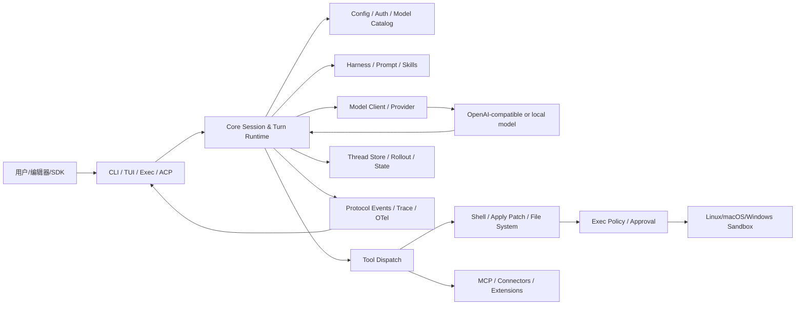
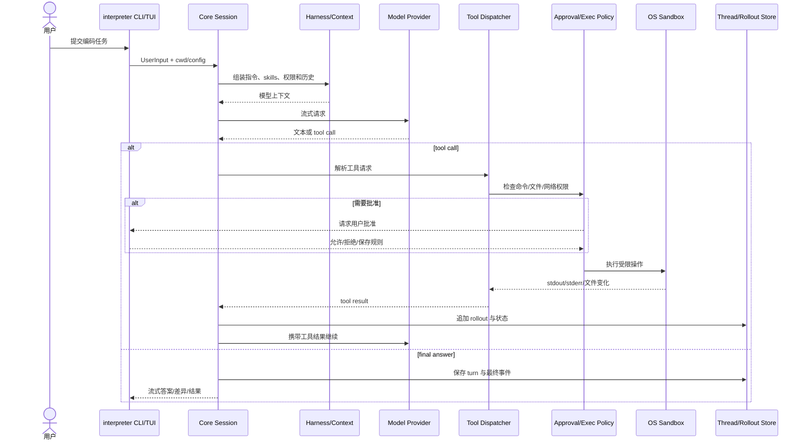
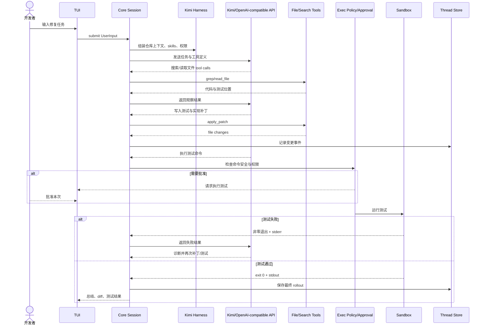

# openinterpreter/openinterpreter 项目深度解析

## 1. 项目概览

- 报告日期：2026-07-17
- 仓库地址：https://github.com/openinterpreter/openinterpreter
- Trending 原始排名：5
- Stars Today：661
- 项目定位：一个以 Rust 实现、面向低成本开放模型的编码 Agent 运行时，兼容交互式 TUI、非交互 exec、ACP、MCP 与 Codex SDK 协议。
- 解决的问题：开放模型即使模型能力接近，若没有与其训练和工具调用习惯匹配的 harness，完成真实代码任务的效果会显著下降；同时编码 Agent 还需要权限、沙箱、会话、工具、状态和客户端协议。
- 目标用户：使用 Kimi、Qwen、DeepSeek 等开放模型的开发者，编辑器/Agent 客户端作者，以及需要本地编码自动化的团队。
- 当前成熟度：快速迭代的早期生产候选；核心源于大型 Codex Rust 代码基线，功能面广，但供应商 harness 与插件生态仍在频繁演进。
- 推荐结论：适合做开放模型编码 Agent 和协议集成；团队采用时应固定版本，并对命令执行、网络和文件权限做严格配置。

## 2. 系统架构

### 2.1 架构概览

仓库是一个大型 Rust workspace。`codex-rs/cli/src/main.rs` 是多功能命令入口，向下分发到 TUI、`exec`、review、ACP、MCP server、app-server、sandbox、session resume/fork 等子系统。核心会话与 turn orchestration 位于 `codex-rs/core`，它装配模型 provider、harness 指令、上下文、工具、MCP、插件、权限 profile、网络代理、thread store 和 rollout trace。模型响应中的工具请求进入 shell/file/MCP 等执行器；命令执行前经过解析、安全分类、审批和平台沙箱。事件与会话通过 protocol、thread-store、rollout/state 等模块持久化，使交互端、exec、ACP 和 SDK 能共享同一运行内核。

### 2.2 架构图

### 2.3 核心模块

| 模块 | 职责 | 代码位置 | 关键依赖 | 证据级别 |
|---|---|---|---|---|
| 多功能 CLI | 解析 `interpreter` 命令并分发 TUI、exec、ACP、MCP、sandbox、resume 等 | `codex-rs/cli/src/main.rs` | clap、core、tui、exec | High |
| 交互界面 | 展示对话、工具事件、审批、会话选择和 slash commands | `codex-rs/tui/` | ratatui、protocol | High |
| 非交互执行 | 接收 prompt，在 CI/脚本中运行 Agent 并输出结构化事件 | `codex-rs/exec/` | core、protocol | High |
| 会话与 turn 内核 | 构建上下文、提交输入、驱动模型与工具循环、处理取消/恢复 | `codex-rs/core/src/session/` | tokio、model client、thread store | High |
| Harness 层 | 为 native、Kimi、Qwen、DeepSeek、Claude Code 等装配提示与行为 | `codex-rs/core/src/harness/` | Markdown prompt、model config | High |
| 工具与命令安全 | 命令解析、安全分类、策略匹配、权限申请 | `codex-rs/shell-command/`, `execpolicy*`, `core/src/exec_policy*` | parsers、policy rules | High |
| 沙箱执行 | 按 OS 隔离文件、进程和网络能力 | `linux-sandbox`, `windows-sandbox-rs`, `sandboxing`, `bwrap` | OS sandbox primitives | High |
| MCP 与扩展 | 连接外部 MCP server、插件和 extension tools | `codex-rs/codex-mcp`, `mcp-server`, `ext/*`, `plugin` | rmcp、protocol | High |
| 会话持久化 | 保存 thread、rollout、状态与本地记忆，支持 resume/fork/archive | `thread-store`, `rollout`, `state`, `core/src/session` | SQLite/file state | High |
| 协议适配 | ACP、app-server、Codex exec/protocol、SDK 兼容 | `acp-server`, `app-server*`, `protocol`, `sdk/` | ACP、JSON-RPC/stdio | High |
| 可观测性 | 事件、trace、analytics、OTel 与调试回放 | `protocol`, `rollout-trace`, `otel`, `analytics` | tracing、OpenTelemetry | High |

### 2.4 数据与状态管理

本地状态集中在用户的 Open Interpreter/Codex home 目录，README 指向 `~/.openinterpreter`。线程与会话由 `thread-store` 和 `rollout` 管理，CLI 支持 resume、fork、archive、delete；`state` 和 memories 模块保存配置、记忆及运行状态。源码包含 SQLite/state DB 路径与恢复命令，但不同功能可能同时使用 SQLite、JSONL/rollout 文件和配置 TOML，不能笼统说成“只有一个数据库”。

### 2.5 外部集成与协议

- 模型 Provider：OpenAI-compatible API、本地或供应商模型端点。
- ACP：通过 `interpreter acp` 供兼容编辑器调用。
- Codex SDK/exec 协议：可用 binary override 复用现有 SDK。
- MCP：客户端和 server 两种角色，接入工具与资源。
- App Server：为桌面/远程控制等客户端提供协议层。
- Shell/文件系统：本机命令、补丁和代码修改，受审批与沙箱约束。

### 2.6 部署与运行形态

默认是本机 CLI/TUI 单用户进程；也可作为 ACP stdio agent、MCP server、app-server 或 exec-server 运行。它不是天然的多租户 SaaS。远程、桌面与 server 模式仍应在进程隔离、认证、文件权限和网络策略上由部署方补齐。

## 3. 主线流程

### 3.1 核心流程图

### 3.2 关键步骤

1. CLI 解析默认交互模式或 `exec`、ACP、MCP 等子命令，加载 config、auth、cwd 与 profile。
2. Core 创建或恢复 thread/session，读取历史、AGENTS/skills、模型目录、权限 profile 和插件/MCP 配置。
3. Harness 层根据 `/harness` 或 provider 配置注入对应 system prompt、工具描述和行为约束。
4. Model client 发起流式生成，protocol 将内容、推理、工具请求和错误转换为统一事件。
5. 工具请求由 dispatcher 路由到 shell、文件、patch、MCP 或 extension。
6. 命令经过解析、安全检测、exec policy、审批以及沙箱策略交集后执行。
7. stdout/stderr、文件修改和工具结果回填模型上下文，循环直到模型给出最终答案、被取消或达到预算。
8. Thread/rollout/state 持久化 turn，TUI/exec/ACP 客户端消费事件并展示或输出。

### 3.3 异常与失败处理

- 空输入、无活动 turn 的 steer、turn id 不匹配等会转换成明确协议错误。
- 命令不安全或超出 profile 时，进入审批；拒绝后工具结果返回模型，由模型改用其他方案或报告失败。
- 模型、MCP 或工具错误通过统一事件传播，支持取消 token 与 turn abort reason。
- 会话状态有恢复、归档、删除和 state DB recovery 命令；异常退出后可通过 rollout/thread store 恢复，但不是所有外部副作用都可回滚。
- 文件写入和 shell 命令的业务副作用不会自动事务回滚，需由 Agent 生成反向变更、使用 git 或人工恢复。

## 4. 典型业务场景端到端执行链路

### 4.1 场景定义

| 项目 | 内容 |
|---|---|
| 场景名称 | 使用 Kimi harness 修复一个代码缺陷并运行测试 |
| 参与者 | 开发者、TUI、Core Session、Kimi harness、模型 API、shell/file 工具、审批与沙箱、thread store |
| 前置条件 | 已安装 `interpreter`；项目目录是 git 仓库；配置可用模型；权限 profile 默认不允许任意高风险命令 |
| 输入 | **示意任务**：`修复 parser 在空字符串时崩溃的问题，先加回归测试，再运行相关测试。` |
| 期望结果 | Agent 定位代码、添加失败测试、修改实现、测试通过并汇报 diff |
| 成功判定 | 相关测试命令 exit code 0；工作树只包含任务相关变更；会话保存完整工具轨迹 |

### 4.2 端到端时序图

### 4.3 执行步骤追踪

| 步骤 | 输入 | 执行组件 | 关键代码位置 | 状态变化 | 输出 | 失败分支 | 证据级别 |
|---:|---|---|---|---|---|---|---|
| 1 | 用户 prompt、cwd | CLI/TUI | `codex-rs/cli/src/main.rs`, `tui/` | 创建/恢复 thread 与 turn | UserInput 事件 | 配置/auth 错误，turn 不启动 | High |
| 2 | profile、历史、仓库指令 | Core Session | `core/src/session/` | 构建上下文快照 | 模型输入 | 上下文超限触发压缩/截断 | High |
| 3 | harness 选择 | Harness | `core/src/harness/` | system prompt 与工具范式变化 | Kimi 风格请求 | harness 不兼容模型时效果下降 | High |
| 4 | 搜索/读文件请求 | Tool Dispatch | `core`, `file-system`, `file-search` | 无或只读访问 | 文件内容/匹配 | 路径越界或权限拒绝 | High |
| 5 | 补丁 | Apply Patch/File tools | `apply-patch`, tools | 工作树文件变化 | diff/成功事件 | patch 上下文不匹配 | High |
| 6 | 测试命令 | Shell + Policy | `shell-command`, `execpolicy*` | 形成审批决策 | 允许或拒绝 | 危险命令被拦截 | High |
| 7 | 已批准命令 | Sandbox | `sandboxing`, OS sandbox crate | 子进程、stdout/stderr | exit code | 超时、资源或测试失败 | High |
| 8 | 工具结果 | Core + Model | `core/src/session/turn*` | rollout 追加，循环继续 | 修复或最终答案 | 达到预算/用户取消 | High |
| 9 | 最终内容 | Thread Store | `thread-store`, `rollout`, `state` | turn 持久化 | 可 resume 的会话 | 异常退出后可能需要 recovery | High |

### 4.4 关键状态与数据变化

- 工作目录中的测试和实现文件被修改；git index 默认不应被自动提交，除非用户要求并批准。
- Thread store 新增用户消息、模型 item、工具调用、审批、命令输出和 final response。
- 保存的 permission rule 可能改变后续命令是否再次询问，属于安全敏感状态。
- 模型/harness 切换会改变后续 turn 的 prompt 与行为，但历史 thread 仍保留。
- 外部命令可能产生构建缓存、临时文件或其他不可见副作用，需用 `git status` 和项目工具核查。

### 4.5 失败传播、重试与回滚

测试失败作为 tool result 回到模型，Agent 可阅读 stderr、修改补丁并再次运行。若用户拒绝命令，模型应收到拒绝结果并选择只读分析或说明无法验证。模型 API 短暂错误可由客户端/运行时策略重试；持续错误会终止 turn并保留已记录轨迹。代码修改没有自动事务回滚，最可靠的恢复边界是干净 git 工作树、独立 worktree 或沙箱副本。

### 4.6 最终业务结果

成功路径交付的是“代码变更 + 可验证测试结果 + 可追踪会话”，而不是一句建议。用户仍需要审查 diff 和测试覆盖，再决定提交。运行时提供安全边界和证据链，但不能证明模型修改在所有场景正确。

### 4.7 最小复现与验证方法

1. 在一个小型 git 仓库创建可复现 bug 和对应测试命令。
2. 设置最小权限 profile，仅允许仓库读写和项目测试命令。
3. 启动 `interpreter`，用 `/harness` 选择目标 harness。
4. 提交“先写失败测试再修复”的任务。
5. 检查 TUI 中的审批、工具请求、测试失败到重试的完整事件。
6. 运行 `git diff`、`git status` 和同一测试命令人工复核。
7. 退出后用 resume 恢复会话，验证持久化是否完整。

## 5. 技术栈

| 层次 | 技术 | 用途 | 是否核心 | 证据位置 |
|---|---|---|---|---|
| 语言与运行时 | Rust 2024、Tokio | Agent 核心和异步执行 | 是 | `codex-rs/Cargo.toml` |
| CLI/TUI | clap、ratatui 系 | 多命令入口和终端交互 | 是 | `cli`, `tui` |
| Agent 内核 | core session/turn | 上下文、模型、工具循环 | 是 | `core/src/session` |
| 模型适配 | Harness prompts/provider config | 适配 Kimi/Qwen/DeepSeek 等 | 是 | `core/src/harness` |
| 工具 | shell、patch、file-system、MCP | 执行代码任务 | 是 | workspace crates |
| 安全 | exec policy、approval、sandbox | 控制命令、文件和网络 | 是 | `shell-command`, `sandboxing` |
| 协议 | ACP、MCP、app-server、Codex exec | 编辑器和 SDK 集成 | 是 | `acp-server`, `mcp*`, `protocol` |
| 状态 | thread-store、rollout、state | 会话恢复与审计 | 是 | 对应 crates |
| 可观测性 | tracing、OTel、analytics、trace replay | 调试和运行追踪 | 核心辅助 | `otel`, `analytics`, `rollout-trace` |
| 构建 | Cargo workspace、Bazel/Nix | 多平台构建与发布 | 是 | Cargo.toml, MODULE.bazel, flake.nix |

## 6. 创新点

### 创新点 1

- 类型：工作流创新
- 传统方案：一个通用 system prompt 适配所有模型。
- 当前方案：可切换模型厂商推荐或模拟的 harness，连同提示、工具格式和交互习惯一起变化。
- 实际收益：低成本模型有机会在更匹配的执行框架中发挥能力。
- 证据：README `/harness` 列表与 `core/src/harness`。
- 局限：不同 harness 的提升需要标准任务集验证，不能只凭展示案例下结论。

### 创新点 2

- 类型：协议与工程整合创新
- 传统方案：CLI Agent、编辑器 Agent、SDK 和 MCP 工具各有一套内核。
- 当前方案：TUI、exec、ACP、app-server 和 SDK 共享 Rust session/protocol/runtime。
- 实际收益：同一权限、状态和工具语义可跨多个客户端复用。
- 证据：CLI 子命令、workspace crates 和 protocol 依赖。
- 局限：继承的大型代码面增加维护、审计和二次开发成本。

### 创新点 3

- 类型：安全工程整合
- 传统方案：把 shell 当普通工具，靠 prompt 提醒模型别乱来。
- 当前方案：命令解析、安全分类、policy、用户审批和 OS 沙箱多层叠加。
- 实际收益：把权限从语言约束下沉到可执行边界。
- 证据：shell-command、execpolicy、sandboxing、protocol permission profiles。
- 局限：沙箱不是绝对安全，配置错误、平台差异和外部工具仍可能绕开预期边界。

## 7. 应用场景

### 适合

- 本地或受控环境中的开放模型编码 Agent。
- ACP 编辑器集成和 Codex SDK binary 替换测试。
- 模型 harness A/B 比较。
- 需要会话恢复、工具轨迹和可配置审批的自动化。

### 可以尝试

- CI 中非交互修复/评审，但必须使用短时凭证、隔离 runner 和人工合并门禁。
- 团队共享服务，需要外加租户隔离、认证、配额和机密管理。
- 多 Agent/插件功能，先限定并发和子 Agent 权限。

### 暂不建议

- 在个人主机上使用全盘写权限和免审批网络/命令策略。
- 未固定版本就把快速变化的 CLI 作为关键生产协议。
- 允许不可信 MCP server 或插件执行高权限操作。

## 8. 第一次阅读与验证建议

1. 先读 README 的 Installation、Harness、ACP/Codex compatibility 和安全说明。
2. 再看 `codex-rs/Cargo.toml` 理解 workspace，再按 CLI → core/session → tools/policy → thread-store 跟踪。
3. 查看 shell safety tests 和 permission tests，而不是只看成功 demo。
4. 用一个可丢弃 worktree 验证读、写、测试、拒绝审批、取消和 resume。
5. 对同一任务固定模型参数，逐个切换 harness 记录成功率、工具轮数、token 和副作用。

## 9. 风险与限制

- 安全：拥有代码、shell、网络和 MCP 权限；错误 profile 可能导致数据泄露或破坏性操作。
- 性能：Agent 成本取决于模型、轮数、上下文和工具输出；低价模型不保证总任务成本更低。
- 许可证：仓库 Apache-2.0；外部模型、插件和 MCP server 许可证独立。
- 维护状态：发布频繁，workspace 规模大，应固定版本和配置。
- 生产可用性：本地单用户成熟度高于多租户服务化；外部副作用没有通用回滚。

## 10. Evidence Notes

- `cli/src/main.rs` 直接列出 Exec、Review、MCP、ACP、App Server、Sandbox、Resume/Fork 等入口。
- `codex-rs/Cargo.toml` 显示 core、protocol、thread-store、sandbox、MCP、extensions、state、OTel 等实际 crate，不是根据目录名虚构。
- `core/src/session/mod.rs` 导入并组合 permission profile、network policy、MCP、thread store、rollout、hooks、model manager 和 sandbox policy。
- 本报告没有声称所有 workspace crate 都是 Open Interpreter 原创；README 明确说明它是 Codex fork。

## 11. Honest Caveat

本报告没有安装二进制、连接 Kimi K3 或运行 SWE benchmark。端到端案例基于可验证的 session/tool/policy 代码结构构造，任务文本和仓库内容是明确标注的示意。不同 provider、harness 和 OS 沙箱的实际行为仍需在目标环境复测。

## 12. 可信度

- Architecture Confidence: High
- Flow Confidence: High
- Innovation Confidence: Medium
