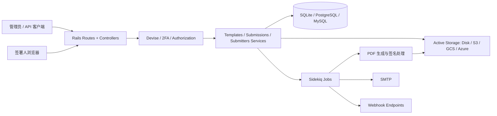
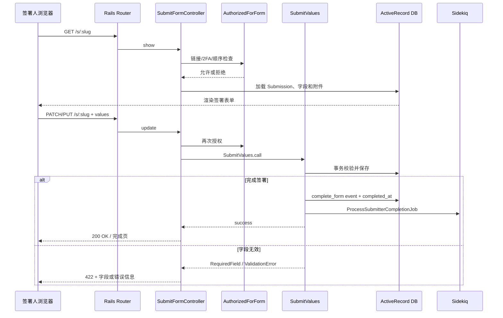
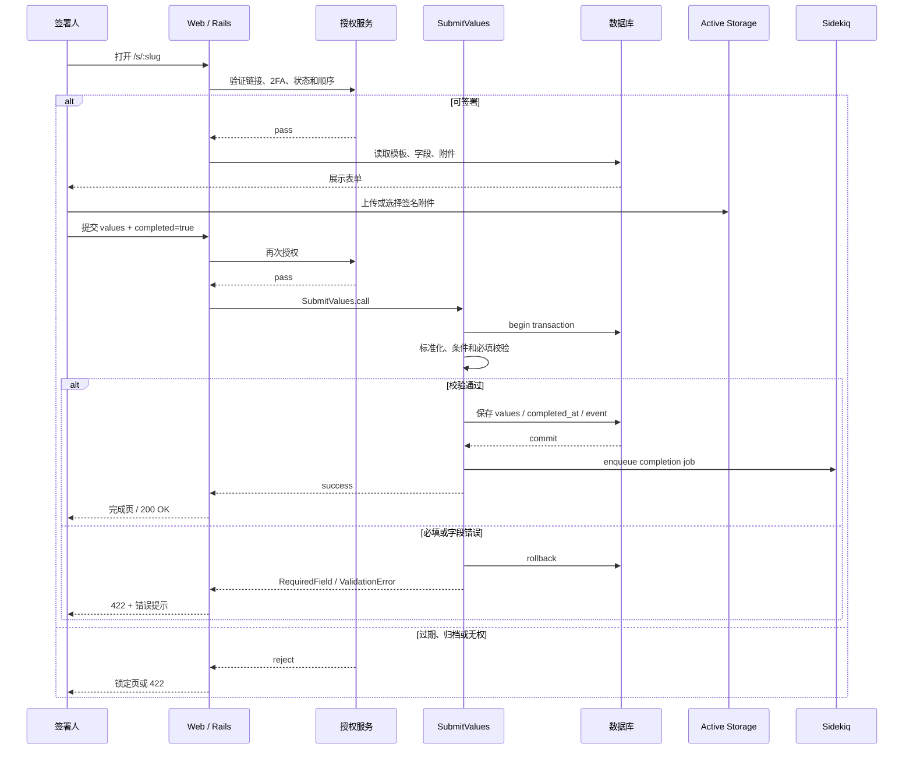

# docusealco/docuseal 项目深度解析

## 1. 项目概览

- 报告日期：2026-07-18
- 仓库地址：https://github.com/docusealco/docuseal
- Trending 原始排名：10
- Stars Today：91
- 项目定位：可自托管的文档填写和电子签署 Web 平台。
- 解决的问题：把 PDF 表单设计、邀请签署、字段校验、签名附件、完成事件、邮件和 Webhook 放在同一业务系统中。
- 目标用户：需要合同、授权书、入职文件、KYC 表单或嵌入式签署的企业和开发团队。
- 当前成熟度：成熟项目；具备完整 Rails 应用、Docker 部署、API、异步任务和多存储支持。
- 推荐结论：适合希望掌控数据和部署边界的签署场景；正式上线前必须核查许可证附加条款、地区法律效力、身份认证、备份与审计要求。

## 2. 系统架构

### 2.1 架构概览

DocuSeal 是一个 Ruby on Rails 单体 Web 应用。管理员通过 Dashboard、Templates 和 Submissions 管理模板与签署流程；签署人通过公开 `/s/:slug` 路由进入 `SubmitFormController`。Controller 负责签署入口的授权、2FA、状态和顺序检查，再把字段处理交给 `Submitters::SubmitValues`。业务数据通过 ActiveRecord 保存到 SQLite、PostgreSQL 或 MySQL；文件通过 Active Storage 落磁盘或对象存储；完成后的 PDF、通知、Webhook、搜索重建等工作由 Sidekiq 异步任务和服务模块处理。

### 2.2 架构图

### 2.3 核心模块

| 模块 | 职责 | 代码位置 | 关键依赖 | 证据级别 |
|---|---|---|---|---|
| 路由层 | Dashboard、Template、Submission、公开签署、API、Webhook、MCP 路由 | `config/routes.rb` | Rails Router | High |
| 认证授权 | 用户登录、2FA、公开链接验证、签署人授权 | Devise 配置、`Submitters::AuthorizedForForm` 等 | Devise、devise-two-factor、CanCanCan | High |
| 表单控制器 | 加载签署人、检查状态、展示和提交表单 | `app/controllers/submit_form_controller.rb` | Rails Controller | High |
| 字段提交服务 | 标准化、条件计算、必填校验、事务写入、完成事件 | `lib/submitters/submit_values.rb` | ActiveRecord | High |
| 模板与提交域 | 模板字段、签署人、顺序、Submission 完成状态 | `app/models/`、`lib/submissions/`、`lib/submitters/` | Rails Models | High |
| 文件存储 | PDF、签名、附件和生成文档 | Active Storage 配置与附件模型 | Disk/S3/GCS/Azure | High |
| 异步处理 | 签署完成、搜索重建、邮件、Webhook 等后台工作 | `app/jobs/`、Sidekiq 调用点 | Sidekiq | High |
| PDF 工具 | 表单处理、签名、验证和生成 | PDF service/lib、HexaPDF、ruby-vips | HexaPDF、Vips | Medium/High |
| API 与集成 | Templates、Submissions、Tools、Events、Webhook | `app/controllers/api/`、routes | JSON API | High |

### 2.4 数据与状态管理

- 默认 Docker 使用 SQLite；可通过 `DATABASE_URL` 切换 PostgreSQL 或 MySQL。
- 核心状态包括 Template、Submission、Submitter、字段值、`opened_at`、`completed_at`、`declined_at`、归档/过期状态和 SubmissionEvents。
- `Submitters::SubmitValues` 在事务中验证并保存签署人字段，失败时回滚。
- 签名和文件通过 Active Storage Attachment/Blob 关联，存储后端可配置。
- Sidekiq 队列承接完成后的重任务；业务请求先返回，后台继续生成或分发产物。

### 2.5 外部集成与协议

- 浏览器：Rails HTML、Turbo/Hotwire、公开签署链接。
- API：JSON Templates、Submissions、Submitters、Documents、Tools 与 Events。
- Webhook：签署生命周期事件对外通知。
- SMTP：邀请、提醒和完成通知。
- 存储：本地磁盘、AWS S3、Google Cloud Storage、Azure Blob。
- MCP：仓库路由包含 `/mcp`，具体能力需结合设置与实现核查。

### 2.6 部署与运行形态

1. 单容器 Docker：默认 SQLite 与挂载 `/data`。
2. Docker Compose：可配自定义域名与 Caddy HTTPS。
3. 外部数据库：PostgreSQL 或 MySQL。
4. 对象存储：适合多实例或持久化文件场景。
5. Sidekiq Worker：处理异步完成任务，生产部署需保证队列可用和可监控。

## 3. 主线流程

### 3.1 核心流程图

### 3.2 关键步骤

1. `/s/:slug` 路由定位 `SubmitFormController#show/update`。
2. `load_submitter` 根据 slug 查找签署人；委托场景可通过历史版本重定向。
3. 展示前检查链接 2FA、Email 2FA、归档、过期、拒签和签署顺序。
4. 加载模板页面、默认值和附件，渲染移动端表单。
5. 提交时再次检查授权、已完成、归档、过期、拒签和只读角色。
6. `Submitters::SubmitValues.call` 记录首次打开事件，标准化值并进入事务。
7. 服务处理默认值、条件字段、公式占位、签名原因、必填与字段类型校验。
8. 保存 Submitter；完成时更新 Submission 状态、排入完成任务并触发搜索重建。

### 3.3 异常与失败处理

- 授权失败、已完成、归档、过期、拒签或 viewer 角色返回 422 或对应页面。
- 缺少必填字段时抛 `RequiredFieldError`，Controller 返回字段 UUID 和 422。
- 其他字段校验错误抛 `ValidationError`，返回可读错误和 422。
- 事务内异常触发 ActiveRecord rollback，避免部分字段或事件已写、状态却未完成。
- Sidekiq 任务失败不应改写已提交的同步事实；生产环境需要为 Job 配置重试、幂等和告警。

## 4. 典型业务场景端到端执行链路

### 4.1 场景定义

- 场景名称：签署人打开合同链接，填写姓名并签名，提交后生成完成状态和后续通知任务。
- 参与者：签署人、浏览器、Rails Router、`SubmitFormController`、授权服务、`Submitters::SubmitValues`、数据库、Active Storage、Sidekiq。
- 前置条件：管理员已经创建模板、字段和 Submission；签署人拥有有效 slug；文档未归档、未过期、未拒签。
- 输入：示意字段 `name="张三"`、`signature_attachment_uuid="..."`、`completed="true"`；具体前端参数以项目页面实际提交为准。
- 期望结果：字段和签名关联被保存，Submitter 标记完成，完成事件写入，后续处理任务入队。
- 成功判定：`completed_at` 存在；必填字段完整；事务提交；完成页可访问；后台任务收到正确 submitter ID。

### 4.2 端到端时序图

### 4.3 执行步骤追踪

| 步骤 | 输入 | 执行组件 | 关键代码位置 | 状态或数据变化 | 输出 | 失败分支 | 证据级别 |
|---|---|---|---|---|---|---|---|
| 1 | slug | Rails Router | `config/routes.rb` | 无 | 定位 show/update | slug 不存在 | High |
| 2 | request、submitter | `SubmitFormController#show` | `app/controllers/submit_form_controller.rb` | 可能记录默认签名附件 | 表单或重定向 | 2FA、顺序、过期、归档、拒签 | High |
| 3 | 签名文件 | Active Storage | Controller 与 Attachment 关联 | 创建 Blob/Attachment | attachment UUID | 上传失败或存储不可用 | Medium/High |
| 4 | 示意 values、completed | `SubmitFormController#update` | 同上 | 无 | 调用服务 | 已完成、viewer、未授权返回 422 | High |
| 5 | params | `normalized_values` | `lib/submitters/submit_values.rb` | 合并到 `submitter.values`，设置 `opened_at` | 标准化值 | 类型/格式错误 | High |
| 6 | 完成请求 | `assign_completed_attributes` | 同上 | 设置 `completed_at`、IP、UA、timezone，合并默认值 | 待校验 Submitter | 缺失必填字段 | High |
| 7 | 字段和附件 | ActiveRecord transaction | `update_submitter!` | 写 values、event、附件 touch | commit | 异常 rollback | High |
| 8 | completed submitter | `Submissions.maybe_update_completed_at` | service call | 可能更新整个 Submission 完成状态 | `is_last` | 并发状态需数据库约束 | Medium/High |
| 9 | submitter ID | `ProcessSubmitterCompletionJob` | enqueue call | Sidekiq 新增任务 | 后台处理 | 队列不可用或任务失败 | High（入队）/Medium（后续） |
| 10 | 成功结果 | Controller / Browser | `update`、completed route | 用户看到完成状态 | 200 / 完成页 | Job 后续失败需补偿 | High |

### 4.4 关键状态与数据变化

- `Submitter.values`：合并当前字段输入、默认值、条件和公式结果。
- `opened_at`：首次填写时记录。
- `completed_at`：仅在 `completed=true` 且校验通过后设置并保存。
- `ip`、`ua`、`timezone`：完成时记录请求上下文。
- `SubmissionEvents`：首次开始写 `start_form`，完成写 `complete_form`。
- Active Storage：签名与附件通过 UUID/Blob 关联到 Submitter。
- Submission：最后一个签署人完成时可能更新整体 `completed_at`。
- Sidekiq：收到完成任务，继续文档生成、通知或其他收尾流程。

### 4.5 失败传播、重试与回滚

- 必填字段缺失：事务回滚，返回字段 UUID；用户修正后重新提交。
- 文档过期/归档/拒签：在业务服务前拒绝，不产生新的完成状态。
- 附件不可用：字段验证或存储访问失败，应保持 Submitter 未完成。
- 队列入队或任务失败：同步提交可能已完成，后台任务必须幂等重试；若最终文档或通知未生成，需要运维补偿，而不是倒改用户已签事实。
- 多签署人：只有满足顺序且当前角色完成后才推进；最后一人完成的并发判断需通过数据库状态和幂等任务保护。

### 4.6 最终业务结果

用户得到明确的签署完成页面；系统保存字段、签名和审计上下文，并产生完成事件与后台任务。管理员随后可以查看 Submission 状态、下载文档或通过 Webhook/API 接收结果。

### 4.7 最小复现与验证方法

1. 按 README 用 Docker 启动并挂载 `/data`。
2. 创建含文本必填字段和签名字段的模板，生成一个签署人链接。
3. 第一次不填必填字段提交，验证返回 422 且 `completed_at` 为空。
4. 填写字段、上传签名并提交，验证 Submitter、SubmissionEvents 和附件记录。
5. 查看 Sidekiq/任务状态，确认完成任务入队且可重复执行不产生重复结果。
6. 将 Submission 设为过期或归档，验证入口在写入前被拒绝。
7. 重启容器，验证数据库和文件挂载仍能恢复签署结果。

## 5. 技术栈

| 层次 | 技术 | 用途 | 是否核心 | 证据位置 |
|---|---|---|---|---|
| 语言与框架 | Ruby 4.0.5、Rails | Web 与业务逻辑 | 是 | `Gemfile` |
| 前端交互 | Turbo Rails、Shakapacker | 页面与局部更新 | 是 | `Gemfile` |
| 认证授权 | Devise、2FA、CanCanCan | 用户与签署权限 | 是 | `Gemfile`、Controller |
| 数据库 | SQLite / PostgreSQL / MySQL | 业务数据 | 是 | README、Gemfile |
| 文件存储 | Active Storage、Disk/S3/GCS/Azure | PDF、签名、附件 | 是 | README、Gemfile |
| 异步任务 | Sidekiq | 完成处理和通知 | 是 | Gemfile、service call |
| PDF/媒体 | HexaPDF、ruby-vips | PDF 与图像处理 | 是 | Gemfile |
| 通信 | JSON API、Webhook、SMTP | 外部集成 | 是 | routes、README |
| 部署 | Docker、Compose、Caddy | 自托管 | 是 | README、compose |

## 6. 创新点

### 创新点 1
- 类型：工程整合创新
- 传统方案：表单编辑、签名、文件、通知和 API 分散在多套服务。
- 当前方案：用 Rails 单体将模板、签署状态、附件、事件、API 和后台任务统一到清晰领域模型。
- 实际收益：部署和二次开发边界直观，业务状态能在一套事务模型内管理。
- 证据：routes、Controller、SubmitValues、Gemfile。
- 局限：单体规模增长后，Worker、存储、数据库和多租户治理仍需独立工程投入。

### 创新点 2
- 类型：工作流创新 / 开发体验创新
- 传统方案：开源电子签署常只提供简单签名页。
- 当前方案：公开链接、签署顺序、条件字段、事件、Webhook、API 和多存储后端组合成可嵌入流程。
- 实际收益：能进入 CRM、KYC、HR 和合同系统，而不仅是单次 PDF 工具。
- 证据：README Features、routes 与提交服务。
- 局限：部分高级能力属于 Pro，且法律与身份保证不能只靠技术功能推导。

## 7. 应用场景

### 适合
- 中小团队自托管合同、入职、授权和内部审批签署。
- 需要 API/Webhook 和嵌入式签署的 SaaS。
- 对文件存储位置有明确控制要求的场景。

### 可以尝试
- 多实例、高并发和多地区部署；需补共享数据库、对象存储、队列和灾备。
- 银行、医疗、KYC；需独立验证身份认证、审计和法规。

### 暂不建议
- 未审查 AGPL 附加条款就直接闭源集成。
- 把普通链接签署直接等同于所有地区的高等级数字证书签名。

## 8. 第一次阅读与验证建议

1. 先读 README 的 Features、Deploy 和 License。
2. 看 `config/routes.rb` 理解模板、提交和公开签署入口。
3. 看 `SubmitFormController` 与 `Submitters::SubmitValues`。
4. 运行 Docker 最小实例，覆盖必填失败、成功签署和过期三条路径。
5. 再检查完成 Job、Webhook、邮件和文件持久化。

## 9. 风险与限制

- 安全：公开 slug、2FA、附件下载、Webhook Secret、对象存储权限和管理员账号均是关键边界。
- 性能：PDF 处理、邮件和对象存储应由 Worker 承接；数据库与队列容量需压测。
- 许可证：AGPLv3，并含 Section 7(b) Additional Terms；商业集成前需法律审查。
- 维护状态：活跃、产品化程度高；云版、开源版和 Pro 能力需区分。
- 生产可用性：具备生产基础，但合规、监控、备份、恢复、密钥和任务幂等需部署方负责。

## 10. Evidence Notes

- README：功能、Docker、默认数据库、对象存储、API/Webhook 和许可证。
- `Gemfile`：Rails、Devise、Sidekiq、数据库驱动、Active Storage 相关 SDK 与 PDF 库。
- `config/routes.rb`：公开签署、API、Webhook、设置和文件代理路由。
- `SubmitFormController`：授权、2FA、状态检查和 422 错误处理。
- `Submitters::SubmitValues`：标准化、事务、必填校验、事件、完成状态和任务入队。

## 11. Honest Caveat

本文为静态源码研究，没有用真实身份完成具有法律效力的签署，也没有验证所有 Pro 功能、Webhook 后续实现或不同国家的电子签名法规。示意字段名和请求值不代表项目公开 API 的固定 Payload。

## 12. 可信度

- Architecture Confidence: High
- Flow Confidence: High
- Innovation Confidence: Medium
