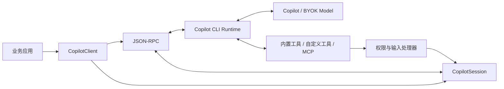
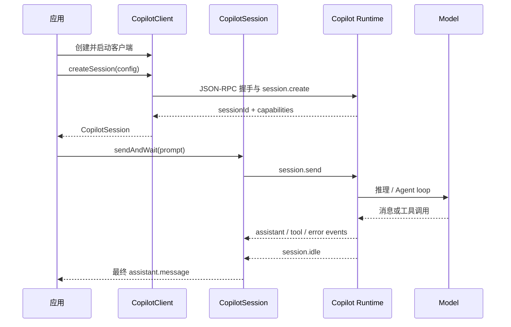
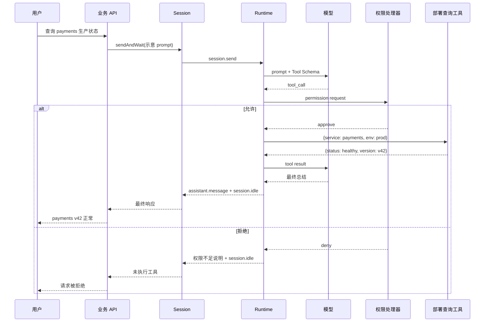

# github/copilot-sdk 项目深度解析

## 1. 项目概览

- 报告日期：2026-07-18
- 仓库地址：https://github.com/github/copilot-sdk
- Trending 原始排名：5
- Stars Today：233
- 项目定位：将 GitHub Copilot CLI 的 Agent 能力封装为多语言 SDK。
- 解决的问题：让应用直接创建会话、发送任务、接收事件，并接入自定义工具与权限回调，而不必重写 Agent 循环。
- 目标用户：IDE、桌面应用、后端服务和内部开发平台团队。
- 当前成熟度：生产候选 / GA。
- 推荐结论：适合接受 Copilot 认证与计费边界的团队；高权限工具必须显式审批和隔离。

## 2. 系统架构

### 2.1 架构概览

业务应用创建 `CopilotClient`。客户端选择 stdio、TCP、外部 URI 或进程内连接，必要时启动平台 CLI 包；SDK 与 Copilot runtime 通过 JSON-RPC 通信。`CopilotSession` 保存会话 ID、事件监听器、工具处理器、权限处理器和 Token 回调。模型规划与内置 Agent 循环在 runtime 中执行，SDK 负责把业务侧能力安全接入。

### 2.2 架构图

### 2.3 核心模块

| 模块 | 职责 | 代码位置 | 关键依赖 | 证据级别 |
|---|---|---|---|---|
| `CopilotClient` | 连接解析、CLI 生命周期、协议协商、会话管理 | `nodejs/src/client.ts` | `child_process`、`net`、`vscode-jsonrpc` | High |
| `CopilotSession` | 消息、事件、idle 等待、工具与权限回调 | `nodejs/src/session.ts` | session RPC | High |
| RPC 生成层 | server/session 类型化调用 | `nodejs/src/generated/rpc.ts` | JSON-RPC | High |
| 公共类型 | Tool、Provider、Permission、MCP、Hook 契约 | `nodejs/src/types.ts` | TypeScript | High |
| Copilot runtime | Agent 循环、模型调用、内置工具 | 捆绑或外部 CLI 平台包 | Copilot CLI | High（边界） |
| 多语言 SDK | Python、TS、Go、.NET、Java、Rust API | 各语言目录 | 对应语言运行时 | High |

### 2.4 数据与状态管理

- Client 在内存中维护连接状态、CLI 子进程、RPC connection、session map 和协议版本。
- Session 维护 `sessionId`、事件/工具处理器、权限处理器和 capability。
- infinite sessions 可提供包含 `checkpoints/`、`plan.md`、`files/` 的工作区。
- SDK 本身不是业务数据库；长期会话持久化边界由 runtime 和部署配置决定。

### 2.5 外部集成与协议

- SDK ↔ runtime：JSON-RPC。
- runtime ↔ 模型：GitHub Copilot 或 BYOK Provider。
- runtime ↔ 工具：内置工具、自定义函数、MCP、Hooks。
- 权限：runtime 发出 permission request，宿主 handler 决定允许或拒绝。

### 2.6 部署与运行形态

1. 默认本地子进程 + stdio。
2. SDK 启动 runtime + TCP。
3. 通过 URI 连接外部 runtime。
4. Node.js 进程内模式；共享进程环境带来额外限制。

## 3. 主线流程

### 3.1 核心流程图

### 3.2 关键步骤

1. `CopilotClient` 解析连接方式并建立 runtime transport。
2. `createSession()` 将模型、工具、MCP、系统消息和权限配置转换为可传输数据。
3. runtime 返回 `sessionId` 与 capability，SDK 构造 `CopilotSession`。
4. `sendAndWait()` 先注册事件监听，再发 `session.send`，避免 idle 竞态。
5. runtime 调用模型并执行必要工具，持续回传事件。
6. SDK 保存最后一条 `assistant.message`；收到 `session.idle` 后返回。

### 3.3 异常与失败处理

- 默认等待 60 秒；超时只结束等待，不等于取消 runtime 中的任务。
- `session.error` 会转换为异常。
- Client 停止 runtime 时有 shutdown timeout，并处理 teardown 期间关闭管道的写入错误。
- 协议版本过旧会被拒绝。
- 外部 server 模式由 server 管理认证，SDK 不允许同时注入 GitHub token。

## 4. 典型业务场景端到端执行链路

### 4.1 场景定义

- 场景名称：业务服务调用自定义“查询部署状态”工具。
- 参与者：用户、业务 API、Session、Copilot runtime、模型、权限处理器、自定义工具。
- 前置条件：CLI 已认证；服务注册只读查询工具；权限处理器仅允许该工具。
- 输入：示意请求 `{"prompt":"检查 payments 服务生产部署状态"}`。
- 期望结果：模型发起工具调用，工具返回真实状态，模型生成总结。
- 成功判定：工具只执行一次、权限边界未越过、会话进入 idle、API 返回最终回答。

### 4.2 端到端时序图

### 4.3 执行步骤追踪

| 步骤 | 输入 | 执行组件 | 关键代码位置 | 状态变化 | 输出 | 失败分支 | 证据级别 |
|---|---|---|---|---|---|---|---|
| 1 | 示意 prompt | 业务 API | 仓库外业务代码 | 创建请求上下文 | Session 参数 | 输入不合法 | Low（示意） |
| 2 | prompt | `sendAndWait` | `nodejs/src/session.ts` | 注册监听器 | `session.send` RPC | 连接断开 | High |
| 3 | sessionId + prompt | runtime | 官方 runtime 边界 | 会话进入运行态 | 模型请求 | 认证/模型错误 | Medium |
| 4 | tool call | Permission Handler | `nodejs/src/session.ts` | 记录审批决策 | approve / deny | handler 异常 | High |
| 5 | 已批准参数 | Tool Handler | `session.ts` handler map | 查询外部系统 | ToolResult | 上游超时/参数错 | High/Low（示意上游） |
| 6 | ToolResult | runtime + 模型 | JSON-RPC 事件 | 追加工具结果 | assistant.message | session.error | Medium |
| 7 | idle event | `sendAndWait` | `nodejs/src/session.ts` | 结束等待 | 最终回答 | timeout，不自动取消 | High |

### 4.4 关键状态与数据变化

- Client：`disconnected → connecting → connected`。
- Session：固定 `sessionId`，运行期间接收 assistant、tool、error、idle 事件。
- 工具回调留在宿主进程，RPC 只传 Schema 和必要参数。
- 权限决策发生在工具执行前；生产环境不应默认全部批准。

### 4.5 失败传播、重试与回滚

- 权限拒绝：工具不执行，业务无状态变更。
- 工具超时：错误回到 runtime；SDK 不提供任意业务工具的通用事务回滚。
- 等待超时：调用方收到异常，但应另行实现取消或断开。
- CLI 退出：连接失效，应重建 Client/Session。

### 4.6 最终业务结果

成功时，业务服务得到基于真实工具结果的回答；失败时明确返回权限、工具或超时错误，不伪造部署状态。

### 4.7 最小复现与验证方法

1. 按 `docs/getting-started.md` 安装 SDK 和 CLI。
2. 创建 Client/Session，注册返回固定 JSON 的示意只读工具。
3. 注册只批准该工具的 permission handler。
4. 调用 `sendAndWait()` 并验证 tool、assistant、idle 事件顺序。
5. 改为 deny，确认工具未执行。
6. 设置极短 timeout，验证“超时不等于取消”。

## 5. 技术栈

| 层次 | 技术 | 用途 | 是否核心 | 证据位置 |
|---|---|---|---|---|
| 语言 | TS、Python、Go、C#、Java、Rust | 多语言 SDK | 是 | 顶层目录 |
| 通信 | JSON-RPC、stdio/TCP | runtime 双向通信 | 是 | `client.ts` |
| Agent | Copilot CLI runtime | 模型、规划、工具 | 是 | README |
| 扩展 | JSON Schema/Zod、MCP、Hooks | 自定义能力 | 是 | `client.ts`、`types.ts` |
| 权限 | Permission Handler | 工具审批 | 是 | `session.ts` |
| 认证 | GitHub Token、BYOK | 模型访问 | 是 | `docs/auth` |

## 6. 创新点

### 创新点 1
- 类型：架构创新 / 工程整合创新
- 传统方案：应用自行拼模型 SDK、Agent 循环、工具和状态。
- 当前方案：成熟 CLI runtime + 多语言 SDK + JSON-RPC 嵌入层。
- 实际收益：应用与 Agent runtime 解耦，多语言共享同一概念模型。
- 证据：README、`client.ts`、generated RPC。
- 局限：核心 runtime 不在本仓库，仍受 Copilot 生态与版本影响。

### 创新点 2
- 类型：协议创新 / 开发体验创新
- 传统方案：权限和工具常写死在框架内部。
- 当前方案：双向 RPC 把工具、权限、用户输入和动态 Token 回调交还宿主。
- 实际收益：业务保留关键安全决策。
- 证据：`session.ts` handlers、`client.ts` wire 转换。
- 局限：宿主需要自行治理并发、超时、审计和幂等。

## 7. 应用场景

### 适合
- IDE、桌面工具、内部平台嵌入 Copilot Agent。
- 带自定义工具、MCP 和审批流程的开发自动化。

### 可以尝试
- 远程会话、多租户 Agent 服务和 BYOK；需补隔离、限额与断线恢复。

### 暂不建议
- 完全离线且不能接受 Copilot 依赖的场景。
- 全批准权限下直接运行高风险系统工具。

## 8. 第一次阅读与验证建议

1. 阅读 README 与 `docs/getting-started.md`。
2. 查看 `nodejs/src/client.ts` 的连接和生命周期。
3. 查看 `nodejs/src/session.ts` 的 send、idle 和 handler。
4. 跑最小示例，再验证拒绝权限、CLI 退出和 timeout。

## 9. 风险与限制

- 安全：工具可能触达文件、终端和网络；必须最小权限与审计。
- 性能：延迟由 runtime、模型、网络和工具共同决定。
- 许可证：SDK 为 MIT；服务、CLI、模型和第三方工具另有条款。
- 维护状态：官方活跃并声明 GA。
- 生产可用性：需补限流、取消、重试、指标和密钥治理。

## 10. Evidence Notes

- README：多语言、CLI runtime、JSON-RPC、认证、工具、MCP 与 GA。
- `docs/getting-started.md`：安装、Session、`sendAndWait` 和权限示例。
- `nodejs/src/client.ts`：连接模式、子进程、协议版本和 teardown。
- `nodejs/src/session.ts`：事件、发送、idle、timeout 和 error。

## 11. Honest Caveat

这是静态源码与官方文档分析，没有实际消耗 Copilot 配额执行任务。部署状态工具、HTTP 请求和样例参数均为示意，不是仓库内置接口。

## 12. 可信度

- Architecture Confidence: High
- Flow Confidence: High
- Innovation Confidence: Medium
