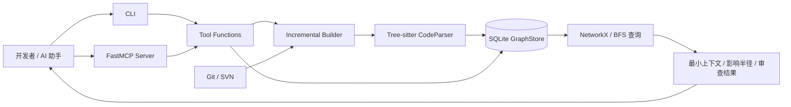
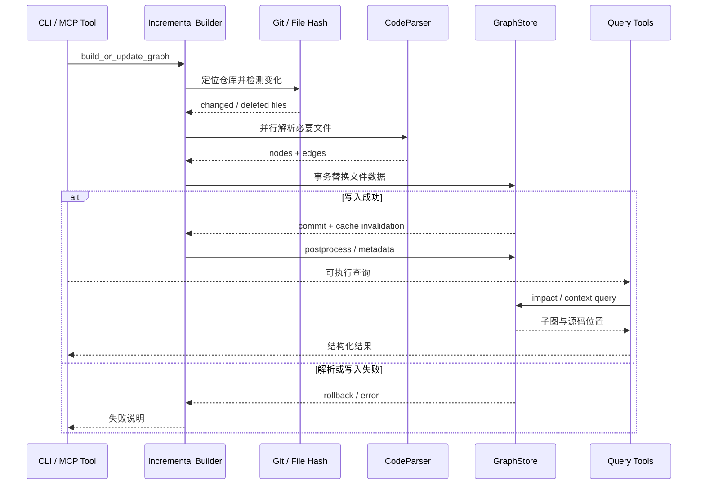
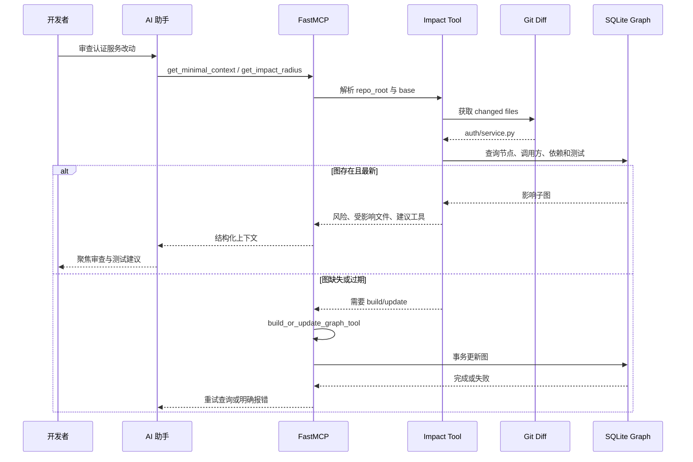

# tirth8205/code-review-graph 项目深度解析

## 1. 项目概览

- 报告日期：2026-07-18
- 仓库地址：https://github.com/tirth8205/code-review-graph
- Trending 原始排名：9
- Stars Today：74
- 项目定位：本地优先的代码知识图与 MCP/CLI 服务，为 AI 代码审查提供影响半径和最小必要上下文。
- 解决的问题：编码 Agent 往往重复读取大量无关源码，既浪费 Token，也难以稳定追踪调用、依赖和测试关系。
- 目标用户：使用 Claude Code、Codex、Cursor、Copilot 等 AI 编程工具的开发者，以及需要本地影响分析的团队。
- 当前成熟度：Beta；`pyproject.toml` 标记 Development Status 4。
- 推荐结论：适合大型仓库的 Agent 导航和审查辅助；动态调用、反射和框架隐式关系必须人工复核。

## 2. 系统架构

### 2.1 架构概览

系统有两类入口：CLI 与 FastMCP Server。构建路径先定位仓库和本地数据目录，再由增量模块检测 Git/SVN 变化或执行全量扫描；`CodeParser` 通过 Tree-sitter 提取文件、类、函数、调用、继承和测试关系；`GraphStore` 用 SQLite/WAL 保存节点、边、文件哈希和元数据。查询路径通过 MCP 工具读取图，执行影响半径、最小上下文、审查上下文、流程和图查询，再把结构化结果返回给 AI 助手。

### 2.2 架构图

### 2.3 核心模块

| 模块 | 职责 | 代码位置 | 关键依赖 | 证据级别 |
|---|---|---|---|---|
| CLI | `build`、`serve`、安装和查询入口 | `code_review_graph/cli.py`、`__main__.py` | argparse / Python | High |
| MCP Server | 注册构建、影响分析、最小上下文等工具 | `code_review_graph/main.py` | FastMCP | High |
| 增量更新 | 仓库定位、Git/SVN 差异、文件哈希、并行解析、数据目录 | `code_review_graph/incremental.py` | subprocess、watchdog、concurrent futures | High |
| 解析器 | 从多语言 AST 提取节点与边 | `code_review_graph/parser.py` | Tree-sitter、language pack | High |
| 图存储 | SQLite Schema、事务写入、查询和缓存失效 | `code_review_graph/graph.py` | SQLite、NetworkX | High |
| 工具层 | 构建、影响半径、审查上下文、流程和搜索 | `code_review_graph/tools/` | GraphStore、增量模块 | High |
| Post-process | 签名、流程、社区、FTS 和可选 Embedding | `tools/`、相关模块 | NetworkX、FTS5、可选模型 | Medium/High |
| IDE/Agent 集成 | MCP 配置、Hooks、Skills、VS Code 扩展 | `skills/`、`hooks/`、`code-review-graph-vscode/` | 宿主工具 | High |

### 2.4 数据与状态管理

- 默认数据目录为 `<repo>/.code-review-graph/`，其中数据库文件不会被 Git 提交。
- SQLite `nodes` 表保存 File、Class、Function、Type、Test；`edges` 表保存 CALLS、IMPORTS_FROM、INHERITS、TESTED_BY 等关系；`metadata` 保存 Schema 和构建状态。
- SQLite 启用 WAL、5 秒 busy timeout；文件级和批量替换使用显式事务，异常时 rollback。
- 文件哈希用于判断变化；写入后清理 NetworkX 图缓存。
- 可选 Embedding、FTS、社区和流程属于后处理结果，不是每次查询都必需。

### 2.5 外部集成与协议

- MCP：默认 stdio，也可本地 Streamable HTTP。
- VCS：Git 和 SVN，用于根目录识别及差异检测。
- AI 工具：通过安装命令写入 MCP 配置、Hooks、Skills 或平台规则。
- 可选 Embedding：本地 sentence-transformers，或配置 OpenAI、Google、Minimax 等 Provider；核心结构图不依赖外部模型。

### 2.6 部署与运行形态

1. 本地 CLI：安装后在目标仓库执行 `code-review-graph build`。
2. MCP stdio：编辑器或 Agent 启动 `code-review-graph serve`。
3. MCP HTTP：本机端口提供 Streamable HTTP。
4. CI：GitHub Action 在 Runner 本地构图并评论 PR。
5. Daemon/watch：监测文件保存或 Hooks，持续增量更新。

## 3. 主线流程

### 3.1 核心流程图

### 3.2 关键步骤

1. CLI/MCP 解析 `repo_root`、`base`、全量或增量模式。
2. `find_project_root()` 按环境变量、VCS 根目录和当前目录确定边界。
3. 增量模块用 Git diff、文件状态与哈希确定新增、修改和删除文件。
4. 并行执行 Tree-sitter 解析；MCP stdio 场景优先线程池以避免子进程继承管道导致死锁。
5. `GraphStore.store_file_nodes_edges` 或 batch 方法在事务中删除旧数据、插入新节点与边。
6. 根据配置执行签名、流程、社区、FTS 或 Embedding 后处理。
7. 查询工具读取图，输出最小上下文、影响半径、源码片段和建议下一步。

### 3.3 异常与失败处理

- 单文件或批量写入异常会 rollback，避免留下半份图。
- ReScript、Spring、Temporal、HCL 等补充解析器以 best-effort 运行，失败会记录 warning 而不拖垮整次构建。
- MCP 构建工作被放入 `asyncio.to_thread`，避免阻塞 stdio 事件循环。
- Windows 和 MCP stdio 可退回线程池，降低死锁和僵尸进程风险。
- 数据目录只读、VCS 不可用或语法解析失败时，工具应返回可追踪错误；不能把旧图假装成最新图。

## 4. 典型业务场景端到端执行链路

### 4.1 场景定义

- 场景名称：开发者修改认证服务后，让 AI 助手查询变更影响半径和应补测试。
- 参与者：开发者、AI 编程助手、MCP Server、影响分析工具、Git、GraphStore。
- 前置条件：仓库已安装 code-review-graph；至少完成一次构建；MCP 配置指向当前仓库。
- 输入：示意任务“审查 `auth/service.py` 的改动，列出受影响调用方和测试”；实际变化由 Git diff 自动检测。
- 期望结果：返回受影响函数、文件、调用链和测试候选，AI 只读取必要源码。
- 成功判定：结果注明仓库和图来源；包含变更文件与至少一层关联关系；过期图先更新；无法确认的动态关系不伪造。

### 4.2 端到端时序图

### 4.3 执行步骤追踪

| 步骤 | 输入 | 执行组件 | 关键代码位置 | 状态或数据变化 | 输出 | 失败分支 | 证据级别 |
|---|---|---|---|---|---|---|---|
| 1 | 示意审查任务 | AI 助手 | 宿主工具 | 形成 MCP 调用 | tool request | MCP 未配置 | Low（示意） |
| 2 | task、repo_root、base | `get_minimal_context_tool` / `get_impact_radius_tool` | `code_review_graph/main.py` | 无持久化变化 | 标准化参数 | repo_root 无效 | High |
| 3 | base ref | Git 检测 | `incremental.py`、tools | 识别 changed files | 文件列表 | Git 命令失败 | High |
| 4 | 文件路径 | Graph query | `tools/`、`graph.py` | 读取 nodes/edges | 影响子图 | 图不存在或过期 | High |
| 5 | 影响子图 | 工具格式化层 | `tools/` | 无写入 | 风险与最小上下文 | 结果过多被限制 | High |
| 6 | 结构化结果 | MCP / AI 助手 | `main.py` | AI 选择需要读取的源码 | 审查建议 | 静态图漏掉动态关系 | High/Medium |
| 7 | 图缺失信号 | build/update tool | `main.py`、`incremental.py` | 事务更新数据库 | 新图 | 解析失败或 DB lock，rollback | High |

### 4.4 关键状态与数据变化

- Git 工作区：源码本身不由查询工具修改。
- 数据库：增量更新删除被修改文件的旧节点/边，再在同一事务写入新关系。
- Metadata/File Hash：更新最近构建和文件指纹，用于下次变化判断。
- 内存缓存：写入后清空 NetworkX 缓存，后续查询重新加载。
- AI 上下文：从“全仓库”收缩为图返回的相关节点、边和源码位置。

### 4.5 失败传播、重试与回滚

- 图缺失或过期：先调用 build/update，再重试一次查询；不得继续用未知新鲜度的数据。
- 单文件解析失败：构建应报告失败文件；若事务尚未提交，旧图保留或本批回滚。
- SQLite 忙或写入异常：显式 rollback；调用方得到错误，不返回虚构影响结果。
- 动态调用、反射、字符串路由：静态图可能漏边，应在输出中降低可信度并提示人工检索。

### 4.6 最终业务结果

开发者得到一个可追踪的“受影响范围 + 推荐阅读文件 + 相关测试”集合。AI 助手不需要先吞下整个仓库，审查焦点更明确；但最终结论仍需结合运行测试与业务知识。

### 4.7 最小复现与验证方法

1. `pip install code-review-graph`。
2. 在示例 Git 仓库执行 `code-review-graph build`。
3. 修改一个被多个函数调用的文件，并增加对应测试文件。
4. 通过 MCP 调用 `get_impact_radius_tool`，或使用 CLI 对等命令。
5. 核对结果是否包含实际调用方和测试路径。
6. 制造语法错误，验证构建失败不会留下半更新图。
7. 删除 `.code-review-graph` 后查询，验证系统明确要求重建而非伪造结果。

## 5. 技术栈

| 层次 | 技术 | 用途 | 是否核心 | 证据位置 |
|---|---|---|---|---|
| 语言 | Python 3.10+ | 服务与分析逻辑 | 是 | `pyproject.toml` |
| 解析 | Tree-sitter、language pack | 多语言 AST | 是 | `pyproject.toml`、`parser.py` |
| 存储 | SQLite、WAL | 本地图节点、边、元数据 | 是 | `graph.py` |
| 图算法 | NetworkX、BFS | 影响与流程分析 | 是 | `graph.py`、constants |
| 协议 | FastMCP、stdio/HTTP | 暴露 Agent 工具 | 是 | `main.py` |
| 增量 | Git/SVN、SHA-256、Watchdog | 变化检测与更新 | 是 | `incremental.py` |
| 检索 | FTS5、可选 Embedding | 名称和语义搜索 | 否/增强 | tools、optional deps |
| CI | GitHub Action | PR 风险评论 | 否/重要 | `.github/`、docs |

## 6. 创新点

### 创新点 1
- 类型：架构创新 / 工作流创新
- 传统方案：AI 审查先扫描大量文件，再凭文本搜索猜调用关系。
- 当前方案：持续维护本地结构图，查询时先计算影响子图和最小上下文。
- 实际收益：减少无关上下文，支持影响、测试和流程视角。
- 证据：README、`graph.py`、MCP tools。
- 局限：静态图无法完整捕捉所有运行时行为。

### 创新点 2
- 类型：工程整合创新
- 传统方案：多种 AI 工具各自配置代码索引。
- 当前方案：一个安装器面向多个平台写 MCP、Hooks、Skills 和规则，并复用同一本地图。
- 实际收益：跨宿主统一分析入口，代码默认不离开本机。
- 证据：README 安装说明、`skills/`、`hooks/`。
- 局限：不同平台对 Hooks、MCP 和指令支持不完全一致。

## 7. 应用场景

### 适合
- 大型仓库的 AI 代码审查和影响分析。
- 本地优先、不能上传源码的团队。
- PR 变更范围、调用链和测试缺口辅助判断。

### 可以尝试
- 多仓库分析、语义搜索和自动 Wiki；需评估索引成本与召回。
- CI 合并门禁；需根据项目调整风险阈值，避免误报阻塞。

### 暂不建议
- 高度依赖运行时反射、代码生成和动态注入且没有额外验证的系统。
- 把项目自报 Token 缩减数字直接当成自己仓库的成本承诺。

## 8. 第一次阅读与验证建议

1. 读 README 的 How It Works 与 Quick Start。
2. 看 `pyproject.toml`、`main.py`、`incremental.py`、`graph.py`。
3. 在小仓库执行全量构建，再制造一次增量变化。
4. 检查 SQLite 中节点/边和影响查询是否与源码一致。
5. 用动态调用案例测试漏报边界。

## 9. 风险与限制

- 安全：本地数据库包含源码结构和绝对路径，应限制访问并避免提交。
- 性能：首次全量解析和后处理成本随仓库规模、语言和 worker 配置增长。
- 许可证：MIT。
- 维护状态：Beta、近期活跃；依赖 FastMCP 与 Tree-sitter 版本边界。
- 生产可用性：适合作为辅助工具；不应单独替代测试、运行时追踪或人工审查。

## 10. Evidence Notes

- README：工作流、平台、增量更新、本地优先、CI 与自报基准。
- `pyproject.toml`：版本 2.3.7、Beta、依赖和 CLI 入口。
- `main.py`：FastMCP 工具、线程卸载、影响与上下文查询。
- `graph.py`：SQLite Schema、WAL、事务、rollback 与缓存。
- `incremental.py`：仓库定位、并行执行器、数据目录和变化检测。

## 11. Honest Caveat

本文没有在真实大型仓库复跑项目的 82 倍中位数 Token 缩减评测，也没有验证全部语言和框架解析器。示意文件名和审查任务不是官方固定接口；动态关系的准确率需要在目标仓库单独测试。

## 12. 可信度

- Architecture Confidence: High
- Flow Confidence: High
- Innovation Confidence: Medium
