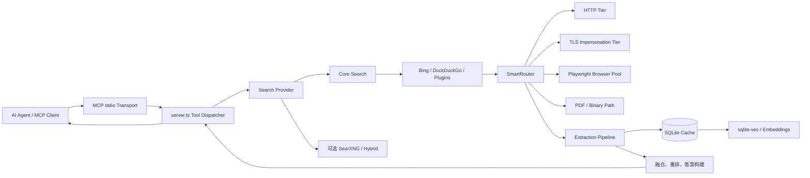
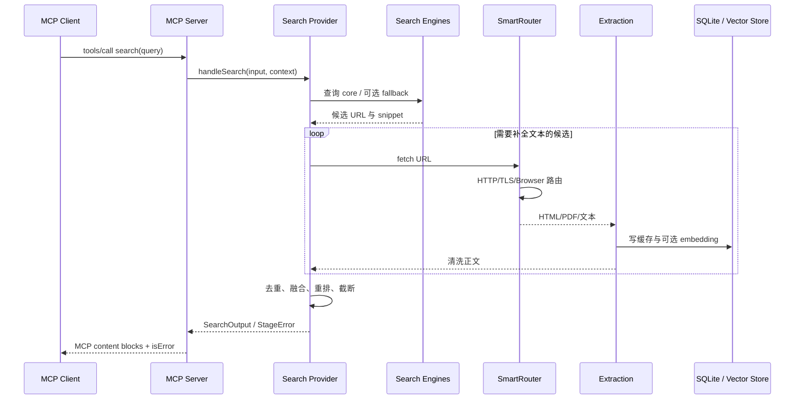
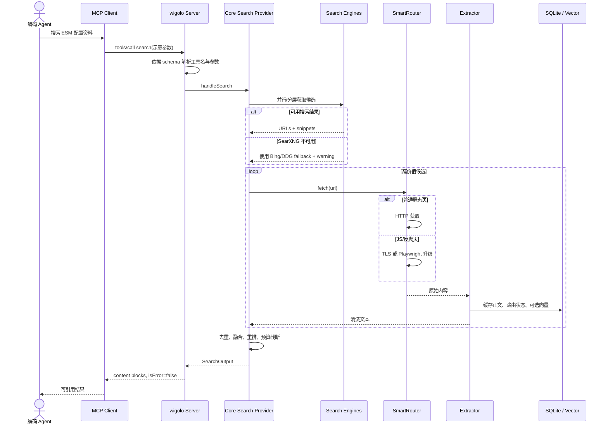

# KnockOutEZ/wigolo 项目深度解析

## 1. 项目概览

- 报告日期：2026-07-19
- 仓库地址：https://github.com/KnockOutEZ/wigolo
- Trending 原始排名：9
- Stars Today：203
- 项目定位：面向 AI 编码 Agent 的本地优先网页搜索、抓取、爬取、抽取和研究 MCP 服务。
- 解决的问题：Agent 查网页时常依赖计费 API、单一搜索引擎或不稳定的直接抓取；wigolo 把多后端搜索、HTTP/TLS/浏览器分层抓取、正文抽取、本地缓存和可选 LLM 综合统一成工具接口。
- 目标用户：使用 Claude Code、Codex、Cursor、Kimi CLI 等 MCP 客户端的开发者，以及需要本地网页研究能力的 Agent 工程团队。
- 当前成熟度：公开 Beta，代码、测试、CLI、MCP、REST、SDK 和容器化路径较完整，但搜索质量与公共网页兼容性仍会随外部环境变化。
- 推荐结论：适合研究“一个本地 Agent 工具如何做路由、降级、缓存和结构化错误”；生产采用前要审查 AGPL、网页合规、搜索引擎条款和数据保留策略。

## 2. 系统架构

### 2.1 架构概览

wigolo 默认以 Node.js 单进程启动 MCP stdio 服务。`src/server.ts` 初始化本地 SQLite、向量服务、HTTP 客户端、Playwright 浏览器池、SmartRouter、搜索引擎和插件注册表，然后向 MCP 客户端公开 search、fetch、crawl、cache、extract、find_similar、research、agent、diff、watch 等工具。搜索请求先由 provider 选择器决定 core、SearXNG 或 hybrid 路径，再由搜索编排调用候选引擎；需要抓正文时，SmartRouter 按 HTTP、TLS impersonation、Playwright 和可选逃生层逐级处理。结果经过正文抽取、融合/排序与缓存后，转成 MCP content blocks 返回。

### 2.2 核心模块

| 模块 | 职责 | 代码位置 | 关键依赖 | 证据级别 |
|---|---|---|---|---|
| 服务启动与生命周期 | 初始化子系统、连接 stdio、预热、优雅关闭 | `src/server.ts::initSubsystems/startServer` | MCP SDK、Node.js | High |
| MCP 工具注册与分发 | 列出工具，按工具名调用对应 handler，统一 `isError` | `src/server.ts::createMcpServer` | MCP request schemas | High |
| 搜索 Provider 选择 | 在 core、searxng、hybrid 中选择运行路径 | `src/providers/search-provider.ts` | 动态 import、配置 | High |
| 搜索 Handler | 连接工具输入和 provider 上下文 | `src/tools/search.ts` | SearchProvider | High |
| 搜索编排 | 聚合搜索引擎、抓取与重排结果 | `src/search/core/`、`src/search/legacy/`、`src/search/hybrid/` | Bing/DDG/SearXNG | High |
| 抓取路由 | 按站点、内容类型、反爬信号和 JS 需求选择 HTTP/TLS/浏览器 | `src/fetch/router.ts::SmartRouter` | HTTP、wreq-js、Playwright | High |
| 浏览器池 | 管理多浏览器实例和轮询选择 | `src/fetch/browser-pool.ts` | Playwright | High |
| 内容抽取 | 将 HTML/PDF 等转换为正文与结构化内容 | `src/extraction/`、`src/tools/extract.ts` | Readability、Defuddle、pdf-parse | High |
| 本地缓存 | 存储页面、路由学习、backoff、watch 等状态 | `src/cache/db.ts`、`src/cache/store.ts` | better-sqlite3 | High |
| 向量检索 | 延迟加载本地 embedding，提供相似内容查询 | `src/embedding/` | fastembed、sqlite-vec | High |
| 插件系统 | 从用户目录加载搜索引擎和抽取器插件 | `src/plugins/loader.ts`、`registry.ts` | 动态模块 | High |
| 后台 watch | 在后续工具调用时检查到期任务并做抓取/差异比较 | `src/watch/` | SQLite、SmartRouter | High |

### 2.3 数据与状态管理

- `config.dataDir` 下创建 `wigolo.db`，用于缓存、路由学习、backoff、watch 任务等本地状态。
- embedding 服务初始化向量存储并执行旧向量迁移；模型延迟到第一次 embed/find_similar 时加载。
- `BackendStatus` 记录搜索后端健康、启动和降级状态。
- `SmartRouter` 维护域名路由偏好，并把 TLS 成功、clearance、rate-limit backoff 写入持久层。
- 浏览器池、搜索 Provider 缓存和 SearXNG 进程属于进程内状态；关闭时统一释放。
- 默认没有远程数据库或消息队列。watch 不是常驻调度器：服务器处理其他工具调用时才触发逾期检查。

### 2.4 外部集成与协议

- MCP：默认 JSON-RPC over stdio，供 Agent 工具调用。
- REST：项目提供可选 HTTP 接口和 SDK，但本次主链路以 MCP 为准。
- 搜索后端：内置 Bing 和 DuckDuckGo，SearXNG 为可选安装/外部服务，插件可追加后端。
- Web 获取：普通 HTTP、TLS impersonation、Playwright；PDF 有独立探测和字节处理路径。
- Embedding：默认本地模型与 sqlite-vec，不强制远程 API。
- 可选 LLM：依赖中包括 Anthropic、Google、OpenAI、Groq，用于 research/agent 等综合能力；核心 search/fetch 不必提供 API Key。

### 2.5 部署与运行形态

- 典型形态：MCP 客户端执行 `npx wigolo`，本地进程通过 stdio 收发请求。
- 也可作为 REST 服务、Docker 容器或打包二进制运行。
- 默认数据和浏览器资源留在本机；没有微服务拆分证据。
- Node.js 要求 20+；Playwright 浏览器与可选 SearXNG 可能需要额外安装和磁盘空间。

## 3. 主线流程

### 3.1 核心流程图

### 3.2 关键步骤

1. `startServer()` 初始化 SQLite、embedding、HTTP/浏览器、搜索引擎和插件，然后连接 `StdioServerTransport`。
2. 客户端调用 `search`；`CallToolRequestSchema` handler 读取工具名和参数。
3. `handleSearch()` 获取当前 provider，默认选择 `CoreSearchProvider`；配置可切换 SearXNG 或 hybrid。
4. 搜索 Provider 调用搜索引擎获取候选，必要时使用 SmartRouter 抓正文。
5. SmartRouter 根据已知 SPA、反爬、文件扩展、响应状态和内容完整度选择 HTTP、TLS 或浏览器层。
6. 抽取器清理网页正文，缓存层保存内容、路由信号和向量数据。
7. 搜索层对候选去重、排序和压缩，`buildSearchContentBlocks()` 转成 MCP 响应块。
8. 任一阶段失败会返回阶段、原因和可选 hint，并设置 `isError`，而不是生成看似成功的空结果。

### 3.3 异常与失败处理

- embedding 初始化失败：记录 warning，`find_similar` 仍可退化为无 embedding 路径，主服务继续启动。
- 插件加载失败：逐项记录错误，成功插件继续注册。
- SearXNG 配置但未安装：标记后端 unhealthy，提示显式 warmup 或外部 URL，继续使用 fallback 搜索引擎。
- HTTP 遇到 JS 页面、反爬或空内容：SmartRouter 可升级到 TLS/Playwright；域名 backoff 和 clearance 会被复用。
- PDF/二进制：避免交给浏览器导致“Download is starting”错误，改走字节层。
- 工具 handler 失败：统一返回 `error`、`error_reason`、`stage`、`hint` 和 `isError:true`。
- watch 检查失败不会阻塞当前非 watch 工具调用，因为调度在 `setImmediate` 背景路径并吞掉错误。

## 4. 典型业务场景端到端执行链路

### 4.1 场景定义

| 项目 | 内容 |
|---|---|
| 场景名称 | 编码 Agent 搜索 TypeScript ESM 配置资料并返回带正文依据的结果 |
| 参与者 | 编码 Agent、MCP Client、wigolo MCP Server、Search Provider、搜索引擎、SmartRouter、抽取器、SQLite/向量存储 |
| 前置条件 | Node.js 20+；客户端已配置 `npx wigolo`；首次运行已创建本地数据目录；网络可访问公开网页 |
| 输入 | **示意 MCP 参数**：`{"query":"TypeScript ESM package.json moduleResolution node16","max_results":5}`；字段应以当前 tool schema 为准 |
| 期望结果 | Agent 收到若干去重后的结果，包含 URL、摘要/正文依据和后端说明；抓取内容进入本地缓存 |
| 成功判定 | MCP 返回 `isError:false`；结果不为空且至少一个候选包含可核对的 URL/文本；后续相同请求能利用缓存或已学习路由，而不是仅收到搜索引擎标题 |

### 4.2 端到端时序图

### 4.3 执行步骤追踪

| 步骤 | 输入 | 执行组件 | 关键代码位置 | 状态或数据变化 | 输出 | 失败分支 | 证据级别 |
|---:|---|---|---|---|---|---|---|
| 1 | MCP 启动命令 | `startServer` | `src/server.ts` | 创建数据目录、SQLite、浏览器池和 provider 状态 | MCP server ready | DB/关键初始化异常可终止；embedding 失败降级 | High |
| 2 | `tools/call search` | MCP request handler | `createMcpServer` | 解析 name/arguments，触发非 watch 的逾期检查 | SearchInput | 未知工具返回 `isError:true` | High |
| 3 | SearchInput | `handleSearch` | `src/tools/search.ts` | 组装 engines/router/status/sampling 上下文 | provider 调用 | provider 获取失败返回 StageError | High |
| 4 | 配置 | `getSearchProvider` | `src/providers/search-provider.ts` | 缓存 core/searxng/hybrid 实例 | SearchProvider | 非法配置明确报错 | High |
| 5 | 查询词 | 搜索编排 | `src/search/core/` | 生成候选 URL/snippet，记录后端状态 | 候选集 | SearXNG 不可用时跳过或 fallback | High |
| 6 | 候选 URL | `SmartRouter` | `src/fetch/router.ts` | 读取域名偏好/backoff，选择 HTTP/TLS/Browser/PDF | 原始内容 | 反爬、限流、JS 空壳触发升级；最终失败保留 stage | High |
| 7 | HTML/PDF | extraction pipeline | `src/extraction/` | 清理正文、解析文档 | 文本与元数据 | 抽取不足可保留 snippet/完整度说明 | High |
| 8 | 正文/URL | cache + embedding | `src/cache/`、`src/embedding/` | 写 SQLite；按需生成向量 | 可复用缓存 | sqlite-vec/模型失败则无向量路径 | High |
| 9 | 多源结果 | provider 排序与预算 | `src/search/core/` | 去重、重排、截断 | SearchOutput | 全部候选失败返回结构化错误 | Medium |
| 10 | SearchOutput | response builder | `buildSearchContentBlocks` | 转为 MCP 文本/资源块 | Agent 可消费结果 | `r.data.error` 会令 `isError` 为真 | High |

### 4.4 关键状态与数据变化

- 首次启动：创建 `~/.wigolo`（实际目录可配置）和 SQLite 数据库。
- 每次搜索：产生候选、抓取结果、抽取文本和后端健康信息。
- 域名学习：成功 TLS 路由、clearance 和 rate-limit backoff 可写入数据库，影响后续请求。
- 缓存：正文和元数据本地持久化；向量路径可为 `find_similar` 提供语义检索。
- 进程状态：浏览器池、搜索 provider、SearXNG 进程和插件注册表随服务生命周期存在。
- 用户数据默认留在本机，但访问的 URL、正文和研究结果会形成持久数据，需纳入隐私治理。

### 4.5 失败传播、重试与回滚

该场景没有数据库事务意义上的整体回滚，因为搜索由多个独立候选组成。单个引擎或网页失败不必让整次搜索失败：Provider 可以继续处理其他候选，SmartRouter 可以在不同抓取层之间升级。若所有路径失败，错误通过 `StageResult` 返回 MCP，并标明阶段和提示。缓存写入失败、embedding 失败或插件失败应被视为局部降级；已有搜索结果不应被伪造为向量检索成功。

### 4.6 最终业务结果

Agent 获得的不是一串未经核对的标题，而是经过多后端发现、正文抓取、清洗、去重和预算控制的结构化搜索结果。对开发任务而言，最终价值是能把网页证据直接放进当前上下文，同时把抓取成本和数据留在本机；成功并不等于“搜到了五条”，而是结果可以打开、文本与链接一致、失败来源可解释。

### 4.7 最小复现与验证方法

1. 在 Node.js 20+ 环境执行官方安装/初始化命令，并将 `npx wigolo` 配为 MCP stdio 服务。
2. 先调用 `listTools`，确认 `search`、`fetch`、`crawl` 等 schema 可见。
3. 用一个静态文档查询测试 HTTP 路径，再用 React/Next.js 文档测试 Playwright 升级路径。
4. 重复相同 URL 的 fetch，观察缓存命中和数据库文件变化。
5. 暂停/移除可选 SearXNG，确认 core fallback 能工作且响应保留 warning。
6. 关闭 embedding 能力，确认普通 search/fetch 仍能运行，`find_similar` 明确降级。
7. 检查返回 URL、正文和原网页是否一致，并记录 robots、限流和服务条款约束。

## 5. 技术栈

| 层次 | 技术 | 用途 | 是否核心 | 证据位置 |
|---|---|---|---|---|
| 语言与运行时 | TypeScript、Node.js 20+ | 服务、CLI、MCP 和 SDK | 是 | `package.json` |
| 协议 | Model Context Protocol stdio | Agent 工具发现和调用 | 是 | `package.json`、`server.ts` |
| 服务接口 | 可选 REST | 非 MCP 客户端接入 | 否 | README、服务代码 |
| 抓取 | HTTP、wreq-js TLS、Playwright | 静态页、反爬页和 JS 页面 | 是 | `fetch/router.ts` |
| 搜索 | Bing、DuckDuckGo、可选 SearXNG | 候选发现 | 是 | `server.ts`、providers |
| 数据 | better-sqlite3 | 缓存、任务和路由状态 | 是 | `package.json`、`cache/` |
| 向量 | sqlite-vec、fastembed、Transformers | 本地相似检索 | 否，但重要 | `package.json`、`embedding/` |
| 内容抽取 | Readability、Defuddle、pdf-parse | 网页/PDF 正文清洗 | 是 | `package.json`、`extraction/` |
| 插件 | 动态搜索引擎/抽取器 | 扩展后端 | 否 | `plugins/` |
| 测试构建 | Vitest、tsup、tsc | 单元/集成/e2e/性能测试与打包 | 否 | `package.json` scripts |

## 6. 创新点

### 创新点 1

- 类型：架构创新
- 传统方案：Agent 对一个网页工具或付费搜索 API 强绑定，搜索发现与正文抓取混在一条脆弱路径里。
- 当前方案：搜索 Provider、搜索引擎、SmartRouter、抽取和缓存分层，允许各层独立替换和降级。
- 实际收益：单一引擎、网页或抓取方式失败时仍有替代路径，错误也能定位到具体 stage。
- 证据：`server.ts`、`search-provider.ts`、`fetch/router.ts`。
- 局限：分层越多，配置、测试矩阵和外部兼容维护成本越高。

### 创新点 2

- 类型：工作流创新
- 传统方案：Agent 每次重复访问网页，结果只存在当前上下文。
- 当前方案：抓取结果、路由学习和向量索引保存在本地，后续可 cache/find_similar/research 复用。
- 实际收益：减少重复网络开销，并为长期研究提供本地资料库。
- 证据：SQLite 初始化、embedding 服务、工具清单。
- 局限：本地数据库会积累敏感 URL 和正文，用户必须管理保留、删除和磁盘占用。

### 创新点 3

- 类型：工程整合创新
- 传统方案：搜索、浏览器自动化、PDF、抽取、embedding 与 MCP 需要分别拼接。
- 当前方案：单进程提供统一安装、MCP/REST、工具 schema、浏览器池、插件和 SDK。
- 实际收益：编码 Agent 可用一个服务完成从发现到引用的多数网页研究步骤。
- 证据：`package.json`、README、`server.ts` 工具分发。
- 局限：这是高价值整合，但不能自动等同于搜索质量突破；公共网页变化仍是硬约束。

## 7. 应用场景

### 适合

- 本地编码 Agent 查 API 文档、Issue、博客和技术资料。
- 对公开网页做小到中等规模抓取、抽取和本地缓存。
- 研究 MCP 工具的错误、权限和降级设计。
- 需要避免每次搜索都调用计费 API的个人或小团队。

### 可以尝试

- 企业内部文档搜索，但需增加认证、数据隔离和访问审计。
- 长期研究与网页变更监控，但要确认 watch 的非守护式调度语义。
- 批量爬取和向量知识库，但需压测浏览器池、SQLite 并发和磁盘增长。

### 暂不建议

- 未审查 robots.txt、站点条款和版权就大规模抓取。
- 未评估 AGPL 义务就嵌入闭源分发产品。
- 要求严格搜索 SLA、固定排序质量或高并发多租户的生产系统直接照搬。

## 8. 第一次阅读与验证建议

1. 先读 README 的 Quick Start、工具列表、架构与 Public Beta 说明。
2. 再看 `package.json`，确认运行时、许可证和真实依赖。
3. 沿 `startServer -> createMcpServer -> handleSearch -> getSearchProvider -> SmartRouter` 追踪一次 search。
4. 阅读 `cache/`、`embedding/` 和 `plugins/`，分清持久化与可选能力。
5. 用静态页、SPA、PDF、受限站点分别测试路由阶梯和错误返回。

## 9. 风险与限制

- 安全：网页抓取涉及 SSRF、认证 Cookie、浏览器执行和第三方内容；代码已有 URL guard，但生产环境仍需隔离和审计。
- 性能：Playwright、embedding 和多后端搜索会增加内存、CPU 和延迟；官方基准未在本报告中复测。
- 许可证：AGPL-3.0-only；网络服务修改和分发场景应咨询合规人员。
- 维护状态：公开 Beta、更新活跃，接口和配置可能继续变化。
- 生产可用性：缺少成熟多租户控制面和承诺 SLA；SQLite 与单进程边界需压测。

## 10. Evidence Notes

- 直接源码：`package.json`、`src/server.ts`、`src/tools/search.ts`、`src/providers/search-provider.ts`、`src/fetch/router.ts`。
- 官方资料：README 的 MCP、REST、工具、架构、数据目录和 Beta 说明。
- 已确认：单进程 MCP、SQLite、本地 embedding、搜索 provider、HTTP/TLS/Browser 路由、结构化错误和可选 SearXNG。
- 有限推断：搜索核心内部每个融合权重和排序细节未在本报告逐函数展开，因此步骤 9 证据标为 Medium。
- 未发现：远程主数据库、消息队列或常驻 watch daemon。

## 11. Honest Caveat

本报告没有实际运行 wigolo，也没有向公共搜索引擎发压测请求。网页生态和反爬策略变化很快，今天能走 HTTP 的站点明天可能必须浏览器，反之亦然。架构与失败路径有源码证据，但“免费替代付费搜索 API”的效果必须按查询类型、地区、频率和合规要求实测。

## 12. 可信度

- Architecture Confidence: High
- Flow Confidence: High
- Innovation Confidence: Medium
