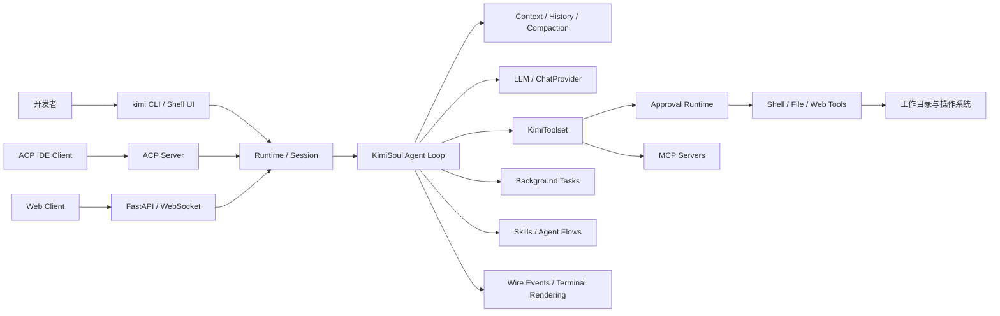
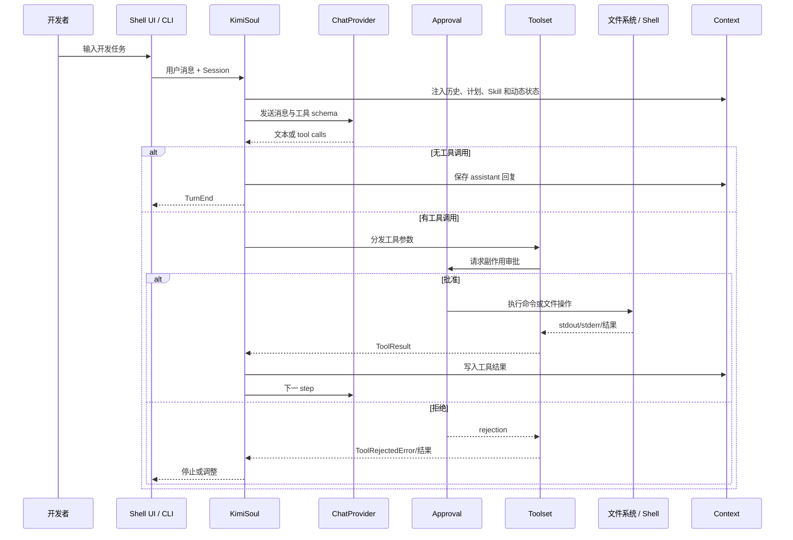
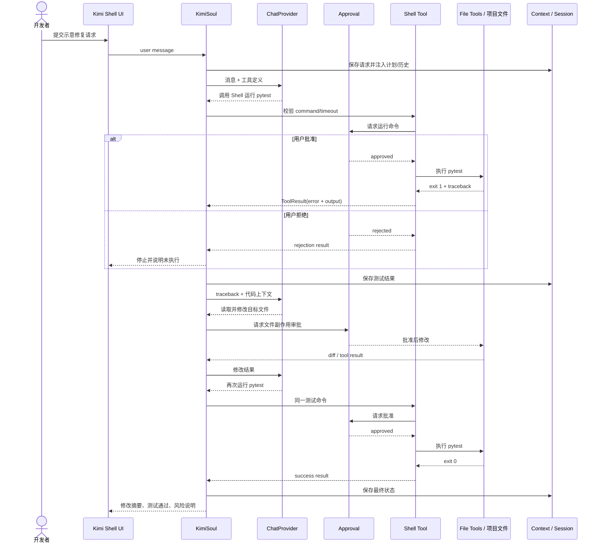

# MoonshotAI/kimi-cli 项目深度解析

## 1. 项目概览

- 报告日期：2026-07-19
- 仓库地址：https://github.com/MoonshotAI/kimi-cli
- Trending 原始排名：11
- Stars Today：65
- 项目定位：运行在终端中的 AI Agent，能够读取和修改代码、执行 Shell、访问网页，并通过 MCP 与 ACP 接入工具和 IDE。
- 解决的问题：开发者需要一个能在项目目录中持续理解上下文、调用工具、处理审批和保存会话的 Agent，而不只是一次问答式聊天。
- 目标用户：终端重度用户、AI 编程工具研究者、需要 ACP/MCP 集成的 IDE 或工程团队。
- 当前成熟度：功能和源码体系较完整，但官方已明确宣布项目正迁移到下一代 `MoonshotAI/kimi-code`，本仓库将逐步收尾。
- 推荐结论：适合研究 Agent Loop、工具审批、会话上下文、动态 Skill/Flow 与协议接入；新生产项目应优先评估继任 Kimi Code CLI，避免把正在退场的版本当长期基座。

## 2. 系统架构

### 2.1 架构概览

Kimi CLI 的入口 `kimi_cli.__main__:main` 先安装崩溃处理、规范化代理环境，再把参数交给 Typer CLI。运行时会构建 Agent、Session、Context、Toolset、Approval 和 LLM Provider，并由 `KimiSoul` 负责一轮又一轮的模型调用和工具执行。工具包括 Shell、文件操作、搜索、MCP 工具等；需要副作用的操作经过 Approval。会话历史、计划状态、动态注入、Skill/Flow、后台任务和压缩策略共同构成上下文管理。除终端 UI 外，项目还提供 ACP Agent Server、Web/FastAPI/WebSocket 和 SDK 接入。

### 2.2 核心模块

| 模块 | 职责 | 代码位置 | 关键依赖 | 证据级别 |
|---|---|---|---|---|
| 进程入口 | 安装崩溃处理、处理版本、分发 CLI | `src/kimi_cli/__main__.py` | Python、Typer | High |
| CLI 命令层 | 解析交互、command、ACP、MCP、配置等子命令 | `src/kimi_cli/cli/` | Typer | High |
| Agent Runtime | 汇总配置、Session、LLM、Approval、工具与后台任务 | `src/kimi_cli/soul/agent.py` | dataclasses/Pydantic | High |
| Agent Loop | 管理 turn/step、模型、工具调用、重试、停止原因 | `src/kimi_cli/soul/kimisoul.py::KimiSoul` | kosong、tenacity | High |
| 上下文 | 历史消息、动态注入、压缩与 token 预算 | `src/kimi_cli/soul/context.py`、`compaction.py` | kosong messages | High |
| Toolset | 聚合内置工具、MCP 工具和 hooks | `src/kimi_cli/soul/toolset.py` | kosong Tool | High |
| Approval | 对 Shell、文件等副作用操作请求用户授权或应用自动批准策略 | `src/kimi_cli/soul/approval.py`、`approval_runtime/` | Runtime state | High |
| Shell 工具 | 参数校验、审批、前后台进程、超时、stdout/stderr 收集 | `src/kimi_cli/tools/shell/__init__.py` | kaos、Pydantic | High |
| Skill / Flow | 发现标准 Skill 和流程 Skill，执行分支与循环 | `src/kimi_cli/skill/`、`KimiSoul.FlowRunner` | Mermaid/D2 parser | High |
| MCP 管理 | 配置与连接 stdio/HTTP/OAuth MCP 服务 | `src/kimi_cli/cli/mcp.py`、FastMCP | MCP | High |
| ACP 接入 | 把 Kimi 暴露为兼容编辑器的 Agent Server | `src/kimi_cli/acp/` | agent-client-protocol | High |
| UI/Wire | 将 step、tool、approval、compaction 等事件渲染给终端/Web | `src/kimi_cli/wire/`、`ui/`、`web/` | prompt-toolkit、FastAPI | High |

### 2.3 数据与状态管理

- Session 持有工作目录、历史、计划模式和持久状态；配置与会话可跨进程恢复。
- `Context.history` 保存用户、assistant 和 tool result 消息；接近 token 限制时触发 compaction。
- `KimiSoul` 维护当前工具调用、最近工具调用、steer queue、flow runner、plan session 和 trace id。
- Background manager 保存长任务状态并通过通知机制回传。
- 文件修改与 Shell 命令直接作用于本地工作目录，属于真实副作用，不是内存模拟。
- 没有证据显示默认依赖远程数据库或消息队列；外部持久化主要是本地会话、配置、日志和项目文件。

### 2.4 外部集成与协议

- LLM Provider：通过 `kosong` 的 ChatProvider 抽象连接模型服务。
- MCP：支持 stdio、streamable HTTP 和 OAuth 服务，Agent 可加载外部工具。
- ACP：Kimi CLI 可作为 Agent Server 接入 Zed、JetBrains 等兼容客户端。
- Shell/OS：通过 `kaos.exec` 在工作目录中执行命令。
- Web：FastAPI、Uvicorn 和 WebSocket 提供 Web UI/服务路径。
- VS Code：官方 README 指向 Kimi Code VS Code 扩展。

### 2.5 部署与运行形态

最常见形态是用户本机安装 Python 包或独立二进制，在项目目录中运行 `kimi`。同一代码库还能以 `kimi acp` 作为 IDE Agent Server，或启动 Web API/UI。Agent 的权限边界取决于工作目录、Approval 模式、外部 MCP 和用户凭据；它不是天然沙箱。

## 3. 主线流程

### 3.1 核心流程图

### 3.2 关键步骤

1. `__main__.py` 安装 crash handlers，规范化代理环境，然后调用 Typer CLI。
2. CLI 加载配置、凭据、工作目录、Session、Agent、工具和 LLM。
3. `KimiSoul` 将用户消息写入 Context，并收集 plan/AFK 等动态注入。
4. 根据 token 预算和历史状态，必要时先压缩上下文。
5. ChatProvider 返回文本或工具调用；KimiSoul 对重复调用、最大步骤和停止原因进行管理。
6. Toolset 解析工具参数。Shell 使用 Pydantic 校验 timeout、background 和 description。
7. Shell 在执行前调用 Approval；拒绝会返回 rejection error，不执行命令。
8. 批准后以非交互环境运行 shell，关闭 stdin，持续收集 stdout/stderr，并在超时/取消时 kill 进程。
9. ToolResult 写回 Context，模型继续下一 step，直到无工具调用、工具被拒绝、重复调用或达到上限。
10. UI 通过 wire event 展示 step、工具、审批、重试和最终回复；Session 保存可恢复状态。

### 3.3 异常与失败处理

- API 错误：区分 rate limit、auth、overloaded、5xx、4xx、context overflow、network、timeout 和 empty response；部分路径用 tenacity 做指数抖动重试。
- Shell 参数错误：Pydantic 拒绝空命令、过长前台 timeout 或缺少后台 description。
- 用户拒绝：工具不会执行，返回 rejection error；KimiSoul 可将停止原因标为 `tool_rejected`。
- Shell 非零退出：返回 exit code 和尾部输出，模型可据此修复后重试。
- Shell 超时/取消：kill 子进程并返回明确错误。
- 重复工具调用/最大步骤：循环控制停止，避免 Agent 无限敲同一扇门。
- Context 过长：使用 compaction 压缩历史，而不是无条件丢弃所有旧消息。
- 崩溃：入口提前安装 crash handlers，finally 阶段标记 shutdown。

## 4. 典型业务场景端到端执行链路

### 4.1 场景定义

| 项目 | 内容 |
|---|---|
| 场景名称 | 开发者要求 Kimi CLI 修复一个失败测试并重新运行验证 |
| 参与者 | 开发者、Shell UI、KimiSoul、LLM Provider、Toolset、Approval、Shell/File 工具、本地项目 |
| 前置条件 | 已安装并登录 Kimi CLI；当前目录是可修改项目；测试命令可本地运行；Approval 未被完全禁用 |
| 输入 | **示意用户请求**：“运行 `pytest tests/test_total.py -q`，定位失败并修复；修改前先告诉我计划。” |
| 期望结果 | Agent 读取上下文，运行失败测试，定位文件，申请并完成修改，再次运行测试并总结改动 |
| 成功判定 | 目标测试最终 exit code 为 0；修改文件可在 diff 中核对；最终回复明确列出修改和验证结果，而不是仅声称“应该好了” |

### 4.2 端到端时序图

### 4.3 执行步骤追踪

| 步骤 | 输入 | 执行组件 | 关键代码位置 | 状态或数据变化 | 输出 | 失败分支 | 证据级别 |
|---:|---|---|---|---|---|---|---|
| 1 | CLI 参数与用户文本 | `__main__.py` / CLI | `src/kimi_cli/__main__.py`、`cli/` | 初始化 crash、proxy、Session | 用户消息事件 | 环境或 Git Bash 问题返回 exit 1 | High |
| 2 | 用户消息 | `KimiSoul` | `soul/kimisoul.py` | 写入 Context，收集动态注入 | 模型请求 | LLM 未配置抛出明确错误 | High |
| 3 | 历史和工具 schema | ChatProvider | `kosong` + `kimi_cli/llm` | 产生 assistant message/tool call | Shell 调用 | auth、429、5xx、network、timeout 分类并按策略重试 | High |
| 4 | Shell 参数 | `Shell.Params` | `tools/shell/__init__.py` | Pydantic 校验 command/timeout/background | 合法调用 | 空命令或 timeout 非法直接返回错误 | High |
| 5 | 命令与展示块 | Approval | `Shell.__call__`、approval runtime | 等待批准，不修改项目 | approved/rejected | 拒绝则不执行并停止/调整 | High |
| 6 | `pytest...` | Shell / kaos | `_run_shell_command` | 创建子进程，关闭 stdin，收集输出 | exit 1 + traceback | timeout/cancel kill 进程 | High |
| 7 | ToolResult | KimiSoul + Context | `kimisoul.py` | 将失败结果加入历史 | 下一模型 step | 重复工具调用触发停止保护 | High |
| 8 | 文件路径/补丁 | File Tool + Approval | `tools/`、`soul/toolset.py` | 本地文件内容变化 | diff/tool result | 用户拒绝、路径越界或写入失败 | Medium |
| 9 | 修改后命令 | Shell | 同步骤 4–6 | 再次执行测试 | exit 0 | 仍失败则模型继续诊断或达到 step 上限 | High |
| 10 | 全部结果 | KimiSoul/UI | turn outcome、wire events | Session 持久化最终历史 | 用户可核对总结 | Context overflow 时先 compaction | High |

### 4.4 关键状态与数据变化

- Context：依次增加用户请求、模型工具调用、测试错误、文件修改结果、复测结果和最终消息。
- 项目文件：只有通过 Approval 后才发生真实写入；修改内容可通过 diff 或版本控制检查。
- 子进程：Shell 创建非交互子进程，stdout/stderr 写入 ToolResultBuilder；结束或超时时释放。
- Approval：记录当前操作是否被允许，YOLO/AFK 模式可能自动批准，因此使用者必须理解风险。
- Session：保存工作目录、history、plan mode、trace 等状态，支持后续恢复。
- Token：历史接近上下文上限时触发 compaction，压缩内容替代无限增长。

### 4.5 失败传播、重试与回滚

- API 429/网络/超时等可重试错误由 Provider/tenacity 路径处理；认证错误不应盲目重试。
- 测试失败不是系统故障，而是作为结构化 ToolResult 回到模型，驱动下一步诊断。
- 用户拒绝 Shell 或文件修改后，没有副作用，Agent 应停止或换成只读建议。
- 文件修改没有通用事务回滚。最可靠的回滚机制是 Git 工作区；用户应在干净分支或 worktree 中运行。
- 达到最大 step、重复调用或 flow 最大移动次数时强制停止，避免无穷循环和持续成本。

### 4.6 最终业务结果

用户最终应得到三样可核对的东西：实际文件 diff、复测命令的成功退出状态，以及解释“改了什么、为什么改、还有什么没验证”的文本总结。Agent 的价值不在于说得像修好了，而在于把失败输出转成修改，再用同一测试闭环证明结果。

### 4.7 最小复现与验证方法

1. 在一个小型、已提交到 Git 的测试仓库安装并登录 Kimi CLI。
2. 保持 Approval 开启，提交上面的示意修复请求。
3. 检查第一次 Shell 审批是否展示完整命令；拒绝一次，确认项目未被改动。
4. 重新执行并批准，观察非零 exit code 是否作为工具结果回到对话。
5. 批准文件修改后运行 `git diff`，确认实际变化与 Agent 总结一致。
6. 让 Agent 复跑同一测试，必须看到 exit code 0 才判定成功。
7. 断网或使用错误凭据，检查 API 错误分类与重试是否符合预期。
8. 新项目选型同时复测继任 `MoonshotAI/kimi-code` 的迁移和兼容性。

## 5. 技术栈

| 层次 | 技术 | 用途 | 是否核心 | 证据位置 |
|---|---|---|---|---|
| 语言与运行时 | Python 3.12+ | CLI、Agent 和协议服务 | 是 | `pyproject.toml` |
| CLI/UI | Typer、prompt-toolkit、Rich | 命令解析和终端交互 | 是 | `pyproject.toml`、`cli/`、`ui/` |
| Agent 核心 | kosong、KimiSoul | ChatProvider、消息、工具循环 | 是 | `kimisoul.py` |
| 校验 | Pydantic | 配置和工具参数 | 是 | `pyproject.toml`、Shell Params |
| 重试 | tenacity | API 错误重试与退避 | 是 | `kimisoul.py` |
| Shell | kaos | 异步子进程执行 | 是 | `tools/shell` |
| 工具协议 | FastMCP / MCP | 外部工具接入 | 是 | README、`pyproject.toml` |
| IDE 协议 | Agent Client Protocol | 作为 IDE Agent Server | 否，但关键 | README、`acp/` |
| Web | FastAPI、Uvicorn、WebSocket | Web UI/服务 | 否 | `pyproject.toml`、`web/` |
| 状态 | 本地 Session/配置/文件 | 会话恢复和真实工作区副作用 | 是 | Runtime/Session 源码 |
| 工作流 | Skill + Mermaid/D2 Flow | 可复用任务和分支流程 | 否 | `skill/`、KLIP-10 |

## 6. 创新点

### 创新点 1

- 类型：工作流创新
- 传统方案：终端 Agent 依靠一次自然语言提示和隐式循环，复杂过程难以复用和约束。
- 当前方案：标准 Skill 之外支持 Mermaid/D2 Agent Flow，节点对应对话轮次，分支通过 `<choice>` 选择，带最大移动次数。
- 实际收益：可把重复任务做成可读、可版本化的流程，同时保留 LLM 决策。
- 证据：`klips/klip-10-agent-flow.md`、`KimiSoul.FlowRunner`。
- 局限：只支持 Mermaid/D2 子集，流程正确性仍受模型输出和工具环境影响。

### 创新点 2

- 类型：架构创新
- 传统方案：CLI、IDE、Web 各自实现一套 Agent 核心。
- 当前方案：KimiSoul/Runtime 作为共享执行内核，上层通过 Shell UI、ACP 和 Web/Wire 复用。
- 实际收益：同一工具、审批、上下文和错误语义可跨入口保持一致。
- 证据：README、`acp/`、`web/`、`soul/`。
- 局限：多入口扩大兼容和测试面，也使仓库复杂度较高。

### 创新点 3

- 类型：工程整合创新
- 传统方案：Agent 工具执行常只返回字符串，权限、后台任务、超时和 UI 展示各自拼接。
- 当前方案：Shell 将参数校验、Approval、前后台任务、流式输出、timeout/kill 和 display block 放在统一工具实现中。
- 实际收益：副作用更可见，失败能以模型可消费的 ToolResult 回传。
- 证据：`src/kimi_cli/tools/shell/__init__.py`。
- 局限：自动批准模式会绕过人工确认，安全性最终取决于运行配置和工作目录隔离。

## 7. 应用场景

### 适合

- 终端中的代码阅读、修改、测试和小型自动化任务。
- 研究 MCP/ACP、工具审批、Agent Loop 和上下文压缩。
- 已有 Kimi CLI 用户维护存量工作流和迁移。
- 在受控 Git 分支/worktree 中执行可回滚开发任务。

### 可以尝试

- IDE 自带 Agent 面板接入 ACP。
- 通过 MCP 连接企业工具，但需权限、凭据和审计设计。
- 自定义 Agent Flow 做重复工程流程。

### 暂不建议

- 新的长期生产基座直接依赖本仓库，而不评估 Kimi Code CLI。
- 在包含生产凭据、不可恢复文件或高权限 Shell 的目录开启自动批准。
- 让 Agent 在无人监督下执行破坏性系统命令。

## 8. 第一次阅读与验证建议

1. 先读 README 的迁移公告、Shell、ACP 和 MCP 部分。
2. 从 `__main__.py` 和 `cli/` 了解入口，再读 `soul/agent.py` 与 `kimisoul.py`。
3. 查看 `tools/shell` 和 Approval Runtime，理解真实副作用边界。
4. 阅读 KLIP-10 和对应测试，验证 Skill Flow、分支和最大移动限制。
5. 在临时 Git 仓库运行“失败测试→修改→复测”最小链路，并测试拒绝和超时。
6. 比较继任 Kimi Code CLI 的迁移工具、配置兼容和维护路线。

## 9. 风险与限制

- 安全：Shell 和文件工具可修改真实系统；YOLO/AFK 自动批准必须谨慎使用，建议容器、worktree 和最小权限。
- 性能：多 step LLM 调用、工具输出和上下文压缩影响延迟与费用；未做独立基准。
- 许可证：Apache-2.0；外部模型服务、MCP 工具和依赖各有独立条款。
- 维护状态：官方明确逐步迁移并收尾，未来修复和功能重心会转到 Kimi Code CLI。
- 生产可用性：功能完整不代表可无人值守；审批、凭据、审计、回滚和外部服务 SLA 需自行建设。

## 10. Evidence Notes

- 直接源码：`src/kimi_cli/__main__.py`、`src/kimi_cli/soul/kimisoul.py`、`src/kimi_cli/tools/shell/__init__.py`、`pyproject.toml`。
- 官方设计：`klips/klip-10-agent-flow.md` 标记 Implemented，说明 FlowRunner、分支、重试和上限。
- 官方文档：README 的终端 Agent、Shell、ACP、MCP 和迁移公告。
- 已确认：工具审批、Shell 超时与 kill、API 错误分类、Context/compaction、Flow 与多入口。
- 有限推断：文件修改工具的具体审批路径未逐文件展开，因此业务追踪步骤 8 标为 Medium。

## 11. Honest Caveat

本报告是静态源码分析，没有登录模型服务、执行真实修复任务或验证自动迁移。Kimi CLI 当前代码足以支持高可信架构与流程判断，但其未来维护方向已经改变；任何新选型都应把继任项目、服务账号、模型能力和组织安全策略一起评估。

## 12. 可信度

- Architecture Confidence: High
- Flow Confidence: High
- Innovation Confidence: Medium
