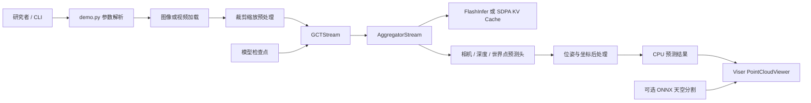
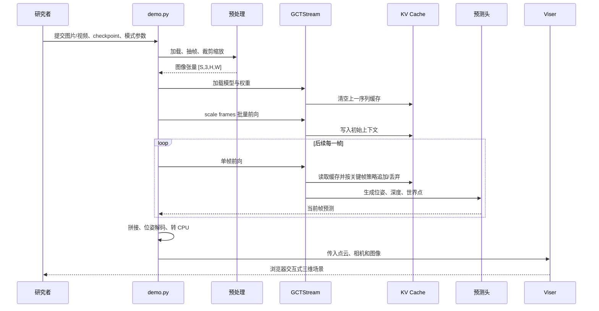
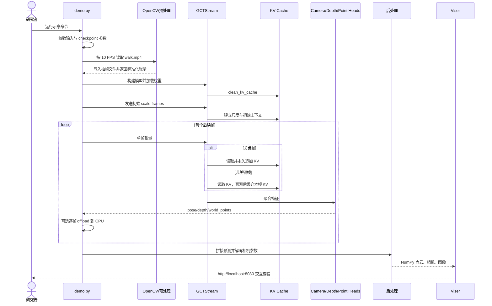

# Robbyant/lingbot-map 项目深度解析

## 1. 项目概览

- 报告日期：2026-07-19
- 仓库地址：https://github.com/Robbyant/lingbot-map
- Trending 原始排名：1
- Stars Today：831
- 项目定位：面向连续图像或视频的流式三维重建基础模型与演示管线。
- 解决的问题：传统多视图三维重建常需要积累一批图像后反复优化，长序列还容易带来显存增长和轨迹漂移；该项目尝试逐帧预测相机、深度与世界点，并用上下文缓存维持时序连续性。
- 目标用户：三维视觉、机器人、空间智能和长视频重建研究者，以及需要评估流式建图方案的工程团队。
- 当前成熟度：研究成果已公开代码、模型、示例和评测脚本，属于“研究可复现、工程早期可用”；尚不能据此直接判定为生产级 SLAM 或商业重建服务。
- 推荐结论：值得研究其流式 Transformer、关键帧 KV Cache 和长序列窗口策略；实际选型前必须用自己的相机、场景和 GPU 复测质量、吞吐与显存。

## 2. 系统架构

### 2.1 架构概览

项目以 `demo.py` 作为交互演示入口。输入可以是图片目录或视频：视频先经 OpenCV 按目标 FPS 抽帧，随后统一裁剪和缩放为模型张量。`GCTStream` 由流式特征聚合器 `AggregatorStream`、因果相机头以及深度/点云预测头组成；前若干帧作为 scale frames 一起处理，之后逐帧进入因果推理。FlashInfer 分页 KV Cache 是默认后端，PyTorch SDPA 是显式备用路径。预测结果经位姿解码、坐标系求逆和 CPU 转移后，交给 Viser 浏览器查看器；天空遮罩是可选的 ONNX 后处理。

### 2.2 核心模块

| 模块 | 职责 | 代码位置 | 关键依赖 | 证据级别 |
|---|---|---|---|---|
| CLI 与演示编排 | 解析输入、推理模式、缓存和可视化参数，串起整条流程 | `demo.py::main` | argparse、PyTorch、OpenCV | High |
| 输入加载与预处理 | 视频抽帧、图片排序、stride/rotation、统一 crop/resize | `demo.py::load_images`、`lingbot_map/utils/load_fn.py` | OpenCV、Pillow | High |
| 模型构建与权重加载 | 按 streaming/windowed 模式实例化模型并载入 checkpoint | `demo.py::load_model` | PyTorch | High |
| 流式模型 | 组织聚合器、相机头和各预测头 | `lingbot_map/models/gct_stream.py::GCTStream` | `GCTBase`、`AggregatorStream` | High |
| 上下文聚合与缓存 | 对 scale frames 和后续帧执行因果注意力，维护 KV 状态 | `lingbot_map/aggregator/stream.py`、`gct_stream.py::inference_streaming` | FlashInfer 或 SDPA | High |
| 关键帧控制 | 非关键帧参与当前预测但不永久追加到 KV Cache | `GCTStream::_set_skip_append`、`inference_streaming` | KV Cache Manager | High |
| 后处理 | 将 pose encoding 解成内外参、转换 w2c/c2w、搬到 CPU | `demo.py::postprocess` | `pose_enc`、SE(3) 工具 | High |
| 三维查看器 | 将结果转 NumPy，在浏览器展示点云和相机 | `lingbot_map/vis`、`demo.py` 尾部 | Viser、Trimesh | High |
| 天空遮罩 | 下载并执行天空分割模型，过滤室外天空点 | README 与 `lingbot_map/vis` 路径 | ONNX Runtime | Medium |

### 2.3 数据与状态管理

- 输入状态：图片路径列表，或从视频抽取后写入 `<video_name>_frames/` 的 JPEG 文件。
- 模型状态：checkpoint 权重加载到 `GCTStream`；聚合器可转为 BF16/FP16，预测头保留 FP32 路径。
- 序列状态：每条新序列开始前调用 `clean_kv_cache()`；scale frames、关键帧和特殊 token 构成持续上下文。
- 临时状态：每帧预测含 `pose_enc`、`depth`、`depth_conf`、`world_points`、`world_points_conf`；长序列可逐帧 offload 到 CPU。
- 输出状态：预测张量拼接后转换为相机外参/内参和 NumPy 数据供查看器使用。默认演示路径没有数据库或服务端持久化。

### 2.4 外部集成与协议

- Hugging Face / ModelScope：下载模型权重和演示数据。
- FlashInfer：默认分页 KV Cache 注意力后端。
- PyTorch SDPA：通过 `--use_sdpa` 显式选择的备用后端。
- Viser：在本机端口提供浏览器三维查看器。
- ONNX Runtime：可选天空分割。
- 没有证据显示该仓库自带 REST、gRPC、消息队列或远程数据库服务。

### 2.5 部署与运行形态

主要是单机 Python/CUDA 程序：研究者在 Conda/Python 环境安装项目和权重，通过 CLI 运行；可视化服务器只用于本机浏览器查看。离线批量渲染有独立 `demo_render` 管线，但仓库没有把模型包装成生产 API、Kubernetes 服务或多租户平台。

## 3. 主线流程

### 3.1 核心流程图

### 3.2 关键步骤

1. `main()` 校验必须提供 `--image_folder` 或 `--video_path`，并要求 `--model_path`。
2. `load_images()` 对视频按 FPS 抽帧，或收集图片；随后调用统一预处理函数生成模型张量。
3. `load_model()` 根据模式载入 `GCTStream` 或窗口版实现，并用 `strict=False` 载入权重，同时打印缺失/意外键。
4. 若未指定关键帧间隔，超过 320 帧的 streaming 模式按帧数自动计算间隔，限制 KV 增长。
5. `inference_streaming()` 先清空缓存，再批量处理 scale frames，之后逐帧因果推理。
6. 非关键帧暂时设置 `_skip_append=True`：它能读取缓存并产生完整预测，但本帧 KV 不保留。
7. 所有预测沿序列维度拼接；开启 CPU offload 时，缓存和 GPU 临时张量及时释放。
8. `postprocess()` 解码内外参并将 w2c 逆变换为 c2w；最后启动 Viser。

### 3.3 异常与失败处理

- 输入缺失：CLI 断言直接终止，并要求图片目录或视频路径。
- checkpoint 不匹配：使用 `strict=False` 加载并打印 missing/unexpected keys；这避免立即崩溃，但可能造成质量异常，不能忽略日志。
- FlashInfer 不可用：README 提供 `--use_sdpa` 路径；代码并非所有情况下自动切换，运行者应主动选择。
- 显存不足：可增加 `--keyframe_interval`、使用 `--mode windowed`、启用 `--offload_to_cpu` 或降低相机迭代次数。
- Viser 未安装：捕获 `ImportError`，不启动查看器，仅打印预测键；推理结果并未被伪装成可视化成功。
- 超长轨迹或域外场景：README 明确提示可能出现 pose collapse，需要窗口模式或重新设定缓存策略；没有自动保证闭环成功。

## 4. 典型业务场景端到端执行链路

### 4.1 场景定义

| 项目 | 内容 |
|---|---|
| 场景名称 | 研究者将一段步行视频重建为可在浏览器查看的三维点云 |
| 参与者 | 研究者、`demo.py`、OpenCV/Pillow 预处理、`GCTStream`、KV Cache、预测头、Viser |
| 前置条件 | Python 3.10+、PyTorch/CUDA、项目依赖、已下载 checkpoint；可视化需安装 `lingbot-map[vis]` |
| 输入 | **示意**：`python demo.py --video_path walk.mp4 --fps 10 --model_path /models/lingbot-map-long.pt --mode streaming --offload_to_cpu` |
| 期望结果 | 视频被抽帧，模型逐帧生成相机轨迹、深度和世界点，浏览器显示可交互点云 |
| 成功判定 | CLI 完成推理和后处理；预测包含完整帧序列；Viser 在本机端口可打开并看到相机/点云，而不是仅“进程没报错” |

### 4.2 端到端时序图

### 4.3 执行步骤追踪

| 步骤 | 输入 | 执行组件 | 关键代码位置 | 状态或数据变化 | 输出 | 失败分支 | 证据级别 |
|---:|---|---|---|---|---|---|---|
| 1 | CLI 参数 | `demo.py::main` | `demo.py` 参数定义与断言 | 形成运行配置 | `args` | 无图片/视频或无模型路径则终止 | High |
| 2 | `walk.mp4`、FPS | `load_images` | `demo.py:load_images` | 写入抽帧 JPEG，建立路径列表 | 图片路径 | 视频打不开或零帧导致后续无有效输入 | High |
| 3 | 图片路径 | 预处理函数 | `lingbot_map/utils/load_fn.py` | 裁剪、缩放、归一化 | `[S,3,H,W]` 张量 | 不支持格式、损坏图片或尺寸异常 | High |
| 4 | checkpoint 与模型参数 | `load_model` | `demo.py:load_model` | 建立模型并载入权重 | eval 模型 | missing/unexpected keys 被打印，质量可能降级 | High |
| 5 | 完整帧数 | `main` | 自动关键帧逻辑 | 若 `S>320`，设置间隔以约束 KV | `keyframe_interval` | 参数过激可能损失长程细节 | High |
| 6 | 初始帧 | `GCTStream.inference_streaming` | `gct_stream.py` Phase 1 | 清缓存并写入 scale frame KV | 初始预测与上下文 | GPU OOM 或后端不兼容 | High |
| 7 | 单帧 | Aggregator + KV | `inference_streaming` Phase 2、`_set_skip_append` | 关键帧追加 KV；非关键帧不持久化 | 每帧预测 | OOM 时可 offload/windowed；异常向上抛出 | High |
| 8 | pose/depth/points 列表 | 拼接与 `postprocess` | `gct_stream.py` 尾部、`demo.py::postprocess` | 合并序列、解码内外参、转 c2w/CPU | 结构化预测 | 张量形状或数值异常会使后处理失败 | High |
| 9 | 预测与图像 | `PointCloudViewer` | `demo.py` 可视化段 | 转 NumPy，启动本机查看器 | 浏览器点云 | Viser 缺失则仅打印预测键，不启动 UI | High |

### 4.4 关键状态与数据变化

- 磁盘：视频输入会生成抽帧目录；启用天空遮罩还可能缓存 mask。
- GPU：模型权重、scale frames、当前帧和 KV Cache 占用显存；非关键帧不永久扩张 KV。
- CPU：启用 offload 后，每帧预测逐步移至 CPU，降低长序列峰值显存。
- 序列：`pose_enc/depth/world_points` 从分块列表最终拼成完整时间轴。
- 可视化：相机参数由编码解出并转换坐标系，随后与点云一起交给 Viser。

### 4.5 失败传播、重试与回滚

该演示没有事务式回滚。输入或模型加载失败会直接终止；单帧推理异常也会中断整条序列。显存或长序列问题的“重试”主要由操作者调整参数后重新运行：加大关键帧间隔、启用 CPU offload、改用 windowed、降低输入 FPS 或图像规模。Viser 缺失属于可降级失败：模型结果仍被保留在内存并打印键名，但用户没有得到交互式三维页面。

### 4.6 最终业务结果

用户最终得到的不是一张普通图片，而是一组带时间顺序的相机轨迹、深度、置信度和世界点云，并可在浏览器中旋转、缩放和检查。成功意味着整条视频在同一尺度和上下文中被处理，且输出可被查看或进入后续渲染，而不只是模型完成了一次前向调用。

### 4.7 最小复现与验证方法

1. 按 README 创建 Python 3.10 环境，安装项目与推荐 PyTorch。
2. 下载官方 checkpoint 和 `example/courthouse` 数据。
3. 运行官方最小示例：`python demo.py --model_path /path/to/lingbot-map-long.pt --image_folder example/courthouse --mask_sky`。
4. 记录总帧数、推理耗时、GPU 峰值和查看器结果。
5. 再以同一序列分别测试 `--use_sdpa`、`--keyframe_interval 2`、`--offload_to_cpu`，比较显存、速度和轨迹/点云变化。
6. 对性能和质量主张，应使用仓库 benchmark 脚本和自己的硬件重复评测，不以 README 数字代替验证。

## 5. 技术栈

| 层次 | 技术 | 用途 | 是否核心 | 证据位置 |
|---|---|---|---|---|
| 语言与运行时 | Python 3.10+ | CLI、模型和数据处理 | 是 | `pyproject.toml` |
| 深度学习 | PyTorch | 模型构建、权重、张量与推理 | 是 | `demo.py`、模型源码 |
| 模型架构 | Geometric Context Transformer | 融合空间与长程时序上下文 | 是 | README、`gct_stream.py` |
| 注意力后端 | FlashInfer / SDPA | 分页 KV 或原生注意力 | 是 | README、`_build_aggregator` |
| 视觉输入 | OpenCV、Pillow | 视频抽帧、图像变换 | 是 | `demo.py` |
| 状态与缓存 | 内存 KV Cache、CPU offload、文件抽帧 | 长序列上下文和资源控制 | 是 | `inference_streaming` |
| 可视化 | Viser、Trimesh | 浏览器点云查看 | 否，但演示关键 | optional deps、`demo.py` |
| 辅助模型 | ONNX Runtime | 天空分割遮罩 | 否 | README、optional deps |
| 构建发布 | setuptools | Python 包构建 | 否 | `pyproject.toml` |

## 6. 创新点

### 创新点 1

- 类型：架构创新
- 传统方案：批量收集多帧后做迭代式全局优化，长视频成本随序列增长。
- 当前方案：前馈式流模型，以 scale frames 建立初始上下文，后续逐帧使用因果注意力和轨迹记忆。
- 实际收益：能更早输出结果，并为在线或长序列处理提供清晰计算路径。
- 证据：README 架构说明、`GCTStream.inference_streaming`。
- 局限：前馈推理不等于自动消除累计漂移，域外距离和闭环质量仍受训练与缓存策略约束。

### 创新点 2

- 类型：性能创新
- 传统方案：每帧都把 KV 永久加入缓存，序列越长显存增长越明显。
- 当前方案：关键帧永久入缓存，非关键帧只临时参与当前注意力；同时支持分页 KV 与逐帧 CPU offload。
- 实际收益：缓存增长约随关键帧间隔下降，并能把长序列预测搬出 GPU。
- 证据：`_set_skip_append`、`inference_streaming` 注释和实现。
- 局限：缓存更少可能牺牲细节与长期一致性；性能数字尚未在本报告环境独立复测。

### 创新点 3

- 类型：工程整合创新
- 传统方案：模型推理、视频处理、坐标转换和点云可视化常需自行拼装。
- 当前方案：仓库用一个 CLI 串起抽帧、推理、后处理、天空过滤和 Viser。
- 实际收益：研究者能快速从数据走到可查看结果，降低验证门槛。
- 证据：`demo.py` 与 README Quick Start。
- 局限：这是研究演示管线，不是带队列、持久化、权限和 SLA 的生产服务。

## 7. 应用场景

### 适合

- 流式三维重建算法研究与复现。
- 机器人、移动相机和长视频的空间建模实验。
- 比较 FlashInfer、SDPA、关键帧和窗口推理策略。
- 生成可视化点云供人工质检。

### 可以尝试

- 在特定室内/室外数据集上做离线地图生成。
- 作为机器人感知原型中的一环，但需补实时输入适配、时间同步和鲁棒性评测。
- 结合自有后端保存点云、轨迹和任务状态。

### 暂不建议

- 未经评测直接替换成熟生产 SLAM。
- 低功耗、无 CUDA 或严苛实时设备直接部署。
- 仅凭官方基准承诺商业质量、绝对尺度或长期无漂移。

## 8. 第一次阅读与验证建议

1. 先读 README 的架构、Quick Start、keyframe、windowed 和 performance 部分。
2. 再沿 `demo.py::main -> load_images -> load_model -> inference_streaming -> postprocess` 读主链路。
3. 深入查看 `gct_stream.py` 的缓存管理和 `AggregatorStream` 注意力实现。
4. 用官方 courthouse 小样本跑通 Viser，再逐项改变关键帧、后端和 offload 参数。
5. 用 benchmark 目录复测质量和性能，记录硬件、分辨率、帧数与版本。

## 9. 风险与限制

- 安全：模型和数据下载来自外部站点；checkpoint 使用 `torch.load(..., weights_only=False)`，应只加载可信来源文件。
- 性能：约 20 FPS、长序列规模和 SOTA 均为维护者披露；实际取决于 GPU、分辨率、后端和参数。
- 许可证：代码标注 Apache-2.0；模型权重、第三方数据和依赖仍需分别核实许可。
- 维护状态：2026 年仍有 bug 修复和 benchmark 更新，活跃度较好，但属于研究项目。
- 生产可用性：缺少正式服务接口、任务持久化、访问控制和生产 SLA。

## 10. Evidence Notes

- 直接源码证据：`demo.py`、`lingbot_map/models/gct_stream.py`、`pyproject.toml`。
- 官方资料证据：仓库 README、项目网站、模型与 benchmark 链接。
- 已确认：输入预处理、模型选择、关键帧缓存行为、输出字段、后处理、Viser 降级路径。
- 仅维护者自述：实时帧率、超长序列能力和基准领先程度。
- 未发现：数据库、消息队列、微服务编排或生产 API。

## 11. Honest Caveat

本报告是对当前 `main` 分支代码和官方资料的静态追踪，没有下载权重、运行 CUDA 推理，也没有复现论文指标。架构链路可信，但重建质量、绝对尺度、闭环漂移、显存和帧率必须在目标数据与硬件上重新验证。

## 12. 可信度

- Architecture Confidence: High
- Flow Confidence: High
- Innovation Confidence: Medium
