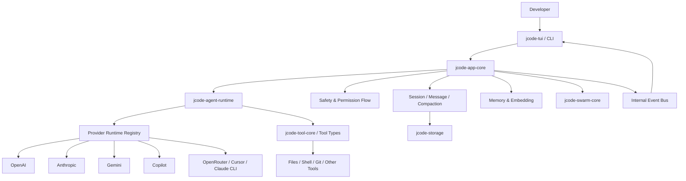
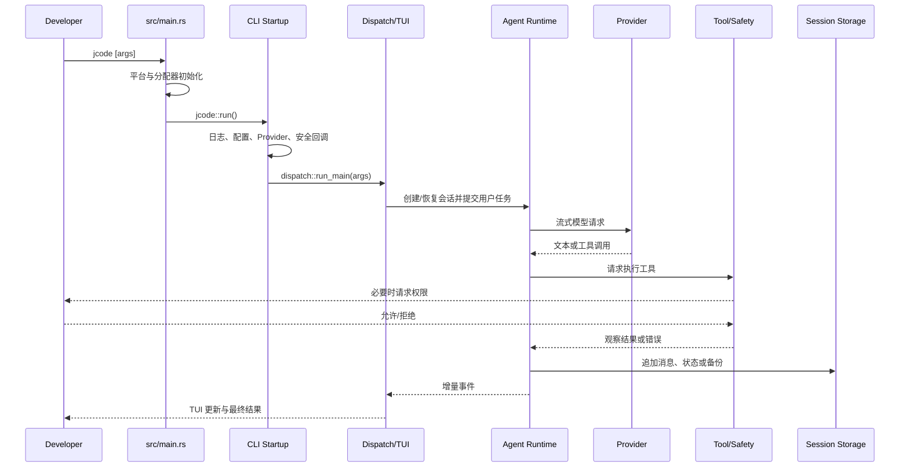
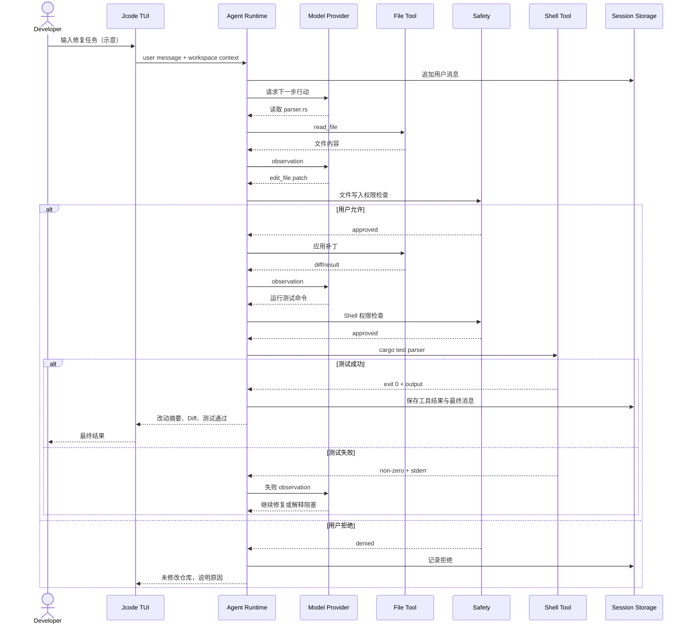

# 1jehuang/jcode 项目深度解析

## 1. 项目概览

- 报告日期：2026-07-20
- 仓库地址：https://github.com/1jehuang/jcode
- Trending 原始排名：10
- Stars Today：235
- 项目定位：用 Rust 构建的多模型终端编码 Agent 运行时与高密度 TUI。
- 解决的问题：把模型接入、工具执行、会话、记忆、安全审批、终端交互和多 Agent 协作统一到一个长期运行的开发环境。
- 目标用户：终端重度开发者、需要比较多个模型供应商的工程师、研究编码 Agent 架构的团队。
- 当前成熟度：早期可用且功能丰富，版本迭代快；大型 Rust 工作区和多 Provider 适配意味着较高维护复杂度。
- 推荐结论：适合源码研究、个人开发和受控仓库试用；在关键生产仓库中使用前，应验证权限策略、会话恢复和供应商凭据边界。

## 2. 系统架构

### 2.1 架构概览

Jcode 不是单一 CLI 文件，而是一个拥有大量 workspace crates 的分层系统。根二进制 `src/main.rs` 负责平台级启动、内存分配器和 Tokio Runtime；`src/lib.rs` 把入口交给 `cli::startup::run()`。启动组合根在 `src/cli/startup.rs` 注册外部 Provider Runtime、权限通知、技能到记忆的适配器、服务器重启和配置热加载回调，随后把参数交给 CLI Dispatch。表示层位于 `jcode-tui`，应用编排位于 `jcode-app-core`，基础会话、Provider、工具、安全和存储能力位于 `jcode-base` 及独立叶子 crate。

### 2.2 架构图

### 2.3 核心模块

| 模块 | 职责 | 代码位置 | 关键依赖 | 证据级别 |
|---|---|---|---|---|
| 平台入口 | 分配器调优、平台特殊入口、Tokio Runtime | `src/main.rs` | Tokio、rustls、jemalloc 可选 | High |
| CLI 组合根 | 初始化日志、配置回调、Provider、安全通知和 Dispatch | `src/cli/startup.rs` | Clap、内部注册表 | High |
| 表示层 | 终端 UI、输入、渲染、会话选择器 | `crates/jcode-tui*` | Ratatui、Crossterm | High |
| 应用核心 | 会话编排、服务器、任务和跨模块协调 | `crates/jcode-app-core` | jcode-base、内部 Bus | High |
| Agent Runtime | 模型循环、工具调用和运行状态 | `crates/jcode-agent-runtime` | Provider、Tool、Message Types | Medium |
| Provider 层 | 多模型供应商适配与外部 CLI Runtime | `crates/jcode-provider-*` | Reqwest、WebSocket、OAuth | High |
| 工具与安全 | 工具类型、执行和权限请求 | `crates/jcode-tool-*`、`docs/SAFETY_SYSTEM.md` | 文件系统、进程、通知 | Medium |
| 会话与存储 | Transcript、备份、恢复和列表缓存 | `crates/jcode-session-types`、`jcode-storage` | 文件系统/序列化 | Medium |
| 记忆与 Embedding | 长期记忆、语义召回与本地 Embedding | `crates/jcode-memory-types`、`jcode-embedding` | ONNX/本地模型（功能开关） | Medium |
| Swarm | 多 Agent 协作与任务协调 | `crates/jcode-swarm-core` | Task、Session、Runtime | Medium |

### 2.4 数据与状态管理

Jcode 将配置、会话 transcript、恢复备份、日志、记忆和模型凭据分别管理。启动阶段会清理过期内存日志和会话 `.bak` 文件，但明确不删除 transcript。配置重载会使认证状态缓存失效，并通过全局 Bus 发布模型更新事件。默认 Feature 启用 Embedding、PDF 与 Bedrock；本地 Embedding 模型可能显著增加内存，代码因此对 jemalloc 和 glibc 分配器做了专门调优。

### 2.5 外部集成与协议

- 多 Provider：Gemini、Anthropic、OpenAI、Copilot、OpenRouter、Cursor、Claude CLI 等。
- HTTP/WebSocket：模型流式响应与外部服务通信。
- ACP/Server：仓库包含 ACP 和服务运行路径，但不同入口需要分别验证。
- 操作系统：文件系统、Shell、终端、全局快捷键和平台特定 API。
- 通知与权限：安全层产生权限请求，由启动组合根注册的通知 Dispatcher 交付。

### 2.6 部署与运行形态

主要形态是本地单二进制终端应用，也包含服务器、桌面和辅助二进制。Rust workspace 很大，源码构建成本高；发布构建可通过 Feature 选择本地 Embedding、Bedrock 和 jemalloc。系统需要访问用户代码、Shell 和供应商凭据，因此运行边界应尽量限制在受控工作目录。

## 3. 主线流程

### 3.1 核心流程图

### 3.2 关键步骤

1. `src/main.rs` 配置系统分配器、TLS Provider 和 Tokio 多线程 Runtime。
2. `src/lib.rs` 调用 `cli::startup::run()`。
3. 启动组合根初始化日志和后台清理，注册 Provider Runtime、权限通知、配置更新和服务器重启回调。
4. CLI 参数解析后进入 `dispatch::run_main(args)`，根据命令进入交互 TUI、服务器或其他模式。
5. 交互路径创建或恢复会话，将用户消息送入 Agent Runtime。
6. Provider 返回文本或工具调用；工具层在敏感操作前进入安全审批。
7. 工具结果作为 observation 回到模型循环，消息和会话状态持续保存并推送到 TUI。

### 3.3 异常与失败处理

- 启动错误由 `report_main_error` 输出并返回非零错误。
- Windows 主线程使用独立 8 MiB 栈，避免 Provider 初始化路径栈溢出。
- 平台分配器参数非法时回退默认值，避免启动崩溃。
- Provider 构造允许 fallible 注册；例如 Copilot 无令牌时不会伪造可用状态。
- 权限拒绝应作为工具失败返回 Agent，而不是绕过安全层。
- 会话 `.bak` 用于恢复，清理只针对过期备份，不直接删除正式 transcript。

## 4. 典型业务场景端到端执行链路

### 4.1 场景定义

| 项目 | 内容 |
|---|---|
| 场景名称 | 开发者要求 Jcode 修改一个 Rust 文件并运行目标测试 |
| 参与者 | 开发者、Jcode TUI、Agent Runtime、模型 Provider、文件工具、Shell 工具、安全审批、会话存储 |
| 前置条件 | 已配置至少一个可用 Provider；当前目录是 Git 仓库；用户拥有读写和测试权限 |
| 输入 | **示意**：`修复 parser.rs 的空输入崩溃，并运行相关单元测试` |
| 期望结果 | Jcode 检查代码、编辑文件、执行测试并向用户说明改动与测试结果 |
| 成功判定 | 目标文件产生可审查 Diff；相关测试命令成功；会话记录包含工具调用和结果 |

### 4.2 端到端时序图

### 4.3 执行步骤追踪

| 步骤 | 输入 | 执行组件 | 关键代码位置 | 状态或数据变化 | 输出 | 失败分支 | 证据级别 |
|---:|---|---|---|---|---|---|---|
| 1 | CLI 参数 | 平台入口 | `src/main.rs` | 创建 Runtime；设置分配器与 TLS | 进入异步主流程 | Runtime/平台初始化失败 | High |
| 2 | Args、配置 | CLI Startup | `src/cli/startup.rs` | 注册 Provider、安全和回调 | Dispatch Ready | 参数或配置错误 | High |
| 3 | 用户任务 | TUI / App Core | `crates/jcode-tui`、`jcode-app-core` | 创建/恢复会话，追加消息 | Agent 输入 | 会话恢复失败 | Medium |
| 4 | 上下文 | Agent Runtime | `crates/jcode-agent-runtime` | 维护本轮模型/工具状态 | Provider 请求 | 上下文过长或 Provider 不可用 | Medium |
| 5 | 模型请求 | Provider Runtime | `crates/jcode-provider-*` | 流式响应状态 | 文本/工具调用 | 认证、限流、网络错误 | High |
| 6 | 文件编辑意图 | Safety + Tool | `jcode-tool-*`、Safety 模块 | 权限请求；批准后文件改变 | Diff/工具结果 | 用户拒绝或补丁冲突 | Medium |
| 7 | 测试命令 | Shell Tool | 工具执行模块 | 子进程运行，仓库可能生成构建产物 | exit code/stdout/stderr | 超时、命令失败、权限拒绝 | Medium |
| 8 | 所有消息 | Session Storage | `jcode-session-types`、`jcode-storage` | transcript/备份更新 | 可恢复会话 | 写盘失败保留运行时错误 | Medium |

### 4.4 关键状态与数据变化

- 会话从“用户消息已记录”进入“模型思考/工具执行/等待权限/完成或失败”等状态。
- 文件工具批准后修改工作区；拒绝则不得产生预期文件变更。
- Shell 测试会产生构建缓存和测试输出，Jcode 只报告结果，不等于自动提交 Git。
- Transcript 与恢复备份持续更新，便于重启后恢复上下文。
- Provider 凭据和模型目录缓存会随配置热加载失效或刷新。

### 4.5 失败传播、重试与回滚

Provider 的认证、限流和网络失败会回到 Agent/App 层，由 UI 呈现或切换 Provider。文件补丁失败可让模型重新读取后再生成新补丁；Shell 测试失败会作为 observation 驱动下一轮修复。系统没有证据表明所有文件操作都自动事务回滚，因此执行前应使用 Git 分支或 Worktree。用户拒绝权限是明确终止该工具路径的安全分支。

### 4.6 最终业务结果

成功时，开发者得到可审查的代码改动、测试命令和真实退出结果，并能在同一会话继续追问。失败时，至少应知道卡在 Provider、权限、补丁还是测试，而不是只得到一句“任务没完成”。

### 4.7 最小复现与验证方法

1. 使用发布二进制或按仓库说明构建 Jcode，并配置一个测试 Provider。
2. 在临时 Git 仓库创建一个有失败测试的小 Rust 项目。
3. 输入上述**示意**任务，观察读文件、写文件和 Shell 是否分别触发正确权限策略。
4. 首次拒绝写权限，确认文件不变；第二次允许后检查 Diff。
5. 人为让测试失败，验证错误输出能回到下一轮而不是被吞掉。
6. 退出并恢复会话，检查 transcript 和状态是否连续。

## 5. 技术栈

| 层次 | 技术 | 用途 | 是否核心 | 证据位置 |
|---|---|---|---|---|
| 语言与运行时 | Rust 2024 / Tokio | CLI、异步 Agent 与工具运行 | 是 | `Cargo.toml`、`src/main.rs` |
| TUI | Ratatui / Crossterm | 终端交互与流式渲染 | 是 | `jcode-tui*` |
| Provider 通信 | Reqwest / WebSocket / rustls | 模型 API 与流式传输 | 是 | `Cargo.toml`、Provider crates |
| 模块化 | Cargo Workspace | 隔离 TUI、核心、Provider、工具和类型 | 是 | `Cargo.toml` |
| 数据与状态 | 文件会话、备份、内部 Storage | 会话恢复与配置 | 是 | session/storage crates |
| AI 能力 | 多模型、工具调用、Embedding、Memory | Agent 决策与召回 | 是/可选 | runtime、embedding、memory crates |
| 协作 | Swarm / Task Types | 多 Agent 任务协调 | 可选核心 | `jcode-swarm-core` |
| 安全 | Permission Notifier / Safety | 敏感工具审批 | 是 | startup 注册与 Safety 文档 |

## 6. 创新点

### 创新点 1

- 类型：架构创新
- 传统方案：编码 Agent 作为单 crate/单进程脚本，Provider、UI 和工具高度耦合。
- 当前方案：用大量细分 crate 分离表示层、应用核心、Provider Runtime、工具类型、记忆、协议和 Swarm。
- 实际收益：特定 Provider 或 UI 修改不必重编整个核心依赖链，模块职责更易定位。
- 证据：`Cargo.toml` workspace 和 `src/lib.rs` 的层级说明。
- 局限：crate 数量多，理解、构建和发布矩阵复杂。

### 创新点 2

- 类型：工程整合创新
- 传统方案：每个模型供应商和外部 CLI 独立配置、独立交互。
- 当前方案：在启动组合根注册多个 Provider Runtime，并通过统一 Agent/TUI 使用。
- 实际收益：可在同一终端工作流比较和切换模型，同时复用会话、工具和安全层。
- 证据：`src/cli/startup.rs` Provider 注册。
- 局限：供应商接口变化、认证方式和使用条款会持续制造维护成本。

## 7. 应用场景

### 适合

- 终端重度开发者的多模型编码工作流。
- 研究 Agent Runtime、TUI、Provider 抽象和会话架构。
- 在临时分支或 Worktree 中处理可回滚代码任务。

### 可以尝试

- 团队内部模型路由和供应商比较。
- 多 Agent/Swarm 的复杂任务实验。
- 远程服务器或 ACP 接入，但需单独审查权限。

### 暂不建议

- 未配置审批和版本控制保护的关键生产仓库。
- 把维护者基准直接当作团队性能结论。
- 不愿承担频繁升级和大型 Rust 工作区构建成本的轻量用户。

## 8. 第一次阅读与验证建议

1. 先读 README 和 `Cargo.toml`，理解 workspace 边界。
2. 从 `src/main.rs`、`src/lib.rs`、`src/cli/startup.rs` 跟踪启动组合。
3. 再按任务追踪 `jcode-agent-runtime`、Provider 和 Tool/Safety。
4. 在临时仓库验证“读取—修改—测试—拒绝权限—恢复会话”。
5. 最后再研究 Memory、Swarm、Server 和 Desktop 等扩展路径。

## 9. 风险与限制

- 安全：具备文件和 Shell 权限，模型错误可能直接改变工作区；必须保留审批、Git 备份和最小权限。
- 性能：默认 Feature、Embedding 和大型 TUI 依赖增加编译时间与内存；代码虽做分配器调优，仍需实测。
- 许可证：MIT，但外部模型、Provider CLI 和服务受各自条款约束。
- 维护状态：版本快速变化，文档、配置和会话格式可能迁移。
- 生产可用性：个人开发工具可用性较高；团队治理、审计和稳定升级流程需自行建设。

## 10. Evidence Notes

- 高置信证据：`Cargo.toml`、`src/main.rs`、`src/lib.rs`、`src/cli/startup.rs`。
- 中等置信证据：典型工具循环基于已确认模块边界与 Agent 常规调用链，本次未逐行打开每个 Tool 和 Session 实现。
- README 的“最智能”“最快”等主张未作为独立结论。

## 11. Honest Caveat

本报告未编译或运行 Jcode，也未验证任一模型 Provider 的实时认证。业务案例使用的指令、工具名和测试命令是**示意**，具体 UI 文案和审批粒度以当前版本为准。由于仓库迭代快，采用前应重新核对当前 Release 和安全文档。

## 12. 可信度

- Architecture Confidence: High
- Flow Confidence: Medium
- Innovation Confidence: Medium
