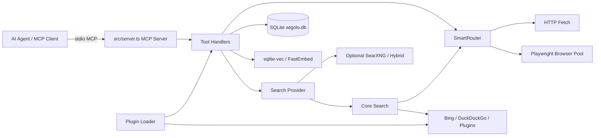
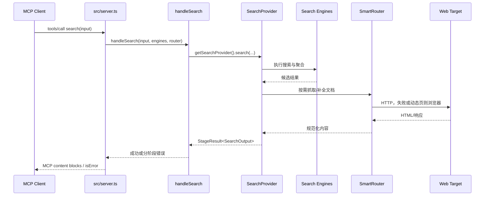
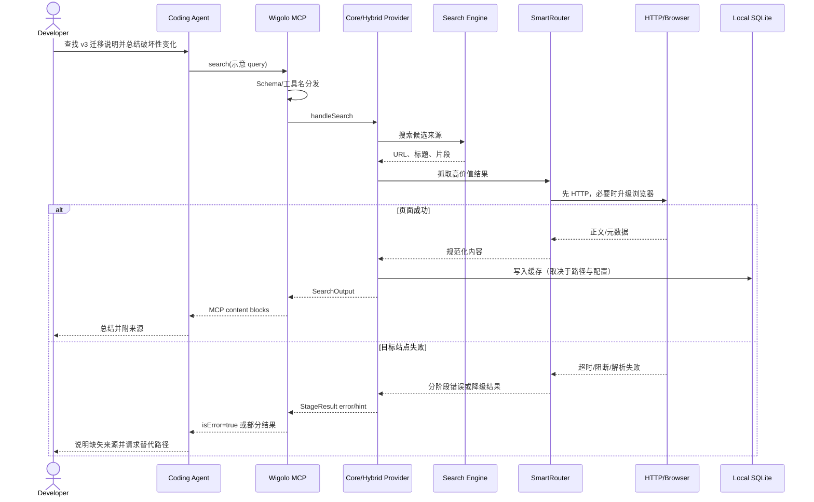

# KnockOutEZ/wigolo 项目深度解析

## 1. 项目概览

- 报告日期：2026-07-20
- 仓库地址：https://github.com/KnockOutEZ/wigolo
- Trending 原始排名：4
- Stars Today：595
- 项目定位：本地优先的网页智能 MCP 服务，为 AI 编码代理提供搜索、抓取、爬取、抽取、相似检索和研究工具。
- 解决的问题：Agent 需要可靠访问公开网页，但单一搜索 API 无法同时解决动态页面、正文抽取、缓存、失败降级、成本与隐私。
- 目标用户：使用 Claude Code、Codex、Cursor 等 Agent 的开发者，以及需要本地网页研究能力的工具作者。
- 当前成熟度：Public Beta，代码、测试和多种接入方式较完整，但仍在快速迭代。
- 推荐结论：适合本地 Agent 联网能力研究和开发环境使用；大规模生产爬取前需要单独评估合规、站点限制和资源占用。

## 2. 系统架构

### 2.1 架构概览

Wigolo 的主入口是 Node.js/TypeScript MCP Server。服务通过 stdio 接收 MCP 请求，在 `src/server.ts` 注册工具并把调用分发到各 `handle*` 函数。搜索路径由 Provider 层选择 `core`、`searxng` 或 `hybrid`，抓取路径由 `SmartRouter` 在轻量 HTTP 与 Playwright 浏览器池之间做路由。SQLite 数据库、sqlite-vec 与本地 Embedding 服务用于缓存和相似检索；插件加载器允许增加搜索引擎和抽取器。SearXNG 是显式选择的可选侧车，不会在默认路径中偷偷安装。

### 2.2 架构图

### 2.3 核心模块

| 模块 | 职责 | 代码位置 | 关键依赖 | 证据级别 |
|---|---|---|---|---|
| MCP Server | 初始化子系统、注册资源与工具、分发调用、处理退出 | `src/server.ts` | `@modelcontextprotocol/sdk` | High |
| 工具处理器 | 接收工具输入并委托搜索、抓取、抽取、研究等实现 | `src/tools/*.ts` | 类型定义、Router、Provider | High |
| Search Provider | 按配置选择 core、searxng 或 hybrid | `src/providers/search-provider.ts` | 动态 import、配置 | High |
| SmartRouter | 在 HTTP 和浏览器抓取路径之间选择与降级 | `src/fetch/router.ts` | HTTP Client、MultiBrowserPool | High |
| 浏览器池 | 管理多个 Playwright 浏览器实例与轮询选择 | `src/fetch/browser-pool.ts` | Playwright | High |
| 本地数据层 | 初始化 `wigolo.db`，保存缓存、监控和检索数据 | `src/cache/db.ts`、`src/server.ts` | better-sqlite3 | High |
| Embedding 服务 | 懒加载本地模型并提供向量检索 | `src/embedding/embed.ts` | FastEmbed、sqlite-vec | High |
| 插件系统 | 从用户目录加载搜索引擎与抽取器 | `src/plugins/loader.ts`、`registry.ts` | 动态模块加载 | High |
| 可选搜索侧车 | 连接外部、原生或 Docker SearXNG | `src/searxng/*` | SearXNG、Docker 可选 | High |

### 2.4 数据与状态管理

服务启动时创建配置数据目录，并在其中初始化 `wigolo.db`。Embedding 服务会配置向量存储，但模型在第一次需要嵌入或相似检索时才加载，以降低空闲内存。搜索 Provider 使用进程内缓存保存已解析的 Provider 实例；浏览器池、后端健康状态和插件注册表也由服务生命周期持有。`watch` 不依赖常驻守护进程，而是在其他工具调用时检查逾期任务，因此“定时”能力受服务活跃度影响。

### 2.5 外部集成与协议

- MCP stdio：默认接入 AI 编码代理。
- REST/SDK：仓库还提供其他客户端与守护进程路径，但本报告主线以 MCP 为准。
- 搜索后端：内置 Bing、DuckDuckGo 路径，可显式选择 SearXNG 或插件引擎。
- 网页访问：轻量 HTTP 与 Playwright 浏览器。
- LLM Sampling：`research`、`agent` 等工具可通过 MCP sampling 能力与模型协作。

### 2.6 部署与运行形态

默认通过 `npx wigolo` 或安装后的 `wigolo` 命令，以 stdio 子进程运行。需要 Node.js 20+。Playwright、SQLite 和本地向量依赖会增加安装体积；SearXNG 只有在用户配置或执行 warmup 后才启用。AGPL-3.0-only 对网络服务改造和分发有明确义务，企业集成前应由法务确认。

## 3. 主线流程

### 3.1 核心流程图

### 3.2 关键步骤

1. `startServer()` 初始化 SQLite、Embedding 服务、搜索引擎、浏览器池、Router、插件与后端状态。
2. `createMcpServer()` 注册 `search`、`fetch`、`crawl`、`cache`、`extract`、`find_similar`、`research`、`agent`、`diff`、`watch` 等工具。
3. MCP `CallToolRequest` 到达后，服务按名称转换输入类型并调用对应 Handler。
4. `handleSearch()` 保持薄层，只负责把依赖和请求交给配置选中的 Search Provider。
5. Provider 执行搜索、聚合和必要的抓取；SmartRouter 根据页面情况使用 HTTP 或浏览器。
6. 返回值统一包装为 MCP 文本或内容块；失败时携带 `error_reason`、`stage` 与可选 `hint`。

### 3.3 异常与失败处理

- 未知工具直接返回 `isError: true`。
- Handler 使用 `StageResult` 区分成功和分阶段失败，错误不会伪装成正常结果。
- Embedding 初始化失败会记录警告，`find_similar` 可在没有 Embedding 路径时降级。
- SearXNG 未安装或不可用时标记后端不健康，并回退到核心搜索引擎，不隐式下载。
- 插件单项加载失败被收集并记录，不阻止其他插件与核心服务启动。
- 关闭时依次停止可选侧车、浏览器池、守护浏览器、Embedding 和数据库。

## 4. 典型业务场景端到端执行链路

### 4.1 场景定义

| 项目 | 内容 |
|---|---|
| 场景名称 | 编码 Agent 搜索某个库的最新迁移说明并抓取关键页面 |
| 参与者 | AI 编码代理、Wigolo MCP Server、Search Provider、搜索引擎、SmartRouter、目标网页 |
| 前置条件 | Node.js 20+；Wigolo 已配置为 MCP stdio 服务；机器可访问公开互联网 |
| 输入 | **示意**：`{"query":"library v3 migration guide","limit":5}` |
| 期望结果 | 返回带来源链接、摘要和必要正文的搜索结果，供 Agent 引用和判断 |
| 成功判定 | MCP 调用 `isError=false`，结果包含至少一个可访问来源；动态页面可被浏览器路径补全 |

### 4.2 端到端时序图

### 4.3 执行步骤追踪

| 步骤 | 输入 | 执行组件 | 关键代码位置 | 状态或数据变化 | 输出 | 失败分支 | 证据级别 |
|---:|---|---|---|---|---|---|---|
| 1 | MCP search 请求 | MCP Server | `src/server.ts` CallTool handler | 无持久化；解析工具名与参数 | `SearchInput` | 未知工具返回错误 | High |
| 2 | `SearchInput` 与运行依赖 | `handleSearch` | `src/tools/search.ts` | 无；薄委托层 | Provider 调用 | Provider 解析失败 | High |
| 3 | 配置 `searchBackend` | Provider Selector | `src/providers/search-provider.ts` | 缓存 Provider 实例 | core/searxng/hybrid | 配置值未知时拒绝 | High |
| 4 | 查询字符串 | Search Provider / Engines | `src/search/core/*`、`src/search/engines/*` | 聚合候选结果 | URL 列表和片段 | 引擎失败或无结果 | Medium |
| 5 | 候选 URL | SmartRouter | `src/fetch/router.ts` | 浏览器池可能取得实例 | 网页内容 | HTTP 失败后浏览器降级，仍失败则错误 | High |
| 6 | HTML/响应 | 抽取与规范化管线 | `src/extraction/*` | 可写入本地缓存 | 清洗正文和元数据 | 解析器失败可换路径或保留片段 | Medium |
| 7 | SearchOutput | Server Response Builder | `src/server/search-response.ts` | 无 | MCP 内容块 | 数据含错误时标记 `isError` | High |

### 4.4 关键状态与数据变化

- 查询本身在内存中穿过 MCP、Handler 和 Provider。
- 抓取结果可能进入 SQLite 缓存；是否写入取决于具体工具和配置，不能把所有搜索都假定为持久化。
- 浏览器池维护进程级实例状态；关闭服务时统一释放。
- Provider 选择在进程中缓存，配置变更后通常需要重启或测试重置。
- Embedding 模型采用懒加载，第一次相似检索会带来明显启动成本。

### 4.5 失败传播、重试与回滚

SmartRouter 可从轻量 HTTP 升级到浏览器抓取，这是主要的失败恢复路径。Search Provider 在 SearXNG 不可用时可回退核心引擎。失败最终以结构化 `stage`、`error_reason` 和 `hint` 返回 MCP Client。网页读取没有数据库事务式“回滚”；已写缓存需由缓存策略管理。目标站点封禁、验证码或法律限制不能靠重试硬闯。

### 4.6 最终业务结果

开发者得到的是 Agent 基于公开来源生成的迁移说明，而不是模型凭记忆猜答案。Wigolo 的实际价值在于把“搜索—抓取—正文抽取—失败说明”压进一个本地工具边界，Agent 可以继续引用、比较或执行下一步代码修改。

### 4.7 最小复现与验证方法

1. 在 Node.js 20+ 环境安装或以 `npx wigolo` 启动 MCP Server。
2. 在 MCP Client 中注册 stdio 命令，并确认能列出 `search` 与 `fetch` 工具。
3. 使用一个稳定公开文档站点执行上述**示意**查询。
4. 分别测试普通静态页面和需要 JavaScript 的页面，观察 Router 是否走不同路径。
5. 断开网络或配置不可用 SearXNG，确认错误或回退信息没有被吞掉。

## 5. 技术栈

| 层次 | 技术 | 用途 | 是否核心 | 证据位置 |
|---|---|---|---|---|
| 语言与运行时 | TypeScript / Node.js 20+ | MCP 服务和工具逻辑 | 是 | `package.json` |
| 协议 | Model Context Protocol stdio | Agent 工具接入 | 是 | `src/server.ts` |
| 网页访问 | HTTP Client / Playwright | 静态与动态页面抓取 | 是 | `src/fetch/*` |
| 数据与状态 | SQLite / better-sqlite3 | 缓存与任务状态 | 是 | `src/cache/*` |
| 向量检索 | sqlite-vec / FastEmbed | 相似页面和研究辅助 | 可选核心 | `src/embedding/*` |
| 搜索 | Bing、DuckDuckGo、SearXNG | 候选来源发现 | 是 | `src/search/*` |
| 插件 | 动态 Plugin Registry | 扩展搜索引擎与抽取器 | 否 | `src/plugins/*` |
| 测试 | Vitest | 单元、集成、E2E 与性能测试 | 工程保障 | `tests/*`、`package.json` |

## 6. 创新点

### 创新点 1

- 类型：工程整合创新
- 传统方案：Agent 直接调用单一付费搜索 API，再由模型处理短片段。
- 当前方案：把搜索、动态抓取、正文抽取、本地缓存、向量检索和研究工具统一为本地 MCP 服务。
- 实际收益：降低多工具拼接和按次 API 依赖，便于 Agent 在同一协议下连续研究。
- 证据：工具注册、Router、Provider、SQLite 和 Embedding 代码。
- 局限：本地机器承担浏览器、存储和模型资源，且站点合规问题仍需用户负责。

### 创新点 2

- 类型：架构创新
- 传统方案：搜索后端在启动时固定，或不可用时直接失败。
- 当前方案：Provider 层支持 core、searxng、hybrid，SearXNG 侧车采用显式启用和健康状态管理。
- 实际收益：默认路径轻量，可按需求升级，不在用户不知情时安装服务。
- 证据：`src/providers/search-provider.ts`、`src/server.ts`。
- 局限：多后端会增加配置、测试矩阵和行为差异。

## 7. 应用场景

### 适合

- 开发者本地为编码 Agent 增加网页搜索与抓取。
- 需要来源链接和正文证据的技术研究。
- 希望避免把浏览历史和缓存统一上传云服务的团队原型。

### 可以尝试

- 内部知识采集、变更监控与站点研究。
- 通过 REST/SDK 嵌入自研 Agent 平台。
- 使用自建 SearXNG 的受控网络环境。

### 暂不建议

- 未做流控、合规与容量设计的大规模商业爬虫。
- 把“本地优先”误解成自动绕过登录、验证码或站点条款。
- 不接受 AGPL 网络分发义务的闭源服务集成。

## 8. 第一次阅读与验证建议

1. 先读 README 的架构和工具表，再看 `package.json` 的运行依赖。
2. 从 `src/server.ts` 跟踪 MCP 注册和 CallTool 分发。
3. 继续读 `src/tools/search.ts`、`src/providers/search-provider.ts` 与 `src/fetch/router.ts`。
4. 运行静态页、动态页和失败页三个最小测试，不要只看正常响应。
5. 再评估 SQLite 数据、浏览器进程、Embedding 模型和 AGPL 边界。

## 9. 风险与限制

- 安全：Agent 可访问互联网和本地缓存，需防止提示注入、恶意页面、SSRF 与敏感信息落盘。
- 性能：浏览器和本地 Embedding 会占用内存与 CPU；“零查询成本”不等于零资源成本。
- 许可证：AGPL-3.0-only，网络服务修改和分发需谨慎评估。
- 维护状态：Public Beta，工具 Schema 和行为可能变化。
- 生产可用性：有测试和失败处理基础，但高并发、代理池、验证码和站点级合规仍需外部系统补齐。

## 10. Evidence Notes

- 高置信证据：`package.json`、`src/server.ts`、`src/tools/search.ts`、`src/providers/search-provider.ts`。
- 中等置信证据：具体 Core Search 内部排序和缓存写入路径未在本次逐行追踪全部分支。
- 性能和成本表述均按维护者资料处理，没有独立运行基准。

## 11. Honest Caveat

本报告是静态源码与官方文档分析，没有实际安装 Playwright、加载 Embedding 模型或对多个站点做稳定性压测。业务案例中的查询参数为**示意**。搜索结果质量、动态页面成功率和缓存收益仍需在目标网络与目标站点上复测。

## 12. 可信度

- Architecture Confidence: High
- Flow Confidence: High
- Innovation Confidence: Medium
