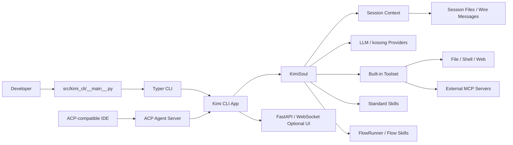
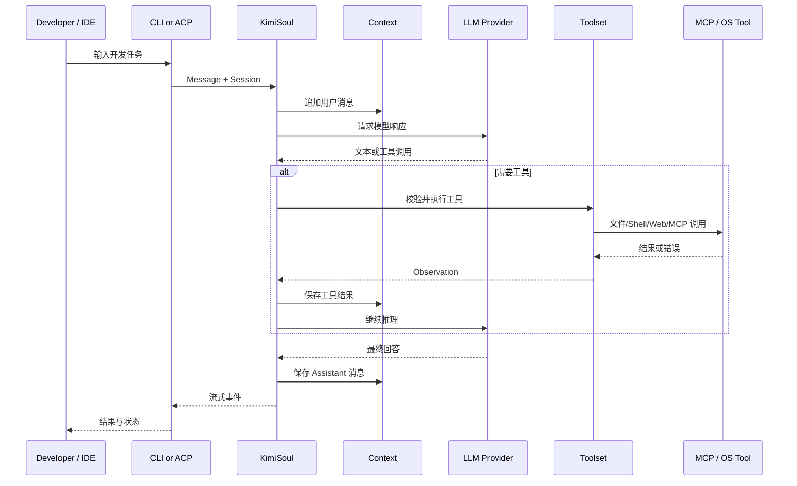
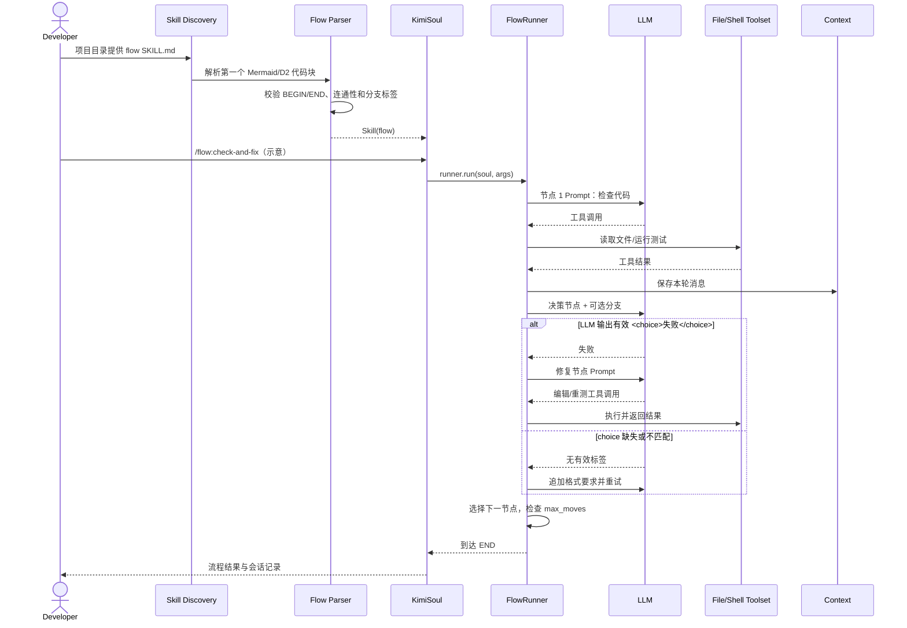

# MoonshotAI/kimi-cli 项目深度解析

## 1. 项目概览

- 报告日期：2026-07-20
- 仓库地址：https://github.com/MoonshotAI/kimi-cli
- Trending 原始排名：12
- Stars Today：410
- 项目定位：运行在终端中的 AI Agent，支持代码与 Shell 操作、网页工具、ACP 编辑器接入、MCP 工具扩展和流程型 Skill。
- 解决的问题：让开发者在终端或兼容 IDE 内持续完成代码、命令与信息检索任务，而不是在聊天窗口和工程环境之间反复搬运上下文。
- 目标用户：终端开发者、IDE Agent 集成者、希望用 MCP/ACP 扩展工作流的团队。
- 当前成熟度：已具备完整 CLI、协议和 SDK，但官方明确正在迁移到下一代 `Kimi Code CLI`，本仓库将逐步收缩。
- 推荐结论：适合研究现有 Agent 流程、ACP/MCP 集成和迁移设计；新项目应同时评估后继 Kimi Code CLI。

## 2. 系统架构

### 2.1 架构概览

Kimi CLI 是 Python 3.12+ 工作区。`src/kimi_cli/__main__.py` 安装崩溃处理、规范化代理环境并调用 Typer CLI。CLI 可进入交互终端、单次命令、ACP Agent Server、MCP 管理和 Web 服务等模式。核心 Agent 由 `KimiSoul`、上下文、模型 Provider、Toolset、Skill/Flow 和会话存储协作；`kosong` 提供模型通信抽象，`kaos/pykaos` 负责工具与环境能力。FastMCP 用于连接外部 MCP 工具，Agent Client Protocol 用于兼容编辑器。

### 2.2 架构图

### 2.3 核心模块

| 模块 | 职责 | 代码位置 | 关键依赖 | 证据级别 |
|---|---|---|---|---|
| CLI 入口 | 崩溃处理、代理环境、版本和 CLI 启动 | `src/kimi_cli/__main__.py` | Python、Telemetry | High |
| CLI 命令层 | 解析交互、ACP、MCP、配置等命令 | `src/kimi_cli/cli/*` | Typer | High |
| KimiSoul | Agent 循环、Slash Command、Skill 和 Flow 执行 | `src/kimi_cli/soul/kimisoul.py` | Context、Agent、Toolset | High |
| Toolset | 组合内置工具与外部 MCP 工具 | `src/kimi_cli/soul/toolset.py` | FastMCP、pykaos | Medium |
| 模型抽象 | Chat Provider、流式消息与工具调用 | `packages/kosong/*`、`src/kimi_cli/llm.py` | HTTP、Provider SDK | High |
| Agent Flow | 解析 Mermaid/D2 Skill，执行节点和分支 | `src/kimi_cli/skill/flow/*`、`kimisoul.py` | FlowRunner | High |
| 会话与 Wire | 保存会话消息、文件和协议事件 | `src/kimi_cli/wire/*`、Session 模块 | JSON/文件系统 | Medium |
| ACP | 作为 Agent Server 接入 Zed、JetBrains 等客户端 | CLI ACP 模块 | `agent-client-protocol` | High |
| MCP | 添加、鉴权和连接外部工具服务 | CLI MCP 模块、Toolset | FastMCP | High |
| Web 运行形态 | FastAPI、WebSocket 和独立 Worker | `src/kimi_cli/web/*` | FastAPI、Uvicorn | Medium |

### 2.4 数据与状态管理

会话、配置和技能主要保存在用户与项目目录的文件系统中。README 明确后继 Kimi Code CLI 会迁移现有配置和会话，说明这些状态是正式兼容对象。Agent 运行时在 Context 中维护消息和工具结果；FlowRunner 在同一 Session/Context 中逐节点推进。外部 MCP 服务器配置可持久化，也可以通过命令行传入临时配置文件。凭据可使用 Keyring 等依赖保存，但具体 Provider 的存储方式需分别核对。

### 2.5 外部集成与协议

- ACP：以 `kimi acp` 启动 Agent Server，供兼容 IDE 创建线程。
- MCP：支持 stdio、Streamable HTTP 与 OAuth 等外部服务配置。
- LLM Provider：通过 `kosong` 和具体 Provider 适配实现。
- 操作系统能力：文件读写、Shell、网页搜索和抓取。
- Web：FastAPI、Uvicorn 和 WebSocket 提供可选服务形态。

### 2.6 部署与运行形态

可从 Python 包安装或构建独立二进制，默认入口命令为 `kimi`/`kimi-cli`。交互式终端是主要形态；ACP 模式作为子进程 Agent Server；Web 模式使用 FastAPI。Python 要求 3.12+。当前仓库处于迁移阶段，部署前应确认是继续使用旧 CLI，还是直接采用 Kimi Code CLI。

## 3. 主线流程

### 3.1 核心流程图

### 3.2 关键步骤

1. `__main__.py` 在导入重模块前安装崩溃处理并规范化代理环境。
2. Typer CLI 根据参数进入交互、ACP、MCP 管理或其他模式。
3. 应用创建 Session Context、KimiSoul、LLM Provider 和 Toolset。
4. 用户消息追加到 Context，Agent 向模型请求下一步。
5. 工具调用经 Toolset 进入文件、Shell、Web 或外部 MCP 服务。
6. Observation 回写 Context，模型继续行动，直到产生最终回答或达到循环限制。
7. CLI、ACP 或 Web 层把增量事件和最终结果呈现给用户。

### 3.3 异常与失败处理

- 启动阶段异常由 Crash Handler 捕获并标注阶段。
- 找不到 Git Bash 等环境问题被转换为清晰错误和退出码 1。
- Flow 解析和验证分别抛出 `FlowParseError` 与 `FlowValidationError`。
- Flow 分支缺少 `<choice>` 或值不匹配时会追加格式提示重试。
- Flow 默认设置 `max_moves` 防止死循环，达到上限抛出 `MaxStepsReached`。
- MCP OAuth、网络和工具错误应作为工具结果回到 Agent；是否自动重试取决于工具和 Agent 策略。

## 4. 典型业务场景端到端执行链路

### 4.1 场景定义

| 项目 | 内容 |
|---|---|
| 场景名称 | 开发者运行一个流程型 Skill，完成代码检查并根据测试结果选择修复或结束 |
| 参与者 | 开发者、Kimi CLI、Skill Discovery、Flow Parser、FlowRunner、KimiSoul、LLM、文件/Shell 工具、Session Context |
| 前置条件 | 已登录可用模型；项目目录存在一个 `type: flow` 的 `SKILL.md`；流程有唯一 BEGIN/END 且可连通 |
| 输入 | **示意**：执行 `/flow:check-and-fix`，Flow 包含“检查代码→运行测试→通过/失败分支→修复或结束” |
| 期望结果 | Kimi 在同一会话依序执行节点，失败时进入修复分支，通过时抵达 END |
| 成功判定 | Flow 到达 END；Session 保存各节点消息与工具结果；测试成功或明确报告无法修复的原因 |

### 4.2 端到端时序图

### 4.3 执行步骤追踪

| 步骤 | 输入 | 执行组件 | 关键代码位置 | 状态或数据变化 | 输出 | 失败分支 | 证据级别 |
|---:|---|---|---|---|---|---|---|
| 1 | `SKILL.md` | Skill Discovery | `src/kimi_cli/skill/*` | 加载内置、用户或项目 Skill | Skill 元数据 | 文件缺失或元数据无效 | High |
| 2 | Mermaid/D2 代码块 | Flow Parser | `src/kimi_cli/skill/flow/*` | 构建 nodes/outgoing/begin/end | `Flow` | Parse/Validation Error | High |
| 3 | `/flow:name` | KimiSoul | `src/kimi_cli/soul/kimisoul.py` | 从实例级命令表找到 FlowRunner | 运行器调用 | 未发现命令则提示错误 | High |
| 4 | 当前节点 | FlowRunner | `kimisoul.py` | 维护 current node 与 move count | 节点 Prompt | 达到 max_moves 停止 | High |
| 5 | Prompt + Context | LLM/Agent | `KimiSoul`、`kosong` | 新增 Assistant/Tool 消息 | 文本或工具调用 | Provider/网络失败 | Medium |
| 6 | 工具调用 | Toolset | `src/kimi_cli/soul/toolset.py` | 文件或进程可能变化 | Observation | 权限、命令或 MCP 错误 | Medium |
| 7 | 决策回复 | FlowRunner | `_match_flow_edge` 设计与实现 | 解析最后一个 `<choice>` | 下一节点 ID | 缺失/不匹配则重试 | High |
| 8 | END | FlowRunner/KimiSoul | `kimisoul.py` | Flow 状态完成；Context 保留记录 | 用户可见结果 | 未连通在加载阶段已拒绝 | High |

### 4.4 关键状态与数据变化

- Skill 从普通文件变为内存中的 `Skill(flow)` 和 `Flow` 图结构。
- FlowRunner 持有当前节点、移动次数和分支选择，并在同一 Context 中推进。
- 文件和 Shell 工具可能改变工作区、生成构建产物和测试输出；Flow 本身不自动创建 Git 提交。
- 每个节点产生的用户/助手/工具消息继续进入 Session Context，便于后续节点使用。
- 分支选择只接受图上已定义标签，避免模型随意跳转不存在的节点。

### 4.5 失败传播、重试与回滚

流程图语法或结构错误在加载阶段就失败，不进入执行。执行时，LLM 没有按格式输出分支标签会被要求重试；多次循环受 `max_moves` 限制。工具失败作为 Observation 返回，流程可以设计“失败→修复”分支。系统没有证据支持对任意文件工具自动事务回滚，因此业务 Flow 应在 Git 分支、临时目录或沙盒中运行，并把恢复步骤显式写入流程。

### 4.6 最终业务结果

开发者得到的是一个可重复的 Agent 工作流：流程结构由 Skill 定义，具体节点仍由模型和工具执行。相比只输入一句长提示，它能把检查、决策、修复和结束条件写成可审查的图，并对无效分支和死循环设置明确边界。

### 4.7 最小复现与验证方法

1. 安装当前 Kimi CLI 并完成 `/login`。
2. 在临时项目的 `.agents/skills/check-and-fix/SKILL.md` 定义一个**示意** Mermaid Flow，包含唯一 BEGIN、END 和带标签的测试分支。
3. 执行 `/flow:check-and-fix`，观察命令是否由 Skill Discovery 自动注册。
4. 让模型故意遗漏 `<choice>`，确认系统追加格式提示并重试。
5. 设置很小的最大移动次数或构造循环，确认达到上限会停止。
6. 在 Git 临时分支中检查文件、测试输出和 Session 记录。

## 5. 技术栈

| 层次 | 技术 | 用途 | 是否核心 | 证据位置 |
|---|---|---|---|---|
| 语言与运行时 | Python 3.12+ | CLI、Agent 和服务实现 | 是 | `pyproject.toml` |
| CLI/TUI | Typer、Prompt Toolkit、Rich | 命令与交互终端 | 是 | `pyproject.toml`、CLI 模块 |
| Agent 抽象 | KimiSoul、Kosong | 模型循环、消息与 Provider | 是 | `soul/*`、`packages/kosong` |
| 工具运行 | pykaos / Toolset | 文件、Shell、Web 等能力 | 是 | `soul/toolset.py`、workspace |
| 协议 | ACP、MCP | IDE 接入与外部工具 | 是 | README、依赖 |
| 服务 | FastAPI、Uvicorn、WebSocket | 可选 Web/Runner 形态 | 否 | `pyproject.toml`、`web/*` |
| 配置与状态 | YAML/TOML/文件 Session/Keyring | 配置、会话与凭据 | 是 | 依赖与模块 |
| 流程 | Mermaid/D2 子集、FlowRunner | 可审查 Agent 流程 | 可选核心 | `skill/flow/*`、KLIP-10 |
| 测试与质量 | Pytest、Pyright、Ruff、ty | 单测、类型和格式 | 工程保障 | `pyproject.toml` |

## 6. 创新点

### 创新点 1

- 类型：协议创新
- 传统方案：终端 Agent 只在自家 TUI 中运行，IDE 和工具扩展各写一套接口。
- 当前方案：同时支持 ACP 作为 Agent Server 和 MCP 作为工具扩展协议。
- 实际收益：同一 Agent 可进入兼容 IDE，也能连接不同外部工具服务。
- 证据：README 的 `kimi acp` 与 `kimi mcp` 使用说明、项目依赖。
- 局限：协议兼容不代表所有客户端功能完全一致，认证和生命周期仍需适配。

### 创新点 2

- 类型：工作流创新
- 传统方案：复杂 Agent 任务依赖一条长提示，分支和停止条件藏在自然语言里。
- 当前方案：Flow Skill 从 Mermaid/D2 图解析节点与边，由 FlowRunner 在同一会话推进并校验分支。
- 实际收益：流程可阅读、可版本控制，并具备无效选择重试和循环上限。
- 证据：KLIP-10（Implemented）、Flow 数据结构与 FlowRunner 设计。
- 局限：只支持图语法子集，节点仍受模型不确定性和工具权限影响。

## 7. 应用场景

### 适合

- 终端中的代码阅读、编辑、Shell 和网页任务。
- 通过 ACP 把 Agent 接入兼容 IDE。
- 用 MCP 扩展团队工具，或用 Flow Skill 固化可重复流程。

### 可以尝试

- 团队内部的代码检查、发布前验证和问题排查 Flow。
- 自定义 KimiSoul、Toolset 或 SDK 集成。
- 旧 Kimi CLI 到 Kimi Code CLI 的会话与配置迁移验证。

### 暂不建议

- 新的长期平台只锁定在即将收缩的旧仓库上。
- 没有 Git/沙盒保护就让 Agent 自动修改关键生产文件。
- 未审查 OAuth、Keyring、MCP 服务和 Shell 权限就用于高敏感数据。

## 8. 第一次阅读与验证建议

1. 先读 README 的迁移声明、ACP 与 MCP 章节。
2. 阅读 `pyproject.toml` 理解 workspace 和运行依赖。
3. 从 `src/kimi_cli/__main__.py` 进入 CLI，再看 `soul/kimisoul.py` 与 `toolset.py`。
4. 用 KLIP-10 和一个最小 Flow Skill 验证分支、重试和上限。
5. 最后评估迁移到 Kimi Code CLI 的时间、配置和会话兼容性。

## 9. 风险与限制

- 安全：文件、Shell、网页和 MCP 工具扩大权限边界；外部页面和工具返回可能包含提示注入。
- 性能：Python、Web UI、多个 Provider 和工具依赖使安装体积与启动路径不轻；性能需实测。
- 许可证：Apache-2.0，但模型服务、MCP 服务和外部工具另有条款。
- 维护状态：官方明确将项目逐步收缩并迁移到 Kimi Code CLI，这是最重要的选型风险。
- 生产可用性：功能完整，但长期稳定接口应以新项目路线为准。

## 10. Evidence Notes

- 高置信证据：README、`pyproject.toml`、`src/kimi_cli/__main__.py`、KLIP-10 Agent Flow 文档。
- 中等置信证据：部分会话持久化和工具审批细节未在本次逐行打开全部实现。
- 迁移声明来自官方 README，不是外部猜测。

## 11. Honest Caveat

本报告未实际登录 Kimi 服务、启动 ACP Client 或连接 MCP Server。典型 Flow 名称、节点和输入均为**示意**，但 Flow 发现、解析、分支重试与移动上限有官方 Implemented 设计文档支撑。由于仓库处于迁移期，报告有效性比一般稳定项目更依赖当前日期。

## 12. 可信度

- Architecture Confidence: High
- Flow Confidence: High
- Innovation Confidence: Medium
