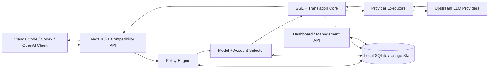
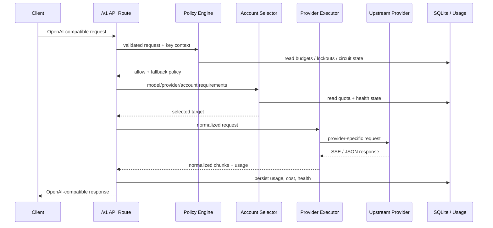
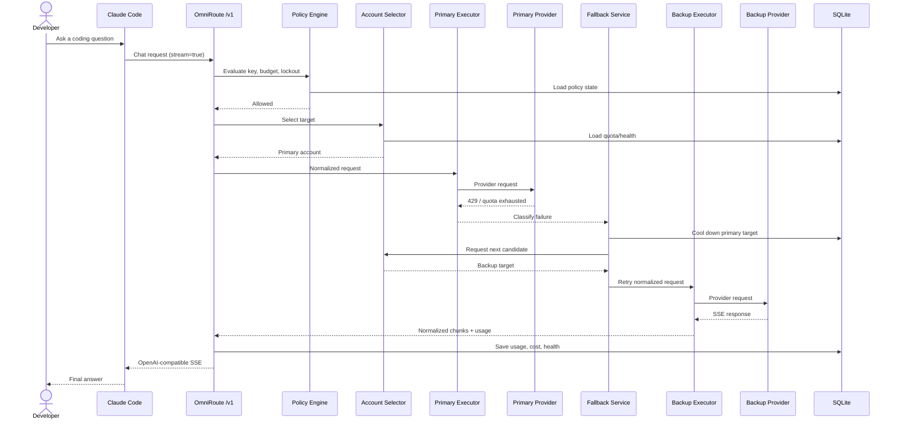

# diegosouzapw/OmniRoute 项目深度解析

## 1. 项目概览

- 报告日期：2026-07-21
- 仓库地址：https://github.com/diegosouzapw/OmniRoute
- Trending 原始排名：4
- Stars Today：1,107
- 项目定位：本地运行的统一 AI 路由网关和管理面板，对外暴露 OpenAI 兼容接口，对内处理协议翻译、模型/账号选择、失败降级、流式响应和用量记录。
- 解决的问题：开发者同时使用多家模型时，需要分别维护 API、OAuth、模型名、限额、失败策略和客户端配置；OmniRoute 尝试把这些差异收敛到一个本地端点。
- 目标用户：同时使用多家模型或多个订阅账号的开发者、Coding Agent 用户、需要模型容错和成本治理的团队。
- 当前成熟度：生产候选。仓库有大量测试、版本发布、架构文档和多种运行形态，但功能面很大，上游服务变化会直接影响稳定性。
- 推荐结论：适合在开发环境或受控团队环境评估为模型接入层；进入生产前，应针对实际使用的少数提供商做安全、限额、故障和数据保留测试。

## 2. 系统架构

### 2.1 架构概览

OmniRoute 是一个以 Next.js 为管理与兼容 API 外壳、以 `src/sse/*` 与 `open-sse/*` 为请求执行核心的本地进程。Coding Agent 或 OpenAI 兼容客户端将请求发送到 `/v1/*`；路由层校验请求和 API Key，策略层评估锁定、预算与降级规则，账号选择器结合配额和健康状态选择目标；执行器负责协议转换并调用上游。流式结果经 SSE 核心统一转换后返回，同时将连接、用量、成本和领域状态写入本地 SQLite 或日志表。

### 2.2 架构图

### 2.3 核心模块

| 模块 | 职责 | 代码位置 | 关键依赖 | 证据级别 |
|---|---|---|---|---|
| 兼容 API | 接收 OpenAI/Anthropic/Responses 等请求 | `src/app/api/v1/*`, `src/app/api/v1beta/*` | Next.js App Routes | High |
| Chat 入口 | 处理 `/v1/chat/completions` | `src/app/api/v1/chat/completions/route.ts` | API 校验、SSE handler | High |
| SSE 路由核心 | 流式执行、协议翻译、结果归一化 | `src/sse/*`, `open-sse/*` | Provider executors | High |
| Chat Core | 组织核心聊天执行链 | `open-sse/handlers/chatCore.ts` | 账号选择、执行器、重试 | High |
| Provider Executor | 调用不同上游并适配响应 | `open-sse/executors/*` | 各提供商 SDK/HTTP | High |
| 账号降级 | 多账号失败后切换 | `open-sse/services/accountFallback.ts` | 账号状态、冷却策略 | High |
| 账号选择 | 结合配额和健康状态挑选账户 | `open-sse/services/accountSelector.ts` | 配额、历史状态 | High |
| 熔断器 | 阻止持续调用故障目标 | `src/shared/utils/circuitBreaker.ts` | 持久领域状态 | High |
| 策略引擎 | 统一判断锁定、预算和 fallback | `src/domain/policyEngine.ts` | Domain rules | High |
| 状态持久化 | 保存 fallback、预算、锁定、熔断状态 | `src/lib/db/domainState.ts` | SQLite | High |
| 管理面板 | 管理连接、模型组合、日志和成本 | `src/app/(dashboard)/dashboard/*` | React/Next.js | High |

### 2.4 数据与状态管理

官方架构文档明确说明，本地 SQLite 保存提供商连接、Key、别名、模型组合、设置和价格，并通过 usage 表或日志记录请求用量和成本。领域状态采用 SQLite 写穿缓存，覆盖 fallback、预算、锁定与熔断器状态。可选云同步属于外部能力，云端实现不在本仓库范围内。

### 2.5 外部集成与协议

- 对客户端：OpenAI 兼容 `/v1/*`、WebSocket、MCP、A2A。
- 对上游：OAuth 提供商、API Key 提供商、OpenAI/Anthropic 兼容节点。
- 响应：普通 JSON、SSE 流式输出和部分媒体任务。
- 安全：API Key、IP allow/block list、SSRF 防护、Prompt Injection Guard 和审计日志。

### 2.6 部署与运行形态

- Node.js 本地服务或 Docker。
- Electron 桌面应用。
- PWA/浏览器管理面板。
- 后端单独构建模式。

项目的主要边界是“本地网关进程”；外部模型服务的 SLA、数据政策与配额不受它控制。

## 3. 主线流程

### 3.1 核心流程图

### 3.2 关键步骤

1. Next.js route 接收兼容请求，并建立 Request ID、鉴权与上下文。
2. Policy Engine 按锁定、预算、fallback 顺序判断是否允许执行。
3. Account Selector 根据模型、连接、限额和健康状态选择目标。
4. SSE/translation core 将请求转成提供商格式，executor 发往上游。
5. 上游返回流式或非流式结果，核心转换为兼容格式。
6. 用量、成本、延迟和目标健康状态写入本地存储。

### 3.3 异常与失败处理

- 上游返回 429 或配额不足：账号进入冷却或被标记不可选，选择下一个账号/模型组合。
- 连续故障：熔断器打开，短期内跳过目标。
- OAuth 过期：对应连接模块尝试刷新；失败后进入 fallback。
- 所有候选失败：将结构化错误返回客户端，并保留请求与目标状态用于诊断。
- 安全校验失败：在进入上游前拒绝请求。

## 4. 典型业务场景端到端执行链路

### 4.1 场景定义

| 项目 | 内容 |
|---|---|
| 场景名称 | Claude Code 通过统一端点发起代码问答，首选账号触发限额后自动切换到备用提供商 |
| 参与者 | Claude Code、OmniRoute API、Policy Engine、Account Selector、Provider Executor、首选/备用模型提供商、SQLite |
| 前置条件 | OmniRoute 已启动；至少配置两个可用目标；客户端指向本地 `/v1`；API Key 有模型权限 |
| 输入 | **示意**：`POST /v1/chat/completions`，model=`auto`，messages 包含代码问题，stream=`true` |
| 期望结果 | 首选目标不可用时，系统不要求用户改配置，自动选择备用目标并持续返回兼容 SSE |
| 成功判定 | 客户端收到完整回答；请求日志显示实际使用的备用目标；首选目标进入冷却/失败状态；用量被记录 |

### 4.2 端到端时序图

### 4.3 执行步骤追踪

| 步骤 | 输入 | 执行组件 | 关键代码位置 | 状态或数据变化 | 输出 | 失败分支 | 证据级别 |
|---:|---|---|---|---|---|---|---|
| 1 | **示意** chat payload | Compatibility route | `src/app/api/v1/chat/completions/route.ts` | 建立请求上下文与 ID | 已校验请求 | 鉴权/Schema 失败直接返回 | High |
| 2 | Key、模型、预算上下文 | Policy Engine | `src/domain/policyEngine.ts` | 读取 lockout/budget/fallback | allow/deny 决策 | 锁定或预算超限拒绝 | High |
| 3 | 模型与连接候选 | Account Selector | `open-sse/services/accountSelector.ts` | 读取配额、冷却、健康 | 首选账户 | 无候选则失败 | High |
| 4 | 归一化请求 | Chat Core / Executor | `open-sse/handlers/chatCore.ts`, `open-sse/executors/*` | 生成提供商请求 | 上游 HTTP/SSE | 翻译或网络失败 | High |
| 5 | 429 | Fallback Service | `open-sse/services/accountFallback.ts` | 首选目标进入冷却/失败状态 | 下一候选请求 | 超过重试上限停止 | High |
| 6 | 相同业务请求 | 备用 Executor | `open-sse/executors/*` | 使用备用连接 | 成功 SSE | 备用也失败继续策略链 | High |
| 7 | 流式结果与用量 | SSE core | `src/sse/*`, `open-sse/*` | 聚合 token/延迟 | 兼容 chunks | 流中断返回结构化错误 | High |
| 8 | usage/cost/health | DB layer | `src/lib/db/domainState.ts` 及 usage modules | 更新用量和健康状态 | 可查询日志 | 写入失败不应伪装成功记录 | Medium |

### 4.4 关键状态与数据变化

- 首选账户：`healthy/available` → `quota_exhausted` 或 `cooldown`。
- 熔断/领域状态：记录失败时间、原因和下次可尝试时间。
- 实际执行目标：从首选提供商切换为备用提供商。
- Usage：保存最终实际目标、token、成本、延迟和请求关联 ID。
- 客户端看到的协议仍保持 OpenAI 兼容，不暴露提供商差异。

### 4.5 失败传播、重试与回滚

重试不是无限循环。请求先按账号级 fallback，再按模型组合/提供商策略选择后续候选；`requestRetry` 和最大重试间隔限制总次数与等待。若候选耗尽，错误回到客户端。本场景主要改变运行状态和用量记录，不涉及需要事务回滚的业务数据；冷却状态应在到期后恢复可选。

### 4.6 最终业务结果

开发者不需要在 Claude Code 中更换 Base URL、模型供应商或 Key，即可在首选账号限额耗尽时继续获得答案。系统同时留下“为什么切换、切到哪里、用了多少”的本地证据，便于成本和故障诊断。

### 4.7 最小复现与验证方法

1. 本地安装 OmniRoute，并配置两个测试提供商或账号。
2. 将第一个账号设置为低额度或使用可稳定返回 429 的测试目标。
3. 配置一个包含首选与备用目标的 combo。
4. 用 curl 或 OpenAI SDK 向本地 `/v1/chat/completions` 发送 **示意**流式请求。
5. 检查客户端是否收到完整响应，并在 Dashboard 的 usage、logs、health 页面确认目标切换和冷却状态。
6. 不要使用真实敏感代码验证；先用无敏感信息的固定 Prompt。

## 5. 技术栈

| 层次 | 技术 | 用途 | 是否核心 | 证据位置 |
|---|---|---|---|---|
| 语言与运行时 | TypeScript / Node.js | 网关、API 与业务逻辑 | 是 | `package.json` |
| Web/管理 | Next.js / React | API Routes 与 Dashboard | 是 | `src/app/*` |
| 桌面端 | Electron | 本地桌面分发 | 否 | `electron/`, scripts |
| 数据与状态 | SQLite | 连接、设置、用量和领域状态 | 是 | 架构文档、`src/lib/db/*` |
| 通信 | HTTP / SSE / WebSocket | 兼容 API 与流式输出 | 是 | `src/sse/*`, `open-sse/*` |
| Agent 协议 | MCP / A2A | 工具与 Agent 互操作 | 否 | 架构文档 |
| 策略 | Circuit Breaker / Quota / Fallback | 容错和路由 | 是 | `policyEngine.ts`, fallback services |
| 构建与部署 | Next build / Docker / Electron | 发布与运行 | 是 | `package.json`, Docker 配置 |

## 6. 创新点

### 创新点 1

- 类型：工程整合创新
- 传统方案：每个 Coding Agent 分别配置不同模型服务与协议。
- 当前方案：本地统一兼容端点，加上 provider executor 和协议翻译层。
- 实际收益：客户端配置更稳定，模型与账号切换从客户端移到网关。
- 证据：官方架构文档中的 `/v1/*`、translation core 与 executor 列表。
- 局限：集成面越大，越容易受到上游协议变化影响。

### 创新点 2

- 类型：可靠性架构
- 传统方案：单个 API Key 失败后由用户手工切换。
- 当前方案：配额预检、P2C 账号选择、账号 fallback、模型 combo 与熔断器分层协作。
- 实际收益：减少限额与短时故障打断开发流程。
- 证据：`accountSelector.ts`、`accountFallback.ts`、`circuitBreaker.ts`、策略引擎。
- 局限：自动切换可能导致模型能力、成本和数据处理地域变化，必须设置策略边界。

### 创新点 3

- 类型：上下文成本优化
- 传统方案：客户端原样发送长工具输出和上下文。
- 当前方案：提供 RTK、Caveman 与组合压缩管线。
- 实际收益：项目方宣称可减少输入 token 和触发限额的概率。
- 证据：README、compression scripts 与 Dashboard 页面。
- 局限：节省比例是项目方基准；压缩可能损失细节，需按任务验证。

## 7. 应用场景

### 适合

- 个人开发者在多个模型订阅之间切换。
- Coding Agent 的本地统一网关。
- 需要用量、成本和故障可见性的开发环境。
- 对外部服务调用希望有本地策略控制的团队。

### 可以尝试

- 小团队共享的内部 AI 网关。
- 带有模型组合和成本策略的测试环境。
- MCP/A2A 与现有 Agent 平台的集成。

### 暂不建议

- 未完成数据合规和密钥隔离评审的高敏感生产环境。
- 要求供应商级 SLA、强多租户隔离和审计认证的场景。
- 无法接受自动 fallback 改变模型或数据处理方的业务。

## 8. 第一次阅读与验证建议

1. 先读 `docs/architecture/ARCHITECTURE.md` 和 resilience guide。
2. 再看 chat route、`chatCore.ts`、账号选择与 fallback 服务。
3. 用两个低风险测试账号跑一次 429 切换。
4. 查看 usage、logs、health 是否能完整解释执行结果。
5. 再决定是否启用压缩、自动组合和云同步。

## 9. 风险与限制

- 安全：网关集中保管多家凭据，必须限制本地端口、API Key 权限和文件访问。
- 性能：协议转换、压缩和多层策略会增加开销，需要用真实流式任务测量延迟。
- 许可证：MIT；上游提供商服务条款和模型许可证另行适用。
- 维护状态：发布频繁、功能面广；升级可能带来配置兼容问题。
- 生产可用性：具备较完整工程信号，但本报告未执行故障注入、负载测试或安全审计。

## 10. Evidence Notes

- `docs/architecture/ARCHITECTURE.md`：系统边界、组件、数据层、路由和容错路径。
- `package.json`：Node 版本、构建方式、Electron、测试、MIT。
- `src/app/api/v1/chat/completions/route.ts`：兼容 Chat 入口。
- `open-sse/handlers/chatCore.ts`：聊天执行核心。
- `open-sse/services/accountSelector.ts`：账号选择。
- `open-sse/services/accountFallback.ts`：账号降级。
- `src/shared/utils/circuitBreaker.ts`：熔断器。
- `src/domain/policyEngine.ts`：策略顺序。
- `src/lib/db/domainState.ts`：领域状态持久化。

## 11. Honest Caveat

本报告为源码与官方文档静态分析，没有实际启动 268 个提供商，也没有独立验证免费额度、压缩比例、质量评估或全部 fallback 分支。官方架构文档针对 v3.8.x，代码持续更新时路径和数量可能变化。

## 12. 可信度

- Architecture Confidence: High
- Flow Confidence: High
- Innovation Confidence: Medium
