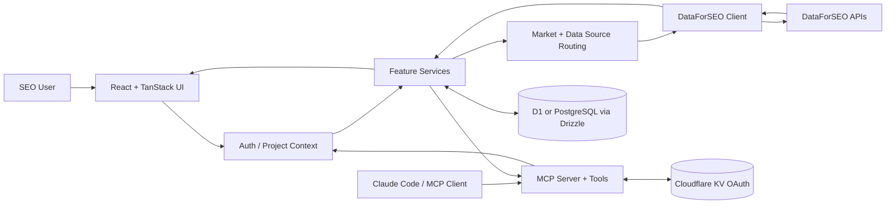
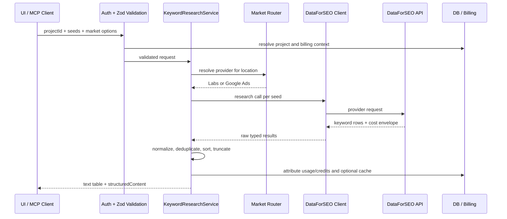
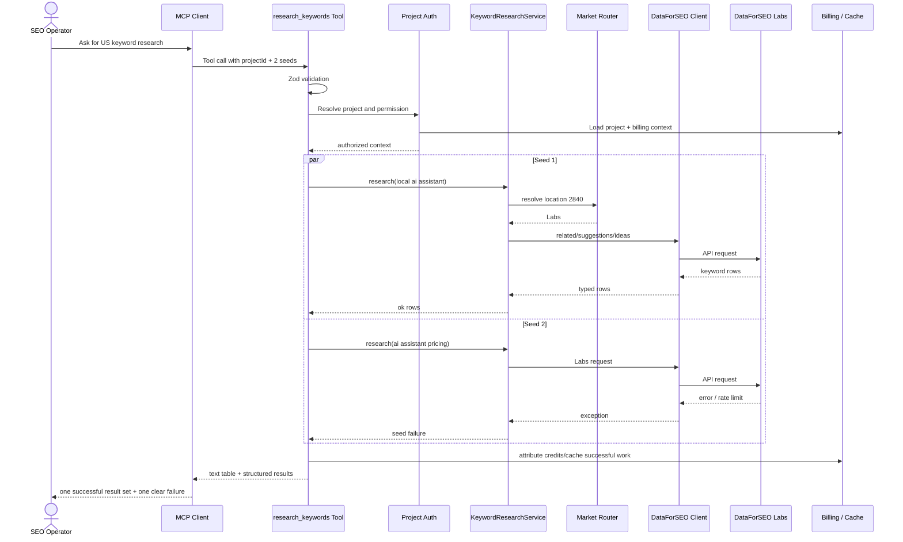

# every-app/open-seo 项目深度解析

## 1. 项目概览

- 报告日期：2026-07-21
- 仓库地址：https://github.com/every-app/open-seo
- Trending 原始排名：11
- Stars Today：939
- 项目定位：可自托管的 SEO 工作台和 MCP 数据服务，覆盖关键词研究、排名、竞品、外链、站点审计与 AI 可见性。
- 解决的问题：传统 SEO 套件通常采用高价订阅和封闭数据界面；OpenSEO 让用户自带 DataForSEO Key，按实际请求付费，并把能力同时提供给 Web UI 和 AI Agent。
- 目标用户：独立站运营者、内容团队、SEO 顾问、小型代理商、希望让 Agent 使用 SEO 数据的开发者。
- 当前成熟度：早期可用到生产候选之间。项目已有完整 Web、MCP、认证、数据库、计费和部署路径，但版本仍较早，外部数据与成本策略变化较快。
- 推荐结论：适合自托管关键词研究和 Agent SEO 自动化的试点；上线前必须理解 DataForSEO 计费、地区覆盖、授权模式和数据留存。

## 2. 系统架构

### 2.1 架构概览

OpenSEO 采用 TypeScript 全栈架构。React 19 与 TanStack Start/Router/Query 构成客户端与服务端路由，服务层围绕关键词、排名、竞品和审计等 feature 组织业务。用户可以通过 Web UI 调用，也可以通过 MCP 工具由 Claude Code 等 Agent 发起。输入经 Zod 校验和项目级鉴权后，进入 feature service；服务根据市场与地区选择 DataForSEO Labs 或 Google Ads 数据端点，统一归一化结果，并通过 Drizzle 写入 Cloudflare D1 或 PostgreSQL。Cloudflare KV 用于 OAuth，Workers 是高级自托管路径；个人本地部署则可以使用 Docker。

### 2.2 架构图

### 2.3 核心模块

| 模块 | 职责 | 代码位置 | 关键依赖 | 证据级别 |
|---|---|---|---|---|
| Web 客户端 | 页面、表格、筛选和项目工作流 | `src/client/*` | React, TanStack, Tailwind | High |
| 服务端 feature | 关键词、排名、竞品和审计业务 | `src/server/features/*` | TypeScript services | High |
| MCP Server | 注册工具并向 Agent 返回文本/结构化结果 | `src/server/mcp/server.ts`, `src/server/mcp/tools/*` | MCP SDK | High |
| 项目鉴权 | 验证 MCP 调用是否有目标项目权限 | `src/server/mcp/project-auth.ts` | Auth context | High |
| Keyword Research Tool | 校验多个 seed 并并行研究 | `src/server/mcp/tools/research-keywords.ts` | Zod, KeywordResearchService | High |
| KeywordResearchService | 编排关键词数据源和返回结构 | `src/server/features/keywords/services/KeywordResearchService*` | research services | Medium |
| 数据源路由 | 按地区选择 Labs 或 Google Ads | `src/shared/keyword-locations.ts`, `specs/0004-keyword-data-source-routing.md` | Market config | High |
| DataForSEO Adapter | 封装 Labs/Ads/SERP 调用和费用上下文 | `src/server/lib/dataforseo/*` | dataforseo-client | High |
| 结果归一化 | 去重并统一 volume/CPC/KD/intent | `src/server/features/keywords/services/research/research-data.ts` | Helper mappers | High |
| 数据库层 | 项目、认证、业务数据和计费状态 | `src/db/*` | Drizzle, D1/PostgreSQL | High |
| 认证与 OAuth | hosted/Cloudflare Access/MCP OAuth | `cli-auth.ts`, auth modules | better-auth, jose, KV | Medium |

### 2.4 数据与状态管理

- Cloudflare 部署使用 D1；高级/托管部署可使用 PostgreSQL。
- Drizzle ORM 维护两类数据库 Schema 和迁移。
- MCP OAuth 注册、授权和 token 可绑定到 Cloudflare KV。
- 关键词研究结果会被归一化，缓存 Key 包含数据源、地区、语言和 clickstream 标志；设计文档说明缓存版本在数据策略变化时升级。
- DataForSEO 请求携带 billing customer 与 credit feature，以便将外部成本映射到产品积分。

### 2.5 外部集成与协议

- DataForSEO Labs、Keywords Data/Google Ads、SERP 等 API。
- MCP Server，为 Agent 暴露关键词、竞品和本地搜索工具。
- Cloudflare Workers、D1、KV、Access。
- PostgreSQL 自托管/托管部署。
- OpenRouter/AI SDK 用于项目内 Agent 或对话功能。

### 2.6 部署与运行形态

- Docker：个人本地使用。
- Cloudflare：多设备或团队的互联网部署。
- PostgreSQL/Alchemy：托管或高级环境。
- 官方 hosted 服务。

自托管只改变应用托管方式，不会移除 DataForSEO 的外部依赖和费用。

## 3. 主线流程

### 3.1 核心流程图

### 3.2 关键步骤

1. UI 或 MCP 工具接收 projectId、1–5 个 seed、地区、语言和可选 clickstream。
2. Zod 验证输入，项目鉴权层解析用户、项目与计费上下文。
3. Market Router 根据 locationCode 判断使用 Labs 还是 Google Ads 端点。
4. Service 对 seed 并行发起请求，每个 seed 独立捕获错误。
5. Adapter 将上游结果映射成统一字段：keyword、volume、trend、CPC、competition、difficulty 与 intent。
6. 结果以文本表格和 structuredContent 返回 Agent，并记录 source 与 usedFallback。

### 3.3 异常与失败处理

- 单个 seed 失败不会让整个批次失败；返回 `ok:false` 和错误信息。
- 不支持的地区/功能组合在验证阶段给出明确错误。
- Google Ads-only 地区没有 difficulty 和 intent，字段明确为 null/unknown。
- Clickstream 使费用加倍，必须显式 opt-in。
- DataForSEO 限速或网络失败传播到该 seed，调用方可缩小批次或稍后重试。

## 4. 典型业务场景端到端执行链路

### 4.1 场景定义

| 项目 | 内容 |
|---|---|
| 场景名称 | 内容运营 Agent 为美国市场研究“local ai assistant”关键词，并在一个 seed 失败时保留其他结果 |
| 参与者 | 内容运营者、Claude Code/MCP Client、OpenSEO MCP Server、项目鉴权、KeywordResearchService、Data Source Router、DataForSEO、数据库/计费层 |
| 前置条件 | OpenSEO 已部署；项目已创建；DataForSEO Key 有余额；MCP 客户端已获得项目权限 |
| 输入 | **示意**：projectId=`proj_demo`，seeds=`[local ai assistant, ai assistant pricing]`，locationCode=2840，languageCode=`en`，resultLimit=150，clickstream=false |
| 期望结果 | 返回每个 seed 的关键词、搜索量、KD、CPC、竞争度与意图；一个 seed 失败时另一个仍返回 |
| 成功判定 | structuredContent 中至少一个 seed `ok:true`，显示 source、rowCount 和 rows；账单/积分记录与实际调用匹配 |

### 4.2 端到端时序图

### 4.3 执行步骤追踪

| 步骤 | 输入 | 执行组件 | 关键代码位置 | 状态或数据变化 | 输出 | 失败分支 | 证据级别 |
|---:|---|---|---|---|---|---|---|
| 1 | **示意** MCP args | Zod schema | `src/server/mcp/tools/research-keywords.ts` | 无持久变化 | typed Args | seed 数、长度或 limit 非法则拒绝 | High |
| 2 | projectId + caller | Project Auth wrapper | `src/server/mcp/project-auth.ts` | 读取项目与权限 | billing/project context | 无权限返回错误 | High |
| 3 | location/language | Market resolver | `src/shared/keyword-locations.ts` | 选择 source | Labs 或 Google Ads | 语言与地区不兼容 | High |
| 4 | 单个 seed | KeywordResearchService | `src/server/features/keywords/services/KeywordResearchService*` | 形成 research plan | source/mode/limit | service 规则失败 | Medium |
| 5 | provider request | DataForSEO client | `src/server/lib/dataforseo/*` | 外部计费请求 | raw rows/cost | 429、余额、网络错误 | High |
| 6 | raw items | Result mapper | `research/research-data.ts` | 去重并统一字段 | EnrichedKeyword[] | 缺失字段转 null/unknown | High |
| 7 | 每个 seed 结果 | MCP handler | `research-keywords.ts` | 聚合成功/失败 | per-seed result | 单 seed catch，不中断批次 | High |
| 8 | rows + meta | Formatter/billing | `mcp/formatters`, billing modules | 记录积分/缓存（按配置） | 文本表 + structuredContent | 记录失败需检查日志 | Medium |

### 4.4 关键状态与数据变化

- 请求开始时，项目权限和 BillingCustomerContext 被解析。
- location 2840（美国）按设计选择 Labs；其他不受 Labs 支持的国家会路由到 Google Ads 数据端点。
- 每个 seed 独立产生 `ok:true/false` 状态。
- 成功结果被标准化为统一字段；Google Ads-only 结果的 KD 为 null、intent 为 unknown。
- Clickstream=false 不产生双倍 clickstream 成本；若 true，缓存 Key 与费用都会变化。
- 本链路的主要副作用是外部 API 费用、积分归因和可能的缓存，不一定持久保存所有展示行。

### 4.5 失败传播、重试与回滚

`Promise.all` 包裹每个 seed 的 try/catch，因此单个错误被转换为该 seed 的失败对象。没有业务事务需要回滚；已经成功的外部调用可能已经产生费用。调用方可以只重试失败 seed，避免重复支付成功 seed。若 DataForSEO 返回全局限速，应等待后再重试，而不是立刻并发轰炸。

### 4.6 最终业务结果

运营者获得一张带 volume、KD、CPC、competition 和 intent 的关键词表，并明确知道数据来自哪个 source、是否 fallback、哪些 seed 失败。Agent 能继续做聚类或内容规划，而不用解析网页仪表盘。

### 4.7 最小复现与验证方法

1. 按 Docker 文档本地启动 OpenSEO，并配置一个低风险测试 DataForSEO Key。
2. 创建测试 project，记录调用前 DataForSEO 余额或 OpenSEO credits。
3. 配置 MCP 客户端，调用 `research_keywords`，先只传一个官方支持的 seed。
4. 再传两个 seed，并用一个可触发错误的**示意**输入验证部分失败隔离。
5. 对比 UI 与 MCP 返回的 source、rowCount、字段缺失和费用。
6. 分别在 clickstream=false/true 下确认成本提示和缓存区分。

## 5. 技术栈

| 层次 | 技术 | 用途 | 是否核心 | 证据位置 |
|---|---|---|---|---|
| 语言 | TypeScript | 全栈业务与工具 | 是 | `package.json`, `src/*` |
| 前端 | React 19 / TanStack Start/Router/Query/Table | UI、路由、状态和表格 | 是 | dependencies, `src/client/*` |
| 构建 | Vite | 开发与构建 | 是 | scripts, `vite.config.ts` |
| 服务运行 | Cloudflare Workers / Node-compatible tooling | API 与边缘部署 | 是 | Wrangler/Alchemy config |
| 数据库 | D1 / PostgreSQL | 项目、认证和业务状态 | 是 | Drizzle configs, `src/db/*` |
| ORM | Drizzle | Schema 与迁移 | 是 | package/scripts |
| 外部数据 | DataForSEO | SEO 数据 | 是 | client/services |
| Agent 协议 | MCP | 为 Agent 暴露 SEO tools | 是 | `src/server/mcp/*` |
| 认证 | better-auth / Cloudflare Access / OAuth | 用户与 MCP 授权 | 是 | package + auth configs |
| AI | AI SDK / OpenRouter / Cloudflare AI | 内置对话与 Agent 功能 | 否 | dependencies/features |
| 测试 | Vitest / Playwright | 单元与 E2E | 否 | scripts/e2e |

## 6. 创新点

### 创新点 1

- 类型：商业模式与工程整合创新
- 传统方案：SEO 工具按月收取较高订阅费并封闭数据调用。
- 当前方案：应用自托管，用户自带 DataForSEO Key，成本按调用发生。
- 实际收益：小规模用户能控制部署和支出，并可定制工作流。
- 证据：README 的 BYO Key、Docker/Cloudflare 路径与计费说明。
- 局限：仍依赖商业数据提供商，自托管不等于免费数据。

### 创新点 2

- 类型：Agent 工作流创新
- 传统方案：SEO 人员在 Web UI 手工导出 CSV，再交给 AI 分析。
- 当前方案：MCP 直接提供带 Schema、权限、结构化输出和费用语义的工具。
- 实际收益：Agent 能在受控项目上下文中完成关键词、竞品和审计流程。
- 证据：MCP server、tools、Agent Skills。
- 局限：自动化放大错误请求和外部费用，需要严格限制 project 权限和参数。

### 创新点 3

- 类型：数据源路由创新
- 传统方案：单一数据源覆盖不到的国家直接不可用，或用户自己选择复杂 provider。
- 当前方案：按 location 自动选择 Labs 或 Google Ads，并明确降级字段和费用。
- 实际收益：扩大国家覆盖，同时在支持区域保留 KD/intent。
- 证据：`specs/0004-keyword-data-source-routing.md` 和 mapper。
- 局限：不同源的字段和成本不可完全等价，跨地区比较需谨慎。

## 7. 应用场景

### 适合

- 独立站和小团队的关键词研究。
- SEO 顾问的自托管工作台。
- Agent 驱动的内容规划和竞品分析。
- 对 SaaS 月费敏感、但能管理 DataForSEO Key 的用户。

### 可以尝试

- 多团队 Cloudflare 部署。
- 将 MCP 工具接入内容生产流水线。
- 在内部数据权限框架下扩展自定义 SEO Skill。

### 暂不建议

- 无法管理第三方 API 费用和速率限制的团队。
- 需要完全离线 SEO 数据的场景。
- 对指标口径必须与 Semrush/Ahrefs 完全一致的合同交付。
- 未做 Cloudflare Access/OAuth 安全配置的公开互联网部署。

## 8. 第一次阅读与验证建议

1. 先读 README 和两份 self-hosting 文档。
2. 阅读 `package.json` 理解 D1/Postgres 双路径和 MCP 依赖。
3. 从 `research-keywords.ts` 追到 KeywordResearchService 与 `research-data.ts`。
4. 阅读 `specs/0004-keyword-data-source-routing.md` 理解费用与字段差异。
5. 用一个项目、一个 seed、150 行默认限制做成本和结果验证。

## 9. 风险与限制

- 安全：DataForSEO Key、MCP OAuth 和项目数据必须妥善隔离。
- 性能：关键词批量请求受外部 API 延迟与速率限制影响。
- 许可证：MIT；DataForSEO 数据使用与 API 条款另行适用。
- 维护状态：项目版本仍早，Schema、计费和部署方式可能快速变化。
- 生产可用性：具备完整应用结构和 E2E 测试，但本报告未执行负载、费用异常和权限渗透测试。

## 10. Evidence Notes

- `README.md`：产品定位、工作流、自托管与外部数据依赖。
- `package.json`：React/TanStack/Cloudflare/Drizzle/MCP/认证与部署脚本。
- `src/server/mcp/tools/research-keywords.ts`：输入 Schema、项目鉴权、每 seed 隔离与输出。
- `src/server/features/keywords/services/research/research-data.ts`：DataForSEO 调用和字段归一化。
- `specs/0004-keyword-data-source-routing.md`：Labs/Google Ads 路由、费用、clickstream 和字段降级决策。
- `src/db/*`, Drizzle configs：D1/Postgres 持久化。

## 11. Honest Caveat

本报告没有真实购买 DataForSEO 数据，也没有验证 UI 与所有 MCP 工具。KeywordResearchService 的部分内部编排依据工具入口、research service 文件和已接受设计文档还原，因此核心关键词链路可信度高，但整个平台的计费、缓存和认证细节仍需运行验证。

## 12. 可信度

- Architecture Confidence: High
- Flow Confidence: High
- Innovation Confidence: Medium
