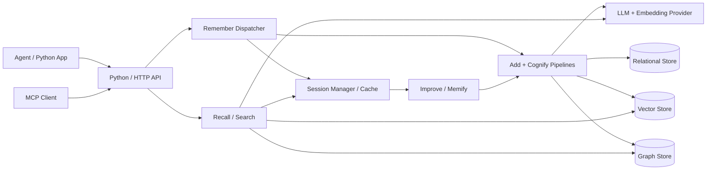
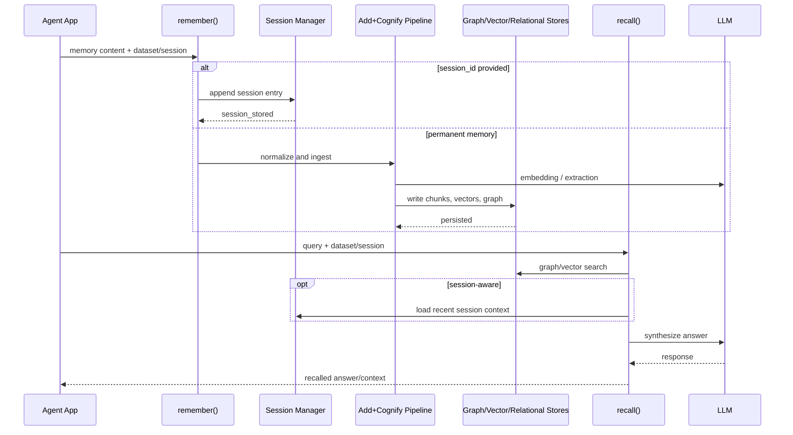
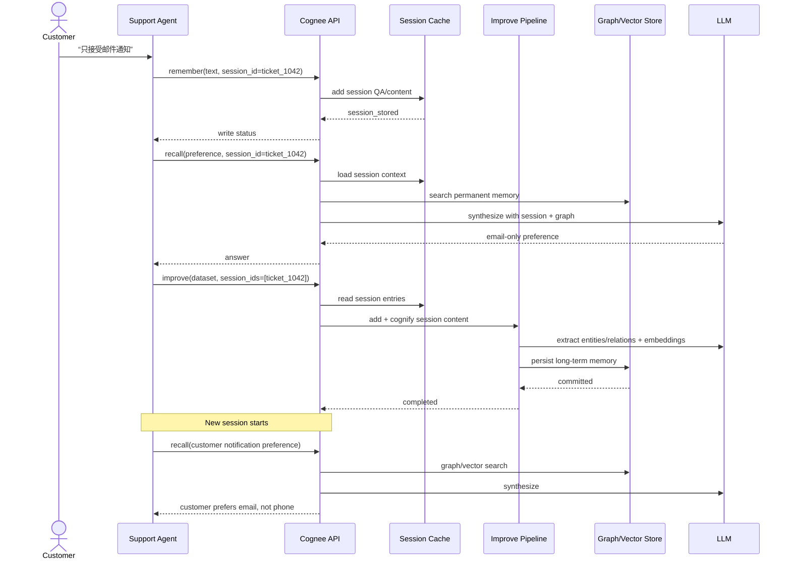

# topoteretes/cognee 项目深度解析

## 1. 项目概览

- 报告日期：2026-07-21
- 仓库地址：https://github.com/topoteretes/cognee
- Trending 原始排名：9
- Stars Today：234
- 项目定位：为 AI Agent 提供会话记忆、长期知识图谱和检索能力的开源记忆平台。
- 解决的问题：普通 Agent 的上下文通常随会话结束而丢失；把所有历史直接塞回 Prompt 又贵又乱。Cognee 将会话内容、文档和结构化数据分层存储，并通过图关系与向量语义进行召回。
- 目标用户：Agent 开发者、知识助手团队、客服/研究/编码 Agent、需要自托管长期记忆的组织。
- 当前成熟度：生产候选。仓库包含 API、CLI、MCP、前端、Docker、数据库后端与测试，但记忆质量和部署复杂度仍依赖具体模型与存储配置。
- 推荐结论：适合做 Agent 记忆层的技术评估，尤其适合需要数据可控、跨会话召回和可演进知识结构的场景；不要把“接上记忆库”误解成自动获得准确记忆。

## 2. 系统架构

### 2.1 架构概览

Cognee 对外提供 Python API、HTTP API、CLI 与 MCP 接口。输入可以直接写入永久知识图谱，也可以先进入会话缓存；永久写入会经过 add/cognify 等管线，将原始内容拆分、Embedding、实体/关系抽取并存入关系、向量与图存储。`recall` 根据查询和数据集权限检索长期图谱，并可叠加会话上下文。`improve` 可将会话缓存内容同步到永久图谱，实现从短期交互到长期记忆的转换。

### 2.2 架构图

### 2.3 核心模块

| 模块 | 职责 | 代码位置 | 关键依赖 | 证据级别 |
|---|---|---|---|---|
| 公共 Python API | 暴露 remember/recall/improve/forget | `cognee/__init__.py`, `cognee/api/*` | Async Python | High |
| Remember Dispatcher | 区分 typed entry、会话写入和永久管线 | `cognee/api/v1/remember/remember.py` | Session Manager、add/cognify | High |
| Session Manager | 保存 Q&A、Trace、Feedback 等短期记录 | `cognee/infrastructure/session/*` | Cache backend | High |
| Ingestion/Add | 读取并标准化原始数据 | `cognee/modules/pipelines/*`, ingestion tasks | Loaders、relational DB | Medium |
| Cognify | 将数据转为图与向量表示 | `cognee/modules/cognify/*` | LLM、Embedding、graph/vector DB | Medium |
| Recall | 查询长期记忆并结合会话上下文 | `cognee/api/v1/recall/*` | Search、LLM | Medium |
| Improve | 将会话内容同步/优化到长期图谱 | `cognee/api/v1/improve/*`, memify modules | add/cognify | Medium |
| MCP Server | 为 Agent 暴露记忆工具 | `cognee-mcp/src/server.py`, `cognee_client.py` | MCP SDK | High |
| HTTP Serve | 远程客户端与 API 服务 | `cognee/api/v1/serve/*` | FastAPI/HTTP client | Medium |
| 存储适配 | 支持关系、向量和图数据库 | `cognee/infrastructure/databases/*` | SQLite/Postgres/pgvector/图 DB | High |

### 2.4 数据与状态管理

Cognee 将不同状态分层：

- 会话记忆：由 Session Manager 管理，可使用文件系统或其他缓存后端；`remember(session_id=...)` 不直接运行永久图谱管线。
- 永久记忆：通过 `remember()` 无 session 或 `improve()` 进入 add+cognify 管线，写入关系、向量和图存储。
- 权限与数据集：写入和检索围绕 dataset 与 user 授权执行。
- typed memory：QA、Trace、Feedback、SkillRun 等条目有专门结构与处理路径。

默认和可选存储组合会随部署配置变化，因此不能把某个数据库写成唯一架构。

### 2.5 外部集成与协议

- Python async API。
- HTTP 服务与远程 client。
- MCP Server，供 Claude Code 等 Agent 调用。
- LLM 与 Embedding 提供商。
- 可配置关系、向量与图数据库。
- 插件和语言客户端。

### 2.6 部署与运行形态

- Python 库嵌入应用。
- 本地 HTTP 服务。
- Docker / Docker Compose。
- MCP 进程。
- 带前端的自托管部署。

## 3. 主线流程

### 3.1 核心流程图

### 3.2 关键步骤

1. API 判断输入是普通数据还是 typed memory entry，并解析 user、dataset 与 session。
2. 有 session_id 的普通会话内容先写缓存；无 session_id 的内容进入永久管线。
3. 永久管线完成加载、拆分、Embedding、实体关系提取和存储。
4. recall 按用户权限与数据集执行向量/图检索，并可加入会话历史。
5. improve 读取会话内容，再调用长期管线使其成为永久知识。

### 3.3 异常与失败处理

- 缓存未启用：会话写入会告警或抛出明确错误；不能假装已经持久化。
- 无法解析用户或 session：typed memory 写入拒绝。
- 数据集无权限：授权解析阶段阻止写入或检索。
- LLM/Embedding 失败：永久管线无法完成，需要重试或更换配置。
- 部分图/向量写入失败：需要检查 pipeline run 状态和日志，不能只看 API 调用返回。

## 4. 典型业务场景端到端执行链路

### 4.1 场景定义

| 项目 | 内容 |
|---|---|
| 场景名称 | 客服 Agent 在会话中记住客户偏好，随后将会话同步为长期记忆并在新会话召回 |
| 参与者 | 客服用户、客服 Agent、Cognee Python API、Session Manager、Improve Pipeline、Graph/Vector Store、LLM |
| 前置条件 | 已配置 LLM_API_KEY；启用 session cache；建立 `support_memory` dataset；存储后端可用 |
| 输入 | **示意**：客户说“我只接受邮件通知，不要电话联系”；session_id=`ticket_1042` |
| 期望结果 | 当前会话可立即利用该偏好；执行 improve 后，新会话无需重新询问即可召回偏好 |
| 成功判定 | session-aware recall 返回邮件偏好；improve 完成后，不带旧 session_id 的 recall 仍能从永久记忆召回该偏好 |

### 4.2 端到端时序图

### 4.3 执行步骤追踪

| 步骤 | 输入 | 执行组件 | 关键代码位置 | 状态或数据变化 | 输出 | 失败分支 | 证据级别 |
|---:|---|---|---|---|---|---|---|
| 1 | **示意**偏好文本 + session_id | `remember()` | `cognee/api/v1/remember/remember.py` | 估算数据、解析 user/session | dispatcher context | user 不可解析则失败 | High |
| 2 | 会话文本 | `_add_to_session` / Session Manager | `remember.py`, `infrastructure/session/*` | 新增 session QA/content | `session_stored` | cache 未启用则告警/失败 | High |
| 3 | 查询 + session_id | `recall()` | `cognee/api/v1/recall/*` | 读取会话上下文并查询长期图 | 候选记忆 | 数据集无权限或检索失败 | Medium |
| 4 | 图结果 + 会话历史 | LLM synthesis | recall pipeline | 无持久状态变化 | 当前会话答案 | LLM 失败或结果不充分 | Medium |
| 5 | session_ids + dataset | `improve()` | `cognee/api/v1/improve/*` | 读取 session 条目 | 待长期化内容 | session 不存在则无内容/失败 | Medium |
| 6 | 会话内容 | add+cognify | pipeline/cognify modules | 生成 chunks、向量、节点与关系 | 永久图谱记录 | Embedding/LLM/DB 写入失败 | Medium |
| 7 | 新会话查询 | recall | recall/search modules | 仅读取永久存储 | 长期偏好答案 | 图谱未成功更新则召回不到 | Medium |

### 4.4 关键状态与数据变化

1. 初始：客户偏好只存在用户输入中。
2. session remember 后：偏好进入 `ticket_1042` 会话缓存，尚未成为永久图谱。
3. session recall 时：查询可以同时使用永久知识和当前会话历史。
4. improve 后：偏好经过 add/cognify，形成可搜索文本、Embedding 和图关系。
5. 新会话 recall：无需旧 session_id，从永久存储得到偏好。

### 4.5 失败传播、重试与回滚

- Session cache 未启用：写入不会形成可用会话记忆，应立即返回配置问题，而不是继续声称记住了。
- improve 中 LLM 或存储失败：长期化未完成；旧会话缓存可能仍在，但新会话 recall 不应假设能够召回。
- 数据错误：可使用 `forget` 清理 dataset 或具体记忆，再重新 remember/improve。
- 本报告未发现跨多种存储后端的统一分布式事务保证；出现部分失败时应根据 pipeline status 和各后端状态排查。

### 4.6 最终业务结果

客服 Agent 在当前工单里即时利用客户偏好，并在明确的 improve 步骤后把偏好升级为长期知识。后续 Agent 或新会话可以复用该信息，减少重复询问；同时，团队可以通过 dataset、权限和 forget 控制记忆范围。

### 4.7 最小复现与验证方法

1. 设置 `LLM_API_KEY`。
2. 在导入 Cognee 前设置 `CACHING=true`、`CACHE_BACKEND=fs`。
3. 运行仓库示例 `examples/demos/remember_recall_improve_example.py` 验证官方链路。
4. 将示例文本替换为不含真实个人信息的**示意**客户偏好。
5. 先调用 session remember/recall，再执行 improve，最后不带 session_id 进行 recall。
6. 检查结果差异和 pipeline status；不要只看函数是否未抛异常。

## 5. 技术栈

| 层次 | 技术 | 用途 | 是否核心 | 证据位置 |
|---|---|---|---|---|
| 语言与运行时 | Python / asyncio | API、管线和存储编排 | 是 | `pyproject.toml`, `cognee/*` |
| API | Python API / HTTP API | 嵌入与远程调用 | 是 | `cognee/api/*` |
| Agent 协议 | MCP | 向 Agent 暴露记忆工具 | 否 | `cognee-mcp/*` |
| 会话状态 | Session Manager / Cache | 短期 QA、Trace、Feedback | 是 | `infrastructure/session/*` |
| 关系存储 | SQLite / PostgreSQL 等适配 | dataset、用户、运行状态 | 是 | `infrastructure/databases/relational/*` |
| 向量存储 | pgvector 或其他适配 | 语义召回 | 是 | database adapters |
| 图存储 | Kuzu/Neo4j 等适配 | 实体关系与图推理 | 是 | graph adapters |
| AI | LLM + Embeddings | 抽取、Ontology、回答合成 | 是 | cognify/recall modules |
| 部署 | Docker / Compose | 自托管服务 | 否 | `Dockerfile`, `docker-compose.yml` |

## 6. 创新点

### 创新点 1

- 类型：记忆架构创新
- 传统方案：把完整聊天历史反复放入上下文或只做向量检索。
- 当前方案：会话缓存与永久知识图谱分层，并通过 improve 显式升级记忆。
- 实际收益：短期内容不必立即支付完整图谱构建成本；重要内容可被长期化。
- 证据：官方 remember/recall/improve 示例和 `remember.py`。
- 局限：何时 improve、哪些内容应长期保留仍需要应用层策略。

### 创新点 2

- 类型：工程整合创新
- 传统方案：向量库、图数据库、会话存储和 Agent 工具分别搭建。
- 当前方案：用统一 API、dataset 与权限层连接这些组件。
- 实际收益：应用可以围绕 remember/recall 等语义接口工作，减少直接耦合存储后端。
- 证据：API、database adapters、MCP 和 Docker 结构。
- 局限：统一接口无法消除不同存储后端的部署、性能和一致性差异。

### 创新点 3

- 类型：数据模型创新
- 传统方案：文档仅被切块并向量化。
- 当前方案：结合 Embedding、知识图谱和 Ontology 生成，使内容既可按语义搜索，也可按关系连接。
- 实际收益：适合跨文档关系和多跳上下文。
- 证据：README、研究论文和 cognify 模块。
- 局限：关系抽取和 Ontology 质量依赖模型，错误关系可能被长期保存。

## 7. 应用场景

### 适合

- 跨会话客服、销售或个人助手。
- 需要自托管长期记忆的 Agent。
- 研究、法律、企业知识中的跨文档关系检索。
- 需要记忆增删、权限和来源跟踪的系统。

### 可以尝试

- Coding Agent 的项目经验沉淀。
- 多 Agent 共享知识层。
- 将现有 RAG 升级为图与向量混合检索。

### 暂不建议

- 无法定义数据删除、权限和保留策略的敏感业务。
- 期望“零调参即准确”的高风险决策系统。
- 没有能力维护多个数据库与 LLM/Embedding 成本的轻量项目。

## 8. 第一次阅读与验证建议

1. 先跑 `remember_recall_improve_example.py`。
2. 阅读 `remember.py` 中 session 与 permanent 分支。
3. 定位 recall、improve 和 database adapter。
4. 用小数据集验证：召回准确性、重复写入、更新、删除和权限隔离。
5. 再评估 Postgres/pgvector/图数据库的生产组合。

## 9. 风险与限制

- 安全：长期记忆可能包含个人或敏感数据，必须设计权限、删除与审计。
- 性能：图谱构建、Embedding 和 LLM 抽取会产生延迟与成本。
- 许可证：Apache-2.0；数据库和模型服务另有各自条款。
- 维护状态：项目活跃、组件较多，API 与部署配置可能快速变化。
- 生产可用性：有工程基础，但本报告未验证大规模并发、跨后端一致性和恢复流程。

## 10. Evidence Notes

- `README.md`：平台定位、知识图谱、向量、部署与 API。
- `examples/demos/remember_recall_improve_example.py`：永久/会话记忆和 improve 的官方端到端示例。
- `cognee/api/v1/remember/remember.py`：输入路由、Session Manager、用户和数据集处理。
- `cognee-mcp/src/server.py`：MCP 入口。
- `cognee/infrastructure/databases/*`：关系、向量和图存储适配。
- `Dockerfile`, `docker-compose.yml`：自托管形态。

## 11. Honest Caveat

本报告没有实际部署完整 Cognee 集群，也没有独立评测图谱质量、召回率、延迟、成本或删除一致性。部分 recall/improve 内部调用链依据官方示例、模块结构与 API 语义整理，因此比 remember 主路径的源码证据略弱。

## 12. 可信度

- Architecture Confidence: High
- Flow Confidence: Medium
- Innovation Confidence: Medium
