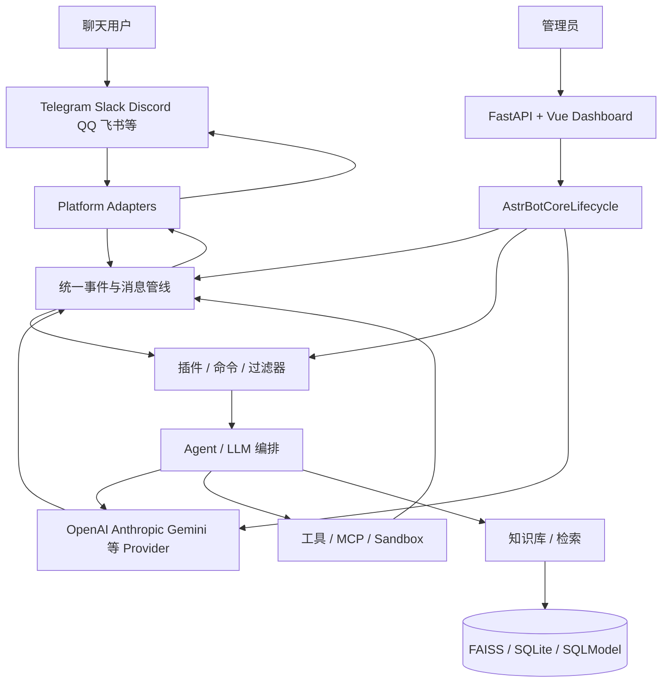
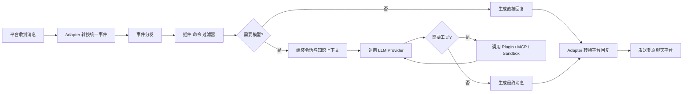
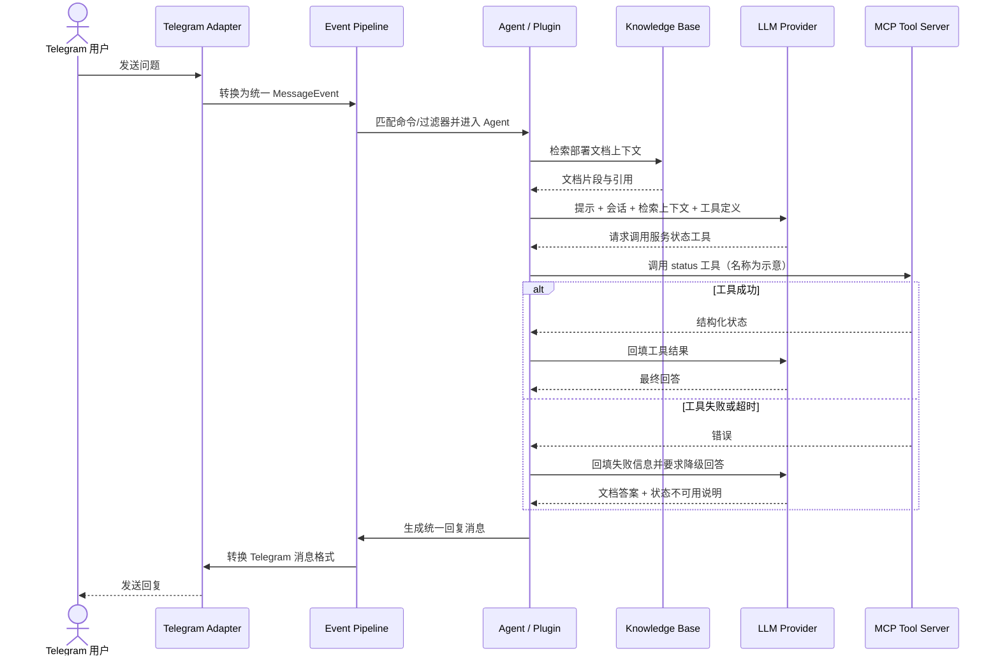

# AstrBotDevs/AstrBot 项目深度解析

## 1. 项目概览

- 报告日期：2026-07-22
- 仓库地址：https://github.com/AstrBotDevs/AstrBot
- Trending 原始排名：7
- Stars Today：416
- 项目定位：多平台 LLM Chatbot 与 Agent 开发框架，统一连接即时通信渠道、模型 Provider、插件、MCP、知识库和 Web 管理界面。
- 解决的问题：不同聊天平台的事件格式、回复接口和权限模型不同；模型、工具、知识库与插件也各有接入方式，单独开发会产生大量重复适配代码。
- 目标用户：个人机器人用户、社区运营者、企业内部自动化团队、Agent 与插件开发者。
- 当前成熟度：成熟活跃项目。版本、插件和多渠道支持丰富，但多集成也带来更大的配置与安全面。
- 推荐结论：适合研究异步多渠道消息总线、插件式 Agent Runtime 与统一 Provider 抽象；上线前应限制插件、模型密钥和消息平台权限。

## 2. 系统架构

### 2.1 架构概览

AstrBot 由 Python 异步核心、平台适配器、事件/插件管线、模型 Provider、工具与 MCP、知识库、数据层和 Web Dashboard 组成。`main.py` 完成运行目录和 Dashboard 准备后，通过 `InitialLoader` 初始化 `AstrBotCoreLifecycle`，并并发运行核心任务与 Dashboard。即时通信适配器把平台消息转换为统一事件，事件经过插件、命令和过滤器处理，再进入 LLM/Agent 调用链，最终由原平台适配器发送回复。

### 2.2 架构图

### 2.3 核心模块

| 模块 | 职责 | 代码位置 | 关键依赖 | 证据级别 |
|---|---|---|---|---|
| 进程入口 | 环境检查、目录创建、Dashboard 文件准备和生命周期启动 | `main.py`, `runtime_bootstrap.py` | asyncio | High |
| 生命周期 | 初始化核心组件、运行核心任务、Dashboard 和优雅停止 | `astrbot/core/core_lifecycle.py`, `initial_loader.py` | asyncio | High |
| 平台适配器 | 接收并发送不同 IM 平台消息 | `astrbot/core/platform/` 及平台模块 | Telegram、Slack、Discord、QQ、飞书等 SDK | Medium |
| 事件与插件 | 统一事件、命令、过滤器和扩展点 | `astrbot/core/star/`, `astrbot/builtin_stars/` | 插件上下文 | Medium |
| Provider 与 Agent | 模型请求、工具调用、Agent 循环和结果生成 | `astrbot/core/provider/`, pipeline/agent 相关模块 | OpenAI、Anthropic、Google SDK | Medium |
| MCP 与工具 | 外部工具协议和本地/远程能力接入 | MCP 相关模块 | `mcp>=1.8` | High |
| 知识库 | 文档解析、Embedding、检索和引用 | 知识库相关模块 | FAISS、BM25、jieba、PDF/Office 解析 | Medium |
| 数据层 | 配置、会话、持久状态与异步数据库访问 | DB 模块 | SQLModel、SQLAlchemy、aiosqlite | High |
| Dashboard | 管理配置、插件、Provider、日志和运行状态 | `astrbot/dashboard/`, `dashboard/` | FastAPI、Vue 构建产物 | High |

### 2.4 数据与状态管理

- `main.py` 创建 config、plugins、temp、knowledge_base 和 site-packages 等运行目录。
- SQLModel/SQLAlchemy 与 aiosqlite 提供异步持久化能力；具体实体需按模块继续追踪。
- FAISS、BM25 与文本解析依赖支撑知识库检索。
- 插件和 Dashboard 配置保存在数据目录，运行时由生命周期加载。
- 消息事件在异步管线中传递，短期状态、会话上下文和 Provider 响应由相应组件管理。

### 2.5 外部集成与协议

- IM：Telegram、Slack、Discord、钉钉、飞书、QQ 等。
- LLM：OpenAI、Anthropic、Gemini、DashScope 及兼容接口。
- MCP：连接外部工具和服务。
- Dashboard：FastAPI 服务与 Vue 静态前端。
- 文档与知识：PDF、Office、Markdown 等解析链。

### 2.6 部署与运行形态

- Python CLI：`astrbot` 或直接运行 `main.py`。
- Docker/Compose：标准自托管方式。
- Kubernetes：仓库包含 `k8s/` 配置。
- 桌面打包：构建系统可捆绑 Dashboard；具体桌面运行边界需按发布包验证。

## 3. 主线流程

### 3.1 核心流程图

### 3.2 关键步骤

1. 平台适配器监听消息并转换为 AstrBot 统一事件。
2. 事件管线匹配命令、过滤器和插件处理器。
3. 若进入 Agent/LLM 流程，系统组装会话、系统提示、知识库和工具定义。
4. Provider 调用外部或本地模型；模型可能返回工具调用。
5. 工具可由插件、MCP 或沙盒执行，结果重新进入模型循环。
6. 最终回复被转换为平台支持的文本、图片、语音或消息段并发送。

### 3.3 异常与失败处理

- 生命周期初始化失败时 `InitialLoader` 记录 critical 日志并停止继续启动。
- Dashboard 文件损坏时可用捆绑版本、重新下载或在失败后仅关闭 WebUI，不必终止核心。
- Provider、平台和工具错误由各异步边界处理；完整的重试与用户提示策略因 Provider/插件而异。
- 插件异常不应拖垮整个事件循环，但具体隔离强度需逐插件和执行器验证。

## 4. 典型业务场景端到端执行链路

### 4.1 场景定义

| 项目 | 内容 |
|---|---|
| 场景名称 | Telegram 用户询问内部文档问题，Agent 检索知识库并通过 MCP 工具补充状态后回复 |
| 参与者 | Telegram 用户、平台 Adapter、事件管线、插件/Agent、知识库、LLM Provider、MCP Server |
| 前置条件 | Telegram Bot、模型 Provider、知识库和 MCP 工具已由管理员配置；相关插件启用 |
| 输入 | 用户文本“请说明部署流程，并查询当前服务状态”（示意，不是官方固定命令） |
| 期望结果 | Agent 返回带知识库依据和工具状态的回复，并在原 Telegram 会话中可见 |
| 成功判定 | 消息被正确路由；检索与工具调用有结果；最终回复发送成功；失败时用户收到可解释提示 |

### 4.2 端到端时序图

### 4.3 执行步骤追踪

| 步骤 | 输入 | 执行组件 | 关键代码位置 | 状态或数据变化 | 输出 | 失败分支 | 证据级别 |
|---:|---|---|---|---|---|---|---|
| 1 | Telegram Update | 平台 Adapter | 平台模块、Telegram SDK 依赖 | 外部消息变为统一事件 | MessageEvent | 鉴权/网络错误导致事件不进入 | Medium |
| 2 | MessageEvent | Event Pipeline | `astrbot/core/star/`, built-in stars | 匹配插件、命令和过滤器 | Agent 请求上下文 | 无匹配时走默认处理或忽略 | Medium |
| 3 | 用户问题 | 知识库组件 | 知识库模块、FAISS/BM25 依赖 | 查询向量/文本索引 | 文档片段 | 无召回时返回空上下文 | Medium |
| 4 | 会话+上下文 | Provider/Agent | Provider 与 Agent 模块 | 创建模型请求与工具定义 | 模型响应 | Provider 429/超时/鉴权失败 | Medium |
| 5 | Tool Call | MCP Client | MCP 相关模块 | 外部工具执行；本地状态不一定持久化 | 结构化结果 | 超时或协议错误进入降级回答 | Medium |
| 6 | 工具结果 | Agent / LLM | Agent Loop | 工具结果加入会话 | 最终回答 | 模型再次请求工具时继续循环并受上限约束 | Medium |
| 7 | 统一回复 | Platform Adapter | 平台发送接口 | 平台会话新增 Bot 消息 | 用户可见消息 | 格式/大小不兼容时需降级为文本 | Medium |

### 4.4 关键状态与数据变化

- 会话上下文新增用户消息、知识片段、工具调用与工具结果。
- 知识库只读取索引；本场景没有证据表明查询会修改向量库。
- MCP 工具可能读取外部服务状态；是否写入外部系统取决于具体工具，本示例只选择只读状态查询。
- 平台会话最终新增一条 Bot 回复。

### 4.5 失败传播、重试与回滚

- Provider 或 MCP 的重试策略可能使用 `tenacity`，但具体次数与条件需按对应模块配置确认。
- 只读工具失败不需要业务回滚，Agent 应向用户说明状态数据不可用。
- 若知识库无结果，可以退回普通模型回答，但必须避免声称内部文档支持了该结论。
- 平台发送失败时应记录日志；是否有消息重投队列未在本次静态分析中确认。

### 4.6 最终业务结果

用户在原 Telegram 会话中得到一条综合内部文档和实时状态的回答。工具不可用时，系统仍可返回文档部分并清楚标明实时状态缺失，而不是为了“显得聪明”编出一台运行良好的服务器。

### 4.7 最小复现与验证方法

1. 使用 Docker 或 Python 启动 AstrBot，确认 Dashboard 与 CoreLifecycle 都运行。
2. 配置一个 Telegram Bot、一个测试模型 Provider 和一个小型知识库。
3. 接入只读 MCP 示例工具；工具名和参数按实际 Server 定义，不使用本报告示意名称。
4. 发送问题并观察日志中的平台事件、检索、模型请求、工具调用和回复。
5. 停止 MCP Server，重复消息，验证降级提示与核心进程稳定性。

## 5. 技术栈

| 层次 | 技术 | 用途 | 是否核心 | 证据位置 |
|---|---|---|---|---|
| 语言与运行时 | Python 3.12、asyncio | 核心运行时与并发 | 是 | `pyproject.toml`, `main.py` |
| Web 管理 | FastAPI、Vue Dashboard | 配置、插件、日志与状态 | 是 | dependencies、dashboard 目录 |
| 数据 | SQLModel、SQLAlchemy、aiosqlite | 配置和业务持久化 | 是 | `pyproject.toml` |
| 检索 | FAISS、BM25、jieba | 知识库语义与关键词检索 | 可选核心 | dependencies |
| 模型 | OpenAI、Anthropic、Google、DashScope | LLM Provider | 是 | dependencies |
| 协议 | MCP、WebSocket、各 IM SDK | 工具和消息平台接入 | 是 | dependencies |
| 插件 | Star/Plugin Context | 命令、过滤器与扩展 | 是 | `astrbot/core/star/` |
| 部署 | Docker、Compose、Kubernetes | 自托管与集群部署 | 可选 | 仓库根目录与 `k8s/` |

## 6. 创新点

### 创新点 1

- 类型：架构与工程整合创新
- 传统方案：每个聊天平台单独编写机器人，再分别接模型、知识库和工具。
- 当前方案：统一事件模型、Provider、插件和工具层，让多个平台共享 Agent 能力。
- 实际收益：减少重复适配，并允许同一插件跨渠道复用。
- 证据：多平台 SDK、插件上下文和统一生命周期结构。
- 局限：最低公共抽象可能无法覆盖所有平台特性，适配器复杂度仍然存在。

### 创新点 2

- 类型：开发体验创新
- 传统方案：机器人配置散落在代码与环境变量中。
- 当前方案：Web Dashboard、插件市场/目录和统一配置管理。
- 实际收益：非核心开发者也能完成 Provider、渠道和插件配置。
- 证据：Dashboard 构建与启动流程、README 产品能力。
- 局限：可视化配置会增加版本兼容和敏感信息保护要求。

## 7. 应用场景

### 适合

- 多聊天平台共享的知识库与问答机器人。
- 个人 Agent、社区机器人和内部通知/查询助手。
- 插件、MCP 与多 Provider 集成研究。

### 可以尝试

- 需要人工审批的业务操作 Agent。
- 受控沙盒内的代码、文档或运维工具调用。
- Kubernetes 环境的多实例运行，但需验证会话与任务状态共享。

### 暂不建议

- 未做权限模型与插件审计就接入企业核心数据。
- 允许未知插件直接执行宿主机高权限命令。
- 对消息必达、严格审计和多租户隔离有强合规要求但未完成二次工程的场景。

## 8. 第一次阅读与验证建议

1. 先读 README 与官方部署文档。
2. 跟踪 `main.py` → `InitialLoader.start()` → `AstrBotCoreLifecycle.initialize/start()`。
3. 选择一个平台 Adapter，追踪消息进入统一事件的过程。
4. 选择默认 Agent/Provider 流程，定位模型与工具调用。
5. 用一个只读 MCP 工具复现成功和超时两个分支。

## 9. 风险与限制

- 安全：插件、MCP、本地工具和 IM 权限可形成高权限组合；密钥与文件系统必须隔离。
- 性能：多平台并发、长上下文、知识检索和媒体处理会消耗内存与模型配额。
- 许可证：AGPL-3.0-or-later，网络服务修改版的发布义务需评估；部分平台 SDK 另有条款。
- 维护状态：活跃但集成面广，上游平台 API 变化会持续带来维护成本。
- 生产可用性：适合候选评估，强合规、多租户和消息必达场景需要额外架构。

## 10. Evidence Notes

- `pyproject.toml` 明确 Python、数据库、检索、MCP、Provider 与 IM SDK 依赖。
- `main.py` 明确运行目录、Dashboard 准备和 `InitialLoader` 启动。
- `initial_loader.py` 明确初始化 CoreLifecycle，并并发运行核心任务与 Dashboard。
- 平台事件到 Agent 的细节基于仓库模块边界和框架职责，未逐一覆盖所有渠道实现。

## 11. Honest Caveat

本报告没有配置真实 Telegram、模型密钥、知识库和 MCP Server，也没有逐文件跟踪所有事件处理器。典型业务输入与只读 `status` 工具名称是示意；架构中的数据库、FAISS、MCP 和平台 SDK 均有依赖证据，但具体会话表、重试次数和插件隔离强度需要进一步运行验证。

## 12. 可信度

- Architecture Confidence: High
- Flow Confidence: Medium
- Innovation Confidence: Medium
