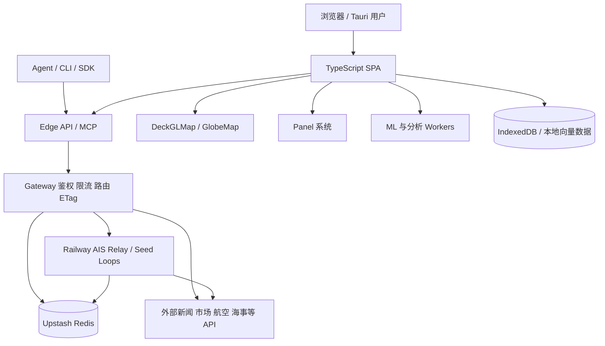
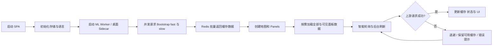
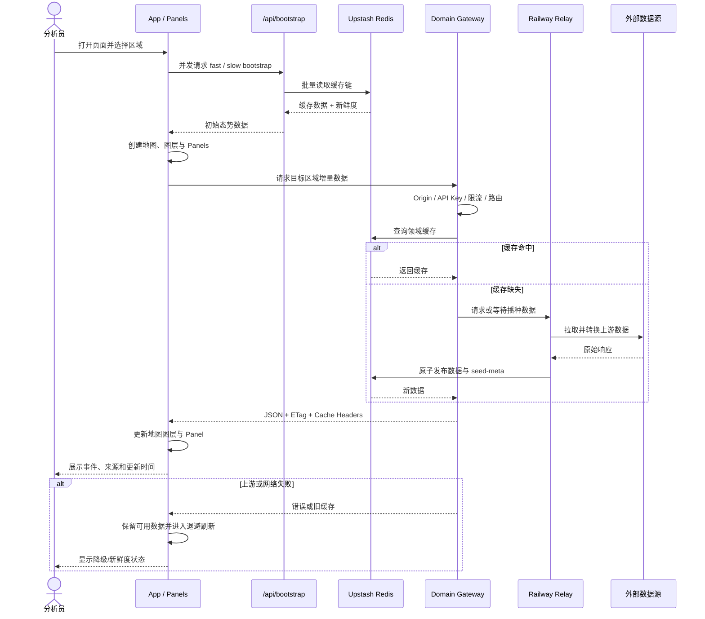

# koala73/worldmonitor 项目深度解析

## 1. 项目概览

- 报告日期：2026-07-22
- 仓库地址：https://github.com/koala73/worldmonitor
- Trending 原始排名：1
- Stars Today：1,295
- 项目定位：实时全球情报与态势感知平台，把多源事件、市场、航空、海事、网络安全和气候数据组织到统一地图、面板与 Agent 接口。
- 解决的问题：数据分散在不同 API、新闻源和专业网站中，人工切换成本高，跨领域关联困难，实时刷新与上游故障也难统一处理。
- 目标用户：OSINT 研究者、风险与安全团队、新闻分析人员、市场观察者、需要结构化全球事件上下文的 Agent 开发者。
- 当前成熟度：生产候选。系统模块、部署拓扑、测试和协议较完整，但外部数据源质量与授权仍需按场景评估。
- 推荐结论：适合研究高信息密度实时前端、多源数据聚合、Edge API、缓存和桌面/Agent 多入口架构；不应把统一界面误解为数据绝对准确。

## 2. 系统架构

### 2.1 架构概览

World Monitor 的核心是 TypeScript SPA。浏览器或 Tauri 桌面端启动后，从 Edge API 和 Bootstrap 接口获取聚合数据，使用 DeckGLMap、GlobeMap 和大量 Panel 呈现。Vercel Edge Functions 负责鉴权、限流、路由、缓存头和领域网关；Railway Relay 承担 AIS WebSocket、数据播种和部分代理；Upstash Redis 保存缓存、种子元数据、限流状态并做请求合并。Web Workers 在客户端执行新闻聚类、相关性分析和 ONNX 推理。MCP、CLI 与 SDK 共用结构化领域能力。

### 2.2 架构图

### 2.3 核心模块

| 模块 | 职责 | 代码位置 | 关键依赖 | 证据级别 |
|---|---|---|---|---|
| 应用入口与生命周期 | 初始化监控、主题、存储、Worker、Bootstrap、布局与轮询 | `src/main.ts`, `src/App.ts`, `src/app/` | Vite、Sentry、Vercel Analytics | High |
| 地图层 | 平面与三维地球渲染、地图图层和交互 | `src/components/DeckGLMap.ts`, `GlobeMap.ts` | deck.gl、MapLibre、globe.gl | High |
| 面板体系 | 展示领域数据，统一内容更新和布局持久化 | `src/components/Panel.ts`, `src/components/` | DOM、localStorage | High |
| Edge 网关 | Origin、CORS、API Key、限流、路由、ETag 和错误边界 | `server/gateway.ts`, `api/` | Vercel Edge、Proto/RPC | High |
| 缓存与数据服务 | Redis 缓存、请求合并、种子元数据、Bootstrap 批量读取 | `server/_shared/redis.ts`, `api/bootstrap*` | Upstash Redis | High |
| Relay 与播种 | AIS WebSocket、市场/航空/风险等循环抓取和缓存发布 | `scripts/ais-relay.cjs`, `scripts/seed-*.mjs` | Railway、外部 API | High |
| 客户端分析 | 聚类、相关性、Embedding、情绪与摘要 | `src/workers/analysis.worker.ts`, `ml.worker.ts` | ONNX、Transformers.js | High |
| Agent 接口 | MCP、CLI、SDK、领域 RPC 客户端 | `api/mcp.ts`, `cli/`, `sdk/`, `proto/` | MCP、Protocol Buffers | High |

### 2.4 数据与状态管理

- `AppContext` 是前端中央可变状态对象，保存地图、Panel、设置、缓存数据和在途请求，没有引入外部状态库。
- URL 状态通过 `src/utils/urlState.ts` 双向同步；布局和偏好使用 localStorage。
- IndexedDB 用于本地数据与向量存储，`vector-db.ts` 支持语义检索。
- Redis 保存领域缓存、`seed-meta:<key>` 新鲜度信息、限流状态并提供 stampede protection。
- `/api/bootstrap` 批量读取缓存，以 fast/slow 两档并行水合 SPA。

### 2.5 外部集成与协议

- 数据源包括 Finnhub、Yahoo、GDELT、ACLED、UCDP、FIRMS、OpenSky、CoinGecko 等。
- Proto 定义通过 sebuf 生成 TypeScript 客户端、服务端类型和 OpenAPI。
- Edge API 同时处理领域 RPC 和认证、订阅、通知、MCP 等手写运营接口。
- 桌面端通过 Tauri 2 与 Node Sidecar 访问本地或远程能力。

### 2.6 部署与运行形态

- Vercel：SPA、Edge Functions 和 Middleware。
- Railway：AIS Relay、播种任务与 Consumer Prices 服务。
- Upstash Redis：缓存、限流与新鲜度状态。
- Tauri：macOS、Windows、Linux 桌面应用。
- GHCR Docker 镜像：Nginx 提供 SPA，并代理 API。
- Convex：联系表单和候补名单；该组件不参与核心情报数据管线。

## 3. 主线流程

### 3.1 核心流程图

### 3.2 关键步骤

1. `src/main.ts` 初始化运行时补丁、主题、监控并创建 `App`。
2. `App.init()` 按八个阶段准备 IndexedDB、i18n、ML Worker、Sidecar、Bootstrap、布局、UI 和轮询。
3. `/api/bootstrap` 从 Redis 批量读取已播种数据，前端用两个超时档位并行水合。
4. `PanelLayoutManager`、地图和各领域 Panel 消费水合数据，并对可见区域优先补充请求。
5. `startSmartPollLoop()` 根据页面可见性、面板位置和失败次数控制刷新频率。
6. Edge Gateway 在访问上游前完成 Origin、API Key、限流、路由和缓存处理。

### 3.3 异常与失败处理

- Bootstrap fast/slow 使用独立超时与 AbortController，一个档位失败不必阻塞全部首屏。
- Gateway 用统一错误边界，并可通过 ETag 返回 304，减少重复传输。
- Redis 缓存和请求合并避免同一 key 在缓存失效时同时打爆上游。
- 智能轮询失败后指数退避，标签页隐藏时暂停，恢复可见时错峰刷新。
- 数据是否“旧但可用”需要 UI 明确显示新鲜度；仓库提供 seed-meta，但具体 Panel 的提示完整度需要逐一核验。

## 4. 典型业务场景端到端执行链路

### 4.1 场景定义

| 项目 | 内容 |
|---|---|
| 场景名称 | 分析员打开全球态势图，查看特定区域的冲突事件与航班异常 |
| 参与者 | 分析员、SPA、Bootstrap API、Edge Gateway、Redis、Railway Relay、外部数据源、地图与 Panel |
| 前置条件 | 应用已部署；Redis 中可能有播种缓存；外部数据源凭据与限流配置有效 |
| 输入 | 用户打开页面并缩放到目标区域；区域和筛选参数为示意，具体 URL 状态由应用生成 |
| 期望结果 | 地图与事件面板显示可用的冲突、新闻和航空数据，并持续刷新 |
| 成功判定 | 首屏在超时范围内完成基础水合；目标 Panel 有数据或明确空状态；刷新失败不会使整页失效 |

### 4.2 端到端时序图

### 4.3 执行步骤追踪

| 步骤 | 输入 | 执行组件 | 关键代码位置 | 状态或数据变化 | 输出 | 失败分支 | 证据级别 |
|---:|---|---|---|---|---|---|---|
| 1 | 页面加载 | `src/main.ts` / `App.init()` | `src/main.ts`, `src/App.ts` | 建立 AppContext、存储和 Worker | 应用初始化 | WebUI 或 Worker 初始化失败时降级 | High |
| 2 | Bootstrap 请求 | `/api/bootstrap` | `api/bootstrap*`, `server/_shared/redis.ts` | 从 Redis 读取多组缓存 | 初始数据包 | 3s/5s 超时后部分水合 | High |
| 3 | 初始数据 | Panel 与地图系统 | `PanelLayoutManager`, `DeckGLMap.ts`, `GlobeMap.ts` | 生成图层和面板状态 | 首屏态势图 | 某领域无数据时显示空/降级状态 | High |
| 4 | 区域与筛选 | Domain Gateway | `server/gateway.ts` | 完成认证、限流和路由 | 领域请求 | 403、429 或路由错误 | High |
| 5 | 缓存键 | Redis / handler | `server/worldmonitor/**`, `server/_shared/redis.ts` | 命中缓存或合并在途请求 | 领域 JSON | 缓存缺失时访问 Relay/上游 | High |
| 6 | 上游原始数据 | Relay / Seed | `scripts/ais-relay.cjs`, `scripts/seed-*.mjs` | 转换并原子写入缓存和 seed-meta | 标准化数据 | 锁冲突、校验失败或上游异常时不覆盖好数据 | High |
| 7 | JSON 响应 | SPA | Panel、Map Layer 定义 | 更新 AppContext、图层和 DOM | 可交互结果 | 请求失败触发退避和保留旧状态 | High |

### 4.4 关键状态与数据变化

- Redis：领域缓存从缺失/旧值变为新数据，并写入 `seed-meta` 的抓取时间和记录数。
- AppContext：目标领域的缓存、图层和在途请求状态被更新。
- 地图：目标区域的点、路径、热力或多边形图层重新渲染。
- 浏览器本地：URL、布局、主题或 Panel 尺寸可能写入 URL/localStorage；分析向量可能进入 IndexedDB。

### 4.5 失败传播、重试与回滚

- 上游失败不会进行传统数据库事务回滚；关键策略是“不用坏数据覆盖好缓存”。
- 智能轮询逐步退避，最多放大到基础间隔的 4 倍。
- 缓存 stampede protection 让同一 key 的并发请求共享一次上游抓取。
- 标签页隐藏时暂停刷新，避免后台持续消耗配额。
- 若只有旧缓存，业务上应显示新鲜度，不能把“最后一次成功”伪装成实时数据。

### 4.6 最终业务结果

分析员得到统一地图和面板中的区域事件视图，可以同时观察新闻、冲突与航空异常，并继续通过筛选、地图交互或 Agent 接口深入查询。系统价值不在单个数据源，而在统一契约、缓存、时序和可视化组织。

### 4.7 最小复现与验证方法

1. 按 README 启动本地 Web 开发环境，确认 `src/main.ts` 和 `App.init()` 完成首屏。
2. 在浏览器 Network 面板观察 `/api/bootstrap` 与目标领域 API 的请求顺序、超时和 ETag。
3. 暂时断开一个可配置上游或模拟 429/500，观察 Redis 缓存、Panel 状态和轮询退避。
4. 对照 `ARCHITECTURE.md`、`server/gateway.ts` 与 seed 脚本，确认时序图中的每个节点都能定位到代码。

## 5. 技术栈

| 层次 | 技术 | 用途 | 是否核心 | 证据位置 |
|---|---|---|---|---|
| 语言与构建 | TypeScript、Vite | SPA、API 和共享类型 | 是 | `package.json`, `src/`, `server/` |
| 地图渲染 | deck.gl、MapLibre、globe.gl | 平面地图与三维地球 | 是 | `DeckGLMap.ts`, `GlobeMap.ts` |
| 边缘服务 | Vercel Edge Functions | 领域网关和运营 API | 是 | `api/`, `vercel.json` |
| Relay | Node.js / Railway | WebSocket 代理和持续播种 | 是 | `scripts/ais-relay.cjs` |
| 缓存 | Upstash Redis | 聚合缓存、限流、锁和新鲜度 | 是 | `server/_shared/redis.ts` |
| 客户端 AI | ONNX / Transformers.js | Embedding、聚类、情绪和摘要 | 可选增强 | `src/workers/ml.worker.ts` |
| 协议 | Protobuf / sebuf / OpenAPI / MCP | 结构化 API 与 Agent 接入 | 是 | `proto/`, `api/mcp.ts` |
| 桌面 | Tauri 2 + Node Sidecar | 跨平台桌面运行 | 可选 | `src-tauri/` |
| 本地状态 | IndexedDB、localStorage | 向量数据、布局和偏好 | 是 | `vector-db.ts`, `AppContext` |

## 6. 创新点

### 创新点 1

- 类型：架构创新 / 工程整合创新
- 传统方案：不同领域各开独立网站或 API，跨域关联靠人工。
- 当前方案：统一领域契约、缓存、地图图层和面板模型，浏览器、桌面、MCP 与 SDK 共用能力。
- 实际收益：同一事件可在新闻、市场、地理和基础设施维度中交叉观察。
- 证据：`ARCHITECTURE.md`、Proto/RPC 生成链和多 Variant 配置。
- 局限：统一模型仍受上游数据语义和质量差异约束。

### 创新点 2

- 类型：性能与可靠性工程
- 传统方案：前端面板各自直接请求上游，容易触发限流和并发风暴。
- 当前方案：Bootstrap 批量水合、Redis 请求合并、Seed Loop、ETag、视口条件轮询和退避。
- 实际收益：降低首屏请求数量、重复流量和上游故障扩散。
- 证据：`server/gateway.ts`、`server/_shared/redis.ts`、`startSmartPollLoop()`。
- 局限：缓存层和多个部署平台增加运维复杂度。

## 7. 应用场景

### 适合

- 多源 OSINT、风险与事件观察。
- 需要地图和时间维度的企业态势界面。
- Agent 需要结构化全球事件数据，而不是网页抓取碎片。

### 可以尝试

- 企业内部专有数据与公开数据叠加。
- 面向行业的 finance、tech、happy 等 Variant 二次开发。
- 离线或受限网络环境的桌面部署。

### 暂不建议

- 直接作为未经人工复核的危机决策唯一来源。
- 对数据许可、地理精度和实时性有强法律承诺的场景。
- 无能力维护多上游密钥、缓存与部署平台的小团队全量自建。

## 8. 第一次阅读与验证建议

1. 先读 `ARCHITECTURE.md` 和 `CONCEPTS.md`。
2. 再跟踪 `src/main.ts` → `App.init()` → `/api/bootstrap`。
3. 阅读 `server/gateway.ts` 与 `server/_shared/redis.ts` 理解服务边界。
4. 选择一个 Panel，对应追到领域 handler 和外部数据源。
5. 用浏览器 Network 与 Redis 新鲜度数据复现典型场景。

## 9. 风险与限制

- 安全：多上游 API Key、MCP、订阅和用户接口需要严格隔离；桌面 Sidecar 扩大本地权限面。
- 性能：地图图层、Panel 和客户端 ML 同时运行会增加内存与 GPU 压力。
- 许可证：AGPL-3.0-only 对网络服务修改版有源代码提供义务，商业集成需评估。
- 维护状态：活跃且模块众多，升级可能涉及生成代码、缓存键和部署拓扑同步。
- 生产可用性：适合研究和候选部署，但数据源 SLA 与准确性不由项目统一担保。

## 10. Evidence Notes

- `ARCHITECTURE.md` 明确列出部署拓扑、App 八阶段初始化、网关管线、缓存层、Proto 生成和 Seed Loop。
- `src/main.ts`、`src/App.ts`、`server/gateway.ts`、`server/_shared/redis.ts` 是本报告主链路的核心代码位置。
- README、GitHub Explore 与仓库 About 对项目定位相互一致。

## 11. Honest Caveat

本报告是源码与官方架构文档的静态分析，没有部署完整的 Vercel、Railway、Upstash 和所有外部数据源，也没有独立核对 65+ 数据提供方的许可、覆盖率与实时性。典型区域与筛选参数为示意，调用顺序依据仓库明确记录的 Bootstrap、Gateway、Redis 和 Polling 流程。

## 12. 可信度

- Architecture Confidence: High
- Flow Confidence: High
- Innovation Confidence: Medium
