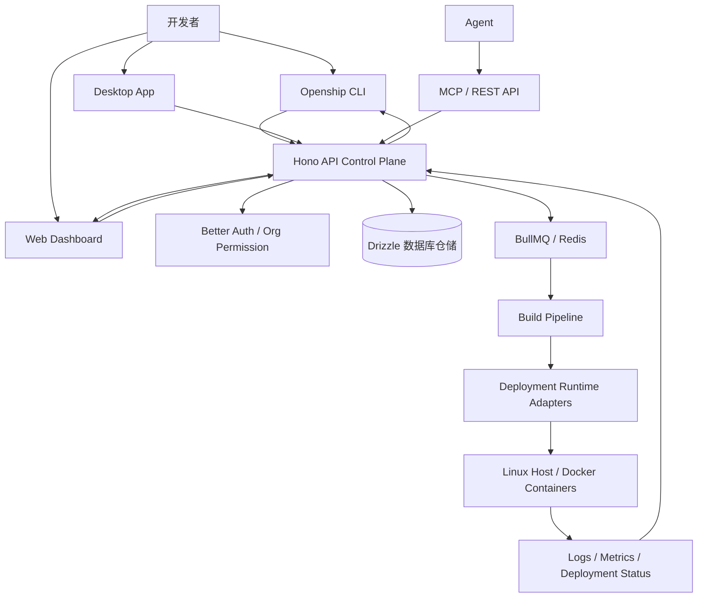
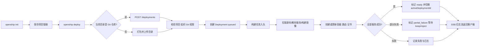
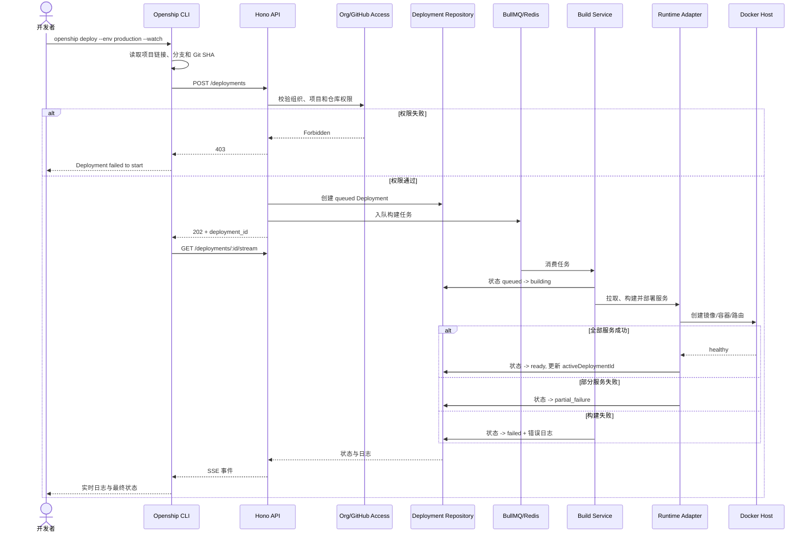

# oblien/openship 项目深度解析

## 1. 项目概览

- 报告日期：2026-07-22
- 仓库地址：https://github.com/oblien/openship
- Trending 原始排名：6
- Stars Today：1,562
- 项目定位：开源、自托管的应用部署控制面，内置 CI/CD，通过桌面端、Web、CLI、REST API 和 MCP 管理代码构建、容器、数据服务、域名和部署历史。
- 解决的问题：小团队常把 GitHub Actions、Docker、反向代理、证书、数据库、备份和日志拼成一套脆弱脚本；Openship 试图把这些动作收进统一项目与部署模型。
- 目标用户：独立开发者、小中型团队、自托管用户、希望减少 PaaS 费用但不想手工维护整套流水线的工程团队。
- 当前成熟度：生产候选。README 声称核心 production-ready，但多节点、私有网络和高级监控仍在路线图。
- 推荐结论：适合研究自托管 PaaS、部署状态机和多入口控制面；生产采用前必须审查主机权限、任务队列、数据库备份、升级和故障恢复。

## 2. 系统架构

### 2.1 架构概览

Openship 是 Bun/Turbo 管理的 TypeScript Monorepo。CLI、桌面端和 Web Dashboard 都调用 API 控制面。API 以 Hono 运行，使用 Better Auth 和组织级权限处理请求，通过数据库仓储保存项目、部署、服务和活动记录；耗时构建与部署任务由 BullMQ/Redis 等队列机制和运行时适配器处理。目标 Linux 主机通过 Docker/SSH 等能力运行容器。SSE/WebSocket 或日志流将构建状态反馈给 CLI 与 Dashboard。

### 2.2 架构图

### 2.3 核心模块

| 模块 | 职责 | 代码位置 | 关键依赖 | 证据级别 |
|---|---|---|---|---|
| CLI | 初始化项目、触发部署、上传目录、跟随日志 | `apps/cli/src/commands/`, `apps/cli/src/lib/` | Commander、API Client | High |
| API 控制面 | 认证、项目、部署、域名、备份、邮件等服务接口 | `apps/api/src/index.ts`, `apps/api/src/modules/` | Hono、Better Auth、TypeBox/Zod | High |
| 部署服务 | 部署 CRUD、权限检查、回滚、拒绝、清理资源 | `apps/api/src/modules/deployments/` | DB repos、runtime adapters | High |
| 构建与任务 | 构建流水线、后台任务和状态推进 | `build.service.ts`, queue/worker 相关模块 | BullMQ、Redis | High |
| 数据层 | 项目、部署、服务、检查运行等 Schema 与 Repository | `packages/db/src/schema/`, `packages/db/src/repos/` | Drizzle | High |
| Runtime Adapters | 把统一部署动作转换为主机、容器、路由和资源操作 | `packages/adapters/`, `apps/api/src/lib/deployment-runtime` | Docker/SSH 等 | Medium |
| Dashboard | 项目、服务、部署日志与状态界面 | `apps/dashboard/` | TypeScript、React/Next.js 体系 | High |
| Desktop | 本地控制面与 GUI | `apps/desktop/` | 桌面打包工具 | Medium |
| 文档与网站 | 安装、CLI、API 和产品说明 | `apps/web/content/docs/` | 文档站点 | High |

### 2.4 数据与状态管理

- 数据库 Repository 保存 Project、Deployment、Service、Deployment Check Run 等业务实体。
- Deployment 有 `queued`、`building`、`deploying`、`ready`、`partial_failure`、`rejected` 等状态语义。
- Project 的 `activeDeploymentId` 指向当前真实运行版本；删除活动部署时宁可清空指针，也不假装已停止的旧版本仍在线。
- BullMQ 与 Redis 用于后台任务、队列和部署工作协调；API 包依赖清单已明确包含二者。
- 部署记录与日志在 Reject 后仍保留，便于审计和复盘。

### 2.5 外部集成与协议

- GitHub 仓库访问与 OAuth，用于读取仓库和触发部署。
- Linux 主机、Docker/Compose 与域名/SSL 相关系统能力。
- REST API、CLI 和 MCP 是外部控制入口。
- Stripe、邮件、GeoIP 等模块存在于 API，但不是每次部署主链路的必经组件。

### 2.6 部署与运行形态

- 个人本地模式：桌面端或本机控制面通过 SSH 管理自己的服务器，控制面不必公开。
- 团队模式：在服务器运行常驻 API 和 Dashboard，支持远程访问与 Push-to-deploy。
- Docker Compose：仓库提供自托管 Compose 入口。
- Openship Cloud：README 描述的托管模式；本报告未验证其服务 SLA。

## 3. 主线流程

### 3.1 核心流程图

### 3.2 关键步骤

1. `openship init` 把本地目录关联到项目；链接通常记录在 `.openship/project.json`。
2. `openship deploy` 检查是否位于 Git 仓库，自动选择 Git Source 或 Folder Upload 路径。
3. Git 路径向 `/deployments` POST allowlist 字段，包括 projectId、branch、commitSha、environment 和 smart routing 选项。
4. API 校验组织、项目和 GitHub Repo 权限，创建 Deployment 后返回 202 与 deployment id。
5. 后台构建/部署模块推进状态，运行适配器创建容器、路由和附属资源。
6. CLI `--watch` 连接部署 SSE 流，直到 ready、failure 或 cancelled。
7. 部分失败的 Compose 部署可由用户 keep 或 reject；reject 保留记录和日志，并回滚或清除活动指针。

### 3.3 异常与失败处理

- CLI 在环境参数、项目链接或 API 请求失败时直接给出错误并退出非零状态。
- 进行中的部署不能直接删除，必须先 Cancel，避免状态与运行资源脱节。
- Reject 只允许作用于 `ready` 或 `partial_failure`，并保留 Deployment Row 与 Build Session。
- 若存在前一活动版本，Reject 可调用 Rollback 恢复；不存在前驱时清空活动指针，诚实回到 draft。
- 部署资源清理由 Manifest 收集后执行，防止只删数据库记录而留下容器或路由。

## 4. 典型业务场景端到端执行链路

### 4.1 场景定义

| 项目 | 内容 |
|---|---|
| 场景名称 | 开发者从已关联 Git 仓库部署生产分支并实时查看构建日志 |
| 参与者 | 开发者、CLI、API 控制面、权限模块、数据库、任务队列、构建服务、运行时适配器、Linux/Docker 主机 |
| 前置条件 | 已执行 `openship init`；控制面可用；项目和目标主机已配置；调用者拥有项目权限 |
| 输入 | `openship deploy --env production --watch`；命令为官方格式，具体项目 ID 与分支由链接或 Git 获取 |
| 期望结果 | 新 Deployment 被创建、构建并上线，CLI 持续输出日志，项目活动版本指向新 Deployment |
| 成功判定 | API 返回 deployment id；最终状态为 ready；容器/路由可访问；`activeDeploymentId` 与新部署一致 |

### 4.2 端到端时序图

### 4.3 执行步骤追踪

| 步骤 | 输入 | 执行组件 | 关键代码位置 | 状态或数据变化 | 输出 | 失败分支 | 证据级别 |
|---:|---|---|---|---|---|---|---|
| 1 | CLI 参数 | Deploy Command | `apps/cli/src/commands/deploy.ts` | 无持久化；解析 env、project、branch | 请求 Body | env 非 production/preview 时退出 | High |
| 2 | 当前目录 | CLI Git/Folder 检测 | `deploy.ts`, `folder-deploy.ts` | 选择 Git 或 Folder Path | Git 元数据或上传包 | Git 读取失败可走非 Git 路径，指定 Git-only 选项时失败 | High |
| 3 | POST Body | API Controller / Auth | `apps/api/src/modules/deployments/`, GitHub access helpers | 校验组织和仓库权限 | 202 或 4xx | 无权限时默认拒绝 | High |
| 4 | 项目与版本 | DB Repository | `packages/db/src/schema/deployment.ts`, repos | 新增 Deployment，状态 queued | deployment_id | DB 写入失败则不应入队 | High |
| 5 | Deployment ID | Queue / Build Service | API dependencies、`build.service.ts` | queued -> building/deploying | 构建日志 | 任务失败记录 error | Medium |
| 6 | 构建产物与服务定义 | Runtime Adapter | `deployment-runtime`, adapters | 创建容器、路由和资源 | 运行服务 | 单服务失败进入 failed/partial_failure | Medium |
| 7 | 服务健康结果 | Deployment Service / DB | deployment service 与 repos | ready 或 partial_failure；更新活动指针 | 最终部署状态 | Reject/rollback/cancel 分支 | High |
| 8 | Deployment ID | SSE 日志流 | CLI `streamDeploymentLogs`、API stream route | 客户端消费日志，不改变业务状态 | 终端输出 | cancelled/failed 时 CLI 非零退出 | High |

### 4.4 关键状态与数据变化

- Deployment：不存在 → queued → building → deploying → ready/failed/partial_failure/cancelled。
- Project：成功时 `activeDeploymentId` 指向新部署；Reject 或删除唯一活动部署时可清空。
- Runtime：目标主机增加新镜像、容器、路由和可能的持久资源。
- Logs：构建与运行信息持续写入并通过流接口返回。
- Queue：任务从等待变为 active，完成后进入 completed/failed 语义；具体 BullMQ Job 字段需结合队列模块继续确认。

### 4.5 失败传播、重试与回滚

- 权限或参数失败发生在创建 Deployment 前，客户端直接退出。
- 构建失败保留 Deployment 和日志，便于审计。
- Compose 部分失败不自动假装成功，而进入 `partial_failure` 等待 Keep/Reject。
- Reject 若有 `previousActiveDeploymentId` 则回滚前一版本；否则清空活动指针。
- 清理操作基于 Deployment Manifest，避免数据库和运行资源状态分离。
- 本次静态分析没有确认所有 Job 的自动重试次数，不能把 BullMQ 的存在直接写成“必定自动重试”。

### 4.6 最终业务结果

开发者得到一个可追踪的 Deployment ID、实时构建日志和明确终态。成功时新版本成为活动部署；失败时保留记录、日志和可操作的 Reject/Rollback 路径，而不是只留下一句“脚本挂了，您再试试”。

### 4.7 最小复现与验证方法

1. 按 README 使用 Docker Compose 或 `openship up --foreground` 启动控制面。
2. 创建测试项目并执行 `openship init`。
3. 在一个最小 Git 仓库中运行 `openship deploy --env production --watch`。
4. 观察 API 返回的 Deployment ID、CLI SSE 日志和数据库状态变化。
5. 制造一个 Dockerfile 构建错误，确认失败状态与日志保留。
6. 对 Compose 项目让一个服务失败，验证 partial_failure 与 Keep/Reject 行为。

## 5. 技术栈

| 层次 | 技术 | 用途 | 是否核心 | 证据位置 |
|---|---|---|---|---|
| 语言与运行时 | TypeScript、Node.js 22、Bun | Monorepo 应用与 CLI | 是 | 根 `package.json` |
| Monorepo | Turbo Workspaces | 构建、开发和测试编排 | 是 | `turbo` scripts |
| API | Hono、TypeBox/Zod | 控制面 HTTP API 与校验 | 是 | `apps/api/package.json` |
| 认证 | Better Auth | 用户和会话认证 | 是 | API dependencies |
| 数据 | Drizzle Repository 层 | 项目、部署和服务状态 | 是 | `packages/db/` |
| 任务队列 | BullMQ、ioredis | 耗时构建与部署任务 | 是 | API dependencies |
| 运行时 | Docker/Compose、SSH/Host adapters | 构建和运行应用 | 是 | adapters、部署文档 |
| 前端 | Dashboard + Desktop | 管理项目、日志和资源 | 是 | `apps/dashboard`, `apps/desktop` |
| 接口 | CLI、REST、MCP、SSE | 人与 Agent 控制、日志流 | 是 | CLI、API、README |
| 邮件/支付 | Nodemailer、Stripe | 附属业务能力 | 否 | API dependencies |

## 6. 创新点

### 创新点 1

- 类型：工程整合创新
- 传统方案：CI、构建、容器、证书、数据库、域名和备份分别维护。
- 当前方案：以 Project/Deployment 为统一模型，通过多入口控制同一运行时。
- 实际收益：减少配置散落和不同界面间的状态不一致。
- 证据：README 功能矩阵、Monorepo 模块和 Deployment Repository。
- 局限：统一控制面成为高权限、高影响的故障域。

### 创新点 2

- 类型：工作流与状态语义创新
- 传统方案：部分服务失败时流水线通常只有成功/失败二值状态。
- 当前方案：Compose 部署支持 `partial_failure`，用户可 Keep 或 Reject；Reject 保留日志并诚实恢复/清空活动版本。
- 实际收益：复杂多服务部署的结果更可解释，可避免“绿灯但半套服务挂了”。
- 证据：`deployment.service.ts` 的 reject/keep 语义和状态检查。
- 局限：状态机和资源清理逻辑更复杂，需要强测试覆盖。

## 7. 应用场景

### 适合

- 小团队在自有 VPS 上统一部署多个 Web 服务。
- 独立开发者需要桌面化控制面和内置 CI/CD。
- 希望从商业 PaaS 迁移到标准 Docker 交付链的项目。

### 可以尝试

- 团队共享的内部 PaaS。
- Agent 通过 MCP 触发受控部署与读取状态。
- 多服务 Compose 应用的预览与回滚。

### 暂不建议

- 未完成安全审计就接管关键生产集群。
- 需要成熟多节点调度、私有网络和复杂合规审计的超大企业。
- 没有能力维护数据库、Redis、队列和主机备份的团队自建。

## 8. 第一次阅读与验证建议

1. 阅读 README 和安装文档，理解本地与团队两种部署模式。
2. 跟踪 `apps/cli/src/commands/deploy.ts` 的请求构造。
3. 阅读 Deployment Controller、Build Service 和 `deployment.service.ts`。
4. 对照 `packages/db/src/schema/deployment.ts` 画出真实状态机。
5. 用最小项目验证成功、失败、partial_failure 和 rollback。

## 9. 风险与限制

- 安全：控制面可能持有 GitHub、主机、域名、数据库与云资源高权限凭据。
- 性能：并发构建受主机资源、队列配置、镜像缓存与网络影响。
- 许可证：Apache-2.0，允许商业使用，但第三方组件与模板需另行核对。
- 维护状态：活跃，版本较早；路线图显示部分高级能力尚未完成。
- 生产可用性：适合候选评估，不应只依据 README 的 production-ready 声明直接接管关键系统。

## 10. Evidence Notes

- README 明确给出 CLI、桌面、Web、自托管和部署能力。
- 根 `package.json` 证明 Bun/Turbo Monorepo；API 包证明 Hono、Better Auth、BullMQ、Redis 与 DB Workspace。
- `apps/cli/src/commands/deploy.ts` 明确 Git/Folder 两条部署路径、202 响应和 SSE Watch。
- `deployment.service.ts` 明确组织隔离、活动版本指针、删除限制、Reject 与 Rollback。

## 11. Honest Caveat

本报告没有实际连接目标 Linux 主机，也没有逐行追踪所有 Build Worker、Docker Adapter、域名和证书模块。队列消费与运行时步骤中标记为 Medium 的部分来自依赖清单、模块命名和明确服务边界，不代表每个重试与并发细节都已验证。示例命令来自官方 CLI，项目环境为最小验证建议。

## 12. 可信度

- Architecture Confidence: High
- Flow Confidence: Medium
- Innovation Confidence: Medium
