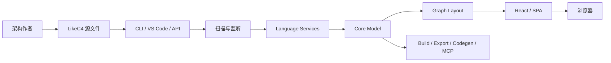
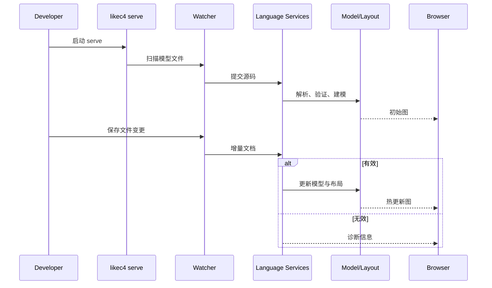
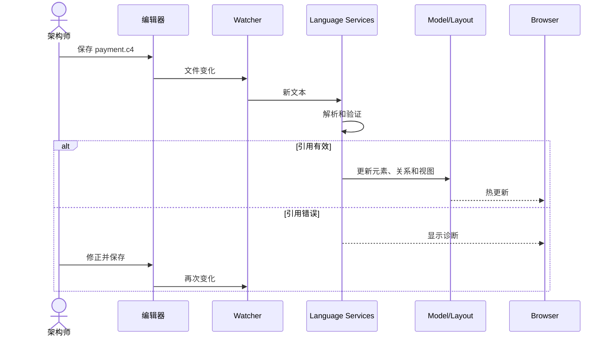

# likec4/likec4 项目深度解析

## 1. 项目概览

- 报告日期：2026-07-23
- 仓库地址：https://github.com/likec4/likec4
- Trending 原始排名：5
- Stars Today：80
- 项目定位：以 DSL 描述软件元素、关系和视图，并通过 CLI、语言服务、布局、React/Vite、VS Code 与 MCP 生成和查询架构图的 Architecture-as-Code 工具链。
- 解决的问题：静态图片难以版本化、校验、复用和持续更新。
- 目标用户：架构师、平台团队、架构治理和文档站点维护者。
- 当前成熟度：成熟可用。CLI、编辑器扩展、静态构建、导出、API、Vite 和 MCP 都有正式入口。
- 推荐结论：适合用作可评审的架构事实模型；它不能自动保证模型与真实运行系统完全一致。

## 2. 系统架构

### 2.1 架构概览

LikeC4 是 TypeScript monorepo。CLI、VS Code、API 或 Vite Plugin 读取 `.c4`/`.likec4` 文件；Langium language services 解析和验证；core/model 形成元素、关系和视图；layouts 计算图位置；React/diagram/SPA 渲染交互图。serve 模式扫描并监听文件变化，经本地 Vite 服务热更新浏览器。build、codegen、export 和 MCP 复用同一模型。

### 2.2 架构图

### 2.3 核心模块

| 模块 | 职责 | 代码位置 | 关键依赖 | 证据级别 |
|---|---|---|---|---|
| CLI | serve/build/export/codegen/MCP 命令 | `packages/likec4/src/cli/index.ts` | yargs | High |
| 文件发现 | 扫描模型文件和监听变化 | `packages/likec4` CLI | fdir, chokidar | High |
| Language Services | DSL 解析、引用和诊断 | `packages/language-services` | Langium | High |
| Core Model | 元素、关系、视图和查询 | `packages/core`、`src/model` | TypeScript | High |
| Layouts | 计算节点与边位置 | `packages/layouts` | Graphviz WASM, Dagre | High |
| UI | 交互图和静态页面 | `packages/diagram`、`react`、`spa` | React, Vite | High |
| MCP/API | 程序与 Agent 查询模型 | `packages/mcp`、公开 JS API | MCP | High |

### 2.4 数据与状态管理

架构事实保存在文本源和内存模型中，适合 Git 版本控制。serve 进程缓存解析、模型和布局结果并随变更重算；build/export 生成文件。主工具链没有必须依赖数据库或消息队列的证据。

### 2.5 外部集成与协议

- LSP / VS Code：编辑器诊断和预览。
- Vite / React：本地服务和嵌入式视图。
- Graphviz WASM / Dagre：布局。
- MCP：stdio 或 HTTP。
- 导出：PNG、JSON、Mermaid、Dot、D2、PlantUML、DrawIO。

### 2.6 部署与运行形态

本地模式是 Node 进程加浏览器；静态模式由 `likec4 build` 生成可部署 HTML；嵌入模式使用 Vite Plugin 或 React codegen；程序化模式使用 JS API/MCP。当前 package metadata 要求 Node `>=22.22.3`。

## 3. 主线流程

### 3.1 核心流程图

### 3.2 关键步骤

1. `bin/likec4.mjs` 进入 CLI，源码入口为 `src/cli/index.ts`。
2. serve 递归查找 `.c4` 和 `.likec4` 文件并启动 watcher。
3. Language services 解析语法、解析引用、输出诊断和模型。
4. Core model 提供元素、关系和 view；layout engine 生成带坐标视图。
5. Vite/React SPA 渲染；文件变化触发受影响视图更新。

### 3.3 异常与失败处理

语法或引用错误由 language services 返回诊断；build/export 应失败而不是静默丢关系。端口或目标目录问题由 CLI 报错。浏览器断线可以重连并重新取当前模型，但不会改变源文件。

## 4. 典型业务场景端到端执行链路

### 4.1 场景定义

- 场景名称：架构师新增支付服务关系，浏览器保存后实时更新；错误引用时显示诊断。
- 参与者：架构师、编辑器、CLI、watcher、language services、model/layout、浏览器。
- 前置条件：已有合法模型；`npx likec4 start` 正在运行。
- 输入：示意修改，新增 `payment` 服务及 `web -> payment` 关系。示意名称不是官方业务模型。
- 期望结果：目标 view 出现新节点与关系；错误引用不会进入有效图。
- 成功判定：浏览器和模型 API 都能查询新元素、关系且诊断为空。

### 4.2 端到端时序图

### 4.3 执行步骤追踪

| 步骤 | 输入 | 执行组件 | 关键代码位置 | 状态变化 | 输出 | 失败分支 | 证据级别 |
|---|---|---|---|---|---|---|---|
| 1 | serve 命令 | CLI | `src/cli/index.ts` | 服务启动 | 本地 URL | 参数/端口错误 | High |
| 2 | workspace | fdir/chokidar | `packages/likec4` | 文件集合建立 | 文档列表 | 没有模型文件 | High |
| 3 | DSL 文本 | language services | `packages/language-services` | AST/诊断更新 | 模型或错误 | 语法/引用错误 | High |
| 4 | 元素与关系 | core model | `packages/core` | 架构事实更新 | affected views | 语义冲突 | High |
| 5 | logical view | layouts | `packages/layouts` | 坐标更新 | layouted view | 布局失败 | High |
| 6 | 图数据 | React/SPA | `packages/react`、`spa` | 浏览器状态更新 | 新图 | HMR 断开 | High |
| 7 | 修正文本 | 同上 | 同上 | 诊断清除 | 恢复图 | 未修正则保留错误 | High |

### 4.4 关键状态与数据变化

源文件新增元素和关系；AST、诊断、模型和布局依次更新；浏览器从旧图切到新图。错误时模型保持诊断状态。没有数据库事务需要回滚，Git 可负责源码级回退。

### 4.5 失败传播、重试与回滚

错误引用由语言服务阻止进入有效构建；再次保存是自然重试。HMR 断开时刷新页面重新加载当前模型。源文件可通过 Git 回滚。

### 4.6 最终业务结果

团队得到的是一份可 diff、可校验、可查询的架构变更，而不是一张失去来源的图片。图、API 和 MCP 读取同一模型。

### 4.7 最小复现与验证方法

1. 安装 LikeC4，创建最小 `model.c4`。
2. 运行 `npx likec4 start`。
3. 新增示意 Payment 元素和关系，确认浏览器更新。
4. 故意引用不存在元素，确认出现诊断。
5. 修正后执行 `likec4 build -o dist`。
6. 使用 `LikeC4.fromWorkspace()` 查询新元素与 incoming/outgoing 关系。

## 5. 技术栈

| 层次 | 技术 | 用途 | 是否核心 | 证据位置 |
|---|---|---|---|---|
| 语言 | TypeScript, Node.js | 工具链 | 是 | package metadata |
| Monorepo | pnpm, Turbo | 构建与测试 | 是 | root package scripts |
| DSL | Langium | 解析和验证 | 是 | language-services deps |
| 编辑器 | LSP, VS Code JSON-RPC | 诊断 | 是 | language-server deps |
| 文件变化 | fdir, Chokidar | 扫描和热更新 | 是 | likec4 package deps |
| 布局 | Graphviz WASM, Dagre | 图布局 | 是 | package deps |
| 前端 | React, Vite | 展示和嵌入 | 是 | README / deps |
| Agent/API | JS API, MCP | 模型查询 | 可选 | README |

## 6. 创新点

### 创新点 1
- 类型：架构与开发体验创新
- 传统方案：架构图作为图片，语义和身份难校验。
- 当前方案：DSL 模型经语言服务和布局生成图。
- 实际收益：可 diff、诊断、查询和多视图复用。
- 证据：language services、model API、CLI。
- 局限：模型仍需团队维护，不能自动保证与生产一致。

### 创新点 2
- 类型：工程整合创新
- 传统方案：编辑器、静态站、导出、嵌入和 Agent 查询分别建设。
- 当前方案：一套模型同时服务 VS Code、CLI、React/Vite、API 与 MCP。
- 实际收益：多消费端复用同一架构事实。
- 证据：package exports、README 和依赖。
- 局限：工具链广，Node 和多包升级复杂。

## 7. 应用场景

### 适合
- 架构即代码和 Git 评审。
- 系统景观和上下游关系治理。
- 架构文档站点与产品内嵌图。
- Agent 通过 MCP/API 查询系统关系。

### 可以尝试
- CI 模型验证门禁。
- 从 DrawIO 逐步迁移。
- 与运行时拓扑或服务目录做对账。

### 暂不建议
- 期待自动从任意代码仓库无损反推架构。
- 没有 owner 和维护流程却宣称图永远最新。
- 用逻辑图替代容量、网络和故障域设计。

## 8. 第一次阅读与验证建议

1. 先跑官方 tutorial 和模板。
2. 阅读 `packages/likec4/README.md`。
3. 查看 CLI 入口与 package dependencies。
4. 再进入 language-services、core、layouts 和 UI packages。
5. 用错误模型和大图测试边界。

## 9. 风险与限制

- 安全：MCP HTTP 或 serve 对外监听时需要访问控制。
- 性能：大模型解析、布局和浏览器渲染需压测。
- 许可证：MIT。
- 维护状态：活跃 monorepo，Node engine 升级较快。
- 生产可用性：适合架构文档工具链，不替代运行时监控或 CMDB。

## 10. Evidence Notes

- 根 `README.md`：DSL 定位和基本 serve。
- `packages/likec4/README.md`：扫描、热更新、build、导出、Vite、React、API、MCP。
- 根 `package.json`：pnpm/Turbo 和质量工具。
- `packages/likec4/package.json`：CLI 入口、exports 与模块依赖。

## 11. Honest Caveat

主要模块和公开入口证据充分，但本次没有逐函数追踪内部 RPC/HMR 增量传播，也没有运行大模型性能测试。因此架构可信度高，具体更新和恢复流程为中等可信。

## 12. 可信度

- Architecture Confidence: High
- Flow Confidence: Medium
- Innovation Confidence: Medium
