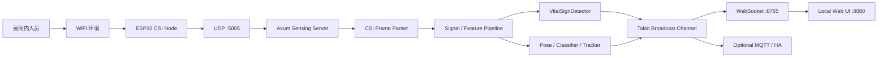
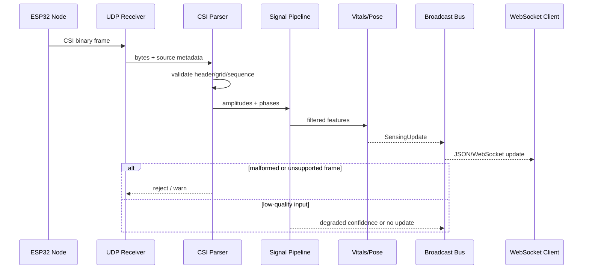
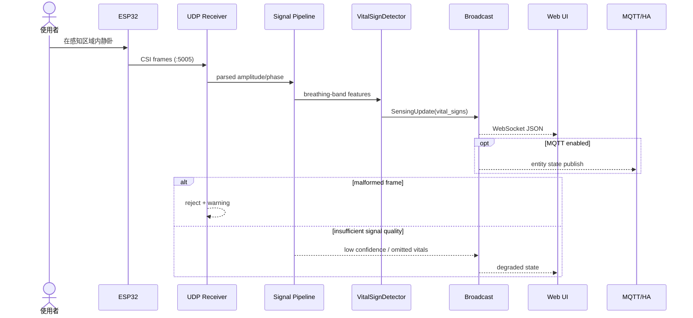

# ruvnet/RuView 项目深度解析

## 1. 项目概览

- 报告日期：2026-07-23
- 仓库地址：https://github.com/ruvnet/RuView
- Trending 原始排名：2
- Stars Today：741
- 项目定位：利用 ESP32 等设备采集 WiFi Channel State Information（CSI），在本地完成信号处理、空间感知、生命体征估计和智能家居状态发布的边缘系统。
- 解决的问题：在不使用摄像头或可穿戴设备的情况下，持续估计房间中的存在、运动、呼吸、心率和部分姿态状态。
- 目标用户：边缘感知研究人员、智能家居开发者、WiFi CSI 算法工程师和希望构建非摄像头占用检测原型的团队。
- 当前成熟度：生产候选与研究平台并存。实时 sensing server、硬件链路和多种集成已实现，但大量高级模型、性能与准确率主张仍需按具体硬件和环境独立验证。
- 推荐结论：值得研究其“硬件采集 → 实时 Rust 管线 → WebSocket/MQTT 发布”架构；医疗、安防或养老告警不能仅凭项目自测直接上线。

## 2. 系统架构

### 2.1 架构概览

RuView 的主感知路径是实时、事件驱动的边缘管线。ESP32 节点采集 CSI 帧并通过 UDP 发往 Rust sensing server；服务端解析帧头、幅度和相位，交给 signal、vitals、pose、tracker 或模型模块计算特征和状态，再把 `SensingUpdate` 发布到 Tokio broadcast channel。WebSocket 客户端、本地 UI 与可选 MQTT/Home Assistant 发布器消费同一类结果。`v2/Cargo.toml` 明确说明当前 sensing path 没有数据库持久状态，REST/WS 由 Axum sensing server 提供。

### 2.2 架构图

### 2.3 核心模块

| 模块 | 职责 | 代码位置 | 关键依赖 | 证据级别 |
|---|---|---|---|---|
| Sensing Server | CLI 配置、UDP 接收、REST/WS、静态 UI 和广播编排 | `v2/crates/wifi-densepose-sensing-server/src/main.rs` | Axum, Tokio, Tower | High |
| CSI 数据结构与解析 | 表达 ESP32 帧头、子载波、幅度与相位 | `.../src/main.rs`、`.../src/csi*` | serde, binary parsing | High |
| Signal Pipeline | 滤波、FFT、特征和多节点融合 | `v2/crates/wifi-densepose-signal/` | ndarray, rustfft, ruvector | Medium |
| Vital Signs | 呼吸、心率及置信度估计 | `.../src/vital_signs.rs` | signal features | High |
| Pose / Tracking | 姿态、人员、场模型和追踪状态 | `.../src/pose*`、`tracker_bridge.rs`、`field_*` | Candle/ORT, ruvector | Medium |
| Broadcast & API | 将 `SensingUpdate` 推给 WS/API 消费者 | `.../src/main.rs` | `tokio::sync::broadcast`, Axum WS | High |
| MQTT / Smart Home | 把 sensing 状态发布给 Home Assistant 等 | `.../src/cli.rs`、`examples/mqtt_publisher.rs`、`docs/integrations/` | MQTT | Medium |

### 2.4 数据与状态管理

- 主 sensing path 使用内存状态、`RwLock` 和 broadcast channel，处理实时帧和最近状态。
- `v2/Cargo.toml` 对被移除的 DB crate 做了明确说明：当前实时系统“no persistent state”。
- RVF 模型容器、训练数据或 HOMECORE recorder 属于可选/其他子系统，不能据此宣称每次 sensing update 都会写数据库。
- WebSocket 消费者接收序列化的 `SensingUpdate`；其中包含节点、特征、分类、信号场、可选生命体征、姿态和人员估计。

### 2.5 外部集成与协议

- ESP32 → Server：UDP，默认 5005。
- Server → Browser/UI：WebSocket，默认 8765；静态 UI 默认 HTTP 8080。
- Server → Home Assistant：可选 MQTT auto-discovery/publisher。
- 其他集成：README 说明 Matter、Apple Home 等桥接能力，但具体部署应按相应 ADR 和集成文档验证。

### 2.6 部署与运行形态

- 模拟模式：Docker 启动，不需要真实硬件，适合 UI 和管线演示。
- 实际感知：ESP32-S3/C6 采集 CSI，向本地 Rust server 发帧。
- 默认绑定回环地址；暴露到局域网或反向代理时需处理 Host 校验、访问控制和 DNS rebinding 风险。
- 可在 x86_64 或 ARM64 边缘主机运行；高级模型的硬件要求因模型而异。

## 3. 主线流程

### 3.1 核心流程图

### 3.2 关键步骤

1. `UdpSocket` 接收 ESP32 发来的二进制 CSI 帧。
2. 帧解析逻辑读取 magic、node id、子载波数量、频率、序列、RSSI、幅度和相位；HT 与 HE 网格不能直接混用。
3. Signal pipeline 对幅相序列进行处理，生成 motion、signal field 和供生命体征/模型使用的特征。
4. `VitalSignDetector`、分类器和 tracker 产生可选 breathing、heart rate、pose 或 person 状态。
5. 服务端组装 `SensingUpdate` 并通过 Tokio broadcast 推给 WebSocket 等消费者。
6. 浏览器 UI 更新图表；启用 MQTT 时，相关状态继续发布给 Home Assistant。

### 3.3 异常与失败处理

- 无效 magic、长度、子载波网格或无法解析的帧应被拒绝并记录，不进入推理。
- 信号质量低时，部分字段可能缺失或置信度下降；不能把“没有高置信结果”硬解释成“无人”。
- Broadcast consumer 落后时可能丢过期更新；实时系统优先当前状态，而不是保证每帧持久保存。
- MQTT 或 WebSocket 消费端失败不应阻断 UDP sensing 主循环；实际隔离程度需结合对应启动任务和错误处理继续审阅。

## 4. 典型业务场景端到端执行链路

### 4.1 场景定义

- 场景名称：卧室中的 ESP32 采集 CSI，RuView 在本地 UI 显示呼吸估计并可选同步 Home Assistant。
- 参与者：房间内人员、WiFi AP、ESP32 CSI Node、Rust sensing server、signal/vitals 模块、WebSocket UI、可选 MQTT broker/Home Assistant。
- 前置条件：ESP32 已烧录并配置目标 server IP；server 监听 UDP 5005、WS 8765、HTTP 8080；房间完成必要校准；若使用 HA，MQTT 配置有效。
- 输入：ESP32 连续发出的 CSI 二进制帧。示意环境状态：人员静卧、信号质量稳定。
- 期望结果：本地 UI 收到含 breathing estimate 和 confidence 的实时更新；启用 MQTT 时相应实体状态更新。
- 成功判定：连续多个 tick 出现时间戳递增、来源节点一致、呼吸字段有效且 UI/HA 状态可观察；不是仅凭进程未报错。

### 4.2 端到端时序图

### 4.3 执行步骤追踪

| 步骤 | 输入 | 执行组件 | 关键代码位置 | 状态变化 | 输出 | 失败分支 | 证据级别 |
|---|---|---|---|---|---|---|---|
| 1 | WiFi 反射环境 | ESP32 firmware | `firmware/esp32-csi-node/` | 采样序列递增 | CSI frame | 节点离线/未配置 | Medium |
| 2 | UDP bytes | sensing server | `v2/.../sensing-server/src/main.rs` | 更新节点/帧上下文 | parsed frame | magic/长度/网格错误后丢弃 | High |
| 3 | amplitudes/phases | signal crate | `v2/crates/wifi-densepose-signal/` | 内存特征窗口更新 | motion/vital features | 低质量导致置信度下降 | Medium |
| 4 | vital features | `VitalSignDetector` | `.../src/vital_signs.rs` | 产生当前呼吸/心率估计 | `VitalSigns` | 数据不足则 `None`/低置信 | High |
| 5 | features + classification | server composer | `.../src/main.rs` 的 `SensingUpdate` | 当前 tick 状态形成 | JSON-ready update | 某可选字段缺失不阻断其他字段 | High |
| 6 | SensingUpdate | Tokio broadcast | `.../src/main.rs` | 无持久化；发布当前状态 | WS/MQTT event | 慢消费者可能落后 | High |
| 7 | WS/MQTT event | UI / HA | `ui/`、MQTT publisher | 页面或实体状态变化 | 用户可见结果 | 消费端断线，可重连等后续更新 | Medium |

### 4.4 关键状态与数据变化

- 原始状态：二进制 CSI 帧、节点和序列信息。
- 中间状态：幅相数组、滤波窗口、运动/呼吸频带特征和置信度。
- 输出状态：`SensingUpdate` JSON；核心路径未发现数据库持久化。
- 用户状态：UI 图表和可选 HA entity 从“未知/无数据”变成当前估计；低质量时应明确退化，而不是伪造正常值。

### 4.5 失败传播、重试与回滚

- ESP32 断线：没有新帧，UI 应表现为陈旧/离线；系统不存在可回滚的业务事务。
- 单帧损坏：解析层丢弃，不应污染后续特征窗口。
- 低信号质量：输出低置信或省略生命体征；不应触发高风险告警。
- WebSocket 断线：客户端重连后接收新更新，历史帧不会从主 sensing DB 重放，因为该路径没有持久化。

### 4.6 最终业务结果

使用者得到的是“当前环境下的实时无线感知估计”，不是医学诊断。系统价值在于把硬件帧、信号算法和消费接口连成低延迟本地闭环；正确产品设计还必须向用户展示置信度、离线与低质量状态。

### 4.7 最小复现与验证方法

1. 先用 README 的 Docker 模拟模式启动，并打开 `http://localhost:3000` 验证 UI 和管线。
2. 源码验证时在 `v2/` 构建 sensing server，检查默认 UDP/WS/HTTP 端口。
3. 真实硬件路径按官方 provision 脚本配置 ESP32 的 SSID、密码和 target IP。
4. 同时抓取 UDP/WS 日志，确认每个 UI 更新可追溯到实际帧，而不是静态模拟。
5. 用空房、静卧和走动三种场景比较输出，并记录信号质量与置信度；不要只挑成功片段。

## 5. 技术栈

| 层次 | 技术 | 用途 | 是否核心 | 证据位置 |
|---|---|---|---|---|
| 语言与运行时 | Rust 2021, Tokio | 实时 server 与并发任务 | 是 | `v2/Cargo.toml` |
| 服务框架 | Axum, Tower, Hyper | REST、WS、静态 UI | 是 | sensing server `main.rs` |
| 硬件协议 | ESP32 CSI, UDP | 无线信号采集与输入 | 是 | README、frame types |
| 信号处理 | ndarray, rustfft, RuVector | 幅相、频带、融合与特征 | 是 | workspace dependencies |
| AI 推理 | Candle, ORT, tch | 可选姿态和模型推理 | 可选/重要 | workspace dependencies |
| 状态与通信 | broadcast, RwLock, WebSocket | 内存实时状态和分发 | 是 | sensing server `main.rs` |
| 智能家居 | MQTT, Home Assistant/Matter | 对外发布语义状态 | 可选 | CLI 与 integration docs |
| 可观测性 | tracing | 日志与诊断 | 是 | workspace dependencies |

## 6. 创新点

### 创新点 1

- 类型：架构创新 / 工程整合创新
- 传统方案：占用、姿态和生命体征通常依赖摄像头、毫米波或可穿戴设备。
- 当前方案：利用低成本 ESP32 的 WiFi CSI，配合本地 Rust 实时管线和可选模型推理。
- 实际收益：隐私形态不同、硬件成本较低、黑暗和遮挡下仍有感知信号。
- 证据：硬件 firmware、UDP frame、signal/vitals crates 和 sensing server 实现。
- 局限：WiFi 多径强烈依赖空间，泛化、校准和准确率不能由单一实验推及所有环境。

### 创新点 2

- 类型：开发体验创新
- 传统方案：研究代码、硬件脚本、Web 可视化和智能家居集成往往分散。
- 当前方案：同一 workspace 和 server 暴露模拟、真实硬件、WS/UI、MQTT、模型和校准入口。
- 实际收益：更容易从算法实验走到可演示系统。
- 证据：CLI 参数、workspace crates、Docker 与 integration docs。
- 局限：功能面很宽，复杂度和维护成本高；并非所有模块成熟度一致。

## 7. 应用场景

### 适合

- WiFi CSI 信号处理与边缘推理研究。
- 非摄像头房间占用和活动原型。
- Home Assistant 中的辅助状态输入。
- ESP32 多节点采集与低延迟可视化实验。

### 可以尝试

- 养老房间的辅助异常提示，但必须与其他传感器交叉验证。
- 办公空间占用、能源管理和隐私敏感区域统计。
- 姿态或生命体征模型的自有数据微调。

### 暂不建议

- 单独承担医疗诊断、跌倒救援或生命安全告警。
- 未经现场校准就宣称精确人数、身份或健康状态。
- 直接把本地 sensing server 暴露公网而无认证和网络隔离。

## 8. 第一次阅读与验证建议

1. 先读 README 的数据路径和 Docker/ESP32 启动方式。
2. 再读 `v2/Cargo.toml`，理解哪些 crates 实际存在、哪些历史预留已删除。
3. 看 sensing server `main.rs` 顶部、CLI 参数、`SensingUpdate` 和 UDP/WS 启动代码。
4. 运行模拟模式后再接真实 ESP32，比较两条路径。
5. 对任何准确率或速度主张，固定硬件、房间、数据切分和指标重新测试。

## 9. 风险与限制

- 安全：局域网开放、MQTT 凭据、Host 校验和硬件固件供应链需要审查。
- 隐私：虽无摄像头，WiFi 感知仍可能暴露房间占用、活动和生理节律。
- 性能：高阶模型和多节点融合资源需求差异大，README 数字不代表目标硬件。
- 许可证：仓库 README 为 MIT，Rust workspace 包声明 MIT OR Apache-2.0；使用模型和外部模块时需单独核对。
- 维护状态：仓库范围大、模块多，版本一致性与测试覆盖需持续检查。
- 生产可用性：实时演示和研究能力明确，但安全关键场景需要系统级验证、故障检测与认证。

## 10. Evidence Notes

- `README.md`：项目目标、ESP32/模拟启动、智能家居集成和维护者基准。
- `v2/Cargo.toml`：实际 workspace、依赖与“实时路径无持久状态”的明确说明。
- `v2/crates/wifi-densepose-sensing-server/src/main.rs`：UDP 5005、WS 8765、HTTP 8080、Axum/Tokio、frame 与 update 类型。
- `v2/crates/wifi-densepose-sensing-server/src/vital_signs.rs`：生命体征模块位置。
- `docs/integrations/` 与 MQTT 示例：可选对外发布路径。

## 11. Honest Caveat

本报告属于源码和官方资料的静态分析，没有烧录硬件、采集现场 CSI、复现实验数据或验证 README 中的全部模型指标。主 sensing server 的数据链路证据充分；signal、pose 和多模块融合内部并未逐函数完整追踪，因此算法细节和所有异常分支仍可能遗漏。

## 12. 可信度

- Architecture Confidence: High
- Flow Confidence: Medium
- Innovation Confidence: Medium
