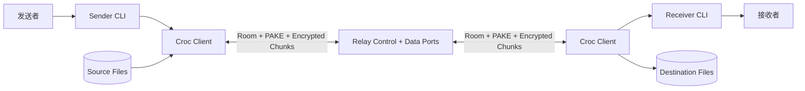

# schollz/croc 项目深度解析

## 1. 项目概览

- 报告日期：2026-07-23
- 仓库地址：https://github.com/schollz/croc
- Trending 原始排名：4
- Stars Today：739
- 项目定位：通过 Relay 会合、PAKE 密钥协商和加密分块传输，让任意两台电脑无需端口转发即可安全交换文件、目录或文本。
- 解决的问题：跨 NAT、跨平台文件传输通常需要开放端口、上传第三方云盘或手工配置服务；Croc 用短语和中继降低连接门槛，同时保留端到端加密与断点续传。
- 目标用户：需要临时跨网络传文件的开发者、远程支持人员、个人用户和希望自托管 Relay 的团队。
- 当前成熟度：成熟项目。核心协议、跨平台分发、续传、代理和自托管路径均已存在，但企业级身份、审计和集中策略不是其主要定位。
- 推荐结论：很适合研究一个小型 CLI 如何把网络会合、密码学、元数据协商、分块传输、重连和清理组织成明确状态机。

## 2. 系统架构

### 2.1 架构概览

Croc 由发送端 CLI、接收端 CLI、Relay 控制/数据连接和本地文件系统组成。两端使用共享短语派生 room name，在 Relay 上会合，再通过 PAKE 建立共享密钥。安全通道建立后，发送端交换文件元数据，接收端选择或请求缺失块，双方通过一个或多个 TCP/Comm 通道传输压缩、加密数据。`Client` 结构体显式记录五阶段状态、文件列表、chunk ranges、连接和 reconnect version，表明主流程不是一条“读文件后写 socket”的直线，而是可恢复的会话状态机。

### 2.2 架构图



### 2.3 核心模块

| 模块 | 职责 | 代码位置 | 关键依赖 | 证据级别 |
|---|---|---|---|---|
| CLI 入口 | 解析 send/receive/relay 参数并启动会话 | `main.go`、`src/cli/` | `schollz/cli` | High |
| Croc Client | 维护协议阶段、文件、chunk、连接与重连状态 | `src/croc/croc.go` | PAKE, comm, crypt, compress | High |
| Relay 通信 | 控制房间与多数据端口的连接转发 | `src/tcp/`、`src/comm/` | net/TCP | Medium |
| 密钥与加密 | PAKE 协商共享 key，保护消息与数据 | `src/crypt/`、`github.com/schollz/pake/v3` | x/crypto | High |
| 消息协议 | 文件信息、请求、chunk 和控制消息编码 | `src/message/`、`src/models/` | JSON/binary | Medium |
| 文件与压缩 | 扫描文件、hash、压缩、读写和临时文件清理 | `src/croc/`、`src/compress/`、`src/utils/` | imohash, xxhash | Medium |

### 2.4 数据与状态管理

- 会话状态保存在进程内 `Client`：安全通道、元数据交换、接收请求、文件传输、关闭通道和最终成功标志。
- 文件级状态包括 `FilesToTransfer`、当前文件、chunk ranges、已完成文件和总传输量。
- 接收端文件直接落本地文件系统；中断恢复依赖已存在文件、chunk 请求和 reconnect 状态，而不是服务端数据库。
- Relay 负责转发连接，不应被描述为长期保存用户文件的对象存储。

### 2.5 外部集成与协议

- Relay：默认公共 Relay 或用户自托管 Relay；默认使用多个 TCP 端口。
- PAKE：根据共享短语建立双方共享 secret，用于端到端加密。
- Proxy：可通过 SOCKS5/Tor 等代理连接。
- 本地发现：项目依赖 `peerdiscovery`，但实际路径和优先级需结合选项继续审阅。

### 2.6 部署与运行形态

- 两端通常直接运行单个 Croc 二进制。
- Relay 可用公共服务，也可 `croc relay` 或 Docker 自托管。
- 发送者和接收者无需开放入站端口或运行长期本地服务。
- Go 项目可跨平台构建；README 提供 Homebrew、Winget、Scoop、Chocolatey、Nix、Docker 等安装方式。

## 3. 主线流程

### 3.1 核心流程图

```mermaid
sequenceDiagram
    participant S as Sender CLI
    participant SR as Sender Client
    participant R as Relay
    participant RR as Receiver Client
    participant D as Destination FS

    S->>SR: send(paths, shared phrase)
    SR->>R: join derived room
    RR->>R: join same room
    SR<->>RR: PAKE handshake through relay
    SR->>RR: encrypted SenderInfo
    RR->>SR: RemoteFileRequest(chunk ranges)
    loop each requested chunk
        SR->>RR: encrypted/compressed chunk
        RR->>D: write at offset
    end
    RR->>SR: completion state
    SR<->>RR: close channels
```

### 3.2 关键步骤

1. CLI 根据 `send` 或 code phrase 决定发送者/接收者角色，并建立 `Options`。
2. `croc.New` 校验共享短语至少 6 字符，并由短语前缀与固定 salt 派生 room name。
3. 两端连接 Relay 控制通道，在相同 room 会合。
4. 双方执行 PAKE，得到端到端共享 key，设置 `Step1ChannelSecured`。
5. 发送端扫描文件、计算 hash/压缩信息并发送 `SenderInfo`，完成第二阶段。
6. 接收端比较目标文件与已有块，发送 `RemoteFileRequest`，进入第三阶段。
7. 发送端按请求范围并行/多路发送 chunk，接收端按 offset 写入，完成第四阶段。
8. 双方确认完成、关闭数据通道并设置 `SuccessfulTransfer`。

### 3.3 异常与失败处理

- 共享短语过短：`New` 直接返回错误，不建立 room。
- Relay 不可达：连接阶段失败；可指定其他 Relay、代理或本地路径。
- 连接中断：`Client` 维护 reconnect version、下一个 room 和最多 10 次重连尝试，重新协商缺失范围。
- 文件冲突：是否覆盖由 `Overwrite`、`NoPrompt` 等选项控制；未经确认不能擅自覆盖。
- 校验失败：应重新请求或报错；具体 hash 比较与异常传播需继续逐函数跟踪。

## 4. 典型业务场景端到端执行链路

### 4.1 场景定义

- 场景名称：发送者跨公网传一个目录，连接中断后接收者继续缺失块并最终校验完成。
- 参与者：发送者、发送端 Croc、Relay、接收端 Croc、接收者、本地文件系统。
- 前置条件：双方安装兼容版本；共享同一 code phrase；可访问 Relay；接收目录有足够空间。
- 输入：发送端命令示意 `croc send project/`；接收端命令示意 `croc code-phrase`。实际 phrase 由发送端输出或显式指定。
- 期望结果：目录结构和文件内容在接收端完整落盘；中断前已完成的块不重复全量传输。
- 成功判定：所有文件数量、大小和 hash 符合元数据，`SuccessfulTransfer` 为 true，双方正常关闭通道。

### 4.2 端到端时序图

```mermaid
sequenceDiagram
    actor A as 发送者
    participant S as Sender Croc
    participant R as Relay
    participant C as Receiver Croc
    participant FS as 接收文件系统
    actor B as 接收者

    A->>S: croc send project/
    S->>S: 扫描文件并生成 code phrase
    B->>C: croc code-phrase
    S->>R: 加入 room
    C->>R: 加入同一 room
    S<->>C: PAKE 建立共享 key
    S->>C: 加密文件元数据
    C->>S: 请求全部缺失块
    S->>C: 发送 chunk 1..N
    C->>FS: 按 offset 写入
    Note over S,C: 网络暂时中断
    S--xC: TCP 连接断开
    S->>R: 使用 next reconnect room 重连
    C->>R: 重连并发送已有 chunk ranges
    C->>S: 仅请求缺失块
    S->>C: 发送剩余 chunks
    C->>FS: 完成写入和校验
    C-->>B: 传输完成
```

### 4.3 执行步骤追踪

| 步骤 | 输入 | 执行组件 | 关键代码位置 | 状态变化 | 输出 | 失败分支 | 证据级别 |
|---|---|---|---|---|---|---|---|
| 1 | 目录路径 | CLI / file scanner | `src/cli/`、`src/croc/` | `FilesToTransfer` 填充 | 文件元数据 | 路径不存在/权限失败 | Medium |
| 2 | shared secret | `croc.New` | `src/croc/croc.go` | 生成 room、初始化 Client | room + options | 少于 6 字符直接失败 | High |
| 3 | room | comm/tcp | `src/comm/`、`src/tcp/` | `conn[]` 建立 | Relay 会合 | Relay 超时/认证失败 | Medium |
| 4 | phrase + peer data | PAKE | `src/croc/croc.go`、pake/v3 | `Key` 生成、Step1=true | 加密通道 | phrase 不同，握手失败 | High |
| 5 | 文件列表/hash | SenderInfo | `SenderInfo` 定义与发送逻辑 | Step2=true | 加密元数据 | 序列化/通道错误 | High |
| 6 | 本地已有内容 | Receiver request | `RemoteFileRequest` | Step3=true、chunk ranges 形成 | 缺失块请求 | 无空间/冲突拒绝 | High |
| 7 | chunk bytes | transfer loop | `src/croc/`, `comm`, `crypt` | `TotalChunksTransferred` 增长 | 文件片段 | 连接中断触发重连 | Medium |
| 8 | reconnect version + ranges | reconnect path | `Client` reconnect fields | 新 room/连接建立 | 剩余块请求 | 超过最大尝试后失败 | High |
| 9 | 完成文件 | hash/finish | file state fields | Step4/Step5、Successful=true | 完整目录 | 校验失败则不可标成功 | Medium |

### 4.4 关键状态与数据变化

- `FilesToTransfer`：从扫描结果变成发送清单。
- `CurrentFileChunkRanges` / `CurrentFileChunks`：记录需要或已经处理的文件范围。
- `TotalChunksTransferred`、`FilesHasFinished`：随传输推进。
- `reconnectVersion`、`nextReconnectRoom`：连接中断后改变，避免直接复用旧连接状态。
- 目标文件：按 offset 写入；部分文件可能以临时状态存在，完成后再标记成功。

### 4.5 失败传播、重试与回滚

- 网络断开不会自动回滚已写 chunk；重连后接收端重新声明缺失范围。
- PAKE 失败意味着双方 phrase 不一致，不能降级为明文传输。
- 重连超过限制后，会话失败；已落盘的临时或部分文件需由工具清理规则处理。
- 接收端拒绝覆盖时，发送端不能绕过用户选择。

### 4.6 最终业务结果

用户最终得到一个完整的本地目录，Relay 只帮助双方建立和维持传输路径。核心业务价值是：连接复杂性由 Croc 吸收，而共享短语、加密和缺失块状态让用户不必把文件先交给云盘再下载一遍。

### 4.7 最小复现与验证方法

1. 在两台机器或两个隔离容器安装同版本 Croc。
2. 创建包含多个文件的测试目录，并预先计算 SHA-256 清单。
3. 发送端运行 `croc send testdir/`，接收端输入 code phrase。
4. 传输中途断开接收端网络，再恢复并观察是否重连和续传。
5. 完成后比较文件数量、大小和 SHA-256；抓取日志确认重新请求的是缺失范围而非全量。
6. 额外用错误 phrase 验证 PAKE 失败不会产生可读文件。

## 5. 技术栈

| 层次 | 技术 | 用途 | 是否核心 | 证据位置 |
|---|---|---|---|---|
| 语言与运行时 | Go 1.25 | CLI、网络和文件处理 | 是 | `go.mod` |
| 密钥协商 | `schollz/pake/v3` | 共享短语认证与 key agreement | 是 | `go.mod`, `croc.go` |
| 加密 | `x/crypto`, `src/crypt` | 消息和 chunk 保护 | 是 | 依赖和源码模块 |
| 网络 | TCP, Relay, comm | NAT 外会合和数据传输 | 是 | `src/tcp`, `src/comm` |
| 续传 | chunk ranges + reconnect state | 中断后请求缺失块 | 是 | `Client`, `RemoteFileRequest` |
| 文件处理 | hash, compression, ignore rules | 扫描、校验和传输优化 | 是 | `go.mod`, `src/compress` |
| UX | CLI, progressbar, QR, clipboard | 降低跨设备操作成本 | 辅助 | README / dependencies |

## 6. 创新点

### 创新点 1

- 类型：协议与开发体验创新
- 传统方案：用户自行开端口、搭服务器或上传中心化云盘。
- 当前方案：双方用短语在 Relay 会合，通过 PAKE 建立 E2E key。
- 实际收益：网络配置少，Relay 无需获得明文密钥。
- 证据：README、PAKE 依赖与 `Client` 安全阶段。
- 局限：短语弱、终端泄漏或 Relay 阻断仍会影响安全和可用性。

### 创新点 2

- 类型：工程整合创新
- 传统方案：加密、压缩、多文件、断点续传和代理常由不同工具组合。
- 当前方案：单个跨平台 CLI 把这些能力放入同一会话状态机。
- 实际收益：用户心智和部署成本低。
- 证据：README 功能、Client file/chunk/reconnect 状态。
- 局限：不提供企业文件平台的组织权限、审计审批和长期生命周期管理。

## 7. 应用场景

### 适合

- 两台个人或开发设备临时安全传文件。
- 远程支持中交换日志、构建物和配置包。
- 通过自托管 Relay 控制网络路径。
- 自动化脚本中使用 quiet/stdin/stdout 模式。

### 可以尝试

- 小团队内部临时交付。
- 通过 Tor/SOCKS5 的受限网络传输。
- 移动端与桌面端跨平台交换。

### 暂不建议

- 需要复杂组织权限、法律保留和审计的企业文档系统。
- 把易猜短语用于敏感数据。
- 未评估 Relay、终端恶意软件和接收路径安全就传高价值秘密。

## 8. 第一次阅读与验证建议

1. 先读 README 的 send/receive、PAKE、续传和自托管 Relay。
2. 看 `main.go` 与 `src/cli/` 理解角色和参数入口。
3. 重点读 `src/croc/croc.go` 的 `Client`、`New`、五阶段和 reconnect 字段。
4. 再追 `src/comm`、`src/tcp`、`src/crypt` 和 message 类型。
5. 用网络中断测试验证续传，不要只做一次局域网成功演示。

## 9. 风险与限制

- 安全：短语强度、终端环境和 Relay 地址必须可信；类 Unix 上应避免把 secret 放进进程参数。
- 性能：大文件速度受 Relay、带宽、通道数量、压缩和 hash 影响。
- 许可证：MIT。
- 维护状态：成熟且跨平台，但升级时要注意协议版本兼容。
- 生产可用性：适合点对点传输工具，不等于完整企业内容管理平台。

## 10. Evidence Notes

- `README.md`：Relay、PAKE、E2E、续传、代理、自托管和使用方式。
- `go.mod`：PAKE、crypto、hash、peer discovery 和 CLI 依赖。
- `main.go`：CLI 主入口、信号清理。
- `src/croc/croc.go`：Options、Client 五阶段、文件/chunk/reconnect 状态和 room 派生。

## 11. Honest Caveat

本报告没有进行协议抓包、密码学审计或跨版本互操作测试。状态机和主要数据结构证据充分，但具体加密消息格式、所有重连分支和 hash 失败处理没有逐函数完整验证，因此不能替代正式安全审计。

## 12. 可信度

- Architecture Confidence: High
- Flow Confidence: High
- Innovation Confidence: Medium
