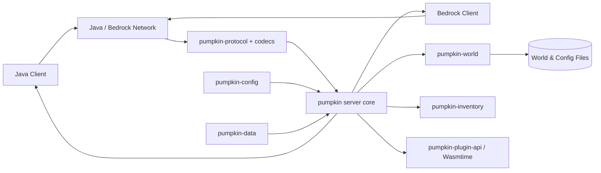
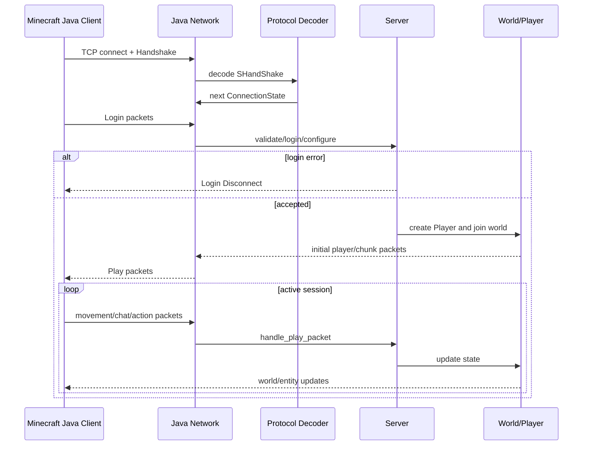
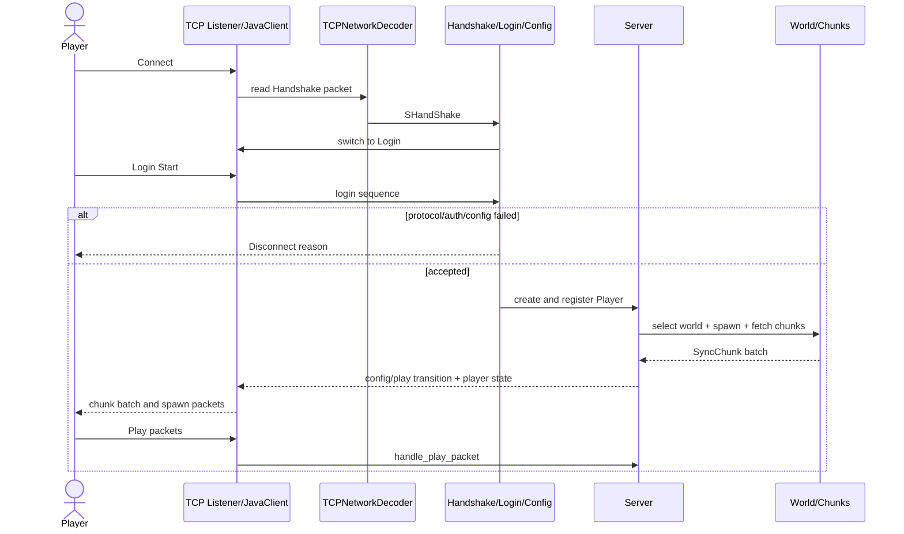

# Pumpkin-MC/Pumpkin 项目深度解析

## 1. 项目概览

- 报告日期：2026-07-24
- 仓库地址：https://github.com/Pumpkin-MC/Pumpkin
- Trending 原始排名：4
- Stars Today：565
- 项目定位：用 Rust 从头实现、同时面向 Minecraft Java 与 Bedrock 协议的游戏服务器。
- 解决的问题：传统 Minecraft 服务端通常依赖 JVM 和既有实现；Pumpkin 尝试以 Rust 的异步网络、并发模型和模块化 Crate 构建更轻量、可控的替代方案。
- 目标用户：Minecraft 服务器研发者、Rust 系统编程学习者、协议与游戏服务端研究者。
- 当前成熟度：早期可用；程序入口明确提示项目处于 heavy development。
- 推荐结论：适合源码研究和测试环境实验，生产替代应等待协议兼容、插件生态和稳定性验证。

## 2. 系统架构

### 2.1 架构概览

Pumpkin 是 Rust Workspace。主程序加载配置和 Vanilla 数据，创建 `PumpkinServer`，初始化插件后启动 Java 与 Bedrock 网络入口。协议编解码、世界与区块、背包、配置、静态数据、插件 API 分别位于独立 Crate。Java 客户端由状态机管理 Handshake、Status、Login、Configuration 与 Play 阶段；每个连接包含独立读写编解码器、普通/高优先级发送队列、取消令牌与任务跟踪器。

### 2.2 架构图

### 2.3 核心模块

| 模块 | 职责 | 代码位置 | 关键依赖 | 证据级别 |
|---|---|---|---|---|
| 主程序 | 加载配置、Vanilla 数据、日志、插件并启动 Server | `pumpkin/src/main.rs` | Tokio、PumpkinConfig | High |
| Server Core | 连接管理、玩家生命周期、世界与 Tick 编排 | `pumpkin/src/server/`、`PumpkinServer` | Tokio、领域 Crate | Medium |
| Java Network | TCP、连接状态机、登录、配置、Play、KeepAlive | `pumpkin/src/net/java/` | pumpkin-protocol | High |
| Bedrock Network | Bedrock 协议入口与连接处理 | `pumpkin/src/net/bedrock/` | pumpkin-protocol/codecs | Medium |
| Protocol | 多版本包类型、编码器与解码器 | `pumpkin-protocol/`、`pumpkin-codecs/` | bytes、压缩与加密库 | High |
| World | 世界、区块和并行加载 | `pumpkin-world/` | Rayon、Crossbeam | High |
| Inventory | 容器、物品与背包领域状态 | `pumpkin-inventory/` | pumpkin-data | High |
| Configuration | Basic/Advanced 配置解析 | `pumpkin-config/` | serde/json5/toml | High |
| Plugin API | 插件接口与运行时扩展 | `pumpkin-plugin-api/` | Wasmtime/WASI | Medium |

### 2.4 数据与状态管理

- 连接状态保存在 `JavaClient.connection_state`，从 HandShake 进入后续协议阶段。
- 玩家资料、客户端配置、品牌和 Player 对象以异步 Mutex/原子状态保存在连接对象中。
- 世界与区块由 `pumpkin-world` 管理；仓库使用文件和世界数据结构，不存在本报告已确认的外部数据库。
- 出站包使用普通和高优先级两个容量为 4096 的 MPSC 队列。
- KeepAlive、数据包序号和关闭状态使用原子变量与 `CancellationToken`。

### 2.5 外部集成与协议

- Minecraft Java 协议：Handshake、Status、Login、Configuration、Play。
- Minecraft Bedrock 协议：独立网络模块。
- Java 登录阶段支持加密和压缩设置。
- Wasmtime/WASI 相关依赖用于插件扩展能力。
- 服务器运行依赖本地配置、世界数据与网络端口；未发现必须使用外部数据库或消息队列的证据。

### 2.6 部署与运行形态

项目可作为单个服务器进程运行，主程序根据配置分别启用 Java 和 Bedrock 监听地址。官方提供 Quick Start 与 Docker 相关入口。崩溃时主线程生成并保存 Crash Report；信号处理触发优雅停止。生产部署需要自行管理世界文件、配置、端口、备份和版本升级。

## 3. 主线流程

### 3.1 核心流程图

### 3.2 关键步骤

1. 主进程加载 `PumpkinConfig` 和 `VanillaData`，创建 `PumpkinServer`，初始化插件后调用 `start()`。
2. Java TCP 连接被拆分成读写 Half，并创建普通/高优先级出站队列。
3. `JavaClient` 从 `ConnectionState::HandShake` 开始，解码客户端包并由 Handshake、Login、Config 和 Play Handler 分阶段处理。
4. 在线模式可配置加密；服务器按配置设置压缩阈值和等级。
5. 登录通过后关联 `Player`，进入 `progress_player_packets`，处理移动、聊天、背包、方块和实体相关包。
6. 每 15 秒检查 KeepAlive；上一轮未响应则踢出超时客户端。

### 3.3 异常与失败处理

- 非法或不支持的数据包：Handler 返回错误，连接可被 Kick 并记录包 ID 和 Payload 大小。
- 登录或协议阶段失败：发送阶段对应 Disconnect 包，不进入 Play 状态。
- KeepAlive 未应答：服务器发送超时原因并断开连接。
- 主线程 Panic：生成 Crash Report 并退出；其他线程首次 Panic 会触发服务器停止。
- 收到 SIGINT/SIGTERM/SIGHUP：调用停止流程，等待连接相关任务关闭。

## 4. 典型业务场景端到端执行链路

### 4.1 场景定义

| 项目 | 内容 |
|---|---|
| 场景名称 | Java Edition 玩家登录 Pumpkin 并加载初始世界区块 |
| 参与者 | Minecraft Java 客户端、TCP/JavaClient、协议编解码器、登录/配置 Handler、Server、Player、World/Chunk 系统 |
| 前置条件 | Pumpkin 已启动 Java 监听；配置和世界可加载；客户端协议版本受支持；如启用在线模式，认证所需网络条件可用 |
| 输入 | 客户端标准 Handshake、Login Start、配置确认与 Play 阶段包；玩家名仅作为示意数据 |
| 期望结果 | 玩家完成登录，创建 Player，进入 Play 状态并收到初始世界、位置和区块数据 |
| 成功判定 | 客户端显示进入服务器世界；服务端连接状态为 Play；玩家对象已关联；初始 Chunk Batch 被发送 |

### 4.2 端到端时序图

### 4.3 执行步骤追踪

| 步骤 | 输入 | 执行组件 | 关键代码位置 | 状态或数据变化 | 输出 | 失败分支 | 证据级别 |
|---:|---|---|---|---|---|---|---|
| 1 | TCP connection | Java listener / `JavaClient::new` | `pumpkin/src/net/java/mod.rs` | 创建读写 Codec、队列、取消令牌；状态=HandShake | JavaClient | Socket/初始化失败 | High |
| 2 | Handshake Packet | Decoder + handshake handler | `pumpkin-protocol`、`net/java/handshake` | 解析版本、目标地址和下一状态 | Status/Login 状态 | 版本或包格式不支持 | Medium |
| 3 | Login Start | `handle_login_sequence` | `net/java/mod.rs`、`net/java/login` | 写入 GameProfile，可能启用加密/压缩 | 登录确认或断开 | 认证、加密或包处理失败 | High |
| 4 | Config Packets | config handler | `net/java/config` | 保存 `PlayerConfig`，完成资源包/已知包协商 | Play 准备完成 | 配置阶段错误 | Medium |
| 5 | Player Context | Server + Player | `server/`、`entity/player` | 创建并注册 Player，关联到 JavaClient | 可进入世界的玩家 | 重复/容量/世界错误 | Medium |
| 6 | Spawn/View Distance | World/Level | `pumpkin-world`、`send_chunks` | 读取或生成初始区块；队列化 Chunk Batch | Chunk Data | 区块读取/生成失败 | Medium |
| 7 | Serialized Packets | TCPNetworkEncoder | `net/java/mod.rs` | 普通/高优先级发送队列消耗 | 客户端收到世界状态 | 队列/网络写失败 | High |
| 8 | Play Packets | `progress_player_packets` | `net/java/mod.rs` | 移动、背包和世界状态更新；KeepAlive 状态循环 | 持续游戏会话 | 未响应 KeepAlive 被 Kick | High |

### 4.4 关键状态与数据变化

- `ConnectionState`：HandShake → Login → Configuration → Play。
- `gameprofile`：空 → 玩家身份资料。
- `config`：空 → 客户端设置、语言、视距等配置。
- `player`：空 → `Arc<Player>`，并与世界/实体系统关联。
- 网络层：可能从未加密/未压缩切换为已加密和按阈值压缩。
- 世界层：根据出生点和视距读取/生成区块，并加入出站队列。

### 4.5 失败传播、重试与回滚

登录阶段任一步失败都不会创建完整 Play 会话，服务器发送 Login 或 Config Disconnect 后关闭连接。玩家进入 Play 后，单个包处理错误按错误类型记录并可能 Kick；若 KeepAlive 轮次未响应，会明确断开。世界或区块错误的完整补偿路径没有在本次静态分析中逐行追完，因此不能声称存在自动重试或事务回滚；通常由连接错误反馈、重新登录和世界文件恢复承担恢复责任。

### 4.6 最终业务结果

玩家从一个 TCP 连接完成协议状态迁移、身份与客户端配置建立、Player 创建、世界关联和初始区块传输，最终进入可持续处理移动和交互包的 Play 循环。服务端同时保留连接取消、任务等待和 KeepAlive 超时边界。

### 4.7 最小复现与验证方法

1. 按官方 Quick Start 编译或启动 Pumpkin，并启用 Java 网络入口。
2. 使用与当前协议版本匹配的 Minecraft Java 客户端连接配置端口。
3. 观察日志中的 Server Started、连接和玩家加入信息。
4. 进入世界后移动，确认区块继续加载；等待 KeepAlive 周期确认连接保持。
5. 使用不兼容客户端版本或中途阻断网络，确认收到 Disconnect/Timeout，而非留下持续在线玩家。
6. 示例玩家名和地址属于示意，不代表官方默认配置。

## 5. 技术栈

| 层次 | 技术 | 用途 | 是否核心 | 证据位置 |
|---|---|---|---|---|
| 语言与运行时 | Rust 2024 / Tokio | 服务器、网络和异步任务 | 是 | Workspace / main.rs |
| 并行计算 | Rayon / Crossbeam | 区块和 CPU 密集任务并行 | 是 | Cargo dependencies / comments |
| 协议 | 自定义 Java/Bedrock codecs | 包编解码与多版本协议 | 是 | `pumpkin-protocol`, `pumpkin-codecs` |
| 加密压缩 | AES/CFB8/RSA/SHA1、async-compression | Java 登录与包传输 | 是 | Cargo / JavaClient methods |
| 世界状态 | `pumpkin-world` | 世界、区块、Level 数据 | 是 | Workspace |
| 插件 | `pumpkin-plugin-api`, Wasmtime/WASI | 扩展运行时 | 否，可选 | Workspace / dependencies |
| 配置 | serde/json5/toml | Basic/Advanced 设置 | 是 | `pumpkin-config` |
| 可观测性 | tracing / console-subscriber | 日志与异步诊断 | 否 | main.rs / Cargo |

## 6. 创新点

### 创新点 1

- 类型：架构与性能方向创新
- 传统方案：主流 Minecraft 服务端长期以 Java/JVM 实现为主。
- 当前方案：以 Rust Workspace 拆分协议、世界、背包、配置和插件，使用 Tokio 与 Rayon 区分异步 I/O 和 CPU 并行任务。
- 实际收益：内存安全、显式资源控制和更适合多核任务的结构潜力。
- 证据：Workspace Crate 列表、main.rs 对 Rayon/Tokio 边界的明确警告、网络连接实现。
- 局限：性能潜力不等于已在所有玩法、插件和并发规模上胜过成熟 JVM 服务端。

### 创新点 2

- 类型：工程整合创新
- 传统方案：Java 和 Bedrock 常由不同服务端或代理桥接。
- 当前方案：一个 Rust Server 提供 Java 与 Bedrock 配置入口，并统一世界和领域模型。
- 实际收益：减少双栈部署的概念分裂。
- 证据：主程序同时输出 Java/Bedrock 监听地址，Workspace 与网络目录均有双协议模块。
- 局限：两套协议和版本持续变化，兼容维护成本很高。

## 7. 应用场景

### 适合

- Rust 异步网络和游戏服务器源码学习。
- Minecraft 协议、区块和玩家状态研究。
- 测试环境或社区实验服务器。

### 可以尝试

- 对插件要求较低、愿意跟进快速版本变化的小型服务器。
- 评估 Rust 服务端性能和资源使用的基准项目。

### 暂不建议

- 依赖成熟 Bukkit/Paper 插件生态的生产服务器。
- 未做备份、兼容和压力测试就迁移长期世界。

## 8. 第一次阅读与验证建议

1. 先读 README、Quick Start 和根 `Cargo.toml`，理解 Workspace 边界。
2. 再读 `pumpkin/src/main.rs` 和 `pumpkin/src/net/java/mod.rs`。
3. 按 Handshake → Login → Config → Play 顺序查看 Handler。
4. 继续追 `pumpkin-world` 的 Chunk 获取与发送。
5. 用协议兼容、网络中断和 KeepAlive 超时做最小故障测试。

## 9. 风险与限制

- 安全：游戏协议入口、插件执行、网络包解析和世界文件是主要攻击面。
- 性能：需按玩家数、视距、区块生成和插件负载压测。
- 许可证：GPL-3.0，修改与分发需遵循相应义务。
- 维护状态：入口明确提示 heavy development，接口和兼容性可能快速变化。
- 生产可用性：本报告未实际启动、压测或验证世界升级兼容。

## 10. Evidence Notes

- 根 `Cargo.toml` 明确列出 config、inventory、protocol、world、plugin-api、codecs 等 Crate，并标注 GPL-3.0。
- `pumpkin/src/main.rs` 加载配置和 Vanilla 数据，创建 Server、初始化插件并启动 Java/Bedrock 入口。
- `pumpkin/src/net/java/mod.rs` 明确实现连接状态、读写 Codec、加密、压缩、登录序列、Play 包处理和 KeepAlive。
- JavaClient 使用两个 MPSC 出站队列、CancellationToken 和 TaskTracker 管理连接生命周期。

## 11. Honest Caveat

完整的玩家注册、世界出生和区块补偿调用链跨多个模块，本报告已确认主要入口与状态，但没有逐行追踪所有版本分支和世界生成路径。因此 Flow Confidence 设为 Medium，尤其不对 Bedrock 与 Java 的完全功能一致性作保证。

## 12. 可信度

- Architecture Confidence: High
- Flow Confidence: Medium
- Innovation Confidence: Medium
