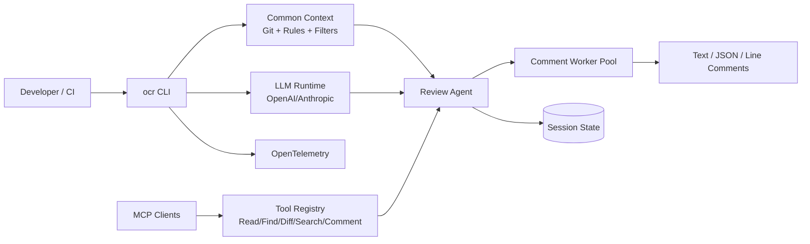
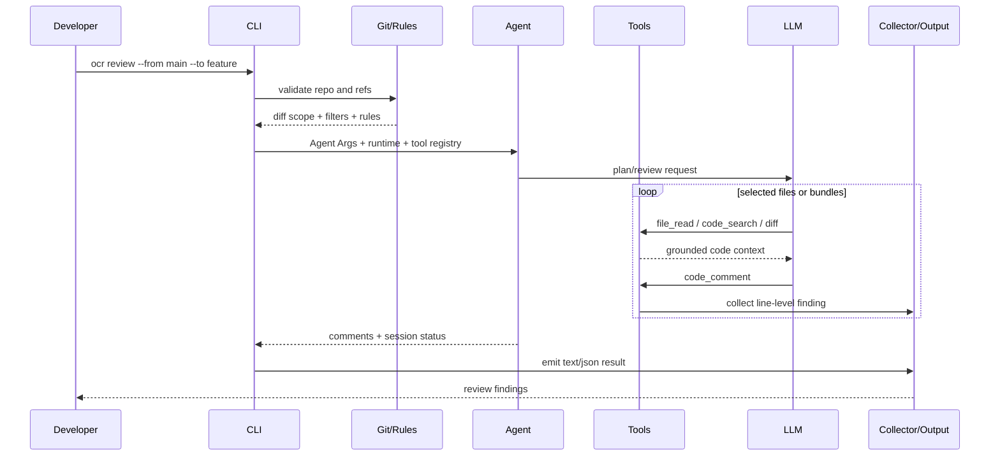
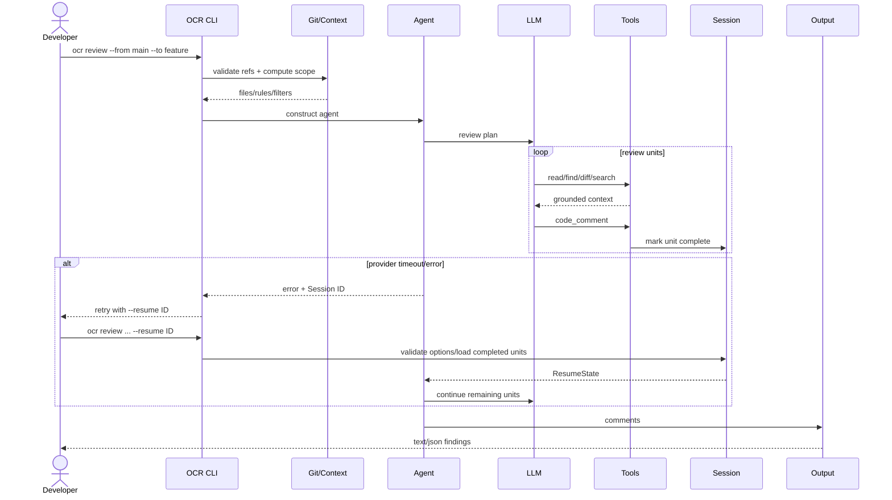

# alibaba/open-code-review 项目深度解析

## 1. 项目概览

- 报告日期：2026-07-24
- 仓库地址：https://github.com/alibaba/open-code-review
- Trending 原始排名：11
- Stars Today：180
- 项目定位：以确定性 Git 差异处理为骨架、LLM Agent 与工具调用为执行层的开源代码审查 CLI。
- 解决的问题：直接把大量代码塞给模型成本高、上下文不稳定且难以定位行级问题；项目先确定审查范围、规则和工具，再让 Agent 在受控环境中读取、搜索和生成评论。
- 目标用户：希望在本地、CI 或 PR 流程中加入 AI 辅助审查的开发者和工程团队。
- 当前成熟度：生产候选；CLI、规则、会话恢复、MCP 和遥测边界较完整，但审查效果仍依赖模型和团队验证。
- 推荐结论：值得研究“确定性流程如何约束 Agent”，适合作为 AI Code Review 工程基线，而不是把模型输出当自动合并许可证。

## 2. 系统架构

### 2.1 架构概览

`ocr` CLI 由 `cmd/opencodereview` 接收 review、scan、config、delegate、session 等命令。Review 路径先解析参数、确认 Git 仓库、验证 Commit Ref 防止参数注入，加载规则、过滤器、模型运行时和可选背景信息；随后注册文件读取、文件查找、Diff、代码搜索与评论收集工具，并接入可选 MCP Server。`internal/agent` 根据确定的审查模式和并发参数运行 LLM Agent，评论由 Collector 汇总，最终以文本或 JSON 输出并保存会话，失败时可通过 Session ID 恢复。

### 2.2 架构图

### 2.3 核心模块

| 模块 | 职责 | 代码位置 | 关键依赖 | 证据级别 |
|---|---|---|---|---|
| CLI Dispatch | 路由 review、scan、config、delegate、session 等子命令 | `cmd/opencodereview/main.go` | Go 标准库 | High |
| Review Command | 解析参数、验证 Ref、加载上下文与运行时、构建 Agent | `cmd/opencodereview/review_cmd.go` | internal/agent、tool、mcp、session | High |
| Common Context | 仓库根、规则模板、文件过滤、Git Runner | `cmd/opencodereview` common helpers | Git CLI、规则解析 | High |
| Agent | 规划与执行审查任务，管理并发和会话 | `internal/agent/` | LLM Client、Tools | High |
| Tool Registry | 文件读取、查找、Diff、代码搜索、评论输出 | `internal/tool/` | Git Runner、Collector | High |
| LLM Runtime | 提供商、模型和 Prompt/Tool Definition | `internal/llm/` | OpenAI/Anthropic SDK | High |
| MCP | 启动外部 MCP Server 并注册工具 | `internal/mcp/` | MCP Go SDK | High |
| Session | 保存审查进度并支持 `--resume` | `internal/session/` | 文件/序列化状态 | High |
| Telemetry | Trace、Metric 和运行属性 | `internal/telemetry/` | OpenTelemetry | High |

### 2.4 数据与状态管理

- 审查事实输入来自 Git 仓库、Commit/Range/Workspace Diff 和文件内容。
- 规则、模型、工具和过滤参数组成当前运行上下文。
- 评论通过 `CommentCollector` 汇总；并发文件任务由 Worker Pool 控制。
- Session 保存已完成审查项和选项，用于故障后 `--resume`。
- 未发现项目强制依赖外部数据库；运行状态主要位于本地仓库、配置与会话文件。

### 2.5 外部集成与协议

- Git CLI：解析仓库、Ref、Diff 与文件内容。
- OpenAI / Anthropic 兼容模型 SDK。
- MCP Go SDK：按配置启动外部工具 Server。
- OpenTelemetry：Trace 与 Metric 输出。
- GitHub Action、VS Code Extension 和 Plugin/Skill 目录提供其他使用入口，但核心 CLI 可独立运行。

### 2.6 部署与运行形态

核心形态是本地 Go CLI，也可在 CI/GitHub Action 中运行。配置 LLM 提供商后，用户在 Git 仓库内执行 `ocr review` 或 `ocr scan`；Delegation Mode 可不直接调用 LLM，而是输出给宿主 Agent 的审查规格。可选 Web Viewer 用于查看保存的 Session。

## 3. 主线流程

### 3.1 核心流程图

### 3.2 关键步骤

1. `dispatch()` 将 `review` 路由至 `runReview()`。
2. `parseReviewFlags` 解析 Range、Commit、并发、超时、模型和输出格式。
3. `loadCommonContext(..., requireGit=true)` 确认 Git 仓库并加载规则、文件过滤和 Git Runner。
4. `validateReviewRefs` 拒绝以 `-` 开头的 Ref，并使用 `git rev-parse --verify --end-of-options` 验证 Commit。
5. 加载 LLM Runtime，建立 FileReader、工具注册表和可选 MCP Client。
6. `agent.New` 接收范围、规则、模型、工具、Worker Pool、超时和 Resume State。
7. `ag.Run(ctx)` 调度审查；评论经 Collector 聚合，最后由 `emitRunResult` 输出。

### 3.3 异常与失败处理

- 非 Git 目录、无效 Ref 或参数注入：在任何审查调用前失败。
- 模型配置/连接失败：无法建立 LLM Runtime，直接返回错误。
- MCP Setup 或启动失败：打印警告并跳过该 MCP，审查继续使用内置工具。
- Agent 执行失败：记录 Trace Error；如果已生成 Session ID，输出可用于 `--resume` 的命令。
- Resume 参数与原审查范围不一致、无已完成项或 Workspace 模式：拒绝恢复，避免错误拼接状态。

## 4. 典型业务场景端到端执行链路

### 4.1 场景定义

| 项目 | 内容 |
|---|---|
| 场景名称 | 开发者审查 feature 分支相对 main 的改动，并在模型超时后从已完成会话继续 |
| 参与者 | 开发者、OCR CLI、Git Runner、规则/过滤器、LLM Runtime、Review Agent、Tool Registry、Session、Comment Collector |
| 前置条件 | 当前目录是 Git 仓库；main 与 feature Ref 有效；已配置模型提供商；示意命令中的分支名可替换为真实 Ref |
| 输入 | `ocr review --from main --to feature`（示意）；仓库 Diff、规则、模型和并发配置 |
| 期望结果 | 只审查范围内可评审文件，Agent 通过工具获取上下文并输出行级评论；中断时可凭 Session ID 继续未完成部分 |
| 成功判定 | CLI 返回结构化发现；评论包含文件/行位置；恢复后不会重复已完成审查项 |

### 4.2 端到端时序图

### 4.3 执行步骤追踪

| 步骤 | 输入 | 执行组件 | 关键代码位置 | 状态或数据变化 | 输出 | 失败分支 | 证据级别 |
|---:|---|---|---|---|---|---|---|
| 1 | CLI Args | `dispatch` | `cmd/opencodereview/main.go` | 选择 Review 子命令 | 进入 `runReview` | 未知命令返回错误 | High |
| 2 | From/To Ref | Flag + Ref Validation | `review_cmd.go` | 生成审查选项并验证 Commit Ref | 有效 Range | 非法/注入 Ref 拒绝 | High |
| 3 | Repo + Rules | Common Context | `loadCommonContext` 调用 | 确定 Git 根、过滤器、规则与 Runner | 审查上下文 | 非 Git 目录失败 | High |
| 4 | Provider/Model Config | LLM Runtime | `loadLLMRuntime` | 初始化 Client、Model、ToolDefs、Collector | LLM Runtime | 配置或连通失败 | High |
| 5 | FileReader + MCP Config | Tool Registry | `buildToolRegistry`、`initMCPClients` | 注册 read/find/diff/search/comment 与 MCP Tools | 可调用工具集合 | MCP 单项失败被跳过 | High |
| 6 | Agent Args | `agent.New` | `review_cmd.go` | 建立 Worker Pool、超时、Resume State | Agent | 参数/依赖错误 | High |
| 7 | Review Units | `ag.Run` | `internal/agent` | 已完成项和评论逐步增加 | Comments | LLM/工具错误返回 Session ID | Medium |
| 8 | Failed Session ID | `loadReviewResumeState` | `review_cmd.go` | 校验模式/Range，加载已完成项 | ResumeState | 选项不一致或无完成项拒绝 | High |
| 9 | Comments | `emitRunResult` | command output helpers | 输出 Text/JSON，结束 Trace | 行级审查结果 | 输出失败返回错误 | Medium |

### 4.4 关键状态与数据变化

- Review Options：CLI 字符串 → 已验证的 Commit/Range/Workspace 模式。
- Common Context：仓库目录 → 规则解析器、文件过滤器、Git Runner。
- Tool Registry：内置工具 + 成功启动的 MCP 工具。
- Agent Session：未开始 → 部分 Review Unit 完成 → 成功或可恢复失败。
- Comment Collector：空 → 带文件与行位置的发现集合。
- 本报告未发现强制外部数据库；Session 持久化位于本地运行环境。

### 4.5 失败传播、重试与回滚

输入和 Git Ref 错误在调用模型前失败，不产生审查会话。MCP Server 单项失败被降级跳过，不阻止内置工具审查。Agent 中途失败时不会假装成功：CLI 返回错误并打印 Session ID；用户以相同 Range/Commit 和 `--resume` 重试，系统验证选项一致后复用已完成单元。Workspace 模式不允许 Resume，避免动态工作区变化导致错误续跑。

### 4.6 最终业务结果

开发者得到与明确 Git 范围绑定的行级审查意见，并能区分工具、模型和规则产生的执行边界。中断后，已完成审查单元可以保留，减少从头重新消耗模型调用；但最终结论仍需要开发者验证和决定是否修改代码。

### 4.7 最小复现与验证方法

1. 在测试 Git 仓库创建 `main` 与 `feature` 两个 Commit，并制造一个可识别问题。
2. 安装 `ocr`，执行 `ocr config provider` 与 `ocr config model`。
3. 运行 `ocr review --from main --to feature --output json`（命令参数为官方支持，分支名为示意）。
4. 确认结果只包含目标 Diff 范围，并可定位文件和行。
5. 使用无效 Ref 验证审查在模型调用前失败。
6. 在长任务中模拟模型连接失败，记录 Session ID，再以同一范围加 `--resume <id>` 验证续跑。

## 5. 技术栈

| 层次 | 技术 | 用途 | 是否核心 | 证据位置 |
|---|---|---|---|---|
| 语言与运行时 | Go 1.25 | CLI、Agent 和工具实现 | 是 | `go.mod` |
| 版本控制 | Git CLI | Ref 验证、Diff 和文件读取 | 是 | `review_cmd.go` |
| LLM | OpenAI Go / Anthropic Go | 模型调用与 Tool Use | 是 | `go.mod`, `internal/llm` |
| Agent Tools | File Read/Find/Diff/Search/Comment | 受控读取与输出行级评论 | 是 | `buildToolRegistry` |
| 扩展协议 | MCP Go SDK | 外部审查工具扩展 | 否，可选 | `initMCPClients` |
| TUI | Bubble Tea/Bubbles/Lip Gloss | 配置和交互界面 | 否 | `go.mod` |
| 状态 | Local Session / ResumeState | 失败续跑与审查记录 | 是 | `internal/session` |
| 可观测性 | OpenTelemetry | Trace、Metric 与错误记录 | 否，可选 | `go.mod`, telemetry calls |

## 6. 创新点

### 创新点 1

- 类型：工作流与工程整合创新
- 传统方案：整仓或整段 Diff 直接作为 Prompt，模型自行决定看什么。
- 当前方案：先由确定性 Git、规则和过滤流程定义范围，再让 Agent 使用受控工具补上下文和产出评论。
- 实际收益：范围可复现，行级定位和安全校验更稳定，也便于在 CI 中审计。
- 证据：`runReview` 的 Ref 校验、Common Context、Tool Registry 和 Agent Args 构建顺序。
- 局限：确定性管线只能保证输入秩序，不能保证模型判断一定正确。

### 创新点 2

- 类型：可靠性创新
- 传统方案：模型调用中断后整次审查重跑。
- 当前方案：保存 Review Session，校验相同范围后恢复已完成审查项。
- 实际收益：降低长任务失败后的重复调用和等待。
- 证据：`loadReviewResumeState`、Session ID 输出和 `--resume` 校验。
- 局限：Workspace 模式不能 Resume，且 Session 完整性仍依赖本地状态。

## 7. 应用场景

### 适合

- 本地提交前或 PR 前的辅助审查。
- CI 中的结构化行级建议和安全规则补充。
- 需要多模型或 MCP 工具扩展的代码审查实验。

### 可以尝试

- 大型 Monorepo 的分批审查，但需调优过滤、并发和超时。
- 团队规则集与 LLM 审查结合，需要建立误报反馈闭环。

### 暂不建议

- 无人工复核就自动合并或阻断所有提交。
- 把模型输出当作安全审计、合规证明或漏洞不存在的结论。

## 8. 第一次阅读与验证建议

1. 先读 README 的 Architecture/Quick Start 与 `cmd/opencodereview/main.go`。
2. 再读 `review_cmd.go`，按参数、Context、Runtime、Tools、Agent、Output 顺序追。
3. 进入 `internal/agent` 查看 Review Unit 和并发调度。
4. 查看 `internal/tool` 的文件、Diff、搜索和评论实现。
5. 用小型仓库验证范围过滤、无效 Ref、模型失败和 Resume。

## 9. 风险与限制

- 安全：模型和 MCP 可能接触私有代码；需审查提供商、命令和数据外发策略。
- 性能：成本受 Diff 大小、工具轮次、并发和模型上下文影响。
- 许可证：Apache-2.0，外部模型、规则和 MCP 工具另有条款。
- 维护状态：功能面较完整，但模型 SDK、Prompt 与规则会持续变化。
- 生产可用性：应以团队误报率、漏报率、成本和审查时延进行本地基准。

## 10. Evidence Notes

- `main.go` 明确说明工具读取 Git Diff、调用可配置 LLM 并生成评论。
- `review_cmd.go` 明确执行 Git Repo 检查、Ref 防注入验证、LLM Runtime、工具注册、MCP、Agent 和 Session Resume。
- `buildToolRegistry` 注册 FileRead、FileFind、Diff、CodeSearch 和 CodeComment。
- `go.mod` 明确依赖 OpenAI、Anthropic、MCP 和 OpenTelemetry SDK。

## 11. Honest Caveat

本报告确认了 CLI 到 Agent 的主要控制流，但没有逐行展开 `internal/agent` 的全部规划、Bundle 和并发实现，也未运行项目基准。项目方关于 Token、成本和审查质量的比较应在目标仓库与目标模型上复测。

## 12. 可信度

- Architecture Confidence: High
- Flow Confidence: High
- Innovation Confidence: Medium
