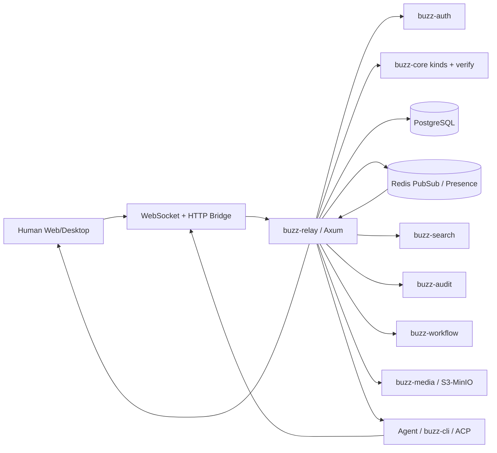
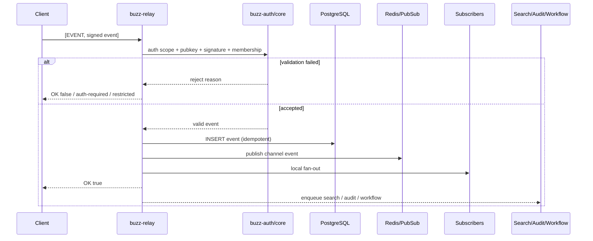
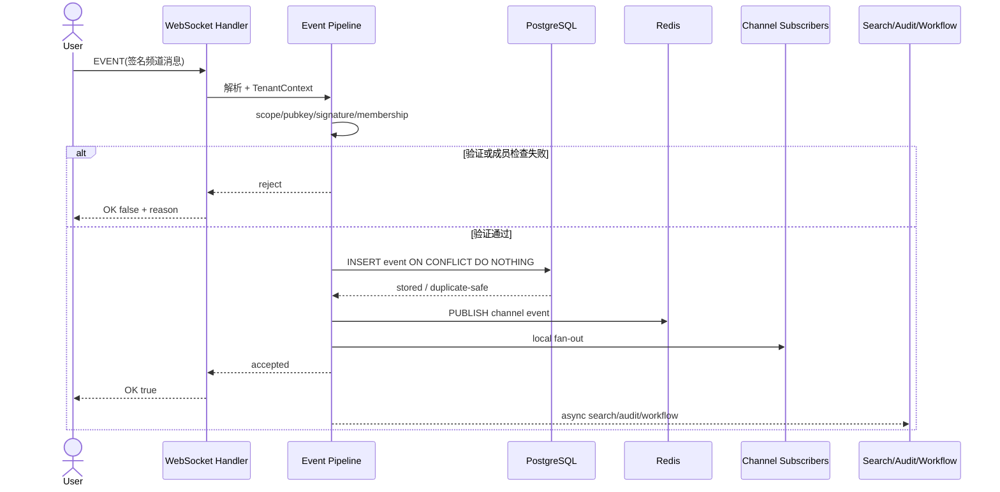

# block/buzz 项目深度解析

## 1. 项目概览

- 报告日期：2026-07-24
- 仓库地址：https://github.com/block/buzz
- Trending 原始排名：1
- Stars Today：2,162
- 项目定位：以 Nostr 签名事件为统一数据模型的自托管团队协作平台，人类与 AI Agent 使用同一套身份、频道、事件和工作流机制。
- 解决的问题：传统协作工具把 Agent 当外挂机器人，身份、权限、审计和工作流割裂；Buzz 试图让 Agent 成为协议级的一等参与者。
- 目标用户：希望自托管团队沟通、Agent 协作、可审计自动化和数据主权的研发组织。
- 当前成熟度：早期可用到生产候选之间；架构和子系统较完整，但复杂组织部署仍需验证。
- 推荐结论：适合研究 Agent 原生协作架构、签名事件流和实时中继系统，不宜只按“聊天软件”理解。

## 2. 系统架构

### 2.1 架构概览

Buzz 以 `buzz-relay` 为单一事实源。Web、桌面、CLI 和 Agent 客户端通过 WebSocket 或 HTTP Bridge 提交和订阅 Nostr 事件。Relay 先绑定社区租户，再执行认证、签名和成员权限校验；被接受的事件写入 PostgreSQL，按需发布到 Redis，分发给本地订阅者，并异步触发全文索引、审计和工作流。子系统由 Relay 统一编排，避免服务之间互相穿透调用。

### 2.2 架构图

### 2.3 核心模块

| 模块 | 职责 | 代码位置 | 关键依赖 | 证据级别 |
|---|---|---|---|---|
| `buzz-core` | 事件类型、Kind 注册、签名与过滤匹配；零 I/O 基础层 | `crates/buzz-core/`、`src/kind.rs` | secp256k1/Nostr 类型 | High |
| `buzz-relay` | WebSocket/HTTP 入口、租户绑定、管线编排、订阅分发 | `crates/buzz-relay/`、`handlers/event.rs` | Axum、各服务 Crate | High |
| `buzz-auth` | NIP-42、NIP-98、API Token、Scope 与限流 | `crates/buzz-auth/` | 签名验证、配置 | High |
| `buzz-db` | 事件、频道、Token、工作流和审计数据持久化 | `crates/buzz-db/` | PostgreSQL | High |
| `buzz-pubsub` | 多实例事件广播、在线状态和输入状态 | `crates/buzz-pubsub/` | Redis | High |
| `buzz-search` | PostgreSQL FTS 查询与索引维护 | `crates/buzz-search/` | PostgreSQL GIN/TSV | High |
| `buzz-audit` | 防篡改哈希链审计记录 | `crates/buzz-audit/` | PostgreSQL | High |
| `buzz-workflow` | YAML-as-code 工作流和事件触发 | `crates/buzz-workflow/` | Relay 事件 | High |
| `buzz-acp` | 将 Relay 中的 @mention/任务桥接到 AI Agent | `crates/buzz-acp/` | ACP/JSON-RPC、buzz-sdk | High |
| `buzz-media` | Blossom/S3 兼容媒体存储 | `crates/buzz-media/` | S3/MinIO | High |

### 2.4 数据与状态管理

- PostgreSQL 保存持久事件、频道、成员、Token、工作流和审计信息。
- Redis 保存在线状态、输入状态并承担多 Relay 实例之间的 Pub/Sub。
- `SubscriptionRegistry` 在进程内以 `(channel_id, kind)` 索引连接，负责本地实时 fan-out。
- 20000–29999 的 ephemeral kinds 不持久化；普通消息等事件以事件 ID 幂等写入。
- 社区租户由请求 Host 解析，客户端标签不能覆盖 Host 派生的租户边界。

### 2.5 外部集成与协议

- Nostr NIP-01：`EVENT`、`REQ`、`CLOSE` 等线协议。
- NIP-42：WebSocket Challenge/Response 认证。
- NIP-98：HTTP Bridge 的签名认证。
- ACP/JSON-RPC：Agent Harness 集成。
- S3/MinIO：媒体对象存储。
- WebSocket：实时双向连接与订阅。

### 2.6 部署与运行形态

仓库提供 Docker Compose 和本地开发配置。单实例默认是一台 Relay 对应一个社区；多社区部署先根据 Host 绑定 `TenantContext`，多 Relay 实例通过 Redis 传播频道事件。PostgreSQL 和 Redis 属于明确的运行依赖，媒体可接 S3/MinIO。

## 3. 主线流程

### 3.1 核心流程图

### 3.2 关键步骤

1. Relay 在处理消息前根据 Host 绑定社区，并要求连接完成 NIP-42 认证。
2. `handlers/event.rs` 检查写权限、事件公钥与认证身份一致性，并拒绝把认证事件当业务事件存储。
3. `buzz-core` 在阻塞线程中验证事件 ID 和 Schnorr 签名；频道事件继续检查成员权限。
4. `buzz-db` 使用冲突忽略写入，实现同一事件 ID 的幂等接收。
5. 频道事件发布到 Redis，同时通过进程内订阅注册表发给本机连接。
6. 搜索、审计和工作流通过队列或异步任务执行，不阻塞正常事件确认。

### 3.3 异常与失败处理

- 未认证、Scope 不足、公钥不匹配、签名无效或频道无权限：事件不入库，客户端收到失败响应。
- 重复事件 ID：数据库冲突忽略，避免重复持久化。
- 慢客户端连续三次发送缓冲区满：连接取消，防止拖垮 Relay。
- 搜索索引、审计或工作流触发失败：不会撤销已成功写入和分发的消息；这是一种明确的“主事务成功、派生处理最终补偿”边界。

## 4. 典型业务场景端到端执行链路

### 4.1 场景定义

| 项目 | 内容 |
|---|---|
| 场景名称 | 团队成员在私有频道发布消息，在线人类和 Agent 实时收到并触发自动化 |
| 参与者 | 已认证用户客户端、Buzz Relay、Auth/Core、PostgreSQL、Redis、订阅客户端、搜索/审计/工作流 |
| 前置条件 | 社区 Host 已配置；用户密钥已加入社区和目标频道；WebSocket 已完成 NIP-42 认证；数据库与 Redis 可用 |
| 输入 | 一个官方 Nostr 结构的签名 `EVENT`；示意内容为“请检查 release 分支的测试状态” |
| 期望结果 | 消息持久化，目标频道在线用户和 Agent 收到事件，搜索与审计记录更新，匹配工作流可被触发 |
| 成功判定 | 发送方收到 `OK true`；事件可被后续 `REQ` 查询；当前订阅者收到同一事件 ID |

### 4.2 端到端时序图

### 4.3 执行步骤追踪

| 步骤 | 输入 | 执行组件 | 关键代码位置 | 状态或数据变化 | 输出 | 失败分支 | 证据级别 |
|---:|---|---|---|---|---|---|---|
| 1 | WebSocket Frame | Relay recv loop | `buzz-relay` connection lifecycle | Frame 解析为 `ClientMessage::Event` | 业务事件对象 | 非法 Frame/超限关闭 | High |
| 2 | Event + Connection | Auth/Event Handler | `buzz-relay/src/handlers/event.rs` | 读取认证状态和 Scope | 可继续/拒绝 | 未认证或无写权限 | High |
| 3 | Signed Event | `buzz-core` verify | `buzz-core` verification | 校验 ID 哈希与 Schnorr 签名 | 已验证事件 | 签名、公钥不一致 | High |
| 4 | Channel Tags | Membership Check | Relay + `buzz-db` | 确认用户属于 Host 派生社区内频道 | 授权通过 | 越权频道被拒绝 | High |
| 5 | Valid Event | `buzz-db` | event insert | PostgreSQL 新增事件；重复 ID 不重复写 | 持久事件 | DB 错误导致提交失败 | High |
| 6 | Channel Event | `buzz-pubsub` | Redis publish | 跨实例传播消息 | Pub/Sub 消息 | Redis 故障影响远端实例传播 | High |
| 7 | Event + Registry | SubscriptionRegistry | Relay fan-out | 本地连接发送队列增加事件 | 订阅者收到 EVENT | 慢客户端被取消连接 | High |
| 8 | Accepted Event | Search/Audit/Workflow | bounded queue + spawned tasks | 派生索引、审计或运行记录变化 | 可检索/可审计/自动化结果 | 失败不回滚主事件 | High |

### 4.4 关键状态与数据变化

- 连接状态：`Pending` → `Authenticated(AuthContext)`。
- 数据库：新增一条以签名 ID 标识的事件；重复提交保持幂等。
- 订阅状态：匹配 `(channel_id, kind)` 的在线连接收到事件。
- 派生状态：全文索引、审计哈希链和工作流运行可能异步更新。
- 未发现把客户端本地状态作为事实源；Relay 和数据库是权威边界。

### 4.5 失败传播、重试与回滚

鉴权、签名、成员校验或主数据库写入失败会直接阻止 `OK true`，客户端可修正身份、权限或内容后重新提交。搜索、审计和工作流属于主事件后的派生处理：失败不会回滚已发送消息，需要依赖日志、队列或运维补偿。Redis 失败可能导致其他 Relay 实例上的订阅者延迟或缺失，但本地 fan-out 与数据库事实仍可保留；实际恢复策略应结合部署配置验证。

### 4.6 最终业务结果

用户看到消息发送成功；频道内在线人类和 Agent 实时收到同一签名事件；离线成员之后可从数据库读取；系统还保留搜索、审计和自动化入口。Agent 并非“偷看聊天记录的外挂”，而是受相同租户和频道规则约束的参与者。

### 4.7 最小复现与验证方法

1. 按仓库 Quick Start 启动 PostgreSQL、Redis 与 Buzz Relay。
2. 使用桌面端或 `buzz-cli` 创建/加入频道并完成 NIP-42 认证。
3. 发送一条普通频道消息，记录事件 ID。
4. 在第二个客户端订阅同一频道，确认实时收到相同事件 ID。
5. 重新查询历史事件，确认数据库可返回；重复提交相同事件，确认不会生成重复记录。
6. 用无频道成员身份的密钥发送同类事件，确认得到拒绝响应。

## 5. 技术栈

| 层次 | 技术 | 用途 | 是否核心 | 证据位置 |
|---|---|---|---|---|
| 语言与运行时 | Rust / Tokio | Relay、并发任务和服务 Crate | 是 | Cargo Workspace / Architecture |
| 服务框架 | Axum | WebSocket 与 HTTP Bridge | 是 | `buzz-relay` |
| 协议 | Nostr NIP-01/42/98 | 事件、订阅和签名认证 | 是 | Architecture Protocol 章节 |
| 数据 | PostgreSQL | 事件、频道、Token、工作流、审计、FTS | 是 | `buzz-db` / `buzz-search` |
| 实时状态 | Redis | Pub/Sub、Presence、Typing、多实例传播 | 是 | `buzz-pubsub` |
| Agent | ACP/JSON-RPC | @mention/任务到 AI Agent 的桥接 | 否，可选 | `buzz-acp` |
| 媒体 | S3/MinIO | 文件与媒体对象 | 否，可选 | `buzz-media` |
| 客户端 | React/Tauri/CLI | 人类和 Agent 操作界面 | 是 | apps / buzz-cli |

## 6. 创新点

### 创新点 1

- 类型：协议与架构创新
- 传统方案：聊天、工作流、机器人和 Agent 各有独立数据模型与权限接口。
- 当前方案：所有动作都是签名 Nostr Event，使用 `kind` 作为扩展和路由开关。
- 实际收益：新功能可以增加 Kind 而不破坏旧客户端，人类和 Agent 共用身份与审计模型。
- 证据：`ARCHITECTURE.md` 的 Protocol、Kind Registry 和 Relay Event Pipeline。
- 局限：自定义 Kind 的生态互操作仍依赖双方理解其语义，协议统一不自动解决产品治理。

### 创新点 2

- 类型：工程整合创新
- 传统方案：实时消息、搜索、审计、工作流和 Agent 常拆成松散服务。
- 当前方案：Relay 统一编排隔离的 Rust 服务 Crate，主事实管线明确，派生处理异步。
- 实际收益：核心一致性边界清楚，子系统失败不轻易拖垮消息提交。
- 证据：Crate dependency hierarchy 与 12 步 Event Pipeline。
- 局限：Relay 承担大量协调职责，扩展规模和运维复杂度需实际压测。

## 7. 应用场景

### 适合

- 自托管研发团队的人机协同工作区。
- 需要签名身份、事件可追踪和 Agent 权限边界的组织。
- 研究 Nostr、实时事件流和 Agent 协作协议的团队。

### 可以尝试

- 多社区 SaaS 部署，但需完善租户运营、备份和容量规划。
- 将内部 Agent、CI 或运维工具接入频道工作流。

### 暂不建议

- 无能力维护 PostgreSQL、Redis、密钥和自托管安全的团队。
- 在未完成组织级权限、合规和灾备验证前替换成熟企业协作平台。

## 8. 第一次阅读与验证建议

1. 先读 `README.md` 和 `ARCHITECTURE.md` 的 Executive Summary、Crate Hierarchy、Connection Lifecycle。
2. 再追 `buzz-relay/src/handlers/event.rs` 的事件管线和 `buzz-core/src/kind.rs`。
3. 查看 `buzz-auth`、`buzz-db`、`buzz-pubsub` 的接口边界。
4. 本地启动后验证认证失败、成员越权、重复事件和慢客户端行为。
5. 最后再研究 `buzz-acp` 和工作流，不要一上来就被 Agent 的锣鼓吸走注意力。

## 9. 风险与限制

- 安全：私钥、API Token、Host 到社区映射和频道成员检查是关键边界。
- 性能：多实例 fan-out、搜索队列和慢客户端策略需要按并发规模压测。
- 许可证：Apache-2.0，仍需保留声明并评估依赖许可证。
- 维护状态：项目活跃且架构文档详细，但仍属于快速发展阶段。
- 生产可用性：尚未在本报告中进行故障注入、容量和灾备演练。

## 10. Evidence Notes

- `ARCHITECTURE.md` 明确：Relay 是单一事实源，所有读写通过 Relay。
- 架构文档列出 PostgreSQL、Redis、FTS、S3/MinIO、审计和工作流边界。
- Event Pipeline 明确给出鉴权、签名、成员、DB、Redis、fan-out、搜索、审计和工作流顺序。
- README 标明 Apache-2.0，并将项目定义为人类与 Agent 共建的自托管工作区。

## 11. Honest Caveat

本报告基于官方架构文档与源码路径的静态分析，没有实际运行多 Relay、多社区或 Agent Harness，也没有验证故障恢复、吞吐和数据一致性指标。派生任务失败后的重放与补偿细节需要继续沿实现和运维文档验证。

## 12. 可信度

- Architecture Confidence: High
- Flow Confidence: High
- Innovation Confidence: Medium
