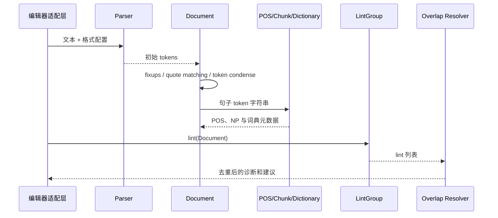
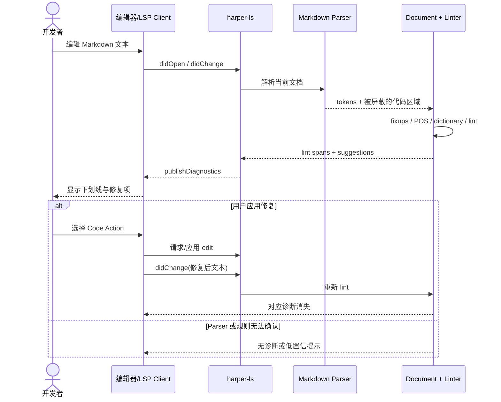

# Automattic/harper 项目深度解析

## 1. 项目概览

- 报告日期：2026-07-25
- 仓库地址：https://github.com/Automattic/harper
- Trending 原始排名：06
- Stars Today：876
- 项目定位：离线、隐私优先的英文语法与拼写检查引擎，并通过 LSP、WASM、CLI、桌面端和编辑器插件复用同一 Rust 核心。
- 解决的问题：云端语法检查存在隐私、延迟和持续费用；大型本地方案又可能占用大量内存。Harper 试图以小型本地语言处理管线提供即时建议。
- 目标用户：英文写作者、开发者、编辑器插件作者、隐私敏感团队和需要嵌入式 lint 能力的产品。
- 当前成熟度：成熟项目。Rust workspace 包含多个解析器、语言服务器、WASM、CLI 与桌面集成，仓库有长期提交历史。
- 推荐结论：适合评估为本地英文校对引擎，尤其适合编辑器与隐私敏感场景；非英语需求和复杂语义改写不应高估。

## 2. 系统架构

### 2.1 架构概览

Harper 采用“一个语言核心，多种外壳”的结构。`harper-core` 接收文本和对应 Parser，形成 `Document`；Parser 先词法化并标记需要忽略的代码/标记区，随后核心补齐 token、词典元数据、Brill 词性和名词短语信息。Lint 规则在 `Document` 上运行，重叠建议经过优先级消解。上层的 `harper-ls`、`harper-wasm`、`harper-cli` 和编辑器插件只负责协议、生命周期和结果转换。

### 2.2 架构图

### 2.3 核心模块

| 模块 | 职责 | 代码位置 | 关键依赖 | 证据级别 |
|---|---|---|---|---|
| Workspace | 组合核心、LSP、WASM、CLI、桌面和多种格式解析器 | `Cargo.toml` | Cargo workspace | High |
| Document | 保存字符源和 token，执行解析修正、词性标注和词典元数据补全 | `harper-core/src/document.rs` | `harper_brill`, `FstDictionary` | High |
| Parser 层 | 将纯文本、Markdown、HTML、Typst 等输入映射为 token，并屏蔽不应检查的区域 | `harper-core/src/parsers/`, `harper-html/`, `harper-typst/` | 格式专用解析逻辑 | High |
| Lint 引擎 | 在 Document 上运行拼写、语法和模式规则，输出带 span 与建议的 lint | `harper-core/src/linting/` | patterns, spell, dictionary | High |
| 冲突消解 | 按 span 和 priority 移除重叠 lint，避免同一文本区堆叠相互冲突的提示 | `harper-core/src/lib.rs:remove_overlaps*` | `Lint.priority`, `Span` | High |
| 协议适配 | 将 core 诊断映射为 LSP、WASM/JS、CLI 或桌面端结果 | `harper-ls/`, `harper-wasm/`, `harper-cli/`, `harper-desktop/` | LSP / wasm-bindgen / Tauri | Medium-High |

### 2.4 数据与状态管理

核心数据结构 `Document` 只持有字符源和 token 向量。`Document::new_from_chars` 调用 Parser 生成 token，再执行 fixups、Brill 词性标注、短语 chunk 和词典元数据补全。普通 lint 过程主要是内存计算；未发现核心引擎把用户文本写入数据库或远端服务。

### 2.5 外部集成与协议

- LSP：编辑器通过语言服务器获得 diagnostics 与 code actions。
- WebAssembly：`harper-wasm` 让浏览器和 JavaScript 产品调用核心。
- CLI / desktop：提供批处理或桌面使用方式。
- 编辑器生态：VS Code、Neovim、Helix、Emacs、Zed、Obsidian 等通过不同适配层接入。

### 2.6 部署与运行形态

核心是 Rust 库，可编译为本地二进制或 WASM。LSP 作为本地子进程运行；浏览器版加载 WASM；桌面端由 Tauri 外壳承载。默认路径不需要云端服务。

## 3. 主线流程

### 3.1 核心流程图

### 3.2 关键步骤

1. 适配层根据文件类型选择 Parser，将文本转为 token。
2. `Document::parse` 进行空格、换行、缩写、引号等修正，并用 Brill tagger 与 chunker 添加语言元数据。
3. 规则集合遍历 Document，产生 span、优先级、消息和替换建议。
4. `remove_overlaps` 按位置和 priority 移除冲突建议。
5. LSP/WASM/CLI 将字符 span 转成宿主需要的诊断格式。

### 3.3 异常与失败处理

- 不支持或解析不完整的格式可能导致某些区域被错误检查，适配层需正确选择 Parser。
- 重叠规则通过 priority 消解；若规则设计不当，低优先级提示可能被移除。
- LSP 子进程启动或协议失败由宿主编辑器呈现；核心本身不负责网络重试。

## 4. 典型业务场景端到端执行链路

### 4.1 场景定义

| 项目 | 内容 |
|---|---|
| 场景名称 | 开发者在 Markdown 文档中输入拼写错误，编辑器实时显示修复建议 |
| 参与者 | 开发者、编辑器、Harper LSP、Markdown Parser、harper-core Linter |
| 前置条件 | 已安装 Harper 语言服务器与编辑器扩展；文件语言为英语；LSP 已建立文档会话 |
| 输入 | `This sentense has an eror.`（示意文本） |
| 期望结果 | 编辑器显示拼写/语法诊断，并可应用替换建议 |
| 成功判定 | diagnostics 指向正确字符范围；应用建议后对应诊断消失 |

### 4.2 端到端时序图

### 4.3 执行步骤追踪

| 步骤 | 输入 | 执行组件 | 关键代码位置 | 状态或数据变化 | 输出 | 失败分支 | 证据级别 |
|---:|---|---|---|---|---|---|---|
| 1 | 文档变更事件 | 编辑器 + `harper-ls` | `harper-ls/` | 会话中的文档文本更新 | 当前文本与文件类型 | LSP 未启动则无检查 | Medium |
| 2 | Markdown 文本 | Markdown Parser | `harper-core/src/parsers/`, `Document::new_markdown*` | 文本变为字符源和 token | 初始 token 序列 | 格式识别错误可能检查代码区 | High |
| 3 | token 序列 | `Document::parse` | `harper-core/src/document.rs` | 增加 fixup、POS、NP、词典元数据 | 丰富 Document | 未知词元数据缺失 | High |
| 4 | Document | `LintGroup` | `harper-core/src/linting/` | 生成 lint 列表 | span、消息、建议 | 规则未覆盖则无提示 | High |
| 5 | 重叠 lint | overlap resolver | `harper-core/src/lib.rs` | 按 priority 删除冲突项 | 稳定诊断集合 | 规则优先级不合理会抑制提示 | High |
| 6 | lint 集合 | `harper-ls` | `harper-ls/` | 转为 LSP range/diagnostic | `publishDiagnostics` | 字符与 UTF-16 position 映射错误 | Medium |
| 7 | 用户应用建议 | 编辑器与 LSP | LSP code action 路径 | 文档文本被替换并再次分析 | 诊断消失 | 建议与并发编辑冲突时需重新计算 | Medium |

### 4.4 关键状态与数据变化

- 文本：编辑器文档 → `Lrc<[char]>`。
- 结构：字符 → token → 带词性、短语和词典元数据的 token。
- 结果：规则输出 → 去重 lint → LSP diagnostics。
- 未发现核心链路持久化用户文本或发送远端请求。

### 4.5 失败传播、重试与回滚

如果文件 Parser 选择错误，诊断可能包含代码块等不应检查区域；通常通过更换文件类型配置或重新解析解决。应用建议时若文档版本已变化，LSP edit 可能失效，客户端应重新请求诊断，而不是强行套用旧 span。核心规则执行是纯内存过程，没有数据库回滚。

### 4.6 最终业务结果

用户在原编辑器内得到低延迟、无需上传云端的英文校对建议；修复后重新 lint，诊断状态即时收敛。

### 4.7 最小复现与验证方法

1. 安装 `harper-ls` 或官方支持的编辑器扩展。
2. 新建 Markdown 文档，输入示意错误文本。
3. 记录首次 diagnostics 的范围、建议和响应时间。
4. 应用建议，确认文档变更后诊断消失。
5. 加入代码块，确认 Parser 不会把代码内容当普通英文全部检查。

## 5. 技术栈

| 层次 | 技术 | 用途 | 是否核心 | 证据位置 |
|---|---|---|---|---|
| 语言与运行时 | Rust | 核心解析、规则和多种二进制 | 是 | workspace `Cargo.toml` |
| NLP | Brill tagger + chunker | 词性标注和名词短语信息 | 是 | `harper-core/src/document.rs` |
| 词典 | FST dictionary | 拼写和词元元数据查询 | 是 | `harper-core/src/spell/` |
| 协议 | Language Server Protocol | 编辑器诊断和修复交互 | 重要 | `harper-ls/` |
| Web | WebAssembly | 浏览器和 JS 嵌入 | 重要 | `harper-wasm/` |
| 桌面 | Tauri | 桌面应用外壳 | 可选 | `harper-desktop/src-tauri/` |
| 格式适配 | Markdown/HTML/Typst/TeX 等 Parser | 屏蔽标记并提取可检查文本 | 重要 | workspace parser crates |

## 6. 创新点

### 创新点 1

- 类型：工程整合创新
- 传统方案：不同编辑器或 Web 产品各自实现语法检查，或依赖远端 SaaS。
- 当前方案：一个 `harper-core` 通过 LSP、WASM、CLI 和桌面适配复用。
- 实际收益：语言规则一致、可离线、集成面广。
- 证据：Cargo workspace 与官方架构文档。
- 局限：适配层仍需处理宿主坐标、生命周期和格式差异。

### 创新点 2

- 类型：性能与隐私导向设计
- 传统方案：云端模型或大型 n-gram 数据集。
- 当前方案：本地 token、词典、POS/chunk 和规则管线，可编译为 WASM。
- 实际收益：不发送文本、启动与响应成本较低。
- 证据：README 和 `Document` 代码。
- 局限：复杂语义改写和多语言覆盖不如大模型或大型语言平台。

## 7. 应用场景

### 适合

- 编辑器内英文拼写和语法检查。
- 隐私敏感或离线环境。
- 需要在浏览器产品嵌入轻量校对能力。

### 可以尝试

- CI 中的文档 lint。
- 企业内部自定义词典与规则。
- 对 Markdown、技术文档和提交信息的批量检查。

### 暂不建议

- 非英语为主的产品。
- 需要深度语义重写、事实核验或风格生成的场景。
- 把维护者性能数字直接当成自身工作负载保证。

## 8. 第一次阅读与验证建议

1. 先读根 README 和官方 Architecture 文档。
2. 再看 `harper-core/src/document.rs`、`linting/` 与一个格式 Parser。
3. 跟踪 `harper-ls` 如何把 lint 转成 diagnostics。
4. 运行一个 Markdown 最小样例并加入代码块、链接和拼写错误。
5. 用同一文本比较 CLI、LSP 与 WASM 输出是否一致。

## 9. 风险与限制

- 安全：本地执行降低文本泄露风险，但编辑器插件和二进制供应链仍需校验。
- 性能：维护者声称毫秒级和较低内存；需用真实文档规模独立测量。
- 许可证：Apache-2.0。
- 维护状态：活跃，workspace 较大，规则变化可能影响提示结果。
- 生产可用性：适合作为辅助校对，不应自动接受所有建议。

## 10. Evidence Notes

- `README.md`：项目目标、隐私、本地运行、WASM 和编辑器集成。
- `Cargo.toml`：核心、LSP、WASM、CLI、桌面与多格式 crate。
- `harper-core/src/document.rs`：Parser、fixups、Brill tagger、chunker 与词典元数据流程。
- `harper-core/src/lib.rs`：lint 重叠消解。
- 官方 Architecture 文档：core / LSP / JS-WASM 分层。

## 11. Honest Caveat

本报告进行了源码和官方文档静态追踪，没有在所有编辑器中运行 Harper，也没有独立复测维护者公布的延迟和内存数据。LSP 的具体诊断转换细节只追到模块级，因此少量步骤标记为 Medium。

## 12. 可信度

- Architecture Confidence: High
- Flow Confidence: High
- Innovation Confidence: Medium
