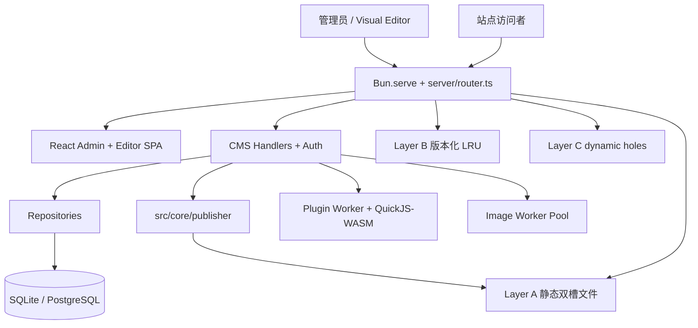
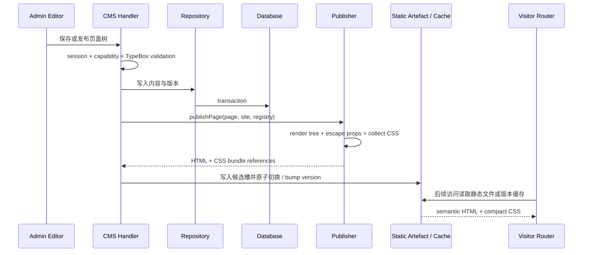
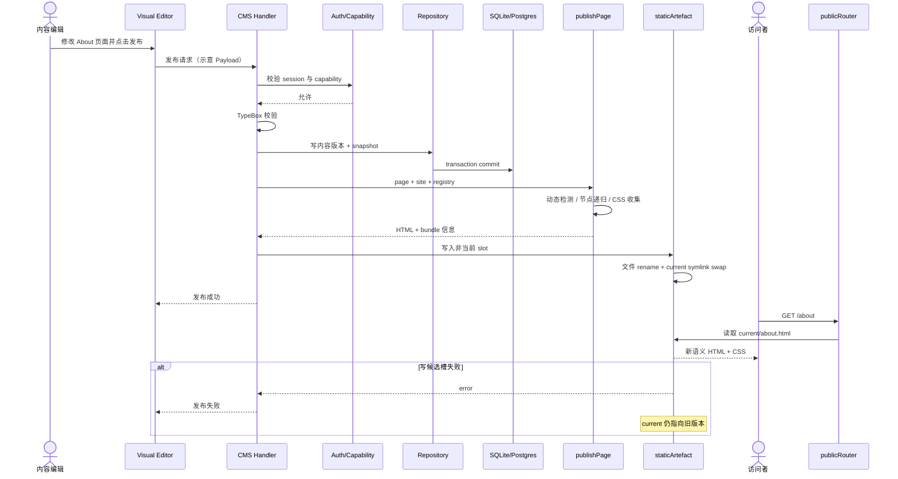

# CoreBunch/Instatic 项目深度解析

## 1. 项目概览

- 报告日期：2026-07-25
- 仓库地址：https://github.com/CoreBunch/Instatic
- Trending 原始排名：11
- Stars Today：201
- 项目定位：一个自托管视觉 CMS；编辑器、内容 API、认证、插件、媒体和公开页面由单个 Bun 服务承载，发布结果优先是静态语义 HTML/CSS。
- 解决的问题：传统网站堆叠视觉建站器、Headless CMS、框架、表单、媒体和托管服务，运维和数据边界分散；Instatic 尝试把网站全生命周期统一到一个可自托管系统中。
- 目标用户：小型内容团队、独立开发者、代理机构、自托管站点运营者，以及希望可视化编辑但不接受公共页面携带大型前端运行时的团队。
- 当前成熟度：早期可用。仓库版本 0.0.13，架构文档和自动化测试较完整，但功能面很宽，仍应按生产候选而非成熟平台评估。
- 推荐结论：适合研究单进程 CMS、静态发布三层路径和受限插件架构；上线前需要重点验证备份、升级、插件权限和多实例行为。

## 2. 系统架构

### 2.1 架构概览

Instatic 以 `server/index.ts` 启动单个 Bun 进程，手写 Router 分发 `/admin/api/`、管理 SPA、媒体和公开页面。数据库由 `DATABASE_URL` 选择 SQLite 或 PostgreSQL。管理后台和视觉编辑器构建为同一个 React/Vite SPA。发布器将页面树与站点文档转为 HTML/CSS：完全静态页面写入双槽目录并用符号链接原子切换；需要运行时数据的页面走版本化 LRU；请求相关节点被自动识别为 `<instatic-hole>`，由约 1.1 KB runtime 延迟加载。插件服务端代码在每插件一个 Bun Worker 中的 QuickJS-WASM 沙箱运行，图片变体由另一组 Worker 处理。

### 2.2 架构图

### 2.3 核心模块

| 模块 | 职责 | 代码位置 | 关键依赖 | 证据级别 |
|---|---|---|---|---|
| HTTP 入口与路由 | 启动 Bun.serve，分发 admin API、SPA、uploads 和公开页面 | `server/index.ts`, `server/router.ts` | Bun | High |
| Auth / CMS handlers | 会话、能力校验和资源级 API | `server/auth/`, `server/handlers/cms/` | TypeBox, repositories | High |
| 数据访问 | 统一 repository，按环境使用 SQLite 或 PostgreSQL adapter | `server/repositories/`, `server/db/` | `bun:sqlite`, `Bun.sql` | High |
| 内容模型 | `data_tables` + `data_rows` 统一表示页面、文章、组件、布局和自定义集合 | migrations / repositories / docs | TypeBox schemas | High |
| Visual Editor | Canvas、面板、工具栏和 editor store | `src/admin/pages/site/` | React, Zustand, DnD Kit, Tiptap | High |
| Publisher Core | 页面树递归、属性绑定、escape、模块 render、CSS 收集和 HTML 组装 | `src/core/publisher/` | pure module renderers | High |
| Public Router | 静态快路、版本化缓存和 live render | `server/publish/publicRouter.ts` | staticArtefact, renderCache | High |
| Plugin Sandbox | 每个活动插件在 Bun Worker + QuickJS-WASM 中运行 | `server/plugins/` | quickjs-emscripten | High |
| Image Variant Worker | resize、WebP 与 BlurHash，避免阻塞主线程 | `server/handlers/cms/imageVariant*` | sharp, BlurHash | High |

### 2.4 数据与状态管理

- 内容：`data_tables` 定义集合类型，`data_rows` 保存页面、文章、组件和自定义数据。
- 发布快照：`site_snapshots` 保存站点文档，版本记录关联 snapshot，形成审计基线。
- 静态文件：`uploads/published/current/<route>.html` 指向双槽中的当前版本，发布时原子切换。
- 动态缓存：内存 LRU 以 URL path 与规范化 query 为键，并带 publish version。
- 插件：持久化配置经受控 SDK 访问；插件进程本身没有默认文件系统、环境变量或网络权限。

### 2.5 外部集成与协议

- HTTP/JSON：管理 API 与公共页面。
- 数据库：SQLite 或 PostgreSQL。
- 存储：本地 uploads，可由媒体 adapter 扩展。
- 插件 SDK：HTTP routes、后台页面、存储、计划任务、循环数据源、模块和生命周期 hook。
- AI：支持 Claude、OpenAI、OpenRouter 或 Ollama，使用用户自己的模型凭证；该部分通过同一页面树/import 管线改写编辑节点。

### 2.6 部署与运行形态

开发环境仅需 Bun，默认 SQLite。生产可使用单 Docker 镜像，搭配持久卷；PostgreSQL 模式可多实例部署，并用 advisory lock 避免计划任务重复执行。官方也提供 Railway、Render、VPS 与 Caddy 指南。

## 3. 主线流程

### 3.1 核心流程图

### 3.2 关键步骤

1. 管理员在 React Visual Editor 中修改页面树，客户端通过 CMS API 保存。
2. Handler 校验 session、capability 和 TypeBox body，再经 repository 写入数据库。
3. 发布动作捕获页面版本和站点 snapshot，调用 `publishPage`。
4. Publisher 自底向上渲染节点，解析绑定、转义属性、调用纯 `module.render` 并去重 CSS。
5. 静态页面写入非当前槽，完成后切换 `current`；动态页面更新 publishVersion，使旧缓存惰性失效。
6. 访问者请求优先走磁盘静态文件；否则查询 LRU 或 live render，dynamic hole 由小型 runtime 拉取。

### 3.3 异常与失败处理

- Body 或持久化 JSON 不符合 TypeBox schema 时，handler 返回错误 envelope，不进入发布。
- 双槽发布先写候选槽，失败不会替换 current，避免半成品页面上线。
- 渲染开始后若 publishVersion 变化，结果不写入缓存，防止中途发布产生旧 HTML。
- 插件 Worker 崩溃按 crash budget 隔离和重启，不让插件代码直接拖垮主进程。
- SQLite 模式是单实例；多实例需 PostgreSQL 和 advisory lock。

## 4. 典型业务场景端到端执行链路

### 4.1 场景定义

| 项目 | 内容 |
|---|---|
| 场景名称 | 内容编辑发布 About 页面，访问者随后读取原子切换后的静态 HTML |
| 参与者 | 内容编辑、Visual Editor、CMS API、数据库、Publisher、静态文件层、访问者 |
| 前置条件 | 已完成站点初始化和登录；编辑者拥有页面发布能力；SQLite/Postgres 与 uploads 可写 |
| 输入 | 更新后的 About 页面树和发布请求（字段为示意，实际以 API Schema 为准） |
| 期望结果 | 新版本写入数据库与静态候选槽，原子切换后访问者看到新 HTML，草稿未提前泄露 |
| 成功判定 | 发布 API 成功；current 静态页面包含新内容；旧版本可在版本记录中追溯；访问者无半成品窗口 |

### 4.2 端到端时序图

### 4.3 执行步骤追踪

| 步骤 | 输入 | 执行组件 | 关键代码位置 | 状态或数据变化 | 输出 | 失败分支 | 证据级别 |
|---:|---|---|---|---|---|---|---|
| 1 | 页面编辑动作 | React Visual Editor | `src/admin/pages/site/` | Editor store 中页面树变化 | 保存/发布请求 | 客户端校验失败阻止请求 | High |
| 2 | session + Payload | CMS handler / Auth | `server/handlers/cms/`, `server/auth/` | 无持久化变化 | 认证和 capability 结果 | 401/403 或 schema error | High |
| 3 | 合法页面树 | Repository | `server/repositories/` | `data_rows` / version / snapshot 在事务中更新 | 持久版本 | DB 失败回滚 transaction | High |
| 4 | Page + SiteDocument | `publishPage` | `src/core/publisher/render.ts` | 生成 HTML、CSS map、dynamic node 集 | `{filename, html, jsModuleIds}` | render/escape/module error | High |
| 5 | HTML 与 route | static artefact layer | `server/publish/staticArtefact.ts` | 写非当前槽，完成后切换 `current` | 新静态版本生效 | 写入失败保持旧 current | High |
| 6 | publish 事件 | publish state/cache | `server/publish/publishState.ts`, `renderCache.ts` | publishVersion 增加，旧缓存惰性失效 | 新版本号 | 中途渲染结果被丢弃而非缓存 | High |
| 7 | GET /about | Public Router | `server/publish/publicRouter.ts` | 只读；命中静态文件 | 200 HTML | 静态缺失则走缓存/live render/404 | High |
| 8 | 新页面 | 浏览器 | semantic HTML + hashed CSS | DOM 渲染 | 用户看到新内容 | 动态洞失败时对应片段错误/空缺 | Medium-High |

### 4.4 关键状态与数据变化

- 草稿页面树 → 数据库中的新内容版本。
- 发布时生成或关联 `SiteDocument` snapshot。
- HTML/CSS 写入非当前发布槽。
- `current` 符号链接原子切换到新槽。
- publishVersion 增加，内存缓存按版本惰性失效。
- 访问者常见路径只读取静态文件，不触发数据库查询。

### 4.5 失败传播、重试与回滚

数据库事务失败时不调用发布。渲染或文件写入失败时，候选槽不会替换 `current`，访问者继续看到旧版本；编辑者可修复内容后重新发布。发布中途发生版本变化时，正在生成的 live render 不进入 LRU，下一请求按新版本重新生成。该设计不是数据库与文件系统的分布式事务，极端进程崩溃仍应通过版本记录、槽目录和备份做恢复演练。

### 4.6 最终业务结果

编辑者完成一次可追踪发布；访问者获得不含 React hydration 的语义 HTML 和紧凑 CSS，常见路径不需要每次查询数据库。旧静态页面在新版本完全写好前持续服务。

### 4.7 最小复现与验证方法

1. 按 README 用 Bun + SQLite 启动本地实例。
2. 初始化 owner，创建 `/about` 页面并首次发布。
3. 记录 `uploads/published/` 的 slot 与 `current` 指向。
4. 修改文本再次发布，确认 symlink 切换且 GET `/about` 返回新内容。
5. 模拟候选目录不可写，确认发布失败且旧页面仍可访问。
6. 添加动态节点，观察静态 shell、`<instatic-hole>` 与 hole endpoint 行为。

## 5. 技术栈

| 层次 | 技术 | 用途 | 是否核心 | 证据位置 |
|---|---|---|---|---|
| 运行时 | Bun 1.3 | HTTP、任务、Worker、SQLite/SQL | 是 | package.json / architecture docs |
| 语言 | TypeScript | 服务端、核心、编辑器和插件 SDK | 是 | 全仓库 |
| 管理前端 | React 19 + Vite | Admin shell 与 Visual Editor | 是 | package.json, `src/admin/` |
| 编辑器状态 | Zustand + Mutative | Canvas/editor store | 重要 | package.json |
| 富文本 | Tiptap / CodeMirror | 内容与代码编辑 | 重要 | package.json |
| 数据库 | SQLite / PostgreSQL | 内容、版本、配置和审计 | 是 | `server/db/` |
| Schema | TypeBox | HTTP 与持久化边界校验 | 是 | docs / package.json |
| 发布 | 纯字符串 renderer + hashed CSS | 页面树转语义 HTML/CSS | 是 | `src/core/publisher/` |
| 缓存 | LRU + publishVersion | 动态页面 live render | 重要 | `server/publish/renderCache.ts` |
| 插件隔离 | Bun.Worker + QuickJS-WASM | 限权插件服务端执行 | 重要 | `server/plugins/` |
| 媒体 | sharp + BlurHash Worker | 图片变体与预览 | 重要 | imageVariant worker |
| 部署 | Docker / Caddy / Railway / Render | 自托管交付 | 重要 | compose / docs |

## 6. 创新点

### 创新点 1

- 类型：架构与工程整合创新
- 传统方案：视觉编辑、CMS、静态构建、表单和插件由多个 SaaS/服务拼接。
- 当前方案：单 Bun 进程统一承载编辑、内容、公开页面和发布，只有插件与图片 CPU 任务放入 Worker。
- 实际收益：部署和数据边界简单，备份集中。
- 证据：官方 architecture 和 README。
- 局限：单进程减少组件也扩大共同故障域，功能面过宽增加升级风险。

### 创新点 2

- 类型：发布架构创新
- 传统方案：要么全静态重建，要么每次请求 SSR。
- 当前方案：静态双槽文件、版本化 LRU 和自动 dynamic holes 三层组合。
- 实际收益：静态路径快，动态内容仍可按需更新，发布切换无半成品窗口。
- 证据：`docs/features/publisher.md` 与 `server/publish/` 文件职责。
- 局限：三层缓存和版本语义提高调试复杂度。

### 创新点 3

- 类型：安全边界创新
- 传统方案：CMS 插件服务端代码直接在宿主进程获得 Node/Bun 权限。
- 当前方案：每插件一个 Worker，内部 QuickJS-WASM，能力经 SDK 授权。
- 实际收益：减少插件直接访问文件、环境和网络的范围，并隔离崩溃。
- 证据：architecture docs 与 plugin docs。
- 局限：沙箱逃逸、host SDK 和权限配置仍需持续安全审计。

## 7. 应用场景

### 适合

- 小型品牌站、博客、作品集和内容型站点。
- 希望自托管、可视化编辑和静态输出的团队。
- SQLite 单站或 PostgreSQL 多作者场景。

### 可以尝试

- 代理机构维护多个中小站点。
- 使用受控插件扩展表单、数据源和模块。
- 需要 AI 辅助编辑但要求结果仍是可编辑页面树的流程。

### 暂不建议

- 尚未做恢复演练的大型关键业务站点。
- 依赖庞大成熟 WordPress 插件生态的迁移。
- 对多租户隔离和全球边缘分发有硬性成熟要求的系统。

## 8. 第一次阅读与验证建议

1. 先读 README、`docs/architecture.md` 和 `docs/features/publisher.md`。
2. 跟踪 `server/index.ts` → `server/router.ts` → CMS handler / publicRouter。
3. 阅读 `src/core/publisher/render.ts` 与 `renderNode.ts` 的纯渲染边界。
4. 本地使用 SQLite 创建、发布和回滚一个页面。
5. 验证插件 Worker 的网络权限和崩溃恢复，不只看安装成功。

## 9. 风险与限制

- 安全：认证、38 项 capability、TOTP 和插件沙箱设计较完整，但功能面大，需外部审计。
- 性能：静态路径设计合理；维护者的 bundle、publisher 和 1.1 KB runtime 数字需独立复测。
- 许可证：MIT。
- 维护状态：活跃但版本早期，数据迁移和插件 API 可能变化。
- 生产可用性：适合受控站点试点；必须建立数据库、uploads 和发布目录的备份恢复流程。

## 10. Evidence Notes

- `README.md`：单 Bun 服务、SQLite/Postgres、自托管、视觉编辑、插件和静态发布目标。
- `package.json`：Bun、React、Vite、TypeBox、QuickJS、Sharp、测试与 benchmark 命令。
- `docs/architecture.md`：进程模型、数据库选择、内容模型、Worker、公开请求和三层发布。
- `docs/features/publisher.md`：`publishPage`、递归渲染、CSS 收集、静态双槽、LRU 与 holes。
- `server/publish/` 与 `src/core/publisher/`：关键代码位置由官方文档明确列出。

## 11. Honest Caveat

本报告基于仓库源码结构和维护者提供的详细架构文档，未实际运行完整发布、插件沙箱或 PostgreSQL 多实例部署。官方文档质量高，但仍属于项目方说明；原子切换、缓存竞争和沙箱安全需要在目标操作系统与负载下验证。

## 12. 可信度

- Architecture Confidence: High
- Flow Confidence: High
- Innovation Confidence: Medium
