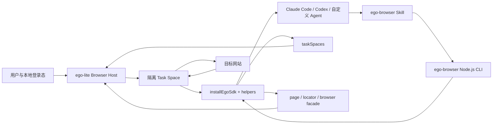
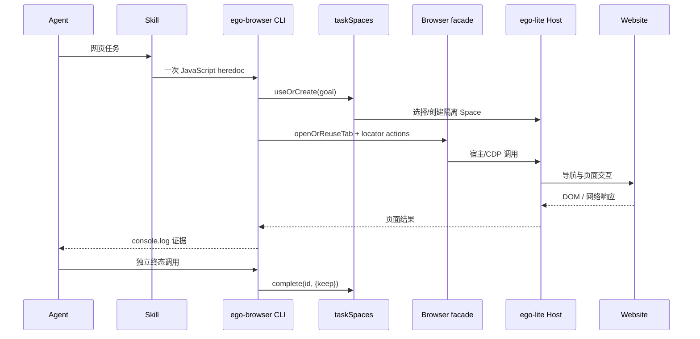
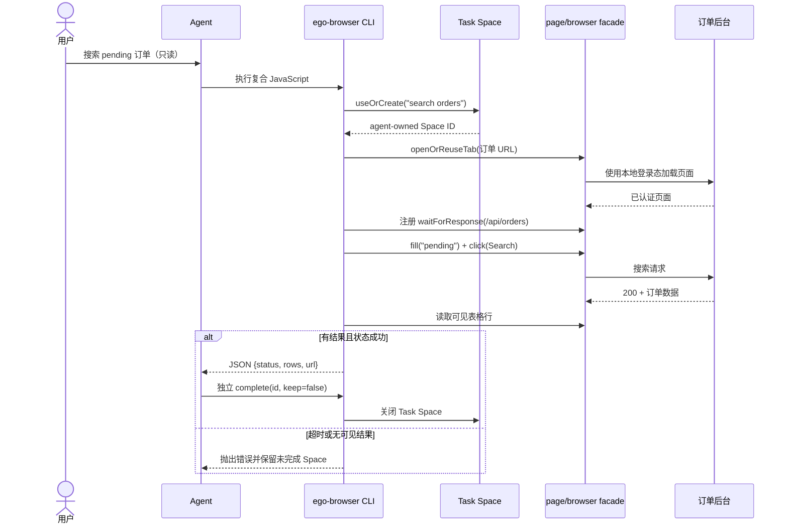

# citrolabs/ego-lite 项目深度解析

## 1. 项目概览

- 报告日期：2026-07-25
- 仓库地址：https://github.com/citrolabs/ego-lite
- Trending 原始排名：08
- Stars Today：880
- 项目定位：一个为人类用户和外部 AI Agent 共同使用而设计的 Chromium 浏览器，以及连接 Agent CLI 与浏览器的 `ego-browser` Node.js/TypeScript 运行时。
- 解决的问题：传统浏览器自动化需要另起浏览器、登录态迁移麻烦，或让 Agent 与用户争抢同一批标签页；ego-lite 用隔离 Task Space 复用本地登录态，并让 Agent 通过 JavaScript 组合多步页面操作。
- 目标用户：Claude Code、Codex、Cursor 等 Agent 用户，网页自动化开发者、QA、数据采集和需要已登录浏览器状态的团队。
- 当前成熟度：早期可用。仓库的 Skill、CDP harness、E2E 案例和运行规则较完整，但浏览器应用当前主要面向 macOS，Windows/Linux 尚在路线图。
- 推荐结论：适合研究“Agent 如何安全共享用户浏览器状态并隔离任务”；正式接入前应重点评估登录态权限、Task Space 所有权和浏览器二进制供应链。

## 2. 系统架构

### 2.1 架构概览

系统分为两部分：ego-lite 浏览器应用提供真实 Chromium、用户登录数据和隔离 Space；`ego-browser` 是 CLI 可调用的 Node.js 运行时，通过 CDP/宿主接口把浏览器能力封装为 `page`、`browser`、`taskSpaces`、`fetch` 和 `cdp` 等对象。Agent Skill 规定一次任务的脚本组织、状态验证、所有权交接与终态提交方式。`installEgoSdk` 将 helper context 安装进短生命周期进程，并等待宿主 ready signal 后再执行异步操作。

### 2.2 架构图

### 2.3 核心模块

| 模块 | 职责 | 代码位置 | 关键依赖 | 证据级别 |
|---|---|---|---|---|
| Agent Skill | 定义什么时候使用浏览器、如何组织单次脚本、如何验证和完成 Task Space | `skills/ego-browser/SKILL.md` | Agent CLI / Bash | High |
| CLI 入口 | 启动 Node.js 运行时并执行 agent JavaScript | `package/ego-browser/src/index.ts`, `run.ts` | Node.js >=22 | High |
| SDK 安装 | 把 page/browser/taskSpaces helper 安装到全局，处理 ready signal 和日志输出 | `package/ego-browser/src/index.ts:installEgoSdk` | helper context, output sink | High |
| 页面 facade | Playwright 风格 locator、导航、等待、截图、请求观察和 DOM 操作 | `package/ego-browser/src/helpers.ts`, browser runtime | CDP / host bridge | Medium-High |
| Task Space | 创建、切换、声明、交接、接管和终态完成隔离浏览上下文 | Skill runtime map + helper surface | ego-lite host | High |
| 浏览器应用 | 持有真实标签、登录态和多个隔离 Space | 独立 ego-lite 应用，仓库文档/规格 | Chromium-based app | Medium |
| E2E 验证 | 用真实浏览器验证 helper、键盘、观测和环境行为 | `package/ego-browser/scripts/real-browser-e2e/` | Node test / browser app | High |

### 2.4 数据与状态管理

- 用户浏览数据保存在本机浏览器应用；README 声明仓库服务只记录是否选择 Chrome 数据迁移。
- Task Space 是核心运行状态，拥有 `agent`、`agentDelegatedToUser` 或 `user` 所有权。
- 每个 heredoc 使用短生命周期 Node.js 进程；任务连续性依赖复用同一 Task Space ID 或名称，而不是进程内全局状态。
- 页面 targetId 是短期句柄，要求在同一执行轮次内发现、验证和使用。

### 2.5 外部集成与协议

- Agent CLI 通过 Bash 调用 `ego-browser nodejs`。
- Node.js harness 通过宿主 bridge/CDP 操作 ego-lite 中的 Chromium。
- `fetch.server` 从 Node 侧请求，`fetch.browser` 使用当前页面 origin。
- 对站点的实际交互仍是普通浏览器请求、DOM、表单和网络响应。

### 2.6 部署与运行形态

目前用户安装 macOS ego-lite 应用；Skill 可通过 `npx skills add citrolabs/ego-lite` 安装。`package/ego-browser` 构建为单文件 CLI，要求 Node.js 22+。浏览器二进制和仓库内容是不同交付物。

## 3. 主线流程

### 3.1 核心流程图

### 3.2 关键步骤

1. Skill 判断任务需要真实浏览器，并生成尽量单轮完成的 JavaScript。
2. CLI 安装 SDK，等待宿主 ready，将 helpers 暴露到进程。
3. `taskSpaces.useOrCreate` 为用户目标选择隔离上下文。
4. `browser` 和 `page` facade 完成导航、定位、操作、网络等待和结果验证。
5. 进程用 `console.log` 返回结构化证据。
6. Agent审阅结果后，单独调用 `taskSpaces.complete` 提交终态。

### 3.3 异常与失败处理

- `page.waitFor*` 超时会返回 falsy，脚本必须立即检查或验证最终状态。
- user-owned Space 是硬停止，不允许自动 claim 或 take over。
- 登录、验证码等人工步骤通过 `handOff` 转交用户，只有用户确认后才接管。
- required action 失败不能吞掉；应做一次有针对性的观察并改变策略。
- 任务未证明完成时不得调用 `complete`。

## 4. 典型业务场景端到端执行链路

### 4.1 场景定义

| 项目 | 内容 |
|---|---|
| 场景名称 | 已登录用户让 Agent 在订单后台搜索 pending 订单并返回可见行 |
| 参与者 | 用户、Agent CLI、ego-browser、Task Space、订单网站 |
| 前置条件 | ego-lite 已安装；用户已在浏览器登录订单后台；Agent 可创建独立 Space |
| 输入 | 目标网址与搜索词 `pending`（示意）；要求只读取结果，不修改订单 |
| 期望结果 | Agent 在隔离 Space 中触发搜索，等待成功的 `/api/orders` 响应并返回表格行 |
| 成功判定 | 响应状态成功、页面有至少一行可见结果、用户现有标签页未被切换或修改 |

### 4.2 端到端时序图

### 4.3 执行步骤追踪

| 步骤 | 输入 | 执行组件 | 关键代码位置 | 状态或数据变化 | 输出 | 失败分支 | 证据级别 |
|---:|---|---|---|---|---|---|---|
| 1 | 用户目标 | Agent + Skill | `skills/ego-browser/SKILL.md` | 形成只读任务边界 | 单轮脚本计划 | 目标含写操作时需额外确认规则 | High |
| 2 | 任务名 | `taskSpaces.useOrCreate` | Skill runtime map / helpers | 新建或复用 agent-owned Space | Space ID、所有权 | user-owned 时硬停止 | High |
| 3 | URL | `browser.openOrReuseTab` | helper facade | Space 内标签加载并继承本地登录态 | 已认证页面 | 登录失效则交接用户 | Medium-High |
| 4 | 响应谓词 | `page.waitForResponse` | Skill composite example | 注册对 `/api/orders` 的等待 | pending Promise | 未预注册会漏掉快速响应 | High |
| 5 | 搜索词（示意） | locator.fill / click | page locator facade | 表单值与页面请求状态变化 | 搜索请求 | 控件多匹配时需缩小 locator | High |
| 6 | API 响应 | response + table locator | Skill `Fill, trigger, wait, read back` 示例 | 页面渲染订单行 | status + rows | 超时或 0 行则抛错 | High |
| 7 | 结构化证据 | `console.log` | `index.ts` output sink | 短生命周期进程输出结果 | JSON | 输出被错误缓冲时由 lifecycle flush 处理 | High |
| 8 | 已证明结果 | `taskSpaces.complete` | Skill completion rules | Space 进入终态并关闭/保留 | `{done:true}` | 未完成或 user-owned 返回 skipped/false | High |

### 4.4 关键状态与数据变化

- 登录状态：来自本机浏览器资料，被 Space 使用，不复制到远端服务。
- Task Space：`agent` 所有权、活动 tab、未完成/完成状态。
- 页面状态：输入框值、请求进行中、表格渲染结果。
- 进程状态：每次 heredoc 独立启动，证据通过 stdout 返回。

### 4.5 失败传播、重试与回滚

如果 API 超时或页面无可见行，脚本抛出错误，不调用 `complete`，Space 保留供后续有证据的修正。允许一次有针对性的观察，例如读取当前 URL、页面错误提示或控件集合，再改变 locator 或等待条件；禁止重复盲点同一按钮。只读场景没有业务数据回滚，但可关闭临时标签和 Space。

### 4.6 最终业务结果

用户拿到订单后台当前可见的 pending 行及响应状态，自己的常用标签页不受影响；任务有独立 Space 生命周期和明确的完成证据。

### 4.7 最小复现与验证方法

1. 在 macOS 安装 ego-lite 并迁移或登录一个测试站点账号。
2. 安装 `ego-browser` Skill。
3. 使用仓库 Skill 中 `Fill, trigger, wait, read back` 示例，替换为受控测试站点。
4. 确认任务在独立 Space 中运行，用户 Space 标签不变化。
5. 人为让 API 返回 500 或延迟，确认脚本不提交完成且打印明确失败。

## 5. 技术栈

| 层次 | 技术 | 用途 | 是否核心 | 证据位置 |
|---|---|---|---|---|
| 浏览器 | Chromium-based ego-lite | 真实登录态、标签与隔离 Space | 是 | README / Skill |
| 运行时 | Node.js >=22 | 执行 Agent 生成的 JavaScript | 是 | `package/ego-browser/package.json` |
| 语言 | TypeScript / JavaScript | CLI、facade 与工具组合 | 是 | `package/ego-browser/src/` |
| 浏览器协议 | CDP / host bridge | 将 helper 调用转为浏览器操作 | 是 | package description / runtime facade |
| API 风格 | Playwright-like page/locator | 降低 Agent 操作网页的认知成本 | 是 | Skill runtime map |
| 任务隔离 | Task Space | 多 Agent 并行和所有权控制 | 是 | Skill task-space rules |
| 构建 | Rollup / esbuild | 单文件 CLI 构建 | 重要 | package.json |
| 测试 | Node test + real browser E2E | helper surface 与真实浏览器回归 | 重要 | scripts / test commands |

## 6. 创新点

### 创新点 1

- 类型：架构与工作流创新
- 传统方案：Agent 启动独立自动化浏览器，登录态重新配置，或与用户争抢同一上下文。
- 当前方案：同一浏览器应用内为每个 Agent 建立隔离 Task Space，并复用用户本地登录状态。
- 实际收益：减少登录摩擦，允许人和多个 Agent 并行。
- 证据：README、Task Space 所有权与生命周期规则。
- 局限：共享高权限登录态会提高误操作和越权风险；当前平台支持有限。

### 创新点 2

- 类型：开发体验创新
- 传统方案：Agent 多轮调用单个 CLI 命令，每轮都重新观察页面。
- 当前方案：在一次 Node.js 脚本中组合观察、分支、动作、等待和验证。
- 实际收益：减少工具调用轮次和中间 Token。
- 证据：Skill 强制“一次 Bash invocation 完成可预测工作”，CLI 暴露 JS facade。
- 局限：长脚本更依赖正确的异常处理；维护者性能数字未独立复测。

## 7. 应用场景

### 适合

- 已登录后台的只读检索与重复操作。
- Web QA、冒烟测试和可验证数据采集。
- 多 Agent 并行研究不同网站或任务。

### 可以尝试

- 表单录入、内容发布等可撤销写操作。
- 需要人工登录/验证码交接的流程。
- 企业内部浏览器自动化，在专用低权限账号下运行。

### 暂不建议

- 未设权限边界的生产管理员账号。
- 金融转账、删除数据等不可逆操作的无人值守执行。
- Windows/Linux 为硬要求的团队，直到官方支持成熟。

## 8. 第一次阅读与验证建议

1. 先读根 README 与 `skills/ego-browser/SKILL.md` 的 execution/task-space 规则。
2. 再看 `package/ego-browser/src/index.ts` 的 SDK 安装和输出生命周期。
3. 跑真实浏览器 E2E 中的 observation/helper-surface 案例。
4. 使用测试账号验证隔离 Space、登录态复用、handOff 和 complete。
5. 记录失败时 Space 是否保持可恢复，确认不会误报完成。

## 9. 风险与限制

- 安全：复用真实登录态是价值也是最大风险；应使用最小权限账号并限制写操作。
- 性能：2.5×速度和 Token 降低是维护者基准，需独立复测。
- 许可证：仓库内容 MIT；浏览器二进制为单独免费分发物，条款应单独确认。
- 维护状态：活跃但早期，接口和 Skill 规则可能快速变化。
- 生产可用性：适合受控自动化；高风险操作需要人工确认、审计和回滚策略。

## 10. Evidence Notes

- 根 `README.md`：隔离 Space、登录态复用、macOS 支持、JS 工具和性能主张。
- `skills/ego-browser/SKILL.md`：任务生命周期、所有权、等待、失败和人工交接规则。
- `package/ego-browser/package.json`：Node 22、构建、测试和 MIT。
- `package/ego-browser/src/index.ts`：SDK helper 安装、ready signal、输出 sink 和 task-space 方法暴露。
- `package/ego-browser/scripts/real-browser-e2e/`：真实浏览器测试入口。

## 11. Honest Caveat

浏览器应用主体以独立二进制交付，本报告能验证仓库中的 Skill、CLI harness 和公开说明，但无法完整审计浏览器内核修改与本地数据实现。未在真实 macOS 应用中运行端到端测试，性能和 Token 节省主张未独立复测。

## 12. 可信度

- Architecture Confidence: Medium
- Flow Confidence: High
- Innovation Confidence: Medium
