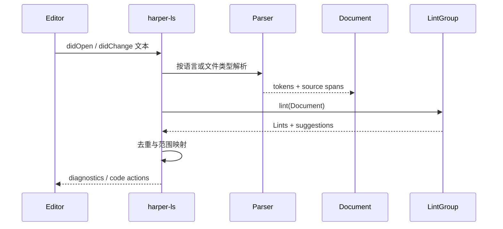
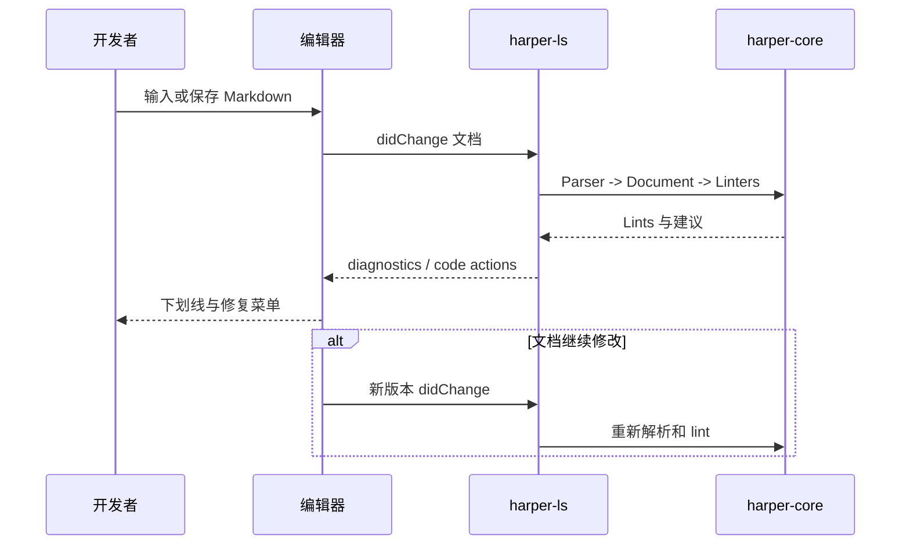

# Automattic/harper 项目深度解析

## 1. 项目概览

- 报告日期：2026-07-26
- 仓库地址：https://github.com/Automattic/harper
- Trending 原始排名：6
- Stars Today：503
- 项目定位：离线、隐私优先的英语拼写与语法检查引擎，并通过 LSP、WASM、CLI 和桌面端提供多种入口。
- 解决的问题：避免把敏感文本上传到云端，同时降低传统语法检查器的资源占用和交互延迟。
- 目标用户：写作者、开发者、编辑器插件作者和需要本地文本检查的产品团队。
- 当前成熟度：成熟项目；核心、语言服务器、WASM 与多编辑器集成均已形成。
- 推荐结论：适合英语本地检查和嵌入式场景；不应把规则型检查器误认为通用 LLM 写作助手。

## 2. 系统架构

### 2.1 架构概览

`harper-core` 是共享语法引擎：Parser 将纯文本、Markdown、HTML、Typst 或代码注释中的英语提取为 token，`Document` 保存来源与 token，多个 `Linter` 产生 `Lint`，重叠结果经过优先级处理。`harper-ls` 通过 Language Server Protocol 服务编辑器；`harper-wasm`/`harper.js` 将同一核心编译到 WebAssembly；CLI、桌面和格式专用 crates 复用核心。

### 2.2 架构图

### 2.3 核心模块

| 模块 | 职责 | 代码位置 | 关键依赖 | 证据级别 |
|---|---|---|---|---|
| Grammar Core | token、Document、lint、拼写与模式 | `harper-core/src/*` | Rust | High |
| Parser Traits | 从多种格式提取英语文本 | `harper-core/src/parsers`, 格式 crates | Markdown/HTML/tree-sitter 等 | High |
| Linter Traits | 对 Document 产生 Lints | `harper-core/src/linting` | patterns, dictionary | High |
| Language Server | 将核心能力暴露给编辑器 | `harper-ls` | LSP | High |
| WebAssembly Binding | 在 JS/Web 环境加载核心 | `harper-wasm`, `harper.js` | WASM | High |
| Integrations | CLI、桌面、编辑器插件 | `harper-cli`, `harper-desktop`, `packages/*` | Tauri/TS 等 | Medium |

### 2.4 数据与状态管理

核心以进程内 `Document`、token 和 lint 集合工作；字典、忽略规则和用户设置由具体入口管理。语法检查本身不依赖远程数据库。`remove_overlaps` 按位置和优先级去掉冲突建议。

### 2.5 外部集成与协议

编辑器主要通过 LSP 与 `harper-ls` 通信；Web/Node 通过 WebAssembly 和 TypeScript 封装调用；格式 crates 负责从 Markdown、HTML、Typst、LaTeX、代码注释等内容提取自然语言。

### 2.6 部署与运行形态

可作为本地语言服务器、CLI、桌面应用、浏览器/编辑器插件或 WASM 库运行。核心不需要云端推理服务。

## 3. 主线流程

### 3.1 核心流程图

### 3.2 关键步骤

1. 入口根据文档类型选择 Parser。
2. Parser 保留字符范围并产出 tokens。
3. `Document` 组合源文本与 token 查询接口。
4. `LintGroup` 运行多个规则和拼写检查。
5. `remove_overlaps` 保留优先级更高的非重叠建议。
6. LSP 或其他入口把字符 span 映射为诊断和修复操作。

### 3.3 异常与失败处理

无法解析的格式通常降级为较简单文本提取；重叠规则通过优先级过滤；语言服务器配置缺失会记录错误或使用默认行为。核心规则不会向远程服务重试，因为主流程完全本地。

## 4. 典型业务场景端到端执行链路

### 4.1 场景定义

| 项目 | 内容 |
|---|---|
| 场景名称 | 开发者在编辑器中输入英文 Markdown，收到拼写与语法修复 |
| 参与者 | 开发者、编辑器 LSP 客户端、harper-ls、Markdown Parser、harper-core |
| 前置条件 | 编辑器已配置 Harper LSP；文档语言受支持 |
| 输入 | **示意**文本：`This are a smple sentence.` |
| 期望结果 | 编辑器标记 `are` 和 `smple`，提供修复建议 |
| 成功判定 | diagnostics span 与原文一致，应用建议后对应 lint 消失 |

### 4.2 端到端时序图

### 4.3 执行步骤追踪

| 步骤 | 输入 | 执行组件 | 关键代码位置 | 状态或数据变化 | 输出 | 失败分支 | 证据级别 |
|---:|---|---|---|---|---|---|---|
| 1 | 文档变更 | 编辑器/LSP | `harper-ls` | 文档版本更新 | LSP notification | LS 未运行→无诊断 | High |
| 2 | Markdown 文本 | Parser | `harper-core::parsers`, Markdown parser | 形成 token 与字符 span | `Document` | 不支持结构→降级提取 | High |
| 3 | Document | LintGroup | `harper-core::linting` | 运行规则与拼写字典 | lint 列表 | 规则关闭→跳过 | High |
| 4 | lint 列表 | overlap filter | `harper-core/src/lib.rs::remove_overlaps` | 删除冲突 lint | 稳定建议集 | 优先级决定保留项 | High |
| 5 | spans/suggestions | harper-ls | `harper-ls` | 转换为 LSP range | diagnostics | range 映射问题→日志/无建议 | Medium |
| 6 | code action | 编辑器 | LSP client | 原文被修改 | 修复后文本 | 文档版本冲突→重新请求 | Medium |

### 4.4 关键状态与数据变化

原始文档仅在编辑器与本机 Harper 进程中流转。每次变更生成新的 token、Document 和 lint 集合；修复应用后，下一轮 lint 重新计算。未发现语法检查主线需要云端持久化。

### 4.5 失败传播、重试与回滚

如果文档在 code action 应用前发生变化，编辑器/LSP 应以新版本重新计算；Harper 不负责跨版本事务回滚。单个 Parser 或规则无法识别内容时，可能少报而不是向远程服务求助。

### 4.6 最终业务结果

开发者在不上传文本的情况下得到实时拼写与语法反馈。用户可接受建议、忽略规则或继续编辑，核心系统保持低延迟和本地数据边界。

### 4.7 最小复现与验证方法

1. 安装支持 Harper 的编辑器插件或启动 `harper-ls`。
2. 创建 Markdown 文件，输入示意错误句。
3. 检查 diagnostics 和 code action。
4. 应用修复并确认 lint 消失。
5. 断网后重复测试，验证主线仍可工作。

## 5. 技术栈

| 层次 | 技术 | 用途 | 是否核心 | 证据位置 |
|---|---|---|---|---|
| 语言 | Rust | 核心、LSP、CLI 与格式解析 | 是 | Cargo workspace |
| 协议 | Language Server Protocol | 编辑器集成 | 是 | `harper-ls` |
| Web | WebAssembly + TypeScript | 浏览器/Node 调用 | 是 | `harper-wasm`, `harper.js` |
| 桌面 | Tauri/Svelte 等 | 桌面产品入口 | 否 | `harper-desktop` |
| 数据 | 内置字典、token/patterns | 拼写与规则匹配 | 是 | `harper-core` |

## 6. 创新点

### 创新点 1
- 类型：架构创新
- 传统方案：每个插件各自实现检查逻辑或调用云服务。
- 当前方案：单一 Rust 核心由 LSP、WASM、CLI 和桌面端复用。
- 实际收益：行为一致、部署面广、隐私边界清晰。
- 证据：Cargo workspace 与官方架构文档。
- 局限：跨平台封装仍有各自维护成本。

### 创新点 2
- 类型：性能/产品取舍
- 传统方案：大型统计模型或云端 LLM。
- 当前方案：本地 token、字典和规则 linter。
- 实际收益：低延迟、低资源、离线可用。
- 证据：核心源码与官方定位。
- 局限：语义改写和开放域理解能力有限。

## 7. 应用场景

### 适合
- 隐私敏感英文写作。
- 编辑器、浏览器或桌面端实时语法提示。
- 产品内嵌轻量英语检查。

### 可以尝试
- 自定义领域词典和规则。
- 通过 WASM 在边缘环境运行。

### 暂不建议
- 多语言通用写作助手。
- 需要复杂事实核查或大段改写的场景。

## 8. 第一次阅读与验证建议

1. 先读官方 Architecture 文档。
2. 再看 `harper-core/src/lib.rs`、`document`、`parsers` 和 `linting`。
3. 看 `harper-ls` 如何映射 LSP。
4. 运行核心测试和编辑器示例。

## 9. 风险与限制

- 安全：本地处理降低数据外泄面，但插件供应链仍需正常审计。
- 性能：官方性能数据未独立复测。
- 许可证：Apache-2.0。
- 维护状态：活跃且多端集成较多。
- 生产可用性：核心成熟；语言覆盖和规则准确率需按业务验证。

## 10. Evidence Notes

- 官方 Architecture 文档：`Document`、`Parser`、`Linter`、`harper-ls`、`harper.js`。
- 根 `Cargo.toml`：工作区模块与 release 配置。
- `harper-core/src/lib.rs`：模块导出、重叠 lint 过滤和核心测试。
- 官方 README：离线、隐私和英语支持边界。

## 11. Honest Caveat

本报告没有实际运行编辑器插件，也没有独立测量内存和速度。LSP 的完整文档版本冲突处理未逐文件追踪，因此业务案例后半段采用 LSP 通用行为与官方接口的有限推断。

## 12. 可信度

- Architecture Confidence: High
- Flow Confidence: Medium
- Innovation Confidence: Medium
