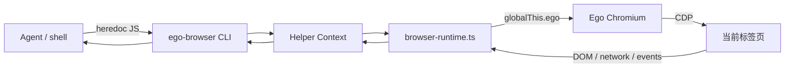
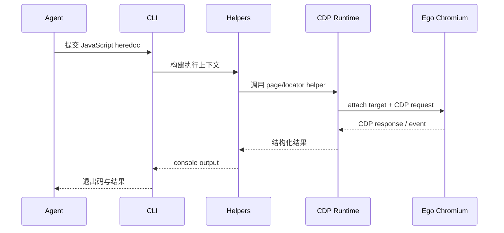
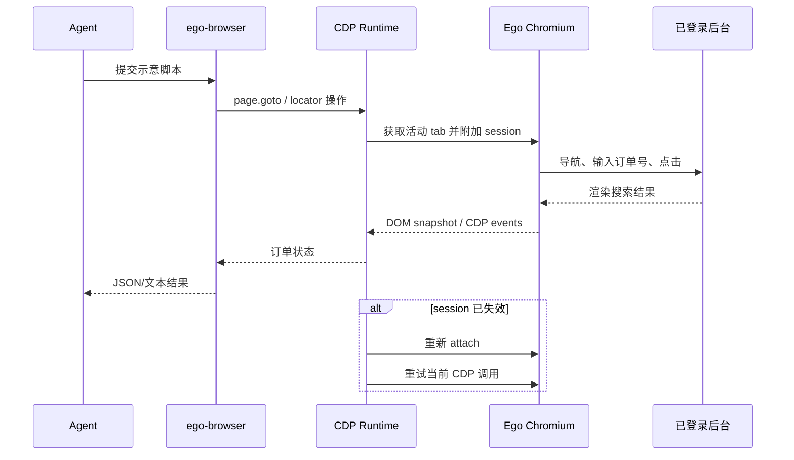

# citrolabs/ego-lite 项目深度解析

## 1. 项目概览

- 报告日期：2026-07-26
- 仓库地址：https://github.com/citrolabs/ego-lite
- Trending 原始排名：3
- Stars Today：986
- 项目定位：让 AI Agent 复用用户当前已登录的 Chromium 浏览器，通过 Node CLI 和 CDP helper 执行网页自动化。
- 解决的问题：传统无头浏览器常要重复登录、重新建立浏览器状态；Ego Lite 把用户控制的真实浏览器会话暴露为受控 Agent 工具。
- 目标用户：需要登录态网页自动化的 Agent 开发者、测试工程师和运营自动化团队。
- 当前成熟度：早期可用；辅助运行时和测试较完整，平台与分发边界仍在演进。
- 推荐结论：适合在受信任任务和受控站点内试用，不适合直接接收不可信脚本操作个人主浏览器。

## 2. 系统架构

### 2.1 架构概览

系统分为用户控制的 Ego Chromium、浏览器内 `globalThis.ego` 原生桥、Node/TypeScript `ego-browser` helper 运行时和 Agent 任务脚本。CLI 从 stdin 读取 JavaScript，构建预导入 helper 上下文；helper 通过 CDP 桥接当前活动标签页。运行时维护 CDP 请求映射、事件缓冲和短生命周期 session，并在 target/session 丢失时重新附加。

### 2.2 架构图

### 2.3 核心模块

| 模块 | 职责 | 代码位置 | 关键依赖 | 证据级别 |
|---|---|---|---|---|
| CLI 入口 | 读取 stdin、处理 doctor/reload、执行异步任务脚本 | `package/ego-browser/src/run.ts` | Node.js | High |
| Helper Context | 统一暴露 page、browser、locator 等 Agent 接口 | `src/helpers.ts`, `run.ts::executionContext` | TypeScript | Medium |
| CDP Runtime | 请求/响应映射、事件订阅、session 管理与重连 | `src/browser-runtime.ts` | `globalThis.ego`, CDP | High |
| 元素解析与驱动 | 将语义引用转为 DOM/CDP 操作 | `src/element-resolver.ts`, `src/drivers/*` | CDP | Medium |
| Ego 浏览器桥 | 列出标签页、发送 CDP 消息、回传事件 | Ego Chromium 内置桥 | Chromium | High |

### 2.4 数据与状态管理

Node 进程内保存 pending CDP 请求、事件队列、订阅者、目标与 session ID。`SESSION_TTL_MS` 为 2 秒，事件缓冲上限 10,000；每次 CLI heredoc 运行是短生命周期进程。未发现业务数据库。

### 2.5 外部集成与协议

主要协议为 Chrome DevTools Protocol。Agent 输入是 JavaScript heredoc；浏览器桥通过 `sendCDPMessage`、`onCDPMessage` 和 `listTabs` 连接运行时与 Chromium。

### 2.6 部署与运行形态

Node.js 22+ CLI 与 Ego Chromium 同机运行；当前主要面向 macOS。真实登录态留在用户浏览器中，不需要把 Cookie 复制给远程服务。

## 3. 主线流程

### 3.1 核心流程图

### 3.2 关键步骤

1. `runMain` 校验参数并读取完整 stdin。
2. `executionContext` 加载 helper，把 `console.log` 接入输出缓冲。
3. `AsyncFunction` 执行 Agent 脚本。
4. helper 调用 `browserCdp`；非 Browser/Target 方法先执行 `ensureSession`。
5. 运行时选择首选或活动标签页，必要时 `Target.attachToTarget`。
6. CDP 响应按 id 解析，事件进入订阅者或有界缓冲。

### 3.3 异常与失败处理

空输入或额外参数返回退出码 2；CDP 请求 15 秒超时。若出现 Target closed / Session not found，运行时清空旧 session，重新附加后重试一次。任务抛错时丢弃缓冲输出并向上抛出。

## 4. 典型业务场景端到端执行链路

### 4.1 场景定义

| 项目 | 内容 |
|---|---|
| 场景名称 | Agent 在已登录后台搜索订单并读取详情 |
| 参与者 | Agent、ego-browser CLI、Helper Runtime、Ego Chromium、后台网页 |
| 前置条件 | Ego Chromium 已运行；用户已登录后台；任务来源可信 |
| 输入 | **示意** heredoc：导航到订单页、填写订单号、点击搜索、读取状态 |
| 期望结果 | 返回订单状态与页面证据，不重新登录 |
| 成功判定 | CLI 退出码为 0，返回目标订单号和状态，页面没有未处理错误 |

### 4.2 端到端时序图

### 4.3 执行步骤追踪

| 步骤 | 输入 | 执行组件 | 关键代码位置 | 状态或数据变化 | 输出 | 失败分支 | 证据级别 |
|---:|---|---|---|---|---|---|---|
| 1 | heredoc JS | CLI | `run.ts::runMain` | stdin 进入内存 | 任务代码 | 空输入→退出 2 | High |
| 2 | 任务代码 | CLI | `run.ts::execute` | 注入 helper context | 可执行函数 | 语法/运行错误上抛 | High |
| 3 | page 操作 | Runtime | `browser-runtime.ts::ensureSession` | 选择活动 target，保存 sessionId | CDP session | 无活动 tab→错误 | High |
| 4 | 输入/点击 | Drivers/CDP | `src/drivers/*`, `browserCdp` | 网页 DOM 与导航状态改变 | 页面事件 | CDP 超时 | Medium |
| 5 | 读取结果 | Runtime | `handleMessage` | pending 请求移除 | 结构化响应 | session lost→重附加重试 | High |
| 6 | 日志结果 | CLI | output sink | 缓冲刷新 | stdout + exit 0 | hard stop→丢弃缓冲 | High |

### 4.4 关键状态与数据变化

变化主要发生在浏览器标签页 DOM、导航历史和站点自身会话中；Node 侧只保存短期 CDP session、pending 请求和事件。订单数据由目标网站管理，Ego Lite 不持久化该业务数据。

### 4.5 失败传播、重试与回滚

页面关闭或 session 失效时，`browserCdp` 检测错误文本，调用 `invalidateSession` 并重新附加后重试一次。脚本已经对网页产生的副作用不会自动回滚，因此写操作需要调用方自行设计幂等和确认步骤。

### 4.6 最终业务结果

用户得到当前登录态下的订单信息；系统价值在于省去账号重新认证和独立自动化浏览器环境，但代价是任务获得真实浏览器权限。

### 4.7 最小复现与验证方法

1. 安装并启动 Ego 浏览器，登录一个测试站点。
2. 运行 `ego-browser --doctor` 检查连接。
3. 用只读示意脚本执行 `await page.info()` 和页面文本读取。
4. 关闭当前标签页后再次调用，验证 session 丢失后的错误或重新附加行为。

## 5. 技术栈

| 层次 | 技术 | 用途 | 是否核心 | 证据位置 |
|---|---|---|---|---|
| 语言与运行时 | TypeScript / Node.js 22+ | CLI 与 helper | 是 | `package.json` |
| 浏览器 | Chromium / Ego bridge | 承载登录态与页面 | 是 | README, runtime |
| 协议 | CDP | 页面自动化 | 是 | `browser-runtime.ts` |
| 构建 | Rollup / esbuild / tsc | 单文件构建与类型检查 | 否 | `package.json` |
| 解析 | Acorn | JavaScript 相关处理 | 辅助 | `package.json` |

## 6. 创新点

### 创新点 1
- 类型：工作流创新
- 传统方案：Agent 启动隔离无头浏览器并重新登录。
- 当前方案：复用用户控制的已登录共享浏览器，通过本地桥和 CDP 操作。
- 实际收益：减少登录摩擦，能访问真实浏览器状态。
- 证据：README、`run.ts`、`browser-runtime.ts`。
- 局限：权限范围更大，平台目前有限。

### 创新点 2
- 类型：工程整合创新
- 传统方案：直接暴露低层 CDP。
- 当前方案：提供 Playwright 风格 helper、session 自动修复和统一输出通道。
- 实际收益：Agent 脚本更短，运行失败更可预测。
- 证据：helper context 与 session retry 源码。
- 局限：并非完整 Playwright 兼容层。

## 7. 应用场景

### 适合
- 受信任 Agent 的登录态只读查询。
- 内部后台重复操作与浏览器回归检查。
- 需要真实扩展、Cookie 和浏览器设置的自动化。

### 可以尝试
- 有确认步骤的表单提交和内容运营。
- 团队共享测试账号的受控自动化。

### 暂不建议
- 让不可信外部 Prompt 直接操作个人主浏览器。
- 无审计、无幂等保护的支付或删除操作。

## 8. 第一次阅读与验证建议

1. 先读 README 和 Skill 示例。
2. 再看 `run.ts` 理解任务入口。
3. 阅读 `browser-runtime.ts` 的 session、pending 和错误处理。
4. 运行 `--doctor` 与只读页面脚本，再验证关闭 tab 的失败路径。

## 9. 风险与限制

- 安全：真实登录态权限高，需限制任务来源和域名。
- 性能：官方速度对比未独立复测。
- 许可证：仓库辅助代码 MIT；下载应用的完整分发条款需另行核验。
- 维护状态：早期快速迭代。
- 生产可用性：适合受控环境，关键写操作需额外治理。

## 10. Evidence Notes

- `package/ego-browser/package.json`：Node 版本、构建、测试与 MIT 许可证。
- `package/ego-browser/src/run.ts`：stdin、helper context、AsyncFunction 和输出处理。
- `package/ego-browser/src/browser-runtime.ts`：CDP、session、事件、重连和超时。
- 官方 README：共享登录浏览器与当前平台定位。

## 11. Honest Caveat

本报告没有运行 Ego 应用，也没有验证商业网站兼容性。Helper 与具体 DOM 操作的部分链路依据模块接口和官方示例，未逐个 driver 做运行级测试。

## 12. 可信度

- Architecture Confidence: High
- Flow Confidence: High
- Innovation Confidence: Medium
