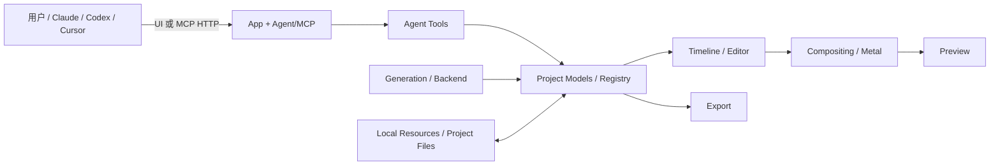
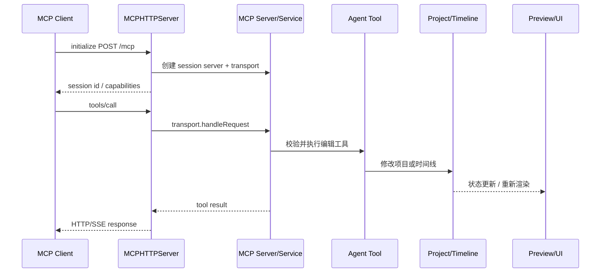
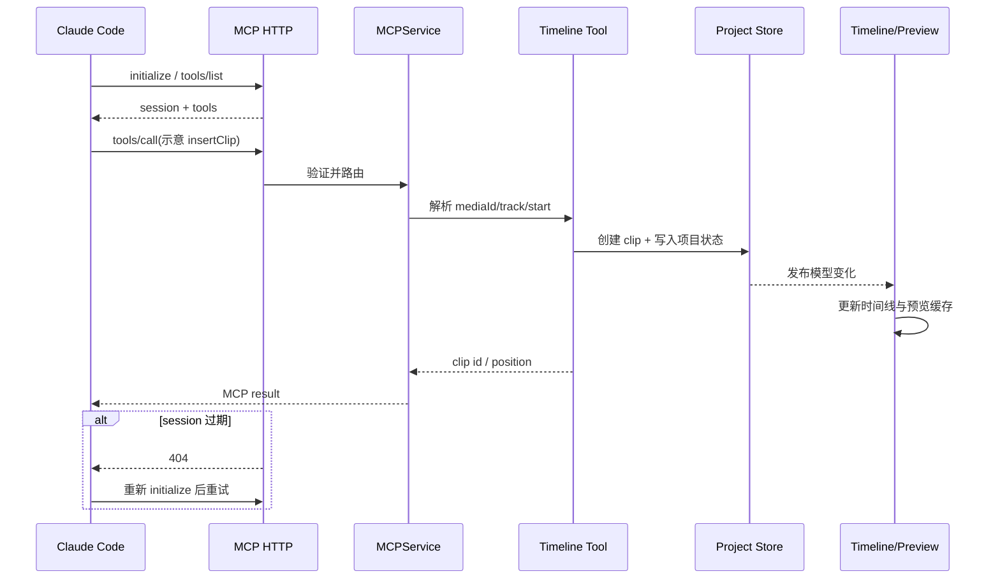

# palmier-io/palmier-pro 项目深度解析

## 1. 项目概览

- 报告日期：2026-07-26
- 仓库地址：https://github.com/palmier-io/palmier-pro
- Trending 原始排名：12
- Stars Today：412
- 项目定位：Swift 原生 macOS 视频编辑器，通过内置 Agent 与本地 MCP 服务让 Claude、Codex、Cursor 操作同一时间线项目。
- 解决的问题：传统视频编辑工具难以被外部 Agent 结构化调用；纯生成式 AI 工具又缺少可精修的真实时间线。
- 目标用户：视频创作者、AI 创作工具开发者、需要自动化剪辑工作流的团队。
- 当前成熟度：早期产品化；编辑器、时间线、MCP 与测试已开源，生成式 AI 处理部分闭源。
- 推荐结论：适合在受控 macOS 环境探索 Agent 视频编辑，不适合把本地 MCP 直接暴露到非可信网络。

## 2. 系统架构

### 2.1 架构概览

Palmier Pro 是 Swift 6.2 单可执行目标，源码按 App、Editor、Timeline、Project、Preview、Compositing、Export、Agent、Generation 等领域拆分。时间线与项目模型由 Swift 原生 UI 操作，Metal/渲染模块负责预览与合成。Agent 层包含客户端、工具、技能和 MCP 服务；`MCPHTTPServer` 仅绑定 `127.0.0.1`，为每个客户端创建状态化 Server/Transport session，或为无 session 客户端提供 stateless fallback。工具最终修改项目或时间线模型，UI 与预览读取同一状态。

### 2.2 架构图

### 2.3 核心模块

| 模块 | 职责 | 代码位置 | 关键依赖 | 证据级别 |
|---|---|---|---|---|
| App/Editor | 窗口、编辑器状态和用户交互 | `Sources/PalmierPro/App`, `Editor` | SwiftUI/AppKit | High |
| Project | 项目注册、模型和文件状态 | `Sources/PalmierPro/Project`, `Models` | Foundation | High |
| Timeline | clip、拖拽、吸附、输入与 AI 菜单 | `Sources/PalmierPro/Timeline` | SwiftUI | High |
| Compositing/Preview | 视频合成和预览 | `Compositing`, `Preview`, `Metal` | Metal | Medium |
| Agent Tools | 把编辑操作包装为 Agent 可调用工具 | `Agent/Tools`, `AgentService.swift` | MCP SDK | High |
| MCP Server | 本地 HTTP、session、验证和 SSE | `Agent/MCP/MCPHTTPServer.swift`, `MCPService.swift` | Network, MCP Swift SDK | High |
| Backend/Generation | 账户、可选生成式 AI 和远程状态 | `Backend`, `Generation`, `Account` | Clerk/Convex 等 | Medium |

### 2.4 数据与状态管理

项目、媒体与时间线状态保存在本地项目模型和文件中；具体序列化由 Project/Models 模块负责。MCP HTTP server 在内存中维护最多 32 个 session，空闲 1 小时淘汰。生成式 AI、账户和订阅可使用 Clerk/Convex；编辑器和 MCP 基础能力可免费、本地使用。

### 2.5 外部集成与协议

- MCP Streamable HTTP：`http://127.0.0.1:19789/mcp`。
- Swift MCP SDK：Server 与 stateful/stateless transport。
- Metal：视频合成/内核。
- Sparkle：应用更新。
- 可选 MLX/Speech：本地语音能力。
- 可选 Clerk/Convex 与闭源生成式 AI 处理。

### 2.6 部署与运行形态

仅支持 macOS 26 Tahoe 与 Apple Silicon。应用本地运行并在 loopback 暴露 MCP，`OriginValidator.localhost`、Content-Type 和协议版本验证限制请求；生产遥测和 bundled speech 由 Swift trait 控制。

## 3. 主线流程

### 3.1 核心流程图

### 3.2 关键步骤

1. App 启动本地 `NWListener`，仅绑定 IPv4 loopback。
2. MCP 客户端发送 initialize；服务创建独立 Server 和 stateful transport。
3. Server 注册工具，客户端获取 tool list。
4. `tools/call` 被标准验证 pipeline 检查 session、origin、Content-Type 和协议版本。
5. Agent Tool 读取参数并修改项目/时间线模型。
6. UI/Preview 对状态变化重新渲染；工具结果通过 HTTP 或 SSE 返回。

### 3.3 异常与失败处理

无效 framing 或请求返回 400；非 `/mcp` 路径返回 404；未知/过期 session 返回 404，让客户端重新 initialize。session 超时或数量过多会被淘汰；tool list 通知失败会在下次 GET stream 重试。工具层错误返回 MCP error，不自动回滚已完成的所有媒体操作，具体需工具或项目层保证原子性。

## 4. 典型业务场景端到端执行链路

### 4.1 场景定义

| 项目 | 内容 |
|---|---|
| 场景名称 | Claude 通过本地 MCP 在当前视频项目中插入一段媒体并移动到时间线指定位置 |
| 参与者 | Claude Code、MCPHTTPServer、MCPService、Agent Tool、Project/Timeline、Preview |
| 前置条件 | Palmier Pro 已打开一个测试项目；MCP 服务运行；媒体文件已导入或路径可访问 |
| 输入 | **示意**工具调用：选择 mediaId，将 clip 插入 track 1 的 12.0 秒位置 |
| 期望结果 | 时间线出现新 clip，项目状态保存，预览可在目标时间看到媒体 |
| 成功判定 | MCP 返回成功；UI 中 clip 的 track/start 与请求一致；重开项目后状态仍存在 |

### 4.2 端到端时序图

### 4.3 执行步骤追踪

| 步骤 | 输入 | 执行组件 | 关键代码位置 | 状态或数据变化 | 输出 | 失败分支 | 证据级别 |
|---:|---|---|---|---|---|---|---|
| 1 | initialize | MCPHTTPServer | `Agent/MCP/MCPHTTPServer.swift` | 新建 session + transport | session id | 非 localhost/协议错误→拒绝 | High |
| 2 | tools/list | MCP Server | `MCPService.swift`, Agent Tools | 标记 tool list 已公布 | 工具 schema | 通知失败→下次 GET 重试 | High |
| 3 | **示意** insert clip args | Tool router | `Agent/Tools/*` | 参数解析 | domain command | media/track 不存在→tool error | Medium |
| 4 | clip command | Project/Timeline | `Project/*`, `Timeline/*`, `Models/*` | 项目 clip 集合和位置变化 | clip id | 冲突/无效范围→拒绝 | Medium |
| 5 | model change | Timeline/Preview | `TimelineView`, `ClipRenderer`, caches | UI 与渲染缓存失效 | 新时间线画面 | 媒体解码失败→占位/错误 | Medium |
| 6 | tool result | MCP transport | `MCPHTTPServer.writeResponse` | session lastUsed 更新 | HTTP/SSE result | session 过期→404 重连 | High |

### 4.4 关键状态与数据变化

项目模型新增或更新 clip，包含媒体引用、track 和时间范围；时间线布局、预览缓存与可能的项目文件被更新。MCP session 只保存传输级状态，不保存项目副本。闭源生成服务不参与这个基础编辑案例。

### 4.5 失败传播、重试与回滚

session 失效由客户端重新 initialize 后重试。媒体不存在、位置非法或项目不可写时，Tool 应返回错误；如果操作在多步修改中间失败，是否支持完整 undo/事务需要具体 Tool 和 Project 实现验证，因此不假设自动回滚。

### 4.6 最终业务结果

外部 Agent 对用户正在看的同一项目执行了结构化时间线编辑，用户可以立刻在 UI 中检查、继续手工调整或撤销。价值在于 Agent 和人共享真实编辑状态，而不是生成一份无法精修的独立视频。

### 4.7 最小复现与验证方法

1. 在 Apple Silicon/macOS 26 上构建或安装 Palmier Pro。
2. 创建测试项目并导入短视频。
3. 用 `claude mcp add --transport http palmier-pro http://127.0.0.1:19789/mcp` 连接。
4. 先执行只读 tools/list，再调用一个时间线编辑工具。
5. 核对 UI、项目重开后的状态，并测试重启 App 后旧 session 返回 404 的恢复流程。

## 5. 技术栈

| 层次 | 技术 | 用途 | 是否核心 | 证据位置 |
|---|---|---|---|---|
| 语言/平台 | Swift 6.2, macOS 26 | 原生编辑器 | 是 | `Package.swift` |
| UI | SwiftUI/AppKit | 时间线与编辑器界面 | 是 | `Editor`, `Timeline`, `UI` |
| 媒体 | Metal / custom build plugin | 合成与加速 | 是 | `Metal`, `Compositing` |
| Agent 协议 | MCP Swift SDK + HTTP/SSE | 外部 Agent 工具 | 是 | `Agent/MCP` |
| 本地 ML | MLX / Speech Swift（trait） | 可选语音处理 | 否 | `Package.swift` |
| 后端 | Clerk/Convex | 账户与付费能力 | 部分 | `Package.swift`, Backend |
| 遥测 | Sentry/PostHog（trait） | 可选生产遥测 | 否 | `Package.swift` |

## 6. 创新点

### 创新点 1
- 类型：工作流创新
- 传统方案：AI 单独生成素材，人再手工导入编辑器。
- 当前方案：Agent 通过 MCP 操作与用户共享的原生时间线。
- 实际收益：AI 输出可继续精修，动作可结构化调用。
- 证据：README、MCP 服务与 Agent/Timeline 模块。
- 局限：工具权限高，必须本地受控。

### 创新点 2
- 类型：工程整合创新
- 传统方案：视频编辑器与 Agent runtime 分离。
- 当前方案：Swift 原生编辑、Metal、MCP、可选本地 ML 与生成服务整合为一个应用。
- 实际收益：减少跨工具状态同步。
- 证据：Package.swift 和源码目录。
- 局限：仅支持最新 Apple Silicon 平台，后端和生成处理并非全部开源。

## 7. 应用场景

### 适合
- Agent 辅助粗剪、素材排列和批量时间线操作。
- MCP 视频编辑工具研究。
- macOS 原生 AI 创作工作流。

### 可以尝试
- 可审核的自动字幕、分镜或多版本剪辑。
- 团队内部脚本化媒体生产。

### 暂不建议
- 把 MCP 端口转发到局域网或公网。
- 未确认工具原子性时执行不可逆批量修改。
- 非 Apple Silicon/macOS 26 环境。

## 8. 第一次阅读与验证建议

1. 先读 README、FAQ 和 CONTRIBUTING。
2. 阅读 `Package.swift` 了解可选能力边界。
3. 看 `Agent/MCP/MCPHTTPServer.swift` 和 `MCPService.swift`。
4. 再跟踪一个 Agent Tool 到 Project/Timeline 模型和测试。
5. 用测试项目验证只读、写入、错误和 session 重连。

## 9. 风险与限制

- 安全：本地 MCP 有项目写权限，必须限制客户端与任务来源。
- 性能：长时间线、4K/多轨性能未独立复测。
- 许可证：GPL-3.0；生成式 AI 处理闭源。
- 维护状态：活跃早期产品。
- 生产可用性：编辑器基础能力可用，自动化写操作需建立备份与审核。

## 10. Evidence Notes

- README：Swift-native、MCP 地址、支持客户端、开源/闭源边界和平台要求。
- `Package.swift`：Swift 6.2、MCP、Metal、MLX、Clerk/Convex、telemetry traits 和测试 target。
- `Agent/MCP/MCPHTTPServer.swift`：loopback、session、验证、SSE、淘汰和重连。
- `Sources/PalmierPro` 目录：Agent、Project、Timeline、Compositing、Export、Generation 等模块。

## 11. Honest Caveat

本报告未构建应用，也未执行真实 MCP 时间线工具。`insertClip` 名称和参数是明确标记的示意；Tool 到 Project 模型的具体函数名和事务/undo 行为未逐行确认，因此该部分为 Medium 证据。

## 12. 可信度

- Architecture Confidence: High
- Flow Confidence: Medium
- Innovation Confidence: Medium
