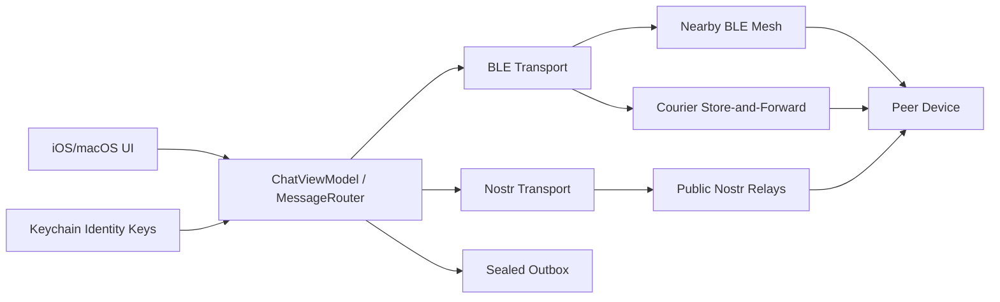
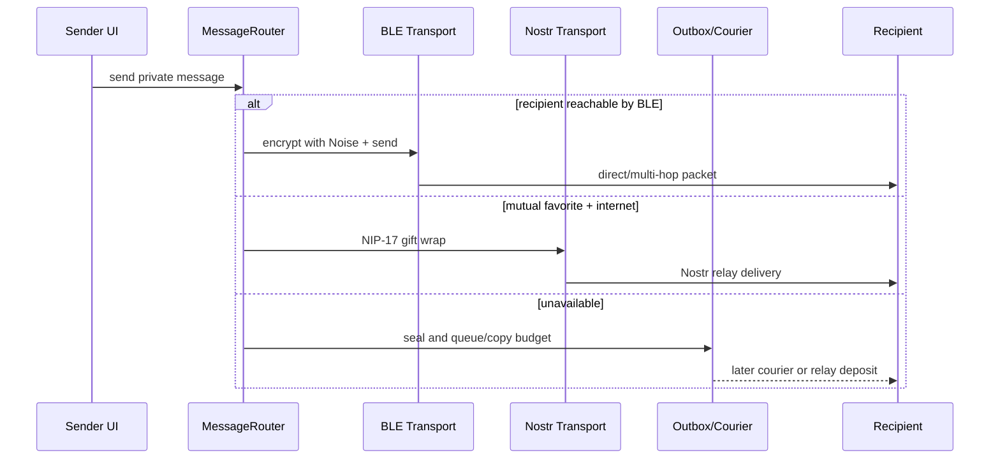
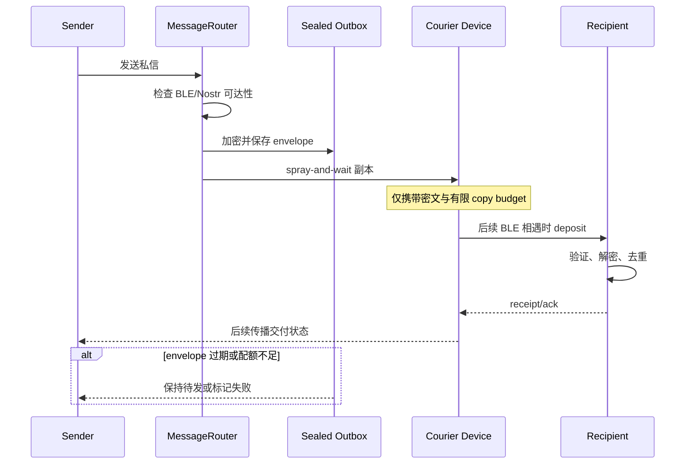

# permissionlesstech/bitchat 项目深度解析

## 1. 项目概览

- 报告日期：2026-07-26
- 仓库地址：https://github.com/permissionlesstech/bitchat
- Trending 原始排名：10
- Stars Today：1,720
- 项目定位：采用 BLE mesh 与 Nostr 双传输的去中心化聊天应用，可在无网和有网环境间切换。
- 解决的问题：传统聊天依赖账号、手机号和中心服务器；Bitchat 希望在网络中断、基础设施不可信或设备临时相遇时继续传递消息。
- 目标用户：灾害/活动现场用户、隐私敏感社区、去中心化协议研究者。
- 当前成熟度：早期产品化；已有 App、白皮书、测试和持续发布，但协议及路由仍快速演进。
- 推荐结论：适合研究和低风险现场通信测试；不能未经安全评估就承担生命安全或强合规通信。

## 2. 系统架构

### 2.1 架构概览

应用以 Swift 原生 UI 和 ViewModel 管理用户状态，由统一消息路由在 BLE mesh 与 Nostr 两个 Transport 之间选择路径。BLE 路径同时扮演 GATT central/peripheral，以受控 flood、多跳 TTL、去重与 jitter 转发；Nostr 路径使用 relay 和 NIP-17 gift wrap。若收件人暂不可达，持久 sender outbox、courier spray-and-wait 和 relay mailbox 提供 store-and-forward。身份密钥保存在 Keychain，私聊使用 Noise 或 NIP-17。

### 2.2 架构图

### 2.3 核心模块

| 模块 | 职责 | 代码位置 | 关键依赖 | 证据级别 |
|---|---|---|---|---|
| App/ViewModel | UI 状态、会话和发送动作 | `bitchat/*`, `ChatViewModel` | SwiftUI | Medium |
| Message Router | 按可达性选择 BLE、Nostr 或排队 | 白皮书 `MessageRouter`，相关服务 | Transport interface | High |
| BLE Mesh | 发现、连接、分片、TTL、去重和转发 | `bitchat` BLE service，测试 | CoreBluetooth | High |
| Nostr Transport | relay 连接、地理频道和 NIP-17 私聊 | `bitchat`, `relays` | Nostr | High |
| Crypto/Identity | Noise、Ed25519、Curve25519、Keychain | 加密服务与白皮书 | CryptoKit/Noise | High |
| Store-and-Forward | sender outbox、courier envelope、公共历史同步 | 白皮书 v2 与实现模块 | sealed ciphertext | High |

### 2.4 数据与状态管理

长期身份使用 Keychain 中的 Curve25519 与 Ed25519 密钥。白皮书说明私密消息明文不落盘；离线待发和 courier 内容以密文持久化，并有保留期、配额和 panic wipe。公共频道历史可以 gossip 同步并归档。

### 2.5 外部集成与协议

- Bluetooth Low Energy：本地发现和多跳 mesh。
- Noise Protocol：mesh 私聊密钥协商和加密。
- Nostr / NIP-17：互联网私聊与地理频道。
- LZ4：部分消息压缩。
- iOS/macOS Keychain：身份密钥。

### 2.6 部署与运行形态

原生 iOS/macOS 应用；BLE 路径无需服务器，Nostr 路径依赖公共 relay。每台设备同时是客户端、mesh 节点和潜在 courier。

## 3. 主线流程

### 3.1 核心流程图

### 3.2 关键步骤

1. UI 生成消息和目标 peer。
2. Router 查询 BLE link、收藏/身份映射和网络条件。
3. BLE 可达时创建 Noise 加密 payload 与二进制 packet。
4. relay 节点按 TTL、seen-set、jitter 和 fanout 规则转发。
5. BLE 不可用时，对互相收藏的联系人使用 NIP-17 经 Nostr relay 发送。
6. 两者均不可用时写入 sealed outbox，并等待 transport 或 courier 机会。

### 3.3 异常与失败处理

BLE 重复包被 seen-set 丢弃；TTL 到零停止转发。Nostr relay 失败可换 relay 或保留待发。离线 outbox 受保留期和配额限制。恶意 courier 可以丢消息但不能读取密文；冗余副本与重试降低单点丢失风险。

## 4. 典型业务场景端到端执行链路

### 4.1 场景定义

| 项目 | 内容 |
|---|---|
| 场景名称 | 发送者离线时向暂不在范围内的收藏联系人发送私信，稍后由移动 courier 交付 |
| 参与者 | 发送者、MessageRouter、sealed outbox、附近 courier、收件者 |
| 前置条件 | 双方已建立身份/收藏关系；发送设备可发现至少一个邻近节点；当前无互联网且收件者不在 BLE 范围 |
| 输入 | **示意**文本消息：`meeting moved to checkpoint B` |
| 期望结果 | 消息以密文存入 outbox并复制给受配额约束的 courier；收件者后来相遇时收到并确认 |
| 成功判定 | 收件者解密出原文，发送者最终收到 delivery receipt 或本地状态更新 |

### 4.2 端到端时序图

### 4.3 执行步骤追踪

| 步骤 | 输入 | 执行组件 | 关键代码位置 | 状态或数据变化 | 输出 | 失败分支 | 证据级别 |
|---:|---|---|---|---|---|---|---|
| 1 | 收件人+文本 | UI/ViewModel | `ChatViewModel` 等 | 生成本地消息 | send request | 无身份映射→不能私发 | Medium |
| 2 | send request | MessageRouter | 白皮书 `MessageRouter` | BLE/Nostr 可达性判定 | route decision | 两者不可用→queue | High |
| 3 | 原文 | Crypto/outbox | sealed mail 实现 | 原文变密文 envelope并持久化 | queued envelope | Keychain/加密失败→报错 | High |
| 4 | envelope | Courier subsystem | whitepaper store-and-forward | copy budget 减少，courier 增加密文副本 | opaque mail | 配额/大小/TTL拒绝 | High |
| 5 | 相遇事件 | BLE Transport | BLE service | 建立链接并验证 envelope | deposit | 连接中断→保留副本重试 | High |
| 6 | envelope | Recipient crypto | Noise/static identity | 去重并解密 | plaintext message | 验证失败→丢弃 | High |
| 7 | receipt | Router/outbox | receipt path | outbox 标记已交付/清理 | 用户状态 | receipt 丢失→可能重复但去重 | Medium |

### 4.4 关键状态与数据变化

发送者保存密文 outbox；courier 保存配额受限、带到期时间的密文副本；收件者验证后将消息加入会话。公开历史与私密 courier 数据有不同保留策略，panic wipe 会删除身份、收藏、outbox 和 courier mail。

### 4.5 失败传播、重试与回滚

BLE 连接失败时 courier 保留 envelope，等待下一次机会；过期或超出配额的 envelope 被拒绝或清理。消息可能重复到达，因此依靠消息标识和去重而不是事务回滚。白皮书明确指出 courier 可丢包，系统提供概率性而非绝对交付保证。

### 4.6 最终业务结果

用户在无互联网且收件人不在线时仍可发出消息，网络恢复或设备移动相遇后完成最终交付。中间设备只持有密文，但 BLE 接近关系和时间仍可能泄露元数据。

### 4.7 最小复现与验证方法

1. 在三台测试设备安装开发构建，关闭蜂窝/Wi-Fi。
2. A 与 C 在范围内，B 暂时离开；A、B 建立测试身份关系。
3. A 向 B 发送示意文本，观察 outbox/courier 状态。
4. 让 C 移动到 B 范围内，验证消息交付和去重。
5. 重复测试断开连接、过期 envelope 和 panic wipe。

## 5. 技术栈

| 层次 | 技术 | 用途 | 是否核心 | 证据位置 |
|---|---|---|---|---|
| 语言/平台 | Swift, iOS/macOS | App 与协议实现 | 是 | `Package.swift`, Xcode project |
| 本地网络 | CoreBluetooth / BLE | 发现、连接与 mesh | 是 | README/whitepaper/BLE service |
| 加密 | Noise, Curve25519, Ed25519 | 私聊、身份和签名 | 是 | WHITEPAPER |
| 互联网 | Nostr, NIP-17 | relay 与地理频道 | 是 | README/WHITEPAPER |
| 压缩 | LZ4 | 受限链路 payload | 辅助 | README |
| 存储 | Keychain + sealed local storage | 密钥、outbox、courier | 是 | WHITEPAPER |

## 6. 创新点

### 创新点 1
- 类型：架构创新
- 传统方案：离线 mesh 和互联网聊天分属不同应用。
- 当前方案：统一 Router 在 BLE、Nostr 和 courier 间选择。
- 实际收益：同一联系人可跨网络状态继续通信。
- 证据：README 与 WHITEPAPER v2。
- 局限：路由与身份绑定复杂，元数据不能完全隐藏。

### 创新点 2
- 类型：协议创新
- 传统方案：离线消息依赖固定基础设施或无限 flood。
- 当前方案：sealed outbox + spray-and-wait courier + TTL/配额/去重。
- 实际收益：支持分区网络中的最终交付，同时限制放大攻击。
- 证据：WHITEPAPER store-and-forward 章节。
- 局限：courier mail 当前没有前向保密，交付仅概率保证。

## 7. 应用场景

### 适合
- 活动、灾害演练和弱网现场通信。
- BLE/Nostr/去中心化消息协议研究。
- 对账号和中心服务器依赖敏感的社区。

### 可以尝试
- 低风险志愿者调度和临时组织沟通。
- 多设备离线消息实验。

### 暂不建议
- 医疗、救援等必须保证交付的生命安全系统。
- 未审计情况下处理高价值机密或强合规数据。

## 8. 第一次阅读与验证建议

1. 先读 README 的 transport selection。
2. 再读 WHITEPAPER v2 的 MessageRouter、mesh、courier 与安全章节。
3. 查看 BLE service、ChatViewModel、Transport 实现和测试。
4. 用三设备测试 mesh、离线 courier、Nostr fallback 和 panic wipe。

## 9. 风险与限制

- 安全：协议复杂，需关注密钥管理、relay 元数据和实现审计。
- 性能：BLE 吞吐、设备电量和密集网络行为需现场验证。
- 许可证：Unlicense / public domain。
- 维护状态：活跃快速演进。
- 生产可用性：适合实验和辅助通信，不提供绝对交付保证。

## 10. Evidence Notes

- README：双 Transport、路由优先级、协议和构建方式。
- `WHITEPAPER.md` v2：MessageRouter、身份、BLE flood、store-and-forward、应用层和安全权衡。
- `Package.swift`、Xcode project 和测试目录：平台、依赖与测试入口。
- Release notes：BLE 可靠性、同步和安全修复持续迭代。

## 11. Honest Caveat

本报告没有在多台真实设备上运行网络测试，也没有进行密码学审计。部分具体 Swift 文件路径根据仓库目录、白皮书类名和发布记录定位，完整函数调用链未逐行验证，因此 UI 到 Router 的部分标为 Medium。

## 12. 可信度

- Architecture Confidence: High
- Flow Confidence: High
- Innovation Confidence: Medium
