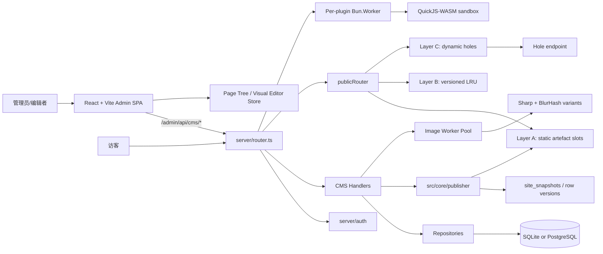
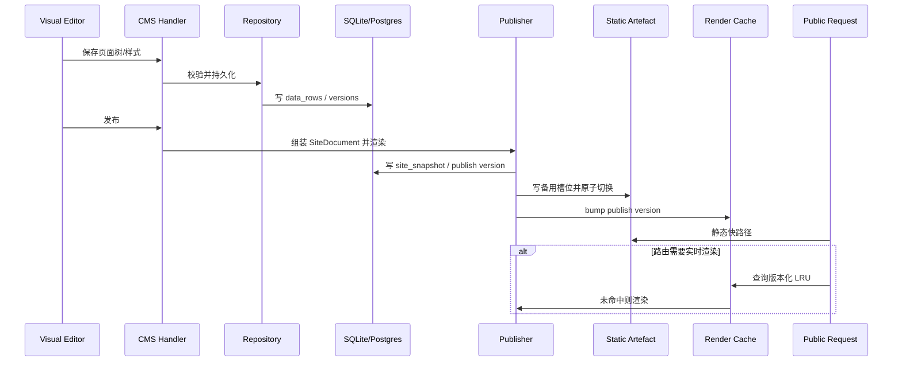
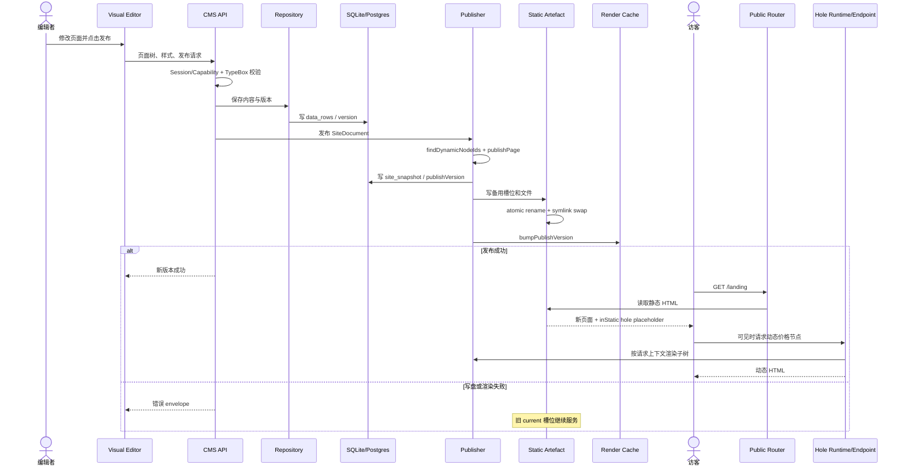

# CoreBunch/Instatic 项目深度解析

## 1. 项目概览

- 报告日期：2026-07-27
- 仓库地址：https://github.com/CoreBunch/Instatic
- Trending 原始排名：05
- Stars Today：888
- 项目定位：自托管视觉 CMS，将可视化编辑、内容数据库、插件系统和静态/动态混合发布整合在一个 Bun 应用中。
- 解决的问题：团队常在“低代码视觉编辑”与“代码、数据和部署自主权”之间二选一；传统 CMS 的公开页面又常携带较重运行时。
- 目标用户：内容团队、前端开发者、自托管组织、内部建站平台团队和插件开发者。
- 当前成熟度：早期可用，版本低于 1.0。
- 推荐结论：架构设计完整，尤其值得研究单进程边界、三层发布与插件沙箱；复杂生产负载前必须做迁移、缓存、插件故障和多实例压测。

## 2. 系统架构

### 2.1 架构概览

Instatic 以单个 Bun 进程为核心：`server/index.ts` 启动 `Bun.serve`，`server/router.ts` 路由公共页面、后台 SPA、CMS API、媒体与插件运行时。后台和视觉编辑器是同一个 React/Vite SPA。内容通过 Repository 层访问 SQLite 或 PostgreSQL。发布器将页面树转换为语义 HTML 和 CSS，并采用三层公开渲染：发布时静态烘焙与原子槽位切换、实时渲染的版本化 LRU、以及对动态节点生成 `<instatic-hole>` 并懒加载。插件服务端代码被放入每插件一个 Bun.Worker 中的 QuickJS-WASM 沙箱；图片变体也由独立 Worker 池处理。

### 2.2 架构图

### 2.3 核心模块

| 模块 | 职责 | 代码位置 | 关键依赖 | 证据级别 |
|---|---|---|---|---|
| Server Entry | 启动 Bun.serve 与系统服务 | `server/index.ts` | Bun | High |
| Router / HTTP | 路由所有 URL、解析请求、统一错误 envelope | `server/router.ts`、`server/http.ts` | Bun HTTP、TypeBox | High |
| CMS Handlers | 页面、内容、媒体、插件等资源接口 | `server/handlers/cms/*.ts` | Auth、Repositories | High |
| Auth & Sessions | Session 验证、能力检查、登录流程 | `server/auth/*` | DB、加密配置 | High |
| Repository Layer | 数据库访问，保持方言无关 | `server/repositories/*.ts` | DbClient | High |
| DB Adapters | SQLite/Postgres 具体实现与迁移 | `server/db/sqlite.ts`、`postgres.ts`、`migrations-*.ts` | `bun:sqlite`、`Bun.sql` | High |
| Visual Editor | 画布、面板、工具栏和编辑器 Store | `src/admin/pages/site/*` | React、Zustand、Tiptap、dnd-kit | High |
| Publisher | 页面树转换为 HTML/CSS，动态节点检测 | `src/core/publisher/*` | NodeTree、CSS sanitizer | High |
| Public Router | 将 URL 解析到页面或数据行，并选择静态/实时路径 | `server/publish/publicRouter.ts` | Publisher、cache、artefacts | High |
| Static Artefact | 两槽位 symlink swap 与原子文件替换 | `server/publish/staticArtefact.ts` | 文件系统 | High |
| Render Cache | 版本化 LRU、单飞渲染与懒失效 | `server/publish/renderCache.ts` | `lru-cache` | High |
| Hole Runtime | 浏览器端按可见性请求动态节点 | `server/publish/holeRuntime.ts` | IntersectionObserver | High |
| Plugin Host | 插件 Worker 生命周期、崩溃预算与能力桥接 | `server/plugins/host/*` | Bun.Worker | High |
| Plugin Sandbox | QuickJS-WASM 执行插件服务端代码 | `server/plugins/quickjs/*` | quickjs-emscripten | High |
| Image Workers | 图片缩放、WebP 和 BlurHash，避免阻塞主线程 | `server/handlers/cms/imageVariant*` | Sharp、BlurHash | High |

### 2.4 数据与状态管理

内容统一放在 `data_tables` 和 `data_rows`，页面、文章、组件和布局通过 `kind` 区分；页面树和视觉组件树复用 `NodeTree<TNode>`。发布时生成 `site_snapshots`，页面版本通过 `data_row_versions.site_snapshot_id` 引用对应站点文档，形成审计记录。数据库由 `DATABASE_URL` 选择 PostgreSQL 或 SQLite。公开渲染的状态还包括当前发布版本、静态槽位和版本化 LRU 条目。

### 2.5 外部集成与协议

- 后台与 API：HTTP JSON，TypeBox 验证请求和响应边界。
- 数据库：PostgreSQL 或 SQLite，Repository 层隐藏方言差异。
- 插件：能力授权 SDK；服务端代码在 QuickJS-WASM 沙箱中运行。
- MCP：依赖中包含官方 MCP SDK，具体启用路径需按当前文档核对。
- 图片处理：Sharp 和 BlurHash 在 Worker 池中执行。
- 公共动态节点：`/_instatic/hole/<nodeId>?v=<publishVersion>&u=<page-url>`。

### 2.6 部署与运行形态

`bun server/index.ts` 启动单进程服务；`package.json` 要求 Bun 1.3.x。可通过 Docker Compose 运行。SQLite 模式天然偏单实例；PostgreSQL 多实例部署时，定时发布和插件 Tick 使用 `server/db/advisoryLock.ts` 的 PostgreSQL advisory lock 做 Leader Election，避免任务重复触发。系统没有外部消息队列或托管服务依赖。

## 3. 主线流程

### 3.1 核心流程图

### 3.2 关键步骤

1. 管理员在视觉编辑器中修改页面树、样式或绑定。
2. CMS Handler 用 TypeBox 校验输入，经 Repository 写入统一内容模型。
3. 发布动作读取页面和站点快照，`publishPage` 生成 HTML 与哈希 CSS。
4. 动态检测器识别依赖请求或访客上下文的节点；静态部分可完全烘焙，动态部分输出 Hole。
5. 静态文件先写入非当前槽位，文件内部采用原子 rename，完成后切换 symlink。
6. 发布版本递增，实时缓存按版本懒失效；若发布发生在渲染中途，旧版本结果不会写入缓存。
7. 访客请求优先命中静态磁盘；实时路由进入 LRU；动态 Hole 在可见时调用 Hole Endpoint。

### 3.3 异常与失败处理

- 请求校验失败：HTTP 层返回 `{ error: string }` envelope，不进入 Repository。
- 发布写盘失败：备用槽位不应切成当前槽位，旧发布仍可继续服务。
- 发布与实时渲染竞态：渲染开始时捕获版本，若中途版本变化则丢弃结果，避免把旧 HTML 放进新版本缓存。
- 插件崩溃：每插件独立 Worker，宿主按 crash budget 重启或隔离该插件，不让插件代码直接进入 Bun 主进程。
- 多实例定时任务：PostgreSQL advisory lock 只允许一个 Leader 执行。

## 4. 典型业务场景端到端执行链路

### 4.1 场景定义

| 项目 | 内容 |
|---|---|
| 场景名称 | 编辑者修改产品落地页并发布，访客随后获得新静态页面和按需动态价格模块 |
| 参与者 | 编辑者、Visual Editor、CMS API、Repository、数据库、Publisher、Static Artefact、Render Cache、访客浏览器、Hole Endpoint |
| 前置条件 | Instatic 已运行；编辑者有发布权限；站点已有页面和一个标记为动态的价格模块；上传目录可写 |
| 输入 | 示例（示意）：修改标题、样式和 CTA，并点击 Publish |
| 期望结果 | 新页面版本保存并原子上线；静态内容直接由磁盘返回；价格模块按访客请求动态获取 |
| 成功判定 | 数据库存在新版本/快照；当前静态槽位指向新产物；公开 URL 返回新标题；动态 Hole 请求成功且版本参数匹配 |

### 4.2 端到端时序图

### 4.3 执行步骤追踪

| 步骤 | 输入 | 执行组件 | 关键代码位置 | 状态或数据变化 | 输出 | 失败分支 | 证据级别 |
|---:|---|---|---|---|---|---|---|
| 1 | 页面编辑动作 | Visual Editor | `src/admin/pages/site/*` | 编辑器 Store 更新 | 待保存页面树 | 客户端校验或状态冲突 | High |
| 2 | CMS 请求 | Router/Auth/Handler | `server/router.ts`、`server/auth/*`、`server/handlers/cms/*.ts` | 校验 Session、能力与 TypeBox Schema | 规范化写请求 | 401/403/验证错误 envelope | High |
| 3 | 内容模型 | Repository | `server/repositories/*.ts` | 写 `data_rows` 和版本 | 持久化记录 | DB 事务失败，发布不继续 | High |
| 4 | 站点文档 | Publisher | `src/core/publisher/*`、`dynamicDetection.ts` | 分类静态/动态节点，生成 HTML/CSS | PublishedPageSnapshot | 非法 CSS/树结构被验证或净化 | High |
| 5 | 发布快照 | DB Adapter | `server/db/*` | 写 `site_snapshots` 与 publish version | 可审计版本 | DB 失败，保留旧发布 | High |
| 6 | HTML/CSS 文件 | Static Artefact | `server/publish/staticArtefact.ts` | 写备用槽位，原子替换，切换 current | 新静态站点 | 写盘失败不切换 symlink | High |
| 7 | 新版本号 | Render Cache | `server/publish/renderCache.ts` | 版本递增，旧条目懒失效 | 新缓存边界 | 中途发布时丢弃旧渲染 | High |
| 8 | GET 页面 | Public Router | `server/publish/publicRouter.ts` | 解析 URL 和快路径 | 静态 HTML 或实时渲染 | 404/渲染错误 | High |
| 9 | Hole 可见事件 | Hole Runtime | `holeRuntime.ts`、`handlers/cms/hole.ts` | 请求节点子树；共享或 no-store | 动态 HTML | 版本过期、节点不存在、上下文失败 | High |

### 4.4 关键状态与数据变化

- 编辑态：页面树和样式在后台 Store 中变化。
- 持久化态：`data_rows`/版本记录更新，并建立新的 `site_snapshot` 引用。
- 发布态：`publishVersion` 递增，静态备用槽位写入完成后切换为 current。
- 缓存态：旧 LRU 条目按版本变为不可用，但采用懒失效，不必全量同步清空。
- 访客态：静态页面直接返回；动态节点通过 Hole 请求按访问上下文生成。

### 4.5 失败传播、重试与回滚

发布失败时 API 返回错误，静态槽位切换不应发生，访客继续读取旧 current。实时渲染如果撞上新发布，旧版本结果被丢弃而不是缓存；下次请求按新版本重渲染。动态 Hole 失败只影响对应动态子树，不应把已返回的静态页面整体变成 500，但具体前端占位错误 UI 需进一步查看当前实现。

### 4.6 最终业务结果

编辑者获得一次可审计、可回退边界清晰的发布；访客大部分请求走静态文件，只有确实依赖请求上下文的节点才执行动态渲染。系统在编辑体验、静态性能和局部个性化之间建立了明确分层。

### 4.7 最小复现与验证方法

1. 安装 Bun 1.3.x，运行 `bun install` 和 `bun run dev`。
2. 使用 SQLite 默认配置创建一个页面，加入普通文本和一个动态模块。
3. 发布页面，检查 `uploads/published/current/` 指向的槽位和生成 HTML。
4. 打开公开页面，确认静态 HTML 包含 Hole placeholder 和小型 runtime。
5. 滚动使动态模块进入视口，观察 `/_instatic/hole/...` 请求。
6. 在发布写盘中制造失败，确认 current 仍指向旧槽位。
7. 并发发送访客请求和新发布，验证旧版本渲染不会写入新版本缓存。

## 5. 技术栈

| 层次 | 技术 | 用途 | 是否核心 | 证据位置 |
|---|---|---|---|---|
| 运行时 | Bun 1.3.x | HTTP、脚本、Worker、数据库适配 | 是 | `package.json`、`server/index.ts` |
| 语言 | TypeScript | 前后端与插件 SDK | 是 | 全仓库 |
| 前端 | React 19、Vite 8、Zustand、Tiptap | 后台、视觉编辑和富文本 | 是 | `package.json`、`src/admin` |
| 数据库 | SQLite / PostgreSQL | 内容、用户、版本与快照 | 是 | `server/db/*`、架构文档 |
| Schema | TypeBox | HTTP、持久化 JSON、插件 Manifest 边界 | 是 | 架构文档、依赖 |
| 发布 | 自研 Publisher、HTML/CSS pipeline | 页面树转静态/动态输出 | 是 | `src/core/publisher/*` |
| 缓存 | LRU Cache | 实时渲染版本化缓存和 single-flight | 是 | `renderCache.ts` |
| 插件沙箱 | Bun.Worker + QuickJS-WASM | 隔离插件服务端代码 | 是 | `server/plugins/*` |
| 图片 | Sharp、BlurHash、Bun.Worker | 图片变体和占位信息 | 可选但重要 | `imageVariant*` |
| 部署 | Docker Compose | 自托管部署 | 可选 | `compose.prod.yml`、scripts |
| 协议扩展 | MCP SDK | Agent/工具扩展能力 | 可选 | `package.json`，具体入口需核验 |

## 6. 创新点

### 创新点 1：三层发布模型自动区分静态与动态

- 类型：架构创新 / 性能创新
- 传统方案：要么整页静态导致个性化困难，要么整页 SSR/SPA 增加运行成本。
- 当前方案：静态槽位、版本化实时 LRU、动态 Hole 三层组合，动态节点由 `findDynamicNodeIds` 自动检测。
- 实际收益：大部分页面保留纯 HTML/CSS，按需支付动态渲染成本。
- 证据：`docs/architecture.md`、`publicRouter.ts`、`staticArtefact.ts`、`renderCache.ts`、`holeRuntime.ts`。
- 局限：版本、缓存、Hole 上下文和静态槽位形成更复杂的一致性系统，需要故障测试。

### 创新点 2：插件代码在每插件独立 Worker 内的 QuickJS 沙箱运行

- 类型：安全架构创新 / 工程整合创新
- 传统方案：CMS 插件通常与宿主共享完整 Node/PHP 运行时，一个插件崩溃或越权可影响全站。
- 当前方案：每个活动插件一个 Bun.Worker，内部 QuickJS-WASM 无默认 Bun/Node 环境，只能通过能力授权 SDK 访问宿主。
- 实际收益：降低插件崩溃和越权的影响半径。
- 证据：架构文档 `server/plugins/host/`、`server/plugins/quickjs/` 和 crashRecovery。
- 局限：沙箱逃逸、桥接 API 和资源限制仍需专业安全审计；隔离也增加调试成本。

### 创新点 3：单进程产品边界

- 类型：开发体验创新 / 工程整合创新
- 传统方案：后台、编辑器、发布器、媒体和插件服务往往拆成多个服务。
- 当前方案：一个 Bun 进程承载主要功能，只将 CPU 密集图片任务和不可信插件移到 Worker。
- 实际收益：自托管安装和运维更简单，适合中小团队。
- 证据：`docs/architecture.md` Process and layout。
- 局限：主线程仍承载大量 HTTP、API 和发布工作，需要验证高流量与大站点下的瓶颈。

## 7. 应用场景

### 适合

- 中小企业自托管官网、内容站和产品落地页。
- 设计/内容人员需要视觉编辑，开发者仍需控制代码、数据库和部署。
- 静态页面为主、少量节点需要访客上下文的站点。

### 可以尝试

- 多实例 PostgreSQL 高可用部署，需要压测 Advisory Lock、缓存和上传共享存储。
- 插件市场或内部插件平台，需要安全审计能力桥接和资源配额。

### 暂不建议

- 未做迁移演练就替换大型成熟 CMS。
- 对插件完全不受信任且有严格多租户隔离要求的公开 SaaS。
- 需要大规模实时协作编辑但尚未验证冲突模型的场景。

## 8. 第一次阅读与验证建议

1. 先读 `docs/architecture.md`，建立进程、数据和发布三张地图。
2. 看 `server/router.ts` 与 `server/publish/publicRouter.ts` 理解请求分流。
3. 看 `src/core/publisher/*`、`dynamicDetection.ts` 和 `renderCache.ts`。
4. 再看 `server/plugins/host/` 与 `server/plugins/quickjs/`。
5. 运行最小页面发布，检查静态槽位、缓存版本和 Hole 请求。

## 9. 风险与限制

- 安全：后台、上传、插件桥接、CSS/HTML 输出和数据库凭据都属于关键攻击面。
- 性能：单进程、实时渲染、图片 Worker 与插件 Worker 的资源竞争需压测。
- 许可证：MIT；插件、字体、图片与用户内容仍有各自许可证。
- 维护状态：0.x 快速迭代，Schema 和发布格式可能变化。
- 生产可用性：适合评估和中小规模部署；关键站点需备份、迁移、回滚和多实例演练。

## 10. Evidence Notes

- `docs/architecture.md`：进程布局、目录、层职责、请求生命周期、数据模型和三层发布。
- `package.json`：Bun 版本、React/Vite、TypeBox、QuickJS、Sharp、MCP 和测试/部署脚本。
- `server/router.ts` / `server/http.ts`：HTTP 边界。
- `server/publish/publicRouter.ts`：公共 URL 解析与渲染选择。
- `server/publish/staticArtefact.ts`：槽位和原子替换。
- `server/publish/renderCache.ts`：版本化 LRU 与竞态处理。
- `src/core/publisher/dynamicDetection.ts`：动态节点自动分类。
- `server/plugins/host/`、`server/plugins/quickjs/`：插件隔离。

## 11. Honest Caveat

本报告没有实际部署多实例 PostgreSQL、验证 QuickJS 沙箱安全或对三层发布进行压力测试。MCP、Agent 能力和插件生命周期仍需根据当前源码逐入口核对；文档中的性能意图不等于本报告完成了独立性能证明。

## 12. 可信度

- Architecture Confidence: High
- Flow Confidence: High
- Innovation Confidence: Medium
