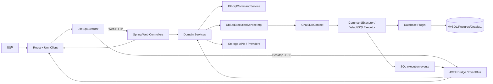
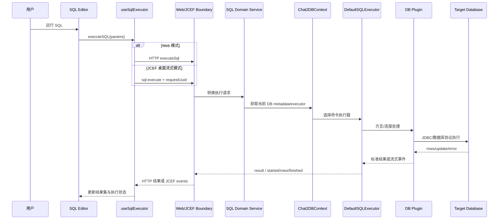
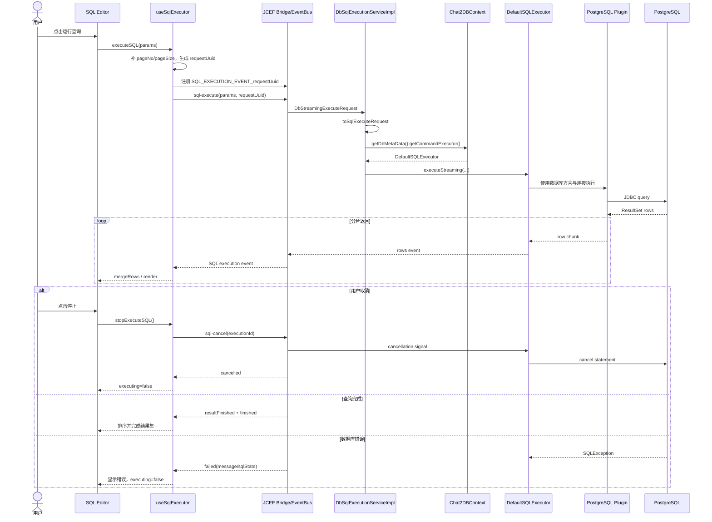

# OtterMind/Chat2DB 项目深度解析

## 1. 项目概览

- 报告日期：2026-07-27
- 仓库地址：https://github.com/OtterMind/Chat2DB
- Trending 原始排名：08
- Stars Today：398
- 项目定位：跨平台数据库客户端与 AI 数据库工作台，提供 SQL 编辑、元数据浏览、结果集管理、数据库插件、桌面流式执行和 AI 辅助。
- 解决的问题：多数据库工具分散、SQL 执行和元数据体验不一致、桌面客户端对长查询的反馈与取消不足，以及 AI 能力与真实数据库权限边界难统一。
- 目标用户：后端开发者、DBA、数据工程师、需要多数据库 GUI 的团队，以及研究 AI+数据库工具的工程师。
- 当前成熟度：生产候选 / 成熟社区产品，代码体量和发布形态较完整。
- 推荐结论：适合研究分层数据库客户端、插件化方言支持和桌面流式 SQL；连接生产库或启用 AI 前必须采用最小权限、审计和脱敏。

## 2. 系统架构

### 2.1 架构概览

Chat2DB Community 是前后端分离但可打包成一体的应用。前端使用 React、TypeScript 和 Umi，提供 SQL 编辑器、连接管理、Schema 导航和结果集。后端是 Java 17/Spring Boot Maven Reactor，按 domain、storage、web、SPI、database plugins、JCEF 和 start 模块组织。Web 版通过 HTTP 调用后端；桌面版把前端装入 JCEF，并通过 `window.javaQuery`/事件总线支持 SQL 流式事件。领域服务将请求转换为数据库执行命令，SPI 根据当前数据库元数据选择对应 `ICommandExecutor`，数据库特有行为留在插件模块中。

### 2.2 架构图

### 2.3 核心模块

| 模块 | 职责 | 代码位置 | 关键依赖 | 证据级别 |
|---|---|---|---|---|
| Community Client | SQL 编辑、连接、元数据、结果集与 AI UI | `chat2db-community-client/` | React、TypeScript、Umi、Zustand、Ant Design | High |
| useSqlExecutor | 统一普通 HTTP 和桌面流式 SQL 执行、分页、取消和状态 | `chat2db-community-client/src/hooks/useSqlExecutor.ts` | executeSql service、JCEF stream | High |
| SQL Stream Service | JCEF 请求、事件类型、结果分片合并与取消 | `chat2db-community-client/src/service/sqlExecutionStream.ts` | JcefEventBus、createJcefApi | High |
| Web Layer | 接收 Community API 请求，保持 Controller 薄 | `chat2db-community-server/...-web/` | Spring MVC、Domain API | Medium |
| Domain API/Core | SQL、数据源、元数据、任务等业务接口与实现 | `chat2db-community-domain/*` | Spring、domain models | High |
| DbSqlExecutionServiceImpl | 把桌面流式请求转换为 SQL 命令并调用默认执行器 | `.../domain/core/impl/db/DbSqlExecutionServiceImpl.java` | IDbSqlCommandService、Chat2DBContext | High |
| SPI | 数据库命令、元数据、SQL 构建等公共扩展边界 | `chat2db-community-spi/` | JDBC、plugin contracts | High |
| Database Plugins | MySQL、PostgreSQL、Oracle、ClickHouse 等方言实现 | `chat2db-community-plugins/` | 各数据库 JDBC/协议 | High |
| Storage | 数据源、配置、历史、任务和本地产品状态 | Server storage modules | MyBatis / local storage providers | Medium |
| JCEF Runtime | 桌面前端桥接、事件推送和本地离线运行 | Server JCEF modules、client `jcef/` | JCEF、Java bridge | High |
| Community Start | 可执行后端、配置和前端静态资源装配 | `chat2db-community-start/` | Spring Boot | High |

### 2.4 数据与状态管理

Chat2DB 自身保存数据源配置、用户设置、SQL 历史、任务、固定项和操作日志等产品状态，具体表和存储 Provider 由 Server storage 模块管理。数据库查询结果不是简单一次性对象：桌面流式执行通过 `executionId`、`statementSequence`、`resultSequence` 与 `resultKey` 标识执行、语句和结果分片，前端按事件顺序合并 `rows`、`resultStarted`、`resultFinished` 和消息。实际业务数据仍位于用户连接的目标数据库，Chat2DB 通过数据库插件和 JDBC/执行器访问。

### 2.5 外部集成与协议

- Web 前端：HTTP API。
- 桌面前端：JCEF `window.javaQuery` 包装与 `JcefEventBus`。
- 目标数据库：公共 SPI + 数据库特定插件。
- AI Provider：项目支持用户配置模型和 Text2SQL/助手；具体请求数据和 Provider 条款需按配置核对。
- CLI/MCP：作为额外交互面，具体能力以当前版本文档和入口为准。
- Docker：容器内部监听 `0.0.0.0:10825`，默认 Compose 将宿主发布限制到 `127.0.0.1:10825`。

### 2.6 部署与运行形态

Community 可作为 Web 应用、Docker 镜像和 JCEF 桌面包运行。后端 Java 17/Spring Boot 默认本地端口 10825，前端开发服务器端口 8889 并代理后端。桌面产品强调离线优先、本机回环绑定和 Community 存储路径。`chat2db-community-start` 组装最终 Jar 与前端资源；桌面包通过脚本和 jpackage 生成平台安装包。

## 3. 主线流程

### 3.1 核心流程图

### 3.2 关键步骤

1. SQL 编辑器构造 `IExecuteSqlParams`，`useSqlExecutor` 补齐默认页码和页大小。
2. Web 模式调用普通 `executeSql` HTTP Service；桌面模式生成 `requestUuid`，注册事件订阅并调用 `sql-execute`。
3. 后端领域层将外部请求转换为 `SqlExecuteRequest`。
4. `Chat2DBContext.getDbMetaData().getCommandExecutor()` 根据当前数据库插件取得执行器。
5. 流式执行要求执行器为 `DefaultSQLExecutor`，否则返回 `streamingUnsupported`。
6. 执行器与数据库插件连接目标数据库，产生行、更新计数、消息或错误。
7. 桌面模式把 `started`、`rows`、`resultFinished`、`finished`、`failed`、`cancelled` 等事件推到前端；Web 模式一次返回结果数组。
8. 用户取消时，桌面调用 `sql-cancel(executionId)`，Web 模式中止 AbortSignal。

### 3.3 异常与失败处理

- 启动失败：若 `sql-execute` 未返回 `executionId`，前端取消订阅并拒绝 Promise。
- SQL 错误：流式事件带 `failed`、message、errorCode 和 sqlState；前端停止执行状态并向调用方 Reject。
- 用户取消：桌面按 `executionId` 调用 cancel，收到 `cancelled` 后正常收尾；Web 使用 AbortController。
- 不支持流式：后端若当前 `ICommandExecutor` 不是 `DefaultSQLExecutor`，抛出 `streamingUnsupported`。
- 多结果集：前端依据 execution/statement/result 标识合并和排序，避免不同语句或结果分片串在一起。

## 4. 典型业务场景端到端执行链路

### 4.1 场景定义

| 项目 | 内容 |
|---|---|
| 场景名称 | 桌面用户运行一个大表分页查询，结果分批显示，并在查询过慢时主动取消 |
| 参与者 | 用户、SQL Editor、useSqlExecutor、JCEF Bridge/EventBus、SQL Domain Service、DefaultSQLExecutor、PostgreSQL 插件（示例）、目标数据库 |
| 前置条件 | Community 桌面版运行；已配置只读 PostgreSQL 数据源；JCEF Bridge 可用；用户有目标 Schema 查询权限 |
| 输入 | 示例 SQL（示意）：`SELECT * FROM orders ORDER BY created_at DESC LIMIT 1000` |
| 期望结果 | UI 先显示执行开始，再增量展示行；用户取消后后端停止语句并发出 cancelled，UI 不再追加数据 |
| 成功判定 | 获得唯一 executionId；事件序列单调合并；取消后收到 cancelled 或明确失败；执行状态回到 false |

### 4.2 端到端时序图

### 4.3 执行步骤追踪

| 步骤 | 输入 | 执行组件 | 关键代码位置 | 状态或数据变化 | 输出 | 失败分支 | 证据级别 |
|---:|---|---|---|---|---|---|---|
| 1 | SQL 与数据源参数 | SQL Editor | `client/src/components/SQLEditor/*` | 编辑器生成执行参数 | `IExecuteSqlParams` | SQL 为空或连接未选中 | Medium |
| 2 | 执行参数 | `useSqlExecutor` | `client/src/hooks/useSqlExecutor.ts` | `executing=true`，补分页，生成 requestUuid | JCEF start 请求 | JCEF API 调用失败 | High |
| 3 | requestUuid | EventBus | `client/src/service/sqlExecutionStream.ts` | 注册唯一事件主题 | 事件订阅 | 未订阅到事件或 Bridge 不可用 | High |
| 4 | 流式请求 | Domain Service | `DbSqlExecutionServiceImpl.java` | 转为 `SqlExecuteRequest` | 执行命令 | 请求转换/连接上下文失败 | High |
| 5 | 当前数据库上下文 | Chat2DBContext/SPI | `Chat2DBContext`、SPI modules | 选择数据库插件和 CommandExecutor | `DefaultSQLExecutor` | 非默认执行器则 streamingUnsupported | High |
| 6 | SQL Command | DB Plugin / Executor | `chat2db-community-plugins/*`、`DefaultSQLExecutor` | 创建 Statement 并执行 | 行/更新计数/消息 | SQLException、超时、权限拒绝 | Medium |
| 7 | Row chunk | JCEF Event Push | `sqlExecutionStream.ts` event types | 按 executionId/sequence 追加结果 | `rows` event | 事件乱序时按标识归并 | High |
| 8 | Row event | 前端结果模型 | `mergeRows`、`sortExecutionResults` | `dataList` 递增，结果按语句/结果序列排序 | UI 增量表格 | 无匹配 resultKey 时无法合并 | High |
| 9 | 用户停止 | `stopExecuteSQL` | `useSqlExecutor.ts` | 发出 executionId cancel | cancellation | 取消到达前仍可能收到少量已在途事件 | High |
| 10 | cancelled/failed/finished | Hook | `useSqlExecutor.ts` lines 53–86 | 取消订阅，`executing=false`，清空 executionId | 最终 UI 状态 | failed 时 Reject 并显示 message | High |

### 4.4 关键状态与数据变化

- 前端执行状态：`idle` → `executing` → `finished/failed/cancelled`。
- 执行标识：前端 `requestUuid` 绑定事件主题；后端返回 `executionId` 用于后续取消和结果关联。
- 结果状态：`resultStarted` 建立结果对象，`rows` 追加 `dataList`，`resultFinished` 补充元数据，最后按 execution/statement/result sequence 排序。
- 数据库状态：只读 SELECT 不应产生业务数据变更；若执行 DML，则目标数据库事务和提交行为取决于请求与插件实现，本案例不做假设。
- Chat2DB 产品状态可能记录历史和操作日志，但本案例未逐文件确认具体写入时点。

### 4.5 失败传播、重试与回滚

数据库异常通过 `failed` 事件携带 message、errorCode 和 sqlState 返回，前端取消订阅并退出执行状态。用户取消通过 executionId 发送到执行器和 JDBC Statement；取消属于停止，不等同事务回滚。若用户执行 DML，是否自动提交或回滚必须查看当前连接设置和数据库插件，不能从 SELECT 案例外推。网络/JCEF Bridge 中断可能导致客户端失去事件，当前文件未展示自动重连与事件补放，因此 Flow Confidence 不标 High。

### 4.6 最终业务结果

用户能在长查询执行期间看到结果逐批出现，而不是盯着一个转圈；若查询过慢，可以用 executionId 取消。执行成功、失败和取消都形成明确终态，结果分片由前端按序合并，避免多语句查询互相串台。

### 4.7 最小复现与验证方法

1. 按仓库说明用 Java 17、Maven、Node/Yarn 构建 Community 客户端和后端。
2. 使用本地只读 PostgreSQL 测试库，避免直接连接生产。
3. 在桌面版运行可返回大量行的 SELECT，观察 `started → resultStarted → rows → resultFinished → finished`。
4. 查询进行时点击停止，确认调用 `sql-cancel` 并收到 `cancelled`。
5. 制造语法错误和权限错误，确认 `failed` 事件包含可读 message/sqlState。
6. 运行多语句 SQL，验证结果按 statement/result sequence 排序。
7. 断开 JCEF Bridge 或后端，记录当前版本是否能恢复事件；若不能，应作为产品风险记录。

## 5. 技术栈

| 层次 | 技术 | 用途 | 是否核心 | 证据位置 |
|---|---|---|---|---|
| 后端语言 | Java 17 | Domain、Web、Storage、JCEF 与插件 | 是 | 根 `AGENTS.md`、Maven modules |
| 后端框架 | Spring Boot、Maven、MyBatis/Lombok patterns | 服务启动、依赖注入、Web 与持久化 | 是 | `AGENTS.md`、server reactor |
| 前端 | React、TypeScript、Umi、Zustand、Ant Design | SQL 工作台、连接、结果和设置 UI | 是 | `AGENTS.md`、client |
| 桌面 | JCEF + `window.javaQuery` | 本地桌面渲染和 Java/JS Bridge | 是（桌面） | `AGENTS.md`、`jcef/` |
| 数据库抽象 | SPI + database plugins | 方言、元数据和命令执行 | 是 | `chat2db-community-spi`、plugins |
| 数据库连接 | JDBC/数据库驱动 | 执行 SQL 与元数据访问 | 是 | Plugin modules / Executor |
| 实时结果 | JCEF EventBus、typed SQL events | 结果流、消息、取消和终态 | 是（桌面） | `sqlExecutionStream.ts` |
| 部署 | Spring Boot Jar、Docker、JCEF/jpackage | Web、容器和桌面发布 | 是 | start/docker/script/package |
| AI | Text2SQL / configurable providers | SQL 生成、解释和助手 | 可选 | README / AI modules |
| 扩展接口 | CLI / MCP | 工具和 Agent 接入 | 可选 | 官方文档，具体入口需核验 |

## 6. 创新点

### 创新点 1：统一多数据库 SPI 与桌面流式执行

- 类型：架构创新 / 工程整合创新
- 传统方案：GUI 客户端为每种数据库重复实现 SQL 执行、元数据与结果处理，长查询常只有一次性响应。
- 当前方案：公共 Domain/SPI 选择数据库插件，桌面端用 executionId 和事件序列流式返回结果与取消状态。
- 实际收益：数据库方言留在插件，前端复用统一结果模型；长查询体验更可观察。
- 证据：Repository map、`DbSqlExecutionServiceImpl.java`、`useSqlExecutor.ts`、`sqlExecutionStream.ts`。
- 局限：插件行为和 JDBC 能力并不完全一致，统一接口需要处理各数据库差异。

### 创新点 2：Community 桌面离线优先的产品边界

- 类型：产品架构创新 / 安全工程整合
- 传统方案：数据库 GUI 逐步绑定云账户、网关和在线订阅。
- 当前方案：Community Desktop 明确保持 `network.status=OFFLINE`、本机回环绑定和本地存储路径，同时仍支持 Web/Docker 形态。
- 实际收益：降低数据库元数据和查询暴露到外部服务的默认风险。
- 证据：根 `AGENTS.md` Product invariants。
- 局限：AI Provider、更新检查和用户配置仍可能产生外部通信，需要逐功能确认。

## 7. 应用场景

### 适合

- 开发者日常 SQL 调试、结果查看和多数据库切换。
- 需要本地桌面、离线优先和多数据库插件的团队。
- 研究流式 SQL 结果与取消机制。

### 可以尝试

- 企业内部统一数据库工作台，需补 SSO、审计、凭据托管和权限模板。
- AI 辅助 SQL 生成，需做 Schema 脱敏、只读账号和 Provider 数据治理。

### 暂不建议

- 未使用最小权限账号直接连接核心生产数据库。
- 未读清当前附加许可证条件就进行商业分发或托管服务。
- 把 AI 生成 SQL 无审核地用于 DDL/DML。

## 8. 第一次阅读与验证建议

1. 先读根 `AGENTS.md`，理解 Community 产品边界和模块地图。
2. 看 `useSqlExecutor.ts` 与 `sqlExecutionStream.ts`，理解客户端普通/流式双路径。
3. 看 `DbSqlExecutionServiceImpl.java`、`IDbSqlCommandService` 和 `DefaultSQLExecutor`。
4. 选择一个数据库插件，追踪连接、SQL 执行和元数据实现。
5. 用本地只读测试库复现查询、流式结果、错误和取消。

## 9. 风险与限制

- 安全：数据库凭据、SQL 历史、结果集和 Schema 都可能包含敏感数据；必须做本机绑定、最小权限和日志治理。
- 性能：大结果集即使流式返回仍可能占用前端内存；分页和最大行数需要验证。
- 许可证：当前版本在 Apache-2.0 基础上带附加条件，使用前应读完整 LICENSE 和版本说明。
- 维护状态：模块多、平台多，桌面、Docker 和 Web 的行为可能存在差异。
- 生产可用性：适合作为客户端工具；若作为团队共享服务，需要额外认证、租户隔离和凭据管理。

## 10. Evidence Notes

- 根 `AGENTS.md`：Java 17/Spring/Maven、React/Umi、Web/Docker/JCEF、Community Offline 约束与模块地图。
- `chat2db-community-client/src/hooks/useSqlExecutor.ts`：分页、Web HTTP、桌面流式、取消和终态处理。
- `chat2db-community-client/src/service/sqlExecutionStream.ts`：事件类型、executionId、结果分片合并和排序。
- `.../DbSqlExecutionServiceImpl.java`：请求转换、Chat2DBContext、CommandExecutor 和 streamingUnsupported。
- `chat2db-community-spi/`：公共数据库扩展接口。
- `chat2db-community-plugins/`：数据库特定实现。

## 11. Honest Caveat

本报告没有实际启动 JCEF 桌面包、连接所有数据库插件或验证 AI 请求数据路径。Web Controller 到 Domain Service 的具体每个类名、自动重连和事件补放机制没有完整逐行追踪，因此端到端 Flow 可信度为 Medium，而不是为了表格好看硬填 High。

## 12. 可信度

- Architecture Confidence: High
- Flow Confidence: Medium
- Innovation Confidence: Medium
