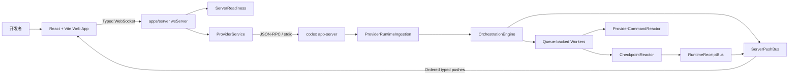
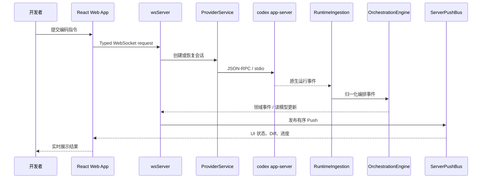
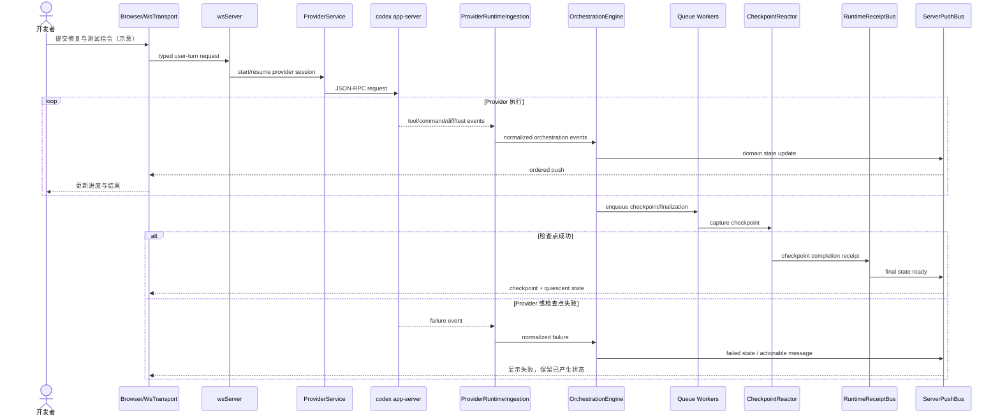

# pingdotgg/t3code 项目深度解析

## 1. 项目概览

- 报告日期：2026-07-27
- 仓库地址：https://github.com/pingdotgg/t3code
- Trending 原始排名：04
- Stars Today：149
- 项目定位：面向 Codex 等编码 Agent 的本地 Web 工作台，将 Provider Runtime 的会话、事件、检查点和异步完成状态转换为可观察、可恢复的统一体验。
- 解决的问题：终端型编码 Agent 的状态不透明、异步任务难等待、检查点和 Diff 难追踪、不同 Provider 的运行时事件难统一。
- 目标用户：重度使用编码 Agent 的开发者、需要构建内部 Agent 工作台的平台团队，以及研究 Agent 会话编排的工程师。
- 当前成熟度：早期可用、快速迭代。
- 推荐结论：值得研究其 WebSocket 边界、Provider 适配和事件驱动编排；生产使用前要核对当前支持的 Provider、版本升级和权限模型。

## 2. 系统架构

### 2.1 架构概览

T3 Code 由三层组成：React/Vite 浏览器应用、Node.js WebSocket/HTTP 服务和实际执行编码任务的 Provider Runtime。浏览器不直接理解 Codex 原生 JSON-RPC 事件，而是通过类型化 WebSocket 协议接收统一领域事件。`apps/server` 负责启动门禁、有序推送、Provider 路由、编排状态、检查点与异步收据。以 Codex 为例，服务通过 stdio 上的 JSON-RPC 驱动 `codex app-server`，再将 Provider 原生事件归一化后写入编排模型。

### 2.2 架构图

### 2.3 核心模块

| 模块 | 职责 | 代码位置 | 关键依赖 | 证据级别 |
|---|---|---|---|---|
| Browser App / WsTransport | 建立 WebSocket、发送类型化动作、接收领域推送并更新 UI | `apps/web/`，官方架构文档中的 `WsTransport` / `wsNativeApi` | React、Vite、共享 contracts | High |
| wsServer | HTTP 静态服务、WebSocket 连接、请求解码和服务路由 | `apps/server`，架构文档 `wsServer` | Node.js、WebSocket contracts | High |
| ServerReadiness | 等待关键启动屏障完成，再向客户端发布 welcome | `apps/server`，架构文档 `ServerReadiness` | Server layers | High |
| ProviderService | 创建或恢复 Provider 会话，向 Provider Runtime 发送请求 | `apps/server/src/provider/Layers/ProviderService.ts` | JSON-RPC、stdio | High |
| ProviderRuntimeIngestion | 读取 Provider 原生事件并转换为编排事件 | `apps/server/src/orchestration/Layers/ProviderRuntimeIngestion.ts` | Provider runtime events | High |
| OrchestrationEngine | 持久化编排事件、更新读模型并暴露领域事件 | `apps/server/src/orchestration/Layers/OrchestrationEngine.ts` | orchestration contracts | High |
| CheckpointReactor | 处理检查点任务并产生完成收据 | `apps/server/src/orchestration/Layers/CheckpointReactor.ts` | queue worker、git/checkpoint state | High |
| ProviderCommandReactor | 消费编排产生的 Provider 命令并推进执行 | `apps/server/src/orchestration/Layers/ProviderCommandReactor.ts` | ProviderService | High |
| RuntimeReceiptBus | 发布检查点、Diff 完成和 turn quiescence 等异步里程碑 | `apps/server/src/orchestration/Layers/RuntimeReceiptBus.ts` | typed receipts | High |
| ServerPushBus | 将所有用户可见状态通过单一路径有序推送 | 架构文档 `ServerPushBus` | typed WebSocket push | High |
| DrainableWorker | 保持异步副作用有序，并允许测试等待系统空闲 | `packages/shared/src/DrainableWorker.ts` | queue | High |

### 2.4 数据与状态管理

官方架构文档确认 `OrchestrationEngine` 会持久化事件并维护读模型，但本次静态分析没有逐文件确认具体持久化介质和所有 Schema，因此不虚构数据库类型。客户端状态来自 `server.welcome` 和后续类型化领域事件。异步任务完成不靠前端轮询内部状态，而由 `RuntimeReceiptBus` 发布收据，测试和编排代码据此等待检查点、Diff 或会话完全静止。

### 2.5 外部集成与协议

- 浏览器与服务：类型化 WebSocket 请求和 Push。
- 服务与 Codex：stdio 上的 JSON-RPC。
- Provider 边界：`ProviderService` 和 `ProviderRuntimeIngestion` 将 Provider 特有协议隔离在统一编排模型之外。
- 版本更新：连接环境声明自身更新能力，浏览器根据客户端/服务版本差异选择自动、桌面托管或手动路径。

### 2.6 部署与运行形态

根 `package.json` 显示项目是 pnpm 11 monorepo，要求 Node.js 24.13.1，使用 Vite+ 管理构建、测试和任务。可分别运行 Web、Server、Desktop，并提供桌面安装包构建脚本。浏览器通常连接本机 `ws://localhost:3773`。生产或远程共享时，需要额外评估服务暴露、文件系统权限和 Provider 凭据。

## 3. 主线流程

### 3.1 核心流程图

### 3.2 关键步骤

1. 浏览器的 `WsTransport` 将用户动作编码为共享 contracts 定义的 WebSocket 请求。
2. `wsServer` 解码请求并路由到 Provider 或编排服务。
3. `ProviderService` 启动或恢复会话，通过 stdio JSON-RPC 调用 `codex app-server`。
4. `ProviderRuntimeIngestion` 将 Codex 原生事件转换为统一的编排事件。
5. `OrchestrationEngine` 持久化事件、更新读模型并输出领域事件。
6. 所有用户可见变化经 `ServerPushBus` 有序推送回 Web App。
7. 检查点、命令反应和 Diff 收尾等后续工作在 queue-backed Worker 中继续，完成时通过 `RuntimeReceiptBus` 发出收据。

### 3.3 异常与失败处理

- 服务启动未就绪：`ServerReadiness` 阻止过早发送 welcome，避免客户端拿到半初始化状态。
- Provider 错误：由 Provider 适配边界转成编排事件或错误 Push，浏览器不直接依赖 Codex 私有事件格式。
- 异步竞态：`DrainableWorker` 保序处理，`RuntimeReceiptBus` 代替轮询，有助于避免检查点和 UI 状态抢跑。
- 连接中断：WebSocket Transport 需要依据自身状态机重连并重新水合；本次未逐行追踪完整重连策略，因此不把具体退避参数写成事实。

## 4. 典型业务场景端到端执行链路

### 4.1 场景定义

| 项目 | 内容 |
|---|---|
| 场景名称 | 开发者要求 Codex 修改代码，系统展示执行事件并在完成后生成检查点 |
| 参与者 | 开发者、React Web App、wsServer、ProviderService、codex app-server、OrchestrationEngine、CheckpointReactor、RuntimeReceiptBus |
| 前置条件 | T3 Code 服务已启动；ServerReadiness 已通过；本地 Codex Runtime 可用；目标仓库已授权给 Agent |
| 输入 | 示例指令（示意）：`修复登录校验错误，并运行相关测试` |
| 期望结果 | UI 连续展示会话状态、工具/命令事件、Diff 与测试结果；异步检查点完成后状态稳定 |
| 成功判定 | 收到 turn 完成或 quiescence 收据；UI 读模型显示最终状态；相关 Diff/检查点事件已推送且无未处理队列工作 |

### 4.2 端到端时序图

### 4.3 执行步骤追踪

| 步骤 | 输入 | 执行组件 | 关键代码位置 | 状态或数据变化 | 输出 | 失败分支 | 证据级别 |
|---:|---|---|---|---|---|---|---|
| 1 | 用户指令 | Web App / WsTransport | `apps/web/`，`wsNativeApi`（架构文档） | 客户端从空闲转为提交中 | Typed WebSocket 请求 | 连接未建立则不发送或进入重连状态 | High |
| 2 | Typed 请求 | wsServer | `apps/server`，contracts `ws.ts` | 创建请求上下文并路由 | Provider 调用 | Schema 解码失败，返回错误 Push | High |
| 3 | 会话动作 | ProviderService | `apps/server/src/provider/Layers/ProviderService.ts` | 创建或恢复 Provider 会话 | JSON-RPC 请求 | Runtime 不可用或协议错误 | High |
| 4 | JSON-RPC | codex app-server | 外部 Provider Runtime | Codex 执行文件、命令、测试等动作 | 原生运行事件 | 工具失败、权限拒绝、测试失败 | High |
| 5 | 原生事件 | ProviderRuntimeIngestion | `.../ProviderRuntimeIngestion.ts` | 转换为编排事件 | 统一事件流 | 无法识别事件时记录/转成失败边界 | High |
| 6 | 编排事件 | OrchestrationEngine | `.../OrchestrationEngine.ts` | 持久化事件并更新读模型 | 领域事件 | 持久化/投影失败，停止推进并暴露错误 | High |
| 7 | 领域事件 | ServerPushBus | `apps/server` | 有序发布，客户端状态递增 | UI Push | Socket 中断，等待重连和重新水合 | High |
| 8 | 后续任务 | DrainableWorker / CheckpointReactor | `DrainableWorker.ts`、`CheckpointReactor.ts` | 排队生成检查点与最终化状态 | 完成收据 | 检查点失败，发布失败状态而非假完成 | High |
| 9 | 完成收据 | RuntimeReceiptBus | `RuntimeReceiptBus.ts` | turn 标记为 quiescent | 最终 UI 状态 | 收据未到达时调用方不得假定完全结束 | High |

### 4.4 关键状态与数据变化

- 客户端状态：`connecting/ready` → `turn running` → 持续接收领域事件 → `quiescent/failed`。
- Provider 会话：新建或恢复，随后产生工具、命令、Diff 与测试相关事件。
- 编排事件：由原生 Provider 事件转换后持久化，并投影为浏览器可读状态。
- 异步任务：检查点和最终化进入 Worker 队列，完成后发出 Receipt。
- 本次未确认具体数据库和事件表结构，因此只陈述“持久化事件/读模型”这一官方架构结论。

### 4.5 失败传播、重试与回滚

Provider 失败首先进入 `ProviderRuntimeIngestion`，再转换为统一失败事件，由 `OrchestrationEngine` 写入状态并经 `ServerPushBus` 返回 UI。检查点失败不能把 turn 标为完全成功；调用方应等待对应 Receipt。WebSocket 中断时，Transport 负责恢复连接和状态水合，但具体重试次数与退避参数本次未完整追踪，使用时应查看当前 `WsTransport` 实现。

### 4.6 最终业务结果

开发者不仅看到一段最终文本，还能获得可持续更新的会话状态、命令与工具事件、Diff、测试结果和检查点完成信号。系统价值在于把 Provider Runtime 的“后台忙活”转换成统一、可等待、可测试的领域状态。

### 4.7 最小复现与验证方法

1. 按仓库要求安装 Node.js 24.13.1 与 pnpm 11.10.0。
2. 安装依赖后运行 `pnpm dev`，确认浏览器能收到 `server.welcome`。
3. 配置一个可用 Codex Runtime，在测试仓库发起只改一个文件并运行单测的简单任务。
4. 观察浏览器是否按顺序出现运行事件、Diff 和最终状态。
5. 断开 WebSocket 或制造测试失败，验证 UI 不会把失败任务显示为成功。
6. 在自动化测试中等待 Runtime Receipt，而不是使用固定 sleep，验证系统能稳定进入 idle。

## 5. 技术栈

| 层次 | 技术 | 用途 | 是否核心 | 证据位置 |
|---|---|---|---|---|
| 语言与运行时 | TypeScript、Node.js 24 | 服务、共享 contracts 和工具脚本 | 是 | 根 `package.json` |
| 前端 | React、Vite | 会话、Diff 和运行状态 UI | 是 | 架构文档；`apps/web` |
| 实时通信 | WebSocket | 浏览器请求与有序 Push | 是 | `wsServer`、`WsTransport` |
| Provider 协议 | JSON-RPC over stdio | 驱动 `codex app-server` | 是 | `docs/architecture/overview.md` |
| 编排 | OrchestrationEngine、typed domain events | Provider 事件归一化、持久化和读模型 | 是 | `.../OrchestrationEngine.ts` |
| 异步执行 | Queue-backed workers、DrainableWorker | 检查点、命令反应和可等待完成 | 是 | 架构文档、`DrainableWorker.ts` |
| 构建工具 | pnpm、Vite+ | Monorepo 构建、测试、类型检查 | 是 | 根 `package.json` |
| 桌面发布 | 桌面构建脚本 | DMG/AppImage/NSIS 等安装包 | 可选 | 根 `package.json` scripts |

## 6. 创新点

### 创新点 1：以统一领域事件隔离 Provider Runtime

- 类型：架构创新 / 工程整合创新
- 传统方案：UI 直接消费某个编码 Agent 的私有事件，换 Provider 时大量重写。
- 当前方案：Provider 原生事件先进入 `ProviderRuntimeIngestion`，再转换为编排事件和共享 contracts。
- 实际收益：浏览器、测试和检查点逻辑不必直接依赖 Codex 原生格式，便于增加 Provider。
- 证据：官方架构文档的 User turn flow 和相关源码路径。
- 局限：抽象层需要持续追随各 Provider 的新能力，公共模型可能掩盖 Provider 特有语义。

### 创新点 2：用 Runtime Receipt 表示真正的异步完成

- 类型：工作流创新
- 传统方案：前端或测试轮询 Git 状态、计时器或内部队列，容易出现“主请求结束但副作用没结束”。
- 当前方案：检查点、Diff 完成和 turn quiescence 通过 `RuntimeReceiptBus` 发出类型化收据。
- 实际收益：编排与测试可以等待明确里程碑，减少 sleep 和竞态。
- 证据：架构文档 Async completion flow。
- 局限：Receipt 覆盖范围必须严格维护；漏发或错误发出会成为新的状态一致性风险。

## 7. 应用场景

### 适合

- 本地管理 Codex 等编码 Agent 的多会话工作台。
- 需要观察工具调用、Diff、测试和检查点的开发流程。
- 研究 Agent Runtime 事件归一化和异步状态管理。

### 可以尝试

- 企业内部的多 Provider 编码 Agent 门户，但需要补身份、权限、审计和远程部署控制。
- 将更多 Provider 接入统一编排模型，需评估公共事件模型是否足够。

### 暂不建议

- 未隔离文件系统和凭据就暴露到公网。
- 把早期快速迭代版本直接作为关键生产研发入口而没有回退方案。

## 8. 第一次阅读与验证建议

1. 先读 `docs/architecture/overview.md`，理解三层系统和三条时序图。
2. 再看 `ProviderService.ts`、`ProviderRuntimeIngestion.ts`、`OrchestrationEngine.ts`。
3. 接着看 `CheckpointReactor.ts`、`RuntimeReceiptBus.ts` 与 `DrainableWorker.ts`。
4. 运行一个最小编码任务，确认 UI 状态和 Provider 事件对应关系。
5. 制造失败和断连，验证失败传播与状态恢复。

## 9. 风险与限制

- 安全：编码 Agent 通常拥有仓库文件、命令和凭据访问权，必须限制服务暴露与工作目录权限。
- 性能：大量运行事件和 Diff 可能增加 WebSocket 与读模型压力，需要实际压测。
- 许可证：MIT；还需核对所调用 Provider Runtime 自身条款。
- 维护状态：快速迭代，内部 contracts 与桌面发布路径可能变化。
- 生产可用性：适合开发者试用和内部评估；企业级远程部署需补身份、审计、租户隔离和灾备。

## 10. Evidence Notes

- `docs/architecture/overview.md`：完整架构、Startup、User turn、Async completion 三条链路。
- `apps/server/src/provider/Layers/ProviderService.ts`：Provider 会话边界。
- `apps/server/src/orchestration/Layers/ProviderRuntimeIngestion.ts`：原生事件归一化。
- `apps/server/src/orchestration/Layers/OrchestrationEngine.ts`：事件持久化与读模型。
- `apps/server/src/orchestration/Layers/CheckpointReactor.ts`：检查点异步处理。
- `apps/server/src/orchestration/Layers/RuntimeReceiptBus.ts`：完成里程碑收据。
- `packages/shared/src/DrainableWorker.ts`：可排空 Worker。
- 根 `package.json`：Node、pnpm、Vite+、Web/Server/Desktop 构建脚本。

## 11. Honest Caveat

本报告基于官方架构文档和静态源码路径，没有实际运行 Codex、桌面安装包或远程共享模式。具体持久化介质、WebSocket 重连参数、Provider 支持矩阵和权限控制应以当前分支源码与 Release 为准。

## 12. 可信度

- Architecture Confidence: High
- Flow Confidence: High
- Innovation Confidence: Medium
