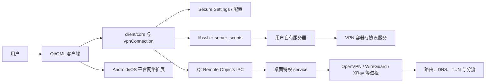
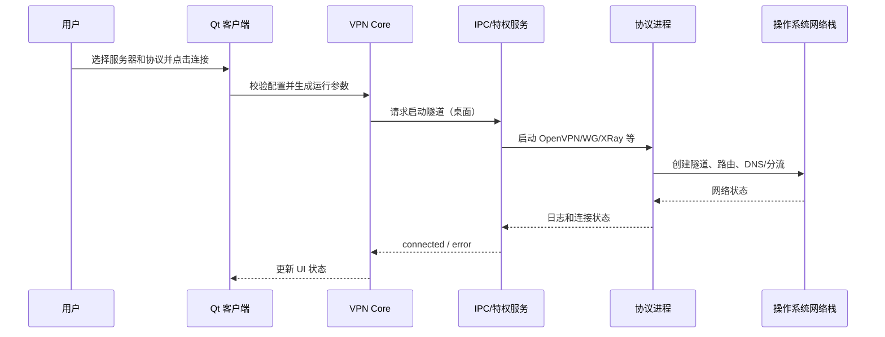
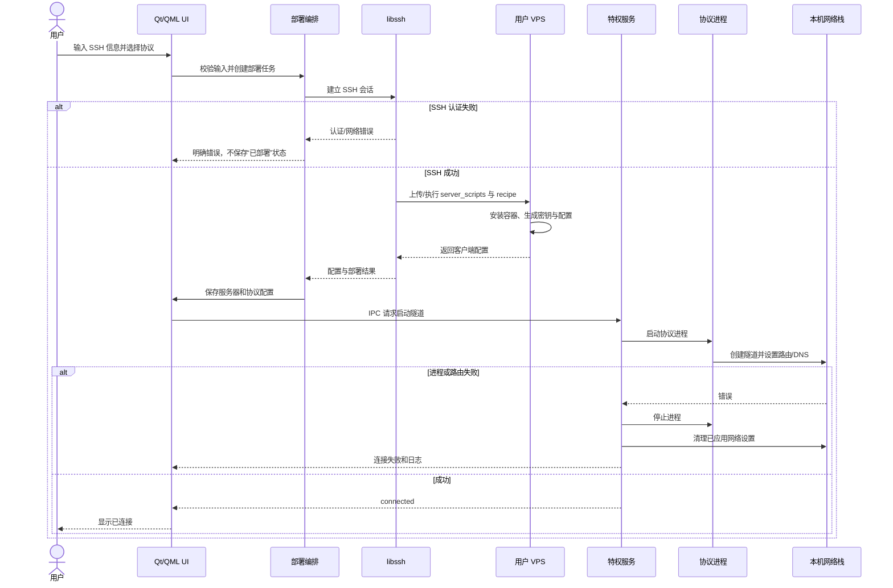

# amnezia-vpn/amnezia-client 项目深度解析

## 1. 项目概览

- 报告日期：2026-07-28
- 仓库地址：https://github.com/amnezia-vpn/amnezia-client
- Trending 原始排名：2
- Stars Today：515
- 项目定位：跨桌面与移动平台的自建 VPN 客户端，同时覆盖服务器部署、协议配置、连接控制和平台打包。
- 解决的问题：降低个人在自有服务器上安装、配置并使用多种 VPN/混淆协议的门槛。
- 目标用户：需要自建远程接入的个人、小团队，以及研究 Qt 跨平台网络客户端的开发者。
- 当前成熟度：成熟项目，但网络对抗、安全和平台特权操作要求持续维护。
- 推荐结论：值得研究其“普通 UI 进程 + 特权后台服务 + SSH 服务器部署”的分层；生产使用前必须评估凭据、安全更新与地区网络策略。

## 2. 系统架构

### 2.1 架构概览

顶层 CMake 同时构建 `client`，并在桌面平台构建 `service`。客户端基于 Qt/QML，负责用户配置、服务器管理、协议选择和状态展示；桌面特权服务承接需要管理员权限的隧道进程与系统网络操作；两者通过 `ipc/*.rep` 定义的 Qt Remote Objects 接口通信。首次自建服务器时，客户端通过 libssh 连接用户服务器，运行 `server_scripts`/`recipes` 安装和配置容器；连接阶段再把生成的配置交给本地平台隧道实现。

### 2.2 架构图

### 2.3 核心模块

| 模块 | 职责 | 代码位置 | 关键依赖 | 证据级别 |
|---|---|---|---|---|
| 应用入口 | 迁移、单实例、类型注册、字体与应用初始化 | `client/main.cpp`、`client/amneziaApplication.*` | Qt Core/GUI | High |
| 客户端核心 | 管理配置、服务器、协议、连接状态和 UI 模型 | `client/core/`、`client/vpnConnection.*` | Qt、OpenSSL、libssh | High |
| IPC 契约 | 定义客户端与服务进程远程方法和状态 | `ipc/ipc_interface.rep`、`ipc/ipc_process_interface.rep` | Qt Remote Objects | High |
| 桌面特权服务 | 启动/停止协议进程并执行系统级网络操作 | `service/src/`、`service/server/` | Qt、平台 API、协议二进制 | Medium |
| 服务器部署 | 通过 SSH 执行安装、配置和更新脚本 | `client/server_scripts/`、`recipes/` | libssh、Docker/容器 | High |
| 平台适配 | 处理 Windows/macOS/Linux/Android/iOS 差异 | `client/platforms/`、`client/android/`、`client/ios/` | 平台 VPN API | High |
| 构建与交付 | 多平台配置、依赖和安装包生成 | `CMakeLists.txt`、`cmake/`、`deploy/`、`conanfile.py` | CMake、Conan、Qt IFW | High |

### 2.4 数据与状态管理

客户端启动先执行 `Migrations::doMigrations()`，随后创建 `AmneziaApplication`。配置通过 Qt Settings 体系与 `secureQSettings.*` 管理；具体密钥保护强度取决于平台实现。服务器资料、协议配置和连接状态属于本地客户端状态；服务进程通过 IPC 回传进程状态与错误。仓库没有证据表明必须依赖中心业务数据库。

### 2.5 外部集成与协议

- SSH：首次部署和管理用户服务器。
- OpenVPN、WireGuard/AmneziaWG、IKEv2、XRay、Cloak、Shadowsocks：数据隧道或混淆协议。
- Qt Remote Objects：桌面客户端和特权服务 IPC。
- Docker/服务器脚本：在远端安装协议服务。
- 平台网络 API：Android/iOS Network Extension 与桌面路由/TUN 管理。

### 2.6 部署与运行形态

桌面构建通常包含 GUI 客户端和后台服务；移动构建通过各平台 VPN 能力运行。CMake 将 Linux、Windows、macOS、Android、iOS 和 WASM 分支显式区分，桌面平台才加入 `service` 子目录。服务器端由客户端经 SSH 部署到用户 VPS，不应误解为项目提供统一中心服务器。

## 3. 主线流程

### 3.1 核心流程图

### 3.2 关键步骤

1. `client/main.cpp` 完成迁移、单实例检查和 `app.init()`。
2. 用户选择本地已存在的服务器配置，客户端核心检查协议参数与平台能力。
3. 桌面端通过 Qt Remote Objects IPC 请求特权服务启动协议；移动端进入对应网络扩展路径。
4. 协议进程创建隧道，服务负责路由、DNS 和分流等系统操作。
5. 状态和日志经 IPC 回到客户端，UI 切换为 Connected 或错误提示。

### 3.3 异常与失败处理

- 第二个桌面实例启动：`isAnotherInstanceRunning()` 连接本地 Server，命中后延迟退出。
- 后台服务不可达或权限不足：IPC 请求失败，客户端不得假装连接成功。
- 协议进程退出：服务回传错误和日志，连接状态回滚。
- 路由/DNS 设置部分成功：需要停止协议并清理已修改系统状态；完整平台回滚实现未逐函数追踪。

## 4. 典型业务场景端到端执行链路

### 4.1 场景定义

| 项目 | 内容 |
|---|---|
| 场景名称 | 用户输入 VPS SSH 信息，自动部署 WireGuard 类协议并首次连接 |
| 参与者 | 用户、Qt 客户端、客户端部署核心、libssh、远端服务器、桌面特权服务、协议进程 |
| 前置条件 | 用户拥有可 SSH 登录的服务器；客户端已安装；服务器允许必要端口和容器运行环境 |
| 输入 | 服务器 IP、SSH 用户名和认证信息、所选协议（示意：AmneziaWG） |
| 期望结果 | 服务器完成协议安装，客户端保存配置，并建立可用 VPN 隧道 |
| 成功判定 | 客户端显示已连接，隧道接口存在，测试流量按配置经过 VPN；失败时可停止并恢复本机网络状态 |

### 4.2 端到端时序图

### 4.3 执行步骤追踪

| 步骤 | 输入 | 执行组件 | 关键代码位置 | 状态或数据变化 | 输出 | 失败分支 | 证据级别 |
|---:|---|---|---|---|---|---|---|
| 1 | SSH 与协议表单 | QML/UI + client core | `client/ui/`、`client/core/` | 建立临时部署参数 | 校验后的任务 | 缺字段、格式错误 | Medium |
| 2 | SSH 参数 | libssh 封装 | `client/core/`、`libssh` 依赖 | 建立远端会话 | 可执行会话 | 超时、认证失败、Host Key 风险 | High |
| 3 | 选择的协议 | 部署脚本/recipes | `client/server_scripts/`、`recipes/` | 远端安装容器与配置 | 客户端配置材料 | 包安装、端口或容器失败 | High |
| 4 | 返回配置 | 客户端配置层 | `secureQSettings.*`、core | 保存服务器和协议对象 | 可连接配置 | 写入失败时不得标记部署完成 | Medium |
| 5 | 连接请求 | IPC 契约 | `ipc/*.rep` | 后台任务从 idle 进入 starting | 启动命令 | service 不可达/权限不足 | High |
| 6 | 协议参数 | 特权 service | `service/src/` | 启动子进程并修改网络 | running/connected | 进程退出、路由/DNS 失败 | Medium |
| 7 | 状态与日志 | Qt Remote Objects | `ipc/`、`vpnConnection.*` | UI 状态更新 | 已连接或可诊断错误 | IPC 中断后应视为不确定/失败 | Medium |

### 4.4 关键状态与数据变化

- 远端：从空服务器或旧版本，变为包含协议容器、密钥和端口配置的 VPN 节点。
- 本地：新增服务器条目与协议配置；连接时产生运行态，不应把“配置存在”混同于“隧道已连通”。
- 系统网络：连接阶段增加 TUN/路由/DNS/分流规则；断开或失败时需要清理。

### 4.5 失败传播、重试与回滚

SSH 失败应停留在部署前状态；远端脚本部分失败时需要读取脚本输出并避免保存完整配置。连接阶段若协议启动后路由配置失败，后台服务应停止进程并清理系统规则。仓库证明存在 client/service/IPC 分层，但本报告没有逐平台验证所有清理路径，因此回滚完整性属于 Medium 证据。

### 4.6 最终业务结果

用户最终获得一份与自有 VPS 对应的本地配置，以及一条由本机平台隧道连接到远端协议容器的 VPN 通道；控制面主要发生在客户端和 SSH 部署阶段，数据面由协议进程承担。

### 4.7 最小复现与验证方法

1. 在隔离测试 VPS 上准备非生产账号与快照。
2. 按官方构建说明编译 Debug 客户端，开启日志。
3. 使用测试协议执行部署，记录 SSH 输出、远端容器和生成配置。
4. 首次连接后检查隧道接口、路由和 DNS；故意关闭协议端口，验证客户端错误状态和本机清理。
5. 不要用真实生产 SSH 凭据进行首次源码验证。

## 5. 技术栈

| 层次 | 技术 | 用途 | 是否核心 | 证据位置 |
|---|---|---|---|---|
| 语言与运行时 | C++17 | 客户端、服务与协议编排 | 是 | 顶层 `CMakeLists.txt` |
| UI | Qt 6 / QML | 跨平台界面与应用生命周期 | 是 | `client/ui/`、README |
| IPC | Qt Remote Objects | GUI 与桌面特权服务通信 | 是（桌面） | `ipc/*.rep` |
| 远端管理 | libssh | 自动部署与服务器管理 | 是（自建流程） | `client/main.cpp`、README |
| 隧道 | OpenVPN、WireGuard、IKEv2、XRay 等 | 数据通道和混淆 | 是 | README、`client/core/` |
| 构建 | CMake、Conan | 多平台依赖和打包 | 是 | `CMakeLists.txt`、`conanfile.py` |
| 部署 | 脚本 + 容器 | 在用户 VPS 安装协议服务 | 是（自建流程） | `server_scripts/`、`recipes/` |

## 6. 创新点

### 创新点 1

- 类型：工程整合创新
- 传统方案：用户手工登录 VPS、安装服务、生成配置，再导入独立客户端。
- 当前方案：客户端通过 SSH 执行协议 recipe，将部署、配置与连接收进同一流程。
- 实际收益：显著降低自建多协议 VPN 的操作门槛。
- 证据：README 的“一键输入 IP/SSH 后自动安装容器”和 `server_scripts/recipes`。
- 局限：客户端持有高价值凭据，远端系统差异和网络审查策略仍可能导致失败。

### 创新点 2

- 类型：架构与跨平台整合
- 传统方案：每个平台各写一套客户端与权限逻辑。
- 当前方案：Qt/C++ 共享核心，桌面通过 service/IPC 隔离特权操作，移动端走平台适配。
- 实际收益：共享产品逻辑的同时保留平台网络能力。
- 证据：顶层 CMake 平台分支、`client/platforms`、`service`、`ipc`。
- 局限：平台差异仍使测试矩阵和回滚逻辑复杂。

## 7. 应用场景

### 适合

- 个人或小团队在自有 VPS 上部署远程接入。
- 需要多协议、分流和混淆组合的测试与研究。
- Qt/C++ 跨平台网络客户端架构学习。

### 可以尝试

- 小规模组织内部 VPN，但需独立密钥管理、更新和审计方案。
- 高限制网络环境，需要针对当地网络持续测试协议组合。

### 暂不建议

- 没有安全维护能力却承担关键生产业务。
- 需要合规认证、集中审计和 SLA 的大型企业，除非另建治理层。

## 8. 第一次阅读与验证建议

1. 先读 README 的 Features、Tech 与 Build Requirements。
2. 再看顶层 `CMakeLists.txt`、`client/main.cpp` 和 `ipc/*.rep`，理解进程边界。
3. 顺着 `client/vpnConnection.*`、`client/core/` 到 `service/src/` 追连接链。
4. 在隔离 VPS 上复现单一协议部署，再故意制造 SSH、协议进程和路由失败。

## 9. 风险与限制

- 安全：SSH 凭据、特权服务、协议二进制和更新供应链均是高价值边界。
- 性能：取决于协议、加密、服务器带宽和网络路径，未独立压测。
- 许可证：GPL-3.0，且包含第三方组件的各自许可。
- 维护状态：活跃且跨平台，但 Issue/PR 数量较大。
- 生产可用性：个人和小团队可用性较成熟；企业治理能力需额外建设。

## 10. Evidence Notes

- `CMakeLists.txt`：C++17、Qt 平台分支、client/service 构建边界。
- `client/main.cpp`：迁移、单实例、libssh 生命周期、类型注册与初始化。
- `ipc/`：Qt Remote Objects 接口定义和服务进程 IPC 文件。
- README：SSH 自动部署、协议矩阵、分流、多平台和 GPL-3.0。
- 目录树：`client/core`、`client/server_scripts`、`recipes`、`service/src`、`deploy`。

## 11. Honest Caveat

本报告是静态源码与官方文档分析，没有实际使用各平台客户端、没有审计凭据存储和协议实现，也没有验证所有平台在半失败状态下能否完整恢复路由/DNS。服务内部函数级调用链未全部追踪，因此某些平台步骤以模块级证据描述。

## 12. 可信度

- Architecture Confidence: High
- Flow Confidence: Medium
- Innovation Confidence: Medium
