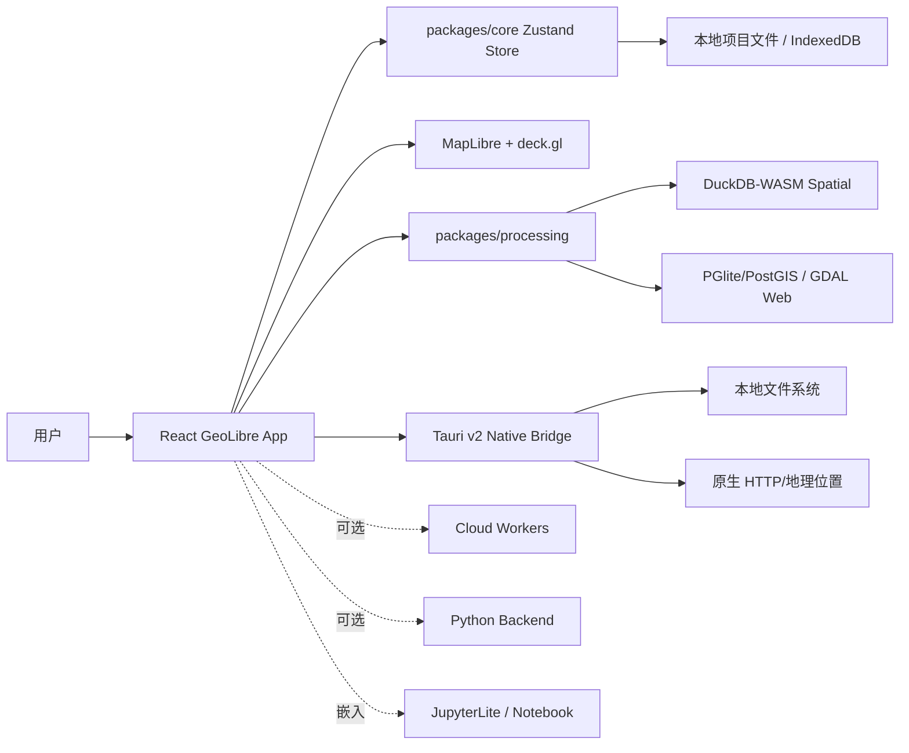
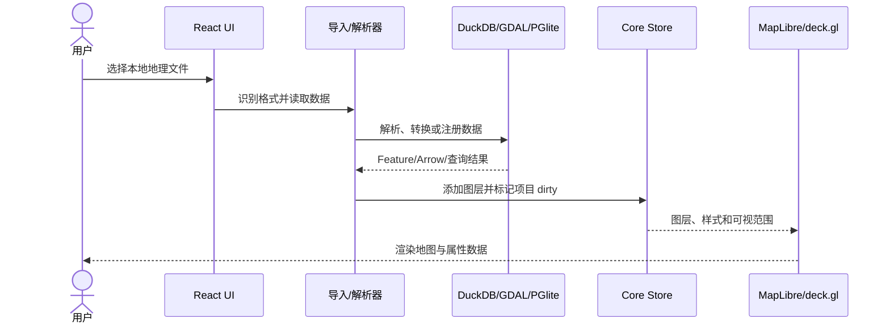
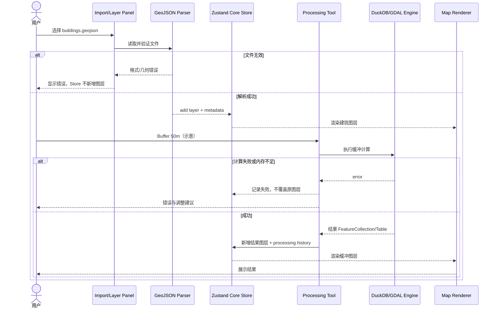

# opengeos/GeoLibre 项目深度解析

## 1. 项目概览

- 报告日期：2026-07-28
- 仓库地址：https://github.com/opengeos/GeoLibre
- Trending 原始排名：4
- Stars Today：420
- 项目定位：本地优先、跨 Web/桌面/移动/Jupyter 的 GIS 可视化与空间分析工作台。
- 解决的问题：让用户无需部署传统重型 GIS 服务器，也能导入、查询、处理和展示多种空间数据。
- 目标用户：地理数据分析师、教学与研究人员、需要轻量 GIS 能力的 Web/桌面应用团队。
- 当前成熟度：快速演进的早期生产候选，功能面广，仍需按数据规模验证。
- 推荐结论：值得研究其“共享前端工作区 + WASM 本地计算 + Tauri 原生桥接 + 可选 Worker/Backend”的多运行时架构。

## 2. 系统架构

### 2.1 架构概览

GeoLibre 是 npm workspace Monorepo，`apps/geolibre-desktop` 同时承载 Web/PWA 与 Tauri 桌面外壳；`packages/core` 管理项目、图层、视图、处理历史与 Undo/Redo，`packages/map`、`processing`、`plugins`、`ui` 提供领域能力。浏览器侧主要使用 MapLibre/deck.gl 渲染，DuckDB-WASM Spatial、PGlite/PostGIS、GDAL3.js 等执行本地数据处理。桌面版通过 Tauri 插件获得本地文件、HTTP 和地理位置能力；`workers/` 与 `backend/geolibre_server` 是分享、协作、瓦片或代理等可选服务路径，并非本地单机运行的强制依赖。

### 2.2 架构图

### 2.3 核心模块

| 模块 | 职责 | 代码位置 | 关键依赖 | 证据级别 |
|---|---|---|---|---|
| 应用入口 | 初始化诊断、国际化、PWA、Tauri 分支并挂载 React | `apps/geolibre-desktop/src/main.tsx` | React、Vite、PWA、Tauri API | High |
| 项目状态 | 图层、地图视图、项目偏好、处理历史、Dashboard、协作和 Undo/Redo | `packages/core/src/store.ts` | Zustand、zundo | High |
| 地图渲染 | 二维/三维图层、底图、交互与专题可视化 | `packages/map/`、桌面组件 | MapLibre GL JS、deck.gl、Cesium | High |
| 空间处理 | 矢量、栅格、网络与统计工具 | `packages/processing/` | DuckDB-WASM、GDAL3.js、Arrow | High |
| UI/插件 | 面板、对话框、插件注册和通用组件 | `packages/ui/`、`packages/plugins/` | React、Tailwind、Zod | High |
| 原生桥接 | 桌面文件、HTTP、Geolocation 与安装包 | `apps/geolibre-desktop/src-tauri/` | Rust、Tauri v2 | High |
| 可选服务 | 协作、分享、瓦片与 AI 代理 | `workers/`、`backend/geolibre_server/` | Cloudflare Workers、Python | Medium |

### 2.4 数据与状态管理

`packages/core/src/store.ts` 定义 `AppState`：项目名与路径、dirty 状态、地图视图、图层、图层组、处理模型与历史、Dashboard、故事地图、选择集和协作状态。`zundo` 管理时间旅行历史，同时明确排除 GPS、协作等临时状态。项目级样式写入 `.geolibre.json`，应用级样式库可保存在 IndexedDB。图层数据可能直接位于内存、浏览器存储、本地文件或 DuckDB/PGlite 引擎中，具体取决于导入类型与运行模式。

### 2.5 外部集成与协议

- 本地格式与引擎：GeoJSON、Shapefile、GeoParquet、FlatGeobuf、PMTiles、COG、DuckDB Spatial、GDAL。
- 地图生态：MapLibre、deck.gl、Cesium、多类公开地图服务。
- 桌面：Tauri 文件、HTTP、Opener 与 Geolocation 插件。
- 可选云能力：分享、协作、瓦片与 AI Proxy Worker。
- Notebook：构建 JupyterLite/嵌入版本。

### 2.6 部署与运行形态

同一 React 工作区可构建 Web/PWA、Tauri 桌面和移动版；Jupyter 构建由独立脚本生成。Web 模式尽量把计算放在客户端；桌面模式增加本地文件与原生 HTTP。Docker/Python backend/Workers 用于特定服务，不应在架构图中被误写为每次加载都经过的中心后端。

## 3. 主线流程

### 3.1 核心流程图

### 3.2 关键步骤

1. `main.tsx` 根据 Web/Tauri 环境安装不同的 HTTP 与恢复策略，再挂载应用。
2. 用户从文件、URL 或数据服务触发导入，前端选择对应解析器。
3. 大型或空间查询数据进入 DuckDB-WASM/PGlite/GDAL 能力，小型矢量可进入内存 FeatureCollection。
4. 导入结果写入核心 store，形成 `GeoLibreLayer`、样式与元数据。
5. MapLibre/deck.gl 根据图层类型渲染；项目 dirty、Undo/Redo 与处理历史同步更新。

### 3.3 异常与失败处理

- PWA 更新不强制立即刷新，避免丢失地图状态；仅在懒加载 chunk 失效时按需恢复。
- Tauri 原生 HTTP 安装失败时记录错误并退回浏览器 fetch，可能继续受 CORS 限制。
- 文件格式或几何无效时，应保留原项目并返回解析错误；处理工具提供 validity/fix 类工具，但不能自动保证所有数据可修复。
- 大数据内存不足时，Web 进程可能失败，需改用桌面原生或减少数据。

## 4. 典型业务场景端到端执行链路

### 4.1 场景定义

| 项目 | 内容 |
|---|---|
| 场景名称 | 用户导入一份本地建筑 GeoJSON，执行缓冲区分析并以新图层显示 |
| 参与者 | 用户、React UI、格式解析器、Core Store、Processing、DuckDB/GDAL 路径、MapLibre |
| 前置条件 | 浏览器或桌面版已启动；输入文件是可解析的 GeoJSON；设备内存足够 |
| 输入 | 示例文件 `buildings.geojson`，缓冲距离 50 米（示意参数） |
| 期望结果 | 原始建筑图层与缓冲结果图层同时出现，处理历史可追踪，项目标记为已修改 |
| 成功判定 | 两个图层可渲染；结果要素数量和坐标系符合预期；失败不会破坏原始图层 |

### 4.2 端到端时序图

### 4.3 执行步骤追踪

| 步骤 | 输入 | 执行组件 | 关键代码位置 | 状态或数据变化 | 输出 | 失败分支 | 证据级别 |
|---:|---|---|---|---|---|---|---|
| 1 | 本地文件 | 导入 UI | `apps/geolibre-desktop/src/components/` | 尚不修改项目 | 文件句柄/字节 | 用户取消或读取失败 | Medium |
| 2 | GeoJSON 字节 | 解析与核心类型 | `packages/core/`、导入组件 | 构造图层候选 | FeatureCollection | JSON/几何/编码错误 | Medium |
| 3 | 图层对象 | Core Store | `packages/core/src/store.ts` | `layers` 增加、`isDirty=true`、Undo 历史变化 | 可渲染图层 | 大数据造成内存压力 | High |
| 4 | 图层与样式 | Map 包 | `packages/map/` | 地图 Source/Layer 更新 | 建筑图层 | 样式或坐标系不兼容 | High |
| 5 | 50m 缓冲参数 | Processing | `packages/processing/` | 创建处理运行记录 | 空间查询/任务 | 参数或 CRS 不适合 | High |
| 6 | 要素与参数 | DuckDB/GDAL 等 | Processing 适配层 | 生成新几何结果 | 结果表/FeatureCollection | WASM 内存、几何异常 | Medium |
| 7 | 结果 | Store + Map | `store.ts`、Map 包 | 新图层与 processingHistory 增加 | 可视化缓冲结果 | 写入失败则保留原图层 | High |

### 4.4 关键状态与数据变化

- 导入前：`layers` 无建筑图层，项目可能为 clean。
- 导入后：新增原始图层，项目 `isDirty`，地图视图可按范围调整。
- 处理成功：新增独立结果图层，并追加 processing history；原始图层保持不变。
- 处理失败：只记录错误或失败运行，不应生成半成品图层。

### 4.5 失败传播、重试与回滚

解析失败发生在写 Store 前，因此最安全的回滚是“不产生状态变化”。空间计算失败时保留输入图层，用户可降低数据量、修复几何或切换桌面版重试。Store 的 Undo/Redo 由 zundo 管理，但大型图层历史会受大小限制；不能假设所有数据操作都能无限回滚。

### 4.6 最终业务结果

用户在同一项目中保留原始建筑数据和派生缓冲图层，可继续设置样式、查询属性、保存项目或导出结果；计算主要发生在本地设备。

### 4.7 最小复现与验证方法

1. 启动 `npm run dev`，准备小型合法 GeoJSON 测试文件。
2. 导入后检查图层数、范围、属性表和项目 dirty 状态。
3. 运行 Buffer，记录结果数量和 processing history。
4. 使用损坏 GeoJSON 验证失败前 Store 不新增图层。
5. 逐步扩大文件，观察浏览器内存上限；再用 Tauri 构建对比。

## 5. 技术栈

| 层次 | 技术 | 用途 | 是否核心 | 证据位置 |
|---|---|---|---|---|
| 前端 | React 19、TypeScript、Vite | 多平台共享 UI | 是 | `apps/geolibre-desktop/package.json` |
| 状态 | Zustand、zundo | 项目状态和 Undo/Redo | 是 | `packages/core/src/store.ts` |
| 地图 | MapLibre、deck.gl、Cesium | 2D/3D 可视化 | 是 | app dependencies |
| 本地分析 | DuckDB-WASM Spatial、PGlite/PostGIS、GDAL3.js | 空间查询与格式处理 | 是 | app dependencies |
| 桌面 | Tauri v2、Rust | 本地文件与原生能力 | 桌面核心 | `src-tauri/` |
| 可选服务 | Workers、Python backend | 分享、协作、瓦片/代理 | 否 | root workspaces 与目录 |
| 测试 | Node Test、Pytest、Playwright、Cargo Check | 前端/后端/Worker/E2E 验证 | 是 | root scripts |

## 6. 创新点

### 创新点 1
- 类型：架构与工程整合创新
- 传统方案：Web GIS 依赖中心服务器处理数据，桌面 GIS 另有独立代码栈。
- 当前方案：同一 React/TypeScript 工作区运行于 Web、Tauri、移动和 Jupyter，本地用 WASM/嵌入式数据库处理数据。
- 实际收益：共享交互与领域逻辑，敏感数据可留在用户设备。
- 证据：README、多工作区脚本、Tauri 分支、DuckDB/PGlite 依赖。
- 局限：浏览器资源上限与多平台兼容矩阵扩大测试成本。

### 创新点 2
- 类型：状态工程创新
- 传统方案：地图视图、图层与分析工具各自维护状态，难以保存和回滚。
- 当前方案：核心 Store 统一项目、图层、处理历史、Dashboard、协作和局部临时状态，并明确序列化边界。
- 实际收益：项目保存、Undo/Redo 和多界面共享状态更清楚。
- 证据：`packages/core/src/store.ts` 的 AppState 和注释。
- 局限：统一 Store 规模很大，长期可能需要更严格的模块边界。

## 7. 应用场景

### 适合
- 教学、研究和中小数据集的本地空间探索。
- 需要 Web 与桌面共用代码的 GIS 产品。
- 敏感数据不希望默认上传服务器的可视化任务。

### 可以尝试
- 协作分享、AI 辅助和在线瓦片服务，但需独立部署与权限评估。
- 中大型数据集，需压测浏览器与桌面模式。

### 暂不建议
- 未压测就替代成熟企业 GIS 的超大数据生产流程。
- 把所有 Worker/Backend 能力视作默认稳定的统一云平台。

## 8. 第一次阅读与验证建议

1. 先读 README 和根 `package.json`，理解运行形态与测试矩阵。
2. 看 `main.tsx` 的 Web/Tauri/PWA 分支。
3. 看 `packages/core/src/store.ts`，理解项目事实基线。
4. 顺着一个 Processing 工具追到 DuckDB/GDAL，并用小数据验证。

## 9. 风险与限制

- 安全：本地文件、分享链接、可选 AI 代理和外部地图服务需要权限与数据边界。
- 性能：WASM、WebView 与设备内存限制是主要风险。
- 许可证：MIT；第三方地图和数据源仍有各自许可。
- 维护状态：提交活跃、功能面迅速扩张。
- 生产可用性：轻量本地流程可评估；复杂协作和大数据需专项验证。

## 10. Evidence Notes

- README：Tauri/React/MapLibre/DuckDB/deck.gl 与多平台声明。
- 根 `package.json`：apps/packages/workers、前后端/Worker/E2E/Rust 测试。
- app `package.json`：完整地图、空间引擎与 Tauri 依赖。
- `main.tsx`：诊断、PWA 更新、Tauri 原生 HTTP 和错误边界。
- `store.ts`：项目、图层、处理历史、协作和持久化边界。

## 11. Honest Caveat

本报告没有运行实际大型 GIS 数据、没有验证每种格式和处理工具，也没有逐文件追踪导入组件到所有引擎的分派。典型场景中的 50 米参数为示意。可选 Workers/Backend 的完整生产部署和鉴权未纳入本次分析。

## 12. 可信度

- Architecture Confidence: High
- Flow Confidence: Medium
- Innovation Confidence: Medium
