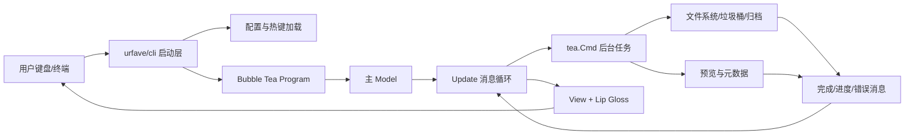
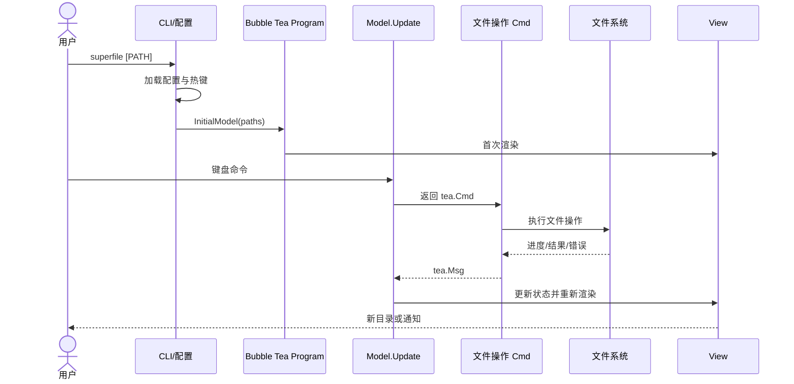
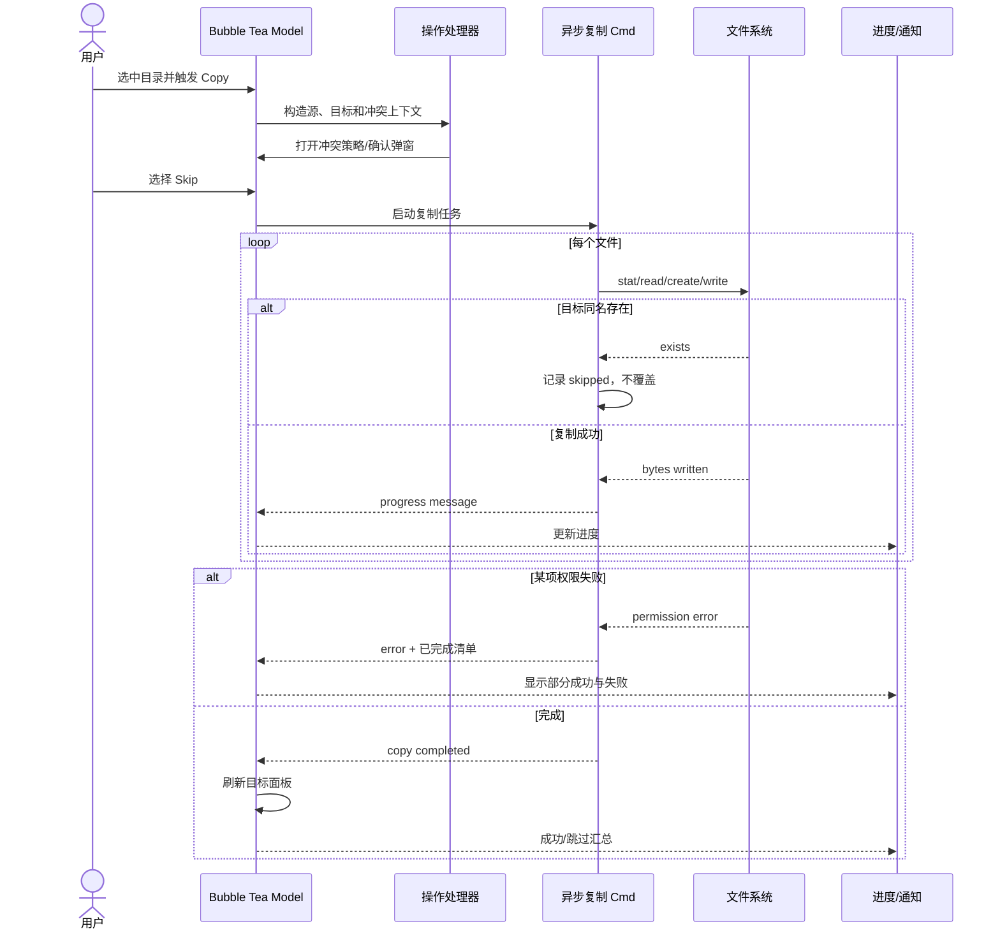

# yorukot/superfile 项目深度解析

## 1. 项目概览

- 报告日期：2026-07-28
- 仓库地址：https://github.com/yorukot/superfile
- Trending 原始排名：5
- Stars Today：600
- 项目定位：基于 Bubble Tea 的跨平台终端文件管理器。
- 解决的问题：让终端用户在不离开键盘工作流的情况下完成多面板浏览、预览、搜索与文件副作用操作。
- 目标用户：终端重度用户、远程服务器运维人员、希望学习大型 TUI 状态架构的 Go 开发者。
- 当前成熟度：活跃的生产可用工具，但文件副作用和跨平台差异必须谨慎处理。
- 推荐结论：值得研究其 CLI 启动层、Bubble Tea Model/Update/View 循环与文件操作后台任务的分离。

## 2. 系统架构

### 2.1 架构概览

根 `main.go` 嵌入默认配置并调用 `src/cmd.Run`。CLI 层使用 urfave/cli 解析参数、创建配置目录和文件，然后通过 `tea.NewProgram(internal.InitialModel(...))` 启动 Bubble Tea。`src/internal` 保存主 Model、消息类型、渲染、键位处理、文件操作、垃圾桶和预览等逻辑；耗时或有副作用的操作被包装为 Bubble Tea Command，在后台执行后向 Update 循环返回消息。`src/config` 管理变量与路径，`src/pkg` 提供工具和可复用能力。

### 2.2 架构图

### 2.3 核心模块

| 模块 | 职责 | 代码位置 | 关键依赖 | 证据级别 |
|---|---|---|---|---|
| 根入口 | 嵌入默认配置并启动命令层 | `main.go` | Go embed | High |
| CLI 与初始化 | 参数、配置文件、首次使用和 Bubble Tea Program | `src/cmd/main.go` | urfave/cli、Bubble Tea | High |
| 主状态模型 | 面板、焦点、选择、弹窗、操作状态 | `src/internal/model.go` | Bubble Tea | High |
| 消息与更新 | 键盘、窗口、后台任务和错误消息分发 | `src/internal/model_msg.go`、`model_update.go`/相关文件 | tea.Msg | High |
| 文件操作 | 复制、移动、删除、垃圾桶、覆盖和冲突处理 | `src/internal/file_operations.go`、`handle_file_operations.go` | os、afero/平台 API | Medium |
| UI 渲染 | 面板、状态栏、预览和弹窗 | `src/internal/model_render.go`、`ui/` | Lip Gloss、Bubbles | High |
| 预览与搜索 | 文件高亮、图片/元数据、fzf 和 zoxide | `src/internal/`、`src/pkg/` | Chroma、fzf-lib、Exiftool | Medium |
| 配置 | TOML、路径、主题与热键 | `src/config/`、`src/internal/common` | XDG、TOML | High |

### 2.4 数据与状态管理

运行态主要在内存 Model 中：当前路径、面板列表、焦点、选中项、剪贴板/操作队列、弹窗和通知。持久状态主要是配置、热键、主题、首次使用标记、更新检查时间、最后目录与垃圾桶数据。`cmd.InitConfigFile()` 创建 XDG/平台目录与缺失文件，默认配置只在不存在时写入。项目没有中心数据库或消息队列。

### 2.5 外部集成与协议

- 本地文件系统与平台垃圾桶语义。
- 终端输入输出与 ANSI 样式。
- Exiftool、图像解码、语法高亮和多种归档格式。
- 系统剪贴板、zoxide 和 Shell `cd_on_quit` 集成。
- 可选更新检查通过 HTTP 查询发布信息。

### 2.6 部署与运行形态

单进程本地 CLI/TUI 应用，可通过脚本、Winget、Scoop、包管理器或源码构建安装。Go 二进制跨平台分发，但部分预览、权限、垃圾桶和文件系统行为依赖宿主平台与外部工具。

## 3. 主线流程

### 3.1 核心流程图

### 3.2 关键步骤

1. `main.go` 提供内嵌默认配置，进入 `cmd.Run`。
2. `cmd.Run` 设置日志、加载默认变量和 CLI 命令；`spfAppAction` 确定起始路径。
3. `InitConfigFile` 创建配置、数据、状态和主题目录。
4. `internal.InitialModel` 构建面板与初始状态，Bubble Tea Program 进入事件循环。
5. 键盘事件在 Update 中转成同步状态变化或异步 `tea.Cmd`。
6. 文件系统结果以消息回到 Model，View 重新渲染。

### 3.3 异常与失败处理

启动配置目录创建失败会直接退出；Bubble Tea Program 错误也会打印并退出。文件操作应通过错误消息返回 UI，避免后台 goroutine 直接修改 Model。复制/移动冲突需要确认覆盖或改名；删除需区分垃圾桶与永久删除。跨设备移动可能退化为复制再删除，不能假设原子性。

## 4. 典型业务场景端到端执行链路

### 4.1 场景定义

| 项目 | 内容 |
|---|---|
| 场景名称 | 用户从左侧面板复制一个目录到右侧面板，目标存在同名文件时选择跳过冲突项 |
| 参与者 | 用户、主 Model、键位处理、文件操作 Cmd、本地文件系统、通知/进度 UI |
| 前置条件 | 两个面板目录均可访问；源目录可读；目标目录可写 |
| 输入 | 源目录 `/data/photos`、目标 `/backup`（示意路径），冲突策略为 Skip |
| 期望结果 | 非冲突文件复制成功，冲突项保持原样，UI 显示汇总结果 |
| 成功判定 | 目标新增应复制的文件；源未改变；错误与跳过数量可见；界面没有冻结 |

### 4.2 端到端时序图

### 4.3 执行步骤追踪

| 步骤 | 输入 | 执行组件 | 关键代码位置 | 状态或数据变化 | 输出 | 失败分支 | 证据级别 |
|---:|---|---|---|---|---|---|---|
| 1 | 当前选中项 | Model/键位函数 | `src/internal/model.go`、`key_function*.go` | 记录操作源 | Copy 意图 | 无选择或不可读 | Medium |
| 2 | 源和目标 | 操作处理器 | `handle_file_operations.go` | 建立操作上下文 | 冲突检查 | 目标不可写 | Medium |
| 3 | 同名项 | 冲突弹窗/Model | internal UI 状态 | 冲突策略设为 Skip | 用户决策 | 用户取消则不产生副作用 | Medium |
| 4 | 文件清单 | `tea.Cmd` 文件操作 | `file_operations.go` | 后台复制，Model 不被直接并发修改 | 进度消息 | 权限、空间、符号链接错误 | Medium |
| 5 | 每项结果 | Bubble Tea Msg | `model_msg.go`/Update | 进度、错误、跳过计数变化 | UI 状态 | 消息丢失需以最终目录刷新校验 | Medium |
| 6 | 完成消息 | Model + 面板刷新 | internal model/render | 目标目录重新扫描 | 汇总和新列表 | 部分成功明确显示 | Medium |

### 4.4 关键状态与数据变化

- 操作前：Model 保存源选择与左右面板路径。
- 确认后：创建后台操作状态，UI 可显示忙碌/进度。
- 执行中：目标文件逐步增加；源目录保持不变。
- 完成后：目标面板重新读取，操作状态清空，通知记录成功、跳过和错误。

### 4.5 失败传播、重试与回滚

文件复制通常不是整体事务。中途权限或磁盘空间失败时，已复制文件可能保留，后续项是否继续取决于具体处理器策略。安全的行为是向用户呈现部分成功清单，不声称整体回滚。用户可修复权限或空间后再次执行；Skip 策略让重复执行更接近幂等，但内容变化仍需核验。

### 4.6 最终业务结果

目标目录包含全部可复制且不冲突的文件；同名目标未被覆盖；源目录不变；用户获得明确的成功、跳过与失败汇总。

### 4.7 最小复现与验证方法

1. 在临时目录创建 `src/a.txt`、`src/b.txt` 和 `dst/a.txt`。
2. 启动 `superfile` 并打开源、目标两个面板。
3. 复制源目录，选择 Skip 冲突。
4. 验证 `dst/a.txt` 未变、`dst/b.txt` 新增。
5. 将目标设为只读再重试，确认 UI 显示失败且终端没有卡死。

## 5. 技术栈

| 层次 | 技术 | 用途 | 是否核心 | 证据位置 |
|---|---|---|---|---|
| 语言 | Go 1.26 | 单二进制与并发文件任务 | 是 | `go.mod` |
| TUI | Bubble Tea v2 | Model/Update/View 事件循环 | 是 | `cmd/main.go`、go.mod |
| 组件/样式 | Bubbles、Lip Gloss | 输入、列表、弹窗和终端样式 | 是 | `go.mod` |
| CLI | urfave/cli v3 | 参数和子命令 | 是 | `src/cmd/main.go` |
| 搜索 | fzf-lib、zoxide | 模糊定位和目录跳转 | 否 | `go.mod` |
| 预览 | Chroma、Exiftool、图像库 | 代码和媒体预览 | 否 | `go.mod` |
| 归档 | xtractr 与压缩库 | 多格式解压/压缩 | 否 | `go.mod` |
| 配置 | XDG、TOML | 路径、热键、主题与状态 | 是 | cmd/config |

## 6. 创新点

### 创新点 1
- 类型：开发体验与工程整合创新
- 传统方案：在 Shell 中组合 `ls/cp/mv/rm/fzf`，状态和预览分散。
- 当前方案：把多面板、搜索、预览和操作反馈统一进 Bubble Tea 状态循环。
- 实际收益：键盘工作流连续，远程终端也可使用。
- 证据：CLI 启动、InitialModel、Bubble Tea 依赖和 internal 模块。
- 局限：TUI 抽象无法消除文件系统本身的非事务性和平台差异。

### 创新点 2
- 类型：架构实践
- 传统方案：文件操作直接阻塞 UI 或由 goroutine 随意改共享状态。
- 当前方案：副作用包装为 `tea.Cmd`，结果通过消息进入单一 Update 循环。
- 实际收益：降低 UI 卡顿和并发状态竞争。
- 证据：Bubble Tea Program 和文件操作/消息模块分离。
- 局限：大型复制的取消、恢复和部分失败仍需细致实现。

## 7. 应用场景

### 适合
- 本地与 SSH 终端的日常文件管理。
- 需要预览、搜索和多面板操作但不想启动 GUI 的用户。
- Go TUI 架构学习。

### 可以尝试
- 大目录和多归档格式任务，先验证性能与外部工具依赖。
- 受控运维环境，配合权限最小化和备份。

### 暂不建议
- 没有备份时批量执行永久删除或覆盖。
- 把跨设备移动当作原子事务。

## 8. 第一次阅读与验证建议

1. 从根 `main.go` 和 `src/cmd/main.go` 看启动链。
2. 阅读 `InitialModel`、Model/Msg/Render 文件，画出状态边界。
3. 选复制或删除一条操作，追到文件副作用和完成消息。
4. 用临时目录测试冲突、权限、符号链接和磁盘不足。

## 9. 风险与限制

- 安全：永久删除、覆盖和插件/外部命令需要明确确认与最小权限。
- 性能：超大目录、预览和归档会增加 CPU、内存和 IO 压力。
- 许可证：MIT；外部工具和依赖另有许可。
- 维护状态：活跃，依赖版本较新。
- 生产可用性：个人工具成熟度较高；关键运维环境需审慎配置。

## 10. Evidence Notes

- 根 `main.go`：嵌入默认配置并调用 `cmd.Run`。
- `src/cmd/main.go`：配置初始化、CLI 参数、`tea.NewProgram(InitialModel)`。
- `go.mod`：Bubble Tea、Lip Gloss、fzf、Exiftool、归档与图像依赖。
- 仓库目录：`src/cmd`、`config`、`internal`、`pkg` 与 testsuite。

## 11. Honest Caveat

本报告未逐函数读取全部文件操作实现，冲突弹窗、取消和部分失败策略以模块级结构和 TUI 通用执行模式描述。示例路径均为示意。未实际验证 Windows、macOS、Linux 在垃圾桶、ACL、符号链接和跨盘移动上的所有差异。

## 12. 可信度

- Architecture Confidence: High
- Flow Confidence: Medium
- Innovation Confidence: Medium
