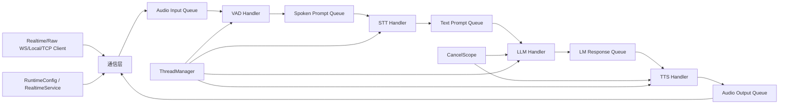
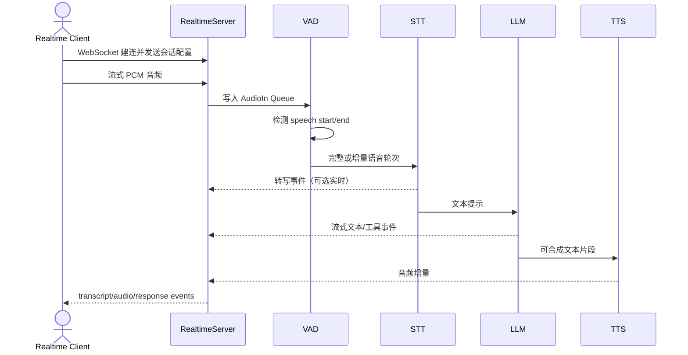
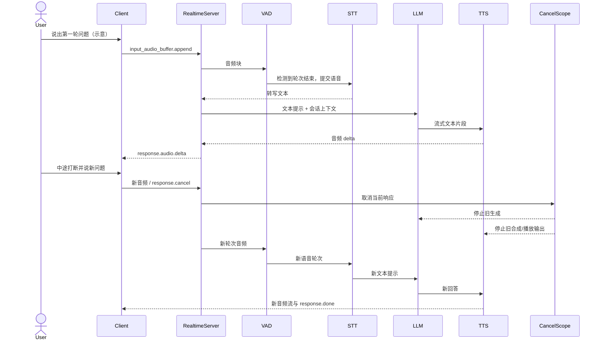

# huggingface/speech-to-speech 项目深度解析

## 1. 项目概览

- 报告日期：2026-07-29
- 仓库地址：https://github.com/huggingface/speech-to-speech
- Trending 原始排名：6
- Stars Today：227
- 项目定位：低延迟、全模块化的开源语音 Agent 管线，并提供 OpenAI Realtime 兼容 WebSocket API。
- 解决的问题：把语音活动检测、语音识别、语言模型和语音合成组织成可替换、可流式运行的后端。
- 目标用户：机器人与语音应用团队、开源模型工程师、需要自托管 Realtime API 的开发者。
- 当前成熟度：公开可用并持续演进；README 声明用于 Reachy Mini 对话后端，但不同硬件与模型组合仍需实测。
- 推荐结论：值得研究。项目把语音管线、通信模式、队列、取消作用域和后端选择都落到清晰源码中。

## 2. 系统架构

### 2.1 架构概览

系统核心是一条 VAD → STT → LLM → TTS 级联管线。每个阶段运行在独立线程中，通过显式 `Queue` 传递音频、转写文本、模型输出与合成音频。入口 `s2s_pipeline.py` 根据 `mode` 选择本地音频、原始 WebSocket、TCP Socket 或 OpenAI Realtime 兼容服务器；根据参数选择不同 STT、LLM、TTS handler。Realtime 模式可创建多个 `PipelineUnit` 组成池，每个单元持有自己的队列、Service、CancelScope、事件与 handlers。

### 2.2 架构图

### 2.3 核心模块

| 模块 | 职责 | 代码位置 | 关键依赖 | 证据级别 |
|---|---|---|---|---|
| CLI/管线装配 | 参数解析、模式选择、队列创建、handler 组装 | `src/speech_to_speech/s2s_pipeline.py` | HfArgumentParser, Queue, ThreadManager | High |
| Realtime Server | 提供 `/v1/realtime` 兼容协议、连接与 pipeline pool | `src/speech_to_speech/api/openai_realtime/server.py` | WebSocket, RuntimeConfig, PipelineUnit | High |
| VAD | 检测语音开始/结束与轮次边界 | `src/speech_to_speech/VAD/` | Silero VAD 等 | High |
| STT | 把音频轮次转成文本，支持多个后端 | `src/speech_to_speech/STT/` | Parakeet, Whisper, Faster Whisper, MLX 等 | High |
| LLM | 流式生成文本与工具调用 | `src/speech_to_speech/LLM/` | OpenAI-compatible API, Transformers, MLX | High |
| TTS | 把模型文本转成流式音频 | `src/speech_to_speech/TTS/` | Qwen3-TTS, Kokoro, Pocket TTS 等 | High |
| Pipeline queues/types | 定义各阶段输入输出项与队列边界 | `src/speech_to_speech/pipeline/queue_types.py`、`handler_types.py` | Python typing/dataclasses | High |
| CancelScope | 响应取消和中断传播 | `src/speech_to_speech/pipeline/cancel_scope.py` | threading/events | High |
| ThreadManager | 管理通信和各处理线程生命周期 | `src/speech_to_speech/utils/thread_manager.py` | Python threads | High |

### 2.4 数据与状态管理

- 音频和文本在内存队列中流动；代码明确创建 `recv_audio_chunks_queue`、`spoken_prompt_queue`、`stt_output_queue`、`text_prompt_queue`、`lm_response_queue`、`lm_processed_queue`、`send_audio_chunks_queue` 与 `text_output_queue`。
- 会话状态由 `RealtimeService`、`RuntimeConfig` 与 `Chat` 管理；`chat_size` 控制对话历史窗口。
- `Event` 管理 `stop_event`、`should_listen`、`response_playing` 等运行状态。
- 本次未发现语音会话必须写入数据库的证据；默认链路是进程内内存状态。

### 2.5 外部集成与协议

- OpenAI Realtime-compatible WebSocket：默认 `/v1/realtime`。
- OpenAI-compatible Responses/Chat Completions：可连接托管提供商、HF Inference Providers、vLLM 或 llama.cpp。
- 原始 WebSocket/TCP：接收 16 kHz、int16、mono PCM；TCP 模式不提供完整 Realtime 事件能力。
- 模型来源：Hugging Face Hub、Transformers、MLX 及各 STT/TTS 后端。

### 2.6 部署与运行形态

- PyPI：`pip install speech-to-speech`，CLI 入口指向 `speech_to_speech.s2s_pipeline:main`。
- Docker：仓库包含 Dockerfile、ARM64 Dockerfile 与 Compose。
- 模式：`realtime`、`local`、`websocket`、`socket`。
- Realtime 模式可按 `num_pipelines` 创建 pipeline pool；这不是微服务集群，而是同一服务进程中的多个管线单元。

## 3. 主线流程

### 3.1 核心流程图

### 3.2 关键步骤

1. 通信层接受客户端连接与音频帧，并把数据写入输入队列。
2. VAD 判断语音边界，形成用户轮次。
3. 选定的 STT handler 输出文本；启用 live transcription 时还会向客户端发送增量转写。
4. LLM handler 以 OpenAI-compatible API、本地 Transformers 或 MLX 生成流式响应。
5. TTS handler 把文本分段合成音频，输出队列将音频发回客户端。
6. RealtimeService 汇总会话事件，CancelScope 处理用户打断或显式取消。

### 3.3 异常与失败处理

- 平台与后端参数不兼容时，启动阶段会校验或警告，例如 macOS 不允许 CUDA。
- 用户打断或发送取消事件时，CancelScope 用于取消正在生成的 LLM/TTS 响应，避免旧回答继续播放。
- 模型加载、API 认证、GPU/CUDA wheel、网络连接等错误会沿 handler/thread 报错；完整的自动重启和跨进程容错不在本次确认范围内。

## 4. 典型业务场景端到端执行链路

### 4.1 场景定义

| 项目 | 内容 |
|---|---|
| 场景名称 | 用户向实时语音助手提问，并在回答中途打断后提出新问题 |
| 参与者 | 用户、OpenAI Realtime 兼容客户端、RealtimeServer、VAD、STT、LLM、TTS、CancelScope |
| 前置条件 | 已安装可用 STT/TTS 后端；LLM API Key 或本地兼容服务已配置；`speech-to-speech` 运行在 realtime 模式 |
| 输入 | **示意音频内容**：“请总结我今天的日程”；助手播报中用户说“停，先告诉我下午三点的会议” |
| 期望结果 | 第一轮语音被识别并开始流式回答；打断后旧响应停止；第二轮被识别并生成新回答 |
| 成功判定 | 客户端收到第一轮转写与音频增量；打断后不再持续播放旧响应；随后收到第二轮对应的转写、响应和完成事件 |

### 4.2 端到端时序图

### 4.3 执行步骤追踪

| 步骤 | 输入 | 执行组件 | 关键代码位置 | 状态或数据变化 | 输出 | 失败分支 | 证据级别 |
|---:|---|---|---|---|---|---|---|
| 1 | Realtime WebSocket 连接 | `RealtimeServer` | `src/speech_to_speech/api/openai_realtime/server.py`；`build_pipeline()` realtime 分支 | 从 pool 分配/绑定 PipelineUnit，会话配置初始化 | 可接收事件的连接 | 无空闲管线或握手失败；具体返回码未逐行核验 | High |
| 2 | PCM 音频块 | 通信层 + input queue | `s2s_pipeline.py` 的 `recv_audio_chunks_queue` | 音频块进入内存队列 | VAD 可消费数据 | 格式或连接错误导致丢弃/断开，细节依协议实现 | High |
| 3 | 连续音频 | `VADHandler` | `src/speech_to_speech/VAD/vad_handler.py` | `should_listen`、轮次边界、可选实时转写状态变化 | `VADOutItem` | 阈值不合适可能切分过早/过晚 | High |
| 4 | 语音轮次 | 选定 STT Handler | `get_stt_handler()` 与 `src/speech_to_speech/STT/` | 音频转成文本；可产生增量转写 | `STTOutItem` / transcript event | 模型加载或解码失败；无证据表明自动切换后端 | High |
| 5 | 文本提示 | LLM Handler | `_build_pipeline_handlers()`、`src/speech_to_speech/LLM/` | 会话历史追加，流式 token/工具调用产生 | `LMOutItem` | API 认证/限流/本地服务失败，错误沿 handler 传播 | High |
| 6 | 文本片段 | TTS Handler | `src/speech_to_speech/TTS/` | 生成音频块并写入 output queue | 流式音频 | 后端不兼容、CUDA/内存错误；需用户修复环境 | High |
| 7 | 音频与文本事件 | RealtimeServer | `PipelineUnit.output_queue`、`text_output_queue` | 客户端可观察响应进度 | audio/text delta | 连接断开时输出无法送达；持久重放未确认 | High |
| 8 | 用户打断/取消 | `CancelScope` + RealtimeService | `pipeline/cancel_scope.py`；`s2s_pipeline.py` 向 LLM/TTS 注入 cancel_scope | 当前响应标记取消，旧输出停止 | 取消确认/停止旧音频 | 某后端若不能及时响应取消，延迟取决于 handler 实现 | Medium |
| 9 | 第二轮音频 | VAD→STT→LLM→TTS | 同上 | 新轮次状态进入同一会话上下文 | 新回答和 `response.done` | 新轮次识别失败则无法生成正确回答 | High |

### 4.4 关键状态与数据变化

- 输入音频在 `recv_audio_chunks_queue` 中累积并被 VAD 消费。
- 轮次经过 `spoken_prompt_queue`、`text_prompt_queue`、`lm_response_queue`、`lm_processed_queue` 和 `send_audio_chunks_queue`。
- `RuntimeConfig.chat` 保存有限窗口会话历史；`chat_size` 可配置。
- `CancelScope` 与事件状态从“当前响应运行”变成“取消”，旧 LLM/TTS 输出停止或被忽略。
- 未发现默认链路将完整音频或会话写入数据库；不要把内存队列说成持久消息队列。

### 4.5 失败传播、重试与回滚

- **打断分支**：新语音或 `response.cancel` 触发取消作用域，旧 LLM/TTS 响应停止，随后允许新轮次进入。这是业务级取消，不是回滚已经播放给用户的音频。
- **后端失败**：STT/LLM/TTS 任一阶段失败会阻断后续阶段。项目支持更换后端，但本次没有确认运行时自动故障切换，因此“换后端重试”应由部署者配置或重启，而不是写成自动事实。
- **环境失败**：README 明确提示 Qwen3-TTS wheel 与 CUDA 版本匹配问题；解决方式是安装对应 wheel 或 CPU fallback。

### 4.6 最终业务结果

用户可以通过标准化 Realtime 客户端与自托管开源语音管线对话，且打断旧回答后继续新轮次。对开发者而言，业务价值是客户端协议与底层模型选择解耦：换 STT、LLM 或 TTS，不必重写整个交互层。

### 4.7 最小复现与验证方法

1. `pip install speech-to-speech`。
2. 配置 `OPENAI_API_KEY`，或启动 llama.cpp/vLLM 并设置兼容 API 地址。
3. 运行 `speech-to-speech`，确认服务监听 `ws://localhost:8765/v1/realtime`。
4. 第二个终端运行官方 `python scripts/listen_and_play_realtime.py --host 127.0.0.1 --port 8765`。
5. 说出一句短问题，确认转写和音频返回；回答播放时再次说话或调用取消，确认旧音频停止并进入新轮次。
6. 记录首次 token、首个音频块和整体完成时间，按真实硬件验证延迟；这些测量不应与项目方数字混写。

## 5. 技术栈

| 层次 | 技术 | 用途 | 是否核心 | 证据位置 |
|---|---|---|---|---|
| 语言 | Python 3.10+ | 管线、handlers、服务与 CLI | 是 | `pyproject.toml` |
| 模型运行 | PyTorch, Transformers, MLX | 本地 STT/LLM/TTS | 是 | README、依赖清单 |
| 服务 | Uvicorn/FastAPI/WebSocket | Realtime 与原始 WS 服务 | 是 | `pyproject.toml`、API 目录 |
| 协议 | OpenAI Realtime-compatible API | 客户端兼容与事件流 | 是 | README Realtime API |
| 并发 | Python threads, Queue, Event | 管线阶段隔离与背压边界 | 是 | `s2s_pipeline.py` |
| VAD | Silero VAD v5 | 轮次检测 | 是 | README Supported Components |
| STT | Parakeet, Whisper 等 | 语音识别 | 是 | `get_stt_handler()` |
| LLM | Responses API、Chat Completions、Transformers、MLX | 生成响应与工具调用 | 是 | README、arguments/handlers |
| TTS | Qwen3-TTS、Kokoro、Pocket 等 | 合成语音 | 是 | README、TTS 目录 |
| 部署 | Docker/Compose, PyPI | 安装与容器运行 | 辅助 | 仓库根目录 |
| 测试 | pytest | handler、协议和管线测试 | 辅助 | `tests/`、`pyproject.toml` |

## 6. 创新点

### 创新点 1

- 类型：架构创新 / 工程整合
- 传统方案：语音应用常把特定 STT、LLM、TTS SDK 写死在一条业务代码中。
- 当前方案：四段 handler 通过类型化队列连接，后端由 CLI 参数和工厂函数选择，通信协议独立于模型实现。
- 实际收益：同一客户端可在托管 LLM、自托管服务和本地模型之间切换，也能单独替换识别或合成模块。
- 证据：README How it works、Supported components；`s2s_pipeline.py` 的 handler builder。
- 局限：可替换不等于所有组合都具有相同延迟、事件语义或稳定性。

### 创新点 2

- 类型：协议与开发体验创新
- 传统方案：自托管语音栈需要专用客户端协议。
- 当前方案：实现 OpenAI Realtime-compatible WebSocket，并同时保留原始 PCM WebSocket/TCP 与本地模式。
- 实际收益：已有 Realtime 客户端可改 endpoint 接入；简单设备也能使用原始传输。
- 证据：README Quickstart、Run Modes、Realtime API。
- 局限：兼容性需要按客户端事件子集验证；TCP 明确不含完整打断、转写和工具事件。

## 7. 应用场景

### 适合

- 机器人、桌面助手、语音客服原型和教育实验。
- 需要 OpenAI Realtime 客户端兼容但希望自托管模型的团队。
- 比较不同 STT/TTS/LLM 后端的工程实验。

### 可以尝试

- 中小规模生产语音服务；需补充容量规划、指标、超时、重启、隐私与模型许可证评估。
- 全本地离线助手；需根据硬件选择模型和量化。

### 暂不建议

- 未做噪声、口音、并发和中断压测就承诺严格实时 SLA。
- 把进程内 Queue 当作可持久、跨机器的消息系统。

## 8. 第一次阅读与验证建议

1. 先读 README 的 How it works、Supported Components、Run Modes 与 Realtime API。
2. 再读 `s2s_pipeline.py` 的参数解析、`build_pipeline()`、`_build_realtime_pipeline_unit()` 和 backend getter。
3. 沿 `queue_types.py` 理解每个阶段输入输出。
4. 阅读 `RealtimeServer`、`PipelineUnit`、`CancelScope` 与一套默认 STT/TTS handler。
5. 运行官方 listener，测试普通轮次、实时转写和中途打断。

## 9. 风险与限制

- 安全：音频、转写和模型请求可能包含敏感数据；托管 API 与本地日志策略需审计。
- 性能：首字延迟、首音频延迟、并发、GPU 内存与队列堆积高度依赖后端。
- 许可证：项目 Apache-2.0；所选模型、音色与第三方后端许可证需分别核验。
- 维护状态：后端较多，版本和平台矩阵复杂；README 已提示部分依赖冲突。
- 生产可用性：需要自行补充进程监督、限流、可观测性、容量与故障恢复；本报告不假设仓库内已有这些外部系统。

## 10. Evidence Notes

- README 明确给出 VAD → STT → LLM → TTS、独立线程与队列、可替换后端和四种运行模式。
- `s2s_pipeline.py` 明确创建各阶段 Queue/Event、Realtime pipeline pool、通信 handler、CancelScope 和 backend handler。
- `pyproject.toml` 确认 Python 版本、服务/模型依赖、CLI 入口与 pytest。
- 仓库包含 Dockerfile、Compose、scripts、tests、API、connections、pipeline、STT/TTS/VAD/LLM 源码目录。

## 11. Honest Caveat

本报告没有在 GPU、Apple Silicon 与 CPU 环境分别运行，也没有独立验证项目方的生产使用规模。主线流程证据充分；打断后不同模型后端能多快停止，取决于具体 handler 对 CancelScope 的响应。场景中的提问内容是示意，不是官方固定请求。

## 12. 可信度

- Architecture Confidence: High
- Flow Confidence: High
- Innovation Confidence: Medium
