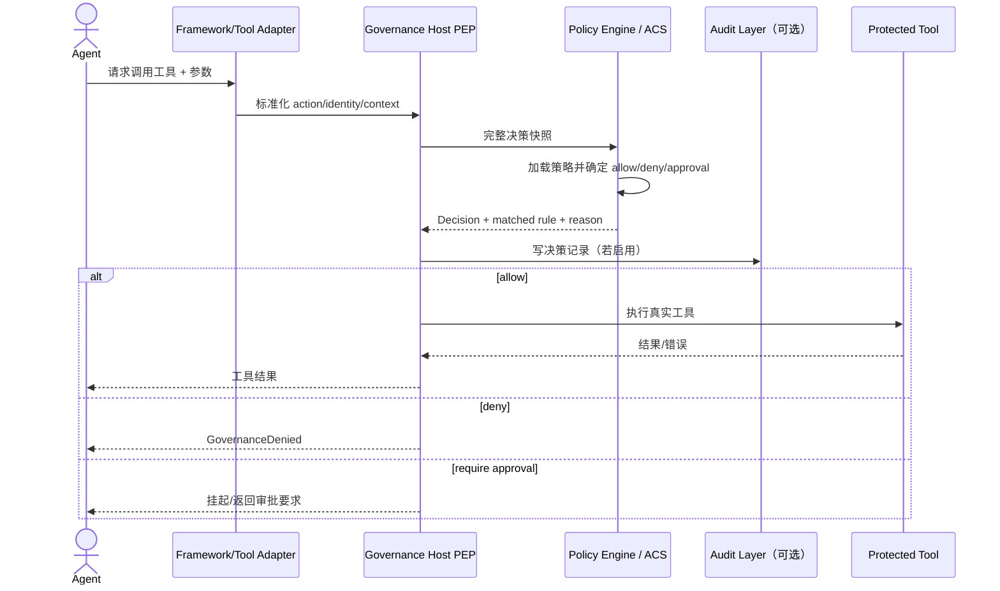
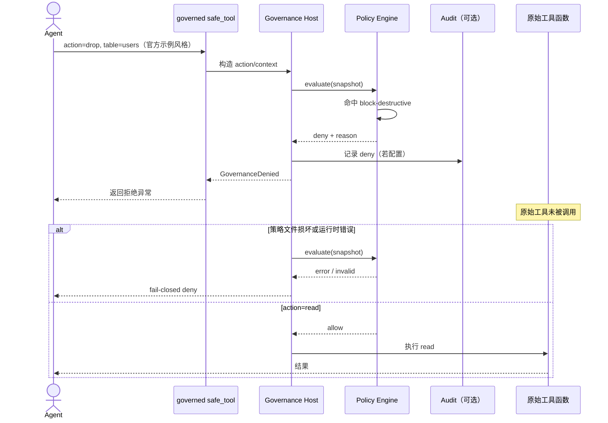

# microsoft/agent-governance-toolkit 项目深度解析

## 1. 项目概览

- 报告日期：2026-07-29
- 仓库地址：https://github.com/microsoft/agent-governance-toolkit
- Trending 原始排名：10
- Stars Today：46
- 项目定位：为自主 AI Agent 提供策略执行、身份、执行隔离、审计、可靠性与合规工具的多语言治理工具包。
- 解决的问题：Agent 调用工具、数据库、网络和其他 Agent 时，仅靠提示词无法形成确定性权限边界，也难以回答“谁做了什么、为何允许”。
- 目标用户：将 Agent 接入企业 API、数据、代码执行、邮件或高风险工具的平台团队与安全团队。
- 当前成熟度：Public Preview；官方称发布质量较高，但 GA 前仍可能有破坏性变化。
- 推荐结论：值得研究。它把治理放在模型意图到达外部工具之前的应用代码路径，并提供明确的 allow/deny/require_approval 决策模型。

## 2. 系统架构

### 2.1 架构概览

工具包采用分层、可选组合的架构。最小使用方式是用 `agentmesh.governance.govern()` 包装一个工具函数；包装器在每次调用前读取策略并执行决策，拒绝时抛出 `GovernanceDenied`。更完整的路径通过 Agent Control Specification（ACS）把主机整理的 JSON 决策快照交给无状态、确定性、fail-closed 的策略运行时；策略层可配合身份、沙箱、审计、SRE、合规与多语言 SDK。README 明确说明各层可按风险逐步启用，并不要求一次部署所有组件。

### 2.2 架构图

```mermaid
flowchart LR
    A[Agent / Framework Adapter] --> W[govern() Wrapper<br/>Host Enforcement Point]
    W --> SNAP[Action + Identity + Context<br/>Decision Snapshot]
    SNAP --> PDP[Policy Decision Point<br/>agt-policies / ACS]
    POL[YAML / OPA / Cedar Policy] --> PDP
    ID[Identity<br/>DID/SPIFFE/mTLS 可选] --> SNAP
    PDP -->|allow| TOOL[Protected Tool]
    PDP -->|deny| DENY[GovernanceDenied]
    PDP -->|require approval| APPROVAL[Approval Flow]
    PDP --> REC[Decision Record / Audit 可选]
    TOOL --> OUT[Tool Result]
    RUNTIME[Sandbox / Runtime 可选] --> TOOL
    SRE[Kill Switch / SLO / Chaos 可选] --> W
```

### 2.3 核心模块

| 模块 | 职责 | 代码位置 | 关键依赖 | 证据级别 |
|---|---|---|---|---|
| Governance wrapper | 包装工具函数、在调用前评估策略并执行结果 | `agent-governance-python/agent-mesh/`；官方 `agentmesh.governance.govern` 示例 | Python decorators/wrappers | High |
| Agent OS / Core | 策略引擎、Agent 生命周期和治理门 | `agent-governance-python/agent-os/` 及 consolidated core | Python | High |
| ACS Policy Engine | 无状态、确定性、fail-closed 决策运行时 | `policy-engine/`，含 Rust core、Python bridge、policy/spec/tests | Rust, Python bridge | High |
| Identity/Mesh | Agent 发现、路由、信任与身份上下文 | `agent-governance-python/agent-mesh/` | DID/SPIFFE/mTLS integrations | Medium |
| Runtime | 执行沙箱与 privilege rings | `agent-governance-python/agent-runtime/` | OS/container integrations | High |
| Audit/Hypervisor | 执行审计、delta、命令 denylist 与承诺跟踪 | `agent-governance-python/agent-hypervisor/` | Python/runtime hooks | High |
| Agent SRE | Kill switch、SLO、混沌测试 | `agent-governance-python/agent-sre/` | monitoring hooks | High |
| Compliance | OWASP 检查、策略 lint、完整性验证与 red-team CLI | `agent-governance-python/agent-compliance/` | CLI, policy/schema checks | High |
| 多语言 SDK | TypeScript、.NET、Rust、Go 接入 | 仓库对应语言目录与 README 示例 | 各语言运行时 | High |

### 2.4 数据与状态管理

- 策略文档可用 YAML 描述默认动作、条件、优先级、审批人与说明。
- ACS 设计强调由 host 组装“完整 JSON snapshot”后一次性决策；策略运行时本身无状态。
- 决策可形成 audit/decision record，但记录存储形态取决于启用的审计层；本次没有把它虚构为固定数据库。
- Approval、身份、SRE 与 runtime 状态属于可选层；最小 `govern()` 示例不自动证明所有层都已启用。

### 2.5 外部集成与协议

- 策略：YAML、OPA、Cedar 等。
- 身份：SPIFFE、DID、mTLS 等可选集成。
- Agent 框架与 MCP：README 给出 MCP server、Claude Code 插件及多语言 SDK 接入。
- CI/合规：`agt verify`、`agt red-team`、`agt lint-policy` 等 CLI 可进入流水线。

### 2.6 部署与运行形态

- Python：`pip install agent-governance-toolkit[full]`；基础 wheel 主要安装 compliance CLI，治理模块由 consolidated core 提供。
- 语言 SDK：npm、NuGet、Rust、Go。
- Policy Engine：仓库含 Rust core、Python bridge、Kubernetes sidecar/部署目录、测试和规格文档。
- 运行位置可以是应用进程内 wrapper、框架 adapter 或更隔离的策略/sidecar 形态；不能把所有部署形态都说成默认。

## 3. 主线流程

### 3.1 核心流程图



### 3.2 关键步骤

1. Agent 或框架 adapter 提交工具名、参数、Agent 身份与上下文。
2. Host enforcement point 标准化输入，并构造策略所需的完整决策快照。
3. Policy Engine 根据默认动作与规则评估，给出允许、拒绝或需要审批。
4. Host 必须执行决策；拒绝时不调用底层工具。
5. 若启用审计层，记录策略版本、请求、命中规则与决策。
6. 允许时才执行工具，结果再返回 Agent。

### 3.3 异常与失败处理

- ACS 明确采用 fail-closed：策略运行时错误、输入不完整或无法可靠决策时应拒绝，而不是“先执行再说”。
- `GovernanceDenied` 把拒绝规则与说明返回调用方，形成可解释失败。
- README 提醒 `agent_os` 旧分发包已弃用并会发出 `DeprecationWarning`；新代码应使用 consolidated core / AGT 5 policy APIs。
- 审批服务不可用、审计写入失败与不同 adapter 的错误语义需按具体集成验证，本次不假设自动重试。

## 4. 典型业务场景端到端执行链路

### 4.1 场景定义

| 项目 | 内容 |
|---|---|
| 场景名称 | 数据库 Agent 尝试执行破坏性 `drop` 动作，治理层在工具调用前拒绝并保留决策依据 |
| 参与者 | Agent、`govern()` 包装器/Host PEP、Policy Engine、审计层（可选）、被保护的数据库工具函数 |
| 前置条件 | 已安装 `[full]`；工具函数被 `govern()` 包装；策略包含 `action.type in ['drop','delete','truncate']` → deny 规则 |
| 输入 | **官方示例风格输入**：`safe_tool(action="drop", table="users")`；表名仅为示例，不代表项目内置数据库 Schema |
| 期望结果 | 策略命中 `block-destructive`；底层工具未执行；调用方收到 `GovernanceDenied`；启用审计时产生决策记录 |
| 成功判定 | 工具函数的执行计数保持不变；异常包含拒绝规则/说明；决策结果为 deny；若启用审计，可检索到相同 action 与 policy 信息 |

### 4.2 端到端时序图



### 4.3 执行步骤追踪

| 步骤 | 输入 | 执行组件 | 关键代码位置 | 状态或数据变化 | 输出 | 失败分支 | 证据级别 |
|---:|---|---|---|---|---|---|---|
| 1 | 原始工具函数 + `policy.yaml` | `govern()` | `agentmesh.governance` 官方 Quick Start；`agent-governance-python/agent-mesh/` | 创建受治理 wrapper，保存/引用策略配置 | `safe_tool` | 策略路径无效，初始化或首次调用失败 | High |
| 2 | `action=drop`, `table=users` | governed wrapper | 官方 README 示例 | 参数被标准化为 action/context；底层工具尚未执行 | 决策请求 | Adapter 未提供所需字段时进入失败决策 | High |
| 3 | 完整 snapshot | Host PEP | ACS host/bridge 文档，`policy-engine/` | 无业务数据写入；形成一次决策上下文 | JSON 决策输入 | snapshot 构造错误，fail-closed | High |
| 4 | snapshot + policy | Policy Engine/PDP | `policy-engine/core`、policy/spec/tests | 命中 `block-destructive`，结果变为 deny | decision、rule、reason | 策略解析/运行错误，fail-closed deny | High |
| 5 | deny decision | Host enforcement | wrapper/host integration | 明确阻止后续工具调用 | `GovernanceDenied` | Host 若忽略决策会破坏安全模型；属于集成缺陷 | High |
| 6 | decision metadata | Audit layer（可选） | README How It Works、Hypervisor/Compliance 组件 | 产生决策记录；存储后端未固定 | 可审计证据 | 审计未启用则没有持久记录，不能声称默认存在 | Medium |
| 7 | 拒绝异常 | Agent/framework | SDK/adapter | Agent 轮次获得可解释失败 | 规则名与说明 | 上层可改请求或申请审批；不应自动绕过 | High |
| 8 | `action=read`（对照） | 同一路径 | README 官方 allow 示例 | 策略结果 allow，才调用原工具 | `{'rows': 42}` 等示例结果 | 原工具自身错误按普通工具错误传播 | High |

### 4.4 关键状态与数据变化

- 策略状态：加载的 policy version/default/rules 决定当前决策。
- 决策状态：请求从 pending 变为 deny；命中规则和 reason 成为输出证据。
- 工具状态：破坏性调用的执行计数不变，说明没有越过 enforcement point。
- 审计状态：仅在审计层启用时追加 decision record；本报告不假设固定数据库或日志系统。
- Agent 状态：收到拒绝异常，可以修改动作、走审批或结束任务。

### 4.5 失败传播、重试与回滚

- **Fail-closed 分支**：策略文件损坏、运行时异常或必要上下文缺失时，ACS 目标语义是拒绝；失败从 PDP 返回 Host，再以拒绝形式传给 Agent。
- **审批分支**：规则可返回 `require_approval`，请求在获得批准前不应执行。具体审批服务和重试周期取决于部署配置，本次没有虚构队列或人工系统。
- **无需业务回滚**：deny 发生在真实工具之前，因此理想路径没有数据库回滚；这正是 pre-tool-call enforcement 的价值。若 Host 错误地先执行后评估，工具包无法替部署者自动撤销副作用。

### 4.6 最终业务结果

Agent 的破坏性数据库动作在到达真实工具之前被确定性拒绝，调用方得到明确规则和原因。对于团队，结果不只是“模型听话了”，而是可以用代码断言原始工具根本没有被调用，并在启用审计时保存决策证据。

### 4.7 最小复现与验证方法

1. `pip install agent-governance-toolkit[full]`。
2. 创建官方示例风格 `policy.yaml`，将 `drop/delete/truncate` 设为 deny。
3. 编写一个带调用计数器的示意工具函数；用 `govern(my_tool, policy="policy.yaml")` 包装。
4. 调用 `safe_tool(action="read", table="users")`，确认 allow 分支执行一次。
5. 调用 `safe_tool(action="drop", table="users")`，断言抛出 `GovernanceDenied` 且计数器不增加。
6. 故意破坏策略格式，验证部署使用的 policy runtime 是否 fail-closed。
7. 启用审计组件时，再验证 decision record 是否含策略、动作、身份和拒绝理由。

## 5. 技术栈

| 层次 | 技术 | 用途 | 是否核心 | 证据位置 |
|---|---|---|---|---|
| 语言与 SDK | Python, TypeScript, C#, Rust, Go | 多框架与多运行时接入 | 是 | README 多语言示例、仓库目录 |
| 策略 | YAML, OPA, Cedar | 描述 allow/deny/approval 规则 | 是 | README How It Works |
| 决策运行时 | Rust ACS core + Python bridge | 无状态、确定性、fail-closed 策略计算 | 是 | `policy-engine/` README/结构 |
| 身份 | DID, SPIFFE, mTLS | 绑定 Agent 身份与信任上下文 | 可选核心 | README architecture |
| 执行隔离 | Agent Runtime / privilege rings | 限制工具执行权限 | 可选 | package table |
| 协议集成 | MCP、框架 adapters | 在工具调用点接入治理 | 是 | README Quick Start/MCP example |
| 审计与合规 | Hypervisor, Compliance CLI | 决策记录、OWASP 验证、policy lint | 可选 | package table/CLI |
| SRE | Kill switch, SLO, chaos testing | 运行时风险控制 | 可选 | Agent SRE package |
| 部署 | pip/npm/NuGet/Cargo/Go、Docker/K8s sidecar | 分发和隔离部署 | 辅助 | badges、仓库目录 |

## 6. 创新点

### 创新点 1

- 类型：安全架构创新
- 传统方案：在 system prompt 中要求 Agent 不调用危险工具，控制依赖概率性模型行为。
- 当前方案：在模型意图到达真实工具前，由确定性 policy engine 决策并由 Host 强制执行。
- 实际收益：deny 动作在正确集成下结构上无法到达工具，且可以单元测试“原工具未调用”。
- 证据：README 对 prompt-level safety 与 deterministic interception 的说明、`govern()` 示例。
- 局限：如果部署者绕过 wrapper、Host 不执行决策或与高权限工具共进程且存在其他逃逸路径，治理边界会失效。

### 创新点 2

- 类型：协议/工程整合创新
- 传统方案：各 Agent 框架、语言和工具协议分别实现权限逻辑，策略与证据格式碎片化。
- 当前方案：以 ACS、统一决策模型和多语言 SDK连接 Python、TypeScript、.NET、Rust、Go 与 MCP。
- 实际收益：策略、决策理由和合规验证可以跨框架复用。
- 证据：README Packages、多语言示例、policy-engine 规格。
- 局限：跨语言实现的一致性仍需 conformance tests 和版本治理，Public Preview 期间接口可能变化。

## 7. 应用场景

### 适合

- Agent 连接数据库、邮件、文件、Shell、云 API 或企业系统。
- 需要 allow/deny/approval、Agent 身份与审计记录的生产候选系统。
- 在 CI 中执行 policy lint、合规检查和 prompt/security 测试。

### 可以尝试

- 多 Agent trust mesh、sidecar policy runtime 和复杂身份体系；需要安全架构评审与故障演练。
- 用于高监管行业的证据基础；仍需结合组织控制、法规映射和独立审计。

### 暂不建议

- 把 `govern()` 两行示例误认为完整零信任架构。
- 在未验证 adapter 覆盖率、旁路路径、fail-closed 和审计完整性前直接宣称“Agent 已安全”。

## 8. 第一次阅读与验证建议

1. 先读 README 的 Problem、Quick Start、How It Works 和 Packages。
2. 跑 `govern()` allow/deny 最小示例，给原工具加计数器验证 pre-call 拦截。
3. 读 `policy-engine/` 的 ACS、Rust core、Python bridge、host snapshot 与 tests。
4. 再按需要研究 Agent Runtime、Hypervisor、SRE 和 Compliance，避免把可选层混成默认架构。
5. 对目标 Agent 框架做旁路测试：列出所有工具入口，确认每条都经过同一 enforcement point。

## 9. 风险与限制

- 安全：治理 wrapper 的覆盖率和不可绕过性是核心；同进程 hook 不能替代 OS/容器隔离。
- 性能：每次工具调用增加决策与审计开销，应按策略复杂度和并发压测。
- 许可证：项目 MIT；OPA、Cedar、身份/沙箱等依赖与部署组件需单独核验。
- 维护状态：Public Preview；README 已说明旧 `agent-os-kernel` 分发弃用和新 core 迁移。
- 生产可用性：需要 threat model、密钥与身份管理、审计存储、审批可用性、kill switch 和 incident response 配套。

## 10. Evidence Notes

- README 明确给出 `govern()`、YAML policy、allow/deny 示例、`GovernanceDenied` 和分层架构。
- README 标记 Public Preview，并说明基础 wheel、`[full]`、consolidated core 与 legacy `agent_os` 兼容警告。
- `policy-engine/` 公开 Rust core、Python bridge、policy/spec/tests、部署目录，并声明 stateless、deterministic、fail-closed。
- 本报告没有虚构固定审计数据库、审批队列或默认微服务；这些取决于可选组件和部署。

## 11. Honest Caveat

本报告是静态源码与官方文档分析，没有对所有 992 项或官方宣称的合规覆盖做独立复跑，也没有完成外部渗透测试。主线 allow/deny 流程证据充分；审计持久化、审批系统、身份和沙箱属于可选层，不能因为仓库存在相应包就声称每次 `govern()` 调用默认启用。示例表名和动作来自官方 Quick Start 风格，仅用于说明链路。

## 12. 可信度

- Architecture Confidence: High
- Flow Confidence: High
- Innovation Confidence: Medium
