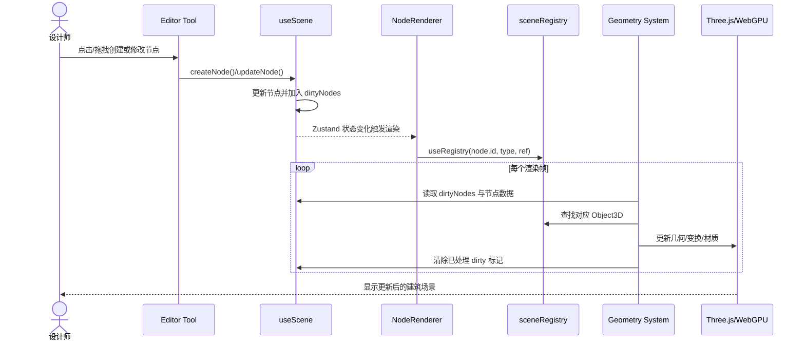
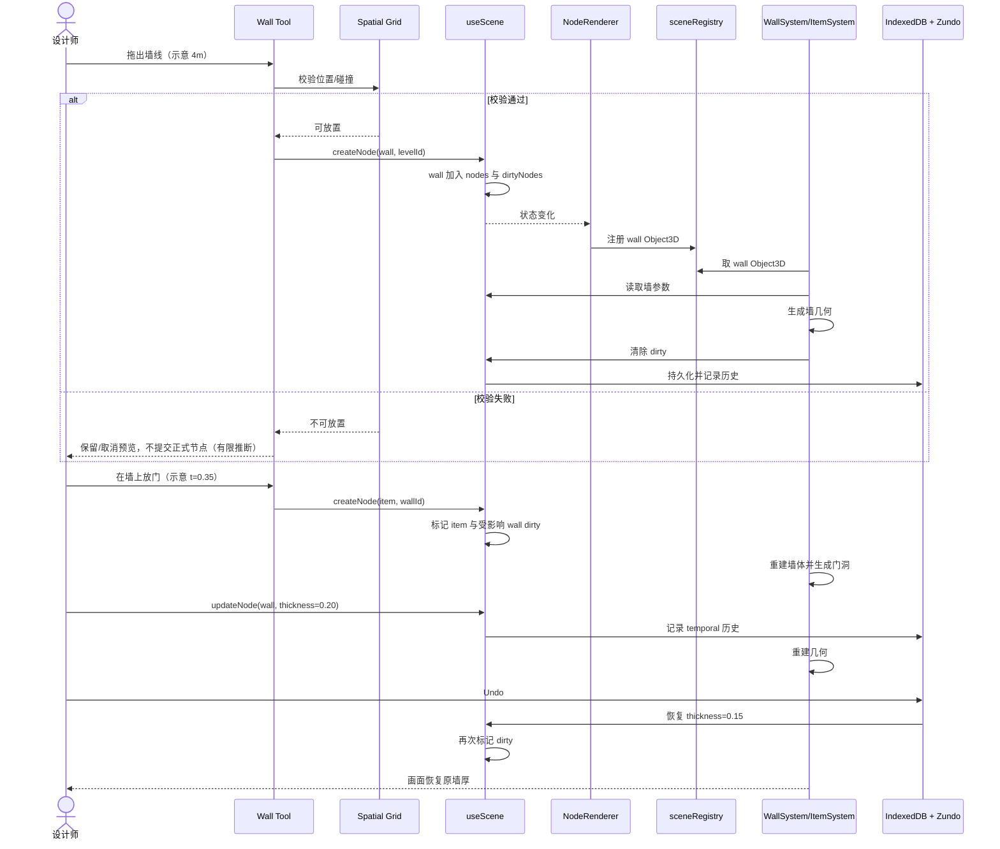

# pascalorg/editor 项目深度解析

## 1. 项目概览

- 报告日期：2026-07-29
- 仓库地址：https://github.com/pascalorg/editor
- Trending 原始排名：1
- Stars Today：341
- 项目定位：基于 React Three Fiber 与 WebGPU 的浏览器端 3D 建筑编辑器和可嵌入 Viewer。
- 解决的问题：在 Web 环境中管理建筑节点、编辑交互、3D 渲染、几何增量更新、持久化与插件扩展。
- 目标用户：建筑软件开发者、3D Web 工程师、需要嵌入式建筑查看器或垂直编辑器的团队。
- 当前成熟度：早期可用、持续演进的开发项目；已发布多个 npm 包，但仍需按真实模型规模验证。
- 推荐结论：值得研究。仓库公开了清晰的分包边界、状态模型、dirty-node 更新机制和插件契约，适合学习浏览器专业编辑器的工程拆分。

## 2. 系统架构

### 2.1 架构概览

仓库是 Turborepo monorepo。`apps/editor` 是 Next.js 宿主；`packages/core` 提供节点 Schema、场景状态、registry、空间查询和事件总线；`packages/viewer` 提供 React Three Fiber/WebGPU 渲染运行时；`packages/editor` 提供编辑工具和 UI；`packages/nodes` 通过同一插件契约注册内置节点、渲染器、几何系统和工具。系统不是把场景做成嵌套对象树，而是以扁平 `Record<id, Node>` 存储，通过 `parentId` 与 `children` 表达层级。

### 2.2 架构图

```mermaid
flowchart LR
    U[设计师] --> APP[apps/editor<br/>Next.js Host]
    APP --> E[@pascal-app/editor<br/>工具/面板/选择]
    E --> C[@pascal-app/core<br/>Schema/useScene/Event Bus]
    C --> IDB[(IndexedDB<br/>场景持久化)]
    C --> HIST[Zundo<br/>撤销/重做]
    C --> R[@pascal-app/viewer<br/>R3F/WebGPU]
    N[@pascal-app/nodes<br/>内置插件] --> C
    N --> R
    R --> REG[sceneRegistry<br/>Node ID → Object3D]
    R --> SYS[Wall/Slab/Item 等 Systems]
    SYS --> REG
    SYS --> GPU[Three.js WebGPU Renderer]
```

### 2.3 核心模块

| 模块 | 职责 | 代码位置 | 关键依赖 | 证据级别 |
|---|---|---|---|---|
| Next.js 宿主 | 组装编辑器包、页面与运行环境 | `apps/editor/` | Next.js 16, React 19 | High |
| Core 场景模型 | 节点 Schema、CRUD、dirty 集合、层级关系 | `packages/core/src/store/use-scene.ts`、`packages/core/src/schemas/` | Zustand, Zod | High |
| Scene Registry | 将节点 ID 与 Three.js `Object3D` 建立快速映射 | `packages/core/src/hooks/scene-registry/scene-registry.ts` | Three.js | High |
| Viewer | 场景渲染、相机、控制器和显示模式 | `packages/viewer/` | React Three Fiber, Drei, WebGPU | High |
| Node Renderers | 为各节点创建 Mesh/Group，占位并注册引用 | `packages/nodes/` 内各 node renderer | React, Three.js | High |
| Geometry Systems | 每帧处理 dirty 节点，更新墙、板、屋顶、物件几何与变换 | `packages/nodes/` 与系统目录；README 明列 Wall/Slab/Ceiling/Roof/Item System | `useFrame`, three-bvh-csg | High |
| Editor Tools | Wall、Zone、Item、Slab、Select 等交互工具 | `packages/editor/` | Core store, event bus, spatial queries | High |
| Plugin Loader | 注册第三方 node kind、渲染器、工具、Inspector 和面板 | Core `Plugin` manifest；官方 `plugin-trees` 示例 | Registry contracts | High |

### 2.4 数据与状态管理

- `useScene`：保存节点字典、根节点 ID、dirty 节点集合与 CRUD；使用 IndexedDB 持久化，排除 transient 节点；通过 Zundo 保留 50 步撤销/重做历史。
- `useViewer`：保存 Building/Level/Zone 选择、层级显示模式和相机模式。
- `useEditor`：保存当前工具、结构层可见性、面板状态和编辑器偏好。
- 渲染对象不作为业务数据源；`sceneRegistry` 只是节点 ID 到 Three.js 对象的运行时索引。

### 2.5 外部集成与协议

- 浏览器 IndexedDB：本地场景持久化。
- WebGPU/Three.js：3D 渲染。
- 插件 manifest：第三方扩展节点、渲染、工具和面板；本次未发现需要远端微服务才能完成基本编辑的证据。
- typed event bus（`mitt`）：节点点击、悬停、上下文菜单与网格事件。

### 2.6 部署与运行形态

- 开发：根目录 `bun install` 后由 Turborepo 启动各 workspace。
- 应用：Next.js Web 应用。
- 嵌入：`@pascal-app/core`、`viewer`、`editor`、`nodes` 以 npm 包形式使用。
- 本次没有发现必须存在的数据库服务器、消息队列或微服务；场景持久化证据指向浏览器 IndexedDB。

## 3. 主线流程

### 3.1 核心流程图



### 3.2 关键步骤

1. 工具把鼠标/触控事件转换成节点创建或更新请求。
2. `useScene` 修改扁平节点字典，并将相关节点加入 `dirtyNodes`。
3. React 渲染器创建或更新 Three.js 对象，通过 `useRegistry` 登记运行时引用。
4. Wall、Slab、Item 等系统在 `useFrame` 中只处理 dirty 节点，通过 registry 直接定位对象并更新几何。
5. 持久化中间件将非 transient 场景数据保存到 IndexedDB；temporal 中间件形成撤销历史。

### 3.3 异常与失败处理

- 放置工具可调用 spatial grid manager 校验地板、墙面位置与碰撞；校验不通过时应阻止正式节点提交。README 证明存在 `canPlaceOnFloor`、`canPlaceOnWall` 等接口，但具体 UI 提示路径未逐函数验证。
- 若新节点已进入 Store 而 renderer 尚未注册对象，几何系统需要等待后续 React 渲染帧；本次没有证据表明它会向用户抛出持久错误。
- 几何生成失败、IndexedDB 配额耗尽和 WebGPU 设备丢失的完整恢复策略未在本次阅读范围中确认。

## 4. 典型业务场景端到端执行链路

### 4.1 场景定义

| 项目 | 内容 |
|---|---|
| 场景名称 | 设计师在当前楼层绘制一面墙、放置门洞并撤销一次墙厚调整 |
| 参与者 | 设计师、Wall/Item Tool、`useScene`、NodeRenderer、sceneRegistry、Wall/Item System、IndexedDB、Zundo |
| 前置条件 | 编辑器已启动；已存在 Site、Building、Level；当前楼层被选中；浏览器支持项目所需渲染能力 |
| 输入 | **示意输入**：墙起点 `(0,0)`、终点 `(4,0)`；门在墙长 35% 处；墙厚从 `0.15m` 调整为 `0.20m` 后执行 Undo |
| 期望结果 | 场景出现墙体和门洞；厚度修改可见；Undo 后恢复为原厚度；非 transient 数据进入本地持久化 |
| 成功判定 | `useScene` 中墙与门节点存在且层级正确；dirty 标记被处理；渲染对象几何更新；Undo 后节点厚度恢复；刷新后已提交场景仍可水合 |

### 4.2 端到端时序图



### 4.3 执行步骤追踪

| 步骤 | 输入 | 执行组件 | 关键代码位置 | 状态或数据变化 | 输出 | 失败分支 | 证据级别 |
|---:|---|---|---|---|---|---|---|
| 1 | **示意**墙起终点 | Wall Tool | `packages/editor/` 的工具实现；README Tools 章节 | 工具进入绘制状态，可能创建 transient 预览 | 墙线预览 | 坐标无效或未选楼层时不应提交；具体提示未确认 | Medium |
| 2 | 墙位置与尺寸 | Spatial Grid Manager | Core spatial query API，README 列出 `canPlaceOnFloor/canPlaceOnWall` | 无持久状态变化 | 可放置/不可放置结果 | 返回 false，工具阻止正式提交（有限推断） | Medium |
| 3 | Wall Node + `levelId` | `useScene.createNode` | `packages/core/src/store/use-scene.ts` | `nodes` 增加墙；父子引用更新；墙进入 `dirtyNodes` | 新墙 ID | Schema/父节点不合法时的完整错误路径未确认 | High |
| 4 | 墙节点 | NodeRenderer + `useRegistry` | `packages/nodes/` renderers；`packages/core/src/hooks/scene-registry/scene-registry.ts` | Three.js Mesh/Group 创建；registry 增加映射 | 可被系统定位的 Object3D | ref 尚未就绪则等待后续帧 | High |
| 5 | dirty wall | WallSystem | 内置 node systems；README Systems/Dirty Nodes | 墙几何与变换更新；dirty 标记删除 | 可见墙体 | CSG/几何异常的恢复未确认 | High |
| 6 | **示意**门位置 | Item Tool + `useScene` | Editor tool；Core store | 门作为墙子节点写入；受影响节点 dirty | 门节点 | 位置冲突则拒绝放置 | Medium |
| 7 | 墙与门节点 | WallSystem/ItemSystem | README 明确 WallSystem 处理门窗 CSG cutout | 墙几何重新生成，形成开洞 | 墙体门洞 | 复杂 CSG 失败策略未确认 | High |
| 8 | thickness `0.15→0.20` | `useScene.updateNode` | `use-scene.ts` | 节点参数变化；dirty；Zundo 增加历史 | 新厚度几何 | 连续拖动可能产生较多更新，节流策略未确认 | High |
| 9 | Undo | Zundo temporal store | README Scene State middleware | 恢复上一节点状态，再次触发 dirty | 原厚度恢复 | 历史超过 50 步时更早状态不可撤回 | High |
| 10 | 已提交场景 | Persist middleware | `useScene` 持久化配置 | 非 transient 节点写入 IndexedDB | 刷新后可水合场景 | 配额/序列化失败处理未逐文件验证 | High |

### 4.4 关键状态与数据变化

- 场景：`nodes[wallId]`、`rootNodeIds` 或父节点 `children` 发生变化。
- 增量队列：`dirtyNodes` 先加入墙/物件，再由对应 system 清除。
- 运行时索引：`sceneRegistry.nodes` 增加 Node ID → `Object3D` 映射。
- 撤销历史：墙厚修改形成 temporal history entry；Undo 恢复旧值。
- 持久化：非 transient 节点写入浏览器 IndexedDB；未发现服务端数据库是基本编辑的必需组件。

### 4.5 失败传播、重试与回滚

- **校验失败分支**：spatial grid 判定不可放置时，工具应停止正式 `createNode`；由于本次未逐行读取工具 UI，预览颜色和提示文案只作为有限推断，不写成项目事实。
- **渲染时序分支**：registry 对象尚未注册时，system 无法立即更新目标对象；React 完成下一次渲染和 `useRegistry` 后可在后续帧重试处理 dirty 节点，这是从公开 processing pattern 得出的合理推断。
- **业务回滚**：用户通过 Zundo Undo 恢复墙厚。它是业务状态回滚，不代表 IndexedDB 写入事务或几何计算具备数据库式事务语义。

### 4.6 最终业务结果

用户得到一面可编辑、可持久化、带门洞且可撤销修改的墙。核心价值不是“画了一个盒子”，而是同一次操作跨过工具交互、节点状态、运行时 registry、增量几何系统、渲染和本地历史管理，同时保持这些层彼此解耦。

### 4.7 最小复现与验证方法

1. 克隆仓库并在根目录运行 `bun install`、`bun dev`。
2. 打开编辑器，创建或载入最小 Site → Building → Level。
3. 使用 Wall Tool 创建墙，再放置门类 Item；观察墙几何是否形成 cutout。
4. 调整墙厚后执行 Undo，确认数据和画面恢复。
5. 刷新页面，确认非 transient 场景由 IndexedDB 水合。
6. 在开发工具中订阅 `useScene`，观察 `dirtyNodes` 从加入到清除；该步骤属于源码验证，不是项目官方 UI 功能。

## 5. 技术栈

| 层次 | 技术 | 用途 | 是否核心 | 证据位置 |
|---|---|---|---|---|
| 语言与运行时 | TypeScript, React 19 | 应用、组件与节点类型 | 是 | 根 `package.json`、README |
| Web 应用 | Next.js 16 | 编辑器宿主 | 是 | `apps/editor/`、README |
| 3D 渲染 | Three.js, WebGPU, React Three Fiber, Drei | 场景、相机、交互和 GPU 渲染 | 是 | README Technology Stack |
| 状态 | Zustand | Scene/Viewer/Editor 三套 Store | 是 | README Stores |
| Schema | Zod | 节点类型与输入约束 | 是 | `packages/core`、README |
| 历史 | Zundo | 50 步撤销/重做 | 是 | README Scene State |
| 本地数据 | IndexedDB | 非 transient 场景持久化 | 是 | README Store middleware |
| 几何 | three-bvh-csg | 墙体等布尔几何操作 | 核心场景使用 | README Stack |
| 构建 | Turborepo, Bun | monorepo、开发与发布 | 是 | 根 `package.json` |
| 测试/质量 | Biome, TypeScript checks | lint、format、类型检查 | 辅助 | 根 `package.json` scripts |

## 6. 创新点

### 创新点 1

- 类型：架构创新 / 性能工程
- 传统方案：React 状态变化后广泛遍历场景树或重建大量几何。
- 当前方案：业务节点存在扁平 Store 中；`dirtyNodes` 标记增量变化；registry 让 system 直接定位目标 `Object3D`。
- 实际收益：减少无关节点重算，并把 React 声明式渲染与帧循环中的命令式几何更新连接起来。
- 证据：README 的 Scene Registry、Systems、Dirty Nodes 和 Data Flow。
- 局限：尚未独立量化大型模型下的帧时间、内存和 dirty 扩散范围。

### 创新点 2

- 类型：工程整合创新
- 传统方案：编辑器内部节点、工具与渲染器使用私有扩展点，第三方难以复用。
- 当前方案：内置节点也通过同一个 `Plugin` manifest 注册，没有另设内部 API。
- 实际收益：插件开发者可以沿用产品自身的节点 Schema、3D/2D 渲染、工具、Inspector 和面板契约。
- 证据：README Building a Plugin 与 `plugin-trees` 示例。
- 局限：插件 API 的版本稳定性、隔离和权限边界需继续观察。

## 7. 应用场景

### 适合

- 研究浏览器端 3D/CAD 类编辑器的状态与渲染架构。
- 构建建筑空间概念设计、查看器或垂直节点插件。
- 需要本地优先、可撤销、可嵌入 3D 场景编辑的产品原型。

### 可以尝试

- 中等规模建筑模型协作工具；需要自行补充服务端同步、冲突处理和权限系统。
- 复杂几何与扫描数据场景；应先做 WebGPU/内存/帧率压测。

### 暂不建议

- 在没有格式、精度、法规和性能验证的情况下直接替代成熟 BIM/CAD 生产链。
- 把 IndexedDB 当成多人协作数据库；仓库当前基本架构证据没有支持这一结论。

## 8. 第一次阅读与验证建议

1. 先读 README 的 Repository Architecture、Stores、Nodes、Scene Registry、Systems 与 Data Flow。
2. 再看 `packages/core/src/store/use-scene.ts` 和 scene registry，实现数据源与运行时对象如何分离。
3. 沿一个 Wall renderer 和 WallSystem 追踪 placeholder mesh 到真实几何更新。
4. 运行最小编辑场景，观察 dirty 集合和 Undo/Redo。
5. 最后阅读插件文档与 `pascalorg/plugin-trees`，验证内置/外部插件是否共享契约。

## 9. 风险与限制

- 安全：插件可接触编辑器能力，第三方插件信任与隔离策略未在本次确认。
- 性能：大型建筑、复杂 CSG、扫描数据与移动设备 WebGPU 表现未独立压测。
- 许可证：仓库 README 标明 MIT；依赖和插件需分别核验许可证。
- 维护状态：活跃开发中，包 API 与节点 Schema 可能继续变化。
- 生产可用性：适合作为工程研究和产品基础候选，但替代专业 BIM/CAD 前需要格式互操作、精度、协作、备份与合规验证。

## 10. Evidence Notes

- README：明确项目是 React Three Fiber/WebGPU 3D building editor，并完整说明 monorepo、Store、节点、registry、systems、event bus、spatial grid 和插件。
- 根 `package.json`：确认 Bun workspace、Turborepo build/dev、Biome 与类型检查。
- 关键路径：`packages/core/src/store/use-scene.ts`、`packages/core/src/hooks/scene-registry/scene-registry.ts`、`packages/viewer/`、`packages/editor/`、`packages/nodes/`。
- 未根据目录名补画服务端、队列、云数据库或多人协作组件。

## 11. Honest Caveat

本报告属于源码与官方 README 的静态分析。主线数据流由维护者文档明确给出，架构结论可信度较高；但放置失败的具体 UI 反馈、WebGPU 设备恢复、IndexedDB 写入错误和复杂几何边界没有逐函数执行验证。示意尺寸与坐标仅用于解释业务链路，不是项目官方示例格式。

## 12. 可信度

- Architecture Confidence: High
- Flow Confidence: High
- Innovation Confidence: Medium
