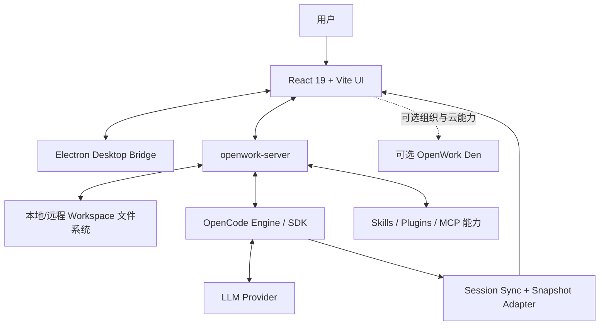
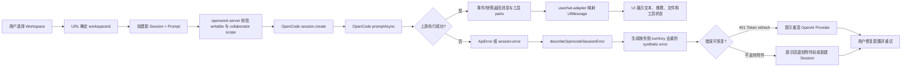
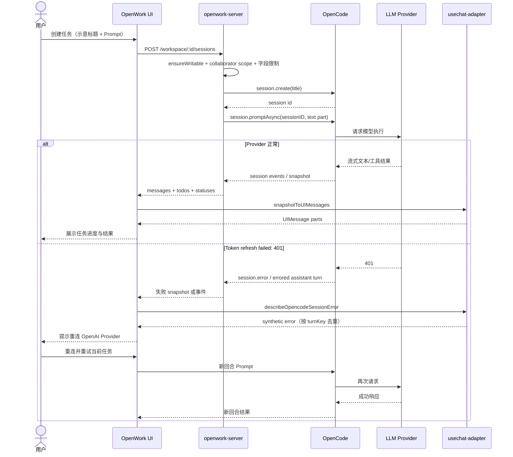

# different-ai/openwork 源码架构解析

- 报告日期：2026-07-30
- Trending 排名：#9
- 项目类型：AI 工作桌面、OpenCode 会话客户端与团队能力控制面
- 分析状态：SUCCESS
- Architecture Confidence：High
- Flow Confidence：Medium
- Innovation Confidence：Medium

## 1. 项目概览

OpenWork 是一个跨 Electron 与 Web 的 AI 工作桌面。核心 UI 使用 React 19 + Vite，同一前端通过 HTTP 连接 `openwork-server`、OpenCode 与可选的 Den 控制面；桌面端用于本地工作区，远程 Server 提供文件系统、会话、能力与审批接口，OpenCode 负责代理会话和工具执行。

仓库不是单一许可证：`/ee` 目录使用 Fair Source License，其余未受额外限制的内容采用 MIT。README 中的 OpenWork Den、组织策略、能力分发和托管服务，也不应与纯本地核心混为一谈。

本次选择“在远程工作区创建代码任务会话；Provider 鉴权失败后，UI 显示可恢复错误并重试”作为典型案例。可验证证据覆盖远程会话 API、OpenCode `promptAsync`、会话快照、UI Message 映射和 401 恢复提示；真实 Provider 重连后的完整网络回合未实际运行，因此 Flow 保持 Medium。

## 2. 系统架构

### 分层边界

- `src/app/`：框架无关客户端、桥接、协议类型与工具，不导入 React 层。
- `src/react-app/kernel`、`infra`、`domains`、`shell`：由底到顶组织 Provider、状态、业务域和路由；依赖规则由架构文档明确约束。
- `openwork-server`：独立于桌面应用的文件系统 API，代理 OpenCode，并提供 workspace、session、files、skills、plugins、MCP、audit、token 与 approvals 端点。
- OpenCode：会话、消息、todos、状态和工具执行的上游引擎。
- Den：可选组织控制面；本地工作区和核心桌面并不等于必须接入 Den。
- 未发现本业务案例必需的消息队列或独立缓存集群，不做虚构。

## 3. 核心模块及代码位置

| 模块 | 代码位置 | 已验证职责 | 证据级别 |
|---|---|---|---|
| 根工作区与运行脚本 | `package.json` | Electron、Web、Den、本地数据库、Docker、测试与发布命令 | High |
| React 应用 manifest | `apps/app/package.json` | React 19、Vite、OpenCode SDK、AI SDK、Query、Zustand、E2E/恢复测试 | High |
| 应用架构 | `apps/app/src/react-app/ARCHITECTURE.md` | 分层、Provider 栈、路由状态、工作台状态与测试策略 | High |
| Server 文档 | `apps/server/README.md` | 配置、Token、Workspace、OpenCode 代理、文件、审批和能力端点 | High |
| 会话路由 | `apps/server/src/routes/sessions.ts` | 创建/读取会话、调用 `opencode.session.promptAsync`、构建 snapshot、错误映射 | High |
| UI 会话适配 | `apps/app/src/react-app/domains/session/sync/usechat-adapter.ts` | 将 OpenCode parts/snapshot 映射为 AI SDK UIMessage，生成会话错误消息和恢复提示 | High |
| Session Route | `apps/app/src/react-app/shell/session-route.tsx` | URL 派生 workspace/session，装配会话域；由源码搜索定位 | Medium |
| OpenWork Server Client | `apps/app/src/app/lib/openwork-server.ts` | 前端与 Server 的框架无关客户端及快照类型 | Medium |
| 测试与 Evals | `apps/app/scripts/session-error-recovery.ts`、`evals/**` | 会话错误恢复、事件、文件系统、权限、切换和真实 UI 流程 | Medium |
| 许可证 | `LICENSE`、`ee/LICENSE` | 核心 MIT，`/ee` Fair Source | High |

## 4. 主线流程

### 状态与数据

- Workspace/Session 主身份由 URL 参数 `workspaceId`、`sessionId` 决定，不以全局 mutable state 覆盖。
- Server 侧会话创建输入包括 `title` 和可选 `prompt`，标题上限 120 字符，Prompt 上限 100,000 字符。
- OpenCode 快照包含 session、messages、todos 和 statuses；UI Adapter 将 text、reasoning、file、tool、agent、step-start 映射到 `UIMessage.parts`。
- 失败回合以 errored assistant message id 作为 `turnKey`，现场事件和重新加载 snapshot 会归并到同一 synthetic error message，避免重复错误卡片。
- Provider 401、上下文溢出、输出限制、消息中断和结构化输出失败会被归一化为用户可读文本。

## 5. 典型业务场景：创建代码修改任务，鉴权失败后修复并重试

### 5.1 场景定义

- 场景名称：远程工作区代码任务的会话创建与 Provider 错误恢复
- 参与者：用户、OpenWork React UI、OpenWork Server、Workspace、OpenCode SDK/Engine、LLM Provider、Session Sync Adapter
- 前置条件：
  1. OpenWork Server 已绑定一个可访问的工作区。
  2. 客户端持有至少 `collaborator` scope 的 Token，Server 处于可写模式。
  3. OpenCode Engine 可访问；LLM Provider 已配置但其 OAuth Token 可能过期。
- 输入：**示意输入**——标题“修复订单导出测试”，Prompt“定位失败测试，做最小修改并运行相关测试；不要改公开 API”。
- 期望结果：创建 Session，代理开始处理 Prompt，UI 流式显示消息、工具调用和结果；若 Provider Token 刷新失败，UI 给出重连提示，用户修复后在会话中重试。
- 成功判定：最终 Session 保留在指定 Workspace；错误回合只显示一条可读错误；修复鉴权后新的回合能够继续，不需要丢弃整个工作区。

### 5.2 Mermaid 时序图

### 5.3 逐步追踪表

| 步骤 | 输入 | 执行组件 | 关键代码位置 | 状态变化 | 输出 | 失败分支 | 证据级别 |
|---:|---|---|---|---|---|---|---|
| 1 | Workspace URL | React Shell/Route | `react-app/ARCHITECTURE.md`、`shell/session-route.tsx` | URL 成为 workspace/session 权威身份 | 目标 Workspace | 资源不存在时显示 not-found，不静默切到第一个工作区 | High |
| 2 | 标题与 **示意 Prompt** | Server Session Route | `apps/server/src/routes/sessions.ts` | 校验 Token scope、可写状态、标题与 Prompt 长度 | 合法创建请求 | viewer Token、只读模式或超长输入被拒绝 | High |
| 3 | title | OpenCode SDK | `createWorkspaceSession()` 中 `opencode.session.create` | 新 Session 建立 | session id | 上游 4xx/5xx 被映射为 ApiError | High |
| 4 | session id + text part | OpenCode SDK | 同文件 `opencode.session.promptAsync` | Session 开始执行 | `started=true` | Prompt 请求失败时返回 `opencode_request_failed`，Session 已创建但执行未开始/未完成 | High |
| 5 | 模型请求 | LLM Provider | OpenCode 上游，具体 Provider SDK 不在本次仓库展开 | assistant turn 进入运行或错误 | 文本/工具事件或错误 | OAuth refresh 401、上下文溢出、输出限制、结构化输出失败 | Medium |
| 6 | session/messages/todos/statuses | Server Read Model | `readWorkspaceSessionSnapshot()` | 聚合快照 | OpenWorkSessionSnapshot | Session 404 映射为 `session_not_found` | High |
| 7 | OpenCode parts | UI Adapter | `usechat-adapter.ts` | 转成 `UIMessage.parts` | text/reasoning/file/tool/agent/step-start | 不支持的或 synthetic/ignored parts 被安全过滤 | High |
| 8 | errored assistant message | UI Adapter | `describeOpencodeSessionError()`、`createSessionErrorUIMessage()` | 新增 `${prefix}${turnKey}` 错误消息 | 用户可读错误 | live event 与 snapshot 使用同一 turnKey，避免重复 | High |
| 9 | 401 文本 | Recovery Hint | `withOpenAiTokenRefreshHint()` | 错误文本改为明确的 Provider 重连指引 | 可执行恢复建议 | 仅对匹配的 401 Token refresh 情况改写，其他错误保留原因 | High |
| 10 | 修复后的新回合 | UI / OpenCode | 会话域与恢复测试路径 | 同一 Workspace/Session 继续追加消息 | 最终任务结果 | 本次未动态验证重连 Provider 的实际 OAuth UI | Medium |

### 5.4 关键状态或数据变化

1. URL：`/workspace/<workspaceId>/session` → `/workspace/<workspaceId>/session/<sessionId>`（**示意路径**）。
2. Server：无会话 → 新建 Session；若 Prompt 上游失败，Session 仍可能存在，错误在对应 assistant turn 表达。
3. Snapshot：messages/todos/statuses 随执行更新。
4. UI：OpenCode 原始 Part → AI SDK `UIMessage.parts`。
5. Error UI：无 → `synthetic-session-error:<turnKey>`；snapshot reload 不重复创建同一错误。
6. Provider 配置：失效 Token → 用户重连后的有效凭据；凭据存储和 OAuth 细节不在本次完整追踪。

### 5.5 失败传播与重试分支

- Client scope 不足：`requireClientScope(..., "collaborator")` 在调用 OpenCode 前拒绝，不产生 Session。
- OpenCode 创建失败：Server 包装上游状态和 Body，返回 `opencode_request_failed`。
- PromptAsync 失败：Session 创建与 Prompt 启动分成两步；失败信息包含上游状态、响应体和路径，便于定位。
- Provider 401：Adapter 把原始 `Token refresh failed: 401` 改写为“重试一次；再次发生则重连 OpenAI”的明确操作指引。
- 不支持附件：错误提示建议回退到附件发送之前，或新建会话，避免同一坏附件在服务器历史中反复触发。
- 错误重复：live `session.error` 与 snapshot reload 按同一失败 turn key 归并，不让用户看见两张一模一样的“坏消息双胞胎”。

### 5.6 最终业务结果

正常路径中，用户在指定工作区创建代理任务，OpenCode 执行并将文本、推理、文件与工具状态映射到统一 UI。失败路径中，系统保留会话上下文，把技术错误翻译为可恢复动作；用户修复 Provider 后可继续工作，而不是遇到 401 就把整个项目“超度”。

### 5.7 最小复现方法

> 命令、工作区路径、Token 和 Prompt 均为**示意**，不要把开发默认密钥用于生产。

1. 安装并运行 OpenCode Engine，准备一个测试代码目录。
2. 从源码启动 Server：`pnpm --filter openwork-server dev -- --workspace /tmp/demo-workspace --approval auto`。
3. 启动 UI：`pnpm dev`，连接本地 Server。
4. 创建标题“修复订单导出测试”的任务，提交上文 **示意 Prompt**。
5. 正常 Provider 下观察 Session、消息和工具 Part。
6. 在隔离测试环境让 OpenAI OAuth Token 失效，再提交新回合；预期出现单条重连提示。
7. 修复 Provider 后重试，确认新回合继续追加到正确 Workspace/Session。
8. 运行 `pnpm test:session-error-recovery`、`pnpm test:sessions` 和相关 `bun test`，验证仓库已有恢复与会话测试。

## 6. 分层技术栈

| 层 | 技术/模块 | 说明 |
|---|---|---|
| 桌面与 Web UI | React 19、Vite、Electron | 同一应用覆盖桌面和浏览器 |
| Shell/领域层 | React Router、Session/Workspace/Settings Domains | URL 身份、聊天工作台、连接与设置 |
| 状态与同步 | TanStack Query、Zustand、Global SDK/Sync Provider | 服务器数据、工作台状态和事件同步 |
| Agent 适配 | `@opencode-ai/sdk`、AI SDK UIMessage | Session、Prompt、Tool Part 与错误映射 |
| 本地/远程服务 | openwork-server、HTTP、Bearer Token | Workspace、文件、会话、技能、MCP、审计与审批 |
| 企业控制面 | OpenWork Den（可选） | 组织、团队、策略、推理与能力分发 |
| 质量与交付 | Bun/Node tests、Evals、Docker、pnpm | 单元、会话、权限、文件与真实 UI 流程 |

## 7. 创新点

1. 将 Workspace/Session 身份放在 URL，而不是依赖容易串台的全局选中状态，适配多工作区和分屏会话。
2. 框架无关 `app/` 层与 React 领域层之间有显式依赖规则，降低桌面、Web 和服务桥接互相缠绕。
3. OpenCode 的异构 Part 被映射为标准 UIMessage，同时保留文件来源、工具状态和 Provider metadata。
4. 错误消息以失败回合为键去重，并针对可恢复错误给出具体操作，而非只扔一段上游 JSON。
5. 本地桌面、远程 Server、MCP 能力和组织 Den 可以按部署规模组合，不强迫所有用户先上云。

## 8. 应用场景

- 面向代码或知识工作目录的 AI 桌面工作台。
- 团队共享 Skills、Plugins、MCP 与连接能力。
- 本地与远程工作区统一访问。
- 多 Session、多 Workspace 与分屏代理任务。
- 企业权限、模型提供方和桌面策略控制实验。

## 9. 阅读验证路径

1. `README.md`：理解 OpenWork Desktop、MCP 与 Den 的产品边界。
2. `LICENSE` 与 `ee/LICENSE`：先确认混合许可。
3. 根 `package.json`：识别 desktop、server、Den、Docker 与测试矩阵。
4. `apps/app/src/react-app/ARCHITECTURE.md`：建立前端层次与依赖方向。
5. `apps/server/README.md`：确认 Server 配置、端点、Token 与审批。
6. `apps/server/src/routes/sessions.ts`：追会话创建、Prompt 和 Snapshot。
7. `apps/app/src/react-app/domains/session/sync/usechat-adapter.ts`：追消息与错误如何进入 UI。
8. `apps/app/scripts/session-error-recovery.ts`、`evals/**`：通过测试和真实流程继续验证。
9. 再追 OpenCode 事件订阅与 Provider Auth UI，补齐动态重连链路。

## 10. 风险与限制

- `/ee` 为 Fair Source，不应把整个仓库笼统称为 MIT。
- `--approval auto` 只适合受控开发环境；生产写操作需要严格 Token scope 和人工审批策略。
- Server 能读写工作区文件并代理 Agent 工具，凭据泄漏可能造成代码和数据风险。
- Provider、MCP 与外部连接会带来密钥、费用、数据出境和供应商可用性问题。
- 多 Workspace 与远程文件操作需要防止路径混淆、陈旧 revision 和错误目标写入。
- 本次没有实际启动 Electron、OpenCode 和 Den，也没有完成真实 OAuth 重连。

## 11. Evidence Notes

- `README.md`：桌面应用、MCP 两工具、组织控制面与本地开发说明。
- 根 `package.json`：Electron、Den、Docker、会话恢复、权限、文件和 E2E 脚本。
- `apps/app/package.json`：React/Vite、OpenCode SDK、AI SDK、Query、Zustand 与测试入口。
- `react-app/ARCHITECTURE.md`：分层、依赖规则、Provider 栈、URL 权威状态和工作台控制协议。
- `apps/server/README.md`：文件系统 API、OpenCode Proxy、Token、Inbox/Outbox 与 Approval。
- `apps/server/src/routes/sessions.ts`：`session.create`、`promptAsync`、Snapshot 聚合和 API 错误映射。
- `usechat-adapter.ts`：Part 映射、错误归一化、401/附件恢复提示和失败回合去重。
- `LICENSE`：核心 MIT、`/ee` Fair Source 的明确边界。

## 12. Honest Caveat

本报告可以高可信说明 OpenWork 的分层、Server/OpenCode 边界、Session API 和 UI 错误恢复逻辑，但没有实际运行 LLM Provider、MCP 工具、Electron IPC 或 Den。尤其是“重连后继续执行”只由产品路径、错误提示和测试入口支撑，未在本轮完成真实 OAuth 故障注入，因此 Flow 评为 Medium。

## 13. 可信度说明

- Architecture：High。官方架构文档、manifest、Server 文档和源码对边界描述一致。
- Flow：Medium。会话创建、PromptAsync、Snapshot 与错误 UI 已逐文件验证；动态 Provider 重连与完整工具执行未跑通。
- Innovation：Medium。URL 权威状态、统一 Part 映射和按回合错误恢复有明确工程价值，但实际协作效率需运行验证。
